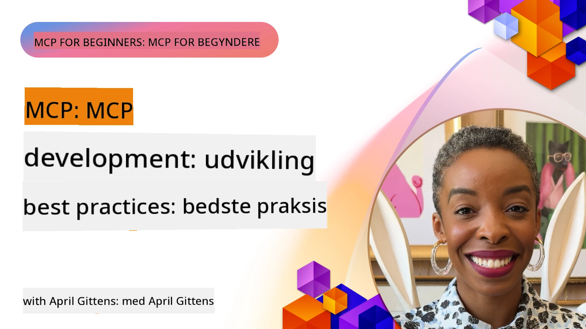

# Bedste praksis for MCP-udvikling

[](https://youtu.be/W56H9W7x-ao)

_(Klik på billedet ovenfor for at se video af denne lektion)_

## Oversigt

Denne lektion fokuserer på avancerede bedste praksisser for udvikling, test og implementering af MCP-servere og -funktioner i produktionsmiljøer. Efterhånden som MCP-økosystemer vokser i kompleksitet og betydning, sikrer overholdelse af etablerede mønstre pålidelighed, vedligeholdelse og interoperabilitet. Denne lektion samler praktisk viden fra virkelige MCP-implementeringer for at guide dig i at skabe robuste, effektive servere med effektive ressourcer, promptskabeloner og værktøjer.

## Læringsmål

Når du har gennemført denne lektion, vil du kunne:

- Anvende branchens bedste praksis i design af MCP-servere og funktioner
- Oprette omfattende teststrategier for MCP-servere
- Designe effektive, genanvendelige arbejdsgangsmønstre til komplekse MCP-applikationer
- Implementere korrekt fejlhåndtering, logning og observerbarhed i MCP-servere
- Optimere MCP-implementeringer for ydeevne, sikkerhed og vedligeholdelse

## MCP-kerneprincipper

Før vi dykker ned i specifikke implementeringsmetoder, er det vigtigt at forstå de grundlæggende principper, der guider effektiv MCP-udvikling:

1. **Standardiseret kommunikation**: MCP bruger JSON-RPC 2.0 som fundament, hvilket giver et konsekvent format til forespørgsler, svar og fejlhåndtering på tværs af alle implementeringer.

2. **Brugercentreret design**: Prioriter altid brugerens samtykke, kontrol og gennemsigtighed i dine MCP-implementeringer.

3. **Sikkerhed først**: Implementer robuste sikkerhedsforanstaltninger, herunder autentifikation, autorisation, validering og hastighedsbegrænsning.

4. **Modulær arkitektur**: Design dine MCP-servere med en modulær tilgang, hvor hvert værktøj og ressourcer har et klart, fokuseret formål.

5. **Eksplisit tilstand**: MCP `2026-07-28` er tilstandsløs på protokollaget.
   Når en arbejdsgang har brug for cross-call-tilstand, brug eksplisite håndtag eller
   almindelige værktøjsargumenter understøttet af varig applikationstilstand.

## Officielle MCP bedste praksisser

Følgende bedste praksisser er afledt af den officielle Model Context Protocol-dokumentation:

### Bedste praksisser for sikkerhed

1. **Brugersamtykke og kontrol**: Kræv altid eksplicit brugersamtykke, før du får adgang til data eller udfører operationer. Giv klar kontrol over, hvilke data der deles, og hvilke handlinger der er autoriseret.

2. **Databeskyttelse**: Eksponér kun brugerdata med eksplicit samtykke og beskyt dem med passende adgangskontroller. Beskyt mod uautoriseret dataoverførsel.

3. **Værktøjssikkerhed**: Kræv eksplicit brugersamtykke, før du aktiverer et værktøj. Sørg for, at brugere forstår hvert værktøjs funktionalitet, og håndhæv robuste sikkerhedsgrænser.

4. **Værktøjstilladelseskontrol**: Konfigurer, hvilke værktøjer en model må bruge for
   hver anmodning og autorisationskontekst, sikr at kun eksplicit autoriserede
   værktøjer er tilgængelige.

5. **Autentifikation**: Kræv korrekt autentifikation, før adgang til værktøjer, ressourcer eller følsomme operationer gives ved hjælp af API-nøgler, OAuth-tokens eller andre sikre autentifikationsmetoder.

6. **Parametervalidering**: Håndhæv validering for alle værktøjsaktiveringer for at forhindre fejlagtig eller ondsindet input i at nå værktøjsimplementeringerne.

7. **Hastighedsbegrænsning**: Implementer hastighedsbegrænsning for at forhindre misbrug og sikre retfærdig brug af serverressourcer.

### Bedste praksisser for implementering

1. **Kapabilitetsforhandling**: Forhandl understøttede protokolversioner og
   kapabiliteter. I MCP `2026-07-28` er hver anmodning selvstændig og kan
   bruge `server/discover`; ældre revisioner bruger initialiseringshandshake.

2. **Værktøjsdesign**: Opret fokuserede værktøjer, der klarer én opgave godt, frem for monolitiske værktøjer, der håndterer flere bekymringer.

3. **Fejlhåndtering**: Implementer standardiserede fejlkoder og -beskeder for at hjælpe med fejlfinding, håndtere fejl yndefuldt og levere brugbare tilbagemeldinger.

4. **Observerbarhed**: Brug `stderr` til stdio-diagnostik og OpenTelemetry
   til struktureret observerbarhed. MCP-loggingsfunktionen er forældet i
   `2026-07-28`-specifikationen.

5. **Fremskridtsopsporing**: For langvarige operationer, rapporter fremskridtsopdateringer for at muliggøre responsive brugergrænseflader.

6. **Anmodningsannullering**: Tillad klienter at annullere igangværende anmodninger, der ikke længere er nødvendige eller tager for lang tid.

## Yderligere referencer

For den mest opdaterede information om MCP bedste praksisser henvises til:

- [MCP-dokumentation](https://modelcontextprotocol.io/)
- [MCP-specifikation (2026-07-28)][mcp-2026-spec]
- [Tidligere MCP-specifikation (2025-11-25)](https://modelcontextprotocol.io/specification/2025-11-25)
- [MCP Tasks Extension][mcp-tasks-extension]
- [GitHub Repository](https://github.com/modelcontextprotocol)
- [Bedste praksisser for sikkerhed](https://modelcontextprotocol.io/docs/2026-07-28/tutorials/security/security_best_practices)
- [OWASP MCP Top 10](https://microsoft.github.io/mcp-azure-security-guide/) - Sikkerhedsrisici og afbødninger
- [MCP Security Summit Workshop (Sherpa)](https://azure-samples.github.io/sherpa/) - Praktisk sikkerhedstræning

### Lektion om pålidelighed som følgesvend

Generiske retry-løkker er usikre for værktøjer, der opretter billetter, betalinger,
beskeder, implementeringer eller andre virkelige effekter. Et svar kan gå tabt
efter at effekten er gennemført.

Brug lektionen om pålidelighed som følgesvend,
[Sikre retries for MCP-værktøjer: Et pålideligheds-sidecar-mønster][reliability-sidecar],
for at lære om stabile operationstaster, duplikatgodkendelse, checkpointning,
forsoning, bevisniveauer og fejlinduktion.

[mcp-2026-spec]: https://modelcontextprotocol.io/specification/2026-07-28
[mcp-tasks-extension]: https://modelcontextprotocol.io/extensions/tasks/overview
[reliability-sidecar]: ./reliability-sidecars/README.md

## Praktiske implementeringseksempler

### Bedste praksis for værktøjsdesign

#### 1. Princip om enkelt ansvar

Hvert MCP-værktøj bør have et klart, fokuseret formål. I stedet for at skabe monolitiske værktøjer, der prøver at håndtere flere aspekter, udvikl specialiserede værktøjer, der mestrer specifikke opgaver.

```csharp
// A focused tool that does one thing well
public class WeatherForecastTool : ITool
{
    private readonly IWeatherService _weatherService;
    
    public WeatherForecastTool(IWeatherService weatherService)
    {
        _weatherService = weatherService;
    }
    
    public string Name => "weatherForecast";
    public string Description => "Gets weather forecast for a specific location";
    
    public ToolDefinition GetDefinition()
    {
        return new ToolDefinition
        {
            Name = Name,
            Description = Description,
            Parameters = new Dictionary<string, ParameterDefinition>
            {
                ["location"] = new ParameterDefinition
                {
                    Type = ParameterType.String,
                    Description = "City or location name"
                },
                ["days"] = new ParameterDefinition
                {
                    Type = ParameterType.Integer,
                    Description = "Number of forecast days",
                    Default = 3
                }
            },
            Required = new[] { "location" }
        };
    }
    
    public async Task<ToolResponse> ExecuteAsync(IDictionary<string, object> parameters)
    {
        var location = parameters["location"].ToString();
        var days = parameters.ContainsKey("days") 
            ? Convert.ToInt32(parameters["days"]) 
            : 3;
            
        var forecast = await _weatherService.GetForecastAsync(location, days);
        
        return new ToolResponse
        {
            Content = new List<ContentItem>
            {
                new TextContent(JsonSerializer.Serialize(forecast))
            }
        };
    }
}
```

#### 2. Konsistent fejlhåndtering

Implementer robust fejlhåndtering med informative fejlmeddelelser og passende genopretningsmekanismer.

```python
# Python eksempel med omfattende fejlhåndtering
class DataQueryTool:
    def get_name(self):
        return "dataQuery"
        
    def get_description(self):
        return "Queries data from specified database tables"
    
    async def execute(self, parameters):
        try:
            # Parameter validering
            if "query" not in parameters:
                raise ToolParameterError("Missing required parameter: query")
                
            query = parameters["query"]
            
            # Sikkerhedsvalidering
            if self._contains_unsafe_sql(query):
                raise ToolSecurityError("Query contains potentially unsafe SQL")
            
            try:
                # Databaseoperation med timeout
                async with timeout(10):  # 10 sekunders timeout
                    result = await self._database.execute_query(query)
                    
                return ToolResponse(
                    content=[TextContent(json.dumps(result))]
                )
            except asyncio.TimeoutError:
                raise ToolExecutionError("Database query timed out after 10 seconds")
            except DatabaseConnectionError as e:
                # Forbindelsesfejl kan være midlertidige
                self._log_error("Database connection error", e)
                raise ToolExecutionError(f"Database connection error: {str(e)}")
            except DatabaseQueryError as e:
                # Forespørgselsfejl er sandsynligvis klientfejl
                self._log_error("Database query error", e)
                raise ToolExecutionError(f"Invalid query: {str(e)}")
                
        except ToolError:
            # Lad værktøjsspecifikke fejl passere igennem
            raise
        except Exception as e:
            # Fanger alle uventede fejl
            self._log_error("Unexpected error in DataQueryTool", e)
            raise ToolExecutionError(f"An unexpected error occurred: {str(e)}")
    
    def _contains_unsafe_sql(self, query):
        # Implementering af SQL-injektionsdetektion
        pass
        
    def _log_error(self, message, error):
        # Implementering af fejllogning
        pass
```

#### 3. Parametervalidering

Valider altid parametre grundigt for at forhindre fejlagtig eller ondsindet input.

```javascript
// JavaScript/TypeScript eksempel med detaljeret parametervalidering
class FileOperationTool {
  getName() {
    return "fileOperation";
  }
  
  getDescription() {
    return "Performs file operations like read, write, and delete";
  }
  
  getDefinition() {
    return {
      name: this.getName(),
      description: this.getDescription(),
      parameters: {
        operation: {
          type: "string",
          description: "Operation to perform",
          enum: ["read", "write", "delete"]
        },
        path: {
          type: "string",
          description: "File path (must be within allowed directories)"
        },
        content: {
          type: "string",
          description: "Content to write (only for write operation)",
          optional: true
        }
      },
      required: ["operation", "path"]
    };
  }
  
  async execute(parameters) {
    // 1. Valider tilstedeværelse af parameter
    if (!parameters.operation) {
      throw new ToolError("Missing required parameter: operation");
    }
    
    if (!parameters.path) {
      throw new ToolError("Missing required parameter: path");
    }
    
    // 2. Valider parametertyper
    if (typeof parameters.operation !== "string") {
      throw new ToolError("Parameter 'operation' must be a string");
    }
    
    if (typeof parameters.path !== "string") {
      throw new ToolError("Parameter 'path' must be a string");
    }
    
    // 3. Valider parameterværdier
    const validOperations = ["read", "write", "delete"];
    if (!validOperations.includes(parameters.operation)) {
      throw new ToolError(`Invalid operation. Must be one of: ${validOperations.join(", ")}`);
    }
    
    // 4. Valider indholdstilstedeværelse for skriveoperation
    if (parameters.operation === "write" && !parameters.content) {
      throw new ToolError("Content parameter is required for write operation");
    }
    
    // 5. Validering af sti-sikkerhed
    if (!this.isPathWithinAllowedDirectories(parameters.path)) {
      throw new ToolError("Access denied: path is outside of allowed directories");
    }
    
    // Implementering baseret på validerede parametre
    // ...
  }
  
  isPathWithinAllowedDirectories(path) {
    // Implementering af sti-sikkerhedskontrol
    // ...
  }
}
```

### Eksempler på sikkerhedsimplementering

#### 1. Autentifikation og autorisation

```java
// Java eksempel med autentificering og autorisation
public class SecureDataAccessTool implements Tool {
    private final AuthenticationService authService;
    private final AuthorizationService authzService;
    private final DataService dataService;
    
    // Afhængighedsinjektion
    public SecureDataAccessTool(
            AuthenticationService authService,
            AuthorizationService authzService,
            DataService dataService) {
        this.authService = authService;
        this.authzService = authzService;
        this.dataService = dataService;
    }
    
    @Override
    public String getName() {
        return "secureDataAccess";
    }
    
    @Override
    public ToolResponse execute(ToolRequest request) {
        // 1. Udtræk autentificeringskontekst
        String authToken = request.getContext().getAuthToken();
        
        // 2. Autentificer bruger
        UserIdentity user;
        try {
            user = authService.validateToken(authToken);
        } catch (AuthenticationException e) {
            return ToolResponse.error("Authentication failed: " + e.getMessage());
        }
        
        // 3. Tjek autorisation for den specifikke operation
        String dataId = request.getParameters().get("dataId").getAsString();
        String operation = request.getParameters().get("operation").getAsString();
        
        boolean isAuthorized = authzService.isAuthorized(user, "data:" + dataId, operation);
        if (!isAuthorized) {
            return ToolResponse.error("Access denied: Insufficient permissions for this operation");
        }
        
        // 4. Fortsæt med autoriseret handling
        try {
            switch (operation) {
                case "read":
                    Object data = dataService.getData(dataId, user.getId());
                    return ToolResponse.success(data);
                case "update":
                    JsonNode newData = request.getParameters().get("newData");
                    dataService.updateData(dataId, newData, user.getId());
                    return ToolResponse.success("Data updated successfully");
                default:
                    return ToolResponse.error("Unsupported operation: " + operation);
            }
        } catch (Exception e) {
            return ToolResponse.error("Operation failed: " + e.getMessage());
        }
    }
}
```

#### 2. Hastighedsbegrænsning

```csharp
// C# rate limiting implementation
public class RateLimitingMiddleware
{
    private readonly RequestDelegate _next;
    private readonly IMemoryCache _cache;
    private readonly ILogger<RateLimitingMiddleware> _logger;
    
    // Configuration options
    private readonly int _maxRequestsPerMinute;
    
    public RateLimitingMiddleware(
        RequestDelegate next,
        IMemoryCache cache,
        ILogger<RateLimitingMiddleware> logger,
        IConfiguration config)
    {
        _next = next;
        _cache = cache;
        _logger = logger;
        _maxRequestsPerMinute = config.GetValue<int>("RateLimit:MaxRequestsPerMinute", 60);
    }
    
    public async Task InvokeAsync(HttpContext context)
    {
        // 1. Get client identifier (API key or user ID)
        string clientId = GetClientIdentifier(context);
        
        // 2. Get rate limiting key for this minute
        string cacheKey = $"rate_limit:{clientId}:{DateTime.UtcNow:yyyyMMddHHmm}";
        
        // 3. Check current request count
        if (!_cache.TryGetValue(cacheKey, out int requestCount))
        {
            requestCount = 0;
        }
        
        // 4. Enforce rate limit
        if (requestCount >= _maxRequestsPerMinute)
        {
            _logger.LogWarning("Rate limit exceeded for client {ClientId}", clientId);
            
            context.Response.StatusCode = StatusCodes.Status429TooManyRequests;
            context.Response.Headers.Add("Retry-After", "60");
            
            await context.Response.WriteAsJsonAsync(new
            {
                error = "Rate limit exceeded",
                message = "Too many requests. Please try again later.",
                retryAfterSeconds = 60
            });
            
            return;
        }
        
        // 5. Increment request count
        _cache.Set(cacheKey, requestCount + 1, TimeSpan.FromMinutes(2));
        
        // 6. Add rate limit headers
        context.Response.Headers.Add("X-RateLimit-Limit", _maxRequestsPerMinute.ToString());
        context.Response.Headers.Add("X-RateLimit-Remaining", (_maxRequestsPerMinute - requestCount - 1).ToString());
        
        // 7. Continue with the request
        await _next(context);
    }
    
    private string GetClientIdentifier(HttpContext context)
    {
        // Implementation to extract API key or user ID
        // ...
    }
}
```

## Bedste praksis for test

### 1. Enhedstest af MCP-værktøjer

Test altid dine værktøjer isoleret ved at simulere eksterne afhængigheder:

```typescript
// TypeScript eksempel på en værktøjsenhedstest
describe('WeatherForecastTool', () => {
  let tool: WeatherForecastTool;
  let mockWeatherService: jest.Mocked<IWeatherService>;
  
  beforeEach(() => {
    // Opret en mock vejrservice
    mockWeatherService = {
      getForecasts: jest.fn()
    } as any;
    
    // Opret værktøjet med den mock afhængighed
    tool = new WeatherForecastTool(mockWeatherService);
  });
  
  it('should return weather forecast for a location', async () => {
    // Forbered
    const mockForecast = {
      location: 'Seattle',
      forecasts: [
        { date: '2025-07-16', temperature: 72, conditions: 'Sunny' },
        { date: '2025-07-17', temperature: 68, conditions: 'Partly Cloudy' },
        { date: '2025-07-18', temperature: 65, conditions: 'Rain' }
      ]
    };
    
    mockWeatherService.getForecasts.mockResolvedValue(mockForecast);
    
    // Udfør
    const response = await tool.execute({
      location: 'Seattle',
      days: 3
    });
    
    // Bekræft
    expect(mockWeatherService.getForecasts).toHaveBeenCalledWith('Seattle', 3);
    expect(response.content[0].text).toContain('Seattle');
    expect(response.content[0].text).toContain('Sunny');
  });
  
  it('should handle errors from the weather service', async () => {
    // Forbered
    mockWeatherService.getForecasts.mockRejectedValue(new Error('Service unavailable'));
    
    // Udfør og bekræft
    await expect(tool.execute({
      location: 'Seattle',
      days: 3
    })).rejects.toThrow('Weather service error: Service unavailable');
  });
});
```

### 2. Integrationstest

Test den komplette flow fra klientanmodninger til serverens svar:

```python
# Python integrations test eksempel
@pytest.mark.asyncio
async def test_mcp_server_integration():
    # Start en testserver
    server = McpServer()
    server.register_tool(WeatherForecastTool(MockWeatherService()))
    await server.start(port=5000)
    
    try:
        # Opret en klient
        client = McpClient("http://localhost:5000")
        
        # Test værktøjsopdagelse
        tools = await client.discover_tools()
        assert "weatherForecast" in [t.name for t in tools]
        
        # Test værktøjsudførelse
        response = await client.execute_tool("weatherForecast", {
            "location": "Seattle",
            "days": 3
        })
        
        # Bekræft svar
        assert response.status_code == 200
        assert "Seattle" in response.content[0].text
        assert len(json.loads(response.content[0].text)["forecasts"]) == 3
        
    finally:
        # Ryd op
        await server.stop()
```

## Ydeevneoptimering

### 1. Caching-strategier

Implementer passende caching for at reducere latenstid og ressourceforbrug:

```csharp
// C# example with caching
public class CachedWeatherTool : ITool
{
    private readonly IWeatherService _weatherService;
    private readonly IDistributedCache _cache;
    private readonly ILogger<CachedWeatherTool> _logger;
    
    public CachedWeatherTool(
        IWeatherService weatherService,
        IDistributedCache cache,
        ILogger<CachedWeatherTool> logger)
    {
        _weatherService = weatherService;
        _cache = cache;
        _logger = logger;
    }
    
    public string Name => "weatherForecast";
    
    public async Task<ToolResponse> ExecuteAsync(IDictionary<string, object> parameters)
    {
        var location = parameters["location"].ToString();
        var days = Convert.ToInt32(parameters.GetValueOrDefault("days", 3));
        
        // Create cache key
        string cacheKey = $"weather:{location}:{days}";
        
        // Try to get from cache
        string cachedForecast = await _cache.GetStringAsync(cacheKey);
        if (!string.IsNullOrEmpty(cachedForecast))
        {
            _logger.LogInformation("Cache hit for weather forecast: {Location}", location);
            return new ToolResponse
            {
                Content = new List<ContentItem>
                {
                    new TextContent(cachedForecast)
                }
            };
        }
        
        // Cache miss - get from service
        _logger.LogInformation("Cache miss for weather forecast: {Location}", location);
        var forecast = await _weatherService.GetForecastAsync(location, days);
        string forecastJson = JsonSerializer.Serialize(forecast);
        
        // Store in cache (weather forecasts valid for 1 hour)
        await _cache.SetStringAsync(
            cacheKey,
            forecastJson,
            new DistributedCacheEntryOptions
            {
                AbsoluteExpirationRelativeToNow = TimeSpan.FromHours(1)
            });
        
        return new ToolResponse
        {
            Content = new List<ContentItem>
            {
                new TextContent(forecastJson)
            }
        };
    }
}
```

#### 2. Afhængighedsinjektion og testbarhed

Design værktøjer til at modtage deres afhængigheder via konstruktørinjektion, så de bliver testbare og konfigurerbare:

```java
// Java-eksempel med afhængighedsinjektion
public class CurrencyConversionTool implements Tool {
    private final ExchangeRateService exchangeService;
    private final CacheService cacheService;
    private final Logger logger;
    
    // Afhængigheder injiceret gennem konstruktør
    public CurrencyConversionTool(
            ExchangeRateService exchangeService,
            CacheService cacheService,
            Logger logger) {
        this.exchangeService = exchangeService;
        this.cacheService = cacheService;
        this.logger = logger;
    }
    
    // Værktøjsimplementering
    // ...
}
```

#### 3. Komponerbare værktøjer

Design værktøjer, der kan sammensættes for at skabe mere komplekse arbejdsgange:

```python
# Python-eksempel, der viser sammensættelige værktøjer
class DataFetchTool(Tool):
    def get_name(self):
        return "dataFetch"
    
    # Implementering...

class DataAnalysisTool(Tool):
    def get_name(self):
        return "dataAnalysis"
    
    # Dette værktøj kan bruge resultater fra dataFetch-værktøjet
    async def execute_async(self, request):
        # Implementering...
        pass

class DataVisualizationTool(Tool):
    def get_name(self):
        return "dataVisualize"
    
    # Dette værktøj kan bruge resultater fra dataAnalysis-værktøjet
    async def execute_async(self, request):
        # Implementering...
        pass

# Disse værktøjer kan bruges uafhængigt eller som en del af en arbejdsgang
```

### Bedste praksis for skemadesign

Skemaet er kontrakten mellem modellen og dit værktøj. Veludformede skemaer fører til bedre brugervenlighed.

#### 1. Klare parametebeskrivelser

Inkluder altid beskrivende information for hver parameter:

```csharp
public object GetSchema()
{
    return new {
        type = "object",
        properties = new {
            query = new { 
                type = "string", 
                description = "Search query text. Use precise keywords for better results." 
            },
            filters = new {
                type = "object",
                description = "Optional filters to narrow down search results",
                properties = new {
                    dateRange = new { 
                        type = "string", 
                        description = "Date range in format YYYY-MM-DD:YYYY-MM-DD" 
                    },
                    category = new { 
                        type = "string", 
                        description = "Category name to filter by" 
                    }
                }
            },
            limit = new { 
                type = "integer", 
                description = "Maximum number of results to return (1-50)",
                default = 10
            }
        },
        required = new[] { "query" }
    };
}
```

#### 2. Valideringsbegrænsninger

Medtag valideringsbegrænsninger for at forhindre ugyldige input:

```java
Map<String, Object> getSchema() {
    Map<String, Object> schema = new HashMap<>();
    schema.put("type", "object");
    
    Map<String, Object> properties = new HashMap<>();
    
    // Egenskab for email med formatvalidering
    Map<String, Object> email = new HashMap<>();
    email.put("type", "string");
    email.put("format", "email");
    email.put("description", "User email address");
    
    // Egenskab for alder med numeriske begrænsninger
    Map<String, Object> age = new HashMap<>();
    age.put("type", "integer");
    age.put("minimum", 13);
    age.put("maximum", 120);
    age.put("description", "User age in years");
    
    // Opsummeret egenskab
    Map<String, Object> subscription = new HashMap<>();
    subscription.put("type", "string");
    subscription.put("enum", Arrays.asList("free", "basic", "premium"));
    subscription.put("default", "free");
    subscription.put("description", "Subscription tier");
    
    properties.put("email", email);
    properties.put("age", age);
    properties.put("subscription", subscription);
    
    schema.put("properties", properties);
    schema.put("required", Arrays.asList("email"));
    
    return schema;
}
```

#### 3. Konsistente returstrukturer

Oprethold konsistens i dine svarstrukturer for at gøre det lettere for modeller at fortolke resultater:

```python
async def execute_async(self, request):
    try:
        # Behandl anmodning
        results = await self._search_database(request.parameters["query"])
        
        # Returner altid en konsekvent struktur
        return ToolResponse(
            result={
                "matches": [self._format_item(item) for item in results],
                "totalCount": len(results),
                "queryTime": calculation_time_ms,
                "status": "success"
            }
        )
    except Exception as e:
        return ToolResponse(
            result={
                "matches": [],
                "totalCount": 0,
                "queryTime": 0,
                "status": "error",
                "error": str(e)
            }
        )
    
def _format_item(self, item):
    """Ensures each item has a consistent structure"""
    return {
        "id": item.id,
        "title": item.title,
        "summary": item.summary[:100] + "..." if len(item.summary) > 100 else item.summary,
        "url": item.url,
        "relevance": item.score
    }
```

### Fejlhåndtering

Robust fejlhåndtering er afgørende for at MCP-værktøjer kan bevare pålidelighed.

#### 1. Yndefuld fejlhåndtering

Håndter fejl på passende niveauer og lever informative beskeder:

```csharp
public async Task<ToolResponse> ExecuteAsync(ToolRequest request)
{
    try
    {
        string fileId = request.Parameters.GetProperty("fileId").GetString();
        
        try
        {
            var fileData = await _fileService.GetFileAsync(fileId);
            return new ToolResponse { 
                Result = JsonSerializer.SerializeToElement(fileData) 
            };
        }
        catch (FileNotFoundException)
        {
            throw new ToolExecutionException($"File not found: {fileId}");
        }
        catch (UnauthorizedAccessException)
        {
            throw new ToolExecutionException("You don't have permission to access this file");
        }
        catch (Exception ex) when (ex is IOException || ex is TimeoutException)
        {
            _logger.LogError(ex, "Error accessing file {FileId}", fileId);
            throw new ToolExecutionException("Error accessing file: The service is temporarily unavailable");
        }
    }
    catch (JsonException)
    {
        throw new ToolExecutionException("Invalid file ID format");
    }
    catch (Exception ex)
    {
        _logger.LogError(ex, "Unexpected error in FileAccessTool");
        throw new ToolExecutionException("An unexpected error occurred");
    }
}
```

#### 2. Strukturerede fejlbeskeder

Returner struktureret fejlinfo, når det er muligt:

```java
@Override
public ToolResponse execute(ToolRequest request) {
    try {
        // Implementering
    } catch (Exception ex) {
        Map<String, Object> errorResult = new HashMap<>();
        
        errorResult.put("success", false);
        
        if (ex instanceof ValidationException) {
            ValidationException validationEx = (ValidationException) ex;
            
            errorResult.put("errorType", "validation");
            errorResult.put("errorMessage", validationEx.getMessage());
            errorResult.put("validationErrors", validationEx.getErrors());
            
            return new ToolResponse.Builder()
                .setResult(errorResult)
                .build();
        }
        
        // Genkast andre undtagelser som ToolExecutionException
        throw new ToolExecutionException("Tool execution failed: " + ex.getMessage(), ex);
    }
}
```

#### 3. Retry-logik

Brug generisk retry-logik kun til skrivebeskyttede kald eller operationer, hvis
nedstrøms kontrakt allerede er idempotent. For operationer med effekt er en timeout
efter afsendelse af anmodningen tvetydig. Forson autoritativ tilstand og
genbrug den samme stabile operationstast før ny udførelse. Se
[lektion om pålideligheds-sidecar](./reliability-sidecars/README.md).

Følgende begrænsede retry-løkke er egnet til et skrivebeskyttet opslag:

```python
async def execute_async(self, request):
    max_retries = 3
    retry_count = 0
    base_delay = 1  # sekunder
    
    while retry_count < max_retries:
        try:
            # Kald en skrivebeskyttet ekstern API
            return await self._call_read_only_api(request.parameters)
        except TransientError as e:
            retry_count += 1
            if retry_count >= max_retries:
                raise ToolExecutionException(f"Operation failed after {max_retries} attempts: {str(e)}")
                
            # Eksponentiel tilbagekastning
            delay = base_delay * (2 ** (retry_count - 1))
            logging.warning(f"Transient error, retrying in {delay}s: {str(e)}")
            await asyncio.sleep(delay)
        except Exception as e:
            # Ikke-forbigående fejl, forsøg ikke igen
            raise ToolExecutionException(f"Operation failed: {str(e)}")
```

### Ydeevneoptimering

#### 1. Caching

Implementer caching for ressourcekrævende operationer:

```csharp
public class CachedDataTool : IMcpTool
{
    private readonly IDatabase _database;
    private readonly IMemoryCache _cache;
    
    public CachedDataTool(IDatabase database, IMemoryCache cache)
    {
        _database = database;
        _cache = cache;
    }
    
    public async Task<ToolResponse> ExecuteAsync(ToolRequest request)
    {
        var query = request.Parameters.GetProperty("query").GetString();
        
        // Create cache key based on parameters
        var cacheKey = $"data_query_{ComputeHash(query)}";
        
        // Try to get from cache first
        if (_cache.TryGetValue(cacheKey, out var cachedResult))
        {
            return new ToolResponse { Result = cachedResult };
        }
        
        // Cache miss - perform actual query
        var result = await _database.QueryAsync(query);
        
        // Store in cache with expiration
        var cacheOptions = new MemoryCacheEntryOptions()
            .SetAbsoluteExpiration(TimeSpan.FromMinutes(15));
            
        _cache.Set(cacheKey, JsonSerializer.SerializeToElement(result), cacheOptions);
        
        return new ToolResponse { Result = JsonSerializer.SerializeToElement(result) };
    }
    
    private string ComputeHash(string input)
    {
        // Implementation to generate stable hash for cache key
    }
}
```

#### 2. Asynkron behandling

Brug asynkrone programmeringsmønstre til I/O-bound operationer:

```java
public class AsyncDocumentProcessingTool implements Tool {
    private final DocumentService documentService;
    private final ExecutorService executorService;
    
    @Override
    public ToolResponse execute(ToolRequest request) {
        String documentId = request.getParameters().get("documentId").asText();
        
        // For langvarige operationer, returner et behandlings-ID med det samme
        String processId = UUID.randomUUID().toString();
        
        // Start asynkron behandling
        CompletableFuture.runAsync(() -> {
            try {
                // Udfør langvarig operation
                documentService.processDocument(documentId);
                
                // Opdater status (vil typisk blive gemt i en database)
                processStatusRepository.updateStatus(processId, "completed");
            } catch (Exception ex) {
                processStatusRepository.updateStatus(processId, "failed", ex.getMessage());
            }
        }, executorService);
        
        // Returner øjeblikkelig respons med proces-ID
        Map<String, Object> result = new HashMap<>();
        result.put("processId", processId);
        result.put("status", "processing");
        result.put("estimatedCompletionTime", ZonedDateTime.now().plusMinutes(5));
        
        return new ToolResponse.Builder().setResult(result).build();
    }
    
    // Følgesvend statuskontrolværktøj
    public class ProcessStatusTool implements Tool {
        @Override
        public ToolResponse execute(ToolRequest request) {
            String processId = request.getParameters().get("processId").asText();
            ProcessStatus status = processStatusRepository.getStatus(processId);
            
            return new ToolResponse.Builder().setResult(status).build();
        }
    }
}
```

#### 3. Ressourcebegrænsning

Implementer ressourcebegrænsning for at forhindre overbelastning:

```python
class ThrottledApiTool(Tool):
    def __init__(self):
        self.rate_limiter = TokenBucketRateLimiter(
            tokens_per_second=5,  # Tillad 5 forespørgsler per sekund
            bucket_size=10        # Tillad burst op til 10 forespørgsler
        )
    
    async def execute_async(self, request):
        # Tjek om vi kan fortsætte eller skal vente
        delay = self.rate_limiter.get_delay_time()
        
        if delay > 0:
            if delay > 2.0:  # Hvis ventetiden er for lang
                raise ToolExecutionException(
                    f"Rate limit exceeded. Please try again in {delay:.1f} seconds."
                )
            else:
                # Vent det passende forsinkelsestid
                await asyncio.sleep(delay)
        
        # Forbrug en token og fortsæt med forespørgslen
        self.rate_limiter.consume()
        
        # Kald API
        result = await self._call_api(request.parameters)
        return ToolResponse(result=result)

class TokenBucketRateLimiter:
    def __init__(self, tokens_per_second, bucket_size):
        self.tokens_per_second = tokens_per_second
        self.bucket_size = bucket_size
        self.tokens = bucket_size
        self.last_refill = time.time()
        self.lock = asyncio.Lock()
    
    async def get_delay_time(self):
        async with self.lock:
            self._refill()
            if self.tokens >= 1:
                return 0
            
            # Beregn tid til næste token er tilgængelig
            return (1 - self.tokens) / self.tokens_per_second
    
    async def consume(self):
        async with self.lock:
            self._refill()
            self.tokens -= 1
    
    def _refill(self):
        now = time.time()
        elapsed = now - self.last_refill
        
        # Tilføj nye tokens baseret på forløbet tid
        new_tokens = elapsed * self.tokens_per_second
        self.tokens = min(self.bucket_size, self.tokens + new_tokens)
        self.last_refill = now
```

### Bedste praksis for sikkerhed

#### 1. Inputvalidering

Valider altid inputparametre grundigt:

```csharp
public async Task<ToolResponse> ExecuteAsync(ToolRequest request)
{
    // Validate parameters exist
    if (!request.Parameters.TryGetProperty("query", out var queryProp))
    {
        throw new ToolExecutionException("Missing required parameter: query");
    }
    
    // Validate correct type
    if (queryProp.ValueKind != JsonValueKind.String)
    {
        throw new ToolExecutionException("Query parameter must be a string");
    }
    
    var query = queryProp.GetString();
    
    // Validate string content
    if (string.IsNullOrWhiteSpace(query))
    {
        throw new ToolExecutionException("Query parameter cannot be empty");
    }
    
    if (query.Length > 500)
    {
        throw new ToolExecutionException("Query parameter exceeds maximum length of 500 characters");
    }
    
    // Check for SQL injection attacks if applicable
    if (ContainsSqlInjection(query))
    {
        throw new ToolExecutionException("Invalid query: contains potentially unsafe SQL");
    }
    
    // Proceed with execution
    // ...
}
```

#### 2. Autorisationstjek

Implementer korrekte autorisationstjek:

```java
@Override
public ToolResponse execute(ToolRequest request) {
    // Hent brugerens kontekst fra anmodningen
    UserContext user = request.getContext().getUserContext();
    
    // Tjek om brugeren har de nødvendige tilladelser
    if (!authorizationService.hasPermission(user, "documents:read")) {
        throw new ToolExecutionException("User does not have permission to access documents");
    }
    
    // For specifikke ressourcer, tjek adgang til den ressource
    String documentId = request.getParameters().get("documentId").asText();
    if (!documentService.canUserAccess(user.getId(), documentId)) {
        throw new ToolExecutionException("Access denied to the requested document");
    }
    
    // Fortsæt med værktøjsudførelse
    // ...
}
```

#### 3. Håndtering af følsomme data

Håndter følsomme data med omhu:

```python
class SecureDataTool(Tool):
    def get_schema(self):
        return {
            "type": "object",
            "properties": {
                "userId": {"type": "string"},
                "includeSensitiveData": {"type": "boolean", "default": False}
            },
            "required": ["userId"]
        }
    
    async def execute_async(self, request):
        user_id = request.parameters["userId"]
        include_sensitive = request.parameters.get("includeSensitiveData", False)
        
        # Hent brugerdata
        user_data = await self.user_service.get_user_data(user_id)
        
        # Filtrer følsomme felter, medmindre det eksplicit er anmodet og autoriseret
        if not include_sensitive or not self._is_authorized_for_sensitive_data(request):
            user_data = self._redact_sensitive_fields(user_data)
        
        return ToolResponse(result=user_data)
    
    def _is_authorized_for_sensitive_data(self, request):
        # Tjek autorisationsniveau i forespørgselskonteksten
        auth_level = request.context.get("authorizationLevel")
        return auth_level == "admin"
    
    def _redact_sensitive_fields(self, user_data):
        # Opret en kopi for at undgå at ændre originalen
        redacted = user_data.copy()
        
        # Rediger specifikke følsomme felter
        sensitive_fields = ["ssn", "creditCardNumber", "password"]
        for field in sensitive_fields:
            if field in redacted:
                redacted[field] = "REDACTED"
        
        # Rediger indlejrede følsomme data
        if "financialInfo" in redacted:
            redacted["financialInfo"] = {"available": True, "accessRestricted": True}
        
        return redacted
```

## Bedste praksis for test af MCP-værktøjer

Omfattende test sikrer, at MCP-værktøjer fungerer korrekt, håndterer kanttilfælde og integreres korrekt med resten af systemet.

### Enhedstest

#### 1. Test hvert værktøj isoleret

Opret fokuserede tests for hvert værktøjs funktionalitet:

```csharp
[Fact]
public async Task WeatherTool_ValidLocation_ReturnsCorrectForecast()
{
    // Arrange
    var mockWeatherService = new Mock<IWeatherService>();
    mockWeatherService
        .Setup(s => s.GetForecastAsync("Seattle", 3))
        .ReturnsAsync(new WeatherForecast(/* test data */));
    
    var tool = new WeatherForecastTool(mockWeatherService.Object);
    
    var request = new ToolRequest(
        toolName: "weatherForecast",
        parameters: JsonSerializer.SerializeToElement(new { 
            location = "Seattle", 
            days = 3 
        })
    );
    
    // Act
    var response = await tool.ExecuteAsync(request);
    
    // Assert
    Assert.NotNull(response);
    var result = JsonSerializer.Deserialize<WeatherForecast>(response.Result);
    Assert.Equal("Seattle", result.Location);
    Assert.Equal(3, result.DailyForecasts.Count);
}

[Fact]
public async Task WeatherTool_InvalidLocation_ThrowsToolExecutionException()
{
    // Arrange
    var mockWeatherService = new Mock<IWeatherService>();
    mockWeatherService
        .Setup(s => s.GetForecastAsync("InvalidLocation", It.IsAny<int>()))
        .ThrowsAsync(new LocationNotFoundException("Location not found"));
    
    var tool = new WeatherForecastTool(mockWeatherService.Object);
    
    var request = new ToolRequest(
        toolName: "weatherForecast",
        parameters: JsonSerializer.SerializeToElement(new { 
            location = "InvalidLocation", 
            days = 3 
        })
    );
    
    // Act & Assert
    var exception = await Assert.ThrowsAsync<ToolExecutionException>(
        () => tool.ExecuteAsync(request)
    );
    
    Assert.Contains("Location not found", exception.Message);
}
```

#### 2. Test af skemavalidering

Test at skemaer er gyldige og håndhæver begrænsninger korrekt:

```java
@Test
public void testSchemaValidation() {
    // Opret værktøjsinstans
    SearchTool searchTool = new SearchTool();
    
    // Hent skema
    Object schema = searchTool.getSchema();
    
    // Konvertér skema til JSON for validering
    String schemaJson = objectMapper.writeValueAsString(schema);
    
    // Valider at skema er gyldig JSONSchema
    JsonSchemaFactory factory = JsonSchemaFactory.byDefault();
    JsonSchema jsonSchema = factory.getJsonSchema(schemaJson);
    
    // Test gyldige parametre
    JsonNode validParams = objectMapper.createObjectNode()
        .put("query", "test query")
        .put("limit", 5);
        
    ProcessingReport validReport = jsonSchema.validate(validParams);
    assertTrue(validReport.isSuccess());
    
    // Test manglende påkrævet parameter
    JsonNode missingRequired = objectMapper.createObjectNode()
        .put("limit", 5);
        
    ProcessingReport missingReport = jsonSchema.validate(missingRequired);
    assertFalse(missingReport.isSuccess());
    
    // Test ugyldig parametertype
    JsonNode invalidType = objectMapper.createObjectNode()
        .put("query", "test")
        .put("limit", "not-a-number");
        
    ProcessingReport invalidReport = jsonSchema.validate(invalidType);
    assertFalse(invalidReport.isSuccess());
}
```

#### 3. Fejlhåndteringstests

Opret specifikke tests for fejltilstande:

```python
@pytest.mark.asyncio
async def test_api_tool_handles_timeout():
    # Arranger
    tool = ApiTool(timeout=0.1)  # Meget kort timeout
    
    # Simuler en anmodning, der vil udløbe timeout
    with aioresponses() as mocked:
        mocked.get(
            "https://api.example.com/data",
            callback=lambda *args, **kwargs: asyncio.sleep(0.5)  # Længere end timeout
        )
        
        request = ToolRequest(
            tool_name="apiTool",
            parameters={"url": "https://api.example.com/data"}
        )
        
        # Udfør & bekræft
        with pytest.raises(ToolExecutionException) as exc_info:
            await tool.execute_async(request)
        
        # Bekræft undtagelsesmeddelelse
        assert "timed out" in str(exc_info.value).lower()

@pytest.mark.asyncio
async def test_api_tool_handles_rate_limiting():
    # Arranger
    tool = ApiTool()
    
    # Simuler et svar med begrænset hastighed
    with aioresponses() as mocked:
        mocked.get(
            "https://api.example.com/data",
            status=429,
            headers={"Retry-After": "2"},
            body=json.dumps({"error": "Rate limit exceeded"})
        )
        
        request = ToolRequest(
            tool_name="apiTool",
            parameters={"url": "https://api.example.com/data"}
        )
        
        # Udfør & bekræft
        with pytest.raises(ToolExecutionException) as exc_info:
            await tool.execute_async(request)
        
        # Bekræft at undtagelsen indeholder oplysninger om hastighedsbegrænsning
        error_msg = str(exc_info.value).lower()
        assert "rate limit" in error_msg
        assert "try again" in error_msg
```

### Integrationstest

#### 1. Værktøjskædetest

Test at værktøjer arbejder sammen i forventede kombinationer:

```csharp
[Fact]
public async Task DataProcessingWorkflow_CompletesSuccessfully()
{
    // Arrange
    var dataFetchTool = new DataFetchTool(mockDataService.Object);
    var analysisTools = new DataAnalysisTool(mockAnalysisService.Object);
    var visualizationTool = new DataVisualizationTool(mockVisualizationService.Object);
    
    var toolRegistry = new ToolRegistry();
    toolRegistry.RegisterTool(dataFetchTool);
    toolRegistry.RegisterTool(analysisTools);
    toolRegistry.RegisterTool(visualizationTool);
    
    var workflowExecutor = new WorkflowExecutor(toolRegistry);
    
    // Act
    var result = await workflowExecutor.ExecuteWorkflowAsync(new[] {
        new ToolCall("dataFetch", new { source = "sales2023" }),
        new ToolCall("dataAnalysis", ctx => new { 
            data = ctx.GetResult("dataFetch"),
            analysis = "trend" 
        }),
        new ToolCall("dataVisualize", ctx => new {
            analysisResult = ctx.GetResult("dataAnalysis"),
            type = "line-chart"
        })
    });
    
    // Assert
    Assert.NotNull(result);
    Assert.True(result.Success);
    Assert.NotNull(result.GetResult("dataVisualize"));
    Assert.Contains("chartUrl", result.GetResult("dataVisualize").ToString());
}
```

#### 2. MCP-servertest

Test MCP-serveren med fuld værktøjsregistrering og udførelse:

```java
@SpringBootTest
@AutoConfigureMockMvc
public class McpServerIntegrationTest {
    
    @Autowired
    private MockMvc mockMvc;
    
    @Autowired
    private ObjectMapper objectMapper;
    
    @Test
    public void testToolDiscovery() throws Exception {
        // Test opdagelsesendepunktet
        mockMvc.perform(get("/mcp/tools"))
            .andExpect(status().isOk())
            .andExpect(jsonPath("$.tools").isArray())
            .andExpect(jsonPath("$.tools[*].name").value(hasItems(
                "weatherForecast", "calculator", "documentSearch"
            )));
    }
    
    @Test
    public void testToolExecution() throws Exception {
        // Opret værktøjsanmodning
        Map<String, Object> request = new HashMap<>();
        request.put("toolName", "calculator");
        
        Map<String, Object> parameters = new HashMap<>();
        parameters.put("operation", "add");
        parameters.put("a", 5);
        parameters.put("b", 7);
        request.put("parameters", parameters);
        
        // Send anmodning og verificer svar
        mockMvc.perform(post("/mcp/execute")
            .contentType(MediaType.APPLICATION_JSON)
            .content(objectMapper.writeValueAsString(request)))
            .andExpect(status().isOk())
            .andExpect(jsonPath("$.result.value").value(12));
    }
    
    @Test
    public void testToolValidation() throws Exception {
        // Opret ugyldig værktøjsanmodning
        Map<String, Object> request = new HashMap<>();
        request.put("toolName", "calculator");
        
        Map<String, Object> parameters = new HashMap<>();
        parameters.put("operation", "divide");
        parameters.put("a", 10);
        // Manglende parameter "b"
        request.put("parameters", parameters);
        
        // Send anmodning og verificer fejlsvar
        mockMvc.perform(post("/mcp/execute")
            .contentType(MediaType.APPLICATION_JSON)
            .content(objectMapper.writeValueAsString(request)))
            .andExpect(status().isBadRequest())
            .andExpect(jsonPath("$.error").exists());
    }
}
```

#### 3. End-to-end-test

Test komplette arbejdsgange fra modelprompt til værktøjsudførelse:

```python
@pytest.mark.asyncio
async def test_model_interaction_with_tool():
    # Arranger - Opsæt MCP-klient og mock-model
    mcp_client = McpClient(server_url="http://localhost:5000")
    
    # Mock-modelsvar
    mock_model = MockLanguageModel([
        MockResponse(
            "What's the weather in Seattle?",
            tool_calls=[{
                "tool_name": "weatherForecast",
                "parameters": {"location": "Seattle", "days": 3}
            }]
        ),
        MockResponse(
            "Here's the weather forecast for Seattle:\n- Today: 65°F, Partly Cloudy\n- Tomorrow: 68°F, Sunny\n- Day after: 62°F, Rain",
            tool_calls=[]
        )
    ])
    
    # Mock-vejr-værktøjsrespons
    with aioresponses() as mocked:
        mocked.post(
            "http://localhost:5000/mcp/execute",
            payload={
                "result": {
                    "location": "Seattle",
                    "forecast": [
                        {"date": "2023-06-01", "temperature": 65, "conditions": "Partly Cloudy"},
                        {"date": "2023-06-02", "temperature": 68, "conditions": "Sunny"},
                        {"date": "2023-06-03", "temperature": 62, "conditions": "Rain"}
                    ]
                }
            }
        )
        
        # Handling
        response = await mcp_client.send_prompt(
            "What's the weather in Seattle?",
            model=mock_model,
            allowed_tools=["weatherForecast"]
        )
        
        # Bekræft
        assert "Seattle" in response.generated_text
        assert "65" in response.generated_text
        assert "Sunny" in response.generated_text
        assert "Rain" in response.generated_text
        assert len(response.tool_calls) == 1
        assert response.tool_calls[0].tool_name == "weatherForecast"
```

### Ydelsestest

#### 1. Belastningstest

Test, hvor mange samtidige anmodninger MCP-serveren kan håndtere:

```csharp
[Fact]
public async Task McpServer_HandlesHighConcurrency()
{
    // Arrange
    var server = new McpServer(
        name: "TestServer",
        version: "1.0",
        maxConcurrentRequests: 100
    );
    
    server.RegisterTool(new FastExecutingTool());
    await server.StartAsync();
    
    var client = new McpClient("http://localhost:5000");
    
    // Act
    var tasks = new List<Task<McpResponse>>();
    for (int i = 0; i < 1000; i++)
    {
        tasks.Add(client.ExecuteToolAsync("fastTool", new { iteration = i }));
    }
    
    var results = await Task.WhenAll(tasks);
    
    // Assert
    Assert.Equal(1000, results.Length);
    Assert.All(results, r => Assert.NotNull(r));
}
```

#### 2. Stresstest

Test systemet under ekstrem belastning:

```java
@Test
public void testServerUnderStress() {
    int maxUsers = 1000;
    int rampUpTimeSeconds = 60;
    int testDurationSeconds = 300;
    
    // Opsæt JMeter til stresstestning
    StandardJMeterEngine jmeter = new StandardJMeterEngine();
    
    // Konfigurer JMeter testplan
    HashTree testPlanTree = new HashTree();
    
    // Opret testplan, trådgruppe, samplere osv.
    TestPlan testPlan = new TestPlan("MCP Server Stress Test");
    testPlanTree.add(testPlan);
    
    ThreadGroup threadGroup = new ThreadGroup();
    threadGroup.setNumThreads(maxUsers);
    threadGroup.setRampUp(rampUpTimeSeconds);
    threadGroup.setScheduler(true);
    threadGroup.setDuration(testDurationSeconds);
    
    testPlanTree.add(threadGroup);
    
    // Tilføj HTTP-sampler til værktøjsudførelse
    HTTPSampler toolExecutionSampler = new HTTPSampler();
    toolExecutionSampler.setDomain("localhost");
    toolExecutionSampler.setPort(5000);
    toolExecutionSampler.setPath("/mcp/execute");
    toolExecutionSampler.setMethod("POST");
    toolExecutionSampler.addArgument("toolName", "calculator");
    toolExecutionSampler.addArgument("parameters", "{\"operation\":\"add\",\"a\":5,\"b\":7}");
    
    threadGroup.add(toolExecutionSampler);
    
    // Tilføj lyttere
    SummaryReport summaryReport = new SummaryReport();
    threadGroup.add(summaryReport);
    
    // Kør test
    jmeter.configure(testPlanTree);
    jmeter.run();
    
    // Valider resultater
    assertEquals(0, summaryReport.getErrorCount());
    assertTrue(summaryReport.getAverage() < 200); // Gennemsnitlig svartid < 200ms
    assertTrue(summaryReport.getPercentile(90.0) < 500); // 90. percentil < 500ms
}
```

#### 3. Overvågning og profilering

Opsæt overvågning til langsigtet ydelsesanalyse:

```python
# Konfigurer overvågning for en MCP-server
def configure_monitoring(server):
    # Opsæt Prometheus-metrikker
    prometheus_metrics = {
        "request_count": Counter("mcp_requests_total", "Total MCP requests"),
        "request_latency": Histogram(
            "mcp_request_duration_seconds", 
            "Request duration in seconds",
            buckets=[0.01, 0.05, 0.1, 0.5, 1.0, 2.5, 5.0, 10.0]
        ),
        "tool_execution_count": Counter(
            "mcp_tool_executions_total", 
            "Tool execution count",
            labelnames=["tool_name"]
        ),
        "tool_execution_latency": Histogram(
            "mcp_tool_duration_seconds", 
            "Tool execution duration in seconds",
            labelnames=["tool_name"],
            buckets=[0.01, 0.05, 0.1, 0.5, 1.0, 2.5, 5.0, 10.0]
        ),
        "tool_errors": Counter(
            "mcp_tool_errors_total",
            "Tool execution errors",
            labelnames=["tool_name", "error_type"]
        )
    }
    
    # Tilføj middleware til tidsmåling og registrering af metrikker
    server.add_middleware(PrometheusMiddleware(prometheus_metrics))
    
    # Eksponer metrik-endpoint
    @server.router.get("/metrics")
    async def metrics():
        return generate_latest()
    
    return server
```

## MCP-arbejdsgangdesignmønstre

Veludformede MCP-arbejdsgange forbedrer effektivitet, pålidelighed og vedligeholdelse. Her er nøglemønstre at følge:

### 1. Kæde af værktøjer-mønster

Forbind flere værktøjer i en sekvens, hvor hvert værktøjs output bliver input til det næste:

```python
# Python implementering af Chain of Tools
class ChainWorkflow:
    def __init__(self, tools_chain):
        self.tools_chain = tools_chain  # Liste over værktøjsnavne, der skal udføres i rækkefølge
    
    async def execute(self, mcp_client, initial_input):
        current_result = initial_input
        all_results = {"input": initial_input}
        
        for tool_name in self.tools_chain:
            # Udfør hvert værktøj i kæden, og send det forrige resultat videre
            response = await mcp_client.execute_tool(tool_name, current_result)
            
            # Gem resultatet og brug det som input til næste værktøj
            all_results[tool_name] = response.result
            current_result = response.result
        
        return {
            "final_result": current_result,
            "all_results": all_results
        }

# Eksempel på brug
data_processing_chain = ChainWorkflow([
    "dataFetch",
    "dataCleaner",
    "dataAnalyzer",
    "dataVisualizer"
])

result = await data_processing_chain.execute(
    mcp_client,
    {"source": "sales_database", "table": "transactions"}
)
```

### 2. Dispatcher-mønster

Brug et centralt værktøj, der sender til specialiserede værktøjer baseret på input:

```csharp
public class ContentDispatcherTool : IMcpTool
{
    private readonly IMcpClient _mcpClient;
    
    public ContentDispatcherTool(IMcpClient mcpClient)
    {
        _mcpClient = mcpClient;
    }
    
    public string Name => "contentProcessor";
    public string Description => "Processes content of various types";
    
    public object GetSchema()
    {
        return new {
            type = "object",
            properties = new {
                content = new { type = "string" },
                contentType = new { 
                    type = "string",
                    enum = new[] { "text", "html", "markdown", "csv", "code" }
                },
                operation = new { 
                    type = "string",
                    enum = new[] { "summarize", "analyze", "extract", "convert" }
                }
            },
            required = new[] { "content", "contentType", "operation" }
        };
    }
    
    public async Task<ToolResponse> ExecuteAsync(ToolRequest request)
    {
        var content = request.Parameters.GetProperty("content").GetString();
        var contentType = request.Parameters.GetProperty("contentType").GetString();
        var operation = request.Parameters.GetProperty("operation").GetString();
        
        // Determine which specialized tool to use
        string targetTool = DetermineTargetTool(contentType, operation);
        
        // Forward to the specialized tool
        var specializedResponse = await _mcpClient.ExecuteToolAsync(
            targetTool,
            new { content, options = GetOptionsForTool(targetTool, operation) }
        );
        
        return new ToolResponse { Result = specializedResponse.Result };
    }
    
    private string DetermineTargetTool(string contentType, string operation)
    {
        return (contentType, operation) switch
        {
            ("text", "summarize") => "textSummarizer",
            ("text", "analyze") => "textAnalyzer",
            ("html", _) => "htmlProcessor",
            ("markdown", _) => "markdownProcessor",
            ("csv", _) => "csvProcessor",
            ("code", _) => "codeAnalyzer",
            _ => throw new ToolExecutionException($"No tool available for {contentType}/{operation}")
        };
    }
    
    private object GetOptionsForTool(string toolName, string operation)
    {
        // Return appropriate options for each specialized tool
        return toolName switch
        {
            "textSummarizer" => new { length = "medium" },
            "htmlProcessor" => new { cleanUp = true, operation },
            // Options for other tools...
            _ => new { }
        };
    }
}
```

### 3. Parallelprocesseringsmønster

Udfør flere værktøjer samtidig for øget effektivitet:

```java
public class ParallelDataProcessingWorkflow {
    private final McpClient mcpClient;
    
    public ParallelDataProcessingWorkflow(McpClient mcpClient) {
        this.mcpClient = mcpClient;
    }
    
    public WorkflowResult execute(String datasetId) {
        // Trin 1: Hent datasætmetadata (synkront)
        ToolResponse metadataResponse = mcpClient.executeTool("datasetMetadata", 
            Map.of("datasetId", datasetId));
        
        // Trin 2: Start flere analyser parallelt
        CompletableFuture<ToolResponse> statisticalAnalysis = CompletableFuture.supplyAsync(() ->
            mcpClient.executeTool("statisticalAnalysis", Map.of(
                "datasetId", datasetId,
                "type", "comprehensive"
            ))
        );
        
        CompletableFuture<ToolResponse> correlationAnalysis = CompletableFuture.supplyAsync(() ->
            mcpClient.executeTool("correlationAnalysis", Map.of(
                "datasetId", datasetId,
                "method", "pearson"
            ))
        );
        
        CompletableFuture<ToolResponse> outlierDetection = CompletableFuture.supplyAsync(() ->
            mcpClient.executeTool("outlierDetection", Map.of(
                "datasetId", datasetId,
                "sensitivity", "medium"
            ))
        );
        
        // Vent på, at alle parallelle opgaver er færdige
        CompletableFuture<Void> allAnalyses = CompletableFuture.allOf(
            statisticalAnalysis, correlationAnalysis, outlierDetection
        );
        
        allAnalyses.join();  // Vent på færdiggørelse
        
        // Trin 3: Kombiner resultater
        Map<String, Object> combinedResults = new HashMap<>();
        combinedResults.put("metadata", metadataResponse.getResult());
        combinedResults.put("statistics", statisticalAnalysis.join().getResult());
        combinedResults.put("correlations", correlationAnalysis.join().getResult());
        combinedResults.put("outliers", outlierDetection.join().getResult());
        
        // Trin 4: Generer resumérapport
        ToolResponse summaryResponse = mcpClient.executeTool("reportGenerator", 
            Map.of("analysisResults", combinedResults));
        
        // Returner komplet workflow-resultat
        WorkflowResult result = new WorkflowResult();
        result.setDatasetId(datasetId);
        result.setAnalysisResults(combinedResults);
        result.setSummaryReport(summaryResponse.getResult());
        
        return result;
    }
}
```

### 4. Fejlgendannelsesmønster

Implementer yndefulde tilbagefald ved værktøjsfejl:

```python
class ResilientWorkflow:
    def __init__(self, mcp_client):
        self.client = mcp_client
    
    async def execute_with_fallback(self, primary_tool, fallback_tool, parameters):
        try:
            # Prøv primært værktøj først
            response = await self.client.execute_tool(primary_tool, parameters)
            return {
                "result": response.result,
                "source": "primary",
                "tool": primary_tool
            }
        except ToolExecutionException as e:
            # Log fejlen
            logging.warning(f"Primary tool '{primary_tool}' failed: {str(e)}")
            
            # Falder tilbage til sekundært værktøj
            try:
                # Kan være nødvendigt at transformere parametre til fallback-værktøj
                fallback_params = self._adapt_parameters(parameters, primary_tool, fallback_tool)
                
                response = await self.client.execute_tool(fallback_tool, fallback_params)
                return {
                    "result": response.result,
                    "source": "fallback",
                    "tool": fallback_tool,
                    "primaryError": str(e)
                }
            except ToolExecutionException as fallback_error:
                # Begge værktøjer mislykkedes
                logging.error(f"Both primary and fallback tools failed. Fallback error: {str(fallback_error)}")
                raise WorkflowExecutionException(
                    f"Workflow failed: primary error: {str(e)}; fallback error: {str(fallback_error)}"
                )
    
    def _adapt_parameters(self, params, from_tool, to_tool):
        """Adapt parameters between different tools if needed"""
        # Denne implementering ville afhænge af de specifikke værktøjer
        # For dette eksempel returnerer vi bare de oprindelige parametre
        return params

# Eksempel på brug
async def get_weather(workflow, location):
    return await workflow.execute_with_fallback(
        "premiumWeatherService",  # Primær (betalt) vejr-API
        "basicWeatherService",    # Fallback (gratis) vejr-API
        {"location": location}
    )
```

### 5. Arbejdsgangskompositionsmønster

Byg komplekse arbejdsgange ved at sammensætte enklere:

```csharp
public class CompositeWorkflow : IWorkflow
{
    private readonly List<IWorkflow> _workflows;
    
    public CompositeWorkflow(IEnumerable<IWorkflow> workflows)
    {
        _workflows = new List<IWorkflow>(workflows);
    }
    
    public async Task<WorkflowResult> ExecuteAsync(WorkflowContext context)
    {
        var results = new Dictionary<string, object>();
        
        foreach (var workflow in _workflows)
        {
            var workflowResult = await workflow.ExecuteAsync(context);
            
            // Store each workflow's result
            results[workflow.Name] = workflowResult;
            
            // Update context with the result for the next workflow
            context = context.WithResult(workflow.Name, workflowResult);
        }
        
        return new WorkflowResult(results);
    }
    
    public string Name => "CompositeWorkflow";
    public string Description => "Executes multiple workflows in sequence";
}

// Example usage
var documentWorkflow = new CompositeWorkflow(new IWorkflow[] {
    new DocumentFetchWorkflow(),
    new DocumentProcessingWorkflow(),
    new InsightGenerationWorkflow(),
    new ReportGenerationWorkflow()
});

var result = await documentWorkflow.ExecuteAsync(new WorkflowContext {
    Parameters = new { documentId = "12345" }
});
```

# Test af MCP-servere: Bedste praksis og top tips

## Oversigt

Test er et kritisk aspekt ved udvikling af pålidelige, MCP-servere af høj kvalitet. Denne vejledning giver omfattende bedste praksisser og tips til test af dine MCP-servere gennem hele udviklingslivscyklussen, fra enhedstests til integrationstests og end-to-end-validering.

## Hvorfor test er vigtigt for MCP-servere

MCP-servere fungerer som vigtig middleware mellem AI-modeller og klientapplikationer. Grundig test sikrer:

- Pålidelighed i produktionsmiljøer
- Nøjagtig håndtering af forespørgsler og svar
- Korrekt implementering af MCP-specifikationer
- Robusthed mod fejl og kanttilfælde
- Konsistent ydeevne under forskellige belastninger

## Enhedstest for MCP-servere

### Enhedstest (grundlag)

Enhedstests bekræfter individuelle komponenter i din MCP-server isoleret.

#### Hvad skal testes

1. **Ressourcehåndterere**: Test logikken i hver ressourcehåndterer uafhængigt
2. **Værktøjsimplementeringer**: Bekræft værktøjers opførsel med forskellige input
3. **Promptskabeloner**: Sikr at promptskabeloner gengives korrekt
4. **Skemavalidering**: Test parameter-valideringslogik
5. **Fejlhåndtering**: Bekræft fejlsvar for ugyldigt input

#### Bedste praksisser for enhedstest

```csharp
// Example unit test for a calculator tool in C#
[Fact]
public async Task CalculatorTool_Add_ReturnsCorrectSum()
{
    // Arrange
    var calculator = new CalculatorTool();
    var parameters = new Dictionary<string, object>
    {
        ["operation"] = "add",
        ["a"] = 5,
        ["b"] = 7
    };
    
    // Act
    var response = await calculator.ExecuteAsync(parameters);
    var result = JsonSerializer.Deserialize<CalculationResult>(response.Content[0].ToString());
    
    // Assert
    Assert.Equal(12, result.Value);
}
```

```python
# Eksempel på enhedstest for et lommeregnerværktøj i Python
def test_calculator_tool_add():
    # Arranger
    calculator = CalculatorTool()
    parameters = {
        "operation": "add",
        "a": 5,
        "b": 7
    }
    
    # Handling
    response = calculator.execute(parameters)
    result = json.loads(response.content[0].text)
    
    # Bekræft
    assert result["value"] == 12
```

### Integrationstest (mellemlag)

Integrationstests bekræfter interaktioner mellem komponenter i din MCP-server.

#### Hvad skal testes

1. **Serverinitialisering**: Test serverstart med forskellige konfigurationer
2. **Rute-registrering**: Bekræft at alle endpoints er korrekt registreret
3. **Forespørgselsbehandling**: Test den komplette forespørgsel-svar-cyklus
4. **Fejlapropagering**: Sikr at fejl håndteres korrekt over komponenter
5. **Autentifikation & autorisation**: Test sikkerhedsmekanismer

#### Bedste praksis for integrationstest

```csharp
// Example integration test for MCP server in C#
[Fact]
public async Task Server_ProcessToolRequest_ReturnsValidResponse()
{
    // Arrange
    var server = new McpServer();
    server.RegisterTool(new CalculatorTool());
    await server.StartAsync();
    
    var request = new McpRequest
    {
        Tool = "calculator",
        Parameters = new Dictionary<string, object>
        {
            ["operation"] = "multiply",
            ["a"] = 6,
            ["b"] = 7
        }
    };
    
    // Act
    var response = await server.ProcessRequestAsync(request);
    
    // Assert
    Assert.NotNull(response);
    Assert.Equal(McpStatusCodes.Success, response.StatusCode);
    // Additional assertions for response content
    
    // Cleanup
    await server.StopAsync();
}
```

### End-to-end-test (toplag)

End-to-end-tests bekræfter komplet systemadfærd fra klient til server.

#### Hvad skal testes

1. **Klient-server-kommunikation**: Test komplette forespørgsel-svar-cyklusser
2. **Rigtige klient-SDKs**: Test med faktiske klientimplementeringer
3. **Ydeevne under belastning**: Bekræft adfærd med flere samtidige anmodninger
4. **Fejlgendannelse**: Test systemets genopretning fra fejl

5. **Langvarige operationer**: Bekræft håndtering af streaming og lange operationer

#### Bedste praksis for E2E-testning

```typescript
// Eksempel på E2E-test med en klient i TypeScript
describe('MCP Server E2E Tests', () => {
  let client: McpClient;
  
  beforeAll(async () => {
    // Start server i testmiljø
    await startTestServer();
    client = new McpClient('http://localhost:5000');
  });
  
  afterAll(async () => {
    await stopTestServer();
  });
  
  test('Client can invoke calculator tool and get correct result', async () => {
    // Handle
    const response = await client.invokeToolAsync('calculator', {
      operation: 'divide',
      a: 20,
      b: 4
    });
    
    // Bekræft
    expect(response.statusCode).toBe(200);
    expect(response.content[0].text).toContain('5');
  });
});
```

## Mocking-strategier for MCP-testning

Mocking er afgørende for at isolere komponenter under test.

### Komponenter der skal mockes

1. **Eksterne AI-modeller**: Mock modelrespons for forudsigelig testning
2. **Eksterne tjenester**: Mock API-afhængigheder (databaser, tredjepartstjenester)
3. **Autentificeringstjenester**: Mock identitetsudbydere
4. **Ressourceudbydere**: Mock dyre ressourcehåndterere

### Eksempel: Mocking af en AI-modelrespons

```csharp
// C# example with Moq
var mockModel = new Mock<ILanguageModel>();
mockModel
    .Setup(m => m.GenerateResponseAsync(
        It.IsAny<string>(),
        It.IsAny<McpRequestContext>()))
    .ReturnsAsync(new ModelResponse { 
        Text = "Mocked model response",
        FinishReason = FinishReason.Completed
    });

var server = new McpServer(modelClient: mockModel.Object);
```

```python
# Python eksempel med unittest.mock
@patch('mcp_server.models.OpenAIModel')
def test_with_mock_model(mock_model):
    # Konfigurer mock
    mock_model.return_value.generate_response.return_value = {
        "text": "Mocked model response",
        "finish_reason": "completed"
    }
    
    # Brug mock i test
    server = McpServer(model_client=mock_model)
    # Fortsæt med test
```

## Ydelsestestning

Ydelsestestning er vigtig for produktions-MCP-servere.

### Hvad skal måles

1. **Forsinkelse**: Responstid for forespørgsler
2. **Gennemløb**: Antal håndterede forespørgsler per sekund
3. **Ressourceudnyttelse**: CPU, hukommelse, netværksbrug
4. **Håndtering af samtidighed**: Adfærd under parallelle forespørgsler
5. **Skaleringskarakteristika**: Ydelse når belastningen stiger

### Værktøjer til ydelsestestning

- **k6**: Open source belastningstestningsværktøj
- **JMeter**: Omfattende ydelsestestning
- **Locust**: Python-baseret belastningstestning
- **Azure Load Testing**: Cloud-baseret ydelsestestning

### Eksempel: Grundlæggende belastningstest med k6

```javascript
// k6 script til belastningstest af MCP-server
import http from 'k6/http';
import { check, sleep } from 'k6';

export const options = {
  vus: 10,  // 10 virtuelle brugere
  duration: '30s',
};

export default function () {
  const payload = JSON.stringify({
    tool: 'calculator',
    parameters: {
      operation: 'add',
      a: Math.floor(Math.random() * 100),
      b: Math.floor(Math.random() * 100)
    }
  });

  const params = {
    headers: {
      'Content-Type': 'application/json',
      'Authorization': 'Bearer test-token'
    },
  };

  const res = http.post('http://localhost:5000/api/tools/invoke', payload, params);
  
  check(res, {
    'status is 200': (r) => r.status === 200,
    'response time < 500ms': (r) => r.timings.duration < 500,
  });
  
  sleep(1);
}
```

## Testautomatisering for MCP-servere

Automatisering af dine tests sikrer konsekvent kvalitet og hurtigere feedback.

### CI/CD-integration

1. **Kør unittests på pull requests**: Sikr at kodeændringer ikke bryder eksisterende funktionalitet
2. **Integrationstests i staging**: Kør integrationstests i præproduktion
3. **Ydelsesbaselines**: Oprethold ydelsesstandarder for at opdage regressioner
4. **Sikkerhedsscanninger**: Automatiser sikkerhedstest som en del af pipelinen

### Eksempel på CI-pipeline (GitHub Actions)

```yaml
name: MCP Server Tests

on:
  push:
    branches: [ main ]
  pull_request:
    branches: [ main ]

jobs:
  test:
    runs-on: ubuntu-latest
    
    steps:
    - uses: actions/checkout@v2
    
    - name: Set up Runtime
      uses: actions/setup-dotnet@v1
      with:
        dotnet-version: '8.0.x'
    
    - name: Restore dependencies
      run: dotnet restore
    
    - name: Build
      run: dotnet build --no-restore
    
    - name: Unit Tests
      run: dotnet test --no-build --filter Category=Unit
    
    - name: Integration Tests
      run: dotnet test --no-build --filter Category=Integration
      
    - name: Performance Tests
      run: dotnet run --project tests/PerformanceTests/PerformanceTests.csproj
```

## Test af overholdelse af MCP-specifikation

Bekræft at din server korrekt implementerer MCP-specifikationen.

### Vigtige områder for overholdelse

1. **API-endpoints**: Test krævede endpoints (/resources, /tools, osv.)
2. **Forespørgsels-/responsformat**: Valider schemasamsvar
3. **Fejlkoder**: Bekræft korrekt statuskode for forskellige scenarier
4. **Indholdstyper**: Test håndtering af forskellige indholdstyper
5. **Autentificeringsflow**: Bekræft spec-kompatible auth-mekanismer

### Overholdelsestestsuite

```csharp
[Fact]
public async Task Server_ResourceEndpoint_ReturnsCorrectSchema()
{
    // Arrange
    var client = new HttpClient();
    client.DefaultRequestHeaders.Add("Authorization", "Bearer test-token");
    
    // Act
    var response = await client.GetAsync("http://localhost:5000/api/resources");
    var content = await response.Content.ReadAsStringAsync();
    var resources = JsonSerializer.Deserialize<ResourceList>(content);
    
    // Assert
    Assert.Equal(HttpStatusCode.OK, response.StatusCode);
    Assert.NotNull(resources);
    Assert.All(resources.Resources, resource => 
    {
        Assert.NotNull(resource.Id);
        Assert.NotNull(resource.Type);
        // Additional schema validation
    });
}
```

## Top 10 tips til effektiv MCP-servertestning

1. **Test værktøjsdefinitioner separat**: Bekræft skemadefinitioner uafhængigt af værktøjslogik
2. **Brug parameteriserede tests**: Test værktøjer med forskellige inputs, inklusive grænsetilfælde
3. **Tjek fejlrespons**: Bekræft korrekt fejlhåndtering for alle mulige fejltilstande
4. **Test autorisationslogik**: Sikr korrekt adgangskontrol for forskellige brugerroller
5. **Overvåg testdækning**: Stræb efter høj dækning af kritisk vejkode
6. **Test streaming-respons**: Bekræft korrekt håndtering af streaming-indhold
7. **Simuler netværksproblemer**: Test adfærd under dårlige netværksforhold
8. **Test ressourcebegrænsninger**: Bekræft adfærd ved opnåede kvoter eller raterestriktioner
9. **Automatiser regressionstests**: Byg en testpakke der kører ved hver kodeændring
10. **Dokumentér testcases**: Oprethold klar dokumentation af testscenarier

## Almindelige testfælder

- **Overafhængighed af optimistiske tests**: Sørg for at teste fejlsituationer grundigt
- **Ignorering af ydelsestestning**: Identificer flaskehalse før de påvirker produktion
- **Testning kun i isolation**: Kombinér unit-, integrations- og E2E-tests
- **Ufuldstændig API-dækning**: Sørg for at alle endpoints og funktioner testes
- **Inkonsistente testmiljøer**: Brug containere for at sikre konsistente testmiljøer

## Konklusion

En omfattende teststrategi er afgørende for at udvikle pålidelige, høj-kvalitets MCP-servere. Ved at implementere de bedste praksisser og tips, der er beskrevet i denne guide, kan du sikre at dine MCP-implementeringer opfylder de højeste standarder for kvalitet, pålidelighed og ydelse.


## Vigtige pointer

1. **Værktøjsdesign**: Følg enkeltansvarsprincippet, brug dependency injection, og design for sammensætning
2. **Schemadesign**: Skab klare, veldokumenterede skemaer med passende valideringsbegrænsninger
3. **Fejlhåndtering**: Implementér yndefuld fejlhåndtering, strukturerede fejlsvar, og resultatbevidst retry-logik
   svar, og resultatbevidst retry logik
4. **Ydelse**: Brug caching, asynkron behandling og ressourcebegrænsning
5. **Sikkerhed**: Anvend grundig inputvalidering, autorisationskontrol og håndtering af følsomme data
6. **Testning**: Skab omfattende unit-, integrations- og end-to-end-tests
7. **Workflow-mønstre**: Anvend etablerede mønstre som kæder, dispatchere og parallel behandling

## Øvelse

Design et MCP-værktøj og workflow til et dokumentbehandlingssystem, der:

1. Accepterer dokumenter i flere formater (PDF, DOCX, TXT)
2. Uddrager tekst og nøgleinformation fra dokumenterne
3. Klassificerer dokumenter efter type og indhold
4. Genererer et resumé af hvert dokument

Implementér værktøjsskemaer, fejlhåndtering og et workflow-mønster, der passer bedst til dette scenarie. Overvej hvordan du ville teste denne implementering.

## Ressourcer 

1. Deltag i MCP-fællesskabet på [Microsoft Foundry Discord Community](https://aka.ms/foundrydevs) for at holde dig opdateret med de seneste udviklinger 
2. Bidrag til open-source [MCP-projekter](https://github.com/modelcontextprotocol)
3. Anvend MCP-principper i din egen organisations AI-initiativer
4. Udforsk specialiserede MCP-implementeringer til din branche. 
5. Overvej at tage avancerede kurser om specifikke MCP-emner, såsom multimodal integration eller enterprise applikationsintegration.
6. Eksperimenter med at bygge dine egne MCP-værktøjer og workflows ved hjælp af principperne lært gennem [Hands on Lab](../10-StreamliningAIWorkflowsBuildingAnMCPServerWithAIToolkit/README.md)  

## Hvad er næste skridt

Næste: [Case Studies](../09-CaseStudy/README.md)

---

<!-- CO-OP TRANSLATOR DISCLAIMER START -->
**Ansvarsfraskrivelse**:
Dette dokument er blevet oversat ved hjælp af AI-oversættelsestjenesten [Co-op Translator](https://github.com/Azure/co-op-translator). Selvom vi bestræber os på nøjagtighed, skal du være opmærksom på, at automatiserede oversættelser kan indeholde fejl eller unøjagtigheder. Det originale dokument på dets oprindelige sprog bør betragtes som den autoritative kilde. For kritisk information anbefales professionel menneskelig oversættelse. Vi påtager os intet ansvar for misforståelser eller fejltolkninger, der opstår som følge af brugen af denne oversættelse.
<!-- CO-OP TRANSLATOR DISCLAIMER END -->