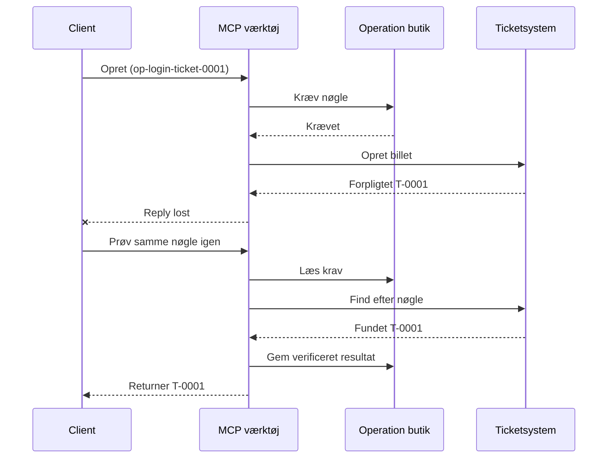
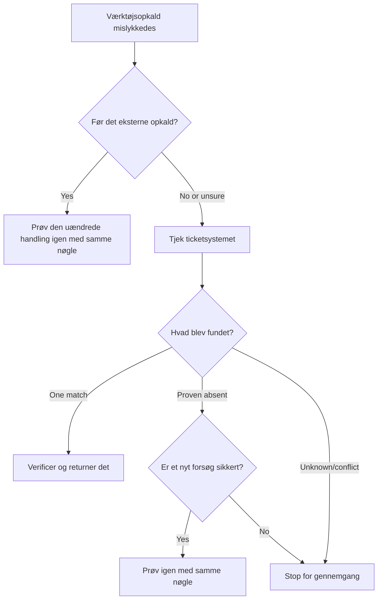

# Sikker Genforsøg for MCP-værktøjer: Et Pålideligheds Sidecar-Mønster

Et manglende svar betyder ikke, at handlingen mangler. Et værktøj til supportbilletter
kan oprette billet `T-0001` og derefter miste forbindelsen, før klienten ser
resultatet. Hvis klienten blindt genforsøger, kan det skabe `T-0002`.

Denne lektion viser, hvordan man genkender det usikre resultat, beholder en stabil
identitet for den tiltænkte handling, og tjekker billetsystemet, før man prøver
igen. Den medfølgende Python-øvelse kører lokalt med standardbiblioteket
og SQLite.

## Hvorfor en Timeout Betyder "Udfald Ukendt"

Antag, at klienten kalder `create_support_ticket` med operationstasten
`op-login-ticket-0001`:



Forbindelsen fejler efter, at billetten er bekræftet, men før resultatet ankommer.
Klienten ved kun, at svaret mangler. Den ved ikke, om billetten mangler.
Genbrug af operationstasten lader værktøjet finde og returnere
`T-0001` i stedet for at oprette `T-0002`.

## Hvad en Pålideligheds Sidecar Gør

En pålideligheds sidecar er applikationskode, der holder recovery-tilstand omkring et
værktøj. Det kan være et bibliotek, middleware, en databaseunderstøttet service eller simpelthen
en del af værktøjets implementering. Det behøver ikke at være en separat proces,
og det er ikke en MCP-protokolfunktion.

Sidecaren har fire opgaver:

1. gem den tiltænkte handling før kald til det eksterne system;
2. lad kun én arbejder gøre krav på den handling;
3. husk nok tilstand til at kunne recovere efter et nedbrud; og
4. tjek det eksterne system, når udfaldet er usikkert.

Denne lektion sigter mod den endelige MCP-specifikation `2026-07-28`. MCP har ingen
protokolniveau-session, så operationstasten er et almindeligt værktøjsargument
understøttet af holdbar applikationstilstand. Det samme mønster fungerer også med tidligere
MCP-versioner.

## Fire ID’er der løser forskellige problemer

Disse identifikatorer er relaterede, men de er ikke udskiftelige:

| Identifikator | Hvad den identificerer | Overlever et genforsøg? |
| --- | --- | --- |
| JSON-RPC ID | Én forespørgsel og svar | Nej; brug en ny forespørgsels-ID |
| MCP Opgave-ID | Én langvarig opgave | Ja; behold det til polling |
| Operationstast | Én tiltænkt handling | Ja; genbrug den til den handling |
| Billet-ID | Det gemte resultat | Ja; returner det efter verifikation |

Statusmeddelelser og sporkontekst hjælper med at observere en anmodning.
Annullering beder arbejdet stoppe. Ingen af dem forhindrer en dubletbillet.

## Byg Vogteren

Opret operationstasten før det første værktøjskald og gem den med
arbejdsgangen. Hver forsøg på at oprette samme tiltænkte billet bruger samme tast:

```json
{
  "operation_key": "op-login-ticket-0001",
  "title": "Cannot sign in"
}
```

En anden tiltænkt billet får en ny tast. I produktion genereres en uigennemskuelig,
uigættelig værdi i stedet for at putte kundedata i tasten.

Her er det komplette MCP-værktøjsskema brugt i denne lektion:

```json
{
  "name": "create_support_ticket",
  "title": "Create support ticket",
  "description": "Creates or recovers one support ticket for an operation key.",
  "inputSchema": {
    "$schema": "https://json-schema.org/draft/2020-12/schema",
    "type": "object",
    "properties": {
      "operation_key": {
        "type": "string",
        "minLength": 16,
        "maxLength": 128,
        "description": "Stable key reused for the same intended action."
      },
      "title": {
        "type": "string",
        "minLength": 1,
        "maxLength": 200
      }
    },
    "required": ["operation_key", "title"],
    "additionalProperties": false
  },
  "outputSchema": {
    "$schema": "https://json-schema.org/draft/2020-12/schema",
    "type": "object",
    "properties": {
      "ticket_id": {
        "type": "string"
      },
      "operation_key": {
        "type": "string"
      },
      "status": {
        "type": "string",
        "const": "verified"
      }
    },
    "required": ["ticket_id", "operation_key", "status"],
    "additionalProperties": false
  }
}
```

Den autentificerede kaldeidentitet kommer fra serverkontekst, ikke fra
modelsuppleret værktøjsinput. Scope hver lagret operation til:

- den kalder, lejer eller servicekonto;
- værktøjets navn og version; og
- et hash af de normaliserede input, der definerer den eksterne handling.

Input-hashet besvarer et simpelt spørgsmål: "Er dette genforsøg det samme
billet?" Hvis nøglen allerede hører til en anden titel, afvis kaldet.
At returnere et tidligere resultat for ændret input ville skjule en kontraktfejl.

Gem kravet med én atomar databaseoperation. "Atomar" betyder, at to arbejdere
ikke begge kan observere en tom post og begge blive ejer. En proces-lokal
lås er ikke nok, når en anden serverinstans kan modtage genforsøget.

Arbejdsgangen opretter nøglen, mens handlingen er `planned`. Prøven
gemmer derefter disse tilstande:

- `claimed`: én arbejder har reserveret operationen;
- `completed`: billetsystemet returnerede en resultat; og
- `verified`: et læs fra billetsystemet bekræfter resultatet.

Et nedbrud kan efterlade den gemte tilstand ved `claimed` selv efter, at billetten blev
oprettet. Behandl ethvert ikke-endeligt krav som usikkert, indtil ekstern dokumentation
afklarer det. Antag ikke, at `claimed` betyder "intet skete."

## Genskab Før Du Genforsøger

Når et værktøjskald fejler, afgør hvad der er kendt, før der sendes et andet eksternt
skriv:



Validering, der fejler før billet-API’et kaldes, er en kendt fejl.
Genforsøg en uændret handling med samme operationstast. Hvis rettelse af input
ændrer den tiltænkte billet, lav en ny tast til den nye handling.

Hvis anmodningen kan være nået billetsystemet, forlig den først.
Forligelse betyder at sammenligne det gemte krav med den autoritative billet-
post. Returner den eksisterende billet, når præcis én matchende post findes.
Genforsøg kun, når billetten med sikkerhed mangler, og den nedstrøms kontrakt
gør endnu et forsøg sikkert.

"Ikke fundet" er ikke altid entydigt. En udbyder med til sidst konsistent
søgning kan have brug for en begrænset ventetid og et nyt tjek. Hvis systemet ikke kan
søges, giver modstridende resultater eller ikke sikkert kan deduplikeres ved et
nyt forsøg, stop og rapporter `outcome unknown`. At stoppe her kaldes nogle gange
"at fejle lukket": arbejdsgangen nægter at gætte.

## Bevis, Opgaver og Annullering

Et værktøjsrespons siger, hvad værktøjet rapporterede. Et gemt checkpoint siger, hvad
arbejdsgangen optog. Det stærkeste bevis kommer fra systemet, der ejer
resultatet: for dette eksempel, et læs fra billetsystemet, der finder præcis én
matchende billet.

Match beviset til risikoen. En udbyderbesked-ID kan være nok til en
lavrisko-meddelelse. Betalinger, deployeringer og destruktive handlinger kan
kræve udbyderstatus, regnskab eller manuel gennemgang som bevis.

MCP Tasks-udvidelsen supplerer dette mønster til langvarigt arbejde. En Opgave-
ID lader klienten genoptage polling efter en afbrydelse, men det identificerer ikke
eller deduplerer billetten selv. Når Tasks bruges, forbindes identiteterne
således:

```text
operation key -> Task ID -> ticket ID -> verification evidence
```

Annullering er samarbejdende, ikke en tilbagerulning. Billetten kan stadig blive oprettet
efter, at annullering er anerkendt, så et usikkert resultat kræver stadig
forligelse.

## Kør Fejlindsprøjtningsøvelsen

Prøven bruger to SQLite-filer: en repræsenterer operationlageret og den
anden repræsenterer det eksterne billetsystem. Der er ingen transaktion, der spænder over
begge filer. Fejlen indsættes efter, at billetten commits, men før
sidecaren registrerer færdiggørelse.

Den direkte Python-metode accepterer `caller_id` som erstatning for autentificeret
serverkontekst. Tilføj ikke `caller_id` til det modelstyrede MCP-input-
skema.

Forudsig resultatet før du kører testene:

| Sti | Resultat efter genforsøg | Billetantal |
| --- | --- | --- |
| Blindt genforsøg | Opretter `T-0002` efter tab af svar for `T-0001` | 2 |
| Vogtet genforsøg | Finder og returnerer `T-0001` | 1 |

Kør:

```bash
cd 08-BestPractices/reliability-sidecars/python
python -m unittest discover -p "test_*.py" -v
```

De seks tests viser, at:

1. et blindt genforsøg skaber en dublet;
2. tab af svar plus en genstart genskaber én billet fra et holdbart krav;
3. et verificeret genforsøg genbruger det gemte resultat;
4. ændret input eller modstridende ekstern dokumentation afvises;
5. et eksisterende krav uden ekstern dokumentation stopper sikkert; og
6. samtidige krav tillader én ejer uden at forringe et verificeret resultat.

Åbn prøven:

- [Python-implementering](../../../../08-BestPractices/reliability-sidecars/python/reliability_sidecar.py)
- [Deterministiske tests](../../../../08-BestPractices/reliability-sidecars/python/test_reliability_sidecar.py)

Prøven udelader med vilje lejede krav, der er forældede. En produktions-
overtagelsespolitik kræver en begrænset lejeperiode, atomar ejerskabsoverførsel og et andet eksternt
tjek før udførelse.

## Valgfri Fællesskabsimplementering

Agent Enhancer Utilities er en fællesskabsimplementering af dette
applikationsniveau-mønster. Dens planner vælger en recovery-tilgang, mens dens
checkpoint registrerer krav- og usikre-resultat-tilstande. Domæne-værktøjet eller MCP-
serveren udfører stadig og verificerer den virkelige handling. Denne service er ikke en del
af MCP-specifikationen og er ikke påkrævet til denne lektion.

| Lektionens koncept | Agent Enhancer-del | Vigtig begrænsning |
| --- | --- | --- |
| Recovery-plan | `workflow-guard-planner` | Kalder ikke domæne-værktøjet |
| Krav og recovery | `workflow-checkpoint` | `external_proof` forbliver `false` |
| Præcis sidecar-replay | `lab.invoke_tool` | Bruger en separat idempotensnøgle |
| Verificer den virkelige handling | Destinationssøgning-/tilbage-læsning | Domænet MCP ejer det |

For et præcist genforsøg af ét sidecar-kald accepterer `lab.invoke_tool` en ydre
`idempotency_key`. Den nøgle identificerer sidecar-invokationen; det er ikke
forretningens `operation_key` brugt til billetten.

Den taggede offentlige kontrakt og et valgfrit netværkseksempel er tilgængelige
her:

- [Reliability Sidecar Contract v1](https://github.com/artiehinz/Agent-Enhancer-Utilities/blob/v1.6.0/docs/RELIABILITY_SIDECAR_CONTRACT_V1.md)
- [Planner og mock-domæneeksempel](https://github.com/artiehinz/Agent-Enhancer-Utilities/tree/v1.6.0/examples/reliability-sidecar)

Disse links illustrerer applikationsmønsteret. De hævder ikke, at
den hostede service overholder MCP `2026-07-28`, og checkpoint-tilstand tæller aldrig
som eksternt bevis for billetten.

## Produktions-tjekliste

- [ ] Opret og gem operationstasten før første eksterne forsøg.
- [ ] Bind tasten til kalder, værktøjsversion og normaliseret input-hash.
- [ ] Afvis ændret input under en eksisterende tast.
- [ ] Indrøm én ejer med en atomar delt-lager-operation.
- [ ] Videregiv tasten til den nedstrøms udbyder, når den understøtter idempotens.
- [ ] Forlig usikre udfald før et nyt skriv.
- [ ] Behold verificerede resultater og beviser for hele genforsøgsperioden.
- [ ] Stop for gennemgang, når det eksterne udfald ikke kan fastslås sikkert.

## Referencer

- [MCP Specifikation `2026-07-28`](https://modelcontextprotocol.io/specification/2026-07-28)
- [MCP `2026-07-28` vejledning til værktøjer](https://modelcontextprotocol.io/specification/2026-07-28/server/tools)
- [MCP Tasks-udvidelse](https://modelcontextprotocol.io/extensions/tasks/overview)
- [JSON-RPC 2.0 specifikation](https://www.jsonrpc.org/specification)

---

<!-- CO-OP TRANSLATOR DISCLAIMER START -->
**Ansvarsfraskrivelse**:
Dette dokument er blevet oversat ved hjælp af AI-oversættelsestjenesten [Co-op Translator](https://github.com/Azure/co-op-translator). Selvom vi bestræber os på nøjagtighed, skal du være opmærksom på, at automatiserede oversættelser kan indeholde fejl eller unøjagtigheder. Det originale dokument på dets oprindelige sprog bør betragtes som den autoritative kilde. For kritisk information anbefales professionel menneskelig oversættelse. Vi påtager os intet ansvar for misforståelser eller fejltolkninger, der opstår som følge af brugen af denne oversættelse.
<!-- CO-OP TRANSLATOR DISCLAIMER END -->