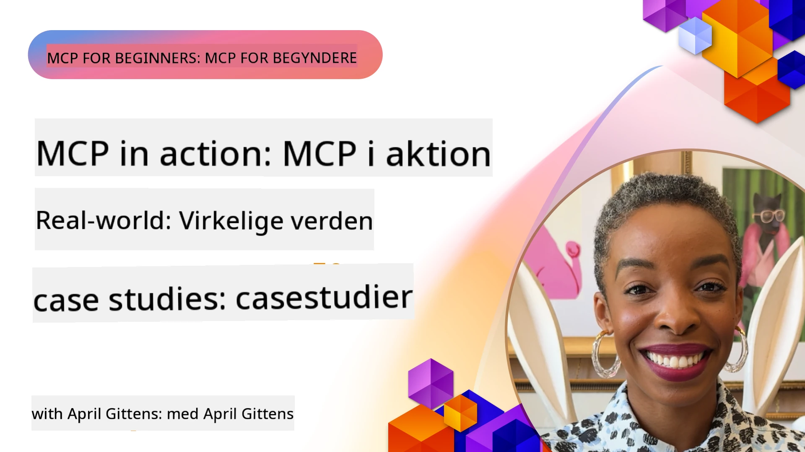

# MCP i praksis: Virkelige casestudier

_(Klik på billedet ovenfor for at se videoen til denne lektion)_

Model Context Protocol (MCP) forvandler, hvordan AI-applikationer interagerer med data, værktøjer og tjenester. Denne sektion præsenterer virkelige casestudier, der demonstrerer praktiske anvendelser af MCP i forskellige erhvervsscenarier.

## Oversigt

Denne sektion fremviser konkrete eksempler på MCP-implementeringer og fremhæver, hvordan organisationer udnytter denne protokol til at løse komplekse forretningsudfordringer. Ved at gennemgå disse casestudier får du indsigt i MCP’s alsidighed, skalerbarhed og praktiske fordele i virkelige scenarier.

## Vigtige læringsmål

Ved at udforske disse casestudier vil du:

- Forstå, hvordan MCP kan anvendes til at løse specifikke forretningsproblemer
- Lære om forskellige integrationsmønstre og arkitektoniske tilgange
- Genkende bedste praksis for implementering af MCP i erhvervsmiljøer
- Få indsigt i udfordringer og løsninger, der optræder ved implementeringer i virkeligheden
- Identificere muligheder for at anvende lignende mønstre i dine egne projekter

## Udvalgte casestudier

### 1. [Azure AI Reiseagenter – Referenceimplementering](./travelagentsample.md)

Dette casestudie undersøger Microsofts omfattende referencesolution, der demonstrerer, hvordan man bygger en multi-agent, AI-drevet rejseplanlægning applikation ved hjælp af MCP, Azure OpenAI og Azure AI Search. Projektet fremviser:

- Multi-agent orkestrering via MCP
- Enterprise data integration med Azure AI Search
- Sikker og skalerbar arkitektur med Azure-tjenester
- Udvidelsesvenlige værktøjer med genanvendelige MCP-komponenter
- Samtale-baseret brugeroplevelse drevet af Azure OpenAI

Arkitekturen og implementeringsdetaljerne giver værdifuld indsigt i opbygning af komplekse multi-agent systemer med MCP som koordinationslag.

### 2. [Opdatering af Azure DevOps-elementer fra YouTube-data](./UpdateADOItemsFromYT.md)

Dette casestudie viser en praktisk anvendelse af MCP til automatisering af arbejdsprocesser. Det demonstrerer, hvordan MCP-værktøjer kan bruges til at:

- Udtrække data fra online platforme (YouTube)
- Opdatere arbejdsopgaver i Azure DevOps-systemer
- Oprette gentagelige automatiserede arbejdsgange
- Integrere data på tværs af forskellige systemer

Eksemplet illustrerer, hvordan selv relativt simple MCP-implementeringer kan give betydelige effektivitetsgevinster ved at automatisere rutineopgaver og forbedre datakonsistens på tværs af systemer.

### 3. [Real-time dokumenthentning med MCP](./docs-mcp/README.md)

Dette casestudie guider dig gennem at forbinde en Python konsolklient til en Model Context Protocol (MCP) server for at hente og logge Microsoft-dokumentation i realtid med kontekstbevidsthed. Du lærer, hvordan man:

- Forbinder til en MCP-server ved brug af en Python-klient og den officielle MCP SDK
- Anvender streaming HTTP-klienter til effektiv, realtids databehandling
- Kalder dokumentationsværktøjer på serveren og logger svar direkte til konsollen
- Integrerer opdateret Microsoft-dokumentation i din arbejdsgang uden at forlade terminalen

Kapitellet inkluderer en praktisk opgave, et minimalt fungerende kodeeksempel og links til yderligere ressourcer for dybere læring. Se den komplette gennemgang og kode i det linkede kapitel for at forstå, hvordan MCP kan transformere adgang til dokumentation og udviklerproduktivitet i konsol-baserede miljøer.

### 4. [Interaktiv studieplan-generator webapp med MCP](./docs-mcp/README.md)

Dette casestudie viser, hvordan man bygger en interaktiv webapplikation ved hjælp af Chainlit og Model Context Protocol (MCP) til at generere personlige studieplaner for ethvert emne. Brugere kan angive et fag (såsom "AI-900 certificering") og en studietidsperiode (f.eks. 8 uger), og appen giver en uge-for-uge oversigt over anbefalet indhold. Chainlit muliggør en samtale-baseret chatgrænseflade, der gør oplevelsen engagerende og tilpasset.

- Samtale-baseret webapp drevet af Chainlit
- Brugerstyrede forespørgsler for emne og varighed
- Uge-for-uge indholds-anbefalinger ved hjælp af MCP
- Realtids, adaptive svar i chatgrænsefladen

Projektet illustrerer, hvordan samtale-AI og MCP kan kombineres for at skabe dynamiske, bruger-drevne læringsværktøjer i et moderne webmiljø.

### 5. [Dokumentation i editor med MCP-server i VS Code](./docs-mcp/README.md)

Dette casestudie demonstrerer, hvordan du kan hente Microsoft Learn Docs direkte ind i dit VS Code-miljø via MCP-serveren — ikke mere skiften mellem browserfaner! Du vil se, hvordan man:

- Øjeblikkeligt søger og læser dokumentation inde i VS Code via MCP-panelet eller kommandopalletten
- Refererer til dokumentation og indsætter links direkte i dine README- eller kursus-markdownfiler
- Bruger GitHub Copilot og MCP sammen for sømløse, AI-drevne dokumentations- og kodearbejdsgange
- Validerer og forbedrer din dokumentation med realtidsfeedback og Microsoft-kilder for nøjagtighed
- Integrerer MCP med GitHub-arbejdsgange for kontinuerlig dokumentationsvalidering

Implementeringen inkluderer:

- Eksempelkonfiguration `.vscode/mcp.json` for nem opsætning
- Skærmbilledebaserede trin-for-trin-guides af oplevelsen i editoren
- Tips til at kombinere Copilot og MCP for maksimal produktivitet

Dette scenarie er ideelt for kursusforfattere, dokumentationsskrivere og udviklere, der ønsker at blive i deres editor, mens de arbejder med dokumentation, Copilot og valideringsværktøjer — alt sammen drevet af MCP.

### 6. [Oprettelse af APIM MCP-server](./apimsample.md)

Dette casestudie giver en trin-for-trin guide til, hvordan man opretter en MCP-server ved brug af Azure API Management (APIM). Det dækker:

- Opsætning af en MCP-server i Azure API Management
- Eksponering af API-operationer som MCP-værktøjer
- Konfiguration af politikker for ratebegrænsning og sikkerhed
- Test af MCP-serveren med Visual Studio Code og GitHub Copilot

Eksemplet illustrerer, hvordan man udnytter Azures kapaciteter til at skabe en robust MCP-server, der kan bruges i forskellige applikationer og styrke integrationen af AI-systemer med erhvervs-API'er.

### 7. [GitHub MCP Registry — Accelererer agent-integrationen](https://github.com/mcp)

Dette casestudie undersøger, hvordan GitHubs MCP Registry, lanceret i september 2025, adresserer en kritisk udfordring i AI-økosystemet: den fragmenterede opdagelse og udrulning af Model Context Protocol (MCP) servere.

#### Oversigt
**MCP Registry** løser den voksende udfordring med spredte MCP-servere på tværs af repositories og registries, som tidligere gjorde integration langsom og fejlfyldt. Disse servere muliggør, at AI-agenter kan interagere med eksterne systemer som API’er, databaser og dokumentationskilder.

#### Problemformulering
Udviklere, der bygger agentbaserede arbejdsgange, stod over for flere udfordringer:
- **Dårlig opdagelighed** af MCP-servere på tværs af forskellige platforme
- **Redundante opsætningsspørgsmål** spredt over fora og dokumentation
- **Sikkerhedsrisici** fra uverificerede og upålidelige kilder
- **Manglende standardisering** i serverkvalitet og kompatibilitet

#### Løsningsarkitektur
GitHub’s MCP Registry centraliserer betroede MCP-servere med nøglefunktioner:
- **Én-klik-installation** via VS Code for smidig opsætning
- **Signal-over-støj sortering** efter stjerner, aktivitet og fællesskabsvalidering
- **Direkte integration** med GitHub Copilot og andre MCP-kompatible værktøjer
- **Åben bidragsmodel** der tillader både fællesskabs- og virksomhedspartnere at bidrage

#### Forretningsmæssig effekt
Registreringsdatabasen har leveret målbare forbedringer:
- **Hurtigere onboarding** for udviklere ved brug af værktøjer som Microsoft Learn MCP Server, der streamer officiel dokumentation direkte ind i agenter
- **Øget produktivitet** via specialiserede servere som `github-mcp-server`, der muliggør GitHub-automatisering med naturligt sprog (oprettelse af PR, genkørsler af CI, kodescanning)
- **Styrket tillid i økosystemet** gennem kuraterede lister og gennemsigtige konfigurationsstandarder

#### Strategisk værdi
For praktikere, der specialiserer sig i agent-livscyklusshåndtering og reproducerbare arbejdsgange, tilbyder MCP Registry:
- **Modulær agent-udrulning** med standardiserede komponenter
- **Registry-baserede evalueringspipelines** til konsistent testning og validering
- **Tværværktøjs interoperabilitet** der muliggør sømløs integration på tværs af forskellige AI-platforme

Dette casestudie viser, at MCP Registry ikke blot er en directory — det er en fundamentalt platform for skalerbar, real-world modelintegration og agentbaseret systemudrulning.

### 8. [Publicering til sociale netværk fra en agent](./publora-social-publishing.md)

Dette casestudie gennemgår en **skrivbar ekstern MCP-server** — en hvis værktøjer udfører irreversible handlinger på en brugers vegne — med social publicering som eksempel. En agent udarbejder et opslag, en person godkender det, og serveren planlægger det på tværs af netværk.

Det interessante er de designbegrænsninger, som publicering pålægger, hvilket gælder for enhver server, der skriver i stedet for at læse:

- **Åben opdagelse, autentificeret udførelse** — `tools/list` besvares uden legitimationsoplysninger så registries og klienter kan introspektere, mens hvert `tools/call` kræver en token og ellers returnerer `401` med en `WWW-Authenticate` header
- **OAuth-registrering uden et out-of-band trin** — dynamisk klientregistrering i dag, med Client ID Metadata Documents som retningen for specifikationen `2026-07-28`
- **Værktøjsannoteringer** (`readOnlyHint`, `destructiveHint`, `idempotentHint`), som klienter bruger til at beslutte, hvad der skal bekræftes — hints snarere end håndhævelse, og noget connector directories nu forventer ved gennemgang
- **Uopfindelige identifikatorer**, så en hallucineret værdi fejler højt i stedet for at handle på et plausibelt udseende
- **Idempotens-nøgler på de opslagsskabende værktøjer**, så en agent-runtime’s retry ikke bliver en duplikat-publikation
- **Et no-op mål beskrevet i værktøjsskemaet**, som afprøver hele skrivevejen og ikke udgiver noget, til anmeldere og CI

Kapitellet afsluttes med en kort tjekliste, du kan anvende på en server, du er ved at bygge.

## Konklusion

Disse otte omfattende casestudier illustrerer den bemærkelsesværdige alsidighed og praktiske anvendelser af Model Context Protocol på tværs af forskellige virkelighedsnære scenarier. Fra komplekse multi-agent rejseplanlægningssystemer og enterprise API-styring til strømlinede dokumentationsarbejdsgange og den revolutionerende GitHub MCP Registry, viser disse eksempler, hvordan MCP giver en standardiseret, skalerbar måde at forbinde AI-systemer med de værktøjer, data og tjenester, de har brug for, for at levere enestående værdi.

Casestudierne spænder over flere dimensioner af MCP-implementering:
- **Enterprise-integration**: Azure API Management og Azure DevOps automatisering
- **Multi-agent orkestrering**: Rejseplanlægning med koordinerede AI-agenter
- **Udviklerproduktivitet**: VS Code-integration og realtids adgang til dokumentation
- **Økosystemudvikling**: GitHub MCP Registry som en fundamentalt platform
- **Uddannelsesapplikationer**: Interaktive studieplangeneratorer og samtalegrænseflader

Ved at studere disse implementeringer opnår du vigtig indsigt i:
- **Arkitektoniske mønstre** til forskellige skalaer og brugssituationer
- **Implementeringsstrategier** der balancerer funktionalitet med vedligeholdelse
- **Sikkerheds- og skalerbarhedsovervejelser** for produktionsudrulninger
- **Bedste praksis** for MCP-serverudvikling og klientintegration
- **Økosystemtænkning** for at bygge sammenkoblede AI-drevne løsninger

Disse eksempler demonstrerer tilsammen, at MCP ikke blot er et teoretisk rammeværk, men en moden, produktionsklar protokol, der muliggør praktiske løsninger på komplekse forretningsudfordringer. Uanset om du bygger simple automatiseringsværktøjer eller sofistikerede multi-agent systemer, giver de illustrerede mønstre og tilgange et solidt fundament for dine egne MCP-projekter.

## Yderligere ressourcer

- [Azure AI Travel Agents GitHub Repository](https://github.com/Azure-Samples/azure-ai-travel-agents)
- [Azure DevOps MCP Tool](https://github.com/microsoft/azure-devops-mcp)
- [Playwright MCP Tool](https://github.com/microsoft/playwright-mcp)
- [Microsoft Docs MCP Server](https://github.com/MicrosoftDocs/mcp)
- [GitHub MCP Registry — Accelerating Agentic Integration](https://github.com/mcp)
- [MCP Community Examples](https://github.com/microsoft/mcp)

## Hvad er næste skridt

- Forrige: [Modul 8: Bedste praksis](../08-BestPractices/README.md)
- Næste: [Modul 10: Strømlining af AI-arbejdsgange: Byg en MCP-server med AI Toolkit](../10-StreamliningAIWorkflowsBuildingAnMCPServerWithAIToolkit/README.md)

---

<!-- CO-OP TRANSLATOR DISCLAIMER START -->
**Ansvarsfraskrivelse**:
Dette dokument er blevet oversat ved hjælp af AI-oversættelsestjenesten [Co-op Translator](https://github.com/Azure/co-op-translator). Selvom vi bestræber os på nøjagtighed, skal du være opmærksom på, at automatiserede oversættelser kan indeholde fejl eller unøjagtigheder. Det originale dokument på dets oprindelige sprog bør betragtes som den autoritative kilde. For kritisk information anbefales professionel menneskelig oversættelse. Vi påtager os intet ansvar for misforståelser eller fejltolkninger, der opstår som følge af brugen af denne oversættelse.
<!-- CO-OP TRANSLATOR DISCLAIMER END -->