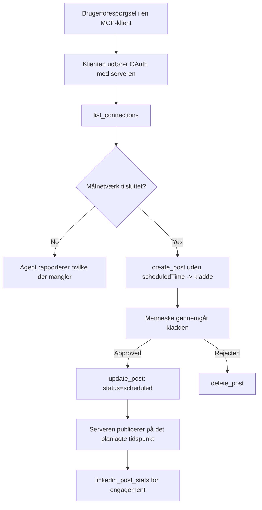

# Case Study: Udgivelse til sociale netværk fra en agent med en fjern MCP-server

> **Ansvarsfraskrivelse:** Flere tjenester og open source-projekter kan udgive til sociale netværk, og et team kunne også integrere hvert netværks API direkte. Scenariet nedenfor er givet som et eksempel på, hvordan en **skrivbar fjern MCP-server** kan designes og benyttes. Publora er en kommerciel tjeneste med et gratis niveau; de mønstre, der beskrives her, gælder for enhver MCP-server, der udfører irreversible handlinger på vegne af en bruger.

## Oversigt

Agenter er gode til at udarbejde indhold, men dårlige til at levere det. En model kan skrive en pressemeddelelse på få sekunder, og så stopper arbejdet: Udgivelse betyder et API per netværk, en OAuth-app per netværk og et forskelligt sæt medieregler for hver enkelt. De fleste teams løser dette ved at kopiere teksten manuelt ind i en browser.

Denne case study undersøger, hvordan det sidste trin kan lukkes med en enkelt fjern MCP-server, og — mere brugbart for alle, der bygger en sådan — de designbeslutninger en **skrivbar** server skal få korrekt. Dataaflæsning tilgives nemmere. Udgivelse gør ikke: et forkert værktøjskald er synligt for et publikum og kan ikke fortrydes.

## Scenarie

Et lille developer-relations-team udarbejder opslag inde i en agent (Claude, VS Code, Cursor — klienten betyder ikke noget). De ønsker, at agenten skal:

- se hvilke sociale konti teamet har tilsluttet,
- udarbejde et opslag og holde det som et udkast til en menneskelig godkendelse,
- vedhæfte et billede,
- planlægge det til flere netværk på et valgt tidspunkt,
- og senere rapportere, hvordan det klarede sig.

Vigtigst af alt ønsker de, at agenten *ikke* skal kunne udgive ved et uheld, mens de stadig eksperimenterer.

## Brugte værktøjer

- [Publora MCP Server](https://github.com/publora/mcp-server) — en fjern MCP-server (`streamable-http`), der eksponerer udgivelse, planlægning, media og LinkedIn-analysetools. Registreret i den officielle MCP-register som `com.publora/mcp-server`.

## Trin-for-trin arbejdsproces

1. **Tilslut serveren.** Klienter, der bruger OAuth, gennemfører autorisationskode-flowet med PKCE mod serverens egen samtykkeskærm; klienter der ikke gør, såsom headless CLI'er, bruger en Publora API-nøgle i en header. Begge veje understøttes, og hvilken du får afhænger af klienten, ikke serveren.
2. **List forbindelser.** Agenten kalder `list_connections` og modtager de tilsluttede konti med deres identifikatorer.
3. **Udkast.** Agenten kalder `create_post` *uden* planlagt tidspunkt. Opslaget gemmes som et udkast — intet publiceres.
4. **Vedhæft media.** Offentlige billed-URL'er medsendes i samme kald; serveren downloader og validerer dem.
5. **Planlæg.** Efter menneskelig godkendelse sætter `update_post` status til planlagt med et ISO 8601 tidspunkt.
6. **Mål.** For LinkedIn returnerer `linkedin_post_stats` engagement, når opslaget er live.

## Eksempel prompt

```text
Which social accounts do I have connected?
Draft a post announcing our new changelog page, attach the screenshot at
https://example.com/changelog.png, and keep it as a draft — do not publish it.
Once I approve, schedule it to LinkedIn and Bluesky for tomorrow at 09:00 UTC.
```

## Mermaid flowchart



## Teknisk implementering

Lektierne nedenfor er den overførbare del af denne case study.

### Åben opdagelse, autentificeret eksekvering

`tools/list` serveres uden legitimationsoplysninger; hvert `tools/call` kræver et token
og returnerer ellers `401` med en `WWW-Authenticate` header, der peger på
beskyttet-ressource metadata. Serverens ældre endpoint svarer også på en
uautentificeret `initialize` for klienter på protokolversioner før
`2026-07-28`; aktuelle klienter bruger ikke den håndtryk-proces.

Denne server-specifikke opdeling tillader registre, kataloger og klienter at inspicere værktøj
navne, skemaer og annotationer uden en hemmelighed, mens anonym
eksekvering forhindres. Åben opdagelse er et deploymentsvalg, ikke et MCP-krav; en
beskyttet deployment kan også kræve autorisation for `tools/list`.

### Registrering: dynamisk klientregistrering og hvad der erstatter det

Serveren annoncerer `/.well-known/oauth-protected-resource` og `/.well-known/oauth-authorization-server` og understøtter autorisationskode-flow med PKCE (`S256`), refresh tokens og **dynamisk klientregistrering**.

Dynamisk registrering fjernede det manuelle trin for ældre klienter: uden det
krævede hver klient et forududstedt `client_id` fra leverandøren.

Betragt dette som kompatibilitetsadfærd frem for et design, man skal kopiere. Revisionen `2026-07-28` af specifikationen udfaser dynamisk klientregistrering til fordel for Client ID Metadata Documents, hvor klienten hoster et metadata-dokument på en stabil HTTPS URL, og denne URL *er* `client_id`. DCR virker stadig nu, men en server, der bygges i dag, bør planlægge for CIMD og holde DCR kun for ældre klienter.

### Værktøjsannotationer er ikke pynt

Hvert værktøj indeholder en `title` og tilhørende hints: `readOnlyHint`, `destructiveHint`, `idempotentHint`, `openWorldHint`.

To grunde til at investere i dem. For det første bruger klienter hints til at afgøre, hvad der skal bekræftes af brugeren — en klient kan automatisk køre en læse-only opslag og stoppe for godkendelse før sletning. Specifikationen er klar på, at annotationer er uautoriserede hints, ikke et autorisationsmekanisme: de former, hvad en klient tilbyder at gøre, de stopper ikke noget på serveren, og en server skal stadig håndhæve sine egne regler. For det andet kræver de store connector-kataloger nu *dem* for review; en server, hvis værktøjer mangler titler og hints, bliver sendt tilbage uanset hvor godt den fungerer.

### Gør identifikatorer uopfindelige

Platformidentifikatorer er uigennemsigtige strenge, der returneres af `list_connections`, og skemabeskrivelsen siger eksplicit, at de skal kopieres ordret og aldrig gættes. Serveren afviser alt andet.

Modeller er flydende gætte-mestre. Enhver skrivbar server bør antage, at en identifikator til sidst vil blive hallucinaret og lade denne sti fejle højt og tidligt i stedet for at handle på en plausibel værdi.

### Fejl før udgivelse med en handlingsorienteret besked

Nogle netværk tillader ikke tekstopslag alene og kræver et billede eller video. Det valideres, når opslaget planlægges, og fejlen navngiver platformen og det manglende krav.

En agent kan komme sig over "Instagram kræver media — vedhæft et billede eller en video" uden en ekstra tur. Den kan ikke komme sig over en generisk `400`.

### Gør genforsøg sikre

De to værktøjer, der skaber indhold, `create_post` og `update_post`, accepterer en idempotensnøgle: genbrug af den med identisk anmodning gengiver det oprindelige svar i stedet for at oprette et andet opslag. Agentkørsler prøver igen ved timeout; uden idempotens bliver et langsomt svar til en duplikeret udgivelse. De andre skriveværktøjer — sletninger, media-trin, LinkedIn reaktioner og kommentarer — tager ikke en, så genforsøg der er ikke automatisk sikre. Værd at vide, hvilke mutationer du har, der er beskyttet, og hvilke der ikke er.

### Giv en måde at teste, der ikke udgiver noget

Serveren accepterer et reserveret mål, `publora-playground`, som valideres og anerkendes som et rigtigt destinationssted og derefter forkastes — intet når en live-konto. Det beskrives i skemaet for værktøjet selv, som enhver klient kan læse uden legitimationsoplysninger: `platforms`-feltet i `create_post` dokumenterer det som "et forbindelsestest-mål, der ikke kræver en rigtig forbindelse — opslaget anerkendes og forkastes, intet publiceres". Brug det ved at sende det som eneste post: `platforms: ["publora-playground"]`.

Dette viste sig at være en af de mest nyttige detaljer i hele grænsefladen. Anmeldere af connector-kataloger, bidragydere og CI kan øve hele skrivevejen fra start til slut uden risiko for et rigtigt publikum. Enhver MCP-server med irreversible handlinger drager fordel af et dokumenteret no-op-mål.

## Resultater og effekt

- Udgivelsestrinnet flyttede fra en browser til samme samtale, hvor indholdet skrives, og en udkast-først vane holder et menneske i loopet. Vær præcis om, hvad det er: et udkast er en konvention, ikke en grænse. Den samme legitimation kan planlægge eller udgive, så enhver, der har brug for en rigtig godkendelsesport, skal håndhæve det uden for værktøjsfladen — separate legitimationsoplysninger eller et politiklag foran serveren.
- Per-netværksforskelle — mediekrav, trådning, svarstyring — håndteres én gang i serveren i stedet for i hver agent, der taler med den.
- Den samme server understøtter flere MCP-klienter uden forududstedte legitimationsoplysninger.
    Aktuelle klienter kan bruge Client ID Metadata Documents; DCR forbliver en fallback
    for ældre klienter.
- Designbegrænsningerne ovenfor blev formet lige så meget af connector-kataloganmeldelser som af brugere: annotationer, OAuth og et sikkert testmål blev hver især krævet af mindst ét af dem.

## Referencer

- [Publora MCP Server (kildekode)](https://github.com/publora/mcp-server)
- [Publora API og MCP-dokumentation](https://docs.publora.com)
- [MCP-registreringspost: `com.publora/mcp-server`](https://registry.modelcontextprotocol.io/v0/servers?search=com.publora/mcp-server)
- [MCP-specifikation — Autorisation](https://modelcontextprotocol.io/specification/2026-07-28/basic/authorization)
- [MCP-specifikation — Værktøjsannotationer](https://modelcontextprotocol.io/docs/concepts/tools)

## Hvad der kommer næste

- Tag en MCP-server, du bygger, og tjek de tre billigste gevinster her: annotationer på hvert værktøj, en idempotensnøgle på hver skrivning, og et dokumenteret no-op mål.
- Prøv den åbne opdagelsesopdeling: kald `tools/list` mod en offentlig fjern server uden legitimationsoplysninger, kald derefter et værktøj og undersøg `401`-udfordringen.
- Overvej, hvad "fortryd" betyder for dit domæne. Udgivelse har udkast og sletning; hvis dine handlinger ikke har en tilsvarende, hører bekræftelse hjemme i værktøjsdesignet, ikke i prompten.

---

<!-- CO-OP TRANSLATOR DISCLAIMER START -->
**Ansvarsfraskrivelse**:
Dette dokument er blevet oversat ved hjælp af AI-oversættelsestjenesten [Co-op Translator](https://github.com/Azure/co-op-translator). Selvom vi bestræber os på nøjagtighed, skal du være opmærksom på, at automatiserede oversættelser kan indeholde fejl eller unøjagtigheder. Det originale dokument på dets oprindelige sprog bør betragtes som den autoritative kilde. For kritisk information anbefales professionel menneskelig oversættelse. Vi påtager os intet ansvar for misforståelser eller fejltolkninger, der opstår som følge af brugen af denne oversættelse.
<!-- CO-OP TRANSLATOR DISCLAIMER END -->