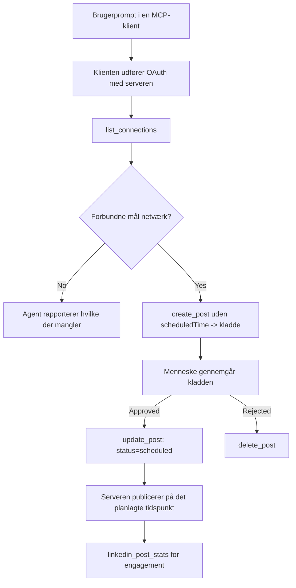

# Casestudie: Publicering til sociale netværk fra en agent med en fjern MCP-server

> **Ansvarsfraskrivelse:** Flere tjenester og open-source projekter kan publicere til sociale netværk, og et team kunne også integrere hver netværks API direkte. Scenariet nedenfor gives som et eksemplarisk eksempel på, hvordan en **skrivbar fjern MCP-server** kan designes og anvendes. Publora er en kommerciel tjeneste med et gratis niveau; de mønstre, der beskrives her, gælder for enhver MCP-server, der udfører irreversible handlinger på brugerens vegne.

## Oversigt

Agenter er gode til at udarbejde indhold og dårlige til at levere det. En model kan skrive en pressemeddelelse på få sekunder, og så stopper arbejdet: at publicere det betyder et API pr. netværk, en OAuth-app pr. netværk og et forskelligt sæt medieregler for hvert. De fleste teams løser dette ved manuelt at kopiere teksten ind i en browser.

Denne casestudie ser på, hvordan det sidste trin afsluttes med en enkelt fjern MCP-server, og – mere brugbart for alle, der bygger en – på de designbeslutninger, en **skrivbar** server skal have helt ret i. At læse data er tilgivende. At publicere er det ikke: et forkert værktøjskald er synligt for et publikum og kan ikke fortrydes.

## Scenarie

Et lille developer-relations team udarbejder opslag i en agent (Claude, VS Code, Cursor – klienten er underordnet). De ønsker, at agenten skal:

- se hvilke sociale konti teamet har tilknyttet,
- udarbejde et opslag og beholde det som et udkast til godkendelse af et menneske,
- vedhæfte et billede,
- planlægge det til flere netværk på et valgt tidspunkt,
- og senere rapportere, hvordan det klarede sig.

Vigtigt er det, at de ønsker, at agenten *ikke* kan publicere ved en fejl, mens de stadig eksperimenterer.

## Brugte værktøjer

- [Publora MCP Server](https://github.com/publora/mcp-server) — en fjern MCP-server (`streamable-http`), der eksponerer publicerings-, planlægnings-, medie- og LinkedIn-analysetjenester. Registreret i den officielle MCP-registrering som `com.publora/mcp-server`.

## Trin-for-trin arbejdsproces

1. **Forbind til serveren.** Klienter, der bruger OAuth, gennemfører autorisationskode-flowet med PKCE mod serverens egen samtykkeskærm; klienter, der ikke gør, såsom headless CLI'er, bruger en Publora API-nøgle i et headerfelt. Begge metoder understøttes, og hvilken du får, afhænger af klienten, ikke af serveren.
2. **List forbindelser.** Agenten kalder `list_connections` og modtager de tilknyttede konti med deres identifikatorer.
3. **Udkast.** Agenten kalder `create_post` *uden* en planlagt tid. Opslaget gemmes som udkast — intet publiceres.
4. **Vedhæft medier.** Offentlige billed-URL'er sendes med i samme kald; serveren downloader og validerer dem.
5. **Planlæg.** Efter menneskelig godkendelse sætter `update_post` status til planlagt med et ISO 8601-tidspunkt.
6. **Mål.** For LinkedIn returnerer `linkedin_post_stats` engagement, når opslaget er live.

## Eksempelprompt

```text
Which social accounts do I have connected?
Draft a post announcing our new changelog page, attach the screenshot at
https://example.com/changelog.png, and keep it as a draft — do not publish it.
Once I approve, schedule it to LinkedIn and Bluesky for tomorrow at 09:00 UTC.
```

## Mermaid flowdiagram



## Teknisk implementering

Læringerne nedenfor er den overførbare del af denne casestudie.

### Åben opdagelse, autentificeret eksekvering

`tools/list` serveres uden legitimationsoplysninger; hver `tools/call` kræver et token og returnerer ellers `401` med et `WWW-Authenticate` header, der peger på metadata for den beskyttede ressource. (Serveren svarer også på en ikke-autentificeret `initialize`, hvilket kun er relevant for klienter på protokolversioner før `2026-07-28`; den revision fjernede hele håndtrykket.)

Denne opdeling betyder noget i praksis. Registryer, kataloger og klienter kan introspektere værktøjsoverfladen — navne, skemaer, annotationer — uden at have en hemmelighed, mens intet kan *eksekveres* anonymt. En server, der kræver token for `initialize`, er reelt set usynlig for værktøjer; en server, der tillader anonym `tools/call`, er en risiko.

### Registrering: dynamisk klientregistrering og hvad der erstatter den

Serveren annoncerer `/.well-known/oauth-protected-resource` og `/.well-known/oauth-authorization-server`, og understøtter autorisationskode-flow med PKCE (`S256`), refresh tokens, og **dynamisk klientregistrering**.

Dynamisk registrering fjerner det manuelle trin: uden den skal hver klient have et forududstedt `client_id`, hvilket betyder en out-of-band anmodning til leverandøren for hver ny klient.

Betragt dette som kompatibilitetsadfærd snarere end det design, man skal kopiere. Revisionen `2026-07-28` af specifikationen udfaser dynamisk klientregistrering til fordel for Client ID Metadata Documents, hvor klienten hoster et metadocumentedokument på en stabil HTTPS-URL, og denne URL *er* `client_id`. DCR virker fortsat for nu, men en server, der bygges i dag, bør planlægge for CIMD og bevare DCR kun for ældre klienter.

### Værktøjsannotationer er ikke pynt

Hvert værktøj bærer en `title` og de gældende hints: `readOnlyHint`, `destructiveHint`, `idempotentHint`, `openWorldHint`.

To grunde til at investere i dem. For det første bruger klienter hints til at afgøre, hvad der skal bekræftes med brugeren — en klient kan automatisk køre en læse-only opslag og stoppe for godkendelse inden sletning. Specifikationen er eksplicit om, at annotationer er uautoriserede hints, ikke en autorisationsmekanisme: de former, hvad en klient tilbyder at gøre, stopper ikke noget på serveren, og serveren skal stadig håndhæve sine egne regler. For det andet kræver de store connector-kataloger nu *dem* for review; en server, hvis værktøjer mangler titler og hints, sendes tilbage uanset hvor godt den virker.

### Gør identifikatorer uopfundelige

Platformidentifikatorer er uigennemsigtige strenge, der returneres af `list_connections`, og skemabeskrivelsen siger eksplicit, at de skal kopieres ordret og aldrig gættes. Serveren afviser alt andet.

Modeller er dygtige til at gætte. Enhver skrive-kompetent server bør antage, at en identifikator til sidst vil blive hallucineret og få den sti til at fejle højt og tidligt, i stedet for at handle på en plausibel værdi.

### Fejl før publicering med en handlingsorienteret besked

Nogle netværk nægter tekst-only opslag og kræver et billede eller video. Det valideres, når opslaget planlægges, og fejlen navngiver platformen og det manglende krav.

En agent kan genvinde fra "Instagram kræver medier — vedhæft et billede eller video" uden en ekstra runde. Den kan ikke genvinde fra en generisk `400`.

### Gør retry'er sikre

De to værktøjer, der skaber indhold, `create_post` og `update_post`, accepterer en idempotensnøgle: genbrug af den med en identisk anmodning afspiller det originale svar i stedet for at oprette et andet opslag. Agent-runtime retry'er ved timeouts; uden idempotens bliver et langsomt svar til en dublet-publicering. De øvrige skriveværktøjer – sletninger, medietrin, LinkedIn-reaktioner og kommentarer – tager ikke nogen, så retry'er der er ikke automatisk sikre. Det er værd at kende, hvilke mutationer du selv beskytter, og hvilke du ikke gør.

### Sørg for en måde at teste, der ikke publicerer noget

Serveren accepterer et reserveret mål, `publora-playground`, som valideres og anerkendes som en reel destination og derefter kasseres — intet når en live-konto. Det er dokumenteret i værktøjsskemaet selv, som enhver klient kan læse uden legitimationsoplysninger: feltet `platforms` for `create_post` dokumenterer det som "et forbindelse-testmål, der ikke kræver nogen reel forbindelse — opslaget anerkendes og kasseres, intet publiceres". Invoker det ved at passere det som det eneste element: `platforms: ["publora-playground"]`.

Dette viste sig at være en af de mest nyttige detaljer i hele overfladen. Gennemgangere af connector-kataloger, bidragsydere og CI kan køre hele skrivevejen end-to-end uden risiko for et rigtigt publikum. Enhver MCP-server med irreversible handlinger har gavn af et dokumenteret no-op mål.

## Resultater og påvirkning

- Publiceringstrinnet flyttede fra en browser til samme samtale, hvor indholdet skrives, og en udkast-først vane holder et menneske i sløjfen. Vær præcis omkring, hvad det er: et udkast er en konvention, ikke en grænse. Samme legitimationsoplysninger kan planlægge eller publicere, så enhver, der har brug for en reel godkendelsesport, skal håndhæve det uden for værktøjsoverfladen — separate legitimationsoplysninger eller et politiklag foran serveren.
- Netværksforskelle — mediekrav, tråde, svarstyring — håndteres én gang i serveren i stedet for i hver agent, der taler til den.
- Samme server understøtter flere MCP-klienter uden arbejde pr. klient, fordi opdagelse er åben og registrering dynamisk.
- De designbegrænsninger ovenfor blev formet lige så meget af anmeldelser af connector-kataloger som af brugere: annotationer, OAuth og et sikkert testmål var hver især krævet af mindst én af dem.

## Referencer

- [Publora MCP Server (kilde)](https://github.com/publora/mcp-server)
- [Publora API og MCP dokumentation](https://docs.publora.com)
- [MCP Registry entry: `com.publora/mcp-server`](https://registry.modelcontextprotocol.io/v0/servers?search=com.publora/mcp-server)
- [MCP specifikation — Autorisation](https://modelcontextprotocol.io/specification/draft/basic/authorization)
- [MCP specifikation — Værktøjsannotationer](https://modelcontextprotocol.io/docs/concepts/tools)

## Hvad er det næste

- Tag en MCP-server, du bygger, og tjek de tre billigste gevinster her: annotationer på hvert værktøj, en idempotensnøgle på hver skrivning, og et dokumenteret no-op mål.
- Prøv den åbne opdagelsesopdeling: kald `tools/list` mod en offentlig fjernserver uden legitimationsoplysninger, og kald derefter et værktøj og undersøg `401`-udfordringen.
- Overvej, hvad "fortryd" betyder for dit domæne. Publicering har udkast og sletning; hvis dine handlinger ikke har en tilsvarende, hører bekræftelse til i værktøjets design, ikke i prompten.

---

<!-- CO-OP TRANSLATOR DISCLAIMER START -->
**Ansvarsfraskrivelse**:
Dette dokument er blevet oversat ved hjælp af AI-oversættelsestjenesten [Co-op Translator](https://github.com/Azure/co-op-translator). Selvom vi bestræber os på nøjagtighed, skal du være opmærksom på, at automatiserede oversættelser kan indeholde fejl eller unøjagtigheder. Det originale dokument på dets oprindelige sprog bør betragtes som den autoritative kilde. For kritisk information anbefales professionel menneskelig oversættelse. Vi påtager os intet ansvar for misforståelser eller fejltolkninger, der opstår som følge af brugen af denne oversættelse.
<!-- CO-OP TRANSLATOR DISCLAIMER END -->