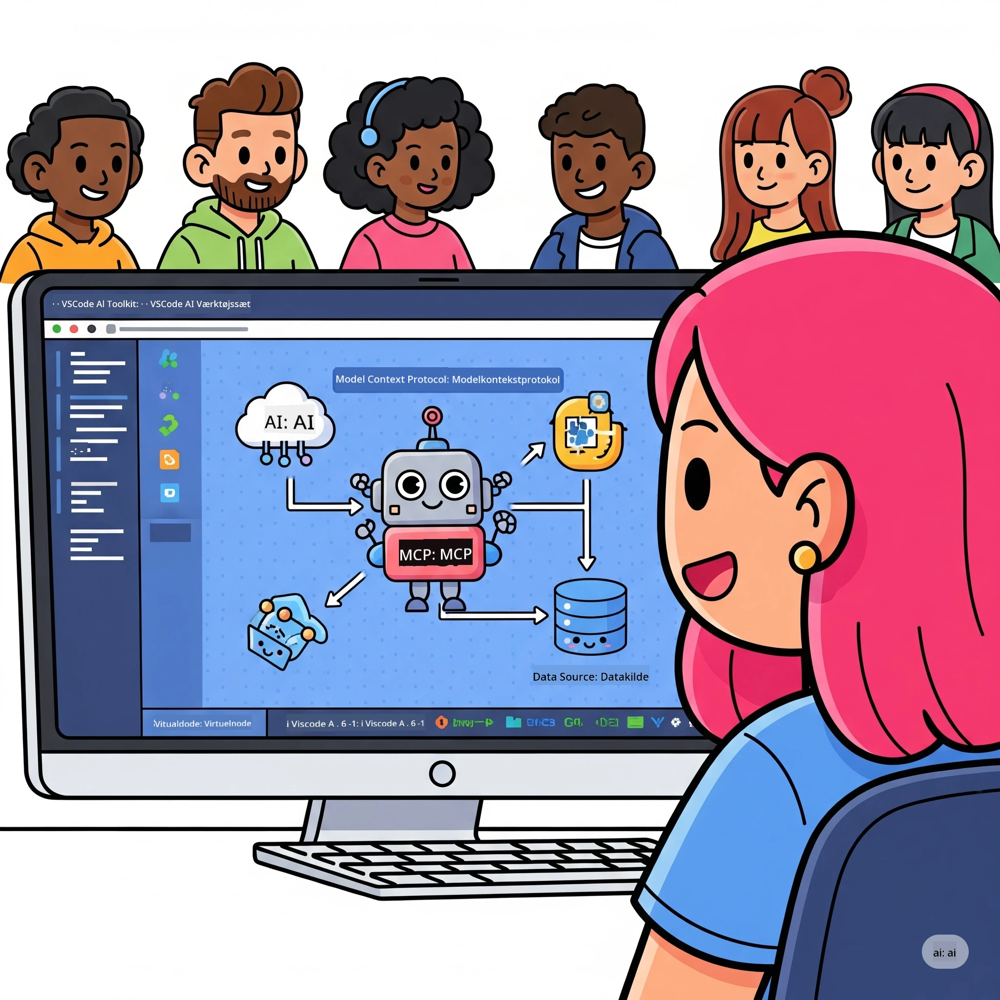
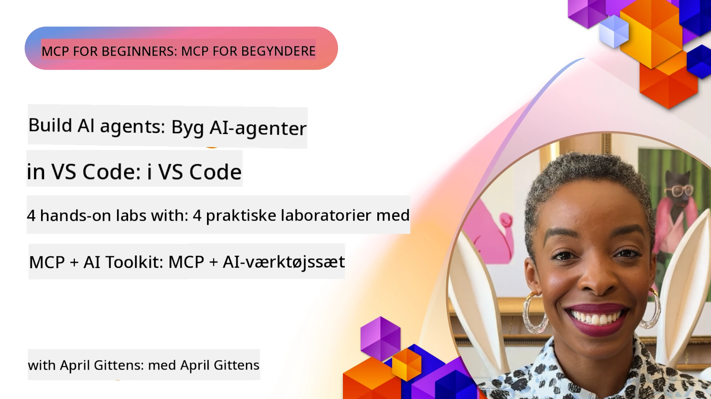

# Strømlining af AI-arbejdsgange: Bygning af en MCP-server med Microsoft Foundry Toolkit

## 🎯 Oversigt

_(Klik på billedet ovenfor for at se videoen til denne lektion)_

Velkommen til **Model Context Protocol (MCP) Workshoppen**! Denne omfattende hands-on workshop kombinerer to banebrydende teknologier for at revolutionere udvikling af AI-applikationer:

> **Kompatibilitetsnote:** workshopkoden er bygget og testet med MCP
> `2025-11-25`, som vist med badge ovenfor. Brug den
> [nuværende `2026-07-28` specifikation](https://modelcontextprotocol.io/specification/2026-07-28/)
> til nye protokolimplementeringer og gennemgå SDK udgivelsesnoter før
> migrering af laboratorierne.

- **🔗 Model Context Protocol (MCP)**: En åben standard for sømløs AI-værktøjsintegration
- **🛠️ Microsoft Foundry Toolkit Extension for VS Code**: Microsofts kraftfulde AI-udviklingsudvidelse

### 🎓 Hvad Du Vil Lære

Ved slutningen af denne workshop vil du mestre kunsten at bygge intelligente applikationer, der forbinder AI-modeller med virkelige værktøjer og tjenester. Fra automatiseret test til brugerdefinerede API-integrationer, får du praktiske færdigheder til at løse komplekse forretningsudfordringer.

## 🏗️ Teknologistak

### 🔌 Model Context Protocol (MCP)

MCP er **"USB-C for AI"** – en universel standard, som forbinder AI-modeller til eksterne værktøjer og datakilder.

**✨ Nøglefunktioner:**

- 🔄 **Standardiseret Integration**: Universelt interface for AI-værktøjsforbindelser
- 🏛️ **Fleksibel Arkitektur**: Lokale & fjernservere via stdio/SSE transport
- 🧰 **Rigt Økosystem**: Værktøjer, prompts og ressourcer i én protokol
- 🔒 **Enterprise-Klar**: Indbygget sikkerhed og pålidelighed

**🎯 Hvorfor MCP Betyr Noget:**
Ligesom USB-C fjernede kabelkaos, fjerner MCP kompleksiteten af AI-integrationer. Én protokol, uendelige muligheder.

### 🤖 Microsoft Foundry Toolkit Extension for VS Code

Microsofts flagskibsudvidelse til AI-udvikling, som forvandler VS Code til en AI-kraftstation.

**🚀 Kernefunktioner:**

- 📦 **Modelkatalog**: Adgang til modeller fra Azure AI, GitHub, Hugging Face, Ollama
- ⚡ **Lokal Inferens**: ONNX-optimeret CPU/GPU/NPU eksekvering
- 🏗️ **Agent Builder**: Visuel AI-agentudvikling med MCP-integration
- 🎭 **Multi-Modal**: Tekst-, syns- og struktureret outputsupport

**💡 Fordele ved udvikling:**

- Zero-konfig modeludrulning
- Visuel prompt-engineering
- Real-time testmiljø
- Sømløs MCP serverintegration

## 📚 Læringsrejse

### [🚀 Modul 1: Microsoft Foundry Toolkit Grundprincipper](./lab1/README.md)

**Varighed**: 15 minutter

- 🛠️ Installer og konfigurer Microsoft Foundry Toolkit til VS Code
- 🗂️ Udforsk Modelkataloget (100+ modeller fra GitHub, ONNX, OpenAI, Anthropic, Google)
- 🎮 Mestring af det interaktive legeplads for real-time modeltest
- 🤖 Byg din første AI-agent med Agent Builder
- 📊 Evaluer modelpræstation med indbyggede metrics (F1, relevans, lighed, kohærens)
- ⚡ Lær batchbehandling og multi-modal supportfunktioner

**🎯 Læringsresultat**: Skab en funktionel AI-agent med omfattende forståelse af Microsoft Foundry Toolkit funktioner

### [🌐 Modul 2: MCP med Microsoft Foundry Toolkit Grundprincipper](./lab2/README.md)

**Varighed**: 20 minutter

- 🧠 Mestring af Model Context Protocol (MCP) arkitektur og koncepter
- 🌐 Udforsk Microsofts MCP serverøkosystem
- 🤖 Byg en browserautomatiseringsagent med Playwright MCP server
- 🔧 Integrer MCP servere med Microsoft Foundry Toolkit Agent Builder
- 📊 Konfigurer og test MCP værktøjer inden for dine agenter
- 🚀 Eksporter og udrul MCP-drevne agenter til produktionsbrug

**🎯 Læringsresultat**: Udrul en AI-agent superladet med eksterne værktøjer gennem MCP

### [🔧 Modul 3: Avanceret MCP-udvikling med Microsoft Foundry Toolkit](./lab3/README.md)

**Varighed**: 20 minutter

- 💻 Opret brugerdefinerede MCP-servere ved hjælp af Microsoft Foundry Toolkit
- 🐍 Konfigurer og brug den nyeste MCP Python SDK (v1.9.3)
- 🔍 Opsæt og anvend MCP Inspector til fejlfinding
- 🛠️ Byg en Weather MCP Server med professionelle debug-workflows
- 🧪 Debug MCP-servere i både Agent Builder og Inspector miljøer

**🎯 Læringsresultat**: Udvikl og fejlret brugerdefinerede MCP-servere med moderne værktøjer

### [🐙 Modul 4: Praktisk MCP-udvikling - Brugerdefineret GitHub Clone Server](./lab4/README.md)

**Varighed**: 30 minutter

- 🏗️ Byg en reel GitHub Clone MCP Server til udviklingsarbejdsgange
- 🔄 Implementer smart repository cloning med validering og fejlhåndtering
- 📁 Skab intelligent directory management og VS Code-integration
- 🤖 Brug GitHub Copilot Agent Mode med brugerdefinerede MCP-værktøjer
- 🛡️ Anvend produktionsklar pålidelighed og tværplatforms-kompatibilitet

**🎯 Læringsresultat**: Udrul en produktionsklar MCP-server, der effektiviserer reelle udviklingsarbejdsgange

## 💡 Virkelige Anvendelser & Indflydelse

### 🏢 Enterprise-brugssager

#### 🔄 DevOps Automatisering

Forvandl din udviklingsworkflow med intelligent automatisering:

- **Smart Repository Management**: AI-drevet kodegennemgang og merge-beslutninger
- **Intelligent CI/CD**: Automatiseret pipelineoptimering baseret på kodeændringer
- **Issue Triage**: Automatisk fejlklassifikation og tildeling

#### 🧪 Kvalitetssikringsrevolution

Forbedr testning med AI-drevet automatisering:

- **Intelligent Testgenerering**: Skab omfattende testsuiter automatisk
- **Visuel Regressionstest**: AI-drevet UI ændringsdetektion
- **Performance Monitoring**: Proaktiv identifikation og løsning af problemer

#### 📊 Data Pipeline Intelligens

Byg smartere dataprocest workflows:

- **Adaptive ETL Processer**: Selvoptimerende datatransformationer
- **Anomalidetektion**: Real-time datakvalitetsovervågning
- **Intelligent Routing**: Smart dataflow-administration

#### 🎧 Forbedring af Kundeoplevelse

Skab enestående kundeinteraktioner:

- **Kontextbevidst Support**: AI-agenter med adgang til kundehistorik
- **Proaktiv Problemløsning**: Forudsigende kundeservice
- **Multi-Channel Integration**: Enheds AI-oplevelse på tværs af platforme

## 🛠️ Forudsætninger & Opsætning

### 💻 Systemkrav

| Komponent | Krav | Noter |
|-----------|-------|-------|
| **Operativsystem** | Windows 10+, macOS 10.15+, Linux | Enhver moderne OS |
| **Visual Studio Code** | Seneste stabile version | Påkrævet for Microsoft Foundry Toolkit |
| **Node.js** | v18.0+ og npm | Til MCP serverudvikling |
| **Python** | 3.10+ | Valgfrit til Python MCP servere |
| **Hukommelse** | Minimum 8GB RAM | 16GB anbefales til lokale modeller |

### 🔧 Udviklingsmiljø

#### Anbefalede VS Code Udvidelser

- **Microsoft Foundry Toolkit** (ms-windows-ai-studio.windows-ai-studio)
- **Python** (ms-python.python)
- **Python Debugger** (ms-python.debugpy)
- **GitHub Copilot** (GitHub.copilot) - Valgfri men nyttig

#### Valgfrie Værktøjer

- **uv**: Moderne Python pakkehåndtering
- **MCP Inspector**: Visuelt debugværktøj til MCP-servere
- **Playwright**: Til webautomatiseringseksempler

## 🎖️ Læringsresultater & Certificeringsvej

### 🏆 Kompetenceopnåelsescheckliste

Ved at gennemføre denne workshop opnår du mestring i:

#### 🎯 Kernekompetencer

- [ ] **MCP Protokolmestring**: Dybt kendskab til arkitektur og implementeringsmønstre
- [ ] **Microsoft Foundry Toolkit Færdighed**: Ekspertbrug af Microsoft Foundry Toolkit til hurtig udvikling
- [ ] **Brugerdefineret Serverudvikling**: Byg, udrul og vedligehold produktions-MCP-servere
- [ ] **Fremragende Værktøjsintegration**: Sømløs forbindelse af AI med eksisterende udviklingsarbejdsgange
- [ ] **Anvendelse af Problemløsning**: Anvend lærte færdigheder på reelle forretningsudfordringer

#### 🔧 Tekniske Færdigheder

- [ ] Opsætning og konfiguration af Microsoft Foundry Toolkit i VS Code
- [ ] Design og implementering af brugerdefinerede MCP-servere
- [ ] Integration af GitHub-modeller med MCP-arkitektur
- [ ] Bygning af automatiserede testarbejdsgange med Playwright
- [ ] Udrul AI-agenter til produktionsbrug
- [ ] Debug og optimer MCP serverperformance

#### 🚀 Avancerede Funktioner

- [ ] Arkitekt enterprise-skala AI-integrationer
- [ ] Implementer sikkerhedspraksis for AI-applikationer
- [ ] Design skalerbare MCP-serverarkitekturer
- [ ] Skab brugerdefinerede værktøjskæder til specifikke domæner
- [ ] Mentorer andre i AI-native udvikling

## 📖 Yderligere Ressourcer

- [MCP Specifikation (2026-07-28)](https://modelcontextprotocol.io/specification/2026-07-28/)
- [Microsoft Foundry Toolkit GitHub Repository](https://github.com/microsoft/vscode-ai-toolkit)
- [Eksempelsamling af MCP Servere](https://github.com/modelcontextprotocol/servers)
- [Bedste Praksis Guide](https://modelcontextprotocol.io/docs/best-practices)
- [OWASP MCP Top 10](https://microsoft.github.io/mcp-azure-security-guide/mcp/) - Sikkerhedspraksis

---

**🚀 Klar til at revolutionere din AI-udviklingsworkflow?**

Lad os sammen bygge fremtidens intelligente applikationer med MCP og Microsoft Foundry Toolkit!

## Hvad er Næste Skridt

Fortsæt til: [Modul 11: MCP Server Hands-On Labs](../11-MCPServerHandsOnLabs/README.md)

---

<!-- CO-OP TRANSLATOR DISCLAIMER START -->
**Ansvarsfraskrivelse**:
Dette dokument er blevet oversat ved hjælp af AI-oversættelsestjenesten [Co-op Translator](https://github.com/Azure/co-op-translator). Selvom vi bestræber os på nøjagtighed, skal du være opmærksom på, at automatiserede oversættelser kan indeholde fejl eller unøjagtigheder. Det originale dokument på dets oprindelige sprog bør betragtes som den autoritative kilde. For kritisk information anbefales professionel menneskelig oversættelse. Vi påtager os intet ansvar for misforståelser eller fejltolkninger, der opstår som følge af brugen af denne oversættelse.
<!-- CO-OP TRANSLATOR DISCLAIMER END -->