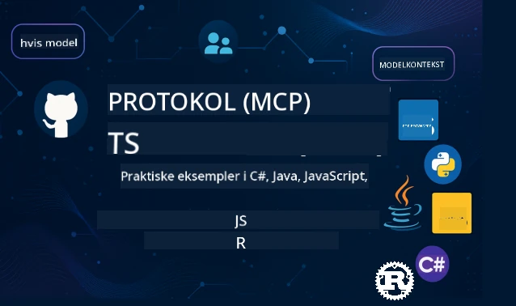

 

[](https://GitHub.com/microsoft/mcp-for-beginners/graphs/contributors)
[](https://GitHub.com/microsoft/mcp-for-beginners/issues)
[](https://GitHub.com/microsoft/mcp-for-beginners/pulls)
[](http://makeapullrequest.com)

[](https://GitHub.com/microsoft/mcp-for-beginners/watchers)
[](https://GitHub.com/microsoft/mcp-for-beginners/fork)
[](https://GitHub.com/microsoft/mcp-for-beginners/stargazers)


[](https://discord.gg/nTYy5BXMWG)

Følg disse trin for at komme i gang med at bruge disse ressourcer:
1. **Fork repositoryet**: Klik på [](https://GitHub.com/microsoft/mcp-for-beginners/fork)
2. **Klon repositoryet**:   `git clone https://github.com/microsoft/mcp-for-beginners.git`
3. **Deltag i** [](https://discord.gg/nTYy5BXMWG)


### 🌐 Flersproget Support

#### Understøttet via GitHub Action (Automatiseret & Altid Opdateret)

<!-- CO-OP TRANSLATOR LANGUAGES TABLE START -->
[Arabic](../ar/README.md) | [Bengali](../bn/README.md) | [Bulgarian](../bg/README.md) | [Burmese (Myanmar)](../my/README.md) | [Chinese (Simplified)](../zh-CN/README.md) | [Chinese (Traditional, Hong Kong)](../zh-HK/README.md) | [Chinese (Traditional, Macau)](../zh-MO/README.md) | [Chinese (Traditional, Taiwan)](../zh-TW/README.md) | [Croatian](../hr/README.md) | [Czech](../cs/README.md) | [Danish](./README.md) | [Dutch](../nl/README.md) | [Estonian](../et/README.md) | [Finnish](../fi/README.md) | [French](../fr/README.md) | [German](../de/README.md) | [Greek](../el/README.md) | [Hebrew](../he/README.md) | [Hindi](../hi/README.md) | [Hungarian](../hu/README.md) | [Indonesian](../id/README.md) | [Italian](../it/README.md) | [Japanese](../ja/README.md) | [Kannada](../kn/README.md) | [Korean](../ko/README.md) | [Lithuanian](../lt/README.md) | [Malay](../ms/README.md) | [Malayalam](../ml/README.md) | [Marathi](../mr/README.md) | [Nepali](../ne/README.md) | [Nigerian Pidgin](../pcm/README.md) | [Norwegian](../no/README.md) | [Persian (Farsi)](../fa/README.md) | [Polish](../pl/README.md) | [Portuguese (Brazil)](../pt-BR/README.md) | [Portuguese (Portugal)](../pt-PT/README.md) | [Punjabi (Gurmukhi)](../pa/README.md) | [Romanian](../ro/README.md) | [Russian](../ru/README.md) | [Serbian (Cyrillic)](../sr/README.md) | [Slovak](../sk/README.md) | [Slovenian](../sl/README.md) | [Spanish](../es/README.md) | [Swahili](../sw/README.md) | [Swedish](../sv/README.md) | [Tagalog (Filipino)](../tl/README.md) | [Tamil](../ta/README.md) | [Telugu](../te/README.md) | [Thai](../th/README.md) | [Turkish](../tr/README.md) | [Ukrainian](../uk/README.md) | [Urdu](../ur/README.md) | [Vietnamese](../vi/README.md)

> **Foretrækker du at klone lokalt?**

> Dette repository inkluderer 50+ sprogoversættelser, hvilket markant øger download-størrelsen. For at klone uden oversættelser, brug sparse checkout:
> ```bash
> git clone --filter=blob:none --sparse https://github.com/microsoft/mcp-for-beginners.git
> cd mcp-for-beginners
> git sparse-checkout set --no-cone '/*' '!translations' '!translated_images'
> ```
> Dette giver dig alt, hvad du behøver for at gennemføre kurset med en meget hurtigere download.
<!-- CO-OP TRANSLATOR LANGUAGES TABLE END -->

# 🚀 Model Context Protocol (MCP) Kursus for Begyndere

## **Lær MCP med praktiske kodeeksempler i C#, Java, JavaScript, Rust, Python og TypeScript**

## 🧠 Oversigt over Model Context Protocol-kurset
Velkommen på din rejse ind i Model Context Protocol! Hvis du nogensinde har spekuleret på, hvordan AI-applikationer kommunikerer med forskellige værktøjer og services, er du ved at opdage den elegante løsning, der ændrer måden, hvorpå udviklere bygger intelligente systemer.

Tænk på MCP som en universaloversætter til AI-applikationer - på samme måde som USB-porte lader dig forbinde enhver enhed til din computer, lader MCP AI-modeller forbinde til ethvert værktøj eller service på en standardiseret måde. Uanset om du bygger din første chatbot eller arbejder på komplekse AI-arbejdsgange, vil forståelsen af MCP give dig mulighed for at skabe mere kraftfulde og fleksible applikationer.

Dette kursus er designet med tålmodighed og omsorg for din læringsrejse. Vi starter med enkle koncepter, du allerede forstår, og bygger gradvist din ekspertise gennem praktisk øvelse i dit foretrukne programmeringssprog. Hvert trin inkluderer klare forklaringer, praktiske eksempler og masser af opmuntring undervejs.

Når du har gennemført denne rejse, vil du have selvtilliden til at bygge dine egne MCP-servere, integrere dem med populære AI-platforme og forstå, hvordan denne teknologi omformer fremtiden for AI-udvikling. Lad os begynde dette spændende eventyr sammen!

### Officiel Dokumentation og Specifikationer

Disse ressourcer bliver mere værdifulde, efterhånden som din forståelse vokser, men føl dig ikke presset til at læse alt med det samme. Start med de områder, der interesserer dig mest!
- 📘 [MCP Dokumentation](https://modelcontextprotocol.io/) – Dette er din go-to ressource for trin-for-trin tutorials og brugervejledninger. Dokumentationen er skrevet med begyndere i tankerne og giver klare eksempler, du kan følge i dit eget tempo.
- 📜 [MCP Specifikation](https://modelcontextprotocol.io/docs/) – Tænk på dette som din omfattende referencehåndbog. Mens du arbejder dig gennem kurset, vil du ofte vende tilbage hertil for at slå specifikke detaljer op og udforske avancerede funktioner.
- 📜 [Original MCP Specifikation](https://modelcontextprotocol.io/specification/versioning) – Denne indeholder yderligere tekniske detaljer, som kan være nyttige for avancerede implementeringer. Den er der, når du har brug for den, men vær ikke bekymret for den i starten.
- 🧑‍💻 [MCP GitHub Repository](https://github.com/modelcontextprotocol) – Her finder du SDK'er, værktøjer og kodeeksempler på flere programmeringssprog. Det er som en skattekiste af praktiske eksempler og klar-til-brug komponenter.
- 🌐 [MCP Community](https://github.com/orgs/modelcontextprotocol/discussions) – Deltag sammen med andre elever og erfarne udviklere i diskussioner om MCP. Det er et støttende fællesskab, hvor spørgsmål er velkomne, og viden deles frit.
  
## Læringsmål

Når du er færdig med dette kursus, vil du føle dig selvsikker og begejstret over dine nye evner. Her er, hvad du vil opnå:

• **Forstå MCP-grundprincipper**: Du vil få styr på, hvad Model Context Protocol er, og hvorfor det revolutionerer måden, AI-applikationer arbejder sammen på, ved brug af analogier og eksempler, der giver mening.

• **Byg din første MCP-server**: Du vil skabe en fungerende MCP-server i dit foretrukne programmeringssprog, starte med enkle eksempler og gradvist opbygge dine færdigheder.

• **Forbind AI-modeller til virkelige værktøjer**: Du vil lære, hvordan du bygger bro mellem AI-modeller og faktiske services og giver dine applikationer kraftfulde nye muligheder.

• **Implementér sikkerhedspraksis**: Du vil forstå, hvordan du holder dine MCP-implementeringer sikre, så både dine applikationer og brugere beskyttes.

• **Deploy med selvtillid**: Du vil vide, hvordan du fører dine MCP-projekter fra udvikling til produktion med praktiske deploymentsstrategier, der virker i virkeligheden.

• **Bliv del af MCP-fællesskabet**: Du vil blive en del af et voksende fællesskab af udviklere, som former fremtiden for AI-applikationsudvikling. 

## Vigtig Baggrundsviden

Før vi dykker ned i MCP-specifikke ting, skal vi sikre os, at du har det godt med nogle grundlæggende koncepter. Bare rolig, hvis du ikke er ekspert på disse områder – vi forklarer alt, du behøver at vide, undervejs!

### Forstå protokoller (Grundlaget)

Tænk på en protokol som reglerne for en samtale. Når du ringer til en ven, ved I begge, at I siger "hej", når I svarer, skiftes til at tale, og siger "farvel", når I er færdige. Computerprogrammer har brug for lignende regler for at kommunikere effektivt.

MCP er en protokol – et sæt aftalte regler, der hjælper AI-modeller og applikationer med at have produktive "samtaler" med værktøjer og services. Ligesom samtaleregler gør menneskelig kommunikation glattere, gør MCP AI-kommunikationen mere pålidelig og kraftfuld.

### Klient-server-forhold (Hvordan programmer arbejder sammen)

Du bruger allerede klient-server-forhold hver dag! Når du bruger en browser (klienten) til at besøge et website, forbinder du til en webserver, som sender siden til dig. Browseren ved, hvordan den skal bede om information, og serveren ved, hvordan den skal svare.

I MCP har vi et lignende forhold: AI-modeller fungerer som klienter, der anmoder om information eller handlinger, mens MCP-servere leverer disse funktioner. Det er som at have en hjælpsom assistent (serveren), som AI kan bede om at udføre bestemte opgaver.

### Hvorfor standardisering er vigtigt (At få ting til at fungere sammen)

Forestil dig, at hver bilproducent brugte forskellige former for benzinpumper – så skulle du bruge en anden adapter til hver bil! Standardisering betyder, at man bliver enige om fælles tilgange, så tingene fungerer gnidningsløst sammen.

MCP giver denne standardisering for AI-applikationer. I stedet for at hver AI-model skal bruge specialkode til hvert værktøj, skaber MCP en universel kommunikationsmetode. Det betyder, at udviklere kan bygge værktøjer én gang, og så virker de sammen med mange forskellige AI-systemer.

## 🧭 Oversigt over din læringssti

Din MCP-rejse er omhyggeligt struktureret, så du gradvist opbygger selvtillid og færdigheder. Hvert fase introducerer nye koncepter samtidig med, at det, du allerede har lært, styrkes.

### 🌱 Grundfase: Forstå det Grundlæggende (Moduler 0-2)

Her begynder dit eventyr! Vi introducerer dig til MCP-konceptet med kendte analogier og enkle eksempler. Du vil forstå, hvad MCP er, hvorfor det findes, og hvordan det passer ind i AI-udviklingens større verden.

• **Modul 0 - Introduktion til MCP**: Vi starter med at udforske, hvad MCP er, og hvorfor det er så vigtigt for moderne AI-applikationer. Du ser virkelige eksempler på MCP i brug og forstår, hvordan det løser almindelige problemer, som udviklere møder.

• **Modul 1 - Grundlæggende Begreber Forklaret**: Her lærer du MCP’s essentielle byggesten. Vi bruger mange analogier og visuelle eksempler for at sikre, at disse koncepter føles naturlige og forståelige.

• **Modul 2 - Sikkerhed i MCP**: Sikkerhed kan lyde skræmmende, men vi viser dig, hvordan MCP har indbyggede sikkerhedsfunktioner og lærer dig bedste praksis for at beskytte dine applikationer fra begyndelsen.

### 🔨 Byggefasen: Skabe Dine Første Implementeringer (Modul 3)

Nu begynder det virkelige sjov! Du får praktisk erfaring med at bygge rigtige MCP-servere og klienter. Bare rolig – vi starter simpelt og guider dig igennem hvert trin.

Dette modul indeholder flere praktiske guides, der lader dig øve i dit foretrukne programmeringssprog. Du vil bygge din første server, lave en klient til at forbinde til den og endda integrere med populære udviklingsværktøjer som VS Code.
Hver vejledning indeholder komplette kodeeksempler, fejlfindingstips og forklaringer på, hvorfor vi foretager specifikke designvalg. Ved slutningen af denne fase vil du have fungerende MCP-implementeringer, som du kan være stolt af!

### 🚀 Vækstfase: Avancerede koncepter og anvendelse i praksis (Moduler 4-5)

Når det grundlæggende er mestret, er du klar til at udforske mere sofistikerede MCP-funktioner. Vi vil dække praktiske implementeringsstrategier, debugging-teknikker og avancerede emner som multimodal AI-integration.

Du vil også lære, hvordan du skalerer dine MCP-implementeringer til produktionsbrug og integrerer med cloud-platforme som Azure. Disse moduler forbereder dig på at bygge MCP-løsninger, som kan håndtere virkelighedens krav.

### 🌟 Mestre-fase: Community og specialisering (Moduler 6-11)

Den sidste fase fokuserer på at blive en del af MCP-fællesskabet og specialisere dig inden for områder, der interesserer dig mest. Du vil lære, hvordan du bidrager til open-source MCP-projekter, implementerer avancerede autentificeringsmønstre og bygger omfattende database-integrerede løsninger.

Modul 11 fortjener særlig opmærksomhed – det er et komplet 13-labs praktisk læringsforløb, der lærer dig at bygge produktionsklare MCP-servere med PostgreSQL-integration. Det er som et afsluttende projekt, der samler alt, hvad du har lært!

### 📚 Komplett pensumstruktur

| Modul | Emne | Beskrivelse | Link |
|--------|-------|-------------|------|
| **Modul 1-3: Grundlæggende** | | | |
| 00 | Introduktion til MCP | Oversigt over Model Context Protocol og dets betydning i AI-pipelines | [Læs mere](./00-Introduction/README.md) |
| 01 | Forklaring af kernekoncepter | Dybtgående udforskning af kernekoncepter i MCP | [Læs mere](./01-CoreConcepts/README.md) |
| 02 | Sikkerhed i MCP | Sikkerhedstrusler og bedste praksis | [Læs mere](./02-Security/README.md) |
| 03 | Kom godt i gang med MCP | Opsætning af miljø, grundlæggende servere/klienter, integration | [Læs mere](./03-GettingStarted/README.md) |
| **Modul 3: Byg din første server & klient** | | | |
| 3.1 | Første server | Opret din første MCP-server | [Guide](./03-GettingStarted/01-first-server/README.md) |
| 3.2 | Første klient | Udvikl en grundlæggende MCP-klient | [Guide](./03-GettingStarted/02-client/README.md) |
| 3.3 | Klient med LLM | Integrer store sprogmodeller | [Guide](./03-GettingStarted/03-llm-client/README.md) |
| 3.4 | VS Code-integration | Forbrug MCP-servere i VS Code | [Guide](./03-GettingStarted/04-vscode/README.md) |
| 3.5 | stdio-server | Opret servere ved brug af stdio-transport | [Guide](./03-GettingStarted/05-stdio-server/README.md) |
| 3.6 | HTTP-streaming | Implementer HTTP-streaming i MCP | [Guide](./03-GettingStarted/06-http-streaming/README.md) |
| 3.7 | AI Toolkit | Brug AI Toolkit med MCP | [Guide](./03-GettingStarted/07-aitk/README.md) |
| 3.8 | Testning | Test din MCP-serverimplementering | [Guide](./03-GettingStarted/08-testing/README.md) |
| 3.9 | Udrulning | Implementer MCP-servere til produktion | [Guide](./03-GettingStarted/09-deployment/README.md) |
| 3.10 | Avanceret serverbrug | Brug avancerede servere til avancerede funktioner og forbedret arkitektur | [Guide](./03-GettingStarted/10-advanced/README.md) |
| 3.11 | Simpel autentificering | Et kapitel, der viser dig autentificering fra begyndelsen og RBAC | [Guide](./03-GettingStarted/11-simple-auth/README.md) |
| **Modul 4-5: Praktisk & avanceret** | | | |
| 04 | Praktisk implementering | SDK'er, debugging, testning, genanvendelige promptskabeloner | [Læs mere](./04-PracticalImplementation/README.md) |
| 05 | Avancerede emner i MCP | Multimodal AI, skalering, enterprise-brug | [Læs mere](./05-AdvancedTopics/README.md) |
| 5.1 | Azure-integration | MCP-integration med Azure | [Guide](./05-AdvancedTopics/mcp-integration/README.md) |
| 5.2 | Multimodalitet | Arbejde med flere modaliteter | [Guide](./05-AdvancedTopics/mcp-multi-modality/README.md) |
| 5.3 | OAuth2-demo | Implementering af OAuth2-autentificering | [Guide](./05-AdvancedTopics/mcp-oauth2-demo/README.md) |
| 5.4 | Root-kontekster | Forstå og implementer root-kontekster | [Guide](./05-AdvancedTopics/mcp-root-contexts/README.md) |
| 5.5 | Routing | MCP-routing-strategier | [Guide](./05-AdvancedTopics/mcp-routing/README.md) |
| 5.6 | Sampling | Sampling-teknikker i MCP | [Guide](./05-AdvancedTopics/mcp-sampling/README.md) |
| 5.7 | Skalering | Skaler MCP-implementeringer | [Guide](./05-AdvancedTopics/mcp-scaling/README.md) |
| 5.8 | Sikkerhed | Avancerede sikkerhedsovervejelser | [Guide](./05-AdvancedTopics/mcp-security/README.md) |
| 5.9 | Websøgning | Implementer websøgningsevner | [Guide](./05-AdvancedTopics/web-search-mcp/README.md) |
| 5.10 | Realtids-streaming | Byg realtime streaming-funktionalitet | [Guide](./05-AdvancedTopics/mcp-realtimestreaming/README.md) |
| 5.11 | Realtidssøgning | Implementer realtidssøgning | [Guide](./05-AdvancedTopics/mcp-realtimesearch/README.md) |
| 5.12 | Entra ID Auth | Autentificering med Microsoft Entra ID | [Guide](./05-AdvancedTopics/mcp-security-entra/README.md) |
| 5.13 | Foundry Integration | Integrer med Azure AI Foundry | [Guide](./05-AdvancedTopics/mcp-foundry-agent-integration/README.md) |
| 5.14 | Kontextengineering | Teknikker til effektiv kontekstengineering | [Guide](./05-AdvancedTopics/mcp-contextengineering/README.md) |
| 5.15 | MCP Custom Transport | Egenimplementeringer af transportlag | [Guide](./05-AdvancedTopics/mcp-transport/README.md) |
| **Modul 6-10: Community & bedste praksis** | | | |
| 06 | Community-bidrag | Hvordan man bidrager til MCP-økosystemet | [Guide](./06-CommunityContributions/README.md) |
| 07 | Indsigter fra tidlig adoption | Virkelige implementeringshistorier | [Guide](./07-LessonsFromEarlyAdoption/README.md) |
| 08 | Bedste praksis for MCP | Ydeevne, fejltolerance, robusthed | [Guide](./08-BestPractices/README.md) |
| 09 | MCP casestudier | Praktiske implementeringseksempler | [Guide](./09-CaseStudy/README.md) |
| 10 | Hands-on workshop | Bygning af en MCP-server med AI Toolkit | [Lab](./10-StreamliningAIWorkflowsBuildingAnMCPServerWithAIToolkit/README.md) |
| **Modul 11: MCP Server Hands On Lab** | | | |
| 11 | MCP Server Databaseintegration | Omfattende 13-labs praktisk læringsforløb til PostgreSQL-integration | [Labs](./11-MCPServerHandsOnLabs/README.md) |
| 11.1 | Introduktion | Oversigt over MCP med databaseintegration og detailanalyse use case | [Lab 00](./11-MCPServerHandsOnLabs/00-Introduction/README.md) |
| 11.2 | Kernearkitektur | Forståelse af MCP-serverarkitektur, databaserlag og sikkerhedsmønstre | [Lab 01](./11-MCPServerHandsOnLabs/01-Architecture/README.md) |
| 11.3 | Sikkerhed & multitenancy | Row Level Security, autentificering og multi-tenant dataadgang | [Lab 02](./11-MCPServerHandsOnLabs/02-Security/README.md) |
| 11.4 | Miljøopsætning | Opsætning af udviklingsmiljø, Docker, Azure-ressourcer | [Lab 03](./11-MCPServerHandsOnLabs/03-Setup/README.md) |
| 11.5 | Databasedesign | PostgreSQL-opsætning, detail-schema design og eksempeldatakilde | [Lab 04](./11-MCPServerHandsOnLabs/04-Database/README.md) |
| 11.6 | MCP Serverimplementering | Opbygning af FastMCP-server med databaseintegration | [Lab 05](./11-MCPServerHandsOnLabs/05-MCP-Server/README.md) |
| 11.7 | Værktøjsudvikling | Oprettelse af databaseforespørgselsværktøjer og schema introspektion | [Lab 06](./11-MCPServerHandsOnLabs/06-Tools/README.md) |
| 11.8 | Semantisk søgning | Implementering af vektorindlejring med Azure OpenAI og pgvector | [Lab 07](./11-MCPServerHandsOnLabs/07-Semantic-Search/README.md) |
| 11.9 | Testning & debugging | Teststrategier, debugging-værktøjer og valideringsmetoder | [Lab 08](./11-MCPServerHandsOnLabs/08-Testing/README.md) |
| 11.10 | VS Code-integration | Konfiguration af VS Code MCP integration og AI Chat brug | [Lab 09](./11-MCPServerHandsOnLabs/09-VS-Code/README.md) |
| 11.11 | Implementeringsstrategier | Docker-udrulning, Azure Container Apps og skaleringsovervejelser | [Lab 10](./11-MCPServerHandsOnLabs/10-Deployment/README.md) |
| 11.12 | Overvågning | Application Insights, logning, ydeevneovervågning | [Lab 11](./11-MCPServerHandsOnLabs/11-Monitoring/README.md) |
| 11.13 | Bedste praksis | Ydeevneoptimering, sikkerhedshærdning og produktionstips | [Lab 12](./11-MCPServerHandsOnLabs/12-Best-Practices/README.md) |

### 💻 Eksempelkodeprojekter

En af de mest spændende dele ved at lære MCP er at se dine kodningsfærdigheder udvikle sig progressivt. Vi har designet vores kodeeksempler til at starte enkelt og blive mere sofistikeret, efterhånden som din forståelse øges. Her er, hvordan vi introducerer koncepterne – med kode, der er let at forstå, men demonstrerer ægte MCP-principper, vil du forstå ikke blot, hvad denne kode gør, men hvorfor den er struktureret på denne måde, og hvordan den passer ind i større MCP-applikationer.

#### Grundlæggende MCP Calculator-eksempler

| Sprog | Beskrivelse | Link |
|----------|-------------|------|
| C# | MCP Server-eksempel | [Se kode](./03-GettingStarted/samples/csharp/README.md) |
| Java | MCP Calculator | [Se kode](./03-GettingStarted/samples/java/calculator/README.md) |
| JavaScript | MCP Demo | [Se kode](./03-GettingStarted/samples/javascript/README.md) |
| Python | MCP Server | [Se kode](../../03-GettingStarted/samples/python/mcp_calculator_server.py) |
| TypeScript | MCP-eksempel | [Se kode](./03-GettingStarted/samples/typescript/README.md) |
| Rust | MCP-eksempel | [Se kode](./03-GettingStarted/samples/rust/README.md) |

#### Avancerede MCP-implementeringer

| Sprog | Beskrivelse | Link |
|----------|-------------|------|
| C# | Avanceret eksempel | [Se kode](./04-PracticalImplementation/samples/csharp/README.md) |
| Java med Spring | Container App-eksempel | [Se kode](./04-PracticalImplementation/samples/java/containerapp/README.md) |
| JavaScript | Avanceret eksempel | [Se kode](./04-PracticalImplementation/samples/javascript/README.md) |
| Python | Kompleks implementering | [Se kode](../../04-PracticalImplementation/samples/python/READMEmd) |
| TypeScript | Container-eksempel | [Se kode](./04-PracticalImplementation/samples/typescript/README.md) |


## 🎯 Forudsætninger for at lære MCP

For at få mest muligt ud af dette pensum bør du have:

- Grundlæggende kendskab til programmering i mindst et af følgende sprog: C#, Java, JavaScript, Python eller TypeScript
- Forståelse af klient-server-modellen og API'er
- Kendskab til REST- og HTTP-koncepter
- (Valgfrit) Baggrund i AI/ML-koncepter

- Deltagelse i vores communitydiskussioner for støtte

## 📚 Studieguide & ressourcer

Dette repository indeholder flere ressourcer til at hjælpe dig med at navigere og lære effektivt:

### Studieguide

En omfattende [Studieguide](./study_guide.md) er tilgængelig for at hjælpe dig med at navigere i dette repository effektivt. Dette visuelle pensumkort viser, hvordan alle emner hænger sammen, og giver vejledning i, hvordan du bruger eksemplerne effektivt. Det er særligt nyttigt, hvis du er en visuel lærende, der gerne vil se det store billede.

Guiden inkluderer:
- Et visuelt pensumkort, der viser alle dækkede emner
- Detaljeret gennemgang af hvert repository-afsnit
- Vejledning i, hvordan man bruger eksemplerne
- Anbefalede læringsveje for forskellige færdighedsniveauer
- Yderligere ressourcer til at supplere din læringsrejse

### Ændringslog

Vi vedligeholder en detaljeret [Ændringslog](./changelog.md), som sporer alle væsentlige opdateringer til pensummaterialerne, så du kan holde dig opdateret med de seneste forbedringer og tilføjelser.
- Nye indholdsopdateringer
- Strukturelle ændringer
- Funktionsforbedringer
- Dokumentationsopdateringer

## 🛠️ Sådan bruger du dette pensum effektivt

Hver lektion i denne guide indeholder:
1. Klare forklaringer af MCP-konceptet  
2. Live kodeeksempler i flere programmeringssprog  
3. Øvelser til at bygge rigtige MCP-applikationer  
4. Ekstra ressourcer til avancerede lærende

## On Demand Indhold

### [MCP Dev Days juli 2025](https://developer.microsoft.com/en-us/reactor/series/S-1563/)
#### [➡️Se On Demand - MCP Dev Days](https://developer.microsoft.com/en-us/reactor/series/S-1563/)
Gør dig klar til to dage med dyb teknisk indsigt, fællesskabsforbindelse og praktisk læring ved MCP Dev Days, et virtuelt event dedikeret til Model Context Protocol (MCP) — den nye standard, der forbinder AI-modeller og de værktøjer, de bruger.  
Du kan se MCP Dev Days ved at registrere dig på vores eventsiden: https://aka.ms/mcpdevdays.

#### [Dag 1: MCP produktivitet, DevTools og fællesskab:](https://developer.microsoft.com/en-us/reactor/series/S-1563/)

Handler om at give udviklere mulighed for at bruge MCP i deres udviklingsworkflow og fejre det fantastiske MCP-fællesskab. Vi får besøg af fællesskabsmedlemmer og partnere som Arcade, Block, Okta og Neon for at se, hvordan de samarbejder med Microsoft om at skabe et åbent, udvideligt MCP-økosystem. Rigtige demos på tværs af VS Code, Visual Studio, GitHub Copilot og populære fællesskabsværktøjer  
Praktiske, kontekstbaserede udviklingsworkflows  
Fællesskabsstyrede sessioner og indsigter  
Uanset om du lige er startet med MCP eller allerede bygger med det, vil Dag 1 give inspiration og konkrete takeaways.

#### [Dag 2: Byg MCP-servere med selvtillid](https://developer.microsoft.com/en-us/reactor/series/S-1563/)

Er til MCP-byggerne. Vi dykker ned i implementeringsstrategier og bedste praksis for at skabe MCP-servere og integrere MCP i dine AI-workflows.

#### Emner inkluderer:

- Bygning af MCP-servere og integration i agentoplevelser  
- Prompt-drevet udvikling  
- Sikkerhedspraksis  
- Brug af byggeklodser som Functions, ACA og API Management  
- Registreringsjustering og værktøj (1P + 3P)

Hvis du er udvikler, værktøjsbygger eller AI-produktstrateg, er denne dag fyldt med de indsigter, du har brug for for at bygge skalerbare, sikre og fremtidssikre MCP-løsninger.

### MCP Boot Camp august 2025
Lær i intensive videosessioner, hvordan man opretter MCP-servere, integrerer med VS Code og deployer professionelt på Azure baseret på indholdet fra MCP for Beginners pensum. Gå derfra med praktiske færdigheder i en teknologi, som store virksomheder allerede bruger.

#### [➡️Se On Demand MCP Bootcamp | Engelsk](https://developer.microsoft.com/en-us/reactor/series/s-1568/)
#### [➡️Se On Demand MCP Bootcamp | Brasilien](https://developer.microsoft.com/en-us/reactor/series/S-1566/)
#### [➡️Se On Demand MCP Bootcamp | Spansk](https://developer.microsoft.com/en-us/reactor/series/S-1567/)

### Lad os lære MCP med C# - Tutorialsserie
Lad os lære om Model Context Protocol (MCP), et banebrydende framework designet til at standardisere interaktioner mellem AI-modeller og klientapplikationer. Gennem denne begynder-venlige session introducerer vi dig til MCP og guider dig igennem at skabe din første MCP-server.  
#### C#: [https://aka.ms/letslearnmcp-csharp](https://aka.ms/letslearnmcp-csharp)  
#### Java: [https://aka.ms/letslearnmcp-java](https://aka.ms/letslearnmcp-java)  
#### JavaScript: [https://aka.ms/letslearnmcp-javascript](https://aka.ms/letslearnmcp-javascript)  
#### Python: [https://aka.ms/letslearnmcp-python](https://aka.ms/letslearnmcp-python)

## 🎓 Din MCP-rejse begynder

Tillykke! Du har netop taget det første skridt på en spændende rejse, der vil udvide dine programmeringsevner og forbinde dig til den nyeste udvikling inden for AI.

### Hvad du allerede har opnået

Ved at læse denne introduktion, har du allerede begyndt at bygge dit MCP-vidensgrundlag. Du forstår, hvad MCP er, hvorfor det er vigtigt, og hvordan dette pensum vil støtte din læringsrejse. Det er en betydelig bedrift og starten på din ekspertise i denne vigtige teknologi.

### Eventyret forude

Som du bevæger dig gennem modulerne, så husk, at enhver ekspert engang var nybegynder. De koncepter, der måske virker komplekse nu, vil blive anden natur, når du øver og anvender dem. Hvert lille skridt bygger mod kraftfulde kapabiliteter, som vil tjene dig gennem hele din udviklingskarriere.

### Dit supportnetværk

Du slutter dig til et fællesskab af lærende og eksperter, der brænder for MCP og ivrigt hjælper andre med at lykkes. Uanset om du sidder fast i en kodningsudfordring eller er begejstret for at dele et gennembrud, er fællesskabet her for at støtte din rejse.

Hvis du sidder fast eller har spørgsmål om at bygge AI-apps, kan du slutte dig til andre lærende og erfarne udviklere i diskussioner om MCP. Det er et støttende fællesskab, hvor spørgsmål er velkomne, og viden deles frit.

[](https://discord.gg/nTYy5BXMWG)

Hvis du har produktfeedback eller oplever fejl under udvikling, besøg:

[](https://aka.ms/foundry/forum)

### Klar til at begynde?

Din MCP-rejse starter nu! Begynd med Modul 0 for at dykke ned i dine første praktiske MCP-oplevelser, eller udforsk prøveprojekterne for at se, hvad du kommer til at bygge. Husk — hver ekspert startede nøjagtigt, hvor du er nu, og med tålmodighed og øvelse vil du blive forbløffet over, hvad du kan opnå.

Velkommen til verden af Model Context Protocol-udvikling. Lad os bygge noget fantastisk sammen!

## 🤝 Bidrag til læringsfællesskabet

Dette pensum bliver stærkere med bidrag fra lærende som dig! Uanset om du retter en slåfejl, foreslår en klarere forklaring eller tilføjer et nyt eksempel, hjælper dine bidrag andre begyndere med at få succes.

Tak til Microsoft Valued Professional [Shivam Goyal](https://www.linkedin.com/in/shivam2003/) for at bidrage med kodeeksempler.

Bidragsprocessen er designet til at være velkommende og støttende. De fleste bidrag kræver en Contributor License Agreement (CLA), men de automatiserede værktøjer guider dig gennem processen uden problemer.

## 📜 Open Source Læring

Hele dette pensum er tilgængeligt under MIT [LICENSE](../../LICENSE), hvilket betyder, at du kan bruge, ændre og dele det frit. Dette understøtter vores mission om at gøre MCP-viden tilgængelig for udviklere overalt.

## 🤝 Retningslinjer for bidrag

Dette projekt byder velkommen til bidrag og forslag. De fleste bidrag kræver, at du accepterer en  
Contributor License Agreement (CLA), hvor du erklærer, at du har ret til og faktisk giver os  
rettighederne til at bruge dit bidrag. For detaljer se <https://cla.opensource.microsoft.com>.

Når du sender en pull request, vil en CLA-bot automatisk afgøre, om du skal levere  
en CLA og markere pull requesten passende (fx statuscheck, kommentar). Følg blot instruktionerne  
fra botten. Du skal kun gøre det én gang på tværs af alle repositories der bruger vores CLA.

Dette projekt har vedtaget [Microsoft Open Source Code of Conduct](https://opensource.microsoft.com/codeofconduct/).  
For mere information se [Code of Conduct FAQ](https://opensource.microsoft.com/codeofconduct/faq/) eller  
kontakt [opencode@microsoft.com](mailto:opencode@microsoft.com) med spørgsmål eller kommentarer.

---

*Klar til at starte din MCP-rejse? Begynd med [Modul 00 - Introduktion til MCP](./00-Introduction/README.md) og tag dine første skridt ind i Model Context Protocols verden!*


## 🎒 Andre kurser  
Vores team producerer andre kurser! Tag et kig:

<!-- CO-OP TRANSLATOR OTHER COURSES START -->
### LangChain  
[](https://aka.ms/langchain4j-for-beginners)  
[](https://aka.ms/langchainjs-for-beginners?WT.mc_id=m365-94501-dwahlin)

---

### Azure / Edge / MCP / Agenter  
[](https://github.com/microsoft/AZD-for-beginners?WT.mc_id=academic-105485-koreyst)  
[](https://github.com/microsoft/edgeai-for-beginners?WT.mc_id=academic-105485-koreyst)  
[](https://github.com/microsoft/mcp-for-beginners?WT.mc_id=academic-105485-koreyst)  
[](https://github.com/microsoft/ai-agents-for-beginners?WT.mc_id=academic-105485-koreyst)

---

### Generativ AI-serie  
[](https://github.com/microsoft/generative-ai-for-beginners?WT.mc_id=academic-105485-koreyst)  
[-9333EA?style=for-the-badge&labelColor=E5E7EB&color=9333EA)](https://github.com/microsoft/Generative-AI-for-beginners-dotnet?WT.mc_id=academic-105485-koreyst)  
[-C084FC?style=for-the-badge&labelColor=E5E7EB&color=C084FC)](https://github.com/microsoft/generative-ai-for-beginners-java?WT.mc_id=academic-105485-koreyst)  
[-E879F9?style=for-the-badge&labelColor=E5E7EB&color=E879F9)](https://github.com/microsoft/generative-ai-with-javascript?WT.mc_id=academic-105485-koreyst)

---

### Kerne Læring  
[](https://aka.ms/ml-beginners?WT.mc_id=academic-105485-koreyst)  
[](https://aka.ms/datascience-beginners?WT.mc_id=academic-105485-koreyst)  
[](https://aka.ms/ai-beginners?WT.mc_id=academic-105485-koreyst)  
[](https://github.com/microsoft/Security-101?WT.mc_id=academic-96948-sayoung)
[](https://aka.ms/webdev-beginners?WT.mc_id=academic-105485-koreyst)
[](https://aka.ms/iot-beginners?WT.mc_id=academic-105485-koreyst)
[](https://github.com/microsoft/xr-development-for-beginners?WT.mc_id=academic-105485-koreyst)

---
 
### Copilot Serien
[](https://aka.ms/GitHubCopilotAI?WT.mc_id=academic-105485-koreyst)
[](https://github.com/microsoft/mastering-github-copilot-for-dotnet-csharp-developers?WT.mc_id=academic-105485-koreyst)
[](https://github.com/microsoft/CopilotAdventures?WT.mc_id=academic-105485-koreyst)
<!-- CO-OP TRANSLATOR OTHER COURSES END -->

---

<!-- CO-OP TRANSLATOR DISCLAIMER START -->
**Ansvarsfraskrivelse**:
Dette dokument er blevet oversat ved hjælp af AI-oversættelsestjenesten [Co-op Translator](https://github.com/Azure/co-op-translator). Selvom vi stræber efter nøjagtighed, skal du være opmærksom på, at automatiserede oversættelser kan indeholde fejl eller unøjagtigheder. Det originale dokument på dets modersmål bør betragtes som den autoritative kilde. For kritiske oplysninger anbefales professionel menneskelig oversættelse. Vi påtager os intet ansvar for misforståelser eller fejltolkninger, der opstår ved brug af denne oversættelse.
<!-- CO-OP TRANSLATOR DISCLAIMER END -->