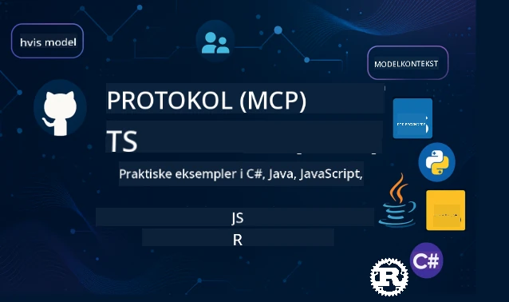

 

[](https://GitHub.com/microsoft/mcp-for-beginners/graphs/contributors)
[](https://GitHub.com/microsoft/mcp-for-beginners/issues)
[](https://GitHub.com/microsoft/mcp-for-beginners/pulls)
[](http://makeapullrequest.com)

[](https://GitHub.com/microsoft/mcp-for-beginners/watchers)
[](https://GitHub.com/microsoft/mcp-for-beginners/fork)
[](https://GitHub.com/microsoft/mcp-for-beginners/stargazers)


[](https://discord.gg/nTYy5BXMWG)

Følg disse trin for at komme i gang med at bruge disse ressourcer:  
1. **Fork Repositoryet**: Klik [](https://GitHub.com/microsoft/mcp-for-beginners/fork)  
2. **Klon Repositoryet**:   `git clone https://github.com/microsoft/mcp-for-beginners.git`  
3. **Deltag i** [](https://discord.gg/nTYy5BXMWG)  


### 🌐 Understøttelse af flere sprog

#### Understøttet via GitHub Action (Automatiseret & Altid Opdateret)

<!-- CO-OP TRANSLATOR LANGUAGES TABLE START -->
[Arabic](../ar/README.md) | [Bengali](../bn/README.md) | [Bulgarian](../bg/README.md) | [Burmese (Myanmar)](../my/README.md) | [Chinese (Simplified)](../zh-CN/README.md) | [Chinese (Traditional, Hong Kong)](../zh-HK/README.md) | [Chinese (Traditional, Macau)](../zh-MO/README.md) | [Chinese (Traditional, Taiwan)](../zh-TW/README.md) | [Croatian](../hr/README.md) | [Czech](../cs/README.md) | [Danish](./README.md) | [Dutch](../nl/README.md) | [Estonian](../et/README.md) | [Finnish](../fi/README.md) | [French](../fr/README.md) | [German](../de/README.md) | [Greek](../el/README.md) | [Hebrew](../he/README.md) | [Hindi](../hi/README.md) | [Hungarian](../hu/README.md) | [Indonesian](../id/README.md) | [Italian](../it/README.md) | [Japanese](../ja/README.md) | [Kannada](../kn/README.md) | [Korean](../ko/README.md) | [Lithuanian](../lt/README.md) | [Malay](../ms/README.md) | [Malayalam](../ml/README.md) | [Marathi](../mr/README.md) | [Nepali](../ne/README.md) | [Nigerian Pidgin](../pcm/README.md) | [Norwegian](../no/README.md) | [Persian (Farsi)](../fa/README.md) | [Polish](../pl/README.md) | [Portuguese (Brazil)](../pt-BR/README.md) | [Portuguese (Portugal)](../pt-PT/README.md) | [Punjabi (Gurmukhi)](../pa/README.md) | [Romanian](../ro/README.md) | [Russian](../ru/README.md) | [Serbian (Cyrillic)](../sr/README.md) | [Slovak](../sk/README.md) | [Slovenian](../sl/README.md) | [Spanish](../es/README.md) | [Swahili](../sw/README.md) | [Swedish](../sv/README.md) | [Tagalog (Filipino)](../tl/README.md) | [Tamil](../ta/README.md) | [Telugu](../te/README.md) | [Thai](../th/README.md) | [Turkish](../tr/README.md) | [Ukrainian](../uk/README.md) | [Urdu](../ur/README.md) | [Vietnamese](../vi/README.md)

> **Foretrækker du at klone lokalt?**
>
> Dette repository indeholder over 50 sprogoversættelser, hvilket øger downloadstørrelsen betydeligt. For at klone uden oversættelser, brug sparse checkout:
>
> **Bash / macOS / Linux:**
> ```bash
> git clone --filter=blob:none --sparse https://github.com/microsoft/mcp-for-beginners.git
> cd mcp-for-beginners
> git sparse-checkout set --no-cone '/*' '!translations' '!translated_images'
> ```
>
> **CMD (Windows):**
> ```cmd
> git clone --filter=blob:none --sparse https://github.com/microsoft/mcp-for-beginners.git
> cd mcp-for-beginners
> git sparse-checkout set --no-cone "/*" "!translations" "!translated_images"
> ```
>
> Dette giver dig alt, hvad du behøver for at gennemføre kurset med en meget hurtigere download.
<!-- CO-OP TRANSLATOR LANGUAGES TABLE END -->

# 🚀 Model Context Protocol (MCP) Læreplan for Begyndere

## **Lær MCP med praktiske kodeeksempler i C#, Java, JavaScript, Rust, Python og TypeScript**

## 🧠 Oversigt over Model Context Protocol Læreplan
Velkommen til din rejse ind i Model Context Protocol! Hvis du nogensinde har spekuleret på, hvordan AI-applikationer kommunikerer med forskellige værktøjer og tjenester, er du ved at opdage den elegante løsning, der forvandler, hvordan udviklere bygger intelligente systemer.

Tænk på MCP som en universel oversætter for AI-applikationer – ligesom USB-porte lader dig tilslutte enhver enhed til din computer, lader MCP AI-modeller forbinde til ethvert værktøj eller tjeneste på en standardiseret måde. Uanset om du bygger din første chatbot eller arbejder på komplekse AI-arbejdsgange, vil forståelsen af MCP give dig evnen til at skabe mere kapable og fleksible applikationer.

Denne læreplan er designet med tålmodighed og omtanke for din læringsrejse. Vi starter med simple koncepter, du allerede forstår, og bygger gradvist din ekspertise gennem praktisk øvelse i dit foretrukne programmeringssprog. Hvert trin indeholder klare forklaringer, praktiske eksempler og masser af opmuntring undervejs.

Når du er færdig med denne rejse, vil du have selvtilliden til at bygge dine egne MCP-servere, integrere dem med populære AI-platforme og forstå, hvordan denne teknologi omformer fremtiden for AI-udvikling. Lad os begynde dette spændende eventyr sammen!

### Officiel Dokumentation og Specifikationer

Denne læreplan er i overensstemmelse med **MCP Specifikation 2025-11-25** (den seneste stabile udgave). MCP-specifikationen bruger datobaseret versionsstyring (YYYY-MM-DD format) for at sikre klar protokolversionssporing.

Disse ressourcer bliver mere værdifulde, efterhånden som din forståelse vokser, men føl dig ikke presset til at læse alt med det samme. Start med de områder, der interesserer dig mest!
- 📘 [MCP Dokumentation](https://modelcontextprotocol.io/) – Dette er din go-to ressource for trin-for-trin vejledninger og brugerguides. Dokumentationen er skrevet med begyndere i tankerne og giver klare eksempler, du kan følge i dit eget tempo.
- 📜 [MCP Specifikation](https://modelcontextprotocol.io/specification/2025-11-25) – Tænk på dette som din omfattende referencemanual. Når du arbejder dig igennem læreplanen, vil du ofte vende tilbage hertil for at slå specifikke detaljer op og udforske avancerede funktioner.
- 📜 [MCP Specifikationsversionering](https://modelcontextprotocol.io/specification/versioning) – Indeholder information om protokolversionens historik og hvordan MCP anvender datobaseret versionsstyring (YYYY-MM-DD format).
- 🧑‍💻 [MCP GitHub Repository](https://github.com/modelcontextprotocol) – Her finder du SDK'er, værktøjer og kodeeksempler i flere programmeringssprog. Det er som en skattekiste af praktiske eksempler og færdiglavede komponenter.
- 🌐 [MCP Community](https://github.com/orgs/modelcontextprotocol/discussions) – Deltag med andre elever og erfarne udviklere i diskussioner om MCP. Det er et støttende fællesskab, hvor spørgsmål er velkomne, og viden deles frit.
  
## Læringsmål

Når du er færdig med denne læreplan, vil du føle dig selvsikker og begejstret over dine nye evner. Her er, hvad du vil opnå:

• **Forstå MCP fundamentet**: Du vil forstå, hvad Model Context Protocol er, og hvorfor det revolutionerer, hvordan AI-applikationer arbejder sammen, ved hjælp af analogier og eksempler, der giver mening.

• **Byg din første MCP-server**: Du vil skabe en fungerende MCP-server i dit foretrukne programmeringssprog, startende med enkle eksempler og bygge dine færdigheder trin for trin.

• **Forbind AI-modeller med rigtige værktøjer**: Du lærer, hvordan du bygger bro mellem AI-modeller og faktiske tjenester, hvilket giver dine applikationer kraftfulde nye funktioner.

• **Implementer sikkerhedspraksis**: Du vil forstå, hvordan du holder dine MCP-implementeringer sikre, og beskytter både dine applikationer og brugere.

• **Deploy med selvtillid**: Du ved, hvordan du tager dine MCP-projekter fra udvikling til produktion med praktiske udrulningsstrategier, der virker i virkeligheden.

• **Deltag i MCP-fællesskabet**: Du bliver en del af et voksende fællesskab af udviklere, der former fremtiden for AI-applikationsudvikling. 

## Vigtig Baggrund

Før vi dykker ned i MCP-specifikationerne, lad os sikre, at du er komfortabel med nogle grundlæggende koncepter. Bare rolig, hvis du ikke er ekspert på disse områder – vi forklarer alt, du behøver at vide, undervejs!

### Forståelse af protokoller (Grundlaget)

Tænk på en protokol som reglerne for en samtale. Når du ringer til en ven, ved I begge at sige "hej", når I svarer, skiftes til at tale og siger "farvel", når samtalen er slut. Computerprogrammer har brug for lignende regler for at kommunikere effektivt.

MCP er en protokol – et sæt aftalte regler, der hjælper AI-modeller og applikationer med at have produktive "samtaler" med værktøjer og tjenester. Ligesom at have samtaleregler gør menneskelig kommunikation glattere, gør MCP kommunikation mellem AI-applikationer meget mere pålidelig og kraftfuld.

### Client-server relationer (Hvordan programmer arbejder sammen)

Du bruger allerede client-server relationer hver dag! Når du bruger en webbrowsere (client) til at besøge en hjemmeside, forbinder du til en webserver, der sender siden til dig. Browseren ved, hvordan den skal bede om information, og serveren ved, hvordan den skal svare.

I MCP har vi en lignende relation: AI-modeller fungerer som clients, der beder om information eller handlinger, mens MCP-servere leverer disse funktioner. Det er som at have en hjælpsom assistent (serveren), som AI’en kan bede om at udføre specifikke opgaver.

### Hvorfor standardisering er vigtigt (Få ting til at fungere sammen)

Forestil dig, hvis hver bilproducent brugte forskellige gasdåser – du ville have brug for en adapter til hver bil! Standardisering betyder at blive enige om fælles metoder, så ting fungerer sammen gnidningsløst.

MCP leverer denne standardisering for AI-applikationer. I stedet for at hver AI-model skal have specialkode for at arbejde med hvert værktøj, skaber MCP en universel måde, de kan kommunikere på. Det betyder, at udviklere kan bygge værktøjer én gang og få dem til at virke med mange forskellige AI-systemer.

## 🧭 Din læringsvej Oversigt

Din MCP-rejse er omhyggeligt struktureret for at opbygge din selvtillid og færdigheder gradvist. Hver fase introducerer nye koncepter og styrker, hvad du allerede har lært.

### 🌱 Grundlæggende fase: Forstå det basale (Moduler 0-2)

Her begynder dit eventyr! Vi introducerer MCP-koncepter med velkendte analogier og simple eksempler. Du vil forstå, hvad MCP er, hvorfor det findes, og hvordan det passer ind i den større AI-udviklingsverden.

• **Modul 0 - Introduktion til MCP**: Vi starter med at udforske, hvad MCP er, og hvorfor det er så vigtigt for moderne AI-applikationer. Du vil se virkelige eksempler på MCP i aktion og forstå, hvordan det løser almindelige problemer, udviklere møder.

• **Modul 1 - Kernekoncepter forklaret**: Her lærer du de væsentlige byggesten i MCP. Vi bruger masser af analogier og visuelle eksempler for at sikre, at disse koncepter føles naturlige og forståelige.

• **Modul 2 - Sikkerhed i MCP**: Sikkerhed kan lyde skræmmende, men vi viser dig, hvordan MCP har indbyggede sikkerhedsfunktioner, og lærer dig bedste praksis, der beskytter dine applikationer fra starten.

### 🔨 Byggefasen: Skab dine første implementeringer (Modul 3)

Nu begynder det rigtige sjov! Du får praktisk erfaring med at bygge egentlige MCP-servere og clients. Bare rolig – vi starter simpelt og guider dig gennem hvert trin.
Dette modul indeholder flere praktiske vejledninger, der giver dig mulighed for at øve dig i dit foretrukne programmeringssprog. Du vil oprette din første server, bygge en klient til at forbinde til den og endda integrere med populære udviklingsværktøjer som VS Code.

Hver vejledning indeholder komplette kodeeksempler, fejlfindingstips og forklaringer på, hvorfor vi træffer specifikke designvalg. Ved slutningen af denne fase vil du have fungerende MCP-implementeringer, som du kan være stolt af!

### 🚀 Vækstfase: Avancerede koncepter og anvendelse i praksis (Moduler 4-5)

Når det grundlæggende er mestret, er du klar til at udforske mere sofistikerede MCP-funktioner. Vi vil dække praktiske implementeringsstrategier, fejlfindingsteknikker og avancerede emner som multimodal AI-integration.

Du lærer også, hvordan du skalerer dine MCP-implementeringer til produktionsbrug og integrerer med cloudplatforme som Azure. Disse moduler forbereder dig til at bygge MCP-løsninger, der kan håndtere krav fra den virkelige verden.

### 🌟 Mestre-fase: Fællesskab og specialisering (Moduler 6-11)

Den sidste fase fokuserer på at blive medlem af MCP-fællesskabet og specialisere dig inden for de områder, der interesserer dig mest. Du vil lære, hvordan du bidrager til open source MCP-projekter, implementerer avancerede autentifikationsmønstre og bygger omfattende løsninger integreret med databaser.

Modul 11 fortjener særlig omtale – det er en komplet 13-labs praktisk læringsvejledning, der lærer dig at bygge produktionsklare MCP-servere med PostgreSQL-integration. Det er som et afgangsprojekt, der samler alt, hvad du har lært!

### 📚 Komplet curriculumstruktur

| Modul | Emne | Beskrivelse | Link |
|--------|-------|-------------|------|
| **Modul 0-3: Grundlæggende** | | | |
| 00 | Introduktion til MCP | Overblik over Model Context Protocol og dets betydning i AI-pipelines | [Læs mere](./00-Introduction/README.md) |
| 01 | Forklaring af kernekoncepter | Indgående gennemgang af MCP's kernekoncepter | [Læs mere](./01-CoreConcepts/README.md) |
| 02 | Sikkerhed i MCP | Sikkerhedstrusler og bedste praksis | [Læs mere](./02-Security/README.md) |
| 03 | Kom godt i gang med MCP | Opsætning af miljø, grundlæggende servere/klienter, integration | [Læs mere](./03-GettingStarted/README.md) |
| **Modul 3: Byg din første server & klient** | | | |
| 3.1 | Første server | Opret din første MCP-server | [Vejledning](./03-GettingStarted/01-first-server/README.md) |
| 3.2 | Første klient | Udvikl en grundlæggende MCP-klient | [Vejledning](./03-GettingStarted/02-client/README.md) |
| 3.3 | Klient med LLM | Integrer store sprogmodeller | [Vejledning](./03-GettingStarted/03-llm-client/README.md) |
| 3.4 | VS Code-integration | Forbrug MCP-servere i VS Code | [Vejledning](./03-GettingStarted/04-vscode/README.md) |
| 3.5 | stdio-server | Opret servere ved brug af stdio-transport | [Vejledning](./03-GettingStarted/05-stdio-server/README.md) |
| 3.6 | HTTP-streaming | Implementer HTTP-streaming i MCP | [Vejledning](./03-GettingStarted/06-http-streaming/README.md) |
| 3.7 | AI Toolkit | Brug AI Toolkit med MCP | [Vejledning](./03-GettingStarted/07-aitk/README.md) |
| 3.8 | Testning | Test din MCP-serverimplementering | [Vejledning](./03-GettingStarted/08-testing/README.md) |
| 3.9 | Udrulning | Udrul MCP-servere til produktion | [Vejledning](./03-GettingStarted/09-deployment/README.md) |
| 3.10 | Avanceret serverbrug | Brug avancerede servere til avancerede funktioner og forbedret arkitektur | [Vejledning](./03-GettingStarted/10-advanced/README.md) |
| 3.11 | Simpel auth | Et kapitel, der viser dig autentifikation fra begyndelsen og RBAC | [Vejledning](./03-GettingStarted/11-simple-auth/README.md) |
| 3.12 | MCP-værter | Konfigurer Claude Desktop, Cursor, Cline og andre MCP-værter | [Vejledning](./03-GettingStarted/12-mcp-hosts/README.md) |
| 3.13 | MCP Inspector | Fejlret og test MCP-servere med Inspector-værktøjet | [Vejledning](./03-GettingStarted/13-mcp-inspector/README.md) |
| 3.14 | Prøvetagning | Brug prøvetagning til samarbejde med klienten | [Vejledning](./03-GettingStarted/14-sampling/README.md) |
| **Modul 4-5: Praktisk & Avanceret** | | | |
| 04 | Praktisk implementering | SDK’er, fejlfinding, testning, genanvendelige promptskabeloner | [Læs mere](./04-PracticalImplementation/README.md) |
| 4.1 | Pagineringshåndtering | Håndtér store resultatmængder med cursor-baseret paginering | [Vejledning](./04-PracticalImplementation/pagination/README.md) |
| 05 | Avancerede emner i MCP | Multimodal AI, skalering, virksomhedsbrug | [Læs mere](./05-AdvancedTopics/README.md) |
| 5.1 | Azure-integration | MCP-integration med Azure | [Vejledning](./05-AdvancedTopics/mcp-integration/README.md) |
| 5.2 | Multimodalitet | Arbejde med flere modaliteter | [Vejledning](./05-AdvancedTopics/mcp-multi-modality/README.md) |
| 5.3 | OAuth2-demo | Implementer OAuth2-autentifikation | [Vejledning](./05-AdvancedTopics/mcp-oauth2-demo/README.md) |
| 5.4 | Root Contexts | Forstå og implementer root contexts | [Vejledning](./05-AdvancedTopics/mcp-root-contexts/README.md) |
| 5.5 | Routing | MCP-routingstrategier | [Vejledning](./05-AdvancedTopics/mcp-routing/README.md) |
| 5.6 | Prøvetagning | Prøvetagningsteknikker i MCP | [Vejledning](./05-AdvancedTopics/mcp-sampling/README.md) |
| 5.7 | Skalering | Skaler MCP-implementeringer | [Vejledning](./05-AdvancedTopics/mcp-scaling/README.md) |
| 5.8 | Sikkerhed | Avancerede sikkerhedsovervejelser | [Vejledning](./05-AdvancedTopics/mcp-security/README.md) |
| 5.9 | Websøgning | Implementer websøgningsfunktioner | [Vejledning](./05-AdvancedTopics/web-search-mcp/README.md) |
| 5.10 | Realtids-streaming | Byg realtime streaming-funktionalitet | [Vejledning](./05-AdvancedTopics/mcp-realtimestreaming/README.md) |
| 5.11 | Realtids-søgning | Implementer realtime søgning | [Vejledning](./05-AdvancedTopics/mcp-realtimesearch/README.md) |
| 5.12 | Entra ID-auth | Autentifikation med Microsoft Entra ID | [Vejledning](./05-AdvancedTopics/mcp-security-entra/README.md) |
| 5.13 | Foundry-integration | Integrer med Azure AI Foundry | [Vejledning](./05-AdvancedTopics/mcp-foundry-agent-integration/README.md) |
| 5.14 | Context Engineering | Teknikker til effektiv kontekstengineering | [Vejledning](./05-AdvancedTopics/mcp-contextengineering/README.md) |
| 5.15 | MCP Custom Transport | Brugerdefinerede transportimplementeringer | [Vejledning](./05-AdvancedTopics/mcp-transport/README.md) |
| 5.16 | Protokolfunktioner | F.eks. fremskridtsnotifikationer, annullering, ressourcetemplates | [Vejledning](./05-AdvancedTopics/mcp-protocol-features/README.md) |
| **Modul 6-10: Fællesskab & Best Practices** | | | |
| 06 | Bidrag til fællesskabet | Hvordan bidrager man til MCP-økosystemet | [Vejledning](./06-CommunityContributions/README.md) |
| 07 | Erfaringer fra tidlig adoption | Implementeringshistorier fra virkeligheden | [Vejledning](./07-LessonsfromEarlyAdoption/README.md) |
| 08 | Best Practices for MCP | Ydeevne, fejl-tolerance, robusthed | [Vejledning](./08-BestPractices/README.md) |
| 09 | MCP Case Studies | Praktiske implementeringseksempler | [Vejledning](./09-CaseStudy/README.md) |
| 10 | Hands-on Workshop | Byg en MCP-server med AI Toolkit | [Lab](./10-StreamliningAIWorkflowsBuildingAnMCPServerWithAIToolkit/README.md) |
| **Modul 11: MCP Server Hands On Lab** | | | |
| 11 | MCP Server Database Integration | Omfattende 13-lab praktisk læringsvejledning for PostgreSQL-integration | [Labs](./11-MCPServerHandsOnLabs/README.md) |
| 11.1 | Introduktion | Overblik over MCP med databaseintegration og brugsscenarie for detailanalyse | [Lab 00](./11-MCPServerHandsOnLabs/00-Introduction/README.md) |
| 11.2 | Kernearkitektur | Forståelse af MCP-serverarkitektur, databasedele og sikkerhedsmønstre | [Lab 01](./11-MCPServerHandsOnLabs/01-Architecture/README.md) |
| 11.3 | Sikkerhed & multi-tenancy | Row Level Security, autentifikation og multi-tenant dataadgang | [Lab 02](./11-MCPServerHandsOnLabs/02-Security/README.md) |
| 11.4 | Miljøopsætning | Opsætning af udviklingsmiljø, Docker, Azure-ressourcer | [Lab 03](./11-MCPServerHandsOnLabs/03-Setup/README.md) |
| 11.5 | Databasedesign | PostgreSQL-opsætning, detailskema-design og prøve data | [Lab 04](./11-MCPServerHandsOnLabs/04-Database/README.md) |
| 11.6 | MCP Server Implementation | Byg FastMCP-serveren med databaseintegration | [Lab 05](./11-MCPServerHandsOnLabs/05-MCP-Server/README.md) |
| 11.7 | Værktøjsudvikling | Opret databaseforespørgselsværktøjer og skemaintrospektion | [Lab 06](./11-MCPServerHandsOnLabs/06-Tools/README.md) |
| 11.8 | Semantisk søgning | Implementering af vektorindlejringer med Azure OpenAI og pgvector | [Lab 07](./11-MCPServerHandsOnLabs/07-Semantic-Search/README.md) |
| 11.9 | Testning & fejlfinding | Teststrategier, fejlfindingværktøjer og valideringstilgange | [Lab 08](./11-MCPServerHandsOnLabs/08-Testing/README.md) |
| 11.10 | VS Code-integration | Konfigurering af VS Code MCP-integration og AI Chat-brug | [Lab 09](./11-MCPServerHandsOnLabs/09-VS-Code/README.md) |
| 11.11 | Udrulningsstrategier | Docker-udrulning, Azure Container Apps og skaleringsovervejelser | [Lab 10](./11-MCPServerHandsOnLabs/10-Deployment/README.md) |
| 11.12 | Overvågning | Application Insights, logning, performanceovervågning | [Lab 11](./11-MCPServerHandsOnLabs/11-Monitoring/README.md) |
| 11.13 | Best Practices | Ydeevneoptimering, sikkerhedshærdning og produktionstips | [Lab 12](./11-MCPServerHandsOnLabs/12-Best-Practices/README.md) |

### 💻 Eksempelkodeprojekter

En af de mest spændende dele ved at lære MCP er at se dine kodningsfærdigheder udvikle sig gradvist. Vi har designet vores kodeeksempler til at starte simpelt og blive mere sofistikerede, efterhånden som din forståelse dykkes. Her er, hvordan vi introducerer koncepter – med kode, der er let at forstå, men som demonstrerer reelle MCP-principper, vil du forstå ikke bare hvad koden gør, men også hvorfor den er struktureret sådan og hvordan den passer ind i større MCP-applikationer.

#### Grundlæggende MCP Calculator Samples

| Sprog | Beskrivelse | Link |
|----------|-------------|------|
| C# | MCP servereksempel | [Se kode](./03-GettingStarted/samples/csharp/README.md) |
| Java | MCP Calculator | [Se kode](./03-GettingStarted/samples/java/calculator/README.md) |
| JavaScript | MCP-demo | [Se kode](./03-GettingStarted/samples/javascript/README.md) |
| Python | MCP-server | [Se kode](../../03-GettingStarted/samples/python/mcp_calculator_server.py) |
| TypeScript | MCP-eksempel | [Se kode](./03-GettingStarted/samples/typescript/README.md) |
| Rust | MCP-eksempel | [Se kode](./03-GettingStarted/samples/rust/README.md) |

#### Avancerede MCP-implementeringer

| Sprog | Beskrivelse | Link |
|----------|-------------|------|
| C# | Avanceret eksempel | [Se kode](./04-PracticalImplementation/samples/csharp/README.md) |
| Java med Spring | Container App-eksempel | [Se kode](./04-PracticalImplementation/samples/java/containerapp/README.md) |
| JavaScript | Avanceret eksempel | [Se kode](./04-PracticalImplementation/samples/javascript/README.md) |
| Python | Komplekse implementeringer | [Se kode](./04-PracticalImplementation/samples/python/README.md) |
| TypeScript | Container-eksempel | [Se kode](./04-PracticalImplementation/samples/typescript/README.md) |


## 🎯 Forudsætninger for at lære MCP

For at få mest muligt ud af dette curriculum bør du have:
- Grundlæggende programmeringskendskab i mindst et af følgende sprog: C#, Java, JavaScript, Python eller TypeScript  
- Forståelse af klient-server-modellen og API'er  
- Fortrolighed med REST- og HTTP-koncepter  
- (Valgfrit) Baggrund i AI/ML-koncepter  

- Deltagelse i vores fællesskabsdiskussioner for support  

## 📚 Studieguide & Ressourcer

Dette repository indeholder flere ressourcer, der hjælper dig med at navigere og lære effektivt:

### Studieguide

En omfattende [Studieguide](./study_guide.md) er tilgængelig for at hjælpe dig med at navigere i dette repository effektivt. Dette visuelle læseplan-kort viser, hvordan alle emner hænger sammen, og giver vejledning i, hvordan man bruger eksempelprojekterne effektivt. Det er særligt nyttigt, hvis du er en visuel lærer, der kan lide at se det store overblik.

Guiden indeholder:  
- Et visuelt læseplan-kort, der viser alle dækkede emner  
- Detaljeret opdeling af hver del af repositoryet  
- Vejledning i, hvordan man anvender eksempelprojekterne  
- Anbefalede læringsstier for forskellige færdighedsniveauer  
- Yderligere ressourcer til at supplere din læringsrejse  

### Ændringslog

Vi vedligeholder en detaljeret [Ændringslog](./changelog.md), der følger alle væsentlige opdateringer af læseplansmaterialerne, så du kan holde dig opdateret med de seneste forbedringer og tilføjelser.  
- Nye indholdstilføjelser  
- Strukturændringer  
- Funktionsforbedringer  
- Dokumentationsopdateringer  

## 🛠️ Sådan bruger du denne læseplan effektivt

Hver lektion i denne guide indeholder:  

1. Klare forklaringer af MCP-konceptet  
2. Live kodeeksempler i flere sprog  
3. Øvelser til at bygge rigtige MCP-applikationer  
4. Ekstra ressourcer for avancerede elever  

### Lad os lære MCP med C# - Tutorialsserie  
Lad os lære om Model Context Protocol (MCP), et banebrydende framework designet til at standardisere interaktioner mellem AI-modeller og klientapplikationer. Gennem denne begynder-venlige session, introducerer vi dig til MCP og guider dig gennem at skabe din første MCP-server.  
#### C#: [https://aka.ms/letslearnmcp-csharp](https://aka.ms/letslearnmcp-csharp)  
#### Java: [https://aka.ms/letslearnmcp-java](https://aka.ms/letslearnmcp-java)  
#### JavaScript: [https://aka.ms/letslearnmcp-javascript](https://aka.ms/letslearnmcp-javascript)  
#### Python: [https://aka.ms/letslearnmcp-python](https://aka.ms/letslearnmcp-python)  

## 🎓 Din MCP-rejse begynder

Tillykke! Du har netop taget det første skridt i en spændende rejse, der vil udvide dine programmeringsevner og forbinde dig med den nyeste udvikling inden for AI.

### Hvad du allerede har opnået

Ved at læse denne introduktion har du allerede påbegyndt opbygningen af din MCP-vidensgrundlag. Du forstår, hvad MCP er, hvorfor det er vigtigt, og hvordan denne læseplan vil støtte din læringsrejse. Det er en betydelig præstation og begyndelsen på din ekspertise i denne vigtige teknologi.

### Eventyret foran dig

Som du gennemgår modulerne, husk at enhver ekspert engang var nybegynder. De koncepter, der måske synes komplekse nu, bliver anden natur, når du øver og anvender dem. Hvert lille skridt bygger mod stærke færdigheder, der vil støtte dig gennem hele din udviklingskarriere.

### Dit støttenetværk

Du bliver en del af et fællesskab af elever og eksperter, som brænder for MCP og gerne vil hjælpe andre til succes. Uanset om du sidder fast i en kodeudfordring eller er spændt på at dele et gennembrud, er fællesskabet her for at støtte din rejse.

Hvis du sidder fast eller har spørgsmål om at bygge AI-apps, så deltag i diskussioner sammen med andre elever og erfarne udviklere om MCP. Det er et støttende fællesskab, hvor spørgsmål er velkomne, og viden deles frit.

[](https://discord.gg/nTYy5BXMWG)

Hvis du har feedback om produktet eller oplever fejl under udvikling, besøg:

[](https://aka.ms/foundry/forum)

### Klar til at begynde?

Din MCP-rejse starter nu! Begynd med Modul 0 for at dykke ned i dine første praktiske MCP-oplevelser, eller udforsk eksempelprojekterne for at se, hvad du kommer til at bygge. Husk – enhver ekspert startede præcis, hvor du er nu, og med tålmodighed og øvelse vil du blive overrasket over, hvad du kan opnå.

Velkommen til verden af Model Context Protocol-udvikling. Lad os sammen bygge noget fantastisk!

## 🤝 Bidrag til læringsfællesskabet

Denne læseplan bliver stærkere med bidrag fra elever som dig! Uanset om du retter en slåfejl, foreslår en klarere forklaring eller tilføjer et nyt eksempel, hjælper dine bidrag andre begyndere med at få succes.

Tak til Microsoft Valued Professional [Shivam Goyal](https://www.linkedin.com/in/shivam2003/) for at bidrage med kodeeksempler.

Bidragsprocessen er designet til at være imødekommende og støttende. De fleste bidrag kræver en Contributor License Agreement (CLA), men de automatiserede værktøjer vil guide dig sikkert gennem processen.

## 📜 Open Source-læring

Hele denne læseplan er tilgængelig under MIT [LICENSE](../../LICENSE), hvilket betyder, at du frit kan bruge, ændre og dele den. Det understøtter vores mission om at gøre MCP-viden tilgængelig for udviklere overalt.  
## 🤝 Bidragsretningslinjer

Dette projekt byder velkommen til bidrag og forslag. De fleste bidrag kræver, at du accepterer en Contributor License Agreement (CLA), der erklærer, at du har ret til og faktisk giver os rettighederne til at bruge dit bidrag. For detaljer, besøg <https://cla.opensource.microsoft.com>.

Når du sender en pull request, vil en CLA-bot automatisk afgøre, om du skal afgive en CLA og markere PR korrekt (f.eks. statuscheck, kommentar). Følg blot instruktionerne, som botten giver. Du skal kun gøre dette én gang på tværs af alle repositories, der bruger vores CLA.

Dette projekt har adopteret [Microsoft Open Source Code of Conduct](https://opensource.microsoft.com/codeofconduct/).  
For mere information, se [Code of Conduct FAQ](https://opensource.microsoft.com/codeofconduct/faq/) eller kontakt [opencode@microsoft.com](mailto:opencode@microsoft.com) med yderligere spørgsmål eller kommentarer.

---

*Klar til at starte din MCP-rejse? Begynd med [Modul 00 - Introduktion til MCP](./00-Introduction/README.md) og tag dine første skridt ind i verdenen af Model Context Protocol-udvikling!*


## 🎒 Andre kurser  
Vores team laver også andre kurser! Tjek dem ud:

<!-- CO-OP TRANSLATOR OTHER COURSES START -->  
### LangChain  
[](https://aka.ms/langchain4j-for-beginners)  
[](https://aka.ms/langchainjs-for-beginners?WT.mc_id=m365-94501-dwahlin)  
[](https://github.com/microsoft/langchain-for-beginners?WT.mc_id=m365-94501-dwahlin)  
---  

### Azure / Edge / MCP / Agenter  
[](https://github.com/microsoft/AZD-for-beginners?WT.mc_id=academic-105485-koreyst)  
[](https://github.com/microsoft/edgeai-for-beginners?WT.mc_id=academic-105485-koreyst)  
[](https://github.com/microsoft/mcp-for-beginners?WT.mc_id=academic-105485-koreyst)  
[](https://github.com/microsoft/ai-agents-for-beginners?WT.mc_id=academic-105485-koreyst)  

---  
   
### Generativ AI-serie  
[](https://github.com/microsoft/generative-ai-for-beginners?WT.mc_id=academic-105485-koreyst)  
[-9333EA?style=for-the-badge&labelColor=E5E7EB&color=9333EA)](https://github.com/microsoft/Generative-AI-for-beginners-dotnet?WT.mc_id=academic-105485-koreyst)  
[-C084FC?style=for-the-badge&labelColor=E5E7EB&color=C084FC)](https://github.com/microsoft/generative-ai-for-beginners-java?WT.mc_id=academic-105485-koreyst)  
[-E879F9?style=for-the-badge&labelColor=E5E7EB&color=E879F9)](https://github.com/microsoft/generative-ai-with-javascript?WT.mc_id=academic-105485-koreyst)  

---  
   
### Kernelæring  
[](https://aka.ms/ml-beginners?WT.mc_id=academic-105485-koreyst)  
[](https://aka.ms/datascience-beginners?WT.mc_id=academic-105485-koreyst)  
[](https://aka.ms/ai-beginners?WT.mc_id=academic-105485-koreyst)  
[](https://github.com/microsoft/Security-101?WT.mc_id=academic-96948-sayoung)  
[](https://aka.ms/webdev-beginners?WT.mc_id=academic-105485-koreyst)  
[](https://aka.ms/iot-beginners?WT.mc_id=academic-105485-koreyst)  
[](https://github.com/microsoft/xr-development-for-beginners?WT.mc_id=academic-105485-koreyst)  

---  
   
### Copilot-serie
[](https://aka.ms/GitHubCopilotAI?WT.mc_id=academic-105485-koreyst)
[](https://github.com/microsoft/mastering-github-copilot-for-dotnet-csharp-developers?WT.mc_id=academic-105485-koreyst)
[](https://github.com/microsoft/CopilotAdventures?WT.mc_id=academic-105485-koreyst)
<!-- CO-OP TRANSLATOR ANDRE KURSER SLUT -->

---

<!-- CO-OP TRANSLATOR DISCLAIMER START -->
**Ansvarsfraskrivelse**:
Dette dokument er blevet oversat ved hjælp af AI-oversættelsestjenesten [Co-op Translator](https://github.com/Azure/co-op-translator). Selvom vi bestræber os på nøjagtighed, bedes du være opmærksom på, at automatiserede oversættelser kan indeholde fejl eller unøjagtigheder. Det originale dokument på dets oprindelige sprog bør betragtes som den autoritative kilde. For kritisk information anbefales professionel menneskelig oversættelse. Vi påtager os intet ansvar for misforståelser eller fejltolkninger, der opstår som følge af brugen af denne oversættelse.
<!-- CO-OP TRANSLATOR DISCLAIMER END -->