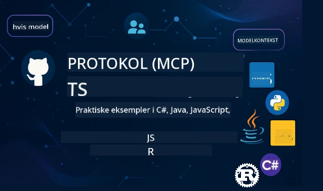

 

[](https://GitHub.com/microsoft/mcp-for-beginners/graphs/contributors)
[](https://GitHub.com/microsoft/mcp-for-beginners/issues)
[](https://GitHub.com/microsoft/mcp-for-beginners/pulls)
[](http://makeapullrequest.com)
[](https://mcptoplist.com/server/mcp.so%2Fmcp-for-beginners%2Fmicrosoft)

[](https://GitHub.com/microsoft/mcp-for-beginners/watchers)
[](https://GitHub.com/microsoft/mcp-for-beginners/fork)
[](https://GitHub.com/microsoft/mcp-for-beginners/stargazers)


[](https://discord.gg/nTYy5BXMWG)

Følg disse trin for at komme i gang med at bruge disse ressourcer:
1. **Fork Repositoriet**: Klik [](https://GitHub.com/microsoft/mcp-for-beginners/fork)
2. **Clone Repositoriet**:   `git clone https://github.com/microsoft/mcp-for-beginners.git`
3. **Deltag i** [](https://discord.gg/nTYy5BXMWG)


### 🌐 Multisprog Support

#### Understøttet via GitHub Action (Automatiseret & Altid Opdateret)

<!-- CO-OP TRANSLATOR LANGUAGES TABLE START -->
[Arabic](../ar/README.md) | [Bengali](../bn/README.md) | [Bulgarian](../bg/README.md) | [Burmese (Myanmar)](../my/README.md) | [Chinese (Simplified)](../zh-CN/README.md) | [Chinese (Traditional, Hong Kong)](../zh-HK/README.md) | [Chinese (Traditional, Macau)](../zh-MO/README.md) | [Chinese (Traditional, Taiwan)](../zh-TW/README.md) | [Croatian](../hr/README.md) | [Czech](../cs/README.md) | [Danish](./README.md) | [Dutch](../nl/README.md) | [Estonian](../et/README.md) | [Finnish](../fi/README.md) | [French](../fr/README.md) | [German](../de/README.md) | [Greek](../el/README.md) | [Hebrew](../he/README.md) | [Hindi](../hi/README.md) | [Hungarian](../hu/README.md) | [Indonesian](../id/README.md) | [Italian](../it/README.md) | [Japanese](../ja/README.md) | [Kannada](../kn/README.md) | [Khmer](../km/README.md) | [Korean](../ko/README.md) | [Lithuanian](../lt/README.md) | [Malay](../ms/README.md) | [Malayalam](../ml/README.md) | [Marathi](../mr/README.md) | [Nepali](../ne/README.md) | [Nigerian Pidgin](../pcm/README.md) | [Norwegian](../no/README.md) | [Persian (Farsi)](../fa/README.md) | [Polish](../pl/README.md) | [Portuguese (Brazil)](../pt-BR/README.md) | [Portuguese (Portugal)](../pt-PT/README.md) | [Punjabi (Gurmukhi)](../pa/README.md) | [Romanian](../ro/README.md) | [Russian](../ru/README.md) | [Serbian (Cyrillic)](../sr/README.md) | [Slovak](../sk/README.md) | [Slovenian](../sl/README.md) | [Spanish](../es/README.md) | [Swahili](../sw/README.md) | [Swedish](../sv/README.md) | [Tagalog (Filipino)](../tl/README.md) | [Tamil](../ta/README.md) | [Telugu](../te/README.md) | [Thai](../th/README.md) | [Turkish](../tr/README.md) | [Ukrainian](../uk/README.md) | [Urdu](../ur/README.md) | [Vietnamese](../vi/README.md)

> **Foretrækker du at Clone lokalt?**
>
> Dette repository indeholder over 50 sprogoversættelser, hvilket øger downloadstørrelsen betydeligt. For at clone uden oversættelser, brug sparse checkout:
>
> **Bash / macOS / Linux:**
> ```bash
> git clone --filter=blob:none --sparse https://github.com/microsoft/mcp-for-beginners.git
> cd mcp-for-beginners
> git sparse-checkout set --no-cone '/*' '!translations' '!translated_images'
> ```
>
> **CMD (Windows):**
> ```cmd
> git clone --filter=blob:none --sparse https://github.com/microsoft/mcp-for-beginners.git
> cd mcp-for-beginners
> git sparse-checkout set --no-cone "/*" "!translations" "!translated_images"
> ```
>
> Dette giver dig alt, hvad du behøver for at gennemføre kurset med en meget hurtigere download.
<!-- CO-OP TRANSLATOR LANGUAGES TABLE END -->

# 🚀 Model Context Protocol (MCP) Læreplan for Begyndere

## **Lær MCP med praktiske kodeeksempler i C#, Java, JavaScript, Rust, Python og TypeScript**

## 🧠 Oversigt over Model Context Protocol Læreplan
Velkommen på din rejse ind i Model Context Protocol! Hvis du nogensinde har undret dig over, hvordan AI-applikationer kommunikerer med forskellige værktøjer og tjenester, er du ved at opdage den elegante løsning, der forandrer, hvordan udviklere bygger intelligente systemer.

Tænk på MCP som en universel oversætter for AI-applikationer – ligesom USB-porte gør det muligt at forbinde enhver enhed til din computer, lader MCP AI-modeller forbinde til ethvert værktøj eller tjeneste på en standardiseret måde. Uanset om du bygger din første chatbot eller arbejder på komplekse AI-arbejdsgange, vil forståelsen af MCP give dig magten til at skabe mere kapable og fleksible applikationer.

Denne læreplan er designet med tålmodighed og omsorg for din læringsrejse. Vi starter med enkle koncepter, du allerede forstår, og bygger gradvist din ekspertise gennem praktisk træning i dit foretrukne programmeringssprog. Hvert trin inkluderer klare forklaringer, praktiske eksempler og masser af opmuntring undervejs.

Når du har gennemført denne rejse, vil du have selvtilliden til at bygge dine egne MCP-servere, integrere dem med populære AI-platforme og forstå, hvordan denne teknologi ændrer fremtiden for AI-udvikling. Lad os begynde dette spændende eventyr sammen!

### Officiel Dokumentation og Specifikationer

Denne læreplan er i overensstemmelse med **MCP Specifikation 2025-11-25** (den seneste stabile udgivelse). MCP-specifikationen bruger datobaseret versionsstyring (YYYY-MM-DD format) for at sikre klar protokolversiontracking.

> **Fremtidsudsigter:** en release candidate for den næste specifikationsversion, **2026-07-28**, er planlagt til udgivelse den 28. juli 2026. Den gør protokollen stateless på transportlaget, formaliserer et Extensions-framework (MCP Apps, Tasks), styrker autorisation, og udfaser Roots, Sampling og Logging. Se [Hvad ændres i MCP: 2026-07-28 Release Candidate](./01-CoreConcepts/mcp-2026-07-28-release-candidate.md) for en fuld gennemgang.

Disse ressourcer bliver mere værdifulde, efterhånden som din forståelse vokser, men føl dig ikke presset til at læse alt med det samme. Start med de områder, der interesserer dig mest!
- 📘 [MCP Dokumentation](https://modelcontextprotocol.io/) – Dette er din foretrukne ressource til trin-for-trin tutorials og brugervejledninger. Dokumentationen er skrevet med begyndere i tankerne og giver klare eksempler, du kan følge i dit eget tempo.
- 📜 [MCP Specifikation](https://modelcontextprotocol.io/specification/2025-11-25) – Betragt dette som din omfattende referencemanual. Mens du arbejder dig gennem læreplanen, vil du ofte vende tilbage hertil for at slå specifikke detaljer op og udforske avancerede funktioner.
- 📜 [MCP Specifikations Versionsstyring](https://modelcontextprotocol.io/specification/versioning) – Indeholder information om protokolversionhistorik og hvordan MCP bruger datobaseret versionsstyring (YYYY-MM-DD format).
- 🧑‍💻 [MCP GitHub Repository](https://github.com/modelcontextprotocol) – Her finder du SDK'er, værktøjer og kodeeksempler i flere programmeringssprog. Det er som en skattekiste af praktiske eksempler og færdiglavede komponenter.
- 🌐 [MCP Community](https://github.com/orgs/modelcontextprotocol/discussions) – Deltag i diskussioner med medlærende og erfarne udviklere om MCP. Det er et støttende fællesskab, hvor spørgsmål er velkomne, og viden deles frit.
  
## Læringsmål

Når du er færdig med denne læreplan, vil du føle dig selvsikker og begejstret for dine nye evner. Her er hvad du vil opnå:

• **Forstå MCP grundlæggende**: Du vil forstå, hvad Model Context Protocol er, og hvorfor det revolutionerer, hvordan AI-applikationer arbejder sammen, ved hjælp af analogier og eksempler, der giver mening.

• **Byg din første MCP-server**: Du vil skabe en fungerende MCP-server i dit foretrukne programmeringssprog, startende med enkle eksempler og gradvist øge dine færdigheder.

• **Forbind AI-modeller til rigtige værktøjer**: Du lærer, hvordan du bygger bro mellem AI-modeller og faktiske tjenester, hvilket giver dine applikationer kraftfulde nye funktionaliteter.

• **Implementer sikkerhedspraksis**: Du vil forstå, hvordan du holder dine MCP-implementeringer sikre, og beskytter både dine applikationer og brugere.

• **Deploy med selvtillid**: Du vil vide, hvordan du fører dine MCP-projekter fra udvikling til produktion med praktiske deploymentsstrategier, der virker i den virkelige verden.

• **Bliv en del af MCP fællesskabet**: Du bliver en del af et voksende fællesskab af udviklere, der former fremtiden for AI-applikationsudvikling. 

## Nødvendig baggrundsviden

Før vi dykker ned i MCP-specifikke detaljer, skal vi sikre, at du føler dig tryg ved nogle grundlæggende koncepter. Bare rolig, hvis du ikke er ekspert på disse områder – vi forklarer alt, hvad du skal vide, mens vi går frem!

### Forståelse af protokoller (Fundamentet)

Tænk på en protokol som reglerne for en samtale. Når du ringer til en ven, ved I begge at sige "hej", når I svarer, skiftes til at tale, og siger "farvel", når I er færdige. Computerprogrammer har brug for lignende regler for at kommunikere effektivt.

MCP er en protokol – et sæt aftalte regler, der hjælper AI-modeller og applikationer med at have produktive "samtaler" med værktøjer og tjenester. Ligesom samtaleregler gør menneskelig kommunikation glattere, gør MCP kommunikationen mellem AI-applikationer meget mere pålidelig og kraftfuld.

### Klient-server forhold (hvordan programmer arbejder sammen)

Du benytter allerede klient-server forhold hver dag! Når du bruger en webbrowser (klienten) til at besøge et website, forbinder du til en webserver, der sender dig sideindholdet. Browseren ved, hvordan den skal bede om information, og serveren ved, hvordan den skal svare.

I MCP har vi en lignende relation: AI-modeller agerer som klienter, der beder om information eller handlinger, mens MCP-servere leverer disse kapaciteter. Det er som at have en hjælpsom assistent (serveren), som AI'en kan bede om at udføre specifikke opgaver.

### Hvorfor standardisering er vigtigt (få ting til at samarbejde)

Forestil dig, hvis hver bilproducent brugte forskellige former for benzinpumper – du skulle bruge en forskellig adapter til hver bil! Standardisering betyder at blive enige om fælles tilgange, så ting fungerer gnidningsløst sammen.

MCP tilbyder denne standardisering for AI-applikationer. I stedet for at hver AI-model behøver specialkode for at arbejde med hvert værktøj, skaber MCP en universel måde for dem at kommunikere på. Det betyder, at udviklere kan bygge værktøjer én gang og få dem til at fungere med mange forskellige AI-systemer.

## 🧭 Din læringsvej oversigt

Din MCP-rejse er omhyggeligt struktureret til gradvist at opbygge din selvtillid og dine færdigheder. Hver fase introducerer nye begreber og styrker det, du allerede har lært.

### 🌱 Grundlæggende fase: forstå det basale (moduler 0-2)

Her begynder dit eventyr! Vi vil introducere dig til MCP-koncepter ved hjælp af velkendte analogier og simple eksempler. Du vil forstå, hvad MCP er, hvorfor det eksisterer, og hvordan det passer ind i den større verden inden for AI-udvikling.


• **Modul 0 - Introduktion til MCP**: Vi starter med at udforske, hvad MCP er, og hvorfor det er så vigtigt for moderne AI-applikationer. Du vil se virkelige eksempler på MCP i aktion og forstå, hvordan det løser almindelige problemer, som udviklere står overfor.

• **Modul 1 - Grundlæggende Begreber Forklaret**: Her lærer du de væsentlige byggesten i MCP. Vi bruger masser af analogier og visuelle eksempler for at sikre, at disse koncepter føles naturlige og forståelige.

• **Modul 2 - Sikkerhed i MCP**: Sikkerhed kan lyde skræmmende, men vi viser dig, hvordan MCP indeholder indbyggede sikkerhedsfunktioner, og vi lærer dig bedste praksis, der beskytter dine applikationer fra starten.

### 🔨 Byggefasen: Oprettelse af dine første implementeringer (Modul 3)

Nu begynder det sjove for alvor! Du får praktisk erfaring med at bygge faktiske MCP-servere og -klienter. Bare rolig – vi starter simpelt og guider dig gennem hvert trin.

Dette modul indeholder flere praktiske vejledninger, der giver dig mulighed for at øve dig i dit foretrukne programmeringssprog. Du vil skabe din første server, bygge en klient til at forbinde til den og endda integrere med populære udviklingsværktøjer som VS Code.

Hver vejledning indeholder komplette kodeeksempler, fejlfindingstips og forklaringer på, hvorfor vi træffer bestemte designvalg. Ved slutningen af denne fase vil du have fungerende MCP-implementeringer, som du kan være stolt af!

### 🚀 Vækstfasen: Avancerede koncepter og anvendelse i den virkelige verden (Moduler 4-5)

Med det grundlæggende mestret er du klar til at udforske mere sofistikerede MCP-funktioner. Vi dækker praktiske implementeringsstrategier, fejlsøgningsteknikker og avancerede emner som multimodal AI-integration.

Du lærer også, hvordan du skalerer dine MCP-implementeringer til produktionsbrug og integrerer med cloud-platforme som Azure. Disse moduler forbereder dig på at bygge MCP-løsninger, der kan håndtere krav fra den virkelige verden.

### 🌟 Mestringsfasen: Fællesskab og specialisering (Moduler 6-11)

Den afsluttende fase fokuserer på at deltage i MCP-fællesskabet og specialisere dig inden for de områder, der interesserer dig mest. Du lærer, hvordan du bidrager til open-source MCP-projekter, implementerer avancerede autentificeringsmønstre og bygger omfattende løsninger med databaseintegration.

Modul 11 fortjener en særlig omtale – det er en komplet 13-laboratorie praktisk læringssti, der lærer dig at bygge produktionsklare MCP-servere med PostgreSQL-integration. Det er som et afsluttende projekt, der samler alt, hvad du har lært!

### 📚 Fuldstændig Curriculum Struktur

| Modul | Emne | Beskrivelse | Link |
|--------|-------|-------------|------|
| **Modul 0-3: Grundlæggende** | | | |
| 00 | Introduktion til MCP | Oversigt over Model Context Protocol og dens betydning i AI-pipelines | [Læs mere](./00-Introduction/README.md) |
| 01 | Grundlæggende Begreber Forklaret | Grundig udforskning af kerne MCP-koncepter | [Læs mere](./01-CoreConcepts/README.md) |
| 1.1 | Hvad ændrer sig i MCP (2026-07-28 RC) | Stateless protokol, Extensions framework og udgåede funktioner i næste specifikationsversion | [Vejledning](./01-CoreConcepts/mcp-2026-07-28-release-candidate.md) |
| 02 | Sikkerhed i MCP | Sikkerhedstrusler og bedste praksis | [Læs mere](./02-Security/README.md) |
| 03 | Kom godt i gang med MCP | Miljøopsætning, basis servere/klienter, integration | [Læs mere](./03-GettingStarted/README.md) |
| **Modul 3: Byg din første server & klient** | | | |
| 3.1 | Første Server | Opret din første MCP-server | [Vejledning](./03-GettingStarted/01-first-server/README.md) |
| 3.2 | Første Klient | Udvikl en grundlæggende MCP-klient | [Vejledning](./03-GettingStarted/02-client/README.md) |
| 3.3 | Klient med LLM | Integrer store sprogmodeller | [Vejledning](./03-GettingStarted/03-llm-client/README.md) |
| 3.4 | VS Code Integration | Forbrug MCP-servere i VS Code | [Vejledning](./03-GettingStarted/04-vscode/README.md) |
| 3.5 | stdio Server | Opret servere ved brug af stdio transport | [Vejledning](./03-GettingStarted/05-stdio-server/README.md) |
| 3.6 | HTTP Streaming | Implementer HTTP streaming i MCP | [Vejledning](./03-GettingStarted/06-http-streaming/README.md) |
| 3.7 | Microsoft Foundry Toolkit | Brug Microsoft Foundry Toolkit med MCP | [Vejledning](./03-GettingStarted/07-aitk/README.md) |
| 3.8 | Testning | Test din MCP-serverimplementering | [Vejledning](./03-GettingStarted/08-testing/README.md) |
| 3.9 | Udrulning | Udrul MCP-servere til produktion | [Vejledning](./03-GettingStarted/09-deployment/README.md) |
| 3.10 | Avanceret serverbrug | Brug avancerede servere til avanceret funktionalitet og forbedret arkitektur | [Vejledning](./03-GettingStarted/10-advanced/README.md) |
| 3.11 | Simpel autentificering | Et kapitel der viser autentificering fra start og RBAC | [Vejledning](./03-GettingStarted/11-simple-auth/README.md) |
| 3.12 | MCP Hosts | Konfigurer Claude Desktop, Cursor, Cline og andre MCP hosts | [Vejledning](./03-GettingStarted/12-mcp-hosts/README.md) |
| 3.13 | MCP Inspector | Debug og test MCP-servere med Inspector værktøjet | [Vejledning](./03-GettingStarted/13-mcp-inspector/README.md) |
| 3.14 | Sampling | Brug sampling til samarbejde med klienten | [Vejledning](./03-GettingStarted/14-sampling/README.md) |
| 3.15 | MCP Apps | Byg MCP Apps | [Vejledning](./03-GettingStarted/15-mcp-apps/README.md) |
| **Modul 4-5: Praktisk & Avanceret** | | | |
| 04 | Praktisk Implementering | SDK’er, fejlfinding, test, genanvendelige promptskabeloner | [Læs mere](./04-PracticalImplementation/README.md) |
| 4.1 | Pagineringshåndtering | Håndter store resultatmængder med cursorbaseret paginering | [Vejledning](./04-PracticalImplementation/pagination/README.md) |
| 05 | Avancerede Emner i MCP | Multi-modal AI, skalering, virksomhedsbrug | [Læs mere](./05-AdvancedTopics/README.md) |
| 5.1 | Azure Integration | MCP integration med Azure | [Vejledning](./05-AdvancedTopics/mcp-integration/README.md) |
| 5.2 | Multimodalitet | Arbejde med flere modaliteter | [Vejledning](./05-AdvancedTopics/mcp-multi-modality/README.md) |
| 5.3 | OAuth2 Demo | Implementer OAuth2 autentificering | [Vejledning](./05-AdvancedTopics/mcp-oauth2-demo/README.md) |
| 5.4 | Root Contexts | Forstå og implementer root contexts | [Vejledning](./05-AdvancedTopics/mcp-root-contexts/README.md) |
| 5.5 | Routing | MCP routing strategier | [Vejledning](./05-AdvancedTopics/mcp-routing/README.md) |
| 5.6 | Sampling | Sampling teknikker i MCP | [Vejledning](./05-AdvancedTopics/mcp-sampling/README.md) |
| 5.7 | Skalering | Skaler MCP-implementeringer | [Vejledning](./05-AdvancedTopics/mcp-scaling/README.md) |
| 5.8 | Sikkerhed | Avancerede sikkerhedsovervejelser | [Vejledning](./05-AdvancedTopics/mcp-security/README.md) |
| 5.9 | Websøgning | Implementer websøgningsfunktioner | [Vejledning](./05-AdvancedTopics/web-search-mcp/README.md) |
| 5.10 | Realtid Streaming | Byg realtime streaming funktionalitet | [Vejledning](./05-AdvancedTopics/mcp-realtimestreaming/README.md) |
| 5.11 | Realtid Søgning | Implementer realtime søgning | [Vejledning](./05-AdvancedTopics/mcp-realtimesearch/README.md) |
| 5.12 | Entra ID Auth | Autentificering med Microsoft Entra ID | [Vejledning](./05-AdvancedTopics/mcp-security-entra/README.md) |
| 5.13 | Foundry Integration | Integrer med Microsoft Foundry | [Vejledning](./05-AdvancedTopics/mcp-foundry-agent-integration/README.md) |
| 5.14 | Context Engineering | Teknikker til effektiv kontekststyring | [Vejledning](./05-AdvancedTopics/mcp-contextengineering/README.md) |
| 5.15 | MCP Custom Transport | Tilpassede Transportimplementeringer | [Vejledning](./05-AdvancedTopics/mcp-transport/README.md) |
| 5.16 | Protokolfunktioner | Fremdriftsmeddelelser, annullering, ressource-skabeloner | [Vejledning](./05-AdvancedTopics/mcp-protocol-features/README.md) |
| 5.17 | Adversarial Multi-Agent Reasoning | To agenter diskuterer modsatte synspunkter med delte MCP-værktøjer, vurderet af en dommeragent | [Vejledning](./05-AdvancedTopics/mcp-adversarial-agents/README.md) |
| **Modul 6-10: Fællesskab & Bedste Praksis** | | | |
| 06 | Fællesskabsbidrag | Hvordan man bidrager til MCP-økosystemet | [Vejledning](./06-CommunityContributions/README.md) |
| 07 | Indsigter fra Tidlig Adoptering | Virkelige implementeringshistorier | [Vejledning](./07-LessonsfromEarlyAdoption/README.md) |
| 08 | Bedste Praksis for MCP | Ydeevne, fejltolerance, robusthed | [Vejledning](./08-BestPractices/README.md) |
| 09 | MCP Casestudier | Praktiske implementeringseksempler | [Vejledning](./09-CaseStudy/README.md) |
| 10 | Praktisk Workshop | Byg en MCP-server med Microsoft Foundry Toolkit | [Laboratorium](./10-StreamliningAIWorkflowsBuildingAnMCPServerWithAIToolkit/README.md) |
| **Modul 11: MCP Server Praktisk Laboratorium** | | | |
| 11 | MCP Server Database Integration | Omfattende 13-lab hands-on læringssti for PostgreSQL-integration | [Laboratorier](./11-MCPServerHandsOnLabs/README.md) |
| 11.1 | Introduktion | Oversigt over MCP med databaseintegration og anvendelsestilfælde inden for detailhandel | [Laboratorium 00](./11-MCPServerHandsOnLabs/00-Introduction/README.md) |
| 11.2 | Kernearkitektur | Forståelse af MCP-serverarkitektur, databaselags og sikkerhedsmønstre | [Laboratorium 01](./11-MCPServerHandsOnLabs/01-Architecture/README.md) |
| 11.3 | Sikkerhed & Multi-Tenancy | Row Level Security, autentificering og multi-tenant dataadgang | [Laboratorium 02](./11-MCPServerHandsOnLabs/02-Security/README.md) |
| 11.4 | Miljøopsætning | Opsætning af udviklingsmiljø, Docker, Azure-ressourcer | [Laboratorium 03](./11-MCPServerHandsOnLabs/03-Setup/README.md) |
| 11.5 | Databasedesign | PostgreSQL opsætning, detailhandelsskema-design og prøve-data | [Laboratorium 04](./11-MCPServerHandsOnLabs/04-Database/README.md) |
| 11.6 | MCP Server Implementering | Byg FastMCP-serveren med databaseintegration | [Laboratorium 05](./11-MCPServerHandsOnLabs/05-MCP-Server/README.md) |
| 11.7 | Værktøjsudvikling | Opret databaseforespørgselsværktøjer og skemasyn | [Laboratorium 06](./11-MCPServerHandsOnLabs/06-Tools/README.md) |
| 11.8 | Semantisk Søgning | Implementering af vektorindlejring med Azure OpenAI og pgvector | [Laboratorium 07](./11-MCPServerHandsOnLabs/07-Semantic-Search/README.md) |
| 11.9 | Test & Fejlfinding | Teststrategier, fejldebug-værktøjer og valideringsmetoder | [Laboratorium 08](./11-MCPServerHandsOnLabs/08-Testing/README.md) |
| 11.10 | VS Code Integration | Konfiguration af VS Code MCP-integration og AI Chat brug | [Laboratorium 09](./11-MCPServerHandsOnLabs/09-VS-Code/README.md) |
| 11.11 | Udrulningsstrategier | Docker udrulning, Azure Container Apps og skaleringshensyn | [Laboratorium 10](./11-MCPServerHandsOnLabs/10-Deployment/README.md) |
| 11.12 | Overvågning | Application Insights, logning, overvågning af ydeevne | [Laboratorium 11](./11-MCPServerHandsOnLabs/11-Monitoring/README.md) |
| 11.13 | Bedste Praksis | Optimering af ydeevne, sikkerhedshærdning og produktionstips | [Laboratorium 12](./11-MCPServerHandsOnLabs/12-Best-Practices/README.md) |
| **Modul 12: MCP Værktøjer** | | | |
| 12.1 | Værktøjer | MCP brug i Copilot App | [ Vejledning ](./12-tooling/README.md) |

### 💻 Eksempelkode Projekter

En af de mest spændende dele ved at lære MCP er at se dine kodningsfærdigheder udvikle sig progressivt. Vi har designet vores kodeeksempler til at starte enkelt og blive mere sofistikerede, efterhånden som din forståelse fordybes. Her er, hvordan vi introducerer koncepterne – med kode, der er let at forstå men demonstrerer ægte MCP-principper, vil du forstå ikke bare hvad denne kode gør, men også hvorfor den er struktureret på denne måde og hvordan den passer ind i større MCP-applikationer.

#### Grundlæggende MCP Calculator Eksempler

| Sprog | Beskrivelse | Link |
|----------|-------------|------|

| C# | MCP Server Eksempel | [Se kode](./03-GettingStarted/samples/csharp/README.md) |
| Java | MCP Lommeregner | [Se kode](./03-GettingStarted/samples/java/calculator/README.md) |
| JavaScript | MCP Demo | [Se kode](./03-GettingStarted/samples/javascript/README.md) |
| Python | MCP Server | [Se kode](../../03-GettingStarted/samples/python/mcp_calculator_server.py) |
| TypeScript | MCP Eksempel | [Se kode](./03-GettingStarted/samples/typescript/README.md) |
| Rust | MCP Eksempel | [Se kode](./03-GettingStarted/samples/rust/README.md) |

#### Avancerede MCP Implementationer

| Sprog | Beskrivelse | Link |
|----------|-------------|------|
| C# | Avanceret Eksempel | [Se kode](./04-PracticalImplementation/samples/csharp/README.md) |
| Java med Spring | Container App Eksempel | [Se kode](./04-PracticalImplementation/samples/java/containerapp/README.md) |
| JavaScript | Avanceret Eksempel | [Se kode](./04-PracticalImplementation/samples/javascript/README.md) |
| Python | Komplekst Implementering | [Se kode](./04-PracticalImplementation/samples/python/README.md) |
| TypeScript | Container Eksempel | [Se kode](./04-PracticalImplementation/samples/typescript/README.md) |


## 🎯 Forudsætninger for at lære MCP

For at få mest muligt ud af dette curriculum bør du have:

- Grundlæggende kendskab til programmering i mindst ét af følgende sprog: C#, Java, JavaScript, Python eller TypeScript
- Forståelse af klient-server modellen og API'er
- Kendskab til REST og HTTP koncepter
- (Valgfrit) Baggrund i AI/ML koncepter

- Deltagelse i vores community-diskussioner for support

## 📚 Studievejledning & Ressourcer

Dette arkiv indeholder flere ressourcer, der hjælper dig med at navigere og lære effektivt:

### Studievejledning

En omfattende [Studievejledning](./study_guide.md) er tilgængelig for at hjælpe dig med at navigere i dette arkiv effektivt. Dette visuelle curriculumkort viser, hvordan alle emner hænger sammen, og giver vejledning i, hvordan du bruger eksemplerne effektivt. Det er især nyttigt, hvis du er en visuel lærende, som kan lide at se det store billede.

Guiden inkluderer:
- Et visuelt curriculumkort, der viser alle dækkede emner
- Detaljeret opdeling af hver sektion i arkivet
- Vejledning i brug af eksemplerne
- Anbefalede læringsveje for forskellige færdighedsniveauer
- Yderligere ressourcer til at supplere din læringsrejse

### Ændringslog

Vi opretholder en detaljeret [Ændringslog](./changelog.md), der sporer alle væsentlige opdateringer til curriculum-materialerne, så du kan holde dig opdateret med de seneste forbedringer og tilføjelser.
- Nye indholdstilføjelser
- Strukturændringer
- Funktionsforbedringer
- Dokumentationsopdateringer

## 🛠️ Sådan bruger du dette curriculum effektivt

Hver lektion i denne guide inkluderer:

1. Klare forklaringer på MCP-konceptet  
2. Live kodeeksempler i flere sprog  
3. Øvelser til at bygge rigtige MCP-applikationer  
4. Ekstra ressourcer til avancerede lærende

### Lad os lære MCP med C# - Tutorialserie
Lad os lære om Model Context Protocol (MCP), et banebrydende framework designet til at standardisere interaktioner mellem AI-modeller og klientapplikationer. Gennem denne begyndervenlige session vil vi introducere dig til MCP og guide dig gennem at skabe din første MCP-server.
#### C#: [https://aka.ms/letslearnmcp-csharp](https://aka.ms/letslearnmcp-csharp)
#### Java: [https://aka.ms/letslearnmcp-java](https://aka.ms/letslearnmcp-java)
#### JavaScript: [https://aka.ms/letslearnmcp-javascript](https://aka.ms/letslearnmcp-javascript)
#### Python: [https://aka.ms/letslearnmcp-python](https://aka.ms/letslearnmcp-python)

## 🎓 Din MCP-rejse starter

Tillykke! Du har netop taget det første skridt på en spændende rejse, der vil udvide dine programmeringsevner og forbinde dig til den nyeste udvikling inden for AI.

### Hvad du allerede har opnået

Ved at læse denne introduktion er du allerede begyndt at opbygge dit MCP-vidensgrundlag. Du forstår, hvad MCP er, hvorfor det er vigtigt, og hvordan dette curriculum vil støtte din læringsrejse. Det er en betydelig præstation og begyndelsen på din ekspertise inden for denne vigtige teknologi.

### Eventyret forude

Når du bevæger dig gennem modulerne, så husk, at enhver ekspert engang var nybegynder. De koncepter, der måske virker komplekse nu, vil blive anden natur, efterhånden som du øver og anvender dem. Hvert lille skridt bygger op til stærke færdigheder, som vil tjene dig i hele din udviklingskarriere.

### Dit støttenetværk

Du tilslutter dig et fællesskab af lærende og eksperter, der brænder for MCP og gerne vil hjælpe andre med at få succes. Uanset om du sidder fast i en kodeudfordring eller er begejstret for at dele et gennembrud, er fællesskabet her for at støtte din rejse.

Hvis du sidder fast eller har spørgsmål om at bygge AI-apps, så deltag i diskussioner med andre lærende og erfarne udviklere om MCP. Det er et støttende fællesskab, hvor spørgsmål er velkomne, og viden deles frit.

[](https://discord.gg/nTYy5BXMWG)

Hvis du har produktfeedback eller fejl under udvikling, besøg:

[](https://aka.ms/foundry/forum)

### Klar til at begynde?

Dit MCP-eventyr starter nu! Begynd med Modul 0 for at dykke ned i dine første praktiske MCP-oplevelser, eller udforsk projekt-eksemplerne for at se, hvad du skal bygge. Husk - enhver ekspert startede præcis der, hvor du er nu, og med tålmodighed og øvelse vil du blive forbavset over, hvad du kan opnå.

Velkommen til Model Context Protocol udviklingsverdenen. Lad os bygge noget fantastisk sammen!

## 🤝 Bidrage til læringsfællesskabet

Dette curriculum bliver stærkere med bidrag fra lærende som dig! Uanset om du retter en slåfejl, foreslår en klarere forklaring eller tilføjer et nyt eksempel, hjælper dine bidrag andre begyndere med at få succes.

Tak til Microsoft Valued Professional [Shivam Goyal](https://www.linkedin.com/in/shivam2003/) for at bidrage med kodeeksempler.

Bidragsprocessen er designet til at være imødekommende og støttende. De fleste bidrag kræver en Contributor License Agreement (CLA), men de automatiserede værktøjer guider dig igennem processen gnidningsløst.

## 📜 Open Source Læring

Hele dette curriculum er tilgængeligt under MIT [LICENSE](../../LICENSE), hvilket betyder, at du frit kan bruge, modificere og dele det. Dette understøtter vores mission om at gøre MCP-viden tilgængelig for udviklere overalt.
## 🤝 Bidragsretningslinjer

Dette projekt byder på bidrag og forslag velkommen. De fleste bidrag kræver, at du accepterer en
Contributor License Agreement (CLA), der erklærer, at du har ret til, og faktisk gør, at give os
rettighederne til at bruge dit bidrag. For detaljer, besøg <https://cla.opensource.microsoft.com>.

Når du indsender en pull request, vil en CLA-bot automatisk afgøre, om du skal levere
en CLA og dekorerer PR passende (f.eks. statuskontrol, kommentar). Følg blot instruktionerne
fra botten. Du skal kun gøre dette én gang på tværs af alle repos, der bruger vores CLA.

Dette projekt har vedtaget [Microsoft Open Source Code of Conduct](https://opensource.microsoft.com/codeofconduct/).
For mere information se [Code of Conduct FAQ](https://opensource.microsoft.com/codeofconduct/faq/) eller
kontakt [opencode@microsoft.com](mailto:opencode@microsoft.com) med yderligere spørgsmål eller kommentarer.

---

*Klar til at starte din MCP-rejse? Begynd med [Modul 00 - Introduktion til MCP](./00-Introduction/README.md) og tag dine første skridt ind i Model Context Protocol udviklingsverdenen!*


## 🎒 Andre kurser
Vores team producerer også andre kurser! Tjek dem:

<!-- CO-OP TRANSLATOR OTHER COURSES START -->
### LangChain
[](https://aka.ms/langchain4j-for-beginners)
[](https://aka.ms/langchainjs-for-beginners?WT.mc_id=m365-94501-dwahlin)
[](https://github.com/microsoft/langchain-for-beginners?WT.mc_id=m365-94501-dwahlin)
---

### Azure / Edge / MCP / Agenter
[](https://github.com/microsoft/AZD-for-beginners?WT.mc_id=academic-105485-koreyst)
[](https://github.com/microsoft/edgeai-for-beginners?WT.mc_id=academic-105485-koreyst)
[](https://github.com/microsoft/mcp-for-beginners?WT.mc_id=academic-105485-koreyst)
[](https://github.com/microsoft/ai-agents-for-beginners?WT.mc_id=academic-105485-koreyst)

---
 
### Generativ AI Serien
[](https://github.com/microsoft/generative-ai-for-beginners?WT.mc_id=academic-105485-koreyst)
[-9333EA?style=for-the-badge&labelColor=E5E7EB&color=9333EA)](https://github.com/microsoft/Generative-AI-for-beginners-dotnet?WT.mc_id=academic-105485-koreyst)
[-C084FC?style=for-the-badge&labelColor=E5E7EB&color=C084FC)](https://github.com/microsoft/generative-ai-for-beginners-java?WT.mc_id=academic-105485-koreyst)
[-E879F9?style=for-the-badge&labelColor=E5E7EB&color=E879F9)](https://github.com/microsoft/generative-ai-with-javascript?WT.mc_id=academic-105485-koreyst)

---
 
### Kerne Læring
[](https://aka.ms/ml-beginners?WT.mc_id=academic-105485-koreyst)
[](https://aka.ms/datascience-beginners?WT.mc_id=academic-105485-koreyst)
[](https://aka.ms/ai-beginners?WT.mc_id=academic-105485-koreyst)

[](https://github.com/microsoft/Security-101?WT.mc_id=academic-96948-sayoung)
[](https://aka.ms/webdev-beginners?WT.mc_id=academic-105485-koreyst)
[](https://aka.ms/iot-beginners?WT.mc_id=academic-105485-koreyst)
[](https://github.com/microsoft/xr-development-for-beginners?WT.mc_id=academic-105485-koreyst)

---
 
### Copilot-serien
[](https://aka.ms/GitHubCopilotAI?WT.mc_id=academic-105485-koreyst)
[](https://github.com/microsoft/mastering-github-copilot-for-dotnet-csharp-developers?WT.mc_id=academic-105485-koreyst)
[](https://github.com/microsoft/CopilotAdventures?WT.mc_id=academic-105485-koreyst)
<!-- CO-OP TRANSLATOR OTHER COURSES END -->

---

<!-- CO-OP TRANSLATOR DISCLAIMER START -->
**Ansvarsfraskrivelse**:
Dette dokument er blevet oversat ved hjælp af AI-oversættelsestjenesten [Co-op Translator](https://github.com/Azure/co-op-translator). Selvom vi bestræber os på nøjagtighed, skal du være opmærksom på, at automatiserede oversættelser kan indeholde fejl eller unøjagtigheder. Det originale dokument på dets oprindelige sprog bør betragtes som den autoritative kilde. For kritisk information anbefales professionel menneskelig oversættelse. Vi påtager os intet ansvar for misforståelser eller fejltolkninger, der opstår som følge af brugen af denne oversættelse.
<!-- CO-OP TRANSLATOR DISCLAIMER END -->