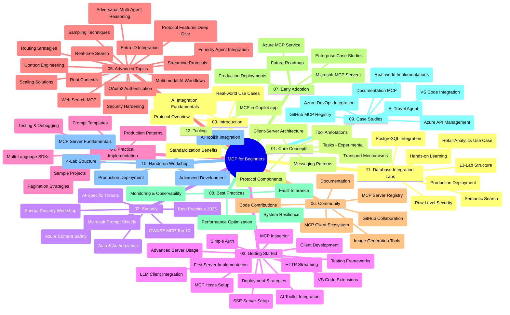

# Model Context Protocol (MCP) for Begyndere - Studieguide

Denne studieguide giver et overblik over repository-strukturen og indholdet for "Model Context Protocol (MCP) for Beginners" pensum. Brug denne guide til at navigere effektivt i repository og få mest muligt ud af de tilgængelige ressourcer.

## Repository Oversigt

Model Context Protocol (MCP) er en standardiseret ramme for interaktioner mellem AI-modeller og klientapplikationer. Oprindeligt skabt af Anthropic, vedligeholdes MCP nu af det bredere MCP-fællesskab gennem den officielle GitHub-organisation. Dette repository tilbyder en omfattende pensum med praktiske kodeeksempler i C#, Java, JavaScript, Python og TypeScript, designet til AI-udviklere, systemarkitekter og softwareingeniører.

## Visuelt Pensumkort

## Repository Struktur

Repository er organiseret i tolv hovedsektioner, hver fokuseret på forskellige aspekter af MCP:

1. **Introduktion (00-Introduction/)**
   - Oversigt over Model Context Protocol
   - Hvorfor standardisering er vigtigt i AI-pipelines
   - Praktiske anvendelsestilfælde og fordele

2. **Kernebegreber (01-CoreConcepts/)**
   - Klient-server arkitektur
   - Nøgleprotokolkomponenter
   - Messaging-mønstre i MCP
   - Nuværende specifikation: [Hvad er ændret i MCP: Specifikation 2026-07-28](./01-CoreConcepts/mcp-2026-07-28.md) — den tilstandsløse protokolkerne, Extensions-rammeværket og deprecations for Roots/Sampling/Logging

3. **Sikkerhed (02-Security/)**
   - Sikkerhedstrusler i MCP-baserede systemer
   - Bedste praksis for sikker implementering
   - Autentificerings- og autorisationsstrategier
   - Praktisk [CIMD og DCR autorisation eksempel](./02-Security/samples/cimd-dcr-auth/README.md)
   - **Omfattende sikkerhedsdokumentation**:
     - MCP sikkerheds bedste praksis
     - Azure Content Safety Implementeringsguide
     - MCP sikkerhedskontroller og teknikker
     - MCP bedste praksis hurtig reference
   - **Nøgle sikkerhedsemner**:
     - Prompt injection og værktøjsforgiftning angreb
     - Session hijacking og forvirrede betroede problemer
     - Token passthrough sårbarheder
     - Overdrevne rettigheder og adgangskontrol
     - Supply chain sikkerhed for AI-komponenter
     - Microsoft Prompt Shields integration

4. **Kom godt i gang (03-GettingStarted/)**
   - Miljøopsætning og konfiguration
   - Oprettelse af grundlæggende MCP-servere og klienter
   - Integration med eksisterende applikationer
   - Indeholder sektioner for:
     - Første serverimplementering
     - Klientudvikling
     - LLM klientintegration
     - VS Code integration
     - Server-Sent Events (SSE) server
     - Avanceret serverbrug
     - HTTP streaming
     - AI Toolkit integration
     - Teststrategier
     - Udrulningsretningslinjer

5. **Praktisk implementering (04-PracticalImplementation/)**
   - Brug af SDK'er på tværs af forskellige programmeringssprog
   - Debugging, test og valideringsteknikker
   - Udarbejdelse af genanvendelige prompt-skabeloner og arbejdsgange
   - Eksempler på projekter med implementering

6. **Avancerede emner (05-AdvancedTopics/)**
   - Context engineering teknikker
   - Foundry agent integration
   - Multi-modal AI arbejdsgange
   - OAuth2 autentificeringsdemos
   - Real-time søgemuligheder
   - Real-time streaming
   - Implementering af root contexts
   - Routing strategier
   - Sampling teknikker
   - Skaleringsmetoder
   - Sikkerhedsovervejelser
   - Entra ID sikkerhedsintegration
   - Web søgeintegration
   - Adversarial multi-agent ræsonnering (debatmønstre)

7. **Fællesskabsbidrag (06-CommunityContributions/)**
   - Hvordan man bidrager med kode og dokumentation
   - Samarbejde via GitHub
   - Fællesskabsdrevne forbedringer og feedback
   - Brug af forskellige MCP-klienter (Claude Desktop, Cline, VSCode)
   - Arbejde med populære MCP-servere inklusive billedgenerering

8. **Lektioner fra tidlig adoption (07-LessonsfromEarlyAdoption/)**
   - Virkelige implementeringer og succeshistorier
   - Opbygning og udrulning af MCP-baserede løsninger
   - Tendenser og fremtidig roadmap
   - **Microsoft MCP Server Guide**: Omfattende guide til 10 produktionsklare Microsoft MCP-servere inklusive:
     - Microsoft Learn Docs MCP Server
     - Azure MCP Server (15+ specialiserede connectors)
     - GitHub MCP Server
     - Azure DevOps MCP Server
     - MarkItDown MCP Server
     - SQL Server MCP Server
     - Playwright MCP Server
     - Dev Box MCP Server
     - Microsoft Foundry MCP Server
     - Microsoft 365 Agents Toolkit MCP Server

9. **Bedste praksis (08-BestPractices/)**
   - Performance tuning og optimering
   - Design af fejltolerante MCP-systemer
   - Test og robusthedsstrategier

10. **Case Studier (09-CaseStudy/)**
    - **Syv omfattende case studier** der demonstrerer MCP's alsidighed på tværs af forskellige scenarier:
    - **Azure AI rejseagenter**: Multi-agent orkestrering med Azure OpenAI og AI Search
    - **Azure DevOps integration**: Automatisering af workflow-processer med YouTube dataopdateringer
    - **Real-Time dokumentationshentning**: Python konsolklient med streaming HTTP
    - **Interaktiv studieplan-generator**: Chainlit webapp med konversationel AI
    - **In-Editor dokumentation**: VS Code-integration med GitHub Copilot arbejdsgange
    - **Azure API Management**: Enterprise API-integration med MCP-serveroprettelse
    - **GitHub MCP Registry**: Økosystemudvikling og agentisk integrationsplatform
    - Implementeringseksempler der spænder over enterprise-integration, udviklerproduktivitet og økosystemudvikling

11. **Hands-on Workshop (10-StreamliningAIWorkflowsBuildingAnMCPServerWithAIToolkit/)**
    - Omfattende hands-on workshop der kombinerer MCP med AI Toolkit
    - Byg intelligente applikationer der forbinder AI-modeller med virkelige værktøjer
    - Praktiske moduler der dækker grundlæggende, brugerdefineret serverudvikling og produktionsudrulningsstrategier
    - **Lab-struktur**:
      - Lab 1: MCP Server Grundlæggende
      - Lab 2: Avanceret MCP Serverudvikling
      - Lab 3: AI Toolkit Integration
      - Lab 4: Produktionsudrulning og Skalering
    - Lab-baseret læringsmetode med trin-for-trin instruktioner

12. **MCP Server Database Integration Labs (11-MCPServerHandsOnLabs/)**
    - **Omfattende 13-lab læringssti** for opbygning af produktionsklare MCP-servere med PostgreSQL integration
    - **Virkelighedsnær retail analytics implementering** ved hjælp af Zava Retail use case
    - **Enterprise-grade mønstre** inklusive Row Level Security (RLS), semantisk søgning og multi-tenant dataadgang
    - **Komplet lab-struktur**:
      - **Labs 00-03: Fundamenter** - Introduktion, Arkitektur, Sikkerhed, Miljøopsætning
      - **Labs 04-06: Opbygning af MCP-server** - Database Design, MCP Server Implementering, Værktøjsudvikling
      - **Labs 07-09: Avancerede funktioner** - Semantisk Søgefunktion, Test og Debugging, VS Code Integration
      - **Labs 10-12: Produktion & Bedste praksis** - Udrulning, Overvågning, Optimering
    - **Teknologier dækket**: FastMCP framework, PostgreSQL, Azure OpenAI, Azure Container Apps, Application Insights
    - **Læringsudbytte**: Produktionsklare MCP-servere, database integrationsmønstre, AI-drevne analyser, enterprise sikkerhed

13. **Værktøjer (12-tooling/)**
    - Lær hvordan man bruger MCP i Copilot appen og andre værktøjer

## Yderligere ressourcer

Repository indeholder understøttende ressourcer:

- **Billeder mappe**: Indeholder diagrammer og illustrationer brugt i hele pensum
- **Oversættelser**: Flersproget support med automatiserede oversættelser af dokumentation
- **Officielle MCP ressourcer**:
  - [MCP Dokumentation](https://modelcontextprotocol.io/)
  - [MCP Specifikation](https://modelcontextprotocol.io/specification/2026-07-28/)
  - [MCP GitHub Repository](https://github.com/modelcontextprotocol)

## Hvordan man bruger dette Repository

1. **Sekventiel læring**: Følg kapitlerne i rækkefølge (00 til 11) for en struktureret læringsoplevelse.
2. **Sprog-specifik fokus**: Hvis du er interesseret i et bestemt programmeringssprog, udforsk sample-mapper for implementeringer i dit foretrukne sprog.
3. **Praktisk implementering**: Start med sektionen "Kom godt i gang" for at sætte dit miljø op og oprette din første MCP-server og klient.
4. **Avanceret udforskning**: Når du er fortrolig med grundlæggende, dyk ned i avancerede emner for at udvide din viden.
5. **Fællesskabsengagement**: Deltag i MCP-fællesskabet gennem GitHub-diskussioner og Discord-kanaler for at forbinde med eksperter og medudviklere.

## MCP Klienter og Værktøjer

Pensum dækker forskellige MCP klienter og værktøjer:

1. **Officielle Klienter**:
   - Visual Studio Code
   - MCP i Visual Studio Code
   - Claude Desktop
   - Claude i VSCode
   - Claude API

2. **Fællesskabs klienter**:
   - Cline (terminal-baseret)
   - Cursor (kodeeditor)
   - ChatMCP
   - Windsurf

3. **MCP Management Værktøjer**:
   - MCP CLI
   - MCP Manager
   - MCP Linker
   - MCP Router

## Populære MCP Servere

Repository introducerer forskellige MCP-servere, inklusive:

1. **Officielle Microsoft MCP Servere**:
   - Microsoft Learn Docs MCP Server
   - Azure MCP Server (15+ specialiserede connectors)
   - GitHub MCP Server
   - Azure DevOps MCP Server
   - MarkItDown MCP Server
   - SQL Server MCP Server
   - Playwright MCP Server
   - Dev Box MCP Server
   - Microsoft Foundry MCP Server
   - Microsoft 365 Agents Toolkit MCP Server

2. **Officielle Reference Servere**:
   - Filesystem
   - Fetch
   - Memory
   - Sequential Thinking

3. **Billedgenerering**:
   - Azure OpenAI DALL-E 3
   - Stable Diffusion WebUI
   - Replicate

4. **Udviklingsværktøjer**:
   - Git MCP
   - Terminal Control
   - Code Assistant

5. **Specialiserede Servere**:
   - Salesforce
   - Microsoft Teams
   - Jira & Confluence

## Bidrage

Dette repository byder velkommen til bidrag fra fællesskabet. Se sektionen Community Contributions for vejledning i, hvordan man effektivt bidrager til MCP-økosystemet.

----

*Denne studieguide blev sidst opdateret den 9. september 2026. Den afspejler MCP
Specifikation `2026-07-28`, den aktuelle protokolrevision. Nogle praktiske
eksempler forbliver eksplicit versioneret til `2025-11-25`, mens deres SDK'er og værktøjer
anvender de tilstandsløse protokol-API'er.*

---

<!-- CO-OP TRANSLATOR DISCLAIMER START -->
**Ansvarsfraskrivelse**:
Dette dokument er blevet oversat ved hjælp af AI-oversættelsestjenesten [Co-op Translator](https://github.com/Azure/co-op-translator). Selvom vi bestræber os på nøjagtighed, skal du være opmærksom på, at automatiserede oversættelser kan indeholde fejl eller unøjagtigheder. Det originale dokument på dets oprindelige sprog bør betragtes som den autoritative kilde. For kritisk information anbefales professionel menneskelig oversættelse. Vi påtager os intet ansvar for misforståelser eller fejltolkninger, der opstår som følge af brugen af denne oversættelse.
<!-- CO-OP TRANSLATOR DISCLAIMER END -->