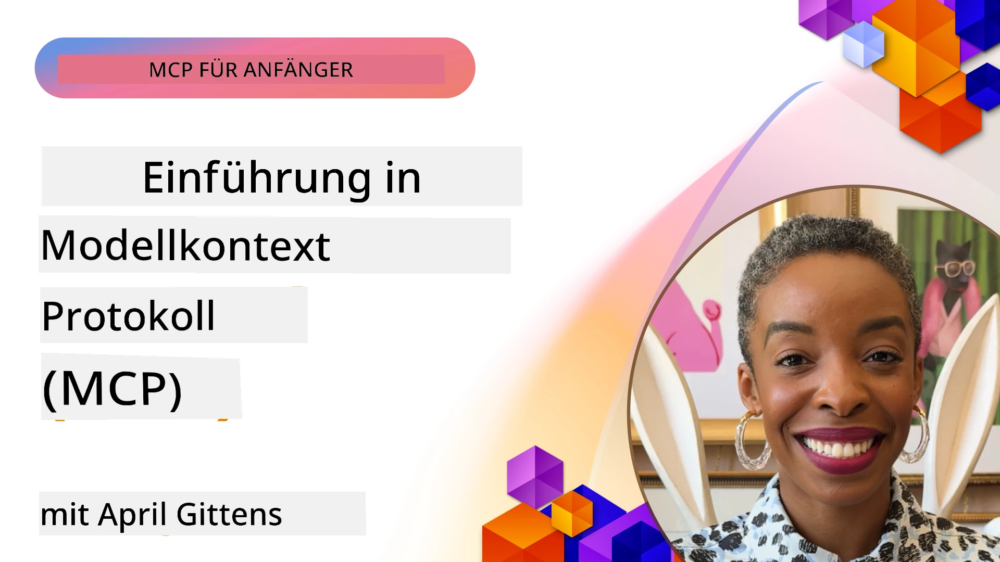
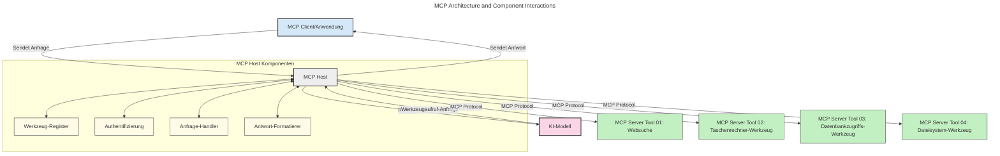
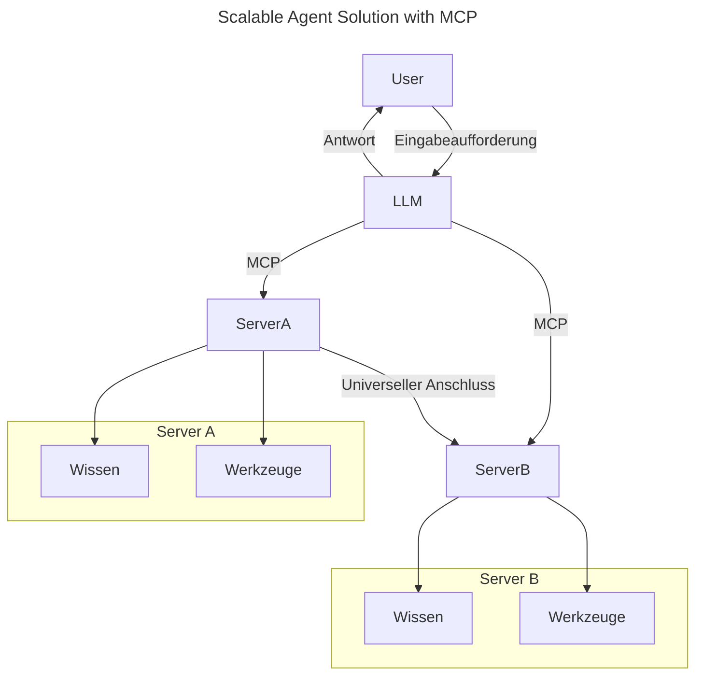
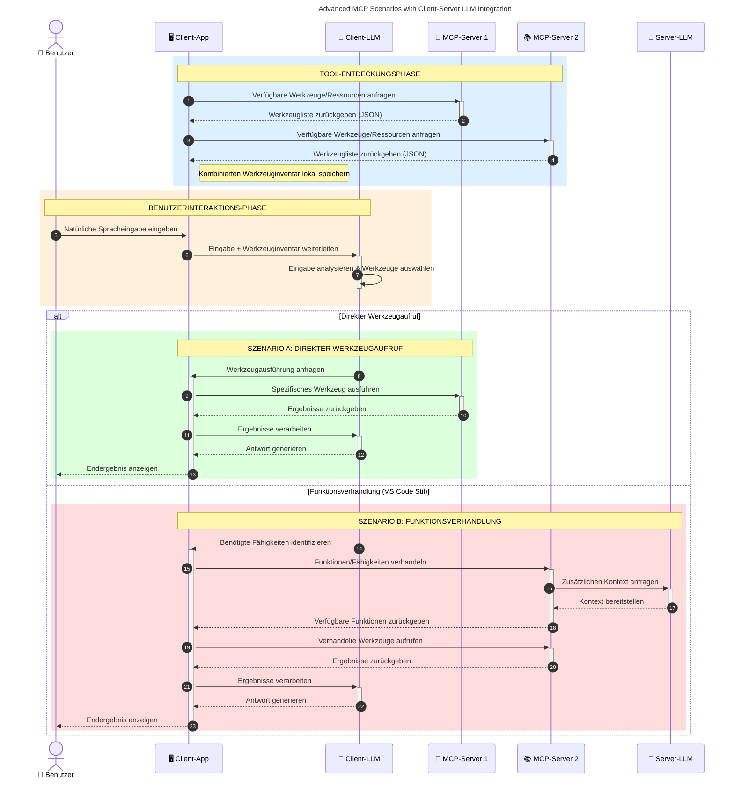

# Einführung in das Model Context Protocol (MCP): Warum es für skalierbare KI-Anwendungen wichtig ist

_(Klicken Sie auf das obige Bild, um das Video zu dieser Lektion anzusehen)_

Generative KI-Anwendungen stellen einen großen Fortschritt dar, da sie dem Benutzer oft erlauben, mit der App über natürliche Sprachbefehle zu interagieren. Wenn jedoch mehr Zeit und Ressourcen in solche Apps investiert werden, möchte man sicherstellen, dass Funktionen und Ressourcen einfach integriert werden können, sodass eine Erweiterung leicht möglich ist, die App mehrere Modelle unterstützen kann und verschiedene Modellbesonderheiten bewältigt. Kurz gesagt: Gen KI-Apps sind am Anfang einfach zu erstellen, aber mit zunehmendem Wachstum und steigender Komplexität muss man eine Architektur definieren und wahrscheinlich auf einen Standard setzen, damit die Apps konsistent aufgebaut sind. Hier kommt MCP ins Spiel, um Struktur zu schaffen und einen Standard zu bieten.

---

## **🔍 Was ist das Model Context Protocol (MCP)?**

Das **Model Context Protocol (MCP)** ist eine **offene, standardisierte Schnittstelle**, die es großen Sprachmodellen (LLMs) ermöglicht, nahtlos mit externen Werkzeugen, APIs und Datenquellen zu interagieren. Es bietet eine konsistente Architektur, um die Funktionalität von KI-Modellen über deren Trainingsdaten hinaus zu erweitern und dadurch intelligentere, skalierbare und reaktionsschnellere KI-Systeme zu ermöglichen.

---

## **🎯 Warum Standardisierung in der KI wichtig ist**

Da generative KI-Anwendungen komplexer werden, ist es entscheidend, Standards zu übernehmen, die **Skalierbarkeit, Erweiterbarkeit, Wartbarkeit** sicherstellen und **Vendor-Lock-in vermeiden**. MCP begegnet diesen Anforderungen durch:

- Vereinheitlichung der Modell-Werkzeug-Integrationen
- Reduzierung brüchiger, einmaliger Speziallösungen
- Ermöglichung der Koexistenz mehrerer Modelle unterschiedlicher Anbieter innerhalb eines Ökosystems

**Hinweis:** Obwohl MCP sich als offener Standard versteht, gibt es keine Pläne, MCP durch bestehende Standardisierungsgremien wie IEEE, IETF, W3C, ISO oder andere zu standardisieren.

---

## **📚 Lernziele**

Am Ende dieses Artikels werden Sie in der Lage sein:

- Das **Model Context Protocol (MCP)** und seine Anwendungsfälle zu definieren
- Zu verstehen, wie MCP die Modell-zu-Werkzeug-Kommunikation standardisiert
- Die Kernkomponenten der MCP-Architektur zu identifizieren
- Reale Anwendungsfälle von MCP in Unternehmens- und Entwicklerkontexten zu erkunden

---

## **💡 Warum das Model Context Protocol (MCP) ein Game-Changer ist**

### **🔗 MCP löst Fragmentierung in KI-Interaktionen**

Vor MCP erforderte die Integration von Modellen mit Werkzeugen:

- Eigene Codes für jedes Werkzeug-Modell-Paar
- Nicht-standardisierte APIs für jeden Anbieter
- Häufige Ausfälle durch Updates
- Schlechte Skalierbarkeit mit zunehmender Werkzeuganzahl

### **✅ Vorteile der MCP-Standardisierung**

| **Vorteil**              | **Beschreibung**                                                                |
|--------------------------|--------------------------------------------------------------------------------|
| Interoperabilität        | LLMs arbeiten nahtlos mit Werkzeugen verschiedener Anbieter zusammen            |
| Konsistenz               | Einheitliches Verhalten über Plattformen und Werkzeuge hinweg                   |
| Wiederverwendbarkeit     | Einmal entwickelte Werkzeuge können in verschiedenen Projekten und Systemen genutzt werden |
| Beschleunigte Entwicklung| Entwicklungszeit wird durch standardisierte, Plug-and-Play-Schnittstellen reduziert |

---

## **🧱 Überblick über die MCP-Architektur auf hoher Ebene**

MCP folgt einem **Client-Server-Modell**, wobei:

- **MCP Hosts** führen die KI-Modelle aus
- **MCP Clients** starten Anfragen
- **MCP Server** stellen Kontext, Werkzeuge und Fähigkeiten bereit

### **Hauptkomponenten:**

- **Ressourcen** – Statische oder dynamische Daten für Modelle  
- **Prompts** – Vorgegebene Arbeitsabläufe für geführte Generierung  
- **Werkzeuge** – Ausführbare Funktionen wie Suche, Berechnungen  
- **Sampling** – Agentisches Verhalten durch rekursive Interaktionen (veraltet in
    MCP `2026-07-28`; neue Implementierungen sollten direkt mit einem LLM-Anbieter integrieren)

- **Elicitation** – Vom Server initiierte Anfragen an den Benutzer
- **Roots** – Informationsbezogene Dateisystemorte, die für einen Server relevant sind
    (veraltet in MCP `2026-07-28`; lieber Werkzeugparameter, Ressourcen-URIs oder
    Serverkonfiguration verwenden)

### **Protokollarchitektur:**

MCP nutzt eine zweilagige Architektur:
- **Datenebene**: JSON-RPC 2.0-Nachrichten, pro Anforderung Metadaten, Erkennung und
    Protokollprimitive
- **Transportschicht**: stdio für lokale Unterprozesse und Streamable HTTP für
    entfernte Server. Streamable HTTP kann SSE-Frames für gestreamte Antworten nutzen,
    aber der ältere HTTP+SSE-Transport ist veraltet.

---

## Wie MCP-Server funktionieren

MCP-Server arbeiten folgendermaßen:

- **Anfrageablauf**:
    1. Eine Anfrage wird von einem Endbenutzer oder von Software in dessen Namen initiiert.
    2. Der **MCP Client** sendet die Anfrage an einen **MCP Host**, der die Laufzeit des KI-Modells verwaltet.
    3. Das **KI-Modell** erhält den Benutzerprompt und kann über einen oder mehrere Werkzeug-Aufrufe Zugriff auf externe Werkzeuge oder Daten anfordern.
    4. Der **MCP Host**, nicht das Modell direkt, kommuniziert mit dem entsprechenden **MCP Server(s)** über das standardisierte Protokoll.
- **Funktionalität des MCP Hosts**:
    - **Werkzeugregistrierung**: Führt einen Katalog verfügbarer Werkzeuge und deren Fähigkeiten.
    - **Authentifizierung**: Überprüft Berechtigungen für den Werkzeugzugriff.
    - **Anfrageverarbeitung**: Bearbeitet eingehende Werkzeuganfragen vom Modell.
    - **Antwortformatierung**: Strukturiert Werkzeugausgaben in einem für das Modell verständlichen Format.
- **Ausführung des MCP Servers**:
    - Der **MCP Host** leitet Werkzeugaufrufe an einen oder mehrere **MCP Server** weiter, die spezialisierte Funktionen anbieten (z.B. Suche, Berechnungen, Datenbankabfragen).
    - Die **MCP Server** führen ihre jeweiligen Operationen aus und liefern Ergebnisse an den **MCP Host** im konsistenten Format zurück.
    - Der **MCP Host** formatiert und übermittelt diese Ergebnisse an das **KI-Modell**.
- **Abschluss der Antwort**:
    - Das **KI-Modell** integriert die Werkzeugausgaben in eine finale Antwort.
    - Der **MCP Host** sendet diese Antwort an den **MCP Client**, welcher sie an den Endbenutzer oder die aufrufende Software weitergibt.
    

## 👨‍💻 Wie man einen MCP-Server baut (mit Beispielen)

MCP-Server erlauben es, die Fähigkeiten von LLMs durch Bereitstellung von Daten und Funktionen zu erweitern. 

Bereit, es auszuprobieren? Hier sind sprach- und stackspezifische SDKs mit Beispielen zur Erstellung einfacher MCP-Server in verschiedenen Sprachen/Stacks:

- **Python SDK**: https://github.com/modelcontextprotocol/python-sdk

- **TypeScript SDK**: https://github.com/modelcontextprotocol/typescript-sdk

- **Java SDK**: https://github.com/modelcontextprotocol/java-sdk

- **C#/.NET SDK**: https://github.com/modelcontextprotocol/csharp-sdk

## 🌍 Praxisbeispiele für MCP

MCP ermöglicht eine breite Palette an Anwendungen durch Erweiterung der KI-Fähigkeiten:

| **Anwendung**              | **Beschreibung**                                                                |
|------------------------------|--------------------------------------------------------------------------------|
| Integration von Unternehmensdaten | Anbindung von LLMs an Datenbanken, CRM-Systeme oder interne Werkzeuge       |
| Agentische KI-Systeme           | Ermöglichung autonomer Agenten mit Werkzeugzugriff und Entscheidungsworkflows|
| Multimodale Anwendungen         | Kombination von Text-, Bild- und Audio-Werkzeugen in einer einheitlichen KI-App |
| Echtzeit-Datenintegration       | Einbindung von Live-Daten in KI-Interaktionen für genauere und aktuellere Ergebnisse |

### 🧠 MCP = Universeller Standard für KI-Interaktionen

Das Model Context Protocol (MCP) fungiert als universeller Standard für KI-Interaktionen, ähnlich wie USB-C physische Verbindungen für Geräte standardisierte. In der KI-Welt bietet MCP eine konsistente Schnittstelle, die es Modellen (Clients) erlaubt, nahtlos mit externen Werkzeugen und Datenanbietern (Servern) zu integrieren. Dies eliminiert die Notwendigkeit unterschiedlicher, kundenspezifischer Protokolle für jede API oder Datenquelle.

Unter MCP folgt ein MCP-kompatibles Werkzeug (als MCP-Server bezeichnet) einem einheitlichen Standard. Diese Server können die von ihnen angebotenen Werkzeuge oder Aktionen auflisten und diese Aktionen ausführen, wenn sie von einem KI-Agenten angefordert werden. KI-Agenten-Plattformen, die MCP unterstützen, sind in der Lage, verfügbare Werkzeuge von den Servern zu entdecken und diese über das Standardprotokoll aufzurufen.

### 💡 Erleichtert den Zugang zu Wissen

Über das Angebot von Werkzeugen hinaus erleichtert MCP auch den Zugang zu Wissen. Es ermöglicht Anwendungen, Kontext für große Sprachmodelle (LLMs) bereitzustellen, indem diese mit verschiedenen Datenquellen verlinkt werden. Zum Beispiel könnte ein MCP-Server das Dokumentenarchiv eines Unternehmens repräsentieren und Agenten erlauben, relevante Informationen bei Bedarf abzurufen. Ein anderer Server könnte spezielle Aktionen wie das Versenden von E-Mails oder das Aktualisieren von Datensätzen übernehmen. Aus der Sicht des Agenten sind dies einfach nur Werkzeuge – einige liefern Daten (Wissenskontext), andere führen Aktionen aus. MCP verwaltet beides effizient.

Ein Agent, der sich mit einem MCP-Server verbindet, lernt automatisch die verfügbaren Fähigkeiten und zugänglichen Daten des Servers in einem Standardformat kennen. Diese Standardisierung ermöglicht eine dynamische Werkzeugverfügbarkeit. Zum Beispiel wird durch das Hinzufügen eines neuen MCP-Servers zum System eines Agenten dessen Funktionen sofort nutzbar, ohne dass weitere Anpassungen der Agentenanweisungen erforderlich sind.

Diese optimierte Integration entspricht dem Ablauf im folgenden Diagramm, in dem Server sowohl Werkzeuge als auch Wissen bereitstellen und so eine nahtlose Zusammenarbeit zwischen Systemen gewährleisten. 

### 👉 Beispiel: Skalierbare Agentenlösung

Der Universal Connector ermöglicht es MCP-Servern, miteinander zu kommunizieren und Fähigkeiten zu teilen, sodass ServerA Aufgaben an ServerB delegieren oder dessen Werkzeuge und Wissen nutzen kann. Dies föderiert Werkzeuge und Daten über Server hinweg und unterstützt skalierbare sowie modulare Agentenarchitekturen. Da MCP die Werkzeugexposition standardisiert, können Agenten Werkzeuge dynamisch entdecken und Anfragen zwischen Servern routen, ohne fest codierte Integrationen.

Föderation von Werkzeugen und Wissen: Werkzeuge und Daten können serverübergreifend genutzt werden, was skalierbarere und modularere agentische Architekturen ermöglicht.

### 🔄 Erweiterte MCP-Szenarien mit clientseitiger LLM-Integration

Über die grundlegende MCP-Architektur hinaus gibt es erweiterte Szenarien, bei denen sowohl Client als auch Server LLMs enthalten, was komplexere Interaktionen ermöglicht. Im folgenden Diagramm könnte die **Client-App** eine IDE sein, die eine Reihe von MCP-Werkzeugen für die Nutzung durch das LLM bereithält:

## 🔐 Praktische Vorteile von MCP

Hier sind die praktischen Vorteile der Verwendung von MCP:

- **Aktualität**: Modelle können auf aktuelle Informationen jenseits ihrer Trainingsdaten zugreifen
- **Fähigkeitserweiterung**: Modelle können spezialisierte Werkzeuge für Aufgaben nutzen, für die sie nicht trainiert wurden
- **Reduzierte Halluzinationen**: Externe Datenquellen bieten faktische Grundlage
- **Datenschutz**: Sensible Daten können in sicheren Umgebungen bleiben, statt in Prompts eingebettet zu werden

## 📌 Wichtige Erkenntnisse

Folgendes sind wichtige Erkenntnisse bei der Verwendung von MCP:

- **MCP** standardisiert die Art und Weise, wie KI-Modelle mit Werkzeugen und Daten interagieren
- Fördert **Erweiterbarkeit, Konsistenz und Interoperabilität**
- MCP hilft, **Entwicklungszeit zu reduzieren, Zuverlässigkeit zu verbessern und Modellfähigkeiten zu erweitern**
- Die Client-Server-Architektur **ermöglicht flexible, erweiterbare KI-Anwendungen**

## 🧠 Übung

Denken Sie über eine KI-Anwendung nach, die Sie bauen möchten.

- Welche **externen Werkzeuge oder Daten** könnten deren Fähigkeiten verbessern?
- Wie könnte MCP die Integration **einfacher und zuverlässiger** machen?

## Zusätzliche Ressourcen

- [MCP GitHub Repository](https://github.com/modelcontextprotocol)

## Was kommt als Nächstes

Nächstes Kapitel: [Kapitel 1: Kernkonzepte](../01-CoreConcepts/README.md)

---

<!-- CO-OP TRANSLATOR DISCLAIMER START -->
**Haftungsausschluss**:
Dieses Dokument wurde mit dem KI-Übersetzungsdienst [Co-op Translator](https://github.com/Azure/co-op-translator) übersetzt. Obwohl wir uns um Genauigkeit bemühen, beachten Sie bitte, dass automatisierte Übersetzungen Fehler oder Ungenauigkeiten enthalten können. Das Originaldokument in seiner Ursprungssprache gilt als maßgebliche Quelle. Bei kritischen Informationen wird eine professionelle menschliche Übersetzung empfohlen. Wir übernehmen keine Haftung für Missverständnisse oder Fehlinterpretationen, die aus der Verwendung dieser Übersetzung entstehen.
<!-- CO-OP TRANSLATOR DISCLAIMER END -->