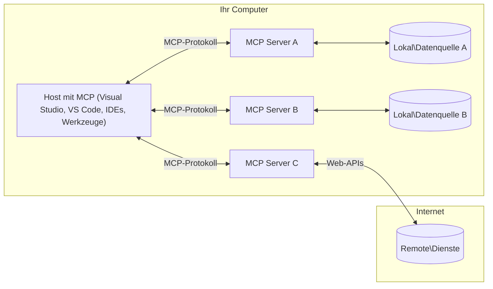

# MCP Kernkonzepte: Beherrschung des Model Context Protocol für die KI-Integration

[](https://youtu.be/earDzWGtE84)

_(Klicken Sie auf das obige Bild, um das Video zu dieser Lektion anzusehen)_

Das [Model Context Protocol (MCP)](https://github.com/modelcontextprotocol) ist ein leistungsstarkes, standardisiertes Framework, das die Kommunikation zwischen großen Sprachmodellen (LLMs) und externen Werkzeugen, Anwendungen und Datenquellen optimiert.  
Dieser Leitfaden führt Sie durch die Kernkonzepte von MCP. Sie lernen die Client-Server-Architektur, wesentliche Komponenten, Kommunikationsmechanismen und bewährte Implementierungspraktiken kennen.

- **Explizite Zustimmung des Nutzers**: Alle Datenzugriffe und Operationen erfordern vor der Ausführung eine ausdrückliche Zustimmung des Nutzers. Nutzer müssen klar verstehen, welche Daten abgerufen und welche Aktionen ausgeführt werden, mit granularer Kontrolle über Berechtigungen und Autorisierungen.

- **Datenschutz**: Nutzerdaten werden nur mit ausdrücklicher Zustimmung offengelegt und müssen durch robuste Zugriffskontrollen während des gesamten Interaktionszyklus geschützt werden. Implementierungen müssen unbefugte Datenübertragungen verhindern und strikte Datenschutzgrenzen einhalten.

- **Sicherheit bei der Werkzeugausführung**: Jede Werkzeugaufruf erfordert die ausdrückliche Zustimmung des Nutzers mit klarem Verständnis der Funktionalität, Parameter und möglichen Auswirkungen des Werkzeugs. Robuste Sicherheitsgrenzen müssen unbeabsichtigte, unsichere oder bösartige Werkzeugausführungen verhindern.

- **Sicherheit der Transportschicht**: Alle Kommunikationskanäle sollten geeignete Verschlüsselungs- und Authentifizierungsmechanismen verwenden. Fernverbindungen sollten sichere Transportprotokolle und ordnungsgemäße Verwaltung von Zugangsdaten implementieren.

#### Implementierungsrichtlinien:

- **Berechtigungsmanagement**: Implementieren Sie fein granulare Berechtigungssysteme, die es Nutzern erlauben zu steuern, welche Server, Werkzeuge und Ressourcen zugänglich sind  
- **Authentifizierung & Autorisierung**: Verwenden Sie sichere Authentifizierungsmethoden (OAuth, API-Schlüssel) mit ordnungsgemäßer Tokenverwaltung und Ablauf  
- **Eingabevalidierung**: Validieren Sie alle Parameter und Dateneingaben gemäß definierten Schemata, um Injektionsangriffe zu verhindern  
- **Audit-Logging**: Führen Sie umfassende Protokolle aller Operationen für Sicherheitsüberwachung und Compliance

## Überblick

Diese Lektion untersucht die grundlegende Architektur und Komponenten, die das Model Context Protocol (MCP) Ökosystem ausmachen. Sie lernen die Client-Server-Architektur, Schlüsselkomponenten und Kommunikationsmechanismen kennen, die MCP-Interaktionen ermöglichen.

## Wichtige Lernziele

Am Ende dieser Lektion werden Sie:

- Die MCP Client-Server-Architektur verstehen.  
- Rollen und Verantwortlichkeiten von Hosts, Clients und Servern identifizieren.  
- Die Kernfunktionen analysieren, die MCP zu einer flexiblen Integrationsschicht machen.  
- Lernen, wie Informationen innerhalb des MCP-Ökosystems fließen.  
- Praktische Einblicke durch Codebeispiele in .NET, Java, Python und JavaScript gewinnen.

## MCP Architektur: Ein tieferer Einblick

Das MCP-Ökosystem basiert auf einem Client-Server-Modell. Diese modulare Struktur ermöglicht es KI-Anwendungen, effizient mit Werkzeugen, Datenbanken, APIs und kontextuellen Ressourcen zu interagieren. Lassen Sie uns diese Architektur in ihre Kernkomponenten zerlegen.

Im Kern folgt MCP einer Client-Server-Architektur, bei der eine Host-Anwendung sich mit mehreren Servern verbinden kann:


- **MCP Hosts**: Programme wie VSCode, Claude Desktop, IDEs oder KI-Werkzeuge, die über MCP auf Daten zugreifen möchten  
- **MCP Clients**: Protokoll-Clients, die 1:1-Verbindungen mit Servern aufrechterhalten  
- **MCP Server**: Leichtgewichtige Programme, die jeweils spezifische Fähigkeiten über das standardisierte Model Context Protocol bereitstellen  
- **Lokale Datenquellen**: Dateien, Datenbanken und Dienste Ihres Computers, auf die MCP-Server sicher zugreifen können  
- **Remote-Dienste**: Externe Systeme, die über das Internet verfügbar sind und mit denen MCP-Server über APIs verbunden werden können.

Das MCP-Protokoll ist ein sich entwickelnder Standard mit datumsbasierter Versionierung (Format JJJJ-MM-TT). Die aktuelle Protokollversion ist **2025-11-25**. Die neuesten Updates zur [Protokollspezifikation](https://modelcontextprotocol.io/specification/2025-11-25/) können Sie dort einsehen.

### 1. Hosts

Im Model Context Protocol (MCP) sind **Hosts** KI-Anwendungen, die als primäre Schnittstelle dienen, über die Nutzer mit dem Protokoll interagieren. Hosts koordinieren und verwalten Verbindungen zu mehreren MCP-Servern, indem sie für jede Serververbindung dedizierte MCP-Clients erstellen. Beispiele für Hosts sind:

- **KI-Anwendungen**: Claude Desktop, Visual Studio Code, Claude Code  
- **Entwicklungsumgebungen**: IDEs und Code-Editoren mit MCP-Integration  
- **Benutzerdefinierte Anwendungen**: Zweckgebundene KI-Agenten und Werkzeuge

**Hosts** sind Anwendungen, die KI-Modell-Interaktionen koordinieren. Sie:

- **Orchestrieren KI-Modelle**: Führen LLMs aus oder interagieren mit ihnen, um Antworten zu generieren und KI-Workflows zu koordinieren  
- **Verwalten Client-Verbindungen**: Erstellen und pflegen je eine MCP-Client-Verbindung pro MCP-Server  
- **Steuern die Benutzeroberfläche**: Handhaben Gesprächsabläufe, Nutzerinteraktionen und Antwortpräsentation  
- **Setzen Sicherheitsmaßnahmen durch**: Kontrollieren Berechtigungen, Sicherheitsbeschränkungen und Authentifizierung  
- **Verwalten Nutzerzustimmung**: Organisieren die Zustimmung der Nutzer für Datenaustausch und Werkzeugausführung

### 2. Clients

**Clients** sind wesentliche Komponenten, die dedizierte Eins-zu-eins-Verbindungen zwischen Hosts und MCP-Servern aufrechterhalten. Jeder MCP-Client wird vom Host instanziiert, um eine Verbindung zu einem spezifischen MCP-Server herzustellen, was organisierte und sichere Kommunikationskanäle gewährleistet. Mehrere Clients ermöglichen Hosts die gleichzeitige Verbindung zu mehreren Servern.

**Clients** sind Verbindungs-Komponenten innerhalb der Host-Anwendung. Sie:

- **Protokollkommunikation**: Senden JSON-RPC 2.0-Anfragen an Server mit Eingabeaufforderungen und Anweisungen  
- **Fähigkeitsverhandlung**: Verhandeln unterstützte Funktionen und Protokollversionen mit Servern während der Initialisierung  
- **Werkzeugausführung**: Verwalten Werkzeugausführungsanfragen von Modellen und verarbeiten Antworten  
- **Echtzeit-Updates**: Handhaben Benachrichtigungen und Echtzeit-Updates von Servern  
- **Antwortverarbeitung**: Verarbeiten und formatieren Serverantworten zur Anzeige für Nutzer

### 3. Server

**Server** sind Programme, die Kontext, Werkzeuge und Fähigkeiten für MCP-Clients bereitstellen. Sie können lokal (auf demselben Rechner wie der Host) oder remote (auf externen Plattformen) ausgeführt werden und sind verantwortlich für die Bearbeitung von Client-Anfragen und die Bereitstellung strukturierter Antworten. Server stellen spezifische Funktionalitäten über das standardisierte Model Context Protocol bereit.

**Server** sind Dienste, die Kontext und Fähigkeiten bereitstellen. Sie:

- **Funktionsregistrierung**: Registrieren und stellen verfügbare Primitiven (Ressourcen, Eingabeaufforderungen, Werkzeuge) für Clients bereit  
- **Anfrageverarbeitung**: Empfangen und führen Werkzeugaufrufe, Ressourcenanfragen und Eingabeaufforderungsanfragen von Clients aus  
- **Kontextbereitstellung**: Stellen kontextuelle Informationen und Daten zur Verbesserung von Modellantworten bereit  
- **Zustandsverwaltung**: Pflegen Sitzungszustände und handhaben zustandsbehaftete Interaktionen bei Bedarf  
- **Echtzeit-Benachrichtigungen**: Senden Benachrichtigungen über Fähigkeitsänderungen und Updates an verbundene Clients

Server können von jedem entwickelt werden, um Modellfähigkeiten mit spezialisierten Funktionen zu erweitern, und unterstützen sowohl lokale als auch remote Bereitstellungsszenarien.

### 4. Server-Primitiven

Server im Model Context Protocol (MCP) bieten drei Kern-**Primitiven**, die die grundlegenden Bausteine für reichhaltige Interaktionen zwischen Clients, Hosts und Sprachmodellen definieren. Diese Primitiven spezifizieren die Arten von kontextuellen Informationen und Aktionen, die über das Protokoll verfügbar sind.

MCP-Server können jede Kombination der folgenden drei Kernprimitiven bereitstellen:

#### Ressourcen

**Ressourcen** sind Datenquellen, die kontextuelle Informationen für KI-Anwendungen bereitstellen. Sie repräsentieren statische oder dynamische Inhalte, die das Modellverständnis und die Entscheidungsfindung verbessern können:

- **Kontextuelle Daten**: Strukturierte Informationen und Kontext für die Nutzung durch KI-Modelle  
- **Wissensdatenbanken**: Dokumentenarchive, Artikel, Handbücher und Forschungsarbeiten  
- **Lokale Datenquellen**: Dateien, Datenbanken und lokale Systeminformationen  
- **Externe Daten**: API-Antworten, Webdienste und Daten von entfernten Systemen  
- **Dynamische Inhalte**: Echtzeitdaten, die sich basierend auf externen Bedingungen aktualisieren

Ressourcen werden durch URIs identifiziert und unterstützen die Entdeckung über `resources/list` sowie das Abrufen über `resources/read` Methoden:

```text
file://documents/project-spec.md
database://production/users/schema
api://weather/current
```

#### Eingabeaufforderungen

**Eingabeaufforderungen** sind wiederverwendbare Vorlagen, die helfen, Interaktionen mit Sprachmodellen zu strukturieren. Sie bieten standardisierte Interaktionsmuster und vorgefertigte Workflows:

- **Vorlagenbasierte Interaktionen**: Vorgefertigte Nachrichten und Gesprächseinstiege  
- **Workflow-Vorlagen**: Standardisierte Abläufe für häufige Aufgaben und Interaktionen  
- **Few-shot-Beispiele**: Beispielbasierte Vorlagen zur Modellanweisung  
- **System-Eingabeaufforderungen**: Grundlegende Eingabeaufforderungen, die Modellverhalten und Kontext definieren  
- **Dynamische Vorlagen**: Parametrisierte Eingabeaufforderungen, die sich an spezifische Kontexte anpassen

Eingabeaufforderungen unterstützen Variablenersetzung und können über `prompts/list` entdeckt und mit `prompts/get` abgerufen werden:

```markdown
Generate a {{task_type}} for {{product}} targeting {{audience}} with the following requirements: {{requirements}}
```

#### Werkzeuge

**Werkzeuge** sind ausführbare Funktionen, die KI-Modelle aufrufen können, um spezifische Aktionen auszuführen. Sie repräsentieren die „Verben“ des MCP-Ökosystems und ermöglichen Modellen die Interaktion mit externen Systemen:

- **Ausführbare Funktionen**: Diskrete Operationen, die Modelle mit spezifischen Parametern aufrufen können  
- **Integration externer Systeme**: API-Aufrufe, Datenbankabfragen, Dateioperationen, Berechnungen  
- **Eindeutige Identität**: Jedes Werkzeug hat einen eindeutigen Namen, eine Beschreibung und ein Parameterschema  
- **Strukturierte Ein-/Ausgabe**: Werkzeuge akzeptieren validierte Parameter und liefern strukturierte, typisierte Antworten zurück  
- **Aktionsfähigkeiten**: Ermöglichen Modellen, reale Aktionen auszuführen und Live-Daten abzurufen

Werkzeuge werden mit JSON Schema für Parametervalidierung definiert, über `tools/list` entdeckt und über `tools/call` ausgeführt:

```typescript
server.tool(
  "search_products", 
  {
    query: z.string().describe("Search query for products"),
    category: z.string().optional().describe("Product category filter"),
    max_results: z.number().default(10).describe("Maximum results to return")
  }, 
  async (params) => {
    // Suche ausführen und strukturierte Ergebnisse zurückgeben
    return await productService.search(params);
  }
);
```

## Client-Primitiven

Im Model Context Protocol (MCP) können **Clients** Primitiven bereitstellen, die es Servern ermöglichen, zusätzliche Fähigkeiten von der Host-Anwendung anzufordern. Diese clientseitigen Primitiven erlauben reichhaltigere, interaktivere Serverimplementierungen, die auf KI-Modellfähigkeiten und Nutzerinteraktionen zugreifen können.

### Sampling

**Sampling** erlaubt es Servern, Sprachmodell-Vervollständigungen von der KI-Anwendung des Clients anzufordern. Diese Primitive ermöglicht Servern den Zugriff auf LLM-Fähigkeiten, ohne eigene Modellabhängigkeiten einzubetten:

- **Modellunabhängiger Zugriff**: Server können Vervollständigungen anfordern, ohne LLM-SDKs einzubinden oder Modellzugriff zu verwalten  
- **Serverinitiierte KI**: Ermöglicht Servern, autonom Inhalte mit dem KI-Modell des Clients zu generieren  
- **Rekursive LLM-Interaktionen**: Unterstützt komplexe Szenarien, in denen Server KI-Unterstützung für die Verarbeitung benötigen  
- **Dynamische Inhaltserzeugung**: Ermöglicht Servern, kontextuelle Antworten mit dem Modell des Hosts zu erstellen

Sampling wird über die Methode `sampling/complete` initiiert, bei der Server Vervollständigungsanfragen an Clients senden.

### Elicitation

**Elicitation** ermöglicht es Servern, über die Client-Oberfläche zusätzliche Informationen oder Bestätigungen von Nutzern anzufordern:

- **Anfragen an Nutzer**: Server können bei Bedarf zusätzliche Informationen für die Werkzeugausführung anfordern  
- **Bestätigungsdialoge**: Fordern Nutzerzustimmung für sensible oder wirkungsvolle Operationen an  
- **Interaktive Workflows**: Ermöglichen Servern, schrittweise Nutzerinteraktionen zu erstellen  
- **Dynamische Parametererfassung**: Sammeln fehlender oder optionaler Parameter während der Werkzeugausführung

Elicitation-Anfragen werden über die Methode `elicitation/request` gestellt, um Nutzereingaben über die Client-Oberfläche zu erfassen.

### Logging

**Logging** erlaubt es Servern, strukturierte Protokollnachrichten an Clients zu senden, um Debugging, Überwachung und operative Transparenz zu ermöglichen:

- **Debugging-Unterstützung**: Ermöglicht Servern, detaillierte Ausführungsprotokolle für Fehlerbehebung bereitzustellen  
- **Betriebsüberwachung**: Senden Statusupdates und Leistungsmetriken an Clients  
- **Fehlermeldungen**: Liefern detaillierten Fehlerkontext und Diagnoseinformationen  
- **Audit-Trails**: Erstellen umfassende Protokolle von Serveroperationen und Entscheidungen

Logging-Nachrichten werden an Clients gesendet, um Transparenz in Serveroperationen zu schaffen und Debugging zu erleichtern.

## Informationsfluss im MCP

Das Model Context Protocol (MCP) definiert einen strukturierten Informationsfluss zwischen Hosts, Clients, Servern und Modellen. Das Verständnis dieses Flusses hilft zu klären, wie Nutzeranfragen verarbeitet werden und wie externe Werkzeuge und Daten in Modellantworten integriert werden.

- **Host initiiert Verbindung**  
  Die Host-Anwendung (z. B. eine IDE oder Chat-Oberfläche) stellt eine Verbindung zu einem MCP-Server her, typischerweise über STDIO, WebSocket oder einen anderen unterstützten Transport.

- **Fähigkeitsverhandlung**  
  Der Client (eingebettet im Host) und der Server tauschen Informationen über ihre unterstützten Funktionen, Werkzeuge, Ressourcen und Protokollversionen aus. Dies stellt sicher, dass beide Seiten verstehen, welche Fähigkeiten für die Sitzung verfügbar sind.

- **Nutzeranfrage**  
  Der Nutzer interagiert mit dem Host (z. B. gibt eine Eingabeaufforderung oder einen Befehl ein). Der Host sammelt diese Eingabe und übergibt sie zur Verarbeitung an den Client.

- **Ressourcen- oder Werkzeugnutzung**  
  - Der Client kann zusätzliche Kontextinformationen oder Ressourcen vom Server anfordern (z. B. Dateien, Datenbankeinträge oder Wissensdatenbankartikel), um das Modellverständnis zu bereichern.  
  - Wenn das Modell feststellt, dass ein Werkzeug benötigt wird (z. B. um Daten abzurufen, eine Berechnung durchzuführen oder eine API aufzurufen), sendet der Client eine Werkzeugaufruf-Anfrage an den Server, in der der Werkzeugname und die Parameter angegeben sind.

- **Serverausführung**  
  Der Server erhält die Ressourcen- oder Werkzeuganfrage, führt die notwendigen Operationen aus (z. B. eine Funktion ausführen, eine Datenbank abfragen oder eine Datei abrufen) und gibt die Ergebnisse in strukturierter Form an den Client zurück.

- **Antwortgenerierung**  
  Der Client integriert die Serverantworten (Ressourcendaten, Werkzeugausgaben usw.) in die laufende Modellinteraktion. Das Modell nutzt diese Informationen, um eine umfassende und kontextuell relevante Antwort zu generieren.

- **Ergebnispräsentation**  
  Der Host erhält die finale Ausgabe vom Client und präsentiert sie dem Nutzer, oft einschließlich des vom Modell generierten Texts sowie aller Ergebnisse aus Werkzeugausführungen oder Ressourcensuchen.

Dieser Ablauf ermöglicht es MCP, fortschrittliche, interaktive und kontextbewusste KI-Anwendungen zu unterstützen, indem Modelle nahtlos mit externen Werkzeugen und Datenquellen verbunden werden.

## Protokollarchitektur & Schichten

MCP besteht aus zwei unterschiedlichen Architekturschichten, die zusammenarbeiten, um ein vollständiges Kommunikationsframework bereitzustellen:

### Datenschicht

Die **Datenschicht** implementiert das Kernprotokoll von MCP basierend auf **JSON-RPC 2.0**. Diese Schicht definiert die Nachrichtenstruktur, Semantik und Interaktionsmuster:

#### Kernkomponenten:

- **JSON-RPC 2.0 Protokoll**: Alle Kommunikation verwendet das standardisierte JSON-RPC 2.0 Nachrichtenformat für Methodenaufrufe, Antworten und Benachrichtigungen
- **Lebenszyklusverwaltung**: Verwaltet die Verbindungsinitialisierung, Fähigkeitsverhandlung und Sitzungsbeendigung zwischen Clients und Servern  
- **Server-Primitiven**: Ermöglicht Servern, Kernfunktionen über Werkzeuge, Ressourcen und Eingabeaufforderungen bereitzustellen  
- **Client-Primitiven**: Ermöglicht Servern, Abfragen von LLMs anzufordern, Benutzereingaben zu erfragen und Protokollnachrichten zu senden  
- **Echtzeit-Benachrichtigungen**: Unterstützt asynchrone Benachrichtigungen für dynamische Aktualisierungen ohne Abfrage  

#### Hauptmerkmale:

- **Protokollversionsverhandlung**: Verwendet datumsbasierte Versionierung (JJJJ-MM-TT) zur Sicherstellung der Kompatibilität  
- **Fähigkeitserkennung**: Clients und Server tauschen unterstützte Funktionen während der Initialisierung aus  
- **Zustandsbehaftete Sitzungen**: Erhält den Verbindungszustand über mehrere Interaktionen hinweg für Kontextkontinuität  

### Transportschicht

Die **Transportschicht** verwaltet Kommunikationskanäle, Nachrichtenrahmung und Authentifizierung zwischen MCP-Teilnehmern:

#### Unterstützte Transportmechanismen:

1. **STDIO-Transport**:  
   - Verwendet Standard-Ein-/Ausgabeströme für direkte Prozesskommunikation  
   - Optimal für lokale Prozesse auf derselben Maschine ohne Netzwerk-Overhead  
   - Häufig verwendet für lokale MCP-Serverimplementierungen  

2. **Streambarer HTTP-Transport**:  
   - Verwendet HTTP POST für Client-zu-Server-Nachrichten  
   - Optional Server-Sent Events (SSE) für Server-zu-Client-Streaming  
   - Ermöglicht Kommunikation mit entfernten Servern über Netzwerke  
   - Unterstützt Standard-HTTP-Authentifizierung (Bearer-Tokens, API-Schlüssel, benutzerdefinierte Header)  
   - MCP empfiehlt OAuth für sichere tokenbasierte Authentifizierung  

#### Transportabstraktion:

Die Transportschicht abstrahiert Kommunikationsdetails von der Datenschicht und ermöglicht dasselbe JSON-RPC 2.0 Nachrichtenformat über alle Transportmechanismen hinweg. Diese Abstraktion erlaubt Anwendungen, nahtlos zwischen lokalen und entfernten Servern zu wechseln.

### Sicherheitsüberlegungen

MCP-Implementierungen müssen mehrere kritische Sicherheitsprinzipien einhalten, um sichere, vertrauenswürdige und geschützte Interaktionen über alle Protokolloperationen hinweg zu gewährleisten:

- **Benutzereinwilligung und Kontrolle**: Benutzer müssen ausdrücklich zustimmen, bevor Daten abgerufen oder Operationen ausgeführt werden. Sie sollten klare Kontrolle darüber haben, welche Daten geteilt und welche Aktionen autorisiert werden, unterstützt durch intuitive Benutzeroberflächen zur Überprüfung und Genehmigung von Aktivitäten.

- **Datenschutz**: Benutzerdaten dürfen nur mit ausdrücklicher Zustimmung offengelegt werden und müssen durch geeignete Zugriffskontrollen geschützt sein. MCP-Implementierungen müssen unbefugte Datenübertragungen verhindern und sicherstellen, dass die Privatsphäre während aller Interaktionen gewahrt bleibt.

- **Werkzeugsicherheit**: Vor dem Aufruf eines Werkzeugs ist eine ausdrückliche Benutzereinwilligung erforderlich. Benutzer sollten die Funktionalität jedes Werkzeugs klar verstehen, und robuste Sicherheitsgrenzen müssen durchgesetzt werden, um unbeabsichtigte oder unsichere Werkzeugausführungen zu verhindern.

Durch die Einhaltung dieser Sicherheitsprinzipien stellt MCP sicher, dass Benutzervertrauen, Datenschutz und Sicherheit über alle Protokollinteraktionen hinweg gewahrt bleiben und gleichzeitig leistungsstarke KI-Integrationen ermöglicht werden.

## Codebeispiele: Schlüsselkomponenten

Nachfolgend finden Sie Codebeispiele in mehreren populären Programmiersprachen, die zeigen, wie wichtige MCP-Serverkomponenten und Werkzeuge implementiert werden.

### .NET-Beispiel: Erstellen eines einfachen MCP-Servers mit Werkzeugen

Hier ist ein praktisches .NET-Codebeispiel, das zeigt, wie man einen einfachen MCP-Server mit benutzerdefinierten Werkzeugen implementiert. Dieses Beispiel demonstriert, wie Werkzeuge definiert und registriert, Anfragen verarbeitet und der Server mit dem Model Context Protocol verbunden wird.

```csharp
using System;
using System.Threading.Tasks;
using ModelContextProtocol.Server;
using ModelContextProtocol.Server.Transport;
using ModelContextProtocol.Server.Tools;

public class WeatherServer
{
    public static async Task Main(string[] args)
    {
        // Create an MCP server
        var server = new McpServer(
            name: "Weather MCP Server",
            version: "1.0.0"
        );
        
        // Register our custom weather tool
        server.AddTool<string, WeatherData>("weatherTool", 
            description: "Gets current weather for a location",
            execute: async (location) => {
                // Call weather API (simplified)
                var weatherData = await GetWeatherDataAsync(location);
                return weatherData;
            });
        
        // Connect the server using stdio transport
        var transport = new StdioServerTransport();
        await server.ConnectAsync(transport);
        
        Console.WriteLine("Weather MCP Server started");
        
        // Keep the server running until process is terminated
        await Task.Delay(-1);
    }
    
    private static async Task<WeatherData> GetWeatherDataAsync(string location)
    {
        // This would normally call a weather API
        // Simplified for demonstration
        await Task.Delay(100); // Simulate API call
        return new WeatherData { 
            Temperature = 72.5,
            Conditions = "Sunny",
            Location = location
        };
    }
}

public class WeatherData
{
    public double Temperature { get; set; }
    public string Conditions { get; set; }
    public string Location { get; set; }
}
```

### Java-Beispiel: MCP-Serverkomponenten

Dieses Beispiel zeigt denselben MCP-Server und die Werkzeugregistrierung wie das obige .NET-Beispiel, jedoch in Java implementiert.

```java
import io.modelcontextprotocol.server.McpServer;
import io.modelcontextprotocol.server.McpToolDefinition;
import io.modelcontextprotocol.server.transport.StdioServerTransport;
import io.modelcontextprotocol.server.tool.ToolExecutionContext;
import io.modelcontextprotocol.server.tool.ToolResponse;

public class WeatherMcpServer {
    public static void main(String[] args) throws Exception {
        // Erstelle einen MCP-Server
        McpServer server = McpServer.builder()
            .name("Weather MCP Server")
            .version("1.0.0")
            .build();
            
        // Registriere ein Wetter-Tool
        server.registerTool(McpToolDefinition.builder("weatherTool")
            .description("Gets current weather for a location")
            .parameter("location", String.class)
            .execute((ToolExecutionContext ctx) -> {
                String location = ctx.getParameter("location", String.class);
                
                // Hole Wetterdaten (vereinfacht)
                WeatherData data = getWeatherData(location);
                
                // Gib formatierte Antwort zurück
                return ToolResponse.content(
                    String.format("Temperature: %.1f°F, Conditions: %s, Location: %s", 
                    data.getTemperature(), 
                    data.getConditions(), 
                    data.getLocation())
                );
            })
            .build());
        
        // Verbinde den Server über stdio-Transport
        try (StdioServerTransport transport = new StdioServerTransport()) {
            server.connect(transport);
            System.out.println("Weather MCP Server started");
            // Halte den Server am Laufen, bis der Prozess beendet wird
            Thread.currentThread().join();
        }
    }
    
    private static WeatherData getWeatherData(String location) {
        // Die Implementierung würde eine Wetter-API aufrufen
        // Vereinfacht zu Demonstrationszwecken
        return new WeatherData(72.5, "Sunny", location);
    }
}

class WeatherData {
    private double temperature;
    private String conditions;
    private String location;
    
    public WeatherData(double temperature, String conditions, String location) {
        this.temperature = temperature;
        this.conditions = conditions;
        this.location = location;
    }
    
    public double getTemperature() {
        return temperature;
    }
    
    public String getConditions() {
        return conditions;
    }
    
    public String getLocation() {
        return location;
    }
}
```

### Python-Beispiel: Aufbau eines MCP-Servers

Dieses Beispiel verwendet fastmcp, bitte stellen Sie sicher, dass Sie es zuerst installieren:

```python
pip install fastmcp
```
Code-Beispiel:

```python
#!/usr/bin/env python3
import asyncio
from fastmcp import FastMCP
from fastmcp.transports.stdio import serve_stdio

# Erstelle einen FastMCP-Server
mcp = FastMCP(
    name="Weather MCP Server",
    version="1.0.0"
)

@mcp.tool()
def get_weather(location: str) -> dict:
    """Gets current weather for a location."""
    return {
        "temperature": 72.5,
        "conditions": "Sunny",
        "location": location
    }

# Alternative Vorgehensweise mit einer Klasse
class WeatherTools:
    @mcp.tool()
    def forecast(self, location: str, days: int = 1) -> dict:
        """Gets weather forecast for a location for the specified number of days."""
        return {
            "location": location,
            "forecast": [
                {"day": i+1, "temperature": 70 + i, "conditions": "Partly Cloudy"}
                for i in range(days)
            ]
        }

# Registriere Klassentools
weather_tools = WeatherTools()

# Starte den Server
if __name__ == "__main__":
    asyncio.run(serve_stdio(mcp))
```

### JavaScript-Beispiel: Erstellen eines MCP-Servers

Dieses Beispiel zeigt die Erstellung eines MCP-Servers in JavaScript und wie zwei wetterbezogene Werkzeuge registriert werden.

```javascript
// Verwendung des offiziellen Model Context Protocol SDK
import { McpServer } from "@modelcontextprotocol/sdk/server/mcp.js";
import { StdioServerTransport } from "@modelcontextprotocol/sdk/server/stdio.js";
import { z } from "zod"; // Zur Parameterüberprüfung

// Erstellen eines MCP-Servers
const server = new McpServer({
  name: "Weather MCP Server",
  version: "1.0.0"
});

// Definieren eines Wetter-Tools
server.tool(
  "weatherTool",
  {
    location: z.string().describe("The location to get weather for")
  },
  async ({ location }) => {
    // Dies würde normalerweise eine Wetter-API aufrufen
    // Vereinfacht zur Demonstration
    const weatherData = await getWeatherData(location);
    
    return {
      content: [
        { 
          type: "text", 
          text: `Temperature: ${weatherData.temperature}°F, Conditions: ${weatherData.conditions}, Location: ${weatherData.location}` 
        }
      ]
    };
  }
);

// Definieren eines Vorhersage-Tools
server.tool(
  "forecastTool",
  {
    location: z.string(),
    days: z.number().default(3).describe("Number of days for forecast")
  },
  async ({ location, days }) => {
    // Dies würde normalerweise eine Wetter-API aufrufen
    // Vereinfacht zur Demonstration
    const forecast = await getForecastData(location, days);
    
    return {
      content: [
        { 
          type: "text", 
          text: `${days}-day forecast for ${location}: ${JSON.stringify(forecast)}` 
        }
      ]
    };
  }
);

// Hilfsfunktionen
async function getWeatherData(location) {
  // API-Aufruf simulieren
  return {
    temperature: 72.5,
    conditions: "Sunny",
    location: location
  };
}

async function getForecastData(location, days) {
  // API-Aufruf simulieren
  return Array.from({ length: days }, (_, i) => ({
    day: i + 1,
    temperature: 70 + Math.floor(Math.random() * 10),
    conditions: i % 2 === 0 ? "Sunny" : "Partly Cloudy"
  }));
}

// Verbinden des Servers über stdio-Transport
const transport = new StdioServerTransport();
server.connect(transport).catch(console.error);

console.log("Weather MCP Server started");
```

Dieses JavaScript-Beispiel demonstriert, wie man einen MCP-Client erstellt, der sich mit einem Server verbindet, eine Eingabeaufforderung sendet und die Antwort einschließlich aller ausgeführten Werkzeugaufrufe verarbeitet.

## Sicherheit und Autorisierung

MCP enthält mehrere eingebaute Konzepte und Mechanismen zur Verwaltung von Sicherheit und Autorisierung im gesamten Protokoll:

1. **Werkzeug-Berechtigungskontrolle**:  
   Clients können festlegen, welche Werkzeuge ein Modell während einer Sitzung verwenden darf. Dies stellt sicher, dass nur ausdrücklich autorisierte Werkzeuge zugänglich sind, wodurch das Risiko unbeabsichtigter oder unsicherer Operationen reduziert wird. Berechtigungen können dynamisch basierend auf Benutzerpräferenzen, Organisationsrichtlinien oder dem Kontext der Interaktion konfiguriert werden.

2. **Authentifizierung**:  
   Server können eine Authentifizierung verlangen, bevor Zugriff auf Werkzeuge, Ressourcen oder sensible Operationen gewährt wird. Dies kann API-Schlüssel, OAuth-Tokens oder andere Authentifizierungsschemata umfassen. Eine ordnungsgemäße Authentifizierung stellt sicher, dass nur vertrauenswürdige Clients und Benutzer serverseitige Funktionen aufrufen können.

3. **Validierung**:  
   Parametervalidierung wird für alle Werkzeugaufrufe durchgesetzt. Jedes Werkzeug definiert die erwarteten Typen, Formate und Einschränkungen für seine Parameter, und der Server validiert eingehende Anfragen entsprechend. Dies verhindert, dass fehlerhafte oder bösartige Eingaben Werkzeugimplementierungen erreichen, und hilft, die Integrität der Operationen zu wahren.

4. **Ratenbegrenzung**:  
   Um Missbrauch zu verhindern und eine faire Nutzung der Serverressourcen sicherzustellen, können MCP-Server Ratenbegrenzungen für Werkzeugaufrufe und Ressourcenzugriffe implementieren. Ratenbegrenzungen können pro Benutzer, pro Sitzung oder global angewendet werden und schützen vor Denial-of-Service-Angriffen oder übermäßigem Ressourcenverbrauch.

Durch die Kombination dieser Mechanismen bietet MCP eine sichere Grundlage für die Integration von Sprachmodellen mit externen Werkzeugen und Datenquellen, während Benutzern und Entwicklern eine feingranulare Kontrolle über Zugriff und Nutzung ermöglicht wird.

## Protokollnachrichten & Kommunikationsablauf

Die MCP-Kommunikation verwendet strukturierte **JSON-RPC 2.0**-Nachrichten, um klare und zuverlässige Interaktionen zwischen Hosts, Clients und Servern zu ermöglichen. Das Protokoll definiert spezifische Nachrichtenmuster für verschiedene Operationstypen:

### Kernnachrichtentypen:

#### **Initialisierungsnachrichten**
- **`initialize`-Anfrage**: Stellt die Verbindung her und verhandelt Protokollversion und Fähigkeiten  
- **`initialize`-Antwort**: Bestätigt unterstützte Funktionen und Serverinformationen  
- **`notifications/initialized`**: Signalisiert, dass die Initialisierung abgeschlossen ist und die Sitzung bereitsteht  

#### **Entdeckungsnachrichten**
- **`tools/list`-Anfrage**: Erkennt verfügbare Werkzeuge vom Server  
- **`resources/list`-Anfrage**: Listet verfügbare Ressourcen (Datenquellen) auf  
- **`prompts/list`-Anfrage**: Ruft verfügbare Eingabeaufforderungsvorlagen ab  

#### **Ausführungsnachrichten**  
- **`tools/call`-Anfrage**: Führt ein bestimmtes Werkzeug mit bereitgestellten Parametern aus  
- **`resources/read`-Anfrage**: Ruft Inhalte von einer bestimmten Ressource ab  
- **`prompts/get`-Anfrage**: Holt eine Eingabeaufforderungsvorlage mit optionalen Parametern  

#### **Client-seitige Nachrichten**
- **`sampling/complete`-Anfrage**: Server fordert LLM-Vervollständigung vom Client an  
- **`elicitation/request`**: Server fordert Benutzereingabe über die Client-Oberfläche an  
- **Protokollierungsnachrichten**: Server sendet strukturierte Protokollnachrichten an den Client  

#### **Benachrichtigungsnachrichten**
- **`notifications/tools/list_changed`**: Server benachrichtigt Client über Werkzeugänderungen  
- **`notifications/resources/list_changed`**: Server benachrichtigt Client über Ressourcenänderungen  
- **`notifications/prompts/list_changed`**: Server benachrichtigt Client über Änderungen bei Eingabeaufforderungen  

### Nachrichtenstruktur:

Alle MCP-Nachrichten folgen dem JSON-RPC 2.0-Format mit:  
- **Anfragenachrichten**: Enthalten `id`, `method` und optionale `params`  
- **Antwortnachrichten**: Enthalten `id` und entweder `result` oder `error`  
- **Benachrichtigungsnachrichten**: Enthalten `method` und optionale `params` (kein `id` und keine Antwort erwartet)  

Diese strukturierte Kommunikation gewährleistet zuverlässige, nachvollziehbare und erweiterbare Interaktionen, die fortgeschrittene Szenarien wie Echtzeit-Updates, Werkzeugverkettung und robuste Fehlerbehandlung unterstützen.

## Wichtige Erkenntnisse

- **Architektur**: MCP verwendet eine Client-Server-Architektur, bei der Hosts mehrere Client-Verbindungen zu Servern verwalten  
- **Teilnehmer**: Das Ökosystem umfasst Hosts (KI-Anwendungen), Clients (Protokoll-Connectoren) und Server (Fähigkeitsanbieter)  
- **Transportmechanismen**: Kommunikation unterstützt STDIO (lokal) und streambaren HTTP mit optionalem SSE (entfernt)  
- **Kernprimitiven**: Server stellen Werkzeuge (ausführbare Funktionen), Ressourcen (Datenquellen) und Eingabeaufforderungen (Vorlagen) bereit  
- **Client-Primitiven**: Server können Sampling (LLM-Vervollständigungen), Elicitation (Benutzereingaben) und Logging vom Client anfordern  
- **Protokollgrundlage**: Basierend auf JSON-RPC 2.0 mit datumsbasierter Versionierung (aktuell: 2025-11-25)  
- **Echtzeitfähigkeiten**: Unterstützt Benachrichtigungen für dynamische Updates und Echtzeitsynchronisation  
- **Sicherheit zuerst**: Explizite Benutzereinwilligung, Datenschutz und sicherer Transport sind Kernanforderungen  

## Übung

Entwerfen Sie ein einfaches MCP-Werkzeug, das in Ihrem Bereich nützlich wäre. Definieren Sie:  
1. Wie das Werkzeug heißen würde  
2. Welche Parameter es akzeptieren würde  
3. Welche Ausgabe es zurückgeben würde  
4. Wie ein Modell dieses Werkzeug nutzen könnte, um Benutzerprobleme zu lösen  

---

## Was kommt als Nächstes

Weiter: [Kapitel 2: Sicherheit](../02-Security/README.md)

---

<!-- CO-OP TRANSLATOR DISCLAIMER START -->
**Haftungsausschluss**:  
Dieses Dokument wurde mit dem KI-Übersetzungsdienst [Co-op Translator](https://github.com/Azure/co-op-translator) übersetzt. Obwohl wir uns um Genauigkeit bemühen, beachten Sie bitte, dass automatisierte Übersetzungen Fehler oder Ungenauigkeiten enthalten können. Das Originaldokument in seiner Ursprungssprache ist als maßgebliche Quelle zu betrachten. Für wichtige Informationen wird eine professionelle menschliche Übersetzung empfohlen. Wir übernehmen keine Haftung für Missverständnisse oder Fehlinterpretationen, die aus der Nutzung dieser Übersetzung entstehen.
<!-- CO-OP TRANSLATOR DISCLAIMER END -->