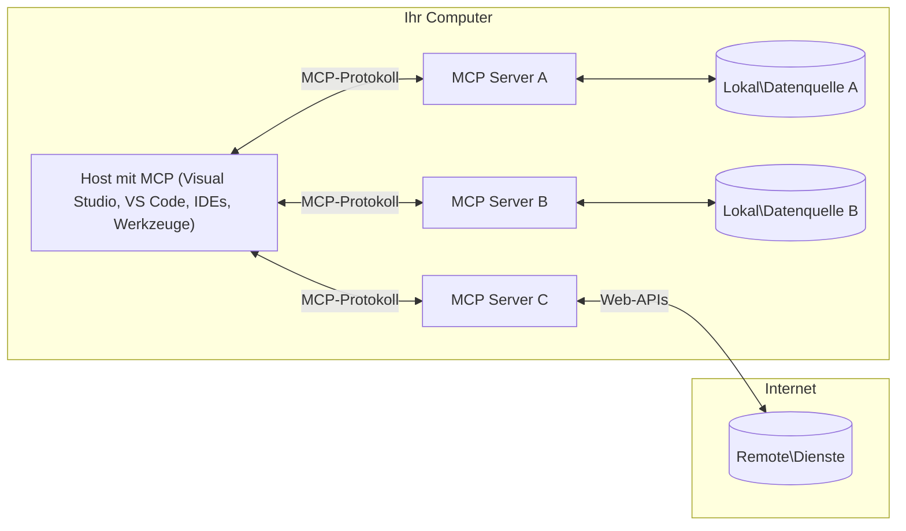

# MCP Kernkonzepte: Beherrschung des Model Context Protocol für KI-Integration

[](https://youtu.be/earDzWGtE84)

_(Klicken Sie auf das obige Bild, um das Video zu dieser Lektion anzusehen)_

Das [Model Context Protocol (MCP)](https://github.com/modelcontextprotocol) ist ein leistungsstarkes, standardisiertes Framework, das die Kommunikation zwischen Large Language Models (LLMs) und externen Tools, Anwendungen und Datenquellen optimiert. 
Dieser Leitfaden führt Sie durch die Kernkonzepte von MCP. Sie lernen die Client-Server-Architektur, wesentliche Komponenten, Kommunikationsmechanismen und bewährte Implementierungspraktiken kennen.

- **Explizite Nutzerzustimmung**: Alle Datenzugriffe und Operationen erfordern vor ihrer Ausführung eine ausdrückliche Zustimmung des Nutzers. Nutzer müssen klar verstehen, welche Daten abgerufen und welche Aktionen durchgeführt werden, mit granularem Kontrollpunkt über Berechtigungen und Autorisierungen.

- **Schutz der Datenprivatsphäre**: Nutzerdaten werden nur mit ausdrücklicher Zustimmung offengelegt und müssen durch robuste Zugriffskontrollen während des gesamten Interaktionszyklus geschützt werden. Implementierungen müssen unautorisierte Datenübertragung verhindern und strikte Datenschutzgrenzen einhalten.

- **Sicherheit bei der Ausführung von Tools**: Jede Ausführung eines Tools erfordert eine explizite Nutzerzustimmung mit klarem Verständnis der Funktionalität, Parameter und potenziellen Auswirkungen des Tools. Robuste Sicherheitsgrenzen müssen unbeabsichtigte, unsichere oder bösartige Tool-Ausführungen verhindern.

- **Sicherheit der Transportschicht**: Alle Kommunikationskanäle sollten geeignete Verschlüsselungs- und Authentifizierungsmechanismen verwenden. Fernverbindungen müssen sichere Transportprotokolle und ordnungsgemäße Anmeldeinformationen-verwaltung implementieren.

#### Implementierungsrichtlinien:

- **Berechtigungsmanagement**: Implementieren Sie fein granulare Berechtigungssysteme, die Nutzern erlauben zu steuern, welche Server, Tools und Ressourcen zugänglich sind  
- **Authentifizierung & Autorisierung**: Verwenden Sie sichere Authentifizierungsmethoden (OAuth, API-Schlüssel) mit geeigneter Tokenverwaltung und Ablauf  
- **Eingabevalidierung**: Validieren Sie alle Parameter und Dateneingaben gemäß definierter Schemata, um Injektionsangriffe zu verhindern  
- **Audit-Logging**: Führen Sie umfassende Protokolle aller Operationen für Sicherheitsüberwachung und Compliance

## Übersicht

Diese Lektion erforscht die grundlegende Architektur und Komponenten, die das Model Context Protocol (MCP)-Ökosystem ausmachen. Sie lernen die Client-Server-Architektur, Schlüsselkomponenten und Kommunikationsmechanismen kennen, die MCP-Interaktionen ermöglichen.

## Wichtige Lernziele

Am Ende dieser Lektion werden Sie:

- Die MCP Client-Server-Architektur verstehen.  
- Rollen und Verantwortlichkeiten von Hosts, Clients und Servern identifizieren.  
- Die Kerneigenschaften analysieren, die MCP zu einer flexiblen Integrationsschicht machen.  
- Erfahren, wie Informationen innerhalb des MCP-Ökosystems fließen.  
- Praktische Einblicke durch Code-Beispiele in .NET, Java, Python und JavaScript gewinnen.

## MCP-Architektur: Ein tieferer Blick

Das MCP-Ökosystem basiert auf einem Client-Server-Modell. Diese modulare Struktur ermöglicht es KI-Anwendungen, effizient mit Tools, Datenbanken, APIs und kontextuellen Ressourcen zu interagieren. Lassen Sie uns diese Architektur in ihre Kernkomponenten aufschlüsseln.

Im Kern folgt MCP einer Client-Server-Architektur, bei der eine Host-Anwendung mehrere Server verbinden kann:


```mermaid
flowchart LR
    subgraph "Ihr Computer"
        Host["Host mit MCP (Visual Studio, VS Code, IDEs, Werkzeuge)"]
        S1["MCP Server A"]
        S2["MCP Server B"]
        S3["MCP Server C"]
        Host <-->|"MCP-Protokoll"| S1
        Host <-->|"MCP-Protokoll"| S2
        Host <-->|"MCP-Protokoll"| S3
        S1 <--> D1[("Lokal\Datenquelle A")]
        S2 <--> D2[("Lokal\Datenquelle B")]
    end
    subgraph "Internet"
        S3 <-->|"Web-APIs"| D3[("Remote\Dienste")]
    end
```

- **MCP Hosts**: Programme wie VSCode, Claude Desktop, IDEs oder KI-Tools, die über MCP auf Daten zugreifen wollen  
- **MCP Clients**: Protokoll-Clients, die 1:1-Verbindungen mit Servern aufrechterhalten  
- **MCP Server**: Leichtgewichtige Programme, die jeweils spezifische Fähigkeiten über das standardisierte Model Context Protocol bereitstellen  
- **Lokale Datenquellen**: Dateien, Datenbanken und Dienste Ihres Computers, auf die MCP-Server sicher zugreifen können  
- **Remote-Dienste**: Externe Systeme, die über das Internet verfügbar sind und mit denen MCP-Server über APIs verbunden werden können.

Das MCP-Protokoll ist ein sich entwickelnder Standard mit datumsbasierter Versionierung (Format JJJJ-MM-TT). Die aktuelle Protokollversion ist **2025-11-25**. Sie können die neuesten Updates zur [Protokollspezifikation](https://modelcontextprotocol.io/specification/2025-11-25/) einsehen.

> **Ausblick:** Ein Release Candidate für die nächste Spezifikationsversion, **2026-07-28**, wurde im Mai 2026 angekündigt und soll am 28. Juli 2026 veröffentlicht werden. Er macht das Protokoll zustandslos auf der Transportschicht (entfernt den `initialize`-Handshake und Session-IDs), formalisiert ein Extensions-Framework und deaktiviert Roots, Sampling und Logging zugunsten neuerer Muster. Siehe [Was ändert sich in MCP: Der Release Candidate 2026-07-28](./mcp-2026-07-28-release-candidate.md) für eine vollständige Aufschlüsselung.

### 1. Hosts

Im Model Context Protocol (MCP) sind **Hosts** KI-Anwendungen, die als primäre Schnittstelle dienen, über die Nutzer mit dem Protokoll interagieren. Hosts koordinieren und verwalten Verbindungen zu mehreren MCP-Servern, indem sie für jede Serververbindung dedizierte MCP-Clients erstellen. Beispiele für Hosts sind:

- **KI-Anwendungen**: Claude Desktop, Visual Studio Code, Claude Code  
- **Entwicklungsumgebungen**: IDEs und Code-Editoren mit MCP-Integration  
- **Benutzerdefinierte Anwendungen**: Speziell entwickelte KI-Agenten und Tools

**Hosts** sind Anwendungen, die KI-Modellinteraktionen koordinieren. Sie:

- **Orchestrieren KI-Modelle**: Führen LLMs aus oder interagieren mit ihnen, um Antworten zu erzeugen und KI-Workflows zu koordinieren  
- **Verwalten Client-Verbindungen**: Erstellen und unterhalten je eine MCP-Client-Verbindung pro MCP-Server  
- **Steuern die Benutzeroberfläche**: Steuern Gesprächsabläufe, Nutzerinteraktionen und Antwortpräsentation  
- **Durchsetzen von Sicherheit**: Kontrollieren Berechtigungen, Sicherheitsbeschränkungen und Authentifizierung  
- **Handhaben Nutzereinwilligung**: Verwalten Nutzerzustimmung für Datenteilung und Toolausführung

### 2. Clients

**Clients** sind wesentliche Komponenten, die dedizierte Eins-zu-eins-Verbindungen zwischen Hosts und MCP-Servern aufrechterhalten. Jeder MCP-Client wird vom Host instanziiert, um eine spezifische MCP-Server-Verbindung herzustellen, und gewährleistet damit organisierte und sichere Kommunikationskanäle. Mehrere Clients ermöglichen es Hosts, gleichzeitig Verbindungen zu mehreren Servern zu pflegen.

**Clients** sind Verbindungskomponenten innerhalb der Host-Anwendung. Sie:

- **Protokoll-Kommunikation**: Senden JSON-RPC 2.0-Anfragen an Server mit Prompts und Anweisungen  
- **Fähigkeitenverhandlung**: Verhandeln unterstützte Features und Protokollversionen mit Servern bei der Initialisierung  
- **Tool-Ausführung**: Verwalten Tool-Ausführungsanfragen von Modellen und verarbeiten Antworten  
- **Echtzeit-Updates**: Bearbeiten Benachrichtigungen und Echtzeit-Updates von Servern  
- **Antwortverarbeitung**: Verarbeiten und formatieren Serverantworten zur Darstellung für Nutzer

### 3. Server

**Server** sind Programme, die Kontext, Tools und Fähigkeiten für MCP-Clients bereitstellen. Sie können lokal (auf derselben Maschine wie der Host) oder remote (auf externen Plattformen) betrieben werden und sind zuständig für die Bearbeitung von Client-Anfragen sowie die Bereitstellung strukturierter Antworten. Server bieten spezifische Funktionalitäten über das standardisierte Model Context Protocol an.

**Server** sind Dienste, die Kontext und Fähigkeiten bereitstellen. Sie:

- **Feature-Registrierung**: Registrieren und stellen verfügbare Primitiven (Ressourcen, Prompts, Tools) für Clients bereit  
- **Anfrageverarbeitung**: Empfangen und führen Tool-Aufrufe, Ressourcenanfragen und Prompt-Anfragen von Clients aus  
- **Kontextbereitstellung**: Stellen kontextuelle Informationen und Daten bereit, um Modellantworten zu verbessern  
- **Zustandsverwaltung**: Pflegen Sitzungszustände und unterstützen zustandsbehaftete Interaktionen bei Bedarf  
- **Echtzeit-Benachrichtigungen**: Senden Benachrichtigungen über Fähigkeitsänderungen und Updates an verbundene Clients

Server können von jedermann entwickelt werden, um Modellfähigkeiten mit spezialisierten Funktionen zu erweitern, und unterstützen sowohl lokale als auch Remote-Bereitstellungsszenarien.

### 4. Server-Primitiven

Server im Model Context Protocol (MCP) stellen drei Kern-**Primitiven** bereit, die die grundlegenden Bausteine für reichhaltige Interaktionen zwischen Clients, Hosts und Sprachmodellen definieren. Diese Primitiven spezifizieren die Arten kontextueller Informationen und Aktionen, die über das Protokoll verfügbar sind.

MCP-Server können jede Kombination der folgenden drei Kern-Primitiven bereitstellen:

#### Ressourcen

**Ressourcen** sind Datenquellen, die kontextuelle Informationen für KI-Anwendungen bereitstellen. Sie repräsentieren statische oder dynamische Inhalte, die das Modellverständnis und die Entscheidungsfindung verbessern:

- **Kontextuelle Daten**: Strukturierte Informationen und Kontext für die Nutzung durch KI-Modelle  
- **Wissensbasen**: Dokumentensammlungen, Artikel, Handbücher und Forschungsarbeiten  
- **Lokale Datenquellen**: Dateien, Datenbanken und lokale Systeminformationen  
- **Externe Daten**: API-Antworten, Webdienste und Daten von entfernten Systemen  
- **Dynamische Inhalte**: Echtzeitdaten, die sich basierend auf externen Bedingungen aktualisieren

Ressourcen werden durch URIs identifiziert und unterstützen die Entdeckung über `resources/list` und den Abruf über `resources/read`:

```text
file://documents/project-spec.md
database://production/users/schema
api://weather/current
```

#### Prompts

**Prompts** sind wiederverwendbare Vorlagen, die helfen, Interaktionen mit Sprachmodellen zu strukturieren. Sie bieten standardisierte Interaktionsmuster und vorgefertigte Arbeitsabläufe:

- **Vorlagenbasierte Interaktionen**: Vorgefertigte Nachrichten und Gesprächseinstiege  
- **Workflow-Vorlagen**: Standardisierte Abläufe für häufige Aufgaben und Interaktionen  
- **Few-Shot-Beispiele**: Beispielbasierte Vorlagen zur Modellanleitung  
- **System-Prompts**: Grundlegende Prompts, die Modellverhalten und Kontext definieren  
- **Dynamische Vorlagen**: Parametrisierte Prompts, die sich an spezifische Kontexte anpassen

Prompts unterstützen Variablenersetzung und können über `prompts/list` entdeckt sowie über `prompts/get` abgerufen werden:

```markdown
Generate a {{task_type}} for {{product}} targeting {{audience}} with the following requirements: {{requirements}}
```

#### Tools

**Tools** sind ausführbare Funktionen, die KI-Modelle aufrufen können, um spezifische Aktionen auszuführen. Sie repräsentieren die „Verben“ des MCP-Ökosystems und ermöglichen Modellen die Interaktion mit externen Systemen:

- **Ausführbare Funktionen**: Diskrete Operationen, die Modelle mit spezifischen Parametern ausführen können  
- **Integration externer Systeme**: API-Aufrufe, Datenbankabfragen, Dateioperationen, Berechnungen  
- **Einzigartige Identität**: Jedes Tool hat einen eindeutigen Namen, eine Beschreibung und ein Parameterschema  
- **Strukturierte Ein-/Ausgaben**: Tools akzeptieren validierte Parameter und liefern strukturierte, typisierte Antworten  
- **Aktionsfähigkeiten**: Ermöglichen es Modellen, reale Aktionen auszuführen und Live-Daten abzurufen

Tools werden mit JSON Schema zur Parametervalidierung definiert, über `tools/list` entdeckt und via `tools/call` aufgerufen. Tools können auch **Icons** als zusätzliche Metadaten für eine bessere UI-Präsentation enthalten.

**Tool-Anmerkungen**: Tools unterstützen Verhaltensannotationen (z.B. `readOnlyHint`, `destructiveHint`), die beschreiben, ob ein Tool nur lesend oder destruktiv ist, und so Clients bei der informierten Entscheidungsfindung zur Toolausführung unterstützen.

Beispiel-Tool-Definition:

```typescript
server.tool(
  "search_products", 
  {
    query: z.string().describe("Search query for products"),
    category: z.string().optional().describe("Product category filter"),
    max_results: z.number().default(10).describe("Maximum results to return")
  }, 
  async (params) => {
    // Suche ausführen und strukturierte Ergebnisse zurückgeben
    return await productService.search(params);
  }
);
```

## Client-Primitiven

Im Model Context Protocol (MCP) können **Clients** Primitiven bereitstellen, die es Servern ermöglichen, zusätzliche Fähigkeiten von der Host-Anwendung anzufordern. Diese clientseitigen Primitiven erlauben reichhaltigere, interaktivere Server-Implementierungen, die auf KI-Modellfähigkeiten und Nutzerinteraktionen zugreifen können.

### Sampling

> **Hinweis zur Veraltung:** Der Release Candidate `2026-07-28` kennzeichnet Sampling als veraltet zugunsten einer direkten Integration mit LLM-Anbieter-APIs. Es funktioniert weiterhin in `2025-11-25` und mindestens ein Jahr nach jeder Veraltung, jedoch sollten neue Designs das Ersatzmuster bevorzugen. Siehe [Was ändert sich in MCP: Der Release Candidate 2026-07-28](./mcp-2026-07-28-release-candidate.md).

**Sampling** erlaubt Servern, Sprachmodell-Vervollständigungen von der KI-Anwendung des Clients anzufordern. Diese Primitive ermöglicht Servern den Zugriff auf LLM-Funktionen, ohne eigene Modelldependencies einzubetten:

- **Modellunabhängiger Zugriff**: Server können Vervollständigungen anfordern, ohne LLM-SDKs einzubeziehen oder Modellzugriffe zu verwalten  
- **Server-initiierte KI**: Ermöglicht Servern, autonom Inhalte über das Modell des Clients zu generieren  
- **Rekursive LLM-Interaktionen**: Unterstützt komplexe Szenarien, in denen Server KI-Unterstützung für Verarbeitung benötigen  
- **Dynamische Inhaltserzeugung**: Erlaubt Servern, kontextuelle Antworten mit dem Host-Modell zu erstellen  
- **Unterstützung Tool-Aufrufe**: Server können `tools` und `toolChoice` Parameter einschließen, damit das Modell des Clients Tools während der Abfrage aufruft

Sampling wird über die Methode `sampling/complete` initiiert, bei der Server Vervollständigungsanfragen an Clients senden.

### Roots

> **Hinweis zur Veraltung:** Der Release Candidate `2026-07-28` kennzeichnet Roots als veraltet zugunsten von Tool-Parametern, Ressourcen-URIs oder Server-Konfiguration. Es funktioniert weiterhin in `2025-11-25` und mindestens ein Jahr nach jeder Veraltung. Siehe [Was ändert sich in MCP: Der Release Candidate 2026-07-28](./mcp-2026-07-28-release-candidate.md).

**Roots** bieten eine standardisierte Methode für Clients, Dateisystem-Grenzen gegenüber Servern offenzulegen, um Servern zu zeigen, auf welche Verzeichnisse und Dateien sie Zugriff haben:

- **Dateisystem-Grenzen**: Definieren die Bereiche, in denen Server im Dateisystem operieren dürfen  
- **Zugriffskontrolle**: Helfen Servern zu verstehen, auf welche Verzeichnisse und Dateien sie Berechtigungen haben  
- **Dynamische Updates**: Clients können Server benachrichtigen, wenn sich die Liste der Roots ändert  
- **URI-basierte Identifikation**: Roots verwenden `file://`-URIs zur Identifikation zugänglicher Verzeichnisse und Dateien

Roots werden über die Methode `roots/list` entdeckt, wobei Clients bei Änderungen `notifications/roots/list_changed` senden.

### Elicitation

**Elicitation** ermöglicht Servern, über die Client-Oberfläche zusätzliche Informationen oder Bestätigungen von Nutzern anzufordern:

- **Anfragen für Nutzereingaben**: Server können nach zusätzlichen Informationen fragen, die für die Ausführung von Tools benötigt werden  
- **Bestätigungsdialogs**: Fordert Nutzerzustimmung für sensible oder wirkungsvolle Operationen ein  
- **Interaktive Arbeitsabläufe**: Ermöglichen Servern, schrittweise Nutzerinteraktionen zu gestalten  
- **Dynamische Parameter-Erfassung**: Sammeln fehlender oder optionaler Parameter während der Toolausführung

Elicitation-Anfragen werden mittels `elicitation/request` gesendet, um Nutzereingaben über die Client-Schnittstelle zu erfassen.

**URL-Modus Elicitation**: Server können auch URL-basierte Nutzerinteraktionen anfragen, die es Servern erlauben, Nutzer zu externen Webseiten für Authentifizierung, Bestätigung oder Dateneingabe weiterzuleiten.

### Logging
> **Hinweis zur Einstellung:** Die Release-Kandidaten-Version `2026-07-28` kennzeichnet Logging als veraltet zugunsten von `stderr` für stdio-Transporte und OpenTelemetry für strukturierte Beobachtbarkeit. Es bleibt in der Version `2025-11-25` und für mindestens ein Jahr nach einer etwaigen Einstellung weiterhin funktionsfähig. Siehe [Was sich in MCP ändert: Der Release-Kandidat 2026-07-28](./mcp-2026-07-28-release-candidate.md).

**Logging** ermöglicht es Servern, strukturierte Protokollnachrichten an Clients zur Fehlerbehebung, Überwachung und betrieblichen Sichtbarkeit zu senden:

- **Fehlerbehebung**: Ermöglicht Servern, detaillierte Ausführungsprotokolle für die Fehlersuche bereitzustellen  
- **Betriebliche Überwachung**: Sendet Statusaktualisierungen und Leistungsmetriken an Clients  
- **Fehlerberichterstattung**: Liefert detaillierte Fehlerkontexte und Diagnoseinformationen  
- **Audit-Trails**: Erstellt umfassende Protokolle über Serveroperationen und Entscheidungen  

Logging-Nachrichten werden an Clients gesendet, um Transparenz in Serveraktivitäten zu schaffen und die Fehlerbehebung zu erleichtern.

## Informationsfluss in MCP

Das Model Context Protocol (MCP) definiert einen strukturierten Informationsfluss zwischen Hosts, Clients, Servern und Modellen. Das Verständnis dieses Flusses hilft zu klären, wie Benutzeranfragen verarbeitet und wie externe Werkzeuge und Daten in Modellantworten integriert werden.

- **Host initiiert Verbindung**  
  Die Host-Anwendung (z. B. eine IDE oder Chat-Oberfläche) stellt eine Verbindung zu einem MCP-Server her, typischerweise über STDIO, WebSocket oder einen anderen unterstützten Transport.

- **Fähigkeitsabgleich**  
  Der Client (im Host eingebettet) und der Server tauschen Informationen zu ihren unterstützten Funktionen, Werkzeugen, Ressourcen und Protokollversionen aus. Dies stellt sicher, dass beide Seiten die verfügbaren Möglichkeiten für die Sitzung verstehen.

- **Benutzeranfrage**  
  Der Benutzer interagiert mit dem Host (z. B. indem er eine Eingabeaufforderung oder einen Befehl eingibt). Der Host sammelt diese Eingabe und leitet sie an den Client zur Verarbeitung weiter.

- **Verwendung von Ressourcen oder Werkzeugen**  
  - Der Client kann zusätzliche Kontextinformationen oder Ressourcen vom Server anfordern (z. B. Dateien, Datenbankeinträge oder Wissensdatenbankartikel), um das Verständnis des Modells zu erweitern.  
  - Falls das Modell feststellt, dass ein Werkzeug benötigt wird (z. B. um Daten abzurufen, eine Berechnung durchzuführen oder eine API aufzurufen), sendet der Client eine Werkzeugaufruf-Anfrage an den Server mit Angabe von Werkzeugname und Parametern.

- **Serverausführung**  
  Der Server empfängt die Anfrage zu Ressource oder Werkzeug, führt die erforderlichen Operationen aus (z. B. Funktionsaufruf, Datenbankabfrage oder Dateizugriff) und liefert die Ergebnisse in strukturierter Form an den Client zurück.

- **Antwortgenerierung**  
  Der Client integriert die Serverantworten (Ressourcendaten, Werkzeugergebnisse usw.) in die laufende Modellinteraktion. Das Modell nutzt diese Informationen, um eine umfassende und kontextuell relevante Antwort zu erzeugen.

- **Ergebnispräsentation**  
  Der Host erhält die finale Ausgabe vom Client und präsentiert sie dem Benutzer, oft einschließlich des vom Modell generierten Textes und eventueller Ergebnisse aus Werkzeugausführungen oder Ressourcenabfragen.

Dieser Ablauf ermöglicht es MCP, fortgeschrittene, interaktive und kontextbewusste KI-Anwendungen zu unterstützen, indem Modelle nahtlos mit externen Werkzeugen und Datenquellen verbunden werden.

## Protokollarchitektur & Schichten

MCP besteht aus zwei unterschiedlichen Architekturschichten, die zusammen ein vollständiges Kommunikationsframework bereitstellen:

### Datenschicht

Die **Datenschicht** implementiert das Kernprotokoll MCP unter Verwendung von **JSON-RPC 2.0** als Grundlage. Diese Schicht definiert Nachrichtenstruktur, Semantik und Interaktionsmuster:

#### Kernkomponenten:

- **JSON-RPC 2.0 Protokoll**: Die gesamte Kommunikation verwendet das standardisierte JSON-RPC 2.0 Nachrichtenformat für Methodenaufrufe, Antworten und Benachrichtigungen  
- **Lebenszyklusverwaltung**: Behandelt Verbindungsinitialisierung, Fähigkeitsabgleich und Sitzungsbeendigung zwischen Clients und Servern  
- **Server-Primitiven**: Ermöglicht es Servern, Kernfunktionalität über Werkzeuge, Ressourcen und Prompts bereitzustellen  
- **Client-Primitiven**: Ermöglicht Servern, Abfragen an LLMs zu senden, Benutzereingaben anzufordern und Protokollnachrichten zu senden  
- **Echtzeit-Benachrichtigungen**: Unterstützt asynchrone Benachrichtigungen für dynamische Aktualisierungen ohne Polling

#### Wichtige Merkmale:

- **Protokollversionsabgleich**: Verwendet datumsbasierte Versionierung (JJJJ-MM-TT) zur Gewährleistung der Kompatibilität  
- **Fähigkeitsentdeckung**: Clients und Server tauschen während der Initialisierung Informationen zu unterstützten Funktionen aus  
- **Zustandsbehaftete Sitzungen**: Pflegt Verbindungszustand über mehrere Interaktionen hinweg zur Kontextkontinuität

### Transportschicht

Die **Transportschicht** verwaltet Kommunikationskanäle, Nachrichtenrahmung und Authentifizierung zwischen MCP-Teilnehmern:

#### Unterstützte Transportmechanismen:

1. **STDIO-Transport**:  
   - Verwendet Standard-Ein-/Ausgabeströme für direkte Prozesskommunikation  
   - Optimal für lokale Prozesse auf demselben Rechner ohne Netzwerk-Overhead  
   - Häufig verwendet für lokale MCP-Serverimplementierungen

2. **Streambarer HTTP-Transport**:  
   - Verwendet HTTP POST für Client-zu-Server-Nachrichten  
   - Optional Server-Sent Events (SSE) für Server-zu-Client-Streaming  
   - Ermöglicht die Kommunikation mit entfernten Servern über Netzwerke  
   - Unterstützt Standard-HTTP-Authentifizierung (Bearer-Tokens, API-Schlüssel, benutzerdefinierte Header)  
   - MCP empfiehlt OAuth für sichere tokenbasierte Authentifizierung

#### Transportabstraktion:

Die Transportschicht abstrahiert Kommunikationsdetails von der Datenschicht und ermöglicht so dasselbe JSON-RPC 2.0 Nachrichtenformat über alle Transportmechanismen hinweg. Diese Abstraktion erlaubt Anwendungen, nahtlos zwischen lokalen und entfernten Servern zu wechseln.

### Sicherheitsaspekte

MCP-Implementierungen müssen mehrere kritische Sicherheitsprinzipien einhalten, um sichere, vertrauenswürdige und geschützte Interaktionen über alle Protokolloperationen hinweg sicherzustellen:

- **Benutzerzustimmung und -kontrolle**: Nutzer müssen explizit zustimmen, bevor Daten abgerufen oder Operationen ausgeführt werden. Sie sollten klare Kontrolle über die geteilten Daten und autorisierten Aktionen haben, unterstützt durch intuitive Benutzeroberflächen zur Überprüfung und Freigabe von Aktivitäten.

- **Datenschutz**: Benutzerdaten dürfen nur mit ausdrücklicher Zustimmung offengelegt und müssen durch geeignete Zugriffskontrollen geschützt werden. MCP-Implementierungen müssen unbefugte Datenübertragungen verhindern und sicherstellen, dass Privatsphäre während aller Interaktionen gewahrt bleibt.

- **Werkzeugsicherheit**: Vor Ausführung eines Werkzeugs ist eine ausdrückliche Benutzerzustimmung erforderlich. Nutzer sollten die Funktionalität jedes Werkzeugs verstehen, und robuste Sicherheitsgrenzen sind durchzusetzen, um unbeabsichtigte oder unsichere Werkzeugausführungen zu verhindern.

Durch die Einhaltung dieser Sicherheitsprinzipien sichert MCP Vertrauen, Datenschutz und Sicherheit für alle Protokollinteraktionen, während leistungsstarke KI-Integrationen ermöglicht werden.

## Codebeispiele: Kernkomponenten

Nachfolgend finden sich Codebeispiele in mehreren populären Programmiersprachen, die zeigen, wie man zentrale MCP-Serverkomponenten und Werkzeuge implementiert.

### .NET Beispiel: Erstellen eines einfachen MCP-Servers mit Werkzeugen

Hier ein praktisches .NET-Codebeispiel, das demonstriert, wie man einen einfachen MCP-Server mit benutzerdefinierten Werkzeugen implementiert. Dieses Beispiel zeigt, wie man Werkzeuge definiert und registriert, Anfragen behandelt und den Server mithilfe des Model Context Protocols verbindet.

```csharp
using System;
using System.Threading.Tasks;
using ModelContextProtocol.Server;
using ModelContextProtocol.Server.Transport;
using ModelContextProtocol.Server.Tools;

public class WeatherServer
{
    public static async Task Main(string[] args)
    {
        // Create an MCP server
        var server = new McpServer(
            name: "Weather MCP Server",
            version: "1.0.0"
        );
        
        // Register our custom weather tool
        server.AddTool<string, WeatherData>("weatherTool", 
            description: "Gets current weather for a location",
            execute: async (location) => {
                // Call weather API (simplified)
                var weatherData = await GetWeatherDataAsync(location);
                return weatherData;
            });
        
        // Connect the server using stdio transport
        var transport = new StdioServerTransport();
        await server.ConnectAsync(transport);
        
        Console.WriteLine("Weather MCP Server started");
        
        // Keep the server running until process is terminated
        await Task.Delay(-1);
    }
    
    private static async Task<WeatherData> GetWeatherDataAsync(string location)
    {
        // This would normally call a weather API
        // Simplified for demonstration
        await Task.Delay(100); // Simulate API call
        return new WeatherData { 
            Temperature = 72.5,
            Conditions = "Sunny",
            Location = location
        };
    }
}

public class WeatherData
{
    public double Temperature { get; set; }
    public string Conditions { get; set; }
    public string Location { get; set; }
}
```

### Java Beispiel: MCP-Serverkomponenten

Dieses Beispiel zeigt denselben MCP-Server und die Werkzeugregistrierung wie im .NET-Beispiel oben, jedoch in Java implementiert.

```java
import io.modelcontextprotocol.server.McpServer;
import io.modelcontextprotocol.server.McpToolDefinition;
import io.modelcontextprotocol.server.transport.StdioServerTransport;
import io.modelcontextprotocol.server.tool.ToolExecutionContext;
import io.modelcontextprotocol.server.tool.ToolResponse;

public class WeatherMcpServer {
    public static void main(String[] args) throws Exception {
        // Erstelle einen MCP-Server
        McpServer server = McpServer.builder()
            .name("Weather MCP Server")
            .version("1.0.0")
            .build();
            
        // Registriere ein Wetter-Tool
        server.registerTool(McpToolDefinition.builder("weatherTool")
            .description("Gets current weather for a location")
            .parameter("location", String.class)
            .execute((ToolExecutionContext ctx) -> {
                String location = ctx.getParameter("location", String.class);
                
                // Hole Wetterdaten (vereinfacht)
                WeatherData data = getWeatherData(location);
                
                // Gibt formatierte Antwort zurück
                return ToolResponse.content(
                    String.format("Temperature: %.1f°F, Conditions: %s, Location: %s", 
                    data.getTemperature(), 
                    data.getConditions(), 
                    data.getLocation())
                );
            })
            .build());
        
        // Verbinde den Server über stdio-Transport
        try (StdioServerTransport transport = new StdioServerTransport()) {
            server.connect(transport);
            System.out.println("Weather MCP Server started");
            // Halte den Server am Laufen, bis der Prozess beendet wird
            Thread.currentThread().join();
        }
    }
    
    private static WeatherData getWeatherData(String location) {
        // Implementierung würde eine Wetter-API aufrufen
        // Vereinfacht zu Demonstrationszwecken
        return new WeatherData(72.5, "Sunny", location);
    }
}

class WeatherData {
    private double temperature;
    private String conditions;
    private String location;
    
    public WeatherData(double temperature, String conditions, String location) {
        this.temperature = temperature;
        this.conditions = conditions;
        this.location = location;
    }
    
    public double getTemperature() {
        return temperature;
    }
    
    public String getConditions() {
        return conditions;
    }
    
    public String getLocation() {
        return location;
    }
}
```

### Python Beispiel: Aufbau eines MCP-Servers

Dieses Beispiel verwendet fastmcp, bitte stellen Sie sicher, dass Sie es vorher installieren:

```python
pip install fastmcp
```
Code-Beispiel:

```python
#!/usr/bin/env python3
import asyncio
from fastmcp import FastMCP
from fastmcp.transports.stdio import serve_stdio

# Erstelle einen FastMCP-Server
mcp = FastMCP(
    name="Weather MCP Server",
    version="1.0.0"
)

@mcp.tool()
def get_weather(location: str) -> dict:
    """Gets current weather for a location."""
    return {
        "temperature": 72.5,
        "conditions": "Sunny",
        "location": location
    }

# Alternative Vorgehensweise mit einer Klasse
class WeatherTools:
    @mcp.tool()
    def forecast(self, location: str, days: int = 1) -> dict:
        """Gets weather forecast for a location for the specified number of days."""
        return {
            "location": location,
            "forecast": [
                {"day": i+1, "temperature": 70 + i, "conditions": "Partly Cloudy"}
                for i in range(days)
            ]
        }

# Registriere Klassenwerkzeuge
weather_tools = WeatherTools()

# Starte den Server
if __name__ == "__main__":
    asyncio.run(serve_stdio(mcp))
```

### JavaScript Beispiel: Erstellen eines MCP-Servers

Dieses Beispiel zeigt die Erstellung eines MCP-Servers in JavaScript und wie zwei wetterbezogene Werkzeuge registriert werden.

```javascript
// Verwendung des offiziellen Model Context Protocol SDK
import { McpServer } from "@modelcontextprotocol/sdk/server/mcp.js";
import { StdioServerTransport } from "@modelcontextprotocol/sdk/server/stdio.js";
import { z } from "zod"; // Zur Parameterüberprüfung

// Erstellen eines MCP-Servers
const server = new McpServer({
  name: "Weather MCP Server",
  version: "1.0.0"
});

// Definieren eines Wettertools
server.tool(
  "weatherTool",
  {
    location: z.string().describe("The location to get weather for")
  },
  async ({ location }) => {
    // Dies würde normalerweise eine Wetter-API aufrufen
    // Vereinfachte Darstellung zur Demonstration
    const weatherData = await getWeatherData(location);
    
    return {
      content: [
        { 
          type: "text", 
          text: `Temperature: ${weatherData.temperature}°F, Conditions: ${weatherData.conditions}, Location: ${weatherData.location}` 
        }
      ]
    };
  }
);

// Definieren eines Vorhersagetools
server.tool(
  "forecastTool",
  {
    location: z.string(),
    days: z.number().default(3).describe("Number of days for forecast")
  },
  async ({ location, days }) => {
    // Dies würde normalerweise eine Wetter-API aufrufen
    // Vereinfachte Darstellung zur Demonstration
    const forecast = await getForecastData(location, days);
    
    return {
      content: [
        { 
          type: "text", 
          text: `${days}-day forecast for ${location}: ${JSON.stringify(forecast)}` 
        }
      ]
    };
  }
);

// Hilfsfunktionen
async function getWeatherData(location) {
  // API-Aufruf simulieren
  return {
    temperature: 72.5,
    conditions: "Sunny",
    location: location
  };
}

async function getForecastData(location, days) {
  // API-Aufruf simulieren
  return Array.from({ length: days }, (_, i) => ({
    day: i + 1,
    temperature: 70 + Math.floor(Math.random() * 10),
    conditions: i % 2 === 0 ? "Sunny" : "Partly Cloudy"
  }));
}

// Verbinden des Servers über stdio-Transport
const transport = new StdioServerTransport();
server.connect(transport).catch(console.error);

console.log("Weather MCP Server started");
```

Dieses JavaScript-Beispiel demonstriert, wie man einen MCP-Server mit dem Model Context Protocol SDK erstellt. Es zeigt, wie zwei Werkzeuge namens `weatherTool` und `forecastTool` registriert und den MCP-Clients über das `StdioServerTransport` bereitgestellt werden.

## Sicherheit und Autorisierung

MCP beinhaltet mehrere integrierte Konzepte und Mechanismen zur Verwaltung von Sicherheit und Autorisierung im gesamten Protokoll:

1. **Werkzeug-Berechtigungskontrolle**:  
  Clients können festlegen, welche Werkzeuge ein Modell während einer Sitzung nutzen darf. Das stellt sicher, dass nur explizit autorisierte Werkzeuge zugänglich sind und verringert das Risiko unbeabsichtigter oder unsicherer Operationen. Berechtigungen können dynamisch basierend auf Benutzerpräferenzen, organisatorischen Richtlinien oder Kontext der Interaktion konfiguriert werden.

2. **Authentifizierung**:  
  Server können vor Zugriff auf Werkzeuge, Ressourcen oder sensible Operationen eine Authentifizierung verlangen. Dies kann API-Schlüssel, OAuth-Tokens oder andere Authentifizierungsschemata umfassen. Eine ordnungsgemäße Authentifizierung stellt sicher, dass nur vertrauenswürdige Clients und Benutzer Serverfähigkeiten aufrufen können.

3. **Validierung**:  
  Parametervalidierung wird für alle Werkzeugaufrufe durchgesetzt. Jedes Werkzeug definiert erwartete Typen, Formate und Einschränkungen seiner Parameter, und der Server prüft eingehende Anfragen entsprechend. Das verhindert fehlerhafte oder bösartige Eingaben und trägt zur Integrität der Operationen bei.

4. **Rate Limiting**:  
  Um Missbrauch zu verhindern und faire Nutzung von Serverressourcen sicherzustellen, können MCP-Server Aufrufraten für Werkzeugaufrufe und Ressourcenbeschränkungen implementieren. Limits können pro Benutzer, pro Sitzung oder global angewandt werden und schützen vor Denial-of-Service-Angriffen oder übermäßiger Ressourcennutzung.

Durch die Kombination dieser Mechanismen bietet MCP eine sichere Grundlage zur Integration von Sprachmodellen mit externen Werkzeugen und Datenquellen, während Benutzern und Entwicklern feinkörnige Kontrolle über Zugriff und Nutzung gegeben wird.

## Protokollnachrichten & Kommunikationsfluss

Die MCP-Kommunikation verwendet strukturierte **JSON-RPC 2.0** Nachrichten, um klare und zuverlässige Interaktionen zwischen Hosts, Clients und Servern zu ermöglichen. Das Protokoll definiert spezifische Nachrichtenmuster für verschiedene Operationsarten:

### Kernnachrichtentypen:

#### **Initialisierungsnachrichten**
- **`initialize` Request**: Stellt Verbindung her und verhandelt Protokollversion und Fähigkeiten  
- **`initialize` Response**: Bestätigt unterstützte Funktionen und Serverinformationen  
- **`notifications/initialized`**: Signalisiert, dass die Initialisierung abgeschlossen und die Sitzung bereit ist

#### **Entdeckungsnachrichten**
- **`tools/list` Request**: Findet verfügbare Werkzeuge auf dem Server  
- **`resources/list` Request**: Listet verfügbare Ressourcen (Datenquellen)  
- **`prompts/list` Request**: Ruft verfügbare Prompt-Vorlagen ab

#### **Ausführungsnachrichten**  
- **`tools/call` Request**: Führt ein bestimmtes Werkzeug mit übergebenen Parametern aus  
- **`resources/read` Request**: Ruft Inhalt einer spezifischen Ressource ab  
- **`prompts/get` Request**: Holt eine Prompt-Vorlage mit optionalen Parametern

#### **Client-seitige Nachrichten**
- **`sampling/complete` Request**: Server verlangt LLM-Komplettierung vom Client  
- **`elicitation/request`**: Server bittet über Client um Benutzereingabe  
- **Logging-Nachrichten**: Server sendet strukturierte Protokollnachrichten an den Client

#### **Benachrichtigungsnachrichten**
- **`notifications/tools/list_changed`**: Server informiert Client über Werkzeugänderungen  
- **`notifications/resources/list_changed`**: Server informiert Client über Ressourcenänderungen  
- **`notifications/prompts/list_changed`**: Server informiert Client über Änderungen an Prompts

### Nachrichtenstruktur:

Alle MCP-Nachrichten folgen dem JSON-RPC 2.0 Format mit:  
- **Anfrage-Nachrichten**: Enthalten `id`, `method` und optionale `params`  
- **Antwort-Nachrichten**: Enthalten `id` und entweder `result` oder `error`  
- **Benachrichtigungsnachrichten**: Enthalten `method` und optionale `params` (ohne `id` und ohne Antwort erwartet)

Diese strukturierte Kommunikation sichert zuverlässige, nachvollziehbare und erweiterbare Interaktionen, die fortgeschrittene Szenarien wie Echtzeitaktualisierungen, Werkzeugverkettung und robuste Fehlerbehandlung unterstützen.

### Tasks (Experimentell)

> **Ausblick:** Der Release-Kandidat `2026-07-28` verabschiedet Tasks aus der experimentellen Kernspezifikation in eine eigenständige Tasks-Erweiterung mit überarbeitetem Lebenszyklus (`tasks/get`, `tasks/update`, `tasks/cancel`; `tasks/list` entfällt). Wenn Sie gegen die unten beschriebene experimentelle API entwickeln, planen Sie die Migration. Siehe [Was sich in MCP ändert: Der Release-Kandidat 2026-07-28](./mcp-2026-07-28-release-candidate.md).

**Tasks** sind ein experimentelles Feature, das dauerhafte Ausführungshüllen bietet, um asynchrones Ergebnisabrufen und Statusverfolgung bei MCP-Anfragen zu ermöglichen:

- **Lange laufende Operationen**: Überwachung teurer Berechnungen, Workflow-Automatisierung und Batch-Verarbeitung  
- **Verzögerte Ergebnisse**: Polling für Task-Status und Abruf von Ergebnissen nach Abschluss  
- **Statusverfolgung**: Überwacht Task-Fortschritt durch definierte Lebenszykluszustände  
- **Mehrstufige Operationen**: Unterstützt komplexe Workflows, die mehrere Interaktionen umfassen

Tasks umhüllen Standard-MCP-Anfragen, um asynchrone Ausführungsmuster für Operationen zu ermöglichen, die nicht sofort abgeschlossen werden können.

## Wichtigste Erkenntnisse

- **Architektur**: MCP nutzt eine Client-Server-Architektur, bei der Hosts mehrere Client-Verbindungen zu Servern verwalten  
- **Teilnehmer**: Das Ökosystem umfasst Hosts (KI-Anwendungen), Clients (Protokoll-Connectoren) und Server (Fähigkeitsanbieter)  
- **Transportmechanismen**: Kommunikation unterstützt STDIO (lokal) und Streambaren HTTP mit optionalem SSE (entfernt)  
- **Kernprimitive**: Server exposen Werkzeuge (ausführbare Funktionen), Ressourcen (Datenquellen) und Prompts (Vorlagen)  
- **Client-Primitive**: Server können Sampling (LLM-Komplettierungen mit Werkzeugaufruf-Unterstützung), Elicitation (Benutzereingabe inkl. URL-Modus), Roots (Dateisystemgrenzen) und Logging beim Client anfordern  
- **Experimentelle Features**: Tasks bieten dauerhafte Ausführungsschalen für langandauernde Operationen  
- **Protokollgrundlage**: Basierend auf JSON-RPC 2.0 mit datumsbasierter Versionierung (aktuell: 2025-11-25)  
- **Echtzeit-Fähigkeiten**: Unterstützt Benachrichtigungen für dynamische Updates und Echtzeitsynchronisation  
- **Sicherheitsprinzipien**: Explizite Benutzerzustimmung, Datenschutz und sicherer Transport sind Grundvoraussetzungen

## Übung

Entwerfen Sie ein einfaches MCP-Werkzeug, das in Ihrem Fachgebiet nützlich wäre. Definieren Sie:  
1. Wie das Werkzeug heißen würde  
2. Welche Parameter es akzeptieren würde  
3. Welche Ausgabe es liefern würde  
4. Wie ein Modell dieses Werkzeug verwenden könnte, um Benutzerprobleme zu lösen


---

## Nächste Schritte

Weiter zu: [Kapitel 2: Sicherheit](../02-Security/README.md)
Neugierig, was nach dem `2025-11-25` kommt? Lies [Was sich in MCP ändert: Der Release Candidate vom 28.07.2026](./mcp-2026-07-28-release-candidate.md).

---

<!-- CO-OP TRANSLATOR DISCLAIMER START -->
**Haftungsausschluss**:
Dieses Dokument wurde mit dem KI-Übersetzungsdienst [Co-op Translator](https://github.com/Azure/co-op-translator) übersetzt. Obwohl wir uns um Genauigkeit bemühen, beachten Sie bitte, dass automatisierte Übersetzungen Fehler oder Ungenauigkeiten enthalten können. Das Originaldokument in seiner Ursprungssprache gilt als maßgebliche Quelle. Bei kritischen Informationen wird eine professionelle menschliche Übersetzung empfohlen. Wir übernehmen keine Haftung für Missverständnisse oder Fehlinterpretationen, die aus der Verwendung dieser Übersetzung entstehen.
<!-- CO-OP TRANSLATOR DISCLAIMER END -->