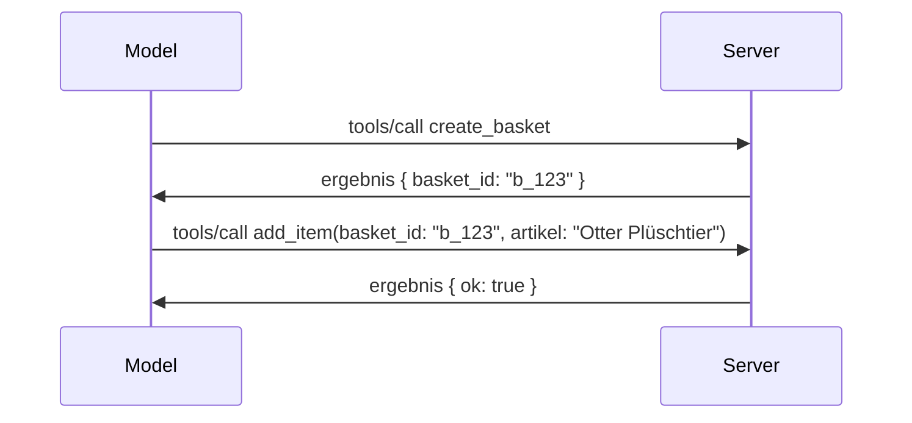

# Was sich bei MCP ändert: Die Release Candidate Version vom 28.07.2026

> **Status:** Release Candidate. Die Spezifikation `2026-07-28` ist zum Zeitpunkt der Erstellung dieses Dokuments noch nicht final. Sie wurde am 21. Mai 2026 angekündigt und ist für den 28. Juli 2026 geplant. Alles in dieser Lektion beschreibt den Release Candidate; vor der Entwicklung gegen diese Version prüfen Sie bitte die [Entwurfsspezifikation](https://modelcontextprotocol.io/specification/draft) und deren [Änderungsprotokoll](https://modelcontextprotocol.io/specification/draft/changelog) für den aktuellen Status. Der Rest dieses Curriculums basiert auf dem aktuellen stabilen Release, **MCP Spezifikation 2025-11-25**, und wird aktualisiert, sobald `2026-07-28` veröffentlicht wird.

## Überblick

`2026-07-28` ist die größte Überarbeitung von MCP seit dessen Einführung. Sechs Specification Enhancement Proposals (SEPs) entfernen Protokoll-Ebene Sitzungen und machen MCP auf der Transportschicht zustandslos, Erweiterungen werden zu einem erstklassigen, versionierten Mechanismus, und mehrere Features, die Sie bereits in diesem Curriculum kennengelernt haben (Roots, Sampling, Logging), sind im Rahmen einer neuen Lebenszyklusrichtlinie als veraltet markiert. Diese Lektion fasst zusammen, was sich ändert, warum das wichtig ist und was es für den Code bedeutet, den Sie bereits gegen `2025-11-25` geschrieben haben.

Quelle: [The 2026-07-28 MCP Specification Release Candidate](https://blog.modelcontextprotocol.io/posts/2026-07-28-release-candidate/) (Model Context Protocol Blog, David Soria Parra und Den Delimarsky).

## Lernziele

Am Ende dieser Lektion werden Sie in der Lage sein:

- Zu erklären, warum MCP zu einem zustandslosen Protokollkern übergeht und welches Problem dies für horizontal skalierte Deployments löst.
- Zu beschreiben, wie das `initialize`/`initialized` Handshake und der Header `Mcp-Session-Id` ersetzt werden.
- Die neuen Header `Mcp-Method` und `Mcp-Name` sowie die Cache-Metadaten `ttlMs`/`cacheScope` zu identifizieren.
- Das Extensions-Framework und die zwei mit dieser Version ausgelieferten Erweiterungen zu erkennen: MCP Apps und Tasks.
- Die sechs Autorisierungs-SEPs aufzulisten, die die Ausrichtung auf OAuth 2.0 / OIDC verstärken.
- Zu erkennen, welche Kernfeatures (Roots, Sampling, Logging) jetzt veraltet sind und was das in der Praxis bedeutet.
- Die Änderung zum vollständigen JSON Schema 2020-12 für Tool-`inputSchema`/`outputSchema` zu erklären.

## Ein zustandsloses Protokoll

Die Überschrift: MCP wird im Protokoll-Layer zustandslos.

### Vorher (2025-11-25): Sitzungen binden an eine Server-Instanz

Das Aufrufen eines Tools über Streamable HTTP beginnt mit einem `initialize`-Handshake. Der Server antwortet mit einem `Mcp-Session-Id`-Header, den alle nachfolgenden Anfragen mitführen müssen:

```http
POST /mcp HTTP/1.1
Mcp-Session-Id: 1868a90c-3a3f-4f5b
Content-Type: application/json

{"jsonrpc":"2.0","id":2,"method":"tools/call",
 "params":{"name":"search","arguments":{"q":"otters"}}}
```

Da die Sitzung an die jeweilige Server-Instanz gebunden ist, die sie ausgestellt hat, benötigen horizontal skalierte Deployments **sticky routing** am Load Balancer und einen **gemeinsamen Sitzungsspeicher** über alle Instanzen hinweg.

### Danach (2026-07-28): Jede Anfrage ist eigenständig

```http
POST /mcp HTTP/1.1
MCP-Protocol-Version: 2026-07-28
Mcp-Method: tools/call
Mcp-Name: search
Content-Type: application/json

{"jsonrpc":"2.0","id":1,"method":"tools/call",
 "params":{"name":"search","arguments":{"q":"otters"},
           "_meta":{"io.modelcontextprotocol/clientInfo":{"name":"my-app","version":"1.0"}}}}
```

Jede Server-Instanz kann diese Anfrage bearbeiten. Wichtige Änderungen:

- **Das `initialize`/`initialized` Handshake wird entfernt** ([SEP-2575](https://github.com/modelcontextprotocol/modelcontextprotocol/pull/2575)). Protokollversion, Client-Informationen und Client-Fähigkeiten werden in `_meta` bei jeder Anfrage übergeben. Eine neue Methode `server/discover` ermöglicht es dem Client, Server-Fähigkeiten vorab abzurufen, wenn er sie benötigt.
- **Der `Mcp-Session-Id`-Header und die Sitzungen auf Protokollebene werden entfernt** ([SEP-2567](https://github.com/modelcontextprotocol/modelcontextprotocol/pull/2567)). Sticky Routing und gemeinsame Sitzungsspeicher sind auf Protokollebene nicht mehr erforderlich.

### Zustandsloses Protokoll, zustandsbehaftete Anwendungen

Das Entfernen der Sitzung auf Protokollebene bedeutet nicht, dass Ihr Server nicht zustandsbehaftet sein kann. Das empfohlene Muster ist dasselbe, das HTTP APIs schon immer verwendet haben: Aus einem Tool-Aufruf eine explizite Kennung (z.B. eine `basket_id`, eine `browser_id`) ausstellen und dieses Handle bei späteren Aufrufen als gewöhnliches Argument zurückgeben.



Das macht den Zustand für das Modell sichtbar und nachvollziehbar, anstatt ihn in Transport-Metadaten zu verstecken, und ermöglicht, dass jede Server-Instanz jeden Aufruf bearbeiten kann.

### Server-zu-Client-Anfragen, umstrukturiert

Ein zustandsloses Protokoll benötigt dennoch eine Möglichkeit, wie der Server während eines Aufrufs den Client um etwas bitten kann (z.B. eine Prompt zur Bedarfsermittlung):

- **Server-initiierte Anfragen dürfen nur während der aktiven Bearbeitung einer Client-Anfrage gesendet werden** ([SEP-2260](https://github.com/modelcontextprotocol/modelcontextprotocol/pull/2260)) — früher eine Empfehlung, jetzt verpflichtend. Ein Nutzer wird niemals ohne Anlass angesprochen.
- **Multi Round-Trip Requests** ([SEP-2322](https://github.com/modelcontextprotocol/modelcontextprotocol/pull/2322)) ersetzen das Offenhalten eines SSE-Streams. Stattdessen gibt der Server ein `InputRequiredResult` zurück:

  ```json
  {
    "resultType": "inputRequired",
    "inputRequests": {
      "confirm": {
        "type": "elicitation",
        "message": "Delete 3 files?",
        "schema": { "type": "boolean" }
      }
    },
    "requestState": "eyJzdGVwIjoxLCJmaWxlcyI6WyJhIiwiYiIsImMiXX0="
  }
  ```

  Der Client sammelt die Antworten und sendet den ursprünglichen Aufruf mit `inputResponses` plus dem übermittelten `requestState` erneut. Jede Server-Instanz kann den Retry abhandeln, weil alle notwendigen Informationen im Payload enthalten sind.

### Routbar, zwischenspeicherbar, nachverfolgbar

Drei kleinere Änderungen erleichtern das Betrieb von zustandslosem Traffic:

- **`Mcp-Method` und `Mcp-Name` Header sind bei Streamable HTTP erforderlich** ([SEP-2243](https://github.com/modelcontextprotocol/modelcontextprotocol/pull/2243)), damit Load Balancer, Gateways und Rate Limiter die Operation anhand der Header routen können, ohne den JSON-Inhalt zu inspizieren. Der Server lehnt Anfragen ab, bei denen Header und Body nicht übereinstimmen.
- **`tools/list` und Ressourcen-Leseergebnisse enthalten `ttlMs` und `cacheScope`** ([SEP-2549](https://github.com/modelcontextprotocol/modelcontextprotocol/pull/2549)), angelehnt an HTTP `Cache-Control`. Clients wissen, wie lange ein List-Ergebnis frisch ist und ob es sicher über Nutzer hinweg geteilt werden kann, ohne einen lang laufenden SSE-Stream nutzen zu müssen, um Änderungen zu erfahren.
- **W3C Trace Context Propagation in `_meta` ist dokumentiert** ([SEP-414](https://github.com/modelcontextprotocol/modelcontextprotocol/pull/414)), wodurch die Schlüssel `traceparent`, `tracestate` und `baggage` festgelegt werden, sodass ein verteiltes Tracing eine Anfrage über das Client SDK, den MCP Server und nachgeschaltete Systeme in einem [OpenTelemetry](https://opentelemetry.io/)-kompatiblen Backend verfolgen kann.

## Erweiterungen werden erstklassig

Erweiterungen existierten informell in `2025-11-25`. [SEP-2133](https://github.com/modelcontextprotocol/modelcontextprotocol/pull/2133) formalisieren sie:

- Erweiterungen werden durch Reverse-DNS-IDs identifiziert.
- Sie werden durch eine `extensions`-Map in Client- und Server-Fähigkeiten ausgehandelt.
- Sie leben in eigenen `ext-*` Repositorien mit delegierten Maintainer:innen und versionieren unabhängig vom Kern-Protokoll.
- Ein neuer Extensions Track im SEP-Prozess gibt ihnen einen Weg von experimentell zu offiziell.

Dieses Release liefert zwei offizielle Erweiterungen aus.

### MCP Apps: servergerenderte Benutzeroberflächen

[MCP Apps](https://blog.modelcontextprotocol.io/posts/2026-01-26-mcp-apps/) ([SEP-1865](https://github.com/modelcontextprotocol/modelcontextprotocol/pull/1865)) erlauben es Servern, interaktive HTML-Oberflächen auszuliefern, die Hosts in einem sandboxed iframe anzeigen. Tools deklarieren ihre UI-Vorlagen im Vorfeld, damit Hosts sie vorab laden, cachen und sicherheitstechnisch überprüfen können, bevor sie ausgeführt werden. Die Grundlagen dazu haben Sie bereits in [Lektion 15: MCP Apps](../03-GettingStarted/15-mcp-apps/README.md) behandelt — unter dem Extensions-Framework sind MCP Apps jetzt formell eine Erweiterung statt eines experimentellen Kernfeatures.

### Tasks werden zur Erweiterung

Tasks wurden im `2025-11-25` Release als experimentelles Kernfeature geliefert. Durch Feedback aus der Produktion wurde ein Redesign nötig, das den richtigen Platz als Erweiterung sieht: Die [Tasks Erweiterung](https://github.com/modelcontextprotocol/modelcontextprotocol/pull/2663) formt den Lebenszyklus um das zustandslose Modell — ein Server kann `tools/call` mit einem Task-Handle beantworten, und der Client steuert mit `tasks/get`, `tasks/update` und `tasks/cancel` den Fortschritt. Die Erstellung von Tasks ist servergesteuert: Der Client signalisiert die Erweiterung, und der Server entscheidet, wann ein Aufruf als Task ausgeführt wird. `tasks/list` wird komplett entfernt, da es ohne Sitzungen nicht sicher eingegrenzt werden kann.

> **Migrationshinweis:** Wenn Sie das experimentelle `2025-11-25` Tasks API implementiert haben, müssen Sie auf den neuen Erweiterungslebenszyklus migrieren — die Kompatibilität nach hinten ist nicht gegeben.

## Sicherheit bei der Autorisierung wird verstärkt

Sechs SEPs stärken die [Autorisierungsspezifikation](https://modelcontextprotocol.io/specification/draft/basic/authorization), um eine bessere Übereinstimmung mit realen OAuth 2.0 / OpenID Connect Deployments zu erreichen:

| SEP | Änderung |
|---|---|
| [SEP-2468](https://github.com/modelcontextprotocol/modelcontextprotocol/pull/2468) | Clients müssen den Parameter `iss` auf Autorisierungsantworten gemäß [RFC 9207](https://www.rfc-editor.org/rfc/rfc9207) validieren, um so sogenannte Mix-up-Angriffe zu verhindern, die bei MCPs Muster „ein Client, viele Server“ häufig vorkommen. Eine zukünftige Version wird die Ablehnung von Antworten ohne `iss` erzwingen. |
| [SEP-837](https://github.com/modelcontextprotocol/modelcontextprotocol/pull/837) | Clients geben bei der Dynamischen Client-Registrierung ihren OpenID Connect `application_type` an, um zu verhindern, dass Autorisierungsserver einen Desktop/CLI Client standardmäßig als `"web"` behandeln und seine localhost Redirect-URI ablehnen. |
| [SEP-2352](https://github.com/modelcontextprotocol/modelcontextprotocol/pull/2352) | Clients binden registrierte Anmeldedaten an den `issuer` des ausstellenden Autorisierungsservers und registrieren sie neu, wenn eine Ressource zwischen Autorisierungsservern migriert wird. |
| [SEP-2207](https://github.com/modelcontextprotocol/modelcontextprotocol/pull/2207) | Dokumentiert, wie man Refresh Tokens von OpenID Connect-ähnlichen Autorisierungsservern anfordert. |
| [SEP-2350](https://github.com/modelcontextprotocol/modelcontextprotocol/pull/2350) | Klärt die Akkumulation von Scopes bei Step-up Autorisierung. |
| [SEP-2351](https://github.com/modelcontextprotocol/modelcontextprotocol/pull/2351) | Klärt das Suffix bei `.well-known` Discovery. |

Wenn Sie heute einen Autorisierungsserver für MCP bauen, beginnen Sie jetzt damit, das `iss` auf Autorisierungsantworten zu übermitteln — siehe [02-Security](../02-Security/README.md) für die aktuelle Autorisierungsanleitung, auf der das aufbaut.

## Roots, Sampling und Logging sind veraltet

Im Rahmen der neuen [Feature-Lebenszyklusrichtlinie](https://github.com/modelcontextprotocol/modelcontextprotocol/pull/2577) ([SEP-2577](https://github.com/modelcontextprotocol/modelcontextprotocol/pull/2577)) wechseln drei Kernclient-Primitiven, die Sie in [Core Concepts](./README.md#roots) kennengelernt haben, in den Status **Deprecated** (veraltet):

| Feature | Empfohlenes Ersatzmuster |
|---|---|
| Roots | Tool-Parameter, Ressourcen-URIs oder Server-Konfiguration |
| Sampling | Direkte Integration mit LLM Anbieter APIs |
| Logging | `stderr` für stdio Transports; OpenTelemetry für strukturierte Beobachtbarkeit |

Dies sind **Annotation-only Veraltbarkeiten**: Die Methoden, Typen und Capability Flags funktionieren in dieser Version und allen Spezifikationsversionen, die innerhalb eines Jahres danach veröffentlicht werden, weiterhin. Das vollständige Entfernen erfordert ein separates SEP gemäß der Lebenszyklusrichtlinie — es bricht also heute nichts an Ihren bestehenden [Sampling](../03-GettingStarted/14-sampling/README.md) Beispielen, aber neue Server sollten die oben genannten Ersatzmuster bevorzugen.

## Vollständiges JSON Schema 2020-12 für Tools

Die Tool-`inputSchema` und `outputSchema` werden auf das vollständige [JSON Schema 2020-12](https://json-schema.org/draft/2020-12) gehoben ([SEP-2106](https://github.com/modelcontextprotocol/modelcontextprotocol/pull/2106)):

- Input-Schemata behalten die Root-Einschränkung `type: "object"`, erlauben jetzt aber Komposition (`oneOf`, `anyOf`, `allOf`), bedingte Logik und Referenzen (`$ref`, `$defs`).
- Output-Schemata sind uneingeschränkt, und `structuredContent` kann jetzt jeden JSON-Wert enthalten, nicht mehr nur Objekte.
- Implementierungen dürfen externe `$ref` URIs nicht automatisch auflösen und sollten Schema-Tiefe und Validierungszeit begrenzen (um eine Denial-of-Service-Situation bei serverseitiger Validierung zu vermeiden).

Separat ändert sich der Fehlercode für eine fehlende Ressource vom MCP-spezifischen `-32002` zum JSON-RPC-Standard `-32602` (Invalid Params) ([SEP-2164](https://github.com/modelcontextprotocol/modelcontextprotocol/pull/2164)). Wenn Ihr Client den genauen Wert `-32002` abfragt, müssen Sie ihn aktualisieren.

## Wie sich das Protokoll weiterentwickelt

Dieses Release enthält Breaking Changes, die die MCP-Maintainer nicht als zukünftigen Standard ansehen. Drei Governance-SEPs zielen darauf ab, Wiederholungen zu vermeiden:

- Die **Feature-Lebenszyklusrichtlinie** gibt jedem Feature einen Pfad von Aktiv → Veraltet → Entfernt mit mindestens zwölf Monaten zwischen Veralterung und frühestmöglicher Entfernung.
- Das **Extensions-Framework** erlaubt neue Fähigkeiten als opt-in Erweiterungen auszuliefern und dort zu stabilisieren, bevor sie (falls überhaupt) in die Kern-Spezifikation wandern.
- Ein Standards Track SEP kann nicht mehr den Final-Status erreichen, bis ein passendes Szenario in der [Konformitäts-Suite](https://github.com/modelcontextprotocol/conformance) landet ([SEP-2484](https://github.com/modelcontextprotocol/modelcontextprotocol/pull/2484)) — dieselbe Suite, mit der das [SDK-Tier-System](https://github.com/modelcontextprotocol/modelcontextprotocol/pull/1777) offizielle SDKs bewertet.

## Release-Zeitplan und Validierung

- Der Release Candidate wurde am 21. Mai 2026 festgelegt.
- Die endgültige Spezifikation ist für den 28. Juli 2026 geplant.
- Das zehnwöchige Fenster zwischen den beiden Terminen ermöglicht es SDK-Maintainern und Client-Implementierern, die Änderungen gegen reale Workloads zu validieren; Tier-1-SDKs sollen in diesem Zeitfenster unter dem [SDK-Tier-System](https://modelcontextprotocol.io/docs/sdk) Support liefern.
- Verfolge die vollständige Änderungsliste in der [Entwurfsspezifikation](https://modelcontextprotocol.io/specification/draft) und deren [Changelog](https://modelcontextprotocol.io/specification/draft/changelog).

## Was das für diesen Kurs bedeutet

Alles, was Sie bisher in diesem Kurs gelernt haben, zielt auf **2025-11-25** ab, was die derzeit aktuelle stabile Spezifikation bleibt, bis `2026-07-28` veröffentlicht wird. Konkret:

- **Sessions und der `initialize`-Handshake** (behandelt in [Core Concepts](./README.md) und [Lesson 6: HTTP Streaming](../03-GettingStarted/06-http-streaming/README.md)) funktionieren weiterhin wie heute dokumentiert, aber erwarten Sie, dass sie durch das oben beschriebene zustandslose Anfragemodell ersetzt werden, sobald Sie auf SDKs kompatibel mit `2026-07-28` upgraden.
- **Sampling und Roots** (ebenfalls in [Core Concepts](./README.md) behandelt) bleiben voll funktionsfähig, sind jedoch veraltet — neue Designs sollten die oben gelisteten Ersatzmuster bevorzugen.
- **Die experimentelle Tasks-Funktion**, falls Sie diese genutzt haben, muss auf den neuen Lebenszyklus der Tasks-Erweiterung migriert werden.
- **MCP Apps** ([Lesson 15](../03-GettingStarted/15-mcp-apps/README.md)) bleiben in der Praxis unberührt; sie werden lediglich unter den formalisierten Extensions-Rahmen verschoben.

## Zusätzliche Ressourcen

- [Der MCP-Spezifikations-Release Candidate vom 28.07.2026 (Blogpost)](https://blog.modelcontextprotocol.io/posts/2026-07-28-release-candidate/)
- [Die Zukunft der MCP-Transporte](https://blog.modelcontextprotocol.io/posts/2025-12-19-mcp-transport-future/)
- [MCP-Entwurfsspezifikation](https://modelcontextprotocol.io/specification/draft)
- [MCP-Entwurfschangelog](https://modelcontextprotocol.io/specification/draft/changelog)
- [SEP-Richtlinien](https://modelcontextprotocol.io/community/sep-guidelines)
- [MCP SDK-Tier-System](https://modelcontextprotocol.io/docs/sdk)

## Nächste Schritte

Kehren Sie zurück zu [Core Concepts](./README.md) oder fahren Sie fort mit [Security](../02-Security/README.md), um zu sehen, wie die heutige `2025-11-25`-Anleitung auf das Kommende abgebildet wird.

---

<!-- CO-OP TRANSLATOR DISCLAIMER START -->
**Haftungsausschluss**:
Dieses Dokument wurde mit dem KI-Übersetzungsdienst [Co-op Translator](https://github.com/Azure/co-op-translator) übersetzt. Obwohl wir uns um Genauigkeit bemühen, beachten Sie bitte, dass automatisierte Übersetzungen Fehler oder Ungenauigkeiten enthalten können. Das Originaldokument in seiner Ursprungssprache gilt als maßgebliche Quelle. Bei kritischen Informationen wird eine professionelle menschliche Übersetzung empfohlen. Wir übernehmen keine Haftung für Missverständnisse oder Fehlinterpretationen, die aus der Verwendung dieser Übersetzung entstehen.
<!-- CO-OP TRANSLATOR DISCLAIMER END -->