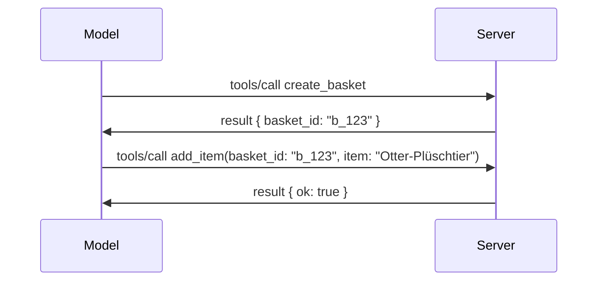

# Was sich im MCP geändert hat: Die Spezifikation vom 28.07.2026

> **Status:** Final. MCP-Spezifikation `2026-07-28` wurde am 28. Juli 2026 veröffentlicht
> und ist die aktuelle Protokollrevision. Diese Lektion beschreibt die endgültige
> Spezifikation. Einige Curriculum-Beispiele sind weiterhin ausdrücklich auf
> `2025-11-25` versioniert, da ihre SDKs die neue zustandslose API noch nicht übernommen haben;
> behandeln Sie diese Beispiele als Anleitungen zur Kompatibilität mit Altsystemen.

## Überblick

`2026-07-28` ist die umfassendste Überarbeitung von MCP seit seiner Einführung. Sechs
Specification Enhancement Proposals (SEPs) entfernen Protokoll-Session-Ebenen und
machen MCP am Transportschicht stateless, Erweiterungen werden zu einem erstklassigen,
versionierten Mechanismus, und mehrere zuvor im Curriculum behandelte Funktionen
(Roots, Sampling, Logging) werden unter einer neuen Lebenszyklusrichtlinie abgekündigt. Diese
Lektion fasst zusammen, was sich geändert hat, warum es wichtig ist und was es für Code
bedeutet, der gegen `2025-11-25` geschrieben wurde.

Quelle: [The 2026-07-28 MCP Specification Release Candidate](https://blog.modelcontextprotocol.io/posts/2026-07-28-release-candidate/) (Model Context Protocol Blog, David Soria Parra und Den Delimarsky).

## Lernziele

Am Ende dieser Lektion werden Sie in der Lage sein:

- Erklären, warum MCP zu einem zustandslosen Protokollkern wechselt und welches Problem es für horizontal skalierte Deployments löst.
- Beschreiben, wie der `initialize`/`initialized`-Handshake und der `Mcp-Session-Id` Header ersetzt werden.
- Die neuen Header `Mcp-Method` und `Mcp-Name` sowie die Cache-Metadaten `ttlMs`/`cacheScope` identifizieren.
- Das Erweiterungsframework und die beiden mit dieser Version ausgelieferten Erweiterungen: MCP Apps und Tasks erkennen.
- Die Autorisierungshärtung und die Abkündigung der Dynamischen Client-Registrierung zusammenfassen.
  an.
- Erkennen, welche Kernfunktionen (Roots, Sampling, Logging) jetzt abgekündigt sind und was das in der Praxis bedeutet.
- Die Umstellung auf das vollständige JSON Schema 2020-12 für Tool `inputSchema`/`outputSchema` erklären.

## Ein zustandsloses Protokoll

Die Hauptänderung: MCP wird auf Protokollebene zustandslos.

### Davor (2025-11-25): Sessions binden Sie an eine Serverinstanz

Ein Tool-Aufruf über Streamable HTTP beginnt mit einem `initialize`-Handshake. Der Server antwortet mit einem `Mcp-Session-Id`-Header, den jeder nachfolgende Request tragen muss:

```http
POST /mcp HTTP/1.1
Mcp-Session-Id: 1868a90c-3a3f-4f5b
Content-Type: application/json

{"jsonrpc":"2.0","id":2,"method":"tools/call",
 "params":{"name":"search","arguments":{"q":"otters"}}}
```

Weil die Session an die jeweilige Serverinstanz gebunden ist, die sie ausgestellt hat, benötigen horizontal skalierte Deployments **Sticky Routing** am Load Balancer und einen **gemeinsamen Session-Speicher** über die Instanzen hinweg.

### Danach (2026-07-28): Jeder Request ist selbstenthaltend

```http
POST /mcp HTTP/1.1
MCP-Protocol-Version: 2026-07-28
Mcp-Method: tools/call
Mcp-Name: search
Content-Type: application/json

{"jsonrpc":"2.0","id":1,"method":"tools/call",
 "params":{"name":"search","arguments":{"q":"otters"},
           "_meta":{"io.modelcontextprotocol/protocolVersion":"2026-07-28",
                    "io.modelcontextprotocol/clientInfo":{"name":"my-app","version":"1.0"},
                    "io.modelcontextprotocol/clientCapabilities":{}}}}
```

Jede Serverinstanz kann diese Anfrage bearbeiten. Zentrale Änderungen:

- **Der `initialize`/`initialized`-Handshake wird entfernt** ([SEP-2575](https://github.com/modelcontextprotocol/modelcontextprotocol/pull/2575)). Protokollversion, Client-Info und Client-Fähigkeiten wandern in `_meta` bei jedem Request. Eine neue `server/discover`-Methode erlaubt es einem Client, Serverfähigkeiten im Voraus abzurufen, wenn er sie benötigt.
- **Der `Mcp-Session-Id`-Header und die Protokoll-Level-Session werden entfernt** ([SEP-2567](https://github.com/modelcontextprotocol/modelcontextprotocol/pull/2567)). Sticky Routing und gemeinsame Session-Speicher sind auf Protokollebene nicht mehr erforderlich.

### Zustandsloses Protokoll, zustandsbehaftete Anwendungen

Das Entfernen der Protokoll-Session bedeutet nicht, dass Ihr Server nicht zustandsbehaftet sein kann. Das empfohlene Muster ist dasselbe, das HTTP-APIs schon immer genutzt haben: Man erzeugt einen expliziten Handle (z.B. `basket_id`, `browser_id`) aus einem Tool-Aufruf und lässt das Modell diesen Handle bei späteren Aufrufen als gewöhnliches Argument zurückgeben.



Dies macht den Zustand für das Modell sichtbar und vernünftig, anstatt ihn in Transport-Metadaten zu verstecken, und es erlaubt jeder Serverinstanz, jeden Aufruf zu bearbeiten.

### Server-zu-Client-Anfragen, umstrukturiert

Ein zustandsloses Protokoll braucht dennoch eine Möglichkeit, wie ein Server den Client während eines Aufrufs etwas fragen kann (z.B. eine Abfrageaufforderung):

- **Server-initiierten Anfragen dürfen nur gestellt werden, solange der Server aktiv eine Client-Anfrage verarbeitet** ([SEP-2260](https://github.com/modelcontextprotocol/modelcontextprotocol/pull/2260)) — zuvor eine Empfehlung, jetzt verpflichtend. Ein Nutzer wird niemals aus heiterem Himmel zur Eingabe aufgefordert.
- **Mehrfache Round-Trip-Anfragen** ([SEP-2322](https://github.com/modelcontextprotocol/modelcontextprotocol/pull/2322)) ersetzen das Offenhalten eines SSE-Streams. Stattdessen gibt der Server ein `InputRequiredResult` zurück:

  ```json
  {
    "resultType": "input_required",
    "inputRequests": {
      "confirm": {
        "type": "elicitation",
        "message": "Delete 3 files?",
        "schema": { "type": "boolean" }
      }
    },
    "requestState": "eyJzdGVwIjoxLCJmaWxlcyI6WyJhIiwiYiIsImMiXX0="
  }
  ```

  Der Client sammelt die Antworten und stellt den ursprünglichen Aufruf mit `inputResponses` plus dem zurückgespiegelten `requestState` erneut. Jede Serverinstanz kann den Wiederholungsversuch bearbeiten, da alles Nötige im Payload enthalten ist.

### Routingfähig, cachebar, nachvollziehbar

Drei kleinere Änderungen erleichtern den Betrieb zustandsloser Kommunikation:

- **`Mcp-Method` und `Mcp-Name` Header sind für Streamable HTTP erforderlich** ([SEP-2243](https://github.com/modelcontextprotocol/modelcontextprotocol/pull/2243)), sodass Load Balancer, Gateways und Rate Limiter Anfragen anhand der Operation routen können, ohne den JSON-Body zu prüfen. Server lehnen Anfragen ab, bei denen Header und Body nicht übereinstimmen.
- **`tools/list` und Resource-Read-Ergebnisse tragen `ttlMs` und `cacheScope`** ([SEP-2549](https://github.com/modelcontextprotocol/modelcontextprotocol/pull/2549)), angelehnt an HTTP `Cache-Control`. Clients wissen, wie lange ein List-Ergebnis frisch ist und ob es sicher ist, es nutzerübergreifend zu teilen, ohne einen langlaufenden SSE-Stream für Änderungsbenachrichtigungen zu benötigen.
- **Die W3C Trace Context-Propagation in `_meta` ist dokumentiert** ([SEP-414](https://github.com/modelcontextprotocol/modelcontextprotocol/pull/414)), mit fixierten Schlüsselbezeichnungen für `traceparent`, `tracestate` und `baggage`, damit eine verteilte Spur (Trace) einen Aufruf über Client-SDK, MCP-Server und nachgelagerte Systeme in einem [OpenTelemetry](https://opentelemetry.io/)-kompatiblen Backend verfolgen kann.

## Erweiterungen werden erstklassig

Erweiterungen existierten informell in `2025-11-25`. [SEP-2133](https://github.com/modelcontextprotocol/modelcontextprotocol/pull/2133) formalisiert sie:

- Erweiterungen werden durch Reverse-DNS-IDs identifiziert.
- Sie werden über eine `extensions`-Map in Client- und Serverfähigkeiten verhandelt.
- Sie leben in eigenen `ext-*`-Repositories mit delegierten Maintainers und versionieren unabhängig vom Kern-Spezifikation.
- Ein neuer Extensions-Track im SEP-Prozess gibt ihnen einen Weg vom Experimentellen zum Offiziellen.

Diese Version enthält zwei offizielle Erweiterungen.

### MCP Apps: servergerenderte Benutzeroberflächen

[MCP Apps](https://blog.modelcontextprotocol.io/posts/2026-01-26-mcp-apps/) ([SEP-1865](https://github.com/modelcontextprotocol/modelcontextprotocol/pull/1865)) ermöglichen es Servern, interaktive HTML-Oberflächen auszuliefern, die Hosts in einem sandboxed iframe rendern. Tools deklarieren ihre UI-Vorlagen vorab, sodass Hosts diese vorab laden, cachen und sicherheitsüberprüfen können, bevor sie ausgeführt werden. Die Grundlagen dieses Themas haben Sie bereits in [Lesson 15: MCP Apps](../03-GettingStarted/15-mcp-apps/README.md) behandelt — unter dem Erweiterungsframework ist MCP Apps jetzt offiziell eine Erweiterung und keine experimentelle Kernfunktion mehr.

### Tasks werden zu einer Erweiterung

Tasks wurden als experimentelle Kernfunktion in `2025-11-25` ausgeliefert. Der produktive Einsatz zeigte genug Umgestaltungsbedarf, sodass der richtige Platz jetzt eine Erweiterung ist: Die [Tasks-Erweiterung](https://github.com/modelcontextprotocol/modelcontextprotocol/pull/2663) formt den Lebenszyklus um das zustandslose Modell — ein Server kann `tools/call` mit einem Task-Handle beantworten, und der Client steuert es mit `tasks/get`, `tasks/update` und `tasks/cancel` voran. Task-Erstellung ist servergesteuert: Der Client gibt die Erweiterung an, und der Server entscheidet, wann ein Aufruf als Task ausgeführt wird. `tasks/list` wird komplett entfernt, da es ohne Sessions nicht sicher einschränkbar ist.

> **Migrationshinweis:** Wenn Sie die experimentelle `2025-11-25`-Tasks-API implementiert haben, müssen Sie auf den neuen Erweiterungslebenszyklus migrieren — dieser ist nicht abwärtskompatibel.

## Autorisierungshärtung

Mehrere SEPs härten die
[Autorisierungsspezifikation](https://modelcontextprotocol.io/specification/2026-07-28/basic/authorization)
, um sie näher an reale OAuth 2.0 / OpenID Connect Deployments anzupassen:

| SEP | Änderung |
|---|---|
| [SEP-2468](https://github.com/modelcontextprotocol/modelcontextprotocol/pull/2468) | Clients müssen den `iss`-Parameter in Autorisierungsantworten gemäß [RFC 9207](https://www.rfc-editor.org/rfc/rfc9207) validieren, um Mix-up-Attacken zu mindern, die im MCP-Einzel-Client-viele-Server-Muster üblich sind. Eine künftige Version wird Antworten ohne `iss` ablehnen müssen. |
| [SEP-837](https://github.com/modelcontextprotocol/modelcontextprotocol/pull/837) | Kompatibilitäts-only Dynamic Client Registration-Clients deklarieren ihren OpenID Connect `application_type`, um falsche `"web"`-Standardwerte für Desktop- und CLI-Clients zu vermeiden. |
| [SEP-2352](https://github.com/modelcontextprotocol/modelcontextprotocol/pull/2352) | Kompatibilitäts-only registrierte Zugangsdaten sind an den ausstellenden Autorisierungsserver-`issuer` gebunden; Clients müssen sich neu registrieren, wenn eine Ressource migriert. |
| [SEP-2207](https://github.com/modelcontextprotocol/modelcontextprotocol/pull/2207) | Dokumentiert, wie Refresh Tokens von OpenID Connect-typischen Autorisierungsservern angefordert werden. |
| [SEP-2350](https://github.com/modelcontextprotocol/modelcontextprotocol/pull/2350) | Klärt die Akkumulation von Scopes bei Step-up-Autorisierung. |
| [SEP-2351](https://github.com/modelcontextprotocol/modelcontextprotocol/pull/2351) | Klärt das `.well-known`-Disco-Suffix. |

Wenn Sie einen Autorisierungsserver für MCP bauen, liefern Sie `iss` in
Autorisierungsantworten und halten Sie sich an die finale Autorisierungsspezifikation. Siehe
[02-Security](../02-Security/README.md) für Implementierungshinweise.

Die dynamische Client-Registrierung bleibt aus Kompatibilitätsgründen verfügbar, ist aber außerdem
in `2026-07-28` abgekündigt. Neue Implementierungen sollten Client ID Metadata
Documents nutzen.

## Abgekündigte Funktionen

Unter der neuen
[Feature-Lebenszyklusrichtlinie](https://github.com/modelcontextprotocol/modelcontextprotocol/pull/2577),
sind Roots, Sampling, Logging und Dynamische Client-Registrierung **Abgekündigt**:

| Funktion | Empfohlenes Ersatzverfahren |
|---|---|
| Roots | Tool-Parameter, Ressourcen-URIs oder Serverkonfiguration |
| Sampling | Direkte Integration mit LLM-Provider-APIs |
| Logging | `stderr` für stdio-Transporte; OpenTelemetry für strukturierte Observability |
| Dynamische Client-Registrierung | Client ID Metadata Documents |

Diese Funktionen bleiben in `2026-07-28` aus Kompatibilitätsgründen enthalten. Sie sind zur
Entfernung in der ersten Spezifikationsrevision nach dem 28. Juli 2027 vorgesehen;
ein tatsächliches Entfernen kann später erfolgen. Neue Implementierungen sollten die oben angegebenen
Ersatzmuster verwenden.

## Vollständiges JSON Schema 2020-12 für Tools

Tool `inputSchema` und `outputSchema` sind auf volles [JSON Schema 2020-12](https://json-schema.org/draft/2020-12) angehoben ([SEP-2106](https://github.com/modelcontextprotocol/modelcontextprotocol/pull/2106)):

- Input-Schemas behalten die `type: "object"`-Wurzelbedingung, erlauben nun aber Komposition (`oneOf`, `anyOf`, `allOf`), Bedingungen und Referenzen (`$ref`, `$defs`).
- Output-Schemas sind uneingeschränkt, und `structuredContent` kann jetzt jeden JSON-Wert anstatt nur ein Objekt sein.
- Implementierungen dürfen externe `$ref`-URIs nicht automatisch auflösen und sollten Schema-Tiefe und Validierungszeit begrenzen (eine DoS-Erwägung, falls Sie serverseitig validieren).

Separat ändert sich der Fehlercode für eine fehlende Ressource vom MCP-eigenen `-32002` auf den JSON-RPC-Standard `-32602` (Invalid Params) ([SEP-2164](https://github.com/modelcontextprotocol/modelcontextprotocol/pull/2164)). Wenn Ihr Client literal auf `-32002` prüft, müssen Sie ihn aktualisieren.

## Wie sich das Protokoll weiterentwickelt

Diese Version enthält Breaking Changes, die MCP-Maintainer nicht als zukünftigen Standard ansehen. Drei Governance-SEPs sollen eine Wiederholung verhindern:

- Die **Feature-Lebenszyklusrichtlinie** gibt jeder Funktion einen Pfad Aktiv → Abgekündigt → Entfernt mit mindestens zwölf Monaten Abstand zwischen Abkündigung und frühestmöglicher Entfernung.
- Das **Erweiterungsframework** ermöglicht es, neue Fähigkeiten als Opt-in-Erweiterungen zu liefern und dort zu stabilisieren, bevor sie (wenn überhaupt) in die Kern-Spezifikation aufgenommen werden.
- Ein Standards-Track-SEP kann keinen Final-Status mehr erhalten, bevor ein passendes Szenario im [Konformitäts-Testpaket](https://github.com/modelcontextprotocol/conformance) landet ([SEP-2484](https://github.com/modelcontextprotocol/modelcontextprotocol/pull/2484)) — dasselbe Paket, gegen das das [SDK-Tier-System](https://github.com/modelcontextprotocol/modelcontextprotocol/pull/1777) offizielle SDKs bewertet.

## Release-Zeitplan und Validierung

- Der Release Candidate wurde am 21. Mai 2026 festgelegt.
- Die finale Spezifikation wurde am 28. Juli 2026 veröffentlicht.

- Die SDK-Unterstützung kann hinter der Spezifikation zurückbleiben. Überprüfen Sie die
  [SDK-Dokumentation](https://modelcontextprotocol.io/docs/sdk) und die SDK-
  Versionshinweise, bevor Sie ein Beispiel migrieren.
- Verfolgen Sie die finalen Änderungen in der
  [Spezifikation vom 28.07.2026](https://modelcontextprotocol.io/specification/2026-07-28/)
  und deren
  [Changelog](https://modelcontextprotocol.io/specification/2026-07-28/changelog).

## Was das für dieses Curriculum bedeutet

Das Curriculum wechselt von `2025-11-25` Beispielen zur aktuellen
`2026-07-28` Spezifikation. Konkret:

- **Sitzungen und der `initialize`-Handshake** in Beispielen, die explizit
  `2025-11-25` ansprechen, sind veraltetes Verhalten. Das `2026-07-28`-Protokoll ersetzt sie
  durch das oben beschriebene zustandslose Anfragemodell.
- **Sampling und Wurzeln** bleiben zur Kompatibilität verfügbar, sind aber veraltet.
  Neue Designs sollten die oben genannten Ersatzmuster verwenden.
- **Das experimentelle Tasks-Feature**, falls Sie es verwendet haben, muss auf den neuen Lebenszyklus der Tasks-Erweiterung migriert werden.
- **MCP Apps** ([Lektion 15](../03-GettingStarted/15-mcp-apps/README.md)) sind praktisch nicht betroffen; sie werden lediglich unter das formale Erweiterungsframework eingeordnet.

## Weitere Ressourcen

- [MCP Spezifikation 28.07.2026](https://modelcontextprotocol.io/specification/2026-07-28/)
- [Changelog 28.07.2026](https://modelcontextprotocol.io/specification/2026-07-28/changelog)
- [Der MCP Spezifikations-Release Candidate vom 28.07.2026 (historischer Blogpost)](https://blog.modelcontextprotocol.io/posts/2026-07-28-release-candidate/)
- [Die Zukunft der MCP Transports](https://blog.modelcontextprotocol.io/posts/2025-12-19-mcp-transport-future/)
- [SEP-Richtlinien](https://modelcontextprotocol.io/community/sep-guidelines)
- [MCP SDK Stufensystem](https://modelcontextprotocol.io/docs/sdk)

## Nächste Schritte

Gehen Sie zurück zu [Kernkonzepte](./README.md) oder fahren Sie fort mit
[Sicherheit](../02-Security/README.md), um die aktuellen `2026-07-28` Richtlinien anzuwenden.

---

<!-- CO-OP TRANSLATOR DISCLAIMER START -->
**Haftungsausschluss**:
Dieses Dokument wurde mit dem KI-Übersetzungsdienst [Co-op Translator](https://github.com/Azure/co-op-translator) übersetzt. Obwohl wir uns um Genauigkeit bemühen, beachten Sie bitte, dass automatisierte Übersetzungen Fehler oder Ungenauigkeiten enthalten können. Das Originaldokument in seiner Ursprungssprache gilt als maßgebliche Quelle. Bei kritischen Informationen wird eine professionelle menschliche Übersetzung empfohlen. Wir übernehmen keine Haftung für Missverständnisse oder Fehlinterpretationen, die aus der Verwendung dieser Übersetzung entstehen.
<!-- CO-OP TRANSLATOR DISCLAIMER END -->