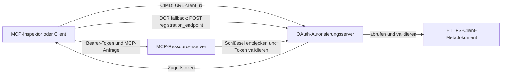

# CIMD- und DCR-Autorisierungsbeispiel

Dieses TypeScript-Beispiel vergleicht zwei Möglichkeiten, wie ein OAuth-Client eine Identität
erhalten kann, bevor er auf einen geschützten MCP-Server zugreift:

- **Client ID Metadata Documents (CIMD)** verwenden eine stabile HTTPS-URL als
  `client_id`. Dies ist der bevorzugte Mechanismus für Clients und Autorisierungs-
  server, die keine vorher bestehende Beziehung haben.
- **Dynamic Client Registration (DCR)** fordert den Autorisierungsserver auf, zur Laufzeit
  eine undurchsichtige Client-ID zu erstellen. MCP `2026-07-28` behält DCR nur aus
  Gründen der Abwärtskompatibilität bei.

Das Beispiel verwendet das stabile MCP TypeScript SDK v2 und das zustandslose
MCP `2026-07-28` Anfrage-Modell. Es funktioniert mit einem externen OAuth 2.1/OpenID
Connect-Autorisierungsserver wie Auth0. Der MCP-Server ist ein Ressourcen-
server: Er validiert Zugriffstoken, authentifiziert aber keine Benutzer und stellt
keine Token aus.

## Lernziele

Durch das Abschließen dieses Beispiels werden Sie in der Lage sein:

- Erklären, warum CIMD gegenüber DCR für neue MCP-Clients bevorzugt wird.
- Ein gültiges CIMD-Dokument für einen öffentlichen nativen Client zu veröffentlichen.
- Einen MCP-Ressourcenserver für OAuth-Discovery und JWT-Validierung zu konfigurieren.
- CIMD und DCR mit demselben MCP-Server und Autorisierungsserver zu erproben.
- Einen OAuth-Bereich in einem MCP-Tool durchzusetzen.
- Erkennen, welche Verantwortlichkeiten dem Client, dem Ressourcenserver und dem
  Autorisierungsserver zugeordnet sind.

## Architektur



Der Autorisierungsserver wählt den Registrierungsmechanismus aus und validiert ihn.
Der MCP-Server sieht nur den resultierenden verifizierten `client_id`-Anspruch. Eine HTTPS-URL
mit einem Pfad identifiziert CIMD. Eine undurchsichtige ID ist nicht ausreichend, um DCR zu beweisen, da ein
vorregistrierter Client auch eine undurchsichtige ID verwenden kann; die optionale
`DCR_CLIENT_ID_PREFIX`-Einstellung liefert einen anbieter-spezifischen Demo-Hinweis.

## Registrierungsvorrang

MCP-Clients, die jeden Mechanismus unterstützen, sollten die folgende Reihenfolge verwenden:

1. Verwenden Sie vorregistrierte Clientinformationen, wenn diese bereits verfügbar sind.
2. Verwenden Sie CIMD, wenn der Autorisierungsserver
   `client_id_metadata_document_supported: true` meldet.
3. Verwenden Sie DCR nur als Fallback, wenn der Server einen
   `registration_endpoint` meldet.
4. Fragen Sie den Nutzer nach vorregistrierten Clientinformationen, wenn keine der oben genannten Optionen
   verfügbar ist.

## Projektstruktur

```text
src/
  config.ts          Environment validation
  dcr.ts             DCR compatibility request
  mcp.ts             MCP tools and scope checks
  oauth.ts           Authorization metadata and JWT verification
  register-dcr.ts    DCR command-line helper
  registration.ts    CIMD document and mechanism classification
  server.ts          Express, OAuth discovery, and MCP endpoint
test/
  dcr.test.ts
  oauth.test.ts
  registration.test.ts
  server.test.ts
```

## Voraussetzungen

- Node.js 20.6 oder neuer. Die Skripte verwenden `--env-file` und `--import`.
- Ein OAuth 2.1/OpenID Connect Autorisierungsserver, der Folgendes unterstützt:
  - Autorisierungscodefluss mit S256 PKCE.
  - OAuth Protected Resource Metadata und Resource Indicators.
  - JWT-Zugriffstoken und einen JWKS-Endpunkt.
  - CIMD, sowie DCR, wenn Sie den Legacy-Fallback vergleichen möchten.
- MCP Inspector oder einen anderen MCP `2026-07-28` Client.
- Eine öffentliche HTTPS-URL für das CIMD-Dokument. Ein Entwicklungstunnel ist für das Labor geeignet;
  verwenden Sie in der Produktion eine stabile Domain.

## Installieren und Testen

```bash
npm install
npm run build
npm test
```

Die zwölf Tests verwenden lokale Schlüssel und simulierte HTTP-Endpunkte. Sie benötigen keinen
Autorisierungsserver-Account. Sie verifizieren:

- CIMD-Dokumentstruktur und URL-Beschränkungen.
- Ehrliche Klassifizierung von URL- und undurchsichtigen Client-IDs.
- DCR-Anfrage- und Antwortverarbeitung.
- Ablehnung unsicherer DCR-Endpunkte, die kein Loopback sind.
- JWT-Signatur, Herausgeber, Zielgruppe, Ablauf, Client-ID und Bereichsvalidierung.
- Einen MCP `2026-07-28` Aufruf zu `registration-info` im Prozess.

## Autorisierungsserver konfigurieren

Die genauen Kontrollnamen variieren je nach Anbieter. Konfigurieren Sie folgende Fähigkeiten:

1. Erstellen Sie eine API oder Ressourcenserver, dessen Bezeichner exakt Ihrer MCP-
   URL entspricht, inklusive `/mcp`, z.B. `http://127.0.0.1:3001/mcp`.
2. Verwenden Sie RS256-Zugriffstoken und beinhalten Sie einen `client_id`- oder `azp`-Anspruch.
3. Fügen Sie die Berechtigung oder den Bereich `tool:greet` hinzu.
4. Aktivieren Sie den Autorisierungscodefluss mit S256 PKCE für öffentliche native Clients.
5. Aktivieren Sie Client ID Metadata Documents.
6. Nur für den Vergleich: Aktivieren Sie Dynamic Client Registration.
7. Stellen Sie sicher, dass die Metadaten des Autorisierungsservers melden:
   - `issuer`
   - `authorization_endpoint`
   - `token_endpoint`
   - `jwks_uri`
   - `client_id_metadata_document_supported: true`
   - `registration_endpoint` wenn DCR aktiviert ist

### Beispiel Auth0

Für Auth0 aktivieren Sie die Registrierung von Client ID Metadata Documents, OIDC Dynamic
Application Registration und Resource Parameter-Kompatibilität. Erstellen Sie eine API,
deren Bezeichner die exakte MCP-URL ist, und fügen Sie die Berechtigung `tool:greet` hinzu.
Erlauben Sie dem Testnutzer und Drittanbieter-Clients, diese Berechtigung anzufordern.

Anbieter-Dashboards und die Verfügbarkeit von Funktionen ändern sich im Laufe der Zeit. Prüfen Sie die
Anbieterdokumentation, bevor Sie diese Einstellungen außerhalb dieses Labs verwenden.

## Beispiel konfigurieren

Erstellen Sie `.env` aus dem Beispiel:

```powershell
Copy-Item .env.example .env
```

In bash-kompatiblen Shells:

```bash
cp .env.example .env
```

Setzen Sie diese Werte:

```dotenv
MCP_SERVER_URL=http://127.0.0.1:3001/mcp
AUTHORIZATION_SERVER_ISSUER=https://your-tenant.example.com/
AUTHORIZATION_SERVER_METADATA_URL=https://your-tenant.example.com/.well-known/openid-configuration
CLIENT_METADATA_URL=https://your-public-host.example.com/client-metadata.json
OAUTH_REDIRECT_URIS=http://127.0.0.1:6274/oauth/callback
DCR_CLIENT_ID_PREFIX=tpc_
```

Wichtige Details:

- `AUTHORIZATION_SERVER_ISSUER` muss exakt mit `issuer` in den entdeckten
  Metadaten des Autorisierungsservers übereinstimmen, inklusive eines eventuellen abschließenden Schrägstrichs.
- `MCP_SERVER_URL` muss mit dem Publikum des Zugriffstokens übereinstimmen.
- `CLIENT_METADATA_URL` muss HTTPS verwenden, einen Nicht-Stamm-Pfad enthalten und die
  öffentliche URL sein, die die Metadatenroute bedient. Abfragezeichenfolgen und Fragmente werden
  abgelehnt, damit die Route und die `client_id` identisch bleiben.
- `OAUTH_REDIRECT_URIS` ist eine durch Kommas getrennte Allowlist. Standard ist der MCP
  Inspector Loopback-Callback.
- `DCR_CLIENT_ID_PREFIX` ist optional und anbieter-spezifisch. Lassen Sie es leer, wenn
  Ihr Anbieter kein verlässliches DCR-Präfix hat.

## CIMD-Dokument veröffentlichen

Starten Sie einen Tunnel, der seinen öffentlichen HTTPS-Ursprung an `127.0.0.1:3001` weiterleitet.
Setzen Sie `CLIENT_METADATA_URL` auf diesen Ursprung plus `/client-metadata.json` und führen Sie dann aus:

```bash
npm run build
npm start
```

Verifizieren Sie beide Discovery-Dokumente:

```bash
curl http://127.0.0.1:3001/health
curl http://127.0.0.1:3001/client-metadata.json
curl http://127.0.0.1:3001/.well-known/oauth-protected-resource/mcp
```

Die von der öffentlichen HTTPS-Metadaten-URL zurückgegebene `client_id` muss byte-genau
mit dieser URL identisch sein. Der Autorisierungsserver muss das Dokument und
dessen Redirect-URI vor der Ausstellung eines Tokens validieren.

> [!NOTE]
> Das Beispiel hostet das Client-Dokument und den MCP-Ressourcenserver in einem Prozess,
> um das Labor klein zu halten. In der Produktion besitzt und hostet der MCP-Client sein CIMD-
> Dokument unabhängig vom Ressourcenserver.

## CIMD und DCR vergleichen

Starten Sie MCP Inspector:

```bash
npx @modelcontextprotocol/inspector
```

Verwenden Sie Streamable HTTP und verbinden Sie sich mit `http://127.0.0.1:3001/mcp`.

### CIMD (bevorzugt)

1. Geben Sie die öffentliche `CLIENT_METADATA_URL` als OAuth Client ID ein.
2. Fordern Sie `tool:greet` sowie alle vom Anbieter benötigten Identity Scopes an.
3. Schließen Sie die Anmeldung und Zustimmung ab.
4. Rufen Sie `registration-info` auf. Es meldet `mechanism: "cimd"`.
5. Rufen Sie `greet` auf, um die Durchsetzung des Bereichs zu überprüfen.

### DCR (Kompatibilitäts-Fallback)

1. Löschen Sie den gespeicherten OAuth-Status von Inspector.
2. Lassen Sie das OAuth Client ID-Feld leer, damit Inspector den gemeldeten
   `registration_endpoint` verwenden kann.
3. Schließen Sie die Anmeldung und Zustimmung ab.
4. Rufen Sie `registration-info` auf.
5. Wenn `DCR_CLIENT_ID_PREFIX` mit den vom Anbieter generierten IDs übereinstimmt, meldet das Tool
   `mechanism: "dcr"`; andernfalls meldet es korrekt
   `opaque-client-id`.

Sie können auch die Registrierungsanfrage direkt demonstrieren:

```bash
npm run build
npm run register:dcr
```

Das Hilfsprogramm gibt die zurückgegebene Client-ID aus, jedoch niemals ein Client-Geheimnis.
Behandeln Sie alle zurückgegebenen Geheimnisse als sensibel und speichern Sie sie in einem geeigneten Geheimnisspeicher.

## Werkzeuge

| Werkzeug | Erforderlicher Bereich | Zweck |
| --- | --- | --- |
| `registration-info` | Verifizierter Client | Melden des Typs der Client-ID |
| `greet` | `tool:greet` | Demonstration der Autorisierung pro Tool |

## Sicherheitshinweise

- Validieren Sie JWT-Signaturen über den JWKS-Endpunkt des Autorisierungsservers.
- Fordern Sie exakte Übereinstimmung von Herausgeber und Zielgruppe.
- Fordern Sie Anspruch auf Ablaufzeit und Client-ID.
- Akzeptieren Sie niemals ein Token, das für eine andere Ressource ausgestellt wurde.
- Leiten Sie das MCP-Token niemals an eine nachgelagerte API weiter.
- Binden Sie DCR-Zugangsdaten an den Herausgeber, der sie erstellt hat.
- Validieren Sie CIMD-Redirect-URIs mit exakter Übereinstimmung.
- Wenden Sie SSRF-Kontrollen an, wenn ein Autorisierungsserver CIMD-URLs abruft.
- Verwenden Sie HTTPS für Autorisierungs- und Metadatenendpunkte außerhalb der Entwicklung mit Loopback.

- Folgern Sie DCR nicht aus einer undurchsichtigen Client-ID, es sei denn, der Anbieter dokumentiert
  eine verlässliche Identifikationskonvention.

## Referenzen

- [MCP-Autorisierungsspezifikation](https://modelcontextprotocol.io/specification/2026-07-28/basic/authorization)
- [MCP-Client-Registrierung](https://modelcontextprotocol.io/specification/2026-07-28/basic/authorization/client-registration)
- [MCP-Sicherheitsbest Practices](https://modelcontextprotocol.io/specification/2026-07-28/basic/security_best_practices)
- [MCP TypeScript SDK v2 Autorisierungsleitfaden](https://ts.sdk.modelcontextprotocol.io/v2/serving/authorization)
- [OAuth Dynamic Client Registration (RFC 7591)](https://datatracker.ietf.org/doc/html/rfc7591)
- [OAuth Client ID Metadata Document Entwurf](https://datatracker.ietf.org/doc/html/draft-ietf-oauth-client-id-metadata-document-00)

## Danksagung

Der parallele Lehransatz wurde inspiriert von
[Sambego/auth0-xmcp-cimd](https://github.com/Sambego/auth0-xmcp-cimd). Dieses
Beispiel ist eine originale, anbieter-neutrale Implementierung, die mit dem offiziellen
MCP TypeScript SDK v2 für diesen Lehrplan erstellt wurde.

---

<!-- CO-OP TRANSLATOR DISCLAIMER START -->
**Haftungsausschluss**:
Dieses Dokument wurde mit dem KI-Übersetzungsdienst [Co-op Translator](https://github.com/Azure/co-op-translator) übersetzt. Obwohl wir uns um Genauigkeit bemühen, beachten Sie bitte, dass automatisierte Übersetzungen Fehler oder Ungenauigkeiten enthalten können. Das Originaldokument in seiner Ursprungssprache gilt als maßgebliche Quelle. Bei kritischen Informationen wird eine professionelle menschliche Übersetzung empfohlen. Wir übernehmen keine Haftung für Missverständnisse oder Fehlinterpretationen, die aus der Verwendung dieser Übersetzung entstehen.
<!-- CO-OP TRANSLATOR DISCLAIMER END -->