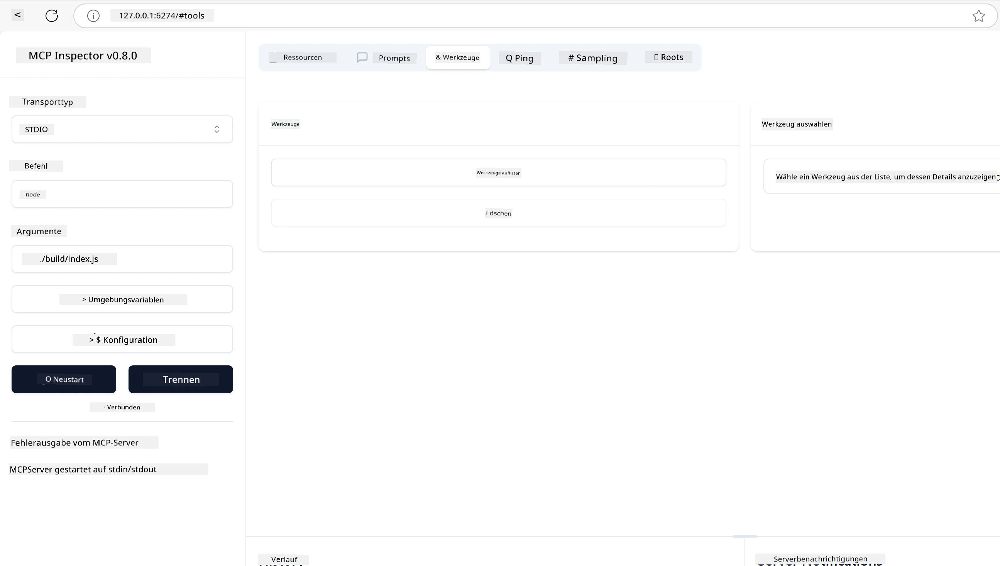
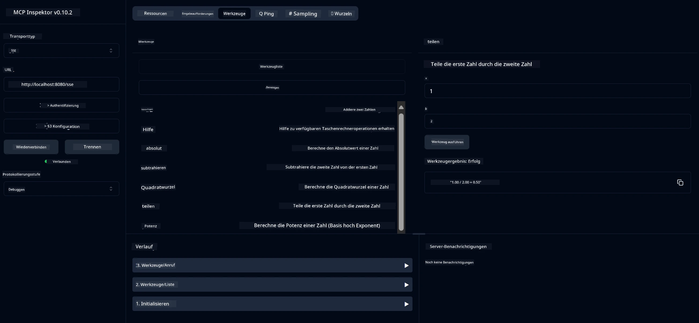
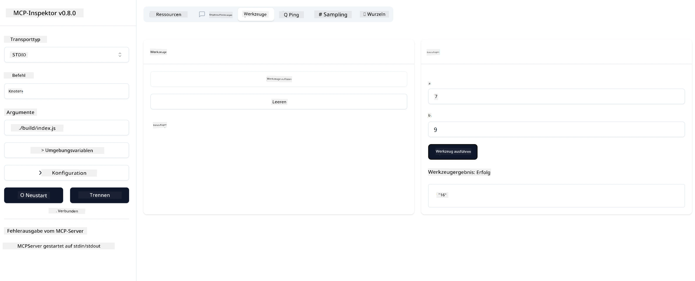

# Erste Schritte mit MCP

> [!NOTE]
> Das Java-HTTP-Beispiel in dieser Lektion verwendet den Legacy HTTP+SSE-Transport und
> zielt auf ein SDK ab, das mit MCP `2025-11-25` kompatibel ist. Für neue Remote-Server verwenden Sie
> den `2026-07-28` Streamable HTTP Transport und prüfen Sie die Unterstützung in Ihrem SDK.

Willkommen bei Ihren ersten Schritten mit dem Model Context Protocol (MCP)! Egal, ob Sie neu bei MCP sind oder Ihr Verständnis vertiefen möchten, dieser Leitfaden führt Sie durch die wesentlichen Einrichtungs- und Entwicklungsprozesse. Sie erfahren, wie MCP eine nahtlose Integration zwischen KI-Modellen und Anwendungen ermöglicht, und lernen, wie Sie Ihre Umgebung schnell für den Aufbau und das Testen von MCP-basierten Lösungen vorbereiten.

> Kurzfassung; Wenn Sie KI-Anwendungen entwickeln, wissen Sie, dass Sie Ihrem LLM (Large Language Model) Werkzeuge und andere Ressourcen hinzufügen können, um das LLM wissensreicher zu machen. Wenn Sie diese Werkzeuge und Ressourcen jedoch auf einem Server platzieren, können die Fähigkeiten von App und Server von jedem Client mit/ohne LLM genutzt werden.

## Übersicht

Diese Lektion bietet praxisnahe Anleitungen zur Einrichtung von MCP-Umgebungen und zum Erstellen Ihrer ersten MCP-Anwendungen. Sie lernen, die notwendigen Werkzeuge und Frameworks einzurichten, grundlegende MCP-Server zu erstellen, Host-Anwendungen zu entwickeln und Ihre Implementierungen zu testen.

Das Model Context Protocol (MCP) ist ein offenes Protokoll, das standardisiert, wie Anwendungen Kontext an LLMs bereitstellen. Betrachten Sie MCP wie einen USB-C-Anschluss für KI-Anwendungen – es bietet eine standardisierte Möglichkeit, KI-Modelle mit verschiedenen Datenquellen und Werkzeugen zu verbinden.

## Lernziele

Am Ende dieser Lektion werden Sie in der Lage sein:

- Entwicklungsumgebungen für MCP in C#, Java, Python, TypeScript und Rust einzurichten
- Grundlegende MCP-Server mit benutzerdefinierten Funktionen (Ressourcen, Prompts und Werkzeuge) zu erstellen und bereitzustellen
- Host-Anwendungen zu erstellen, die sich mit MCP-Servern verbinden
- MCP-Implementierungen zu testen und zu debuggen

## Einrichtung Ihrer MCP-Umgebung

Bevor Sie mit MCP arbeiten, ist es wichtig, Ihre Entwicklungsumgebung vorzubereiten und den grundlegenden Arbeitsablauf zu verstehen. Dieser Abschnitt führt Sie durch die ersten Einrichtungsschritte, um einen reibungslosen Start mit MCP zu gewährleisten.

### Voraussetzungen

Bevor Sie mit der MCP-Entwicklung beginnen, stellen Sie sicher, dass Sie Folgendes haben:

- **Entwicklungsumgebung**: Für Ihre gewählte Sprache (C#, Java, Python, TypeScript oder Rust)
- **IDE/Editor**: Visual Studio, Visual Studio Code, IntelliJ, Eclipse, PyCharm oder ein moderner Code-Editor
- **Paketmanager**: NuGet, Maven/Gradle, pip, npm/yarn oder Cargo
- **API-Schlüssel**: Für alle KI-Dienste, die Sie in Ihren Host-Anwendungen verwenden möchten

## Grundstruktur eines MCP-Servers

Ein MCP-Server umfasst typischerweise:

- **Serverkonfiguration**: Einrichtung von Port, Authentifizierung und anderen Einstellungen
- **Ressourcen**: Daten und Kontext, die LLMs zur Verfügung gestellt werden
- **Werkzeuge**: Funktionalitäten, die Modelle aufrufen können
- **Prompts**: Vorlagen zur Generierung oder Strukturierung von Text

Hier ist ein einfaches Beispiel in TypeScript:

```typescript
import { McpServer, ResourceTemplate } from "@modelcontextprotocol/sdk/server/mcp.js";
import { StdioServerTransport } from "@modelcontextprotocol/sdk/server/stdio.js";
import { z } from "zod";

// Erstellen Sie einen MCP-Server
const server = new McpServer({
  name: "Demo",
  version: "1.0.0"
});

// Fügen Sie ein Additionstool hinzu
server.tool("add",
  { a: z.number(), b: z.number() },
  async ({ a, b }) => ({
    content: [{ type: "text", text: String(a + b) }]
  })
);

// Fügen Sie eine dynamische Begrüßungsressource hinzu
server.resource(
  "file",
  // Der 'list'-Parameter steuert, wie die Ressource verfügbare Dateien auflistet. Wenn er auf undefined gesetzt wird, wird das Auflisten für diese Ressource deaktiviert.
  new ResourceTemplate("file://{path}", { list: undefined }),
  async (uri, { path }) => ({
    contents: [{
      uri: uri.href,
      text: `File, ${path}!`
    }]
  })
);

// Fügen Sie eine Dateiresource hinzu, die die Dateiinhalte liest
server.resource(
  "file",
  new ResourceTemplate("file://{path}", { list: undefined }),
  async (uri, { path }) => {
    let text;
    try {
      text = await fs.readFile(path, "utf8");
    } catch (err) {
      text = `Error reading file: ${err.message}`;
    }
    return {
      contents: [{
        uri: uri.href,
        text
      }]
    };
  }
);

server.prompt(
  "review-code",
  { code: z.string() },
  ({ code }) => ({
    messages: [{
      role: "user",
      content: {
        type: "text",
        text: `Please review this code:\n\n${code}`
      }
    }]
  })
);

// Beginnen Sie mit dem Empfang von Nachrichten auf stdin und dem Senden von Nachrichten auf stdout
const transport = new StdioServerTransport();
await server.connect(transport);
```

Im obigen Code:

- Importieren wir die notwendigen Klassen aus dem MCP TypeScript SDK.
- Erstellen und konfigurieren eine neue MCP-Server-Instanz.
- Registrieren ein benutzerdefiniertes Werkzeug (`calculator`) mit einer Handler-Funktion.
- Starten den Server, um eingehende MCP-Anfragen zu empfangen.

## Testen und Debuggen

Bevor Sie Ihren MCP-Server testen, ist es wichtig, die verfügbaren Werkzeuge und bewährten Vorgehensweisen zum Debuggen zu verstehen. Effektives Testen stellt sicher, dass Ihr Server wie erwartet funktioniert, und hilft Ihnen, Probleme schnell zu identifizieren und zu beheben. Der folgende Abschnitt beschreibt empfohlene Vorgehensweisen zur Validierung Ihrer MCP-Implementierung.

MCP bietet Werkzeuge zum Testen und Debuggen Ihrer Server:

- **Inspector-Werkzeug**: Diese grafische Oberfläche ermöglicht Ihnen, eine Verbindung zu Ihrem Server herzustellen und Ihre Werkzeuge, Prompts und Ressourcen zu testen.
- **curl**: Sie können sich auch mit einem Befehlszeilenwerkzeug wie curl oder anderen Clients verbinden, die HTTP-Befehle erstellen und ausführen können.

### Verwendung von MCP Inspector

Der [MCP Inspector](https://github.com/modelcontextprotocol/inspector) ist ein visuelles Testwerkzeug, mit dem Sie:

1. **Serverfähigkeiten entdecken**: Automatische Erkennung verfügbarer Ressourcen, Werkzeuge und Prompts
2. **Werkzeugausführung testen**: Verschiedene Parameter ausprobieren und Antworten in Echtzeit sehen
3. **Server-Metadaten anzeigen**: Serverinformationen, Schemata und Konfigurationen einsehen

```bash
# Beispiel TypeScript, Installation und Ausführung des MCP Inspectors
npx @modelcontextprotocol/inspector node build/index.js
```

Wenn Sie die obigen Befehle ausführen, startet der MCP Inspector eine lokale Weboberfläche in Ihrem Browser. Sie werden ein Dashboard sehen, das Ihre registrierten MCP-Server sowie deren verfügbare Werkzeuge, Ressourcen und Prompts anzeigt. Die Oberfläche ermöglicht eine interaktive Testung der Werkzeugausführung, das Inspizieren der Server-Metadaten und das Anzeigen von Echtzeitantworten, was die Validierung und das Debuggen Ihrer MCP-Server-Implementierungen vereinfacht.

Hier ist ein Screenshot, wie es aussehen kann:



## Häufige Einrichtungsprobleme und Lösungen

| Problem | Mögliche Lösung |
|-------|-------------------|
| Verbindung abgelehnt | Überprüfen Sie, ob der Server läuft und der Port korrekt ist |
| Fehler bei der Werkzeugausführung | Überprüfen Sie die Parametervalidierung und Fehlerbehandlung |
| Authentifizierungsfehler | Überprüfen Sie API-Schlüssel und Berechtigungen |
| Schema-Validierungsfehler | Stellen Sie sicher, dass die Parameter dem definierten Schema entsprechen |
| Server startet nicht | Prüfen Sie auf Portkonflikte oder fehlende Abhängigkeiten |
| CORS-Fehler | Konfigurieren Sie korrekte CORS-Header für Cross-Origin-Anfragen |
| Authentifizierungsprobleme | Überprüfen Sie Token-Gültigkeit und Berechtigungen |

## Lokale Entwicklung

Für lokale Entwicklung und Tests können Sie MCP-Server direkt auf Ihrem Rechner ausführen:

1. **Starten Sie den Serverprozess**: Führen Sie Ihre MCP-Server-Anwendung aus
2. **Konfigurieren Sie das Netzwerk**: Stellen Sie sicher, dass der Server auf dem erwarteten Port erreichbar ist
3. **Verbinden Sie Clients**: Verwenden Sie lokale Verbindungs-URLs wie `http://localhost:3000`

```bash
# Beispiel: Einen TypeScript MCP-Server lokal ausführen
npm run start
# Server läuft unter http://localhost:3000
```

## Erstellung Ihres ersten MCP-Servers

Wir haben bereits [Kernkonzepte](../../01-CoreConcepts/README.md) in einer vorherigen Lektion behandelt, jetzt ist es an der Zeit, dieses Wissen anzuwenden.

### Was ein Server leisten kann

Bevor wir mit dem Code schreiben beginnen, erinnern wir uns daran, was ein Server leisten kann:

Ein MCP-Server kann zum Beispiel:

- Auf lokale Dateien und Datenbanken zugreifen
- Sich mit Remote-APIs verbinden
- Berechnungen durchführen
- Mit anderen Werkzeugen und Diensten integrieren
- Eine Benutzeroberfläche für Interaktionen bereitstellen

Großartig, da wir wissen, was wir für ihn tun können, fangen wir mit dem Codieren an.

## Übung: Einen Server erstellen

Um einen Server zu erstellen, müssen Sie folgende Schritte befolgen:

- Installieren Sie das MCP SDK.
- Erstellen Sie ein Projekt und richten Sie die Projektstruktur ein.
- Schreiben Sie den Servercode.
- Testen Sie den Server.

### -1- Projekt anlegen

#### TypeScript

```sh
# Projektverzeichnis erstellen und npm-Projekt initialisieren
mkdir calculator-server
cd calculator-server
npm init -y
```

#### Python

```sh
# Projektverzeichnis erstellen
mkdir calculator-server
cd calculator-server
# Öffnen Sie den Ordner in Visual Studio Code - Überspringen Sie dies, wenn Sie eine andere IDE verwenden
code .
```

#### .NET

```sh
dotnet new console -n McpCalculatorServer
cd McpCalculatorServer
```

#### Java

Für Java erstellen Sie ein Spring Boot Projekt:

```bash
curl https://start.spring.io/starter.zip \
  -d dependencies=web \
  -d javaVersion=21 \
  -d type=maven-project \
  -d groupId=com.example \
  -d artifactId=calculator-server \
  -d name=McpServer \
  -d packageName=com.microsoft.mcp.sample.server \
  -o calculator-server.zip
```

Entpacken Sie die Zip-Datei:

```bash
unzip calculator-server.zip -d calculator-server
cd calculator-server
# optional das ungenutzte Test entfernen
rm -rf src/test/java
```

Fügen Sie die folgende vollständige Konfiguration in Ihre *pom.xml* Datei ein:

```xml
<?xml version="1.0" encoding="UTF-8"?>
<project xmlns="http://maven.apache.org/POM/4.0.0"
    xmlns:xsi="http://www.w3.org/2001/XMLSchema-instance"
    xsi:schemaLocation="http://maven.apache.org/POM/4.0.0 http://maven.apache.org/xsd/maven-4.0.0.xsd">
    <modelVersion>4.0.0</modelVersion>
    
    <!-- Spring Boot parent for dependency management -->
    <parent>
        <groupId>org.springframework.boot</groupId>
        <artifactId>spring-boot-starter-parent</artifactId>
        <version>3.5.0</version>
        <relativePath />
    </parent>

    <!-- Project coordinates -->
    <groupId>com.example</groupId>
    <artifactId>calculator-server</artifactId>
    <version>0.0.1-SNAPSHOT</version>
    <name>Calculator Server</name>
    <description>Basic calculator MCP service for beginners</description>

    <!-- Properties -->
    <properties>
        <java.version>21</java.version>
        <maven.compiler.source>21</maven.compiler.source>
        <maven.compiler.target>21</maven.compiler.target>
    </properties>

    <!-- Spring AI BOM for version management -->
    <dependencyManagement>
        <dependencies>
            <dependency>
                <groupId>org.springframework.ai</groupId>
                <artifactId>spring-ai-bom</artifactId>
                <version>1.0.0-SNAPSHOT</version>
                <type>pom</type>
                <scope>import</scope>
            </dependency>
        </dependencies>
    </dependencyManagement>

    <!-- Dependencies -->
    <dependencies>
        <dependency>
            <groupId>org.springframework.ai</groupId>
            <artifactId>spring-ai-starter-mcp-server-webflux</artifactId>
        </dependency>
        <dependency>
            <groupId>org.springframework.boot</groupId>
            <artifactId>spring-boot-starter-actuator</artifactId>
        </dependency>
        <dependency>
         <groupId>org.springframework.boot</groupId>
         <artifactId>spring-boot-starter-test</artifactId>
         <scope>test</scope>
      </dependency>
    </dependencies>

    <!-- Build configuration -->
    <build>
        <plugins>
            <plugin>
                <groupId>org.springframework.boot</groupId>
                <artifactId>spring-boot-maven-plugin</artifactId>
            </plugin>
            <plugin>
                <groupId>org.apache.maven.plugins</groupId>
                <artifactId>maven-compiler-plugin</artifactId>
                <configuration>
                    <release>21</release>
                </configuration>
            </plugin>
        </plugins>
    </build>

    <!-- Repositories for Spring AI snapshots -->
    <repositories>
        <repository>
            <id>spring-milestones</id>
            <name>Spring Milestones</name>
            <url>https://repo.spring.io/milestone</url>
            <snapshots>
                <enabled>false</enabled>
            </snapshots>
        </repository>
        <repository>
            <id>spring-snapshots</id>
            <name>Spring Snapshots</name>
            <url>https://repo.spring.io/snapshot</url>
            <releases>
                <enabled>false</enabled>
            </releases>
        </repository>
    </repositories>
</project>
```

#### Rust

```sh
mkdir calculator-server
cd calculator-server
cargo init
```

### -2- Abhängigkeiten hinzufügen

Nun da Ihr Projekt erstellt ist, fügen wir als nächstes Abhängigkeiten hinzu:

#### TypeScript

```sh
# Falls noch nicht installiert, TypeScript global installieren
npm install typescript -g

# Installieren Sie das MCP SDK und Zod für die Schemaüberprüfung
npm install @modelcontextprotocol/sdk zod
npm install -D @types/node typescript
```

#### Python

```sh
# Erstellen Sie eine virtuelle Umgebung und installieren Sie die Abhängigkeiten
python -m venv venv
venv\Scripts\activate
pip install "mcp[cli]"
```

#### Java

```bash
cd calculator-server
./mvnw clean install -DskipTests
```

#### Rust

```sh
cargo add rmcp --features server,transport-io
cargo add serde
cargo add tokio --features rt-multi-thread
```

### -3- Projektdateien erstellen

#### TypeScript

Öffnen Sie die *package.json* Datei und ersetzen Sie den Inhalt durch den folgenden, damit Sie den Server bauen und ausführen können:

```json
{
  "name": "calculator-server",
  "version": "1.0.0",
  "main": "index.js",
  "type": "module",
  "scripts": {
    "build": "tsc",
    "start": "npm run build && node ./build/index.js",
  },
  "keywords": [],
  "author": "",
  "license": "ISC",
  "description": "A simple calculator server using Model Context Protocol",
  "dependencies": {
    "@modelcontextprotocol/sdk": "^1.16.0",
    "zod": "^3.25.76"
  },
  "devDependencies": {
    "@types/node": "^24.0.14",
    "typescript": "^5.8.3"
  }
}
```

Erstellen Sie eine *tsconfig.json* mit folgendem Inhalt:

```json
{
  "compilerOptions": {
    "target": "ES2022",
    "module": "Node16",
    "moduleResolution": "Node16",
    "outDir": "./build",
    "rootDir": "./src",
    "strict": true,
    "esModuleInterop": true,
    "skipLibCheck": true,
    "forceConsistentCasingInFileNames": true
  },
  "include": ["src/**/*"],
  "exclude": ["node_modules"]
}
```

Erstellen Sie ein Verzeichnis für Ihren Quellcode:

```sh
mkdir src
touch src/index.ts
```

#### Python

Erstellen Sie eine Datei *server.py*

```sh
touch server.py
```

#### .NET

Installieren Sie die erforderlichen NuGet-Pakete:

```sh
dotnet add package ModelContextProtocol --prerelease
dotnet add package Microsoft.Extensions.Hosting
```

#### Java

Für Java Spring Boot Projekte wird die Projektstruktur automatisch erstellt.

#### Rust

Für Rust wird eine *src/main.rs* Datei standardmäßig erstellt, wenn Sie `cargo init` ausführen. Öffnen Sie die Datei und löschen Sie den Beispielcode.

### -4- Server-Code erstellen

#### TypeScript

Erstellen Sie eine Datei *index.ts* und fügen Sie folgenden Code hinzu:

```typescript
import { McpServer, ResourceTemplate } from "@modelcontextprotocol/sdk/server/mcp.js";
import { StdioServerTransport } from "@modelcontextprotocol/sdk/server/stdio.js";
import { z } from "zod";
 
// Erstellen Sie einen MCP-Server
const server = new McpServer({
  name: "Calculator MCP Server",
  version: "1.0.0"
});
```

Jetzt haben Sie einen Server, aber er macht noch nicht viel, das ändern wir.

#### Python

```python
# server.py
from mcp.server.fastmcp import FastMCP

# Erstelle einen MCP-Server
mcp = FastMCP("Demo")
```

#### .NET

```csharp
using Microsoft.Extensions.DependencyInjection;
using Microsoft.Extensions.Hosting;
using Microsoft.Extensions.Logging;
using ModelContextProtocol.Server;
using System.ComponentModel;

var builder = Host.CreateApplicationBuilder(args);
builder.Logging.AddConsole(consoleLogOptions =>
{
    // Configure all logs to go to stderr
    consoleLogOptions.LogToStandardErrorThreshold = LogLevel.Trace;
});

builder.Services
    .AddMcpServer()
    .WithStdioServerTransport()
    .WithToolsFromAssembly();
await builder.Build().RunAsync();

// add features
```

#### Java

Für Java erstellen Sie die Kernserver-Komponenten. Ändern Sie zuerst die Hauptanwendungsklasse:

*src/main/java/com/microsoft/mcp/sample/server/McpServerApplication.java*:

```java
package com.microsoft.mcp.sample.server;

import org.springframework.ai.tool.ToolCallbackProvider;
import org.springframework.ai.tool.method.MethodToolCallbackProvider;
import org.springframework.boot.SpringApplication;
import org.springframework.boot.autoconfigure.SpringBootApplication;
import org.springframework.context.annotation.Bean;
import com.microsoft.mcp.sample.server.service.CalculatorService;

@SpringBootApplication
public class McpServerApplication {

    public static void main(String[] args) {
        SpringApplication.run(McpServerApplication.class, args);
    }
    
    @Bean
    public ToolCallbackProvider calculatorTools(CalculatorService calculator) {
        return MethodToolCallbackProvider.builder().toolObjects(calculator).build();
    }
}
```

Erstellen Sie den Calculator-Service *src/main/java/com/microsoft/mcp/sample/server/service/CalculatorService.java*:

```java
package com.microsoft.mcp.sample.server.service;

import org.springframework.ai.tool.annotation.Tool;
import org.springframework.stereotype.Service;

/**
 * Service for basic calculator operations.
 * This service provides simple calculator functionality through MCP.
 */
@Service
public class CalculatorService {

    /**
     * Add two numbers
     * @param a The first number
     * @param b The second number
     * @return The sum of the two numbers
     */
    @Tool(description = "Add two numbers together")
    public String add(double a, double b) {
        double result = a + b;
        return formatResult(a, "+", b, result);
    }

    /**
     * Subtract one number from another
     * @param a The number to subtract from
     * @param b The number to subtract
     * @return The result of the subtraction
     */
    @Tool(description = "Subtract the second number from the first number")
    public String subtract(double a, double b) {
        double result = a - b;
        return formatResult(a, "-", b, result);
    }

    /**
     * Multiply two numbers
     * @param a The first number
     * @param b The second number
     * @return The product of the two numbers
     */
    @Tool(description = "Multiply two numbers together")
    public String multiply(double a, double b) {
        double result = a * b;
        return formatResult(a, "*", b, result);
    }

    /**
     * Divide one number by another
     * @param a The numerator
     * @param b The denominator
     * @return The result of the division
     */
    @Tool(description = "Divide the first number by the second number")
    public String divide(double a, double b) {
        if (b == 0) {
            return "Error: Cannot divide by zero";
        }
        double result = a / b;
        return formatResult(a, "/", b, result);
    }

    /**
     * Calculate the power of a number
     * @param base The base number
     * @param exponent The exponent
     * @return The result of raising the base to the exponent
     */
    @Tool(description = "Calculate the power of a number (base raised to an exponent)")
    public String power(double base, double exponent) {
        double result = Math.pow(base, exponent);
        return formatResult(base, "^", exponent, result);
    }

    /**
     * Calculate the square root of a number
     * @param number The number to find the square root of
     * @return The square root of the number
     */
    @Tool(description = "Calculate the square root of a number")
    public String squareRoot(double number) {
        if (number < 0) {
            return "Error: Cannot calculate square root of a negative number";
        }
        double result = Math.sqrt(number);
        return String.format("√%.2f = %.2f", number, result);
    }

    /**
     * Calculate the modulus (remainder) of division
     * @param a The dividend
     * @param b The divisor
     * @return The remainder of the division
     */
    @Tool(description = "Calculate the remainder when one number is divided by another")
    public String modulus(double a, double b) {
        if (b == 0) {
            return "Error: Cannot divide by zero";
        }
        double result = a % b;
        return formatResult(a, "%", b, result);
    }

    /**
     * Calculate the absolute value of a number
     * @param number The number to find the absolute value of
     * @return The absolute value of the number
     */
    @Tool(description = "Calculate the absolute value of a number")
    public String absolute(double number) {
        double result = Math.abs(number);
        return String.format("|%.2f| = %.2f", number, result);
    }

    /**
     * Get help about available calculator operations
     * @return Information about available operations
     */
    @Tool(description = "Get help about available calculator operations")
    public String help() {
        return "Basic Calculator MCP Service\n\n" +
               "Available operations:\n" +
               "1. add(a, b) - Adds two numbers\n" +
               "2. subtract(a, b) - Subtracts the second number from the first\n" +
               "3. multiply(a, b) - Multiplies two numbers\n" +
               "4. divide(a, b) - Divides the first number by the second\n" +
               "5. power(base, exponent) - Raises a number to a power\n" +
               "6. squareRoot(number) - Calculates the square root\n" + 
               "7. modulus(a, b) - Calculates the remainder of division\n" +
               "8. absolute(number) - Calculates the absolute value\n\n" +
               "Example usage: add(5, 3) will return 5 + 3 = 8";
    }

    /**
     * Format the result of a calculation
     */
    private String formatResult(double a, String operator, double b, double result) {
        return String.format("%.2f %s %.2f = %.2f", a, operator, b, result);
    }
}
```

**Optionale Komponenten für einen produktionsreifen Dienst:**

Erstellen Sie eine Startkonfiguration *src/main/java/com/microsoft/mcp/sample/server/config/StartupConfig.java*:

```java
package com.microsoft.mcp.sample.server.config;

import org.springframework.boot.CommandLineRunner;
import org.springframework.context.annotation.Bean;
import org.springframework.context.annotation.Configuration;

@Configuration
public class StartupConfig {
    
    @Bean
    public CommandLineRunner startupInfo() {
        return args -> {
            System.out.println("\n" + "=".repeat(60));
            System.out.println("Calculator MCP Server is starting...");
            System.out.println("SSE endpoint: http://localhost:8080/sse");
            System.out.println("Health check: http://localhost:8080/actuator/health");
            System.out.println("=".repeat(60) + "\n");
        };
    }
}
```

Erstellen Sie einen Health Controller *src/main/java/com/microsoft/mcp/sample/server/controller/HealthController.java*:

```java
package com.microsoft.mcp.sample.server.controller;

import org.springframework.http.ResponseEntity;
import org.springframework.web.bind.annotation.GetMapping;
import org.springframework.web.bind.annotation.RestController;
import java.time.LocalDateTime;
import java.util.HashMap;
import java.util.Map;

@RestController
public class HealthController {
    
    @GetMapping("/health")
    public ResponseEntity<Map<String, Object>> healthCheck() {
        Map<String, Object> response = new HashMap<>();
        response.put("status", "UP");
        response.put("timestamp", LocalDateTime.now().toString());
        response.put("service", "Calculator MCP Server");
        return ResponseEntity.ok(response);
    }
}
```

Erstellen Sie einen Ausnahme-Handler *src/main/java/com/microsoft/mcp/sample/server/exception/GlobalExceptionHandler.java*:

```java
package com.microsoft.mcp.sample.server.exception;

import org.springframework.http.HttpStatus;
import org.springframework.http.ResponseEntity;
import org.springframework.web.bind.annotation.ExceptionHandler;
import org.springframework.web.bind.annotation.RestControllerAdvice;

@RestControllerAdvice
public class GlobalExceptionHandler {

    @ExceptionHandler(IllegalArgumentException.class)
    public ResponseEntity<ErrorResponse> handleIllegalArgumentException(IllegalArgumentException ex) {
        ErrorResponse error = new ErrorResponse(
            "Invalid_Input", 
            "Invalid input parameter: " + ex.getMessage());
        return new ResponseEntity<>(error, HttpStatus.BAD_REQUEST);
    }

    public static class ErrorResponse {
        private String code;
        private String message;

        public ErrorResponse(String code, String message) {
            this.code = code;
            this.message = message;
        }

        // Getter
        public String getCode() { return code; }
        public String getMessage() { return message; }
    }
}
```

Erstellen Sie ein benutzerdefiniertes Banner *src/main/resources/banner.txt*:

```text
_____      _            _       _             
 / ____|    | |          | |     | |            
| |     __ _| | ___ _   _| | __ _| |_ ___  _ __ 
| |    / _` | |/ __| | | | |/ _` | __/ _ \| '__|
| |___| (_| | | (__| |_| | | (_| | || (_) | |   
 \_____\__,_|_|\___|\__,_|_|\__,_|\__\___/|_|   
                                                
Calculator MCP Server v1.0
Spring Boot MCP Application
```

</details>

#### Rust

Fügen Sie den folgenden Code an den Anfang der *src/main.rs* Datei ein. Damit importieren Sie die notwendigen Bibliotheken und Module für Ihren MCP-Server.

```rust
use rmcp::{
    handler::server::{router::tool::ToolRouter, tool::Parameters},
    model::{ServerCapabilities, ServerInfo},
    schemars, tool, tool_handler, tool_router,
    transport::stdio,
    ServerHandler, ServiceExt,
};
use std::error::Error;
```

Der Calculator-Server wird ein einfacher Server sein, der zwei Zahlen zusammenaddieren kann. Erstellen wir eine Struktur, um die Calculator-Anfrage darzustellen.

```rust
#[derive(Debug, serde::Deserialize, schemars::JsonSchema)]
pub struct CalculatorRequest {
    pub a: f64,
    pub b: f64,
}
```

Erstellen Sie anschließend eine Struktur, um den Calculator-Server darzustellen. Diese Struktur enthält den Tool-Router, mit dem Werkzeuge registriert werden.

```rust
#[derive(Debug, Clone)]
pub struct Calculator {
    tool_router: ToolRouter<Self>,
}
```

Nun können wir die `Calculator`-Struktur implementieren, um eine neue Instanz des Servers zu erstellen und den Server-Handler zu implementieren, der Serverinformationen bereitstellt.

```rust
#[tool_router]
impl Calculator {
    pub fn new() -> Self {
        Self {
            tool_router: Self::tool_router(),
        }
    }
}

#[tool_handler]
impl ServerHandler for Calculator {
    fn get_info(&self) -> ServerInfo {
        ServerInfo {
            instructions: Some("A simple calculator tool".into()),
            capabilities: ServerCapabilities::builder().enable_tools().build(),
            ..Default::default()
        }
    }
}
```

Schließlich müssen wir die Hauptfunktion implementieren, um den Server zu starten. Diese Funktion erstellt eine Instanz der `Calculator`-Struktur und bedient sie über Standard-Ein-/Ausgabe.

```rust
#[tokio::main]
async fn main() -> Result<(), Box<dyn Error>> {
    let service = Calculator::new().serve(stdio()).await?;
    service.waiting().await?;
    Ok(())
}
```

Der Server ist nun eingerichtet, um grundlegende Informationen über sich selbst zu liefern. Als nächstes fügen wir ein Werkzeug zum Addieren hinzu.

### -5- Hinzufügen eines Werkzeugs und einer Ressource

Fügen Sie ein Werkzeug und eine Ressource hinzu, indem Sie den folgenden Code hinzufügen:

#### TypeScript

```typescript
server.tool(
  "add",
  { a: z.number(), b: z.number() },
  async ({ a, b }) => ({
    content: [{ type: "text", text: String(a + b) }]
  })
);

server.resource(
  "greeting",
  new ResourceTemplate("greeting://{name}", { list: undefined }),
  async (uri, { name }) => ({
    contents: [{
      uri: uri.href,
      text: `Hello, ${name}!`
    }]
  })
);
```

Ihr Werkzeug nimmt die Parameter `a` und `b` und führt eine Funktion aus, die eine Antwort in folgender Form erzeugt:

```typescript
{
  contents: [{
    type: "text", content: "some content"
  }]
}
```

Ihre Ressource wird über einen String "greeting" angesprochen, nimmt einen Parameter `name` und gibt eine ähnliche Antwort wie das Werkzeug zurück:

```typescript
{
  uri: "<href>",
  text: "a text"
}
```

#### Python

```python
# Ein Additionstool hinzufügen
@mcp.tool()
def add(a: int, b: int) -> int:
    """Add two numbers"""
    return a + b


# Eine dynamische Begrüßungsressource hinzufügen
@mcp.resource("greeting://{name}")
def get_greeting(name: str) -> str:
    """Get a personalized greeting"""
    return f"Hello, {name}!"
```

Im obigen Code haben wir:

- Ein Werkzeug `add` definiert, das die Parameter `a` und `b` als Ganzzahlen annimmt.
- Eine Ressource namens `greeting` erstellt, die den Parameter `name` annimmt.

#### .NET

Fügen Sie dies Ihrer Programmdatei Program.cs hinzu:

```csharp
[McpServerToolType]
public static class CalculatorTool
{
    [McpServerTool, Description("Adds two numbers")]
    public static string Add(int a, int b) => $"Sum {a + b}";
}
```

#### Java

Die Werkzeuge wurden bereits im vorherigen Schritt erstellt.

#### Rust

Fügen Sie innerhalb des Blocks `impl Calculator` ein neues Werkzeug hinzu:

```rust
#[tool(description = "Adds a and b")]
async fn add(
    &self,
    Parameters(CalculatorRequest { a, b }): Parameters<CalculatorRequest>,
) -> String {
    (a + b).to_string()
}
```

### -6- Finaler Code

Fügen wir den letzten benötigten Code hinzu, damit der Server starten kann:

#### TypeScript

```typescript
// Beginnen Sie mit dem Empfangen von Nachrichten auf stdin und dem Senden von Nachrichten auf stdout
const transport = new StdioServerTransport();
await server.connect(transport);
```

Hier ist der vollständige Code:

```typescript
// index.ts
import { McpServer, ResourceTemplate } from "@modelcontextprotocol/sdk/server/mcp.js";
import { StdioServerTransport } from "@modelcontextprotocol/sdk/server/stdio.js";
import { z } from "zod";

// Erstelle einen MCP-Server
const server = new McpServer({
  name: "Calculator MCP Server",
  version: "1.0.0"
});

// Füge ein Additionswerkzeug hinzu
server.tool(
  "add",
  { a: z.number(), b: z.number() },
  async ({ a, b }) => ({
    content: [{ type: "text", text: String(a + b) }]
  })
);

// Füge eine dynamische Begrüßungsressource hinzu
server.resource(
  "greeting",
  new ResourceTemplate("greeting://{name}", { list: undefined }),
  async (uri, { name }) => ({
    contents: [{
      uri: uri.href,
      text: `Hello, ${name}!`
    }]
  })
);

// Beginne, Nachrichten auf stdin zu empfangen und Nachrichten auf stdout zu senden
const transport = new StdioServerTransport();
server.connect(transport);
```

#### Python

```python
# server.py
from mcp.server.fastmcp import FastMCP

# Erstellen Sie einen MCP-Server
mcp = FastMCP("Demo")


# Fügen Sie ein Additionswerkzeug hinzu
@mcp.tool()
def add(a: int, b: int) -> int:
    """Add two numbers"""
    return a + b


# Fügen Sie eine dynamische Begrüßungsressource hinzu
@mcp.resource("greeting://{name}")
def get_greeting(name: str) -> str:
    """Get a personalized greeting"""
    return f"Hello, {name}!"

# Hauptausführungsblock - dies ist erforderlich, um den Server auszuführen
if __name__ == "__main__":
    mcp.run()
```

#### .NET

Erstellen Sie eine Program.cs Datei mit folgendem Inhalt:

```csharp
using Microsoft.Extensions.DependencyInjection;
using Microsoft.Extensions.Hosting;
using Microsoft.Extensions.Logging;
using ModelContextProtocol.Server;
using System.ComponentModel;

var builder = Host.CreateApplicationBuilder(args);
builder.Logging.AddConsole(consoleLogOptions =>
{
    // Configure all logs to go to stderr
    consoleLogOptions.LogToStandardErrorThreshold = LogLevel.Trace;
});

builder.Services
    .AddMcpServer()
    .WithStdioServerTransport()
    .WithToolsFromAssembly();
await builder.Build().RunAsync();

[McpServerToolType]
public static class CalculatorTool
{
    [McpServerTool, Description("Adds two numbers")]
    public static string Add(int a, int b) => $"Sum {a + b}";
}
```

#### Java

Ihre vollständige Hauptanwendungsklasse sollte so aussehen:

```java
// McpServerApplication.java
package com.microsoft.mcp.sample.server;

import org.springframework.ai.tool.ToolCallbackProvider;
import org.springframework.ai.tool.method.MethodToolCallbackProvider;
import org.springframework.boot.SpringApplication;
import org.springframework.boot.autoconfigure.SpringBootApplication;
import org.springframework.context.annotation.Bean;
import com.microsoft.mcp.sample.server.service.CalculatorService;

@SpringBootApplication
public class McpServerApplication {

    public static void main(String[] args) {
        SpringApplication.run(McpServerApplication.class, args);
    }
    
    @Bean
    public ToolCallbackProvider calculatorTools(CalculatorService calculator) {
        return MethodToolCallbackProvider.builder().toolObjects(calculator).build();
    }
}
```

#### Rust

Der finale Code für den Rust-Server sollte so aussehen:

```rust
use rmcp::{
    ServerHandler, ServiceExt,
    handler::server::{router::tool::ToolRouter, tool::Parameters},
    model::{ServerCapabilities, ServerInfo},
    schemars, tool, tool_handler, tool_router,
    transport::stdio,
};
use std::error::Error;

#[derive(Debug, serde::Deserialize, schemars::JsonSchema)]
pub struct CalculatorRequest {
    pub a: f64,
    pub b: f64,
}

#[derive(Debug, Clone)]
pub struct Calculator {
    tool_router: ToolRouter<Self>,
}

#[tool_router]
impl Calculator {
    pub fn new() -> Self {
        Self {
            tool_router: Self::tool_router(),
        }
    }
    
    #[tool(description = "Adds a and b")]
    async fn add(
        &self,
        Parameters(CalculatorRequest { a, b }): Parameters<CalculatorRequest>,
    ) -> String {
        (a + b).to_string()
    }
}

#[tool_handler]
impl ServerHandler for Calculator {
    fn get_info(&self) -> ServerInfo {
        ServerInfo {
            instructions: Some("A simple calculator tool".into()),
            capabilities: ServerCapabilities::builder().enable_tools().build(),
            ..Default::default()
        }
    }
}

#[tokio::main]
async fn main() -> Result<(), Box<dyn Error>> {
    let service = Calculator::new().serve(stdio()).await?;
    service.waiting().await?;
    Ok(())
}
```

### -7- Testen Sie den Server

Starten Sie den Server mit folgendem Befehl:

#### TypeScript

```sh
npm run build
```

#### Python

```sh
mcp run server.py
```

> Um MCP Inspector zu verwenden, starten Sie `mcp dev server.py`, was den Inspector automatisch startet und das erforderliche Proxy-Session-Token bereitstellt. Wenn Sie `mcp run server.py` verwenden, müssen Sie den Inspector manuell starten und die Verbindung konfigurieren.

#### .NET

Stellen Sie sicher, dass Sie sich im Projektverzeichnis befinden:

```sh
cd McpCalculatorServer
dotnet run
```

#### Java

```bash
./mvnw clean install -DskipTests
java -jar target/calculator-server-0.0.1-SNAPSHOT.jar
```

#### Rust

Führen Sie die folgenden Befehle aus, um den Server zu formatieren und zu starten:

```sh
cargo fmt
cargo run
```

### -8- Mit dem Inspector starten

Der Inspector ist ein großartiges Werkzeug, das Ihren Server starten kann und Ihnen erlaubt, mit ihm zu interagieren, damit Sie testen können, ob er funktioniert. Starten wir ihn:

> [!NOTE]
> Im Feld "Befehl" kann es unterschiedlich aussehen, da es den Befehl für das Ausführen eines Servers mit Ihrer spezifischen Laufzeit enthält/

#### TypeScript

```sh
npx @modelcontextprotocol/inspector node build/index.js
```

Oder fügen Sie ihn so Ihrer *package.json* hinzu: `"inspector": "npx @modelcontextprotocol/inspector node build/index.js"` und führen Sie dann `npm run inspector` aus

#### Python

Python umschließt ein Node.js-Werkzeug namens inspector. Es ist möglich, dieses Werkzeug wie folgt aufzurufen:

```sh
mcp dev server.py
```


Es implementiert jedoch nicht alle Methoden, die im Tool verfügbar sind, daher wird empfohlen, das Node.js-Tool direkt wie unten gezeigt auszuführen:

```sh
npx @modelcontextprotocol/inspector mcp run server.py
```

Wenn Sie ein Tool oder eine IDE verwenden, die es Ihnen ermöglicht, Befehle und Argumente zum Ausführen von Skripten zu konfigurieren, 
stellen Sie sicher, dass Sie `python` im Feld `Command` und `server.py` als `Arguments` festlegen. So wird sichergestellt, dass das Skript korrekt ausgeführt wird.

#### .NET

Vergewissern Sie sich, dass Sie sich im Verzeichnis Ihres Projekts befinden:

```sh
cd McpCalculatorServer
npx @modelcontextprotocol/inspector dotnet run
```

#### Java

Stellen Sie sicher, dass Ihr Rechner-Server läuft
Führen Sie den Inspektor aus:

```cmd
npx @modelcontextprotocol/inspector
```

In der Weboberfläche des Inspektors:

1. Wählen Sie "SSE" als Transporttyp aus
2. Stellen Sie die URL auf: `http://localhost:8080/sse`
3. Klicken Sie auf "Connect"



**Sie sind jetzt mit dem Server verbunden**
**Der Java-Server-Testabschnitt ist nun abgeschlossen**

Der nächste Abschnitt befasst sich mit der Interaktion mit dem Server.

Sie sollten die folgende Benutzeroberfläche sehen:


1. Verbinden Sie sich mit dem Server durch Auswahl der Schaltfläche Connect
  Sobald Sie mit dem Server verbunden sind, sollten Sie Folgendes sehen:

  

1. Wählen Sie "Tools" und "listTools", Sie sollten "Add" sehen, wählen Sie "Add" und füllen Sie die Parameterwerte aus.

  Sie sollten die folgende Antwort sehen, also ein Ergebnis des "add"-Tools:

  

Herzlichen Glückwunsch, Sie haben es geschafft, Ihren ersten Server zu erstellen und auszuführen!

#### Rust

Um den Rust-Server mit der MCP Inspector CLI auszuführen, verwenden Sie den folgenden Befehl:

```sh
npx @modelcontextprotocol/inspector cargo run --cli --method tools/call --tool-name add --tool-arg a=1 b=2
```

### Offizielle SDKs

MCP bietet offizielle SDKs für mehrere Sprachen:

- [C# SDK](https://github.com/modelcontextprotocol/csharp-sdk) - Wird in Zusammenarbeit mit Microsoft gepflegt
- [Java SDK](https://github.com/modelcontextprotocol/java-sdk) - Wird in Zusammenarbeit mit Spring AI gepflegt
- [TypeScript SDK](https://github.com/modelcontextprotocol/typescript-sdk) - Die offizielle TypeScript-Implementierung
- [Python SDK](https://github.com/modelcontextprotocol/python-sdk) - Die offizielle Python-Implementierung
- [Kotlin SDK](https://github.com/modelcontextprotocol/kotlin-sdk) - Die offizielle Kotlin-Implementierung
- [Swift SDK](https://github.com/modelcontextprotocol/swift-sdk) - Wird in Zusammenarbeit mit Loopwork AI gepflegt
- [Rust SDK](https://github.com/modelcontextprotocol/rust-sdk) - Die offizielle Rust-Implementierung

## Wesentliche Erkenntnisse

- Das Einrichten einer MCP-Entwicklungsumgebung ist mit sprachspezifischen SDKs unkompliziert
- Der Bau von MCP-Servern beinhaltet das Erstellen und Registrieren von Tools mit klaren Schemata
- Testen und Debuggen sind für zuverlässige MCP-Implementierungen unerlässlich

## Beispiele

- [Java Rechner](../samples/java/calculator/README.md)
- [.NET Rechner](../../../../03-GettingStarted/samples/csharp)
- [JavaScript Rechner](../samples/javascript/README.md)
- [TypeScript Rechner](../samples/typescript/README.md)
- [Python Rechner](../../../../03-GettingStarted/samples/python)
- [Rust Rechner](../../../../03-GettingStarted/samples/rust)

## Aufgabe

Erstellen Sie einen einfachen MCP-Server mit einem Tool Ihrer Wahl:

1. Implementieren Sie das Tool in Ihrer bevorzugten Sprache (.NET, Java, Python, TypeScript oder Rust).
2. Definieren Sie Eingabeparameter und Rückgabewerte.
3. Führen Sie das Inspektor-Tool aus, um sicherzustellen, dass der Server wie beabsichtigt funktioniert.
4. Testen Sie die Implementierung mit verschiedenen Eingaben.

## Lösung

[Lösung](./solution/README.md)

## Zusätzliche Ressourcen

- [Build Agents using Model Context Protocol on Azure](https://learn.microsoft.com/azure/developer/ai/intro-agents-mcp)
- [Remote MCP with Azure Container Apps (Node.js/TypeScript/JavaScript)](https://learn.microsoft.com/samples/azure-samples/mcp-container-ts/mcp-container-ts/)
- [.NET OpenAI MCP Agent](https://learn.microsoft.com/samples/azure-samples/openai-mcp-agent-dotnet/openai-mcp-agent-dotnet/)

## Was als Nächstes

Weiter: [Erste Schritte mit MCP-Clients](../02-client/README.md)

---

<!-- CO-OP TRANSLATOR DISCLAIMER START -->
**Haftungsausschluss**:
Dieses Dokument wurde mit dem KI-Übersetzungsdienst [Co-op Translator](https://github.com/Azure/co-op-translator) übersetzt. Obwohl wir uns um Genauigkeit bemühen, beachten Sie bitte, dass automatisierte Übersetzungen Fehler oder Ungenauigkeiten enthalten können. Das Originaldokument in seiner Ursprungssprache gilt als maßgebliche Quelle. Bei kritischen Informationen wird eine professionelle menschliche Übersetzung empfohlen. Wir übernehmen keine Haftung für Missverständnisse oder Fehlinterpretationen, die aus der Verwendung dieser Übersetzung entstehen.
<!-- CO-OP TRANSLATOR DISCLAIMER END -->