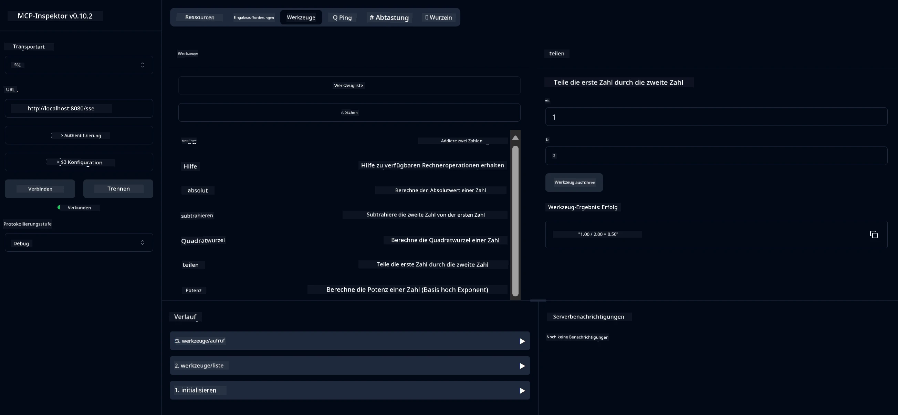

# Basisrechner MCP Service

> [!NOTE]
> Diese Java-Lösung verwendet den Legacy HTTP+SSE-Transport und richtet sich an ein SDK,
> das mit MCP `2025-11-25` kompatibel ist. Sie wird für den entsprechenden Kurscode beibehalten;
> neue Remote-Server sollten die Streamable HTTP-Unterstützung `2026-07-28` verwenden.

Dieser Service stellt grundlegende Rechneroperationen über das Model Context Protocol (MCP) unter Verwendung von Spring Boot mit WebFlux-Transport bereit. Er ist als einfaches Beispiel für Anfänger konzipiert, die MCP-Implementierungen kennenlernen möchten.

Für weitere Informationen siehe die [MCP Server Boot Starter](https://docs.spring.io/spring-ai/reference/api/mcp/mcp-server-boot-starter-docs.html) Referenzdokumentation.


## Nutzung des Services

Der Service stellt folgende API-Endpunkte über das MCP-Protokoll bereit:

- `add(a, b)`: Addiere zwei Zahlen
- `subtract(a, b)`: Subtrahiere die zweite Zahl von der ersten
- `multiply(a, b)`: Multipliziere zwei Zahlen
- `divide(a, b)`: Teile die erste Zahl durch die zweite (mit Nullprüfung)
- `power(base, exponent)`: Berechne die Potenz einer Zahl
- `squareRoot(number)`: Berechne die Quadratwurzel (mit Prüfung auf negative Zahl)
- `modulus(a, b)`: Berechne den Rest bei der Division
- `absolute(number)`: Berechne den Absolutwert

## Abhängigkeiten

Das Projekt benötigt folgende wichtige Abhängigkeiten:

```xml
<dependency>
    <groupId>org.springframework.ai</groupId>
    <artifactId>spring-ai-starter-mcp-server-webflux</artifactId>
</dependency>
```

## Projekt bauen

Baue das Projekt mit Maven:
```bash
./mvnw clean install -DskipTests
```

## Server starten

### Verwendung mit Java

```bash
java -jar target/calculator-server-0.0.1-SNAPSHOT.jar
```

### Verwendung mit MCP Inspector

Der MCP Inspector ist ein hilfreiches Tool zur Interaktion mit MCP-Services. So verwenden Sie ihn mit diesem Rechner-Service:

1. **Installieren und starten Sie den MCP Inspector** in einem neuen Terminalfenster:
   ```bash
   npx @modelcontextprotocol/inspector
   ```

2. **Zugriff auf das Web-UI** durch Klicken auf die vom Programm angezeigte URL (normalerweise http://localhost:6274)

3. **Konfigurieren der Verbindung**:
   - Wählen Sie als Transporttyp „SSE“
   - Geben Sie die URL des laufenden Servers SSE-Endpunkts ein: `http://localhost:8080/sse`
   - Klicken Sie auf „Connect“

4. **Tools verwenden**:
   - Klicken Sie auf „List Tools“, um verfügbare Rechneroperationen anzuzeigen
   - Wählen Sie ein Tool aus und klicken Sie auf „Run Tool“, um eine Operation auszuführen



---

<!-- CO-OP TRANSLATOR DISCLAIMER START -->
**Haftungsausschluss**:
Dieses Dokument wurde mit dem KI-Übersetzungsdienst [Co-op Translator](https://github.com/Azure/co-op-translator) übersetzt. Obwohl wir uns um Genauigkeit bemühen, beachten Sie bitte, dass automatisierte Übersetzungen Fehler oder Ungenauigkeiten enthalten können. Das Originaldokument in seiner Ursprungssprache gilt als maßgebliche Quelle. Bei kritischen Informationen wird eine professionelle menschliche Übersetzung empfohlen. Wir übernehmen keine Haftung für Missverständnisse oder Fehlinterpretationen, die aus der Verwendung dieser Übersetzung entstehen.
<!-- CO-OP TRANSLATOR DISCLAIMER END -->