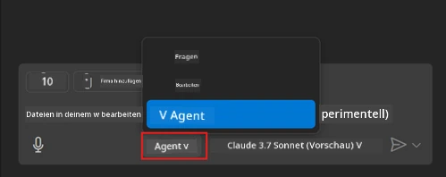
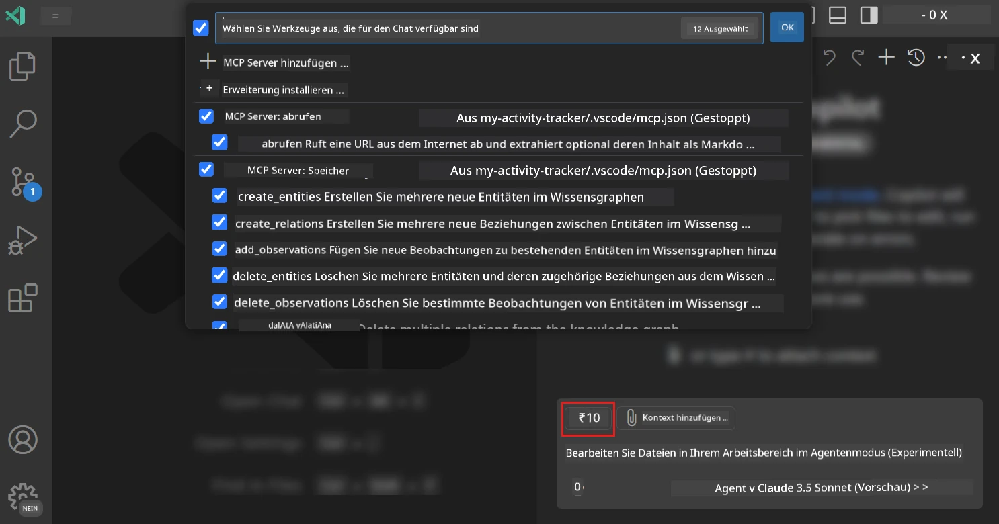
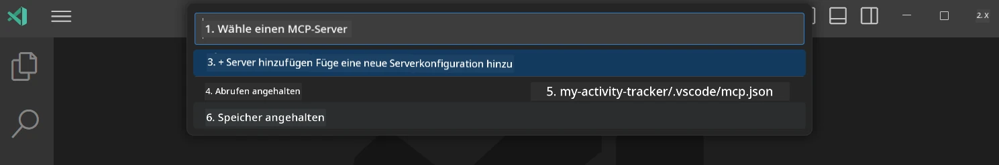
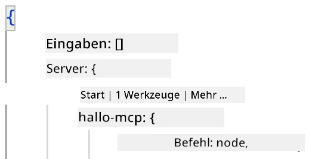
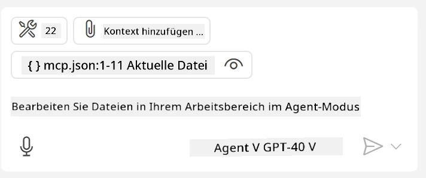
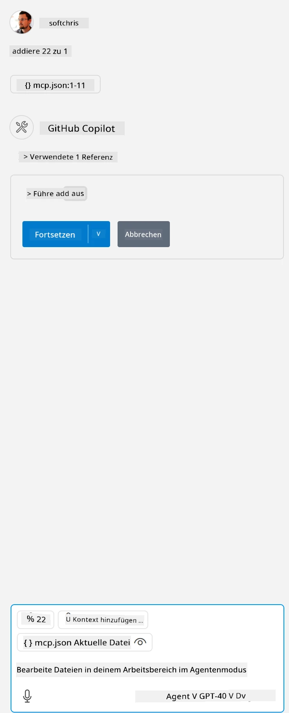

# Nutzung eines Servers im GitHub Copilot Agent-Modus

Visual Studio Code und GitHub Copilot können als Client agieren und einen MCP-Server nutzen. Warum sollte man das tun wollen, fragen Sie sich vielleicht? Nun, das bedeutet, dass alle Funktionen, die der MCP-Server bietet, nun aus Ihrer IDE heraus verwendet werden können. Stellen Sie sich vor, Sie fügen beispielsweise den MCP-Server von GitHub hinzu – damit könnte man GitHub über Eingabeaufforderungen steuern, anstatt spezifische Befehle im Terminal zu tippen. Oder stellen Sie sich allgemein etwas vor, das Ihre Entwicklererfahrung verbessert, alles gesteuert durch natürliche Sprache. Jetzt erkennen Sie den Vorteil, oder?

## Überblick

Diese Lektion behandelt, wie man Visual Studio Code und den Agent-Modus von GitHub Copilot als Client für Ihren MCP-Server verwendet.

## Lernziele

Am Ende dieser Lektion werden Sie in der Lage sein:

- Einen MCP-Server über Visual Studio Code zu nutzen.
- Funktionen wie Tools über GitHub Copilot auszuführen.
- Visual Studio Code so zu konfigurieren, dass Ihr MCP-Server gefunden und verwaltet wird.

## Anwendung

Sie können Ihren MCP-Server auf zwei Arten steuern:

- Benutzeroberfläche, wie später in diesem Kapitel gezeigt wird.
- Terminal, es ist möglich, Dinge über das Terminal mit dem `code`-Ausführungsprogramm zu steuern:

  Um einen MCP-Server zu Ihrem Benutzerprofil hinzuzufügen, verwenden Sie die Befehlszeilenoption --add-mcp und geben die JSON-Serverkonfiguration in der Form {\"name\":\"server-name\",\"command\":...} an.

  ```
  code --add-mcp "{\"name\":\"my-server\",\"command\": \"uvx\",\"args\": [\"mcp-server-fetch\"]}"
  ```

### Bildschirmfotos





Lassen Sie uns in den nächsten Abschnitten genauer betrachten, wie wir die visuelle Oberfläche nutzen.

## Vorgehensweise

So gehen wir auf hoher Ebene vor:

- Eine Datei konfigurieren, um unseren MCP-Server zu finden.
- Server starten / verbinden, um die verfügbaren Funktionen aufzulisten.
- Diese Funktionen über die GitHub Copilot Chat-Oberfläche nutzen.

Super, jetzt wo wir den Ablauf verstehen, versuchen wir im folgenden Übungsteil einen MCP-Server über Visual Studio Code zu nutzen.

## Übung: Einen Server nutzen

In dieser Übung konfigurieren wir Visual Studio Code so, dass Ihr MCP-Server gefunden wird und über die GitHub Copilot Chat-Oberfläche genutzt werden kann.

### -0- Vorstufe, MCP Server-Erkennung aktivieren

Möglicherweise müssen Sie die Entdeckung von MCP-Servern aktivieren.

1. Gehen Sie in Visual Studio Code zu `Datei -> Einstellungen -> Einstellungen`.

1. Suchen Sie nach „MCP“ und aktivieren Sie `chat.mcp.discovery.enabled` in der settings.json-Datei.

### -1- Konfigurationsdatei erstellen

Beginnen Sie mit der Erstellung einer Konfigurationsdatei im Stammverzeichnis Ihres Projekts. Sie benötigen eine Datei namens MCP.json, die Sie in einem Ordner namens .vscode ablegen. Sie sollte folgendermaßen aussehen:

```text
.vscode
|-- mcp.json
```

Als nächstes sehen wir, wie wir einen Servereintrag hinzufügen können.

### -2- Einen Server konfigurieren

Fügen Sie den folgenden Inhalt zu *mcp.json* hinzu:

```json
{
    "inputs": [],
    "servers": {
       "hello-mcp": {
           "command": "node",
           "args": [
               "build/index.js"
           ]
       }
    }
}
```

Oben sehen Sie ein einfaches Beispiel, wie ein Server in Node.js gestartet wird. Für andere Laufzeitumgebungen geben Sie den richtigen Befehl zum Starten des Servers mit `command` und `args` an.

### -3- Server starten

Nachdem Sie einen Eintrag hinzugefügt haben, starten wir den Server:

1. Finden Sie Ihren Eintrag in *mcp.json* und achten Sie darauf, das "Play"-Symbol zu sehen:

    

1. Klicken Sie auf das "Play"-Symbol. Sie sollten sehen, dass das Tool-Symbol in GitHub Copilot Chat die Anzahl der verfügbaren Tools erhöht. Wenn Sie auf das Tools-Symbol klicken, sehen Sie eine Liste der registrierten Tools. Sie können jedes Tool aktivieren/deaktivieren, je nachdem, ob GitHub Copilot es als Kontext verwenden soll:

  

1. Um ein Tool auszuführen, geben Sie einen Prompt ein, von dem Sie wissen, dass er zur Beschreibung eines Ihrer Tools passt, zum Beispiel einen Prompt wie „add 22 to 1“:

  

  Sie sollten eine Antwort mit 23 erhalten.

## Aufgabe

Versuchen Sie, einen Servereintrag zu Ihrer *mcp.json*-Datei hinzuzufügen, und stellen Sie sicher, dass Sie den Server starten/stoppen können. Stellen Sie außerdem sicher, dass Sie über die GitHub Copilot Chat-Oberfläche mit den Tools auf Ihrem Server kommunizieren können.

## Lösung

[Lösung](./solution/README.md)

## Wichtige Erkenntnisse

Die wichtigsten Erkenntnisse aus diesem Kapitel sind:

- Visual Studio Code ist ein großartiger Client, mit dem Sie mehrere MCP-Server und deren Tools nutzen können.
- Die GitHub Copilot Chat-Oberfläche ist die Art, wie Sie mit den Servern interagieren.
- Sie können den Benutzer nach Eingaben wie API-Schlüsseln fragen, die beim Konfigurieren des Servereintrags in der *mcp.json*-Datei an den MCP-Server übergeben werden können.

## Beispiele

- [Java Rechner](../samples/java/calculator/README.md)
- [.Net Rechner](../../../../03-GettingStarted/samples/csharp)
- [JavaScript Rechner](../samples/javascript/README.md)
- [TypeScript Rechner](../samples/typescript/README.md)
- [Python Rechner](../../../../03-GettingStarted/samples/python)

## Zusätzliche Ressourcen

- [Visual Studio Dokumentation](https://code.visualstudio.com/docs/copilot/chat/mcp-servers)

## Was kommt als Nächstes

- Als Nächstes: [Erstellung eines stdio Servers](../05-stdio-server/README.md)

---

<!-- CO-OP TRANSLATOR DISCLAIMER START -->
**Haftungsausschluss**:
Dieses Dokument wurde mit dem KI-Übersetzungsdienst [Co-op Translator](https://github.com/Azure/co-op-translator) übersetzt. Obwohl wir uns um Genauigkeit bemühen, beachten Sie bitte, dass automatisierte Übersetzungen Fehler oder Ungenauigkeiten enthalten können. Das Originaldokument in seiner Ursprungssprache gilt als maßgebliche Quelle. Bei kritischen Informationen wird eine professionelle menschliche Übersetzung empfohlen. Wir übernehmen keine Haftung für Missverständnisse oder Fehlinterpretationen, die aus der Verwendung dieser Übersetzung entstehen.
<!-- CO-OP TRANSLATOR DISCLAIMER END -->