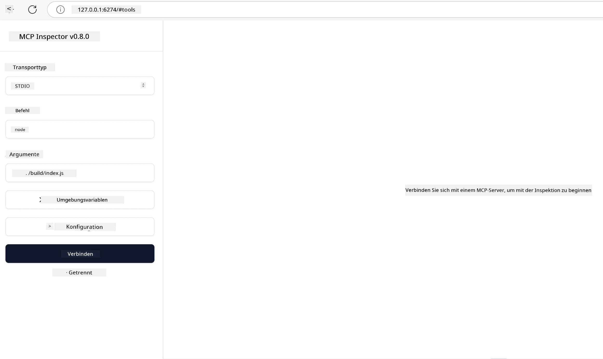

## Testen und Debuggen

Bevor Sie mit dem Testen Ihres MCP-Servers beginnen, ist es wichtig, die verfügbaren Werkzeuge und bewährten Methoden zum Debuggen zu verstehen. Effektives Testen stellt sicher, dass Ihr Server wie erwartet funktioniert und hilft Ihnen, Probleme schnell zu identifizieren und zu beheben. Der folgende Abschnitt beschreibt empfohlene Vorgehensweisen zur Validierung Ihrer MCP-Implementierung.

## Überblick

Diese Lektion behandelt, wie Sie den richtigen Testansatz und das effektivste Testwerkzeug auswählen.

## Lernziele

Am Ende dieser Lektion werden Sie in der Lage sein:

- Verschiedene Ansätze zum Testen zu beschreiben.
- Verschiedene Werkzeuge effizient für das Testen Ihres Codes zu verwenden.

## Testen von MCP-Servern

MCP stellt Werkzeuge zur Verfügung, die Ihnen beim Testen und Debuggen Ihrer Server helfen:

- **MCP Inspector**: Ein Kommandozeilenwerkzeug, das sowohl als CLI-Werkzeug als auch als visuelles Werkzeug ausgeführt werden kann.
- **Manuelles Testen**: Sie können ein Werkzeug wie curl verwenden, um Webanfragen auszuführen, aber jedes Werkzeug, das HTTP ausführen kann, ist geeignet.
- **Unit Testing**: Es ist möglich, Ihr bevorzugtes Testframework zu verwenden, um die Funktionen von Server und Client zu testen.

### Verwendung des MCP Inspector

Wir haben die Nutzung dieses Werkzeugs in vorherigen Lektionen beschrieben, aber sprechen hier auf höherer Ebene darüber. Es ist ein in Node.js geschriebenes Tool, das Sie durch Aufruf der ausführbaren Datei `npx` verwenden können. Diese lädt das Werkzeug temporär herunter, installiert es und bereinigt sich selbst, sobald die Anfrage ausgeführt wurde.

Der [MCP Inspector](https://github.com/modelcontextprotocol/inspector) hilft Ihnen:

- **Serverfähigkeiten entdecken**: Automatische Erkennung verfügbarer Ressourcen, Werkzeuge und Prompts
- **Ausführung von Werkzeugen testen**: Verschiedene Parameter ausprobieren und Antworten in Echtzeit sehen
- **Server-Metadaten anzeigen**: Serverinformationen, Schemata und Konfigurationen prüfen

Ein typischer Ablauf des Werkzeugs sieht folgendermaßen aus:

```bash
npx @modelcontextprotocol/inspector node build/index.js
```

Der obige Befehl startet einen MCP und dessen visuelle Benutzeroberfläche und öffnet eine lokale Webschnittstelle im Browser. Sie sehen ein Dashboard, das Ihre registrierten MCP-Server, deren verfügbare Werkzeuge, Ressourcen und Prompts anzeigt. Die Schnittstelle ermöglicht es Ihnen, interaktiv die Ausführung von Werkzeugen zu testen, Server-Metadaten zu inspizieren und Echtzeitantworten zu betrachten, was Ihnen die Validierung und das Debuggen Ihrer MCP-Server-Implementierungen erleichtert.

So könnte es aussehen: 

Sie können das Werkzeug auch im CLI-Modus ausführen, indem Sie das Attribut `--cli` hinzufügen. Hier ist ein Beispiel, wie das Werkzeug im "CLI"-Modus ausgeführt wird, das alle Werkzeuge auf dem Server auflistet:

```sh
npx @modelcontextprotocol/inspector --cli node build/index.js --method tools/list
```

### Manuelles Testen

Neben dem Ausführen des Inspector-Tools zum Testen der Server-Fähigkeiten besteht ein ähnlicher Ansatz darin, einen Client einzusetzen, der HTTP-Anfragen ausführen kann, wie z.B. curl.

Mit curl können Sie MCP-Server direkt über HTTP-Anfragen testen:

```bash
# Beispiel: Test-Server-Metadaten
curl http://localhost:3000/v1/metadata

# Beispiel: Ein Werkzeug ausführen
curl -X POST http://localhost:3000/v1/tools/execute \
  -H "Content-Type: application/json" \
  -d '{"name": "calculator", "parameters": {"expression": "2+2"}}'
```

Wie Sie aus dem obigen curl-Beispiel sehen, verwenden Sie eine POST-Anfrage, um ein Werkzeug mit einer Nutzlast aufzurufen, die den Namen des Werkzeugs und dessen Parameter enthält. Verwenden Sie den Ansatz, der am besten zu Ihnen passt. CLI-Werkzeuge sind im Allgemeinen schneller zu bedienen und lassen sich gut skripten, was insbesondere in CI/CD-Umgebungen nützlich sein kann.

### Unit Testing

Erstellen Sie Unit-Tests für Ihre Werkzeuge und Ressourcen, um sicherzustellen, dass sie wie erwartet funktionieren. Hier ist ein Beispielcode für Tests.

```python
import pytest

from mcp.server.fastmcp import FastMCP
from mcp.shared.memory import (
    create_connected_server_and_client_session as create_session,
)

# Markiere das gesamte Modul für asynchrone Tests
pytestmark = pytest.mark.anyio


async def test_list_tools_cursor_parameter():
    """Test that the cursor parameter is accepted for list_tools.

    Note: FastMCP doesn't currently implement pagination, so this test
    only verifies that the cursor parameter is accepted by the client.
    """

 server = FastMCP("test")

    # Erstelle ein paar Testwerkzeuge
    @server.tool(name="test_tool_1")
    async def test_tool_1() -> str:
        """First test tool"""
        return "Result 1"

    @server.tool(name="test_tool_2")
    async def test_tool_2() -> str:
        """Second test tool"""
        return "Result 2"

    async with create_session(server._mcp_server) as client_session:
        # Teste ohne Cursor-Parameter (ausgelassen)
        result1 = await client_session.list_tools()
        assert len(result1.tools) == 2

        # Teste mit Cursor=None
        result2 = await client_session.list_tools(cursor=None)
        assert len(result2.tools) == 2

        # Teste mit Cursor als Zeichenkette
        result3 = await client_session.list_tools(cursor="some_cursor_value")
        assert len(result3.tools) == 2

        # Teste mit leerem String als Cursor
        result4 = await client_session.list_tools(cursor="")
        assert len(result4.tools) == 2
    
```

Der obige Code macht Folgendes:

- Verwendet das pytest-Framework, mit dem Sie Tests als Funktionen erstellen und assert-Anweisungen verwenden können.
- Erstellt einen MCP-Server mit zwei verschiedenen Werkzeugen.
- Verwendet `assert`, um sicherzustellen, dass bestimmte Bedingungen erfüllt sind.

Sehen Sie sich die [vollständige Datei hier an](https://github.com/modelcontextprotocol/python-sdk/blob/main/tests/client/test_list_methods_cursor.py).

Anhand der obigen Datei können Sie Ihren eigenen Server testen, um sicherzustellen, dass die Fähigkeiten wie vorgesehen erstellt werden.

Alle wichtigen SDKs enthalten ähnliche Tests, sodass Sie diese an Ihre bevorzugte Laufzeitumgebung anpassen können.

## Beispiele

- [Java Rechner](../samples/java/calculator/README.md)
- [.Net Rechner](../../../../03-GettingStarted/samples/csharp)
- [JavaScript Rechner](../samples/javascript/README.md)
- [TypeScript Rechner](../samples/typescript/README.md)
- [Python Rechner](../../../../03-GettingStarted/samples/python)

## Zusätzliche Ressourcen

- [Python SDK](https://github.com/modelcontextprotocol/python-sdk)

## Was kommt als Nächstes

- Weiter: [Bereitstellung](../09-deployment/README.md)

---

<!-- CO-OP TRANSLATOR DISCLAIMER START -->
**Haftungsausschluss**:  
Dieses Dokument wurde mit dem KI-Übersetzungsdienst [Co-op Translator](https://github.com/Azure/co-op-translator) übersetzt. Obwohl wir uns um Genauigkeit bemühen, beachten Sie bitte, dass automatisierte Übersetzungen Fehler oder Ungenauigkeiten enthalten können. Das Originaldokument in seiner ursprünglichen Sprache gilt als maßgebliche Quelle. Für wichtige Informationen wird eine professionelle menschliche Übersetzung empfohlen. Wir übernehmen keine Haftung für Missverständnisse oder Fehlinterpretationen, die durch die Nutzung dieser Übersetzung entstehen.
<!-- CO-OP TRANSLATOR DISCLAIMER END -->