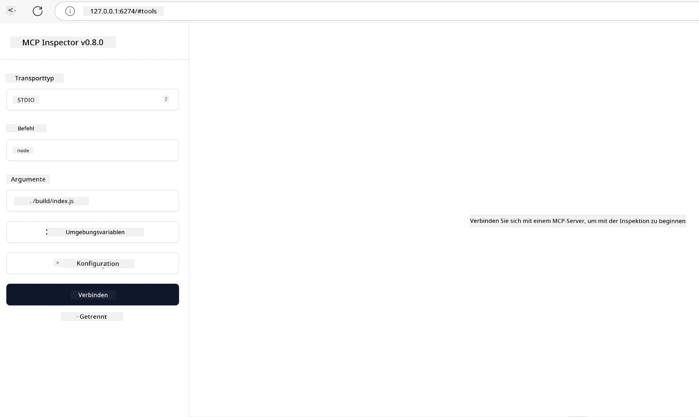

## Testen und Debuggen

Bevor Sie mit dem Testen Ihres MCP-Servers beginnen, ist es wichtig, die verfügbaren Werkzeuge und bewährten Methoden zum Debuggen zu verstehen. Effektives Testen stellt sicher, dass Ihr Server wie erwartet funktioniert und hilft Ihnen, Probleme schnell zu identifizieren und zu lösen. Der folgende Abschnitt beschreibt empfohlene Vorgehensweisen zur Validierung Ihrer MCP-Implementierung.

## Überblick

Diese Lektion behandelt, wie man die richtige Testmethode und das effektivste Testwerkzeug auswählt.

## Lernziele

Am Ende dieser Lektion werden Sie in der Lage sein:

- Verschiedene Ansätze zum Testen zu beschreiben.
- Unterschiedliche Werkzeuge zu verwenden, um Ihren Code effektiv zu testen.


## Testen von MCP-Servern

MCP bietet Werkzeuge, die Ihnen beim Testen und Debuggen Ihrer Server helfen:

- **MCP Inspector**: Ein Kommandozeilenwerkzeug, das sowohl als CLI-Tool als auch als visuelles Tool verwendet werden kann.
- **Manuelles Testen**: Sie können ein Werkzeug wie curl verwenden, um Webanfragen auszuführen, aber jedes Tool, das HTTP ausführen kann, ist geeignet.
- **Unit Testing**: Es ist möglich, Ihr bevorzugtes Testframework zu verwenden, um die Funktionen von Server und Client zu testen.

### Verwendung des MCP Inspectors

Die Nutzung dieses Tools wurde in vorherigen Lektionen beschrieben, aber sprechen wir ein wenig auf hoher Ebene darüber. Es ist ein in Node.js entwickeltes Tool und Sie können es verwenden, indem Sie die ausführbare Datei `npx` aufrufen, die das Tool vorübergehend herunterlädt und installiert und sich nach Ausführung Ihrer Anfrage selbst wieder bereinigt.

Der [MCP Inspector](https://github.com/modelcontextprotocol/inspector) hilft Ihnen:

- **Serverfähigkeiten entdecken**: Automatische Erkennung verfügbarer Ressourcen, Werkzeuge und Aufforderungen
- **Testausführung von Werkzeugen**: Verschiedene Parameter ausprobieren und Antworten in Echtzeit sehen
- **Server-Metadaten anzeigen**: Serverinformationen, Schemata und Konfigurationen überprüfen

Ein typischer Ablauf mit dem Tool sieht so aus:

```bash
npx @modelcontextprotocol/inspector node build/index.js
```

Der obige Befehl startet einen MCP und dessen visuelle Oberfläche und öffnet eine lokale Weboberfläche in Ihrem Browser. Sie können ein Dashboard erwarten, das Ihre registrierten MCP-Server, deren verfügbare Werkzeuge, Ressourcen und Aufforderungen anzeigt. Die Oberfläche ermöglicht es Ihnen, die Ausführung von Werkzeugen interaktiv zu testen, Server-Metadaten zu inspizieren und Echtzeitantworten zu sehen, was die Validierung und das Debuggen Ihrer MCP-Serverimplementierungen erleichtert.

So könnte das aussehen: 

Sie können dieses Tool auch im CLI-Modus ausführen, wofür Sie das Attribut `--cli` hinzufügen. Hier ein Beispiel für die Ausführung des Tools im „CLI“-Modus, der alle Werkzeuge auf dem Server auflistet:

```sh
npx @modelcontextprotocol/inspector --cli node build/index.js --method tools/list
```

### Manuelles Testen

Neben der Ausführung des Inspector-Tools, um Serverfähigkeiten zu testen, ist ein ähnlicher Ansatz das Ausführen eines Clients, der HTTP verwenden kann, wie zum Beispiel curl.

Mit curl können Sie MCP-Server direkt mittels HTTP-Anfragen testen:

```bash
# Beispiel: Testserver-Metadaten
curl http://localhost:3000/v1/metadata

# Beispiel: Werkzeug ausführen
curl -X POST http://localhost:3000/v1/tools/execute \
  -H "Content-Type: application/json" \
  -d '{"name": "calculator", "parameters": {"expression": "2+2"}}'
```

Wie Sie am obigen Einsatz von curl sehen können, verwenden Sie eine POST-Anfrage, um ein Werkzeug mit einer Nutzlast aufzurufen, die den Namen des Werkzeugs und seine Parameter enthält. Verwenden Sie die Methode, die am besten zu Ihnen passt. CLI-Werkzeuge sind im Allgemeinen schneller zu bedienen und lassen sich gut skripten, was in einer CI/CD-Umgebung nützlich sein kann.

### Unit Testing

Erstellen Sie Unittests für Ihre Werkzeuge und Ressourcen, um sicherzustellen, dass sie wie erwartet funktionieren. Hier ist ein Beispiel-Code für Tests.

```python
import pytest

from mcp.server.fastmcp import FastMCP
from mcp.shared.memory import (
    create_connected_server_and_client_session as create_session,
)

# Markiere das gesamte Modul für asynchrone Tests
pytestmark = pytest.mark.anyio


async def test_list_tools_cursor_parameter():
    """Test that the cursor parameter is accepted for list_tools.

    Note: FastMCP doesn't currently implement pagination, so this test
    only verifies that the cursor parameter is accepted by the client.
    """

 server = FastMCP("test")

    # Erstelle ein paar Testwerkzeuge
    @server.tool(name="test_tool_1")
    async def test_tool_1() -> str:
        """First test tool"""
        return "Result 1"

    @server.tool(name="test_tool_2")
    async def test_tool_2() -> str:
        """Second test tool"""
        return "Result 2"

    async with create_session(server._mcp_server) as client_session:
        # Teste ohne Cursor-Parameter (weggelassen)
        result1 = await client_session.list_tools()
        assert len(result1.tools) == 2

        # Teste mit Cursor=None
        result2 = await client_session.list_tools(cursor=None)
        assert len(result2.tools) == 2

        # Teste mit Cursor als Zeichenkette
        result3 = await client_session.list_tools(cursor="some_cursor_value")
        assert len(result3.tools) == 2

        # Teste mit leerem String als Cursor
        result4 = await client_session.list_tools(cursor="")
        assert len(result4.tools) == 2
    
```

Der vorherige Code macht Folgendes:

- Nutzt das pytest-Framework, mit dem Sie Tests als Funktionen erstellen und assert-Anweisungen verwenden können.
- Erstellt einen MCP-Server mit zwei verschiedenen Werkzeugen.
- Verwendet `assert`, um zu überprüfen, dass bestimmte Bedingungen erfüllt sind.

Sehen Sie sich die [gesamte Datei hier](https://github.com/modelcontextprotocol/python-sdk/blob/main/tests/client/test_list_methods_cursor.py) an

Mit der obigen Datei können Sie Ihren eigenen Server testen, um sicherzustellen, dass die Fähigkeiten wie vorgesehen erstellt werden.

Alle großen SDKs haben ähnliche Testabschnitte, sodass Sie sich an Ihre gewählte Laufzeitumgebung anpassen können.

## Beispiele 

- [Java-Rechner](../samples/java/calculator/README.md)
- [.Net-Rechner](../../../../03-GettingStarted/samples/csharp)
- [JavaScript-Rechner](../samples/javascript/README.md)
- [TypeScript-Rechner](../samples/typescript/README.md)
- [Python-Rechner](../../../../03-GettingStarted/samples/python) 

## Zusätzliche Ressourcen

- [Python SDK](https://github.com/modelcontextprotocol/python-sdk)

## Was kommt als Nächstes

- Danach: [Deployment](../09-deployment/README.md)

---

<!-- CO-OP TRANSLATOR DISCLAIMER START -->
**Haftungsausschluss**:
Dieses Dokument wurde mit dem KI-Übersetzungsdienst [Co-op Translator](https://github.com/Azure/co-op-translator) übersetzt. Obwohl wir uns um Genauigkeit bemühen, beachten Sie bitte, dass automatisierte Übersetzungen Fehler oder Ungenauigkeiten enthalten können. Das Originaldokument in seiner Ursprungssprache gilt als maßgebliche Quelle. Bei kritischen Informationen wird eine professionelle menschliche Übersetzung empfohlen. Wir übernehmen keine Haftung für Missverständnisse oder Fehlinterpretationen, die aus der Verwendung dieser Übersetzung entstehen.
<!-- CO-OP TRANSLATOR DISCLAIMER END -->