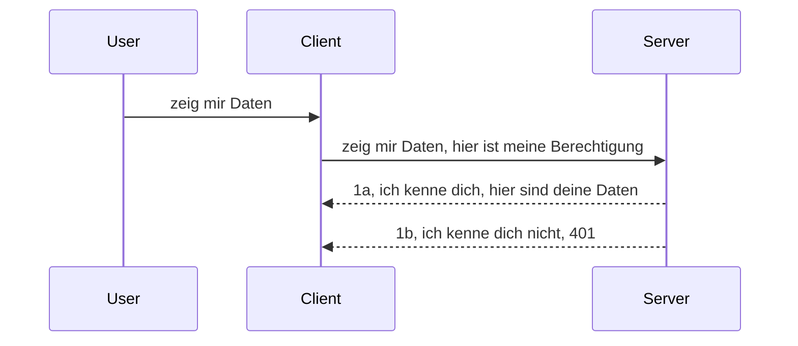

# Einfache Authentifizierung

MCP SDKs unterstützen die Verwendung von OAuth 2.1, was zugegeben ein ziemlich komplexer Prozess ist, der Konzepte wie Auth-Server, Ressourcen-Server, das Posten von Anmeldedaten, das Erhalten eines Codes, den Austausch dieses Codes gegen ein Bearer-Token umfasst, bis man schließlich auf die Ressourcendaten zugreifen kann. Wenn Sie OAuth nicht gewohnt sind, was eine großartige Sache ist zu implementieren, ist es eine gute Idee, mit einem grundlegenden Authentifizierungsniveau zu beginnen und sich zu immer besserer Sicherheit vorzuarbeiten. Deshalb existiert dieses Kapitel, um Sie hin zu fortgeschrittenerer Authentifizierung zu führen.

## Auth, was meinen wir?

Auth steht für Authentifizierung und Autorisierung. Die Idee ist, dass wir zwei Dinge tun müssen:

- **Authentifizierung**, das ist der Prozess herauszufinden, ob wir einer Person erlauben, unser Haus zu betreten, also ob sie das Recht hat, "hier" zu sein, das heißt Zugriff auf unseren Ressourcen-Server zu haben, auf dem unsere MCP-Server-Funktionen laufen.
- **Autorisierung**, ist der Prozess herauszufinden, ob ein Benutzer Zugang zu den spezifischen Ressourcen haben sollte, nach denen er fragt, zum Beispiel diese Bestellungen oder diese Produkte, oder ob ihm zum Beispiel nur erlaubt ist, den Inhalt zu lesen, aber nicht zu löschen.

## Anmeldeinformationen: wie wir dem System sagen, wer wir sind

Nun, die meisten Web-Entwickler denken in der Regel daran, dem Server eine Anmeldeinformation zu übermitteln, üblicherweise ein Geheimnis, das aussagt, ob sie hier "Authentifizierung" sein dürfen. Diese Anmeldeinformation ist meistens eine base64-kodierte Version von Benutzername und Passwort oder ein API-Schlüssel, der einen spezifischen Benutzer eindeutig identifiziert.

Dies geschieht durch das Senden über einen Header namens "Authorization", so:

```json
{ "Authorization": "secret123" }
```

Dies wird normalerweise als Basic Authentication bezeichnet. Wie der gesamte Ablauf dann funktioniert, sieht folgendermaßen aus:


Jetzt, wo wir verstehen, wie es aus Flusssicht funktioniert, wie implementieren wir es? Nun, die meisten Webserver haben ein Konzept namens Middleware, ein Codeabschnitt, der als Teil der Anfrage läuft, Anmeldeinformationen überprüfen kann und wenn diese gültig sind, die Anfrage durchlässt. Wenn die Anfrage keine gültigen Anmeldeinformationen besitzt, erhält man einen Auth-Fehler. Sehen wir uns an, wie das implementiert werden kann:

**Python**

```python
class AuthMiddleware(BaseHTTPMiddleware):
    async def dispatch(self, request, call_next):

        has_header = request.headers.get("Authorization")
        if not has_header:
            print("-> Missing Authorization header!")
            return Response(status_code=401, content="Unauthorized")

        if not valid_token(has_header):
            print("-> Invalid token!")
            return Response(status_code=403, content="Forbidden")

        print("Valid token, proceeding...")
       
        response = await call_next(request)
        # Fügen Sie beliebige Kunden-Header hinzu oder ändern Sie die Antwort auf irgendeine Weise
        return response


starlette_app.add_middleware(CustomHeaderMiddleware)
```

Hier haben wir:

- Eine Middleware namens `AuthMiddleware` erstellt, dessen `dispatch` Methode vom Webserver aufgerufen wird.
- Die Middleware dem Webserver hinzugefügt:

    ```python
    starlette_app.add_middleware(AuthMiddleware)
    ```

- Eine Validierungslogik geschrieben, die prüft, ob der Authorization-Header vorhanden ist und ob das gesendete Geheimnis gültig ist:

    ```python
    has_header = request.headers.get("Authorization")
    if not has_header:
        print("-> Missing Authorization header!")
        return Response(status_code=401, content="Unauthorized")

    if not valid_token(has_header):
        print("-> Invalid token!")
        return Response(status_code=403, content="Forbidden")
    ```

    wenn das Geheimnis vorhanden und gültig ist, lassen wir die Anfrage durch, indem wir `call_next` aufrufen und die Antwort zurückgeben.

    ```python
    response = await call_next(request)
    # Fügen Sie beliebige Kunden-Header hinzu oder ändern Sie die Antwort auf irgendeine Weise
    return response
    ```

Die Funktionsweise ist so, dass, wenn eine Web-Anfrage an den Server geschickt wird, die Middleware aufgerufen wird und entsprechend ihrer Implementierung entweder die Anfrage durchlässt oder einen Fehler zurückgibt, der anzeigt, dass der Client nicht weitermachen darf.

**TypeScript**

Hier erstellen wir eine Middleware mit dem populären Framework Express und fangen die Anfrage ab, bevor sie den MCP Server erreicht. Hier ist der Code dazu:

```typescript
function isValid(secret) {
    return secret === "secret123";
}

app.use((req, res, next) => {
    // 1. Autorisierungs-Header vorhanden?
    if(!req.headers["Authorization"]) {
        res.status(401).send('Unauthorized');
    }
    
    let token = req.headers["Authorization"];

    // 2. Gültigkeit prüfen.
    if(!isValid(token)) {
        res.status(403).send('Forbidden');
    }

   
    console.log('Middleware executed');
    // 3. Gibt die Anfrage an den nächsten Schritt in der Anfragen-Pipeline weiter.
    next();
});
```

In diesem Code:

1. Prüfen wir zuerst, ob der Authorization Header überhaupt vorhanden ist, wenn nicht, senden wir einen 401-Fehler.
2. Stellen wir sicher, dass das Credential/Token gültig ist, wenn nicht, senden wir einen 403-Fehler.
3. Schließlich wird die Anfrage weitergeleitet in der Request-Pipeline und die angefragte Ressource zurückgegeben.

## Übung: Implementiere Authentifizierung

Lassen Sie uns unser Wissen anwenden und die Implementierung ausprobieren. Hier ist der Plan:

Server

- Erstelle einen Webserver und eine MCP Instanz.
- Implementiere eine Middleware für den Server.

Client

- Sende eine Web-Anfrage mit Anmeldeinformation über den Header.

### -1- Erstelle einen Webserver und eine MCP Instanz

Im ersten Schritt müssen wir die Webserver-Instanz und den MCP Server anlegen.

**Python**

Hier erstellen wir eine MCP Server-Instanz, erstellen eine starlette Web-App und hosten diese mit uvicorn.

```python
# MCP-Server wird erstellt

app = FastMCP(
    name="MCP Resource Server",
    instructions="Resource Server that validates tokens via Authorization Server introspection",
    host=settings["host"],
    port=settings["port"],
    debug=True
)

# starlette Web-App wird erstellt
starlette_app = app.streamable_http_app()

# App wird über uvicorn bereitgestellt
async def run(starlette_app):
    import uvicorn
    config = uvicorn.Config(
            starlette_app,
            host=app.settings.host,
            port=app.settings.port,
            log_level=app.settings.log_level.lower(),
        )
    server = uvicorn.Server(config)
    await server.serve()

run(starlette_app)
```

In diesem Code:

- Erstellen wir den MCP Server.
- Konstruieren die starlette Web-App aus dem MCP Server mit `app.streamable_http_app()`.
- Hosten und bedienen die Web-App mit uvicorn durch `server.serve()`.

**TypeScript**

Hier erstellen wir eine MCP Server-Instanz.

```typescript
const server = new McpServer({
      name: "example-server",
      version: "1.0.0"
    });

    // ... Serverressourcen, Werkzeuge und Eingabeaufforderungen einrichten ...
```

Diese MCP Server-Erstellung muss in unserer POST /mcp Route-Definition geschehen, also verschieben wir den obigen Code so:

```typescript
import express from "express";
import { randomUUID } from "node:crypto";
import { McpServer } from "@modelcontextprotocol/sdk/server/mcp.js";
import { StreamableHTTPServerTransport } from "@modelcontextprotocol/sdk/server/streamableHttp.js";
import { isInitializeRequest } from "@modelcontextprotocol/sdk/types.js"

const app = express();
app.use(express.json());

// Karte zum Speichern von Transporten nach Sitzungs-ID
const transports: { [sessionId: string]: StreamableHTTPServerTransport } = {};

// Verarbeitung von POST-Anfragen für die Kommunikation vom Client zum Server
app.post('/mcp', async (req, res) => {
  // Überprüfung auf vorhandene Sitzungs-ID
  const sessionId = req.headers['mcp-session-id'] as string | undefined;
  let transport: StreamableHTTPServerTransport;

  if (sessionId && transports[sessionId]) {
    // Wiederverwendung des vorhandenen Transports
    transport = transports[sessionId];
  } else if (!sessionId && isInitializeRequest(req.body)) {
    // Neue Initialisierungsanfrage
    transport = new StreamableHTTPServerTransport({
      sessionIdGenerator: () => randomUUID(),
      onsessioninitialized: (sessionId) => {
        // Transport nach Sitzungs-ID speichern
        transports[sessionId] = transport;
      },
      // DNS-Rebinding-Schutz ist standardmäßig deaktiviert für Rückwärtskompatibilität. Wenn Sie diesen Server
      // lokal ausführen, stellen Sie sicher, dass Sie Folgendes festlegen:
      // enableDnsRebindingProtection: true,
      // allowedHosts: ['127.0.0.1'],
    });

    // Transport bereinigen, wenn er geschlossen wird
    transport.onclose = () => {
      if (transport.sessionId) {
        delete transports[transport.sessionId];
      }
    };
    const server = new McpServer({
      name: "example-server",
      version: "1.0.0"
    });

    // ... Serverressourcen, Werkzeuge und Eingabeaufforderungen einrichten ...

    // Verbindung zum MCP-Server herstellen
    await server.connect(transport);
  } else {
    // Ungültige Anforderung
    res.status(400).json({
      jsonrpc: '2.0',
      error: {
        code: -32000,
        message: 'Bad Request: No valid session ID provided',
      },
      id: null,
    });
    return;
  }

  // Anfrage bearbeiten
  await transport.handleRequest(req, res, req.body);
});

// Wiederverwendbarer Handler für GET- und DELETE-Anfragen
const handleSessionRequest = async (req: express.Request, res: express.Response) => {
  const sessionId = req.headers['mcp-session-id'] as string | undefined;
  if (!sessionId || !transports[sessionId]) {
    res.status(400).send('Invalid or missing session ID');
    return;
  }
  
  const transport = transports[sessionId];
  await transport.handleRequest(req, res);
};

// Verarbeitung von GET-Anfragen für serverseitige Benachrichtigungen an den Client via SSE
app.get('/mcp', handleSessionRequest);

// Verarbeitung von DELETE-Anfragen zum Beenden der Sitzung
app.delete('/mcp', handleSessionRequest);

app.listen(3000);
```

Jetzt sehen Sie, wie die MCP Server-Erstellung innerhalb von `app.post("/mcp")` verschoben wurde.

Weiter zum nächsten Schritt, der Erstellung der Middleware, damit wir die eingehenden Anmeldedaten validieren können.

### -2- Implementiere eine Middleware für den Server

Kommen wir nun zum Middleware-Teil. Hier erstellen wir eine Middleware, die nach einer Anmeldeinformation im `Authorization`-Header sucht und diese validiert. Wenn sie akzeptabel ist, wird die Anfrage weitergeleitet, um das zu tun, was sie soll (z. B. Tools auflisten, eine Ressource lesen oder welche MCP-Funktionalität auch immer angefragt wurde).

**Python**

Um die Middleware zu erstellen, müssen wir eine Klasse erstellen, die von `BaseHTTPMiddleware` erbt. Es gibt zwei interessante Teile:

- Die Anfrage `request`, aus der wir die Header-Informationen lesen.
- `call_next`, den Callback, den wir aufrufen müssen, wenn der Client eine akzeptierte Anmeldeinformation übergeben hat.

Zunächst müssen wir den Fall behandeln, dass der `Authorization`-Header fehlt:

```python
has_header = request.headers.get("Authorization")

# kein Header vorhanden, mit 401 fehlschlagen, andernfalls fortfahren.
if not has_header:
    print("-> Missing Authorization header!")
    return Response(status_code=401, content="Unauthorized")
```

Hier senden wir eine 401 Unauthorized Nachricht, da der Client bei der Authentifizierung scheitert.

Als nächstes, wenn eine Anmeldeinformation übermittelt wurde, müssen wir ihre Gültigkeit so überprüfen:

```python
 if not valid_token(has_header):
    print("-> Invalid token!")
    return Response(status_code=403, content="Forbidden")
```

Beachten Sie, wie wir oben eine 403 Forbidden Nachricht senden. Sehen wir uns die vollständige Middleware unten an, die alles umsetzt, was wir oben erwähnt haben:

```python
class AuthMiddleware(BaseHTTPMiddleware):
    async def dispatch(self, request, call_next):

        has_header = request.headers.get("Authorization")
        if not has_header:
            print("-> Missing Authorization header!")
            return Response(status_code=401, content="Unauthorized")

        if not valid_token(has_header):
            print("-> Invalid token!")
            return Response(status_code=403, content="Forbidden")

        print("Valid token, proceeding...")
        print(f"-> Received {request.method} {request.url}")
        response = await call_next(request)
        response.headers['Custom'] = 'Example'
        return response

```

Super, aber was ist mit der Funktion `valid_token`? Hier ist sie unten:
:

```python
# NICHT für die Produktion verwenden - verbessern Sie es !!
def valid_token(token: str) -> bool:
    # Entfernen Sie das Präfix "Bearer "
    if token.startswith("Bearer "):
        token = token[7:]
        return token == "secret-token"
    return False
```

Das sollte natürlich verbessert werden.

WICHTIG: Sie sollten NIE Geheimnisse wie dieses im Code haben. Idealerweise sollten Sie den Wert, mit dem verglichen wird, aus einer Datenquelle oder von einem IDP (Identity Service Provider) beziehen oder noch besser, den IDP die Validierung machen lassen.

**TypeScript**

Um dies mit Express umzusetzen, müssen wir die `use` Methode aufrufen, die Middleware-Funktionen akzeptiert.

Wir müssen:

- Mit der Anfrage-Variable interagieren, um die übergebene Anmeldeinformation im `Authorization`-Feld zu prüfen.
- Die Anmeldeinformation validieren und wenn gültig, die Anfrage weiterlaufen lassen und die MCP-Anfrage des Clients wie vorgesehen ausführen lassen (z. B. Tools auflisten, Ressource lesen oder andere MCP-Funktionen).

Hier prüfen wir, ob der `Authorization` Header vorhanden ist und wenn nicht, stoppen wir die Anfrage:

```typescript
if(!req.headers["authorization"]) {
    res.status(401).send('Unauthorized');
    return;
}
```

Wenn der Header von Anfang an nicht gesendet wird, erhält man eine 401.

Als Nächstes prüfen wir, ob die Anmeldeinformation gültig ist, wenn nicht, stoppen wir die Anfrage erneut, diesmal mit einer leicht anderen Nachricht:

```typescript
if(!isValid(token)) {
    res.status(403).send('Forbidden');
    return;
} 
```

Siehe, dass jetzt ein 403 Fehler zurückgegeben wird.

Hier der vollständige Code:

```typescript
app.use((req, res, next) => {
    console.log('Request received:', req.method, req.url, req.headers);
    console.log('Headers:', req.headers["authorization"]);
    if(!req.headers["authorization"]) {
        res.status(401).send('Unauthorized');
        return;
    }
    
    let token = req.headers["authorization"];

    if(!isValid(token)) {
        res.status(403).send('Forbidden');
        return;
    }  

    console.log('Middleware executed');
    next();
});
```

Wir haben den Webserver so eingerichtet, dass eine Middleware die Anmeldeinformationen prüft, die der Client hoffentlich sendet. Aber wie sieht es mit dem Client selbst aus?

### -3- Sende Web-Anfrage mit Anmeldeinformation über den Header

Wir müssen sicherstellen, dass der Client die Anmeldeinformation über den Header übermittelt. Da wir einen MCP Client dafür verwenden wollen, müssen wir herausfinden, wie das geht.

**Python**

Für den Client müssen wir einen Header mit unseren Anmeldeinformationen übergeben, so:

```python
# SCHREIBE den Wert nicht fest, speichere ihn mindestens in einer Umgebungsvariable oder in einem sichereren Speicher
token = "secret-token"

async with streamablehttp_client(
        url = f"http://localhost:{port}/mcp",
        headers = {"Authorization": f"Bearer {token}"}
    ) as (
        read_stream,
        write_stream,
        session_callback,
    ):
        async with ClientSession(
            read_stream,
            write_stream
        ) as session:
            await session.initialize()
      
            # TODO, was im Client gemacht werden soll, z.B. Werkzeuge auflisten, Werkzeuge aufrufen etc.
```

Beachten Sie, wie wir die `headers` Eigenschaft so befüllen ` headers = {"Authorization": f"Bearer {token}"}`.

**TypeScript**

Wir können das in zwei Schritten lösen:

1. Erstelle ein Konfigurationsobjekt mit unseren Anmeldeinformationen.
2. Übergebe das Konfigurationsobjekt an den Transport.

```typescript

// WERTE NICHT wie hier gezeigt fest kodieren. Mindestens sollte es als Umgebungsvariable vorliegen und etwas wie dotenv (im Entwicklungsmodus) verwenden.
let token = "secret123"

// definiere ein Client-Transport-Optionsobjekt
let options: StreamableHTTPClientTransportOptions = {
  sessionId: sessionId,
  requestInit: {
    headers: {
      "Authorization": "secret123"
    }
  }
};

// übergebe das Optionsobjekt an den Transport
async function main() {
   const transport = new StreamableHTTPClientTransport(
      new URL(serverUrl),
      options
   );
```

Hier sieht man, wie wir ein `options`-Objekt erstellen mussten und unsere Header unter der Eigenschaft `requestInit` ablegen.

WICHTIG: Wie verbessern wir das hier? Nun, die aktuelle Implementierung hat einige Probleme. Erstens ist das Übergeben einer Anmeldeinformation so riskant, sofern man nicht mindestens HTTPS verwendet. Selbst dann kann die Anmeldeinformation gestohlen werden, weshalb man ein System braucht, in dem man das Token einfach widerrufen kann und zusätzliche Prüfungen hinzufügt, wie z. B. aus welchem Teil der Welt die Anfrage kommt, ob die Anfrage viel zu häufig erfolgt (bot-ähnliches Verhalten), kurz gesagt eine ganze Reihe von Sicherheitsaspekten.

Man muss aber sagen, dass das für sehr einfache APIs, bei denen niemand die API aufrufen soll ohne Authentifizierung, was wir hier haben ein guter Start ist.

Das gesagt, versuchen wir, die Sicherheit etwas zu härten, indem wir ein standardisiertes Format verwenden wie JSON Web Token, auch bekannt als JWT oder „JOT“ Token.

## JSON Web Tokens, JWT

Wir versuchen also, die Situation gegenüber sehr einfachen Anmeldeinformationen zu verbessern. Welche direkten Verbesserungen erhalten wir, wenn wir JWT verwenden?

- **Sicherheitsverbesserungen**. Bei Basic Auth senden Sie Benutzername und Passwort als base64-kodiertes Token (oder senden einen API Key) immer wieder, was das Risiko erhöht. Mit JWT senden Sie Ihren Benutzernamen und Ihr Passwort und erhalten im Gegenzug ein Token, das außerdem zeitlich begrenzt ist, also abläuft. JWT ermöglicht außerdem eine feingranulare Zugriffskontrolle mit Rollen, Bereichen und Berechtigungen.
- **Zustandslosigkeit und Skalierbarkeit**. JWTs sind selbstenthaltend, sie tragen alle Benutzerinformationen und eliminieren die Notwendigkeit, serverseitige Sessions zu speichern. Das Token kann auch lokal validiert werden.
- **Interoperabilität und Föderation**. JWTs sind zentraler Bestandteil von Open ID Connect und werden mit bekannten Identitätsanbietern wie Entra ID, Google Identity und Auth0 genutzt. Sie ermöglichen auch Single-Sign-On und vieles mehr, womit sie auf Unternehmensebene funktionieren.
- **Modularität und Flexibilität**. JWTs können auch mit API Gateways wie Azure API Management, NGINX und anderen genutzt werden. Sie unterstützen Nutzungsszenarien für Authentifizierung und serverseitige Dienst-zu-Dienst-Kommunikation einschließlich Impersonifikation und Delegation.
- **Performance und Caching**. JWTs können nach dem Dekodieren zwischengespeichert werden, was die Notwendigkeit für häufiges Parsen reduziert. Das hilft insbesondere bei stark frequentierten Anwendungen, indem Durchsatz verbessert und Last auf Infrastruktur reduziert wird.
- **Erweiterte Funktionen**. Sie unterstützen auch Introspektion (Prüfung der Gültigkeit auf Server) und Widerruf (Ein Token ungültig machen).

Mit all diesen Vorteilen sehen wir uns an, wie wir unsere Implementierung auf die nächste Stufe heben.

## Basic Auth in JWT umwandeln

Die Änderungen, die wir auf hohem Niveau vornehmen müssen, sind:

- **Lernen, ein JWT Token zu konstruieren** und es bereit machen, vom Client zum Server gesendet zu werden.
- **Ein JWT Token validieren** und falls gültig, dem Client Zugriff auf unsere Ressourcen geben.
- **Sichere Token-Speicherung**. Wie wir dieses Token speichern.
- **Schutz der Routen**. Wir müssen die Routen schützen, in unserem Fall Routen und spezifische MCP Features.
- **Refresh Tokens hinzufügen**. Sicherstellen, dass kurze Tokens ausgegeben werden, aber auch lang lebende Refresh Tokens, die benutzt werden können, um neue Tokens zu erhalten, wenn sie ablaufen. Außerdem muss es einen Refresh-Endpunkt und eine Rotationsstrategie geben.

### -1- Ein JWT Token konstruieren

Zuerst hat ein JWT Token folgende Teile:

- **Header**, genutzter Algorithmus und Token-Typ.
- **Payload**, Anspruchsdaten (Claims), z.B. sub (der Benutzer oder das Subjekt, das das Token repräsentiert, in Auth-Szenarien typischerweise die Benutzer-ID), exp (Ablaufzeitpunkt), role (die Rolle).
- **Signatur**, signiert mit einem Geheimnis oder privaten Schlüssel.

Dafür müssen wir Header, Payload und das kodierte Token konstruieren.

**Python**

```python

import jwt
import jwt
from jwt.exceptions import ExpiredSignatureError, InvalidTokenError
import datetime

# Geheimer Schlüssel, der zur Signierung des JWT verwendet wird
secret_key = 'your-secret-key'

header = {
    "alg": "HS256",
    "typ": "JWT"
}

# die Benutzerinformationen sowie deren Ansprüche und Ablaufzeit
payload = {
    "sub": "1234567890",               # Betreff (Benutzer-ID)
    "name": "User Userson",                # Benutzerdefinierter Anspruch
    "admin": True,                     # Benutzerdefinierter Anspruch
    "iat": datetime.datetime.utcnow(),# Ausgestellt am
    "exp": datetime.datetime.utcnow() + datetime.timedelta(hours=1)  # Ablauf
}

# kodieren Sie es
encoded_jwt = jwt.encode(payload, secret_key, algorithm="HS256", headers=header)
```

Im obigen Code haben wir:

- Einen Header definiert, der HS256 als Algorithmus nutzt und Typ JWT.
- Eine Payload erstellt, die ein Subjekt oder Benutzer-ID, einen Benutzernamen, eine Rolle, wann es ausgestellt wurde und wann es ausläuft, enthält und so den zuvor erwähnten zeitlich begrenzten Aspekt implementiert.

**TypeScript**

Hier benötigen wir einige Abhängigkeiten, die uns beim Konstruieren des JWT Tokens helfen.

Abhängigkeiten

```sh

npm install jsonwebtoken
npm install --save-dev @types/jsonwebtoken
```

Jetzt, wo wir das haben, erstellen wir Header, Payload und daraus den kodierten Token.

```typescript
import jwt from 'jsonwebtoken';

const secretKey = 'your-secret-key'; // Umgebungsvariablen in der Produktion verwenden

// Definiere die Nutzlast
const payload = {
  sub: '1234567890',
  name: 'User usersson',
  admin: true,
  iat: Math.floor(Date.now() / 1000), // Ausgestellt am
  exp: Math.floor(Date.now() / 1000) + 60 * 60 // Läuft in 1 Stunde ab
};

// Definiere den Header (optional, jsonwebtoken verwendet Standardwerte)
const header = {
  alg: 'HS256',
  typ: 'JWT'
};

// Erstelle das Token
const token = jwt.sign(payload, secretKey, {
  algorithm: 'HS256',
  header: header
});

console.log('JWT:', token);
```

Dieses Token ist:

Signiert mit HS256
Eine Stunde gültig
Enthält Claims wie sub, name, admin, iat und exp.

### -2- Ein Token validieren

Wir müssen ebenfalls ein Token validieren, das sollte auf dem Server geschehen, um sicherzustellen, dass das, was der Client uns schickt, tatsächlich gültig ist. Es gibt viele Prüfungen, die wir durchführen sollten, von Strukturprüfung bis zur Validierung. Es wird außerdem empfohlen, weitere Prüfungen hinzuzufügen, um zu sehen, ob der Benutzer in Ihrem System vorhanden ist und mehr.

Um ein Token zu validieren, müssen wir es decodieren, um es lesen zu können, und dann dessen Gültigkeit prüfen:

**Python**

```python

# JWT decodieren und verifizieren
try:
    decoded = jwt.decode(token, secret_key, algorithms=["HS256"])
    print("✅ Token is valid.")
    print("Decoded claims:")
    for key, value in decoded.items():
        print(f"  {key}: {value}")
except ExpiredSignatureError:
    print("❌ Token has expired.")
except InvalidTokenError as e:
    print(f"❌ Invalid token: {e}")

```

In diesem Code rufen wir `jwt.decode` mit Token, dem geheimen Schlüssel und dem gewählten Algorithmus als Eingabe auf. Beachten Sie, dass wir ein try-catch-Konstrukt verwenden, da eine fehlgeschlagene Validierung zu einem Fehler führt.

**TypeScript**

Hier rufen wir `jwt.verify` auf, um eine decodierte Version des Tokens zu erhalten, die wir weiter analysieren können. Scheitert dieser Aufruf, bedeutet das, dass die Struktur des Tokens falsch ist oder es nicht mehr gültig ist.

```typescript

try {
  const decoded = jwt.verify(token, secretKey);
  console.log('Decoded Payload:', decoded);
} catch (err) {
  console.error('Token verification failed:', err);
}
```

HINWEIS: Wie bereits erwähnt, sollten Sie weitere Prüfungen durchführen, um sicherzustellen, dass dieses Token einen Benutzer in Ihrem System repräsentiert und dass der Benutzer die behaupteten Rechte besitzt.

Als Nächstes werfen wir einen Blick auf rollenbasierte Zugriffskontrolle, auch bekannt als RBAC.
## Hinzufügen von rollenbasierter Zugriffskontrolle

Die Idee ist, dass wir ausdrücken wollen, dass verschiedene Rollen unterschiedliche Berechtigungen haben. Zum Beispiel nehmen wir an, dass ein Admin alles tun kann, ein normaler Benutzer lesen/schreiben darf und ein Gast nur lesen kann. Daher gibt es einige mögliche Berechtigungsstufen:

- Admin.Write 
- User.Read
- Guest.Read

Schauen wir uns an, wie wir eine solche Kontrolle mit Middleware implementieren können. Middlewares können pro Route sowie für alle Routen hinzugefügt werden.

**Python**

```python
from starlette.middleware.base import BaseHTTPMiddleware
from starlette.responses import JSONResponse
import jwt

# HABEN Sie das Geheimnis NICHT im Code, dies dient nur zu Demonstrationszwecken. Lesen Sie es aus einem sicheren Ort.
SECRET_KEY = "your-secret-key" # legen Sie dies in eine Umgebungsvariable ab
REQUIRED_PERMISSION = "User.Read"

class JWTPermissionMiddleware(BaseHTTPMiddleware):
    async def dispatch(self, request, call_next):
        auth_header = request.headers.get("Authorization")
        if not auth_header or not auth_header.startswith("Bearer "):
            return JSONResponse({"error": "Missing or invalid Authorization header"}, status_code=401)

        token = auth_header.split(" ")[1]
        try:
            decoded = jwt.decode(token, SECRET_KEY, algorithms=["HS256"])
        except jwt.ExpiredSignatureError:
            return JSONResponse({"error": "Token expired"}, status_code=401)
        except jwt.InvalidTokenError:
            return JSONResponse({"error": "Invalid token"}, status_code=401)

        permissions = decoded.get("permissions", [])
        if REQUIRED_PERMISSION not in permissions:
            return JSONResponse({"error": "Permission denied"}, status_code=403)

        request.state.user = decoded
        return await call_next(request)


```

Es gibt verschiedene Möglichkeiten, die Middleware wie unten hinzuzufügen:

```python

# Alternative 1: Middleware hinzufügen beim Erstellen der Starlette-App
middleware = [
    Middleware(JWTPermissionMiddleware)
]

app = Starlette(routes=routes, middleware=middleware)

# Alternative 2: Middleware hinzufügen, nachdem die Starlette-App bereits erstellt wurde
starlette_app.add_middleware(JWTPermissionMiddleware)

# Alternative 3: Middleware pro Route hinzufügen
routes = [
    Route(
        "/mcp",
        endpoint=..., # Handler
        middleware=[Middleware(JWTPermissionMiddleware)]
    )
]
```

**TypeScript**

Wir können `app.use` verwenden und eine Middleware definieren, die bei allen Anfragen ausgeführt wird.

```typescript
app.use((req, res, next) => {
    console.log('Request received:', req.method, req.url, req.headers);
    console.log('Headers:', req.headers["authorization"]);

    // 1. Überprüfen, ob der Autorisierungsheader gesendet wurde

    if(!req.headers["authorization"]) {
        res.status(401).send('Unauthorized');
        return;
    }
    
    let token = req.headers["authorization"];

    // 2. Überprüfen, ob der Token gültig ist
    if(!isValid(token)) {
        res.status(403).send('Forbidden');
        return;
    }  

    // 3. Überprüfen, ob der Benutzer des Tokens in unserem System existiert
    if(!isExistingUser(token)) {
        res.status(403).send('Forbidden');
        console.log("User does not exist");
        return;
    }
    console.log("User exists");

    // 4. Überprüfen, ob der Token die richtigen Berechtigungen hat
    if(!hasScopes(token, ["User.Read"])){
        res.status(403).send('Forbidden - insufficient scopes');
    }

    console.log("User has required scopes");

    console.log('Middleware executed');
    next();
});

```

Es gibt einige Dinge, die unsere Middleware tun kann und SOLLTE, nämlich:

1. Überprüfen, ob ein Autorisierungs-Header vorhanden ist
2. Überprüfen, ob das Token gültig ist, wir rufen `isValid` auf, eine Methode, die wir geschrieben haben und die die Integrität und Gültigkeit des JWT-Tokens prüft.
3. Verifizieren, dass der Benutzer in unserem System existiert, dies sollten wir überprüfen.

   ```typescript
    // Benutzer in der Datenbank
   const users = [
     "user1",
     "User usersson",
   ]

   function isExistingUser(token) {
     let decodedToken = verifyToken(token);

     // TODO, prüfen, ob der Benutzer in der Datenbank existiert
     return users.includes(decodedToken?.name || "");
   }
   ```

   Oben haben wir eine sehr einfache `users`-Liste erstellt, die natürlich in einer Datenbank sein sollte.

4. Zusätzlich sollten wir auch überprüfen, ob das Token die richtigen Berechtigungen hat.

   ```typescript
   if(!hasScopes(token, ["User.Read"])){
        res.status(403).send('Forbidden - insufficient scopes');
   }
   ```

   In dem obigen Middleware-Code prüfen wir, dass das Token die User.Read-Berechtigung enthält, falls nicht senden wir einen 403-Fehler. Unten ist die Hilfsmethode `hasScopes`.

   ```typescript
   function hasScopes(scope: string, requiredScopes: string[]) {
     let decodedToken = verifyToken(scope);
    return requiredScopes.every(scope => decodedToken?.scopes.includes(scope));
  }
   ```

Have a think which additional checks you should be doing, but these are the absolute minimum of checks you should be doing.

Using Express as a web framework is a common choice. There are helpers library when you use JWT so you can write less code.

- `express-jwt`, helper library that provides a middleware that helps decode your token.
- `express-jwt-permissions`, this provides a middleware `guard` that helps check if a certain permission is on the token.

Here's what these libraries can look like when used:

```typescript
const express = require('express');
const jwt = require('express-jwt');
const guard = require('express-jwt-permissions')();

const app = express();
const secretKey = 'your-secret-key'; // put this in env variable

// Decode JWT and attach to req.user
app.use(jwt({ secret: secretKey, algorithms: ['HS256'] }));

// Check for User.Read permission
app.use(guard.check('User.Read'));

// multiple permissions
// app.use(guard.check(['User.Read', 'Admin.Access']));

app.get('/protected', (req, res) => {
  res.json({ message: `Welcome ${req.user.name}` });
});

// Error handler
app.use((err, req, res, next) => {
  if (err.code === 'permission_denied') {
    return res.status(403).send('Forbidden');
  }
  next(err);
});

```

Nun haben Sie gesehen, wie Middleware sowohl für Authentifizierung als auch für Autorisierung verwendet werden kann. Aber wie sieht es mit MCP aus, ändert es die Art, wie wir Auth machen? Finden wir es im nächsten Abschnitt heraus.

### -3- RBAC zu MCP hinzufügen

Sie haben bisher gesehen, wie Sie RBAC über Middleware hinzufügen können, aber für MCP gibt es keinen einfachen Weg, ein Feature-basiertes RBAC hinzuzufügen. Also, was tun wir? Nun, wir müssen einfach Code wie diesen hinzufügen, der in diesem Fall überprüft, ob der Client die Rechte hat, ein spezielles Tool aufzurufen:

Sie haben mehrere Möglichkeiten, RBAC pro Feature umzusetzen, hier sind einige:

- Fügen Sie eine Überprüfung für jedes Tool, jede Ressource, jede Eingabeaufforderung hinzu, bei der Sie die Berechtigungsstufe prüfen müssen.

   **python**

   ```python
   @tool()
   def delete_product(id: int):
      try:
          check_permissions(role="Admin.Write", request)
      catch:
        pass # Client konnte nicht autorisiert werden, Autorisierungsfehler auslösen
   ```

   **typescript**

   ```typescript
   server.registerTool(
    "delete-product",
    {
      title: Delete a product",
      description: "Deletes a product",
      inputSchema: { id: z.number() }
    },
    async ({ id }) => {
      
      try {
        checkPermissions("Admin.Write", request);
        // TODO, ID an productService und Remote-Eintrag senden
      } catch(Exception e) {
        console.log("Authorization error, you're not allowed");  
      }

      return {
        content: [{ type: "text", text: `Deletected product with id ${id}` }]
      };
    }
   );
   ```


- Verwenden Sie einen fortgeschrittenen Server-Ansatz und die Request-Handler, um zu minimieren, an wie vielen Stellen die Überprüfung stattfinden muss.

   **Python**

   ```python
   
   tool_permission = {
      "create_product": ["User.Write", "Admin.Write"],
      "delete_product": ["Admin.Write"]
   }

   def has_permission(user_permissions, required_permissions) -> bool:
      # user_permissions: Liste der Berechtigungen, die der Benutzer hat
      # required_permissions: Liste der für das Tool erforderlichen Berechtigungen
      return any(perm in user_permissions for perm in required_permissions)

   @server.call_tool()
   async def handle_call_tool(
     name: str, arguments: dict[str, str] | None
   ) -> list[types.TextContent]:
    # Gehe davon aus, dass request.user.permissions eine Liste der Berechtigungen für den Benutzer ist
     user_permissions = request.user.permissions
     required_permissions = tool_permission.get(name, [])
     if not has_permission(user_permissions, required_permissions):
        # Fehler auslösen "Sie haben keine Berechtigung, das Tool {name} aufzurufen"
        raise Exception(f"You don't have permission to call tool {name}")
     # Fortfahren und Tool aufrufen
     # ...
   ```   
   

   **TypeScript**

   ```typescript
   function hasPermission(userPermissions: string[], requiredPermissions: string[]): boolean {
       if (!Array.isArray(userPermissions) || !Array.isArray(requiredPermissions)) return false;
       // Gibt true zurück, wenn der Benutzer mindestens eine erforderliche Berechtigung hat
       
       return requiredPermissions.some(perm => userPermissions.includes(perm));
   }
  
   server.setRequestHandler(CallToolRequestSchema, async (request) => {
      const { params: { name } } = request;
  
      let permissions = request.user.permissions;
  
      if (!hasPermission(permissions, toolPermissions[name])) {
         return new Error(`You don't have permission to call ${name}`);
      }
  
      // Mach weiter..
   });
   ```

   Hinweis: Sie müssen sicherstellen, dass Ihre Middleware ein dekodiertes Token dem User-Property der Anfrage zuweist, damit der obige Code einfach ist.

### Zusammenfassung

Nachdem wir nun besprochen haben, wie man generell RBAC und speziell für MCP unterstützt, ist es an der Zeit, selbst Sicherheitsmaßnahmen zu implementieren, um sicherzustellen, dass Sie die vorgestellten Konzepte verstanden haben.

## Aufgabe 1: Bauen Sie einen MCP-Server und MCP-Client mit einfacher Authentifizierung

Hier wenden Sie an, was Sie in Bezug auf das Senden von Anmeldedaten über Header gelernt haben.

## Lösung 1

[Solution 1](./code/basic/README.md)

## Aufgabe 2: Verbessern Sie die Lösung aus Aufgabe 1 mit JWT

Nehmen Sie die erste Lösung, aber dieses Mal verbessern wir sie.

Statt Basic Auth verwenden wir JWT.

## Lösung 2

[Solution 2](./solution/jwt-solution/README.md)

## Herausforderung

Fügen Sie das RBAC pro Tool hinzu, wie im Abschnitt „RBAC zu MCP hinzufügen“ beschrieben.

## Zusammenfassung

Sie haben hoffentlich in diesem Kapitel viel gelernt, von keiner Sicherheit über grundlegende Sicherheit bis hin zu JWT und wie es zu MCP hinzugefügt werden kann.

Wir haben eine solide Grundlage mit benutzerdefinierten JWTs geschaffen, aber während wir skalieren, bewegen wir uns hin zu einem standardbasierten Identitätsmodell. Die Einführung eines IdP wie Entra oder Keycloak ermöglicht es uns, Token-Ausgabe, Validierung und Lifecycle-Management an eine vertrauenswürdige Plattform auszulagern – so können wir uns auf die Anwendungslogik und Benutzererfahrung konzentrieren.

Dazu haben wir ein [fortgeschrittenes Kapitel zu Entra](../../05-AdvancedTopics/mcp-security-entra/README.md)

## Was kommt als Nächstes

- Nächstes: [MCP-Hosts einrichten](../12-mcp-hosts/README.md)

---

<!-- CO-OP TRANSLATOR DISCLAIMER START -->
**Haftungsausschluss**:  
Dieses Dokument wurde mithilfe des KI-Übersetzungsdienstes [Co-op Translator](https://github.com/Azure/co-op-translator) übersetzt. Obwohl wir uns um Genauigkeit bemühen, beachten Sie bitte, dass automatisierte Übersetzungen Fehler oder Ungenauigkeiten enthalten können. Das Originaldokument in seiner Originalsprache gilt als maßgebliche Quelle. Für wichtige Informationen wird eine professionelle menschliche Übersetzung empfohlen. Wir übernehmen keine Haftung für Missverständnisse oder Fehlinterpretationen, die aus der Verwendung dieser Übersetzung entstehen.
<!-- CO-OP TRANSLATOR DISCLAIMER END -->