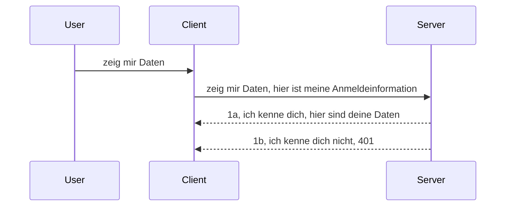

# Einfache Authentifizierung

MCP SDKs unterstützen die Verwendung von OAuth 2.1, was, um ehrlich zu sein, ein ziemlich komplexer Prozess ist, der Konzepte wie Authentifizierungsserver, Ressourcenserver, das Senden von Zugangsdaten, das Erhalten eines Codes, den Tausch des Codes gegen ein Bearer-Token umfasst, bis man schließlich auf die Ressourcendaten zugreifen kann. Wenn man OAuth nicht gewohnt ist, was eine großartige Sache zur Implementierung ist, ist es eine gute Idee, mit einer einfachen Authentifizierungsebene zu beginnen und sich zu immer besserer Sicherheit vorzuarbeiten. Deshalb gibt es dieses Kapitel, um Sie zu fortgeschrittenerer Authentifizierung zu führen.

## Auth, was meinen wir?

Auth steht für Authentifizierung und Autorisierung. Die Idee ist, dass wir zwei Dinge tun müssen:

- **Authentifizierung**, also der Prozess herauszufinden, ob wir einer Person erlauben, unser Haus zu betreten, ob sie das Recht hat, „hier“ zu sein, das heißt Zugang zu unserem Ressourcensserver zu haben, wo unsere MCP Server-Funktionen leben.
- **Autorisierung**, der Prozess herauszufinden, ob ein Benutzer Zugriff auf die spezifischen Ressourcen haben sollte, die er anfragt, zum Beispiel diese Bestellungen oder diese Produkte oder ob er berechtigt ist, den Inhalt zu lesen, aber nicht zu löschen als weiteres Beispiel.

## Zugangsdaten: wie wir dem System sagen, wer wir sind

Nun, die meisten Webentwickler denken daran, dem Server Zugangsdaten zu übermitteln, normalerweise ein Geheimnis, das angibt, ob sie hier „Authentifizierung“ erlaubt sind. Diese Zugangsdaten sind üblicherweise eine base64-kodierte Version von Benutzername und Passwort oder ein API-Schlüssel, der einen bestimmten Benutzer eindeutig identifiziert.

Das beinhaltet das Senden über einen Header namens "Authorization", so:

```json
{ "Authorization": "secret123" }
```

Dies wird normalerweise als Basic Authentication bezeichnet. Der gesamte Ablauf funktioniert dann folgendermaßen:


```mermaid
sequenceDiagram
   participant User
   participant Client
   participant Server

   User->>Client: zeig mir Daten
   Client->>Server: zeig mir Daten, hier ist meine Anmeldeinformation
   Server-->>Client: 1a, ich kenne dich, hier sind deine Daten
   Server-->>Client: 1b, ich kenne dich nicht, 401 
```

Jetzt, da wir den Ablauf verstanden haben, wie implementieren wir das? Nun, die meisten Webserver haben ein Konzept namens Middleware, ein Codeabschnitt, der als Teil der Anfrage läuft und Zugangsdaten überprüft und wenn diese gültig sind, die Anfrage passieren lässt. Ist die Anfrage nicht mit gültigen Zugangsdaten ausgestattet, erhält man einen Auth-Fehler. Schauen wir, wie das implementiert werden kann:

**Python**

```python
class AuthMiddleware(BaseHTTPMiddleware):
    async def dispatch(self, request, call_next):

        has_header = request.headers.get("Authorization")
        if not has_header:
            print("-> Missing Authorization header!")
            return Response(status_code=401, content="Unauthorized")

        if not valid_token(has_header):
            print("-> Invalid token!")
            return Response(status_code=403, content="Forbidden")

        print("Valid token, proceeding...")
       
        response = await call_next(request)
        # füge beliebige Kunden-Header hinzu oder ändere die Antwort auf irgendeine Weise
        return response


starlette_app.add_middleware(CustomHeaderMiddleware)
```

Hier haben wir:

- Eine Middleware namens `AuthMiddleware` erstellt, deren `dispatch` Methode vom Webserver aufgerufen wird.
- Die Middleware zum Webserver hinzugefügt:

    ```python
    starlette_app.add_middleware(AuthMiddleware)
    ```

- Validierungslogik geschrieben, die prüft, ob der Authorization-Header vorhanden ist und ob das gesendete Geheimnis gültig ist:

    ```python
    has_header = request.headers.get("Authorization")
    if not has_header:
        print("-> Missing Authorization header!")
        return Response(status_code=401, content="Unauthorized")

    if not valid_token(has_header):
        print("-> Invalid token!")
        return Response(status_code=403, content="Forbidden")
    ```

    Wenn das Geheimnis vorhanden und gültig ist, lassen wir die Anfrage durch, indem wir `call_next` aufrufen und die Antwort zurückgeben.

    ```python
    response = await call_next(request)
    # Fügen Sie beliebige Kunden-Header hinzu oder ändern Sie die Antwort auf irgendeine Weise
    return response
    ```

So funktioniert es: Wenn eine Webanfrage an den Server gestellt wird, wird die Middleware aufgerufen und basierend auf ihrer Implementierung lässt sie entweder die Anfrage durch oder gibt einen Fehler zurück, der anzeigt, dass der Client nicht weitergeführt werden darf.

**TypeScript**

Hier erstellen wir eine Middleware mit dem populären Framework Express und fangen die Anfrage ab, bevor sie den MCP Server erreicht. Hier ist der Code dazu:

```typescript
function isValid(secret) {
    return secret === "secret123";
}

app.use((req, res, next) => {
    // 1. Autorisierungsheader vorhanden?
    if(!req.headers["Authorization"]) {
        res.status(401).send('Unauthorized');
    }
    
    let token = req.headers["Authorization"];

    // 2. Gültigkeit prüfen.
    if(!isValid(token)) {
        res.status(403).send('Forbidden');
    }

   
    console.log('Middleware executed');
    // 3. Übergibt die Anfrage an den nächsten Schritt in der Anfrage-Pipeline.
    next();
});
```

In diesem Code:

1. Prüfen wir, ob der Authorization-Header überhaupt vorhanden ist, wenn nicht, senden wir einen 401-Fehler.
2. Überprüfen, ob die Zugangsdaten/Token gültig sind, wenn nicht, senden wir einen 403-Fehler.
3. Schließlich wird die Anfrage in der Anforderungspipeline weitergereicht und die angefragte Ressource zurückgegeben.

## Übung: Authentifizierung implementieren

Nutzen wir unser Wissen, um es umzusetzen. Hier ist der Plan:

Server

- Erstelle einen Webserver und eine MCP-Instanz.
- Implementiere eine Middleware für den Server.

Client

- Sende Webanfrage mit Zugangsdaten über Header.

### -1- Erstelle Webserver- und MCP-Instanz

> [!WARNING]
> Das untenstehende TypeScript Beispiel zielt auf MCP `2025-11-25` ab. Es verfolgt Transports
> durch `mcp-session-id` und ist kein aktuelles `2026-07-28` Transportbeispiel. MCP
> `2026-07-28` eliminiert den `initialize` Handshake und die Protokoll-Session-ID; neue
> Implementierungen verwenden selbstständige Anfragen. Siehe
> [Was sich im MCP geändert hat: Die Spezifikation 2026-07-28](../../01-CoreConcepts/mcp-2026-07-28.md).

In unserem ersten Schritt müssen wir die Webserver-Instanz und den MCP-Server erstellen.

**Python**

Hier erstellen wir eine MCP Serverinstanz, eine starlette Web-App und hosten sie mit uvicorn.

```python
# Erstellen des MCP-Servers

app = FastMCP(
    name="MCP Resource Server",
    instructions="Resource Server that validates tokens via Authorization Server introspection",
    host=settings["host"],
    port=settings["port"],
    debug=True
)

# Erstellen der Starlette-Webanwendung
starlette_app = app.streamable_http_app()

# Bereitstellen der Anwendung über Uvicorn
async def run(starlette_app):
    import uvicorn
    config = uvicorn.Config(
            starlette_app,
            host=app.settings.host,
            port=app.settings.port,
            log_level=app.settings.log_level.lower(),
        )
    server = uvicorn.Server(config)
    await server.serve()

run(starlette_app)
```

In diesem Code:

- Erstellen wir den MCP-Server.
- Konstruieren die starlette Web-App aus dem MCP Server, `app.streamable_http_app()`.
- Host und Servern die Web-App mit uvicorn `server.serve()`.

**TypeScript**

Hier erstellen wir eine MCP Serverinstanz.

```typescript
const server = new McpServer({
      name: "example-server",
      version: "1.0.0"
    });

    // ... richten Sie Serverressourcen, Werkzeuge und Eingabeaufforderungen ein ...
```

Diese Erstellung des MCP-Servers muss innerhalb unserer Definition der POST /mcp Route erfolgen, also nehmen wir den obigen Code und verschieben ihn so:

```typescript
import express from "express";
import { randomUUID } from "node:crypto";
import { McpServer } from "@modelcontextprotocol/sdk/server/mcp.js";
import { StreamableHTTPServerTransport } from "@modelcontextprotocol/sdk/server/streamableHttp.js";
import { isInitializeRequest } from "@modelcontextprotocol/sdk/types.js"

const app = express();
app.use(express.json());

// Map zur Speicherung von Transporten nach Sitzungs-ID
const transports: { [sessionId: string]: StreamableHTTPServerTransport } = {};

// Verarbeiten von POST-Anfragen für die Client-zu-Server-Kommunikation
app.post('/mcp', async (req, res) => {
  // Überprüfung auf vorhandene Sitzungs-ID
  const sessionId = req.headers['mcp-session-id'] as string | undefined;
  let transport: StreamableHTTPServerTransport;

  if (sessionId && transports[sessionId]) {
    // Vorhandenen Transport wiederverwenden
    transport = transports[sessionId];
  } else if (!sessionId && isInitializeRequest(req.body)) {
    // Neue Initialisierungsanfrage
    transport = new StreamableHTTPServerTransport({
      sessionIdGenerator: () => randomUUID(),
      onsessioninitialized: (sessionId) => {
        // Transport nach Sitzungs-ID speichern
        transports[sessionId] = transport;
      },
      // DNS-Rebinding-Schutz ist standardmäßig zur Abwärtskompatibilität deaktiviert. Wenn Sie diesen Server
      // lokal ausführen, stellen Sie sicher, dass Sie Folgendes setzen:
      // enableDnsRebindingProtection: true,
      // allowedHosts: ['127.0.0.1'],
    });

    // Transport beim Schließen bereinigen
    transport.onclose = () => {
      if (transport.sessionId) {
        delete transports[transport.sessionId];
      }
    };
    const server = new McpServer({
      name: "example-server",
      version: "1.0.0"
    });

    // ... Server-Ressourcen, Werkzeuge und Aufforderungen einrichten ...

    // Verbindung zum MCP-Server herstellen
    await server.connect(transport);
  } else {
    // Ungültige Anfrage
    res.status(400).json({
      jsonrpc: '2.0',
      error: {
        code: -32000,
        message: 'Bad Request: No valid session ID provided',
      },
      id: null,
    });
    return;
  }

  // Die Anfrage bearbeiten
  await transport.handleRequest(req, res, req.body);
});

// Wiederverwendbarer Handler für GET- und DELETE-Anfragen
const handleSessionRequest = async (req: express.Request, res: express.Response) => {
  const sessionId = req.headers['mcp-session-id'] as string | undefined;
  if (!sessionId || !transports[sessionId]) {
    res.status(400).send('Invalid or missing session ID');
    return;
  }
  
  const transport = transports[sessionId];
  await transport.handleRequest(req, res);
};

// Bearbeitung von GET-Anfragen für serverseitige Benachrichtigungen an den Client via SSE
app.get('/mcp', handleSessionRequest);

// Bearbeitung von DELETE-Anfragen zur Sitzungsbeendigung
app.delete('/mcp', handleSessionRequest);

app.listen(3000);
```

Jetzt sehen Sie, wie die Erstellung des MCP-Servers innerhalb von `app.post("/mcp")` verschoben wurde.

Weiter zum nächsten Schritt: Middleware erstellen, um eingehende Zugangsdaten zu validieren.

### -2- Implementiere eine Middleware für den Server

Kommen wir zum Middleware-Teil. Hier erstellen wir eine Middleware, die nach Zugangsdaten im `Authorization` Header sucht und diese validiert. Sind sie akzeptabel, kommt die Anfrage weiter und führt aus, was nötig ist (z.B. Tools auflisten, Ressource lesen oder welche MCP-Funktionalität der Client anfragt).

**Python**

Um die Middleware zu erstellen, müssen wir eine Klasse erstellen, die von `BaseHTTPMiddleware` erbt. Es gibt zwei wichtige Bestandteile:

- Die Anfrage `request`, aus der wir die Header-Information lesen.
- `call_next`, den Callback, den wir aufrufen müssen, wenn der Client gültige Zugangsdaten mitgebracht hat.

Zuerst müssen wir den Fall behandeln, wenn der `Authorization` Header fehlt:

```python
has_header = request.headers.get("Authorization")

# kein Header vorhanden, mit 401 fehlschlagen, sonst fortfahren.
if not has_header:
    print("-> Missing Authorization header!")
    return Response(status_code=401, content="Unauthorized")
```

Hier senden wir eine 401 Unauthorized Nachricht, da der Client die Authentifizierung nicht besteht.

Als nächstes, wenn Zugangsdaten übermittelt wurden, prüfen wir ihre Gültigkeit:

```python
 if not valid_token(has_header):
    print("-> Invalid token!")
    return Response(status_code=403, content="Forbidden")
```

Beachten Sie oben, wie wir eine 403 Forbidden Nachricht senden. Sehen wir uns die vollständige Middleware unten an, die alles oben Erwähnte umsetzt:

```python
class AuthMiddleware(BaseHTTPMiddleware):
    async def dispatch(self, request, call_next):

        has_header = request.headers.get("Authorization")
        if not has_header:
            print("-> Missing Authorization header!")
            return Response(status_code=401, content="Unauthorized")

        if not valid_token(has_header):
            print("-> Invalid token!")
            return Response(status_code=403, content="Forbidden")

        print("Valid token, proceeding...")
        print(f"-> Received {request.method} {request.url}")
        response = await call_next(request)
        response.headers['Custom'] = 'Example'
        return response

```

Großartig, aber wie sieht die `valid_token` Funktion aus? Hier ist sie:

```python
# NICHT für die Produktion verwenden - verbessere es !!
def valid_token(token: str) -> bool:
    # entferne das "Bearer "-Präfix
    if token.startswith("Bearer "):
        token = token[7:]
        return token == "secret-token"
    return False
```

Das sollte natürlich verbessert werden. 

WICHTIG: Sie sollten NIEMALS Geheimnisse wie dieses im Code haben. Idealerweise holen Sie den Vergleichswert aus einer Datenquelle oder von einem IDP (Identity Service Provider) oder noch besser, lassen den IDP die Validierung durchführen.

**TypeScript**

Um dies mit Express zu implementieren, müssen wir die `use` Methode aufrufen, die Middleware-Funktionen annimmt.

Wir müssen:

- Mit der Anfragevariable interagieren, um die übergebenen Zugangsdaten in der `Authorization` Eigenschaft zu prüfen.
- Zugangsdaten validieren und wenn gültig die Anfrage fortsetzen und die MCP-Anfrage des Clients ausführen lassen (z.B. Tools auflisten, Ressource lesen oder andere MCP-bezogene Aufgaben).

Hier prüfen wir, ob der `Authorization` Header vorhanden ist, und wenn nicht, stoppen wir die Anfrage:

```typescript
if(!req.headers["authorization"]) {
    res.status(401).send('Unauthorized');
    return;
}
```

Wenn der Header überhaupt nicht gesendet wird, erhält man einen 401.

Danach prüfen wir, ob die Zugangsdaten gültig sind; wenn nicht, stoppen wir die Anfrage erneut, aber mit einer leicht anderen Meldung:

```typescript
if(!isValid(token)) {
    res.status(403).send('Forbidden');
    return;
} 
```

Beachten Sie, Sie erhalten jetzt einen 403 Fehler.

Hier ist der vollständige Code:

```typescript
app.use((req, res, next) => {
    console.log('Request received:', req.method, req.url, req.headers);
    console.log('Headers:', req.headers["authorization"]);
    if(!req.headers["authorization"]) {
        res.status(401).send('Unauthorized');
        return;
    }
    
    let token = req.headers["authorization"];

    if(!isValid(token)) {
        res.status(403).send('Forbidden');
        return;
    }  

    console.log('Middleware executed');
    next();
});
```

Wir haben den Webserver eingerichtet, um eine Middleware zu akzeptieren, die die Zugangsdaten überprüft, die der Client hoffentlich schickt. Was ist mit dem Client selbst?

### -3- Sende Webanfrage mit Zugangsdaten über Header

Wir müssen sicherstellen, dass der Client die Zugangsdaten über den Header mitschickt. Da wir einen MCP-Client benutzen, müssen wir herausfinden, wie das gemacht wird.

**Python**

Für den Client müssen wir einen Header mit unseren Zugangsdaten so übergeben:

```python
# SCHREIBE den Wert nicht fest, bewahre ihn mindestens in einer Umgebungsvariablen oder einem sichereren Speicher auf
token = "secret-token"

async with streamablehttp_client(
        url = f"http://localhost:{port}/mcp",
        headers = {"Authorization": f"Bearer {token}"}
    ) as (
        read_stream,
        write_stream,
        session_callback,
    ):
        async with ClientSession(
            read_stream,
            write_stream
        ) as session:
            await session.initialize()
      
            # TODO, was du im Client machen möchtest, z.B. Werkzeuge auflisten, Werkzeuge aufrufen usw.
```

Beachten Sie, wie wir das `headers` Attribut mit `headers = {"Authorization": f"Bearer {token}"}` befüllen.

**TypeScript**

Wir können das in zwei Schritten lösen:

1. Ein Konfigurationsobjekt mit unseren Zugangsdaten füllen.
2. Das Konfigurationsobjekt an den Transport übergeben.

```typescript

// KODIEREN SIE den Wert hier nicht fest. Mindestens sollten Sie es als Umgebungsvariable haben und etwas wie dotenv (im Entwicklermodus) verwenden.
let token = "secret123"

// Definieren Sie ein Client-Transportoptionen-Objekt
let options: StreamableHTTPClientTransportOptions = {
  sessionId: sessionId,
  requestInit: {
    headers: {
      "Authorization": "secret123"
    }
  }
};

// Übergeben Sie das Optionen-Objekt an den Transport
async function main() {
   const transport = new StreamableHTTPClientTransport(
      new URL(serverUrl),
      options
   );
```

Hier sehen Sie, wie wir ein `options` Objekt erstellt haben und unsere Header unter der Eigenschaft `requestInit` platziert haben.

WICHTIG: Wie können wir das von hier aus verbessern? Nun, die aktuelle Implementierung hat einige Probleme. Erstens ist es ziemlich riskant, Zugangsdaten so zu übermitteln, außer man hat mindestens HTTPS. Selbst dann können die Zugangsdaten gestohlen werden, sodass ein System benötigt wird, mit dem man Tokens leicht widerrufen und zusätzliche Prüfungen hinzufügen kann, z.B. von wo auf der Welt die Anfrage kommt, ob die Anfrage zu häufig erfolgt (bot-ähnliches Verhalten), kurz gesagt, es gibt viele Sorgen.

Es sollte aber gesagt werden, dass für sehr einfache APIs, bei denen man nicht will, dass jemand ohne Authentifizierung die API aufruft, das hier ein guter Anfang ist.

Damit wollen wir die Sicherheit ein wenig stärken, indem wir ein standardisiertes Format wie JSON Web Token verwenden, auch bekannt als JWT oder „JOT“ Token.

## JSON Web Tokens, JWT

Also, wir versuchen, die Dinge von einfachen Zugangsdaten weiter zu verbessern. Was sind die unmittelbaren Verbesserungen durch die Verwendung von JWT?

- **Sicherheitsverbesserungen**. Bei Basic Auth sendet man Benutzername und Passwort als base64-kodiertes Token (oder einen API Schlüssel) immer wieder mit, was das Risiko erhöht. Bei JWT sendet man Benutzername und Passwort und erhält ein Token als Antwort, das zeitlich begrenzt ist und somit abläuft. JWT ermöglicht feinkörnige Zugriffskontrolle mit Rollen, Scopes und Berechtigungen.
- **Zustandslosigkeit und Skalierbarkeit**. JWTs sind selbstenthaltend, sie tragen alle Benutzerinformationen und eliminieren die Notwendigkeit, serverseitige Sitzungen zu speichern. Das Token kann lokal validiert werden.
- **Interoperabilität und Föderation**. JWTs sind zentral für Open ID Connect und werden mit bekannten Identitätsanbietern wie Entra ID, Google Identity und Auth0 verwendet. Sie ermöglichen auch Single Sign-On und vieles mehr und sind damit unternehmensfähig.
- **Modularität und Flexibilität**. JWTs können auch mit API Gateways wie Azure API Management, NGINX und anderen verwendet werden. Sie unterstützen Authentifizierungsszenarien und Server-zu-Server-Kommunikation einschließlich Anfragen im Namen anderer (Impersonation) und Delegation.
- **Leistung und Caching**. JWTs können nach dem Decodieren zwischengespeichert werden, was die Notwendigkeit des erneuten Parsens reduziert. Das hilft besonders bei stark frequentierten Anwendungen, da es den Durchsatz verbessert und die Last auf der Infrastruktur senkt.
- **Erweiterte Features**. Sie unterstützen auch Introspektion (Überprüfung der Gültigkeit auf dem Server) und Widerruf (Ungültigmachen eines Tokens).

Bei all diesen Vorteilen sehen wir, wie wir unsere Implementierung auf die nächste Stufe bringen können.

## Basic Auth in JWT umwandeln

Die Änderungen auf hoher Ebene sind:

- **Lernen, ein JWT Token zu erstellen** und es bereit machen, vom Client zum Server gesendet zu werden.
- **Ein JWT Token validieren** und falls gültig, dem Client unsere Ressourcen geben.
- **Sicheres Token speichern**. Wie wir dieses Token ablegen.
- **Routen schützen**. Wir müssen die Routen schützen, in unserem Fall die MCP Routen und bestimmte MCP Features.
- **Refresh Tokens hinzufügen**. Tokens erstellen, die kurzlebig sind, aber auch langlebige Refresh Tokens, die verwendet werden können, um neue Tokens zu erhalten, wenn sie ablaufen. Ebenfalls einen Refresh-Endpunkt und eine Rotationsstrategie sicherstellen.

### -1- Ein JWT Token erstellen

Ein JWT Token hat zuerst folgende Teile:

- **Header**, der verwendete Algorithmus und Token-Typ.
- **Payload**, Claims, wie sub (der Nutzer oder die Entität, die das Token repräsentiert; in einem Auth-Szenario meist die UserID), exp (Ablaufzeit), role (Rolle).
- **Signatur**, die mit einem Geheimnis oder Privatschlüssel signiert wird.

Dafür müssen wir Header, Payload und das kodierte Token erstellen.

**Python**

```python

import jwt
import jwt
from jwt.exceptions import ExpiredSignatureError, InvalidTokenError
import datetime

# Geheimer Schlüssel zum Signieren des JWT
secret_key = 'your-secret-key'

header = {
    "alg": "HS256",
    "typ": "JWT"
}

# die Benutzerinformationen und deren Ansprüche sowie Ablaufzeit
payload = {
    "sub": "1234567890",               # Subjekt (Benutzer-ID)
    "name": "User Userson",                # Benutzerdefinierter Anspruch
    "admin": True,                     # Benutzerdefinierter Anspruch
    "iat": datetime.datetime.utcnow(),# Ausgestellt am
    "exp": datetime.datetime.utcnow() + datetime.timedelta(hours=1)  # Ablauf
}

# kodieren
encoded_jwt = jwt.encode(payload, secret_key, algorithm="HS256", headers=header)
```

Im obigen Code haben wir:

- Einen Header definiert, der HS256 als Algorithmus und Typ als JWT enthält.
- Eine Payload erstellt, die ein Subjekt oder Nutzer-ID, einen Benutzernamen, eine Rolle, ein Ausstellungsdatum und ein Ablaufdatum enthält und damit die zeitliche Begrenzung implementiert, die wir zuvor erwähnt haben.

**TypeScript**

Hier benötigen wir einige Abhängigkeiten, die uns helfen, das JWT Token zu erstellen.

Abhängigkeiten

```sh

npm install jsonwebtoken
npm install --save-dev @types/jsonwebtoken
```

Nun da das bereitsteht, erstellen wir Header, Payload und darüber das kodierte Token.

```typescript
import jwt from 'jsonwebtoken';

const secretKey = 'your-secret-key'; // Verwende Umgebungsvariablen in der Produktion

// Definiere die Nutzlast
const payload = {
  sub: '1234567890',
  name: 'User usersson',
  admin: true,
  iat: Math.floor(Date.now() / 1000), // Ausgestellt um
  exp: Math.floor(Date.now() / 1000) + 60 * 60 // Läuft in 1 Stunde ab
};

// Definiere den Header (optional, jsonwebtoken setzt Standardwerte)
const header = {
  alg: 'HS256',
  typ: 'JWT'
};

// Erstelle das Token
const token = jwt.sign(payload, secretKey, {
  algorithm: 'HS256',
  header: header
});

console.log('JWT:', token);
```

Dieses Token ist:

Mit HS256 signiert
Gültig für 1 Stunde
Enthält Claims wie sub, name, admin, iat und exp.

### -2- Ein Token validieren

Wir müssen ein Token auch validieren, das machen wir auf dem Server, um sicherzustellen, dass das, was der Client schickt, tatsächlich gültig ist. Es gibt viele Prüfungen, die wir machen sollten, von der Prüfung der Struktur bis zur Gültigkeit. Es wird auch empfohlen, weitere Checks anzufügen, z.B. ob der Nutzer in Ihrem System ist und mehr.

Um ein Token zu validieren, müssen wir es decodieren, um es zu lesen, und dann mit der Überprüfung der Gültigkeit beginnen:

**Python**

```python

# JWT dekodieren und verifizieren
try:
    decoded = jwt.decode(token, secret_key, algorithms=["HS256"])
    print("✅ Token is valid.")
    print("Decoded claims:")
    for key, value in decoded.items():
        print(f"  {key}: {value}")
except ExpiredSignatureError:
    print("❌ Token has expired.")
except InvalidTokenError as e:
    print(f"❌ Invalid token: {e}")

```


In diesem Code rufen wir `jwt.decode` auf und verwenden dabei das Token, den geheimen Schlüssel und den gewählten Algorithmus als Eingabe. Beachten Sie, wie wir eine try-catch-Konstruktion verwenden, da eine fehlgeschlagene Validierung zu einem Fehler führt.

**TypeScript**

Hier müssen wir `jwt.verify` aufrufen, um eine dekodierte Version des Tokens zu erhalten, die wir weiter analysieren können. Wenn dieser Aufruf fehlschlägt, bedeutet das, dass die Struktur des Tokens falsch ist oder es nicht mehr gültig ist.

```typescript

try {
  const decoded = jwt.verify(token, secretKey);
  console.log('Decoded Payload:', decoded);
} catch (err) {
  console.error('Token verification failed:', err);
}
```

HINWEIS: Wie bereits erwähnt, sollten wir zusätzliche Prüfungen durchführen, um sicherzustellen, dass dieses Token auf einen Benutzer in unserem System verweist und der Benutzer die Rechte hat, die er vorgibt zu besitzen.

Als nächstes betrachten wir rollenbasierte Zugriffskontrolle, auch bekannt als RBAC.

## Hinzufügen von rollenbasierter Zugriffskontrolle

Die Idee ist, dass wir ausdrücken wollen, dass verschiedene Rollen unterschiedliche Berechtigungen haben. Zum Beispiel nehmen wir an, dass ein Admin alles tun kann, ein normaler Benutzer lesen/schreiben kann und ein Gast nur lesen darf. Daher hier einige mögliche Berechtigungsstufen:

- Admin.Write 
- User.Read
- Guest.Read

Schauen wir uns an, wie wir eine solche Kontrolle mit Middleware implementieren können. Middleware kann pro Route sowie für alle Routen hinzugefügt werden.

**Python**

```python
from starlette.middleware.base import BaseHTTPMiddleware
from starlette.responses import JSONResponse
import jwt

# HABEN SIE DAS SECRET NICHT im Code, dies ist nur zu Demonstrationszwecken. Lesen Sie es von einem sicheren Ort.
SECRET_KEY = "your-secret-key" # Legen Sie dies in eine Umgebungsvariable.
REQUIRED_PERMISSION = "User.Read"

class JWTPermissionMiddleware(BaseHTTPMiddleware):
    async def dispatch(self, request, call_next):
        auth_header = request.headers.get("Authorization")
        if not auth_header or not auth_header.startswith("Bearer "):
            return JSONResponse({"error": "Missing or invalid Authorization header"}, status_code=401)

        token = auth_header.split(" ")[1]
        try:
            decoded = jwt.decode(token, SECRET_KEY, algorithms=["HS256"])
        except jwt.ExpiredSignatureError:
            return JSONResponse({"error": "Token expired"}, status_code=401)
        except jwt.InvalidTokenError:
            return JSONResponse({"error": "Invalid token"}, status_code=401)

        permissions = decoded.get("permissions", [])
        if REQUIRED_PERMISSION not in permissions:
            return JSONResponse({"error": "Permission denied"}, status_code=403)

        request.state.user = decoded
        return await call_next(request)


```

Es gibt verschiedene Möglichkeiten, die Middleware wie unten hinzuzufügen:

```python

# Alternative 1: Middleware beim Erstellen der Starlette-App hinzufügen
middleware = [
    Middleware(JWTPermissionMiddleware)
]

app = Starlette(routes=routes, middleware=middleware)

# Alternative 2: Middleware hinzufügen, nachdem die Starlette-App bereits erstellt wurde
starlette_app.add_middleware(JWTPermissionMiddleware)

# Alternative 3: Middleware pro Route hinzufügen
routes = [
    Route(
        "/mcp",
        endpoint=..., # Handler
        middleware=[Middleware(JWTPermissionMiddleware)]
    )
]
```

**TypeScript**

Wir können `app.use` und eine Middleware verwenden, die für alle Anfragen ausgeführt wird.

```typescript
app.use((req, res, next) => {
    console.log('Request received:', req.method, req.url, req.headers);
    console.log('Headers:', req.headers["authorization"]);

    // 1. Überprüfen, ob der Autorisierungsheader gesendet wurde

    if(!req.headers["authorization"]) {
        res.status(401).send('Unauthorized');
        return;
    }
    
    let token = req.headers["authorization"];

    // 2. Überprüfen, ob das Token gültig ist
    if(!isValid(token)) {
        res.status(403).send('Forbidden');
        return;
    }  

    // 3. Überprüfen, ob der Token-Benutzer in unserem System existiert
    if(!isExistingUser(token)) {
        res.status(403).send('Forbidden');
        console.log("User does not exist");
        return;
    }
    console.log("User exists");

    // 4. Verifizieren, dass das Token die richtigen Berechtigungen hat
    if(!hasScopes(token, ["User.Read"])){
        res.status(403).send('Forbidden - insufficient scopes');
    }

    console.log("User has required scopes");

    console.log('Middleware executed');
    next();
});

```

Es gibt einige Dinge, die unsere Middleware tun kann und SOLLTE, nämlich:

1. Überprüfen, ob der Autorisierungsheader vorhanden ist
2. Überprüfen, ob das Token gültig ist; wir rufen `isValid` auf, eine Methode, die wir geschrieben haben, die die Integrität und Gültigkeit des JWT-Tokens prüft.
3. Überprüfen, ob der Benutzer in unserem System existiert; das sollten wir kontrollieren.

   ```typescript
    // Benutzer in der DB
   const users = [
     "user1",
     "User usersson",
   ]

   function isExistingUser(token) {
     let decodedToken = verifyToken(token);

     // TODO, prüfen ob Benutzer in der DB existiert
     return users.includes(decodedToken?.name || "");
   }
   ```

   Oben haben wir eine sehr einfache `users`-Liste erstellt, die natürlich in einer Datenbank gespeichert sein sollte.

4. Zusätzlich sollten wir auch prüfen, ob das Token die richtigen Berechtigungen hat.

   ```typescript
   if(!hasScopes(token, ["User.Read"])){
        res.status(403).send('Forbidden - insufficient scopes');
   }
   ```

   In diesem obenstehenden Middleware-Code prüfen wir, ob das Token die Berechtigung User.Read enthält, falls nicht, senden wir einen 403-Fehler. Unten ist die Hilfsmethode `hasScopes`.

   ```typescript
   function hasScopes(scope: string, requiredScopes: string[]) {
     let decodedToken = verifyToken(scope);
    return requiredScopes.every(scope => decodedToken?.scopes.includes(scope));
  }
   ```

Have a think which additional checks you should be doing, but these are the absolute minimum of checks you should be doing.

Using Express as a web framework is a common choice. There are helpers library when you use JWT so you can write less code.

- `express-jwt`, helper library that provides a middleware that helps decode your token.
- `express-jwt-permissions`, this provides a middleware `guard` that helps check if a certain permission is on the token.

Here's what these libraries can look like when used:

```typescript
const express = require('express');
const jwt = require('express-jwt');
const guard = require('express-jwt-permissions')();

const app = express();
const secretKey = 'your-secret-key'; // put this in env variable

// Decode JWT and attach to req.user
app.use(jwt({ secret: secretKey, algorithms: ['HS256'] }));

// Check for User.Read permission
app.use(guard.check('User.Read'));

// multiple permissions
// app.use(guard.check(['User.Read', 'Admin.Access']));

app.get('/protected', (req, res) => {
  res.json({ message: `Welcome ${req.user.name}` });
});

// Error handler
app.use((err, req, res, next) => {
  if (err.code === 'permission_denied') {
    return res.status(403).send('Forbidden');
  }
  next(err);
});

```

Jetzt haben Sie gesehen, wie Middleware sowohl für Authentifizierung als auch Autorisierung verwendet werden kann. Aber was ist mit MCP, ändert das etwas an unserer Authentifizierung? Finden wir es im nächsten Abschnitt heraus.

### -3- RBAC zu MCP hinzufügen

Sie haben bisher gesehen, wie man RBAC über Middleware hinzufügen kann. Allerdings gibt es für MCP keinen einfachen Weg, eine funktionalitätsbezogene RBAC hinzuzufügen. Was machen wir also? Nun, wir müssen einfach Code wie diesen hinzufügen, der in diesem Fall prüft, ob der Client die Rechte hat, ein bestimmtes Tool aufzurufen:

Sie haben einige verschiedene Möglichkeiten, wie Sie pro Feature RBAC erreichen können, hier sind einige:

- Fügen Sie für jedes Tool, jede Ressource, jeden Prompt eine Prüfung hinzu, bei der Sie das Berechtigungsniveau prüfen müssen.

   **python**

   ```python
   @tool()
   def delete_product(id: int):
      try:
          check_permissions(role="Admin.Write", request)
      catch:
        pass # Client hat die Autorisierung nicht bestanden, Autorisierungsfehler auslösen
   ```

   **typescript**

   ```typescript
   server.registerTool(
    "delete-product",
    {
      title: Delete a product",
      description: "Deletes a product",
      inputSchema: { id: z.number() }
    },
    async ({ id }) => {
      
      try {
        checkPermissions("Admin.Write", request);
        // todo, sende ID an productService und Remote-Eintrag
      } catch(Exception e) {
        console.log("Authorization error, you're not allowed");  
      }

      return {
        content: [{ type: "text", text: `Deletected product with id ${id}` }]
      };
    }
   );
   ```


- Verwenden Sie einen fortgeschrittenen Serveransatz und die Request-Handler, um zu minimieren, an wie vielen Stellen diese Prüfung durchgeführt werden muss.

   **Python**

   ```python
   
   tool_permission = {
      "create_product": ["User.Write", "Admin.Write"],
      "delete_product": ["Admin.Write"]
   }

   def has_permission(user_permissions, required_permissions) -> bool:
      # user_permissions: Liste der Berechtigungen, die der Benutzer hat
      # required_permissions: Liste der für das Tool erforderlichen Berechtigungen
      return any(perm in user_permissions for perm in required_permissions)

   @server.call_tool()
   async def handle_call_tool(
     name: str, arguments: dict[str, str] | None
   ) -> list[types.TextContent]:
    # Gehen Sie davon aus, dass request.user.permissions eine Liste der Berechtigungen für den Benutzer ist
     user_permissions = request.user.permissions
     required_permissions = tool_permission.get(name, [])
     if not has_permission(user_permissions, required_permissions):
        # Fehlermeldung auslösen "Sie haben keine Berechtigung, das Tool {name} aufzurufen"
        raise Exception(f"You don't have permission to call tool {name}")
     # fortfahren und Tool aufrufen
     # ...
   ```   
   

   **TypeScript**

   ```typescript
   function hasPermission(userPermissions: string[], requiredPermissions: string[]): boolean {
       if (!Array.isArray(userPermissions) || !Array.isArray(requiredPermissions)) return false;
       // Gibt true zurück, wenn der Benutzer mindestens eine erforderliche Berechtigung hat
       
       return requiredPermissions.some(perm => userPermissions.includes(perm));
   }
  
   server.setRequestHandler(CallToolRequestSchema, async (request) => {
      const { params: { name } } = request;
  
      let permissions = request.user.permissions;
  
      if (!hasPermission(permissions, toolPermissions[name])) {
         return new Error(`You don't have permission to call ${name}`);
      }
  
      // Mach weiter..
   });
   ```

   Hinweis: Sie müssen sicherstellen, dass Ihre Middleware ein dekodiertes Token der `user`-Eigenschaft der Anfrage zuweist, damit der obige Code vereinfacht ist.

### Zusammenfassung

Nun, da wir besprochen haben, wie man allgemein und speziell für MCP RBAC unterstützt, ist es an der Zeit, die Sicherheit selbst zu implementieren, um sicherzugehen, dass Sie die Konzepte verstanden haben.

## Aufgabe 1: Erstellen Sie einen MCP-Server und MCP-Client mit einfacher Authentifizierung

Hier verwenden Sie, was Sie über das Senden von Anmeldedaten über Header gelernt haben.

## Lösung 1

[Lösung 1](./code/basic/README.md)

## Aufgabe 2: Verbessern Sie die Lösung aus Aufgabe 1 durch Verwendung von JWT

Nehmen Sie die erste Lösung, aber verbessern Sie sie dieses Mal.

Statt Basic Auth verwenden wir JWT.

## Lösung 2

[Lösung 2](./solution/jwt-solution/README.md)

## Herausforderung

Fügen Sie das pro Tool spezifizierte RBAC hinzu, das wir im Abschnitt "RBAC zu MCP hinzufügen" beschrieben haben.

## Zusammenfassung

Hoffentlich haben Sie in diesem Kapitel viel gelernt, von gar keiner Sicherheit über Basis-Sicherheit bis hin zu JWT und wie man es zu MCP hinzufügt.

Wir haben eine solide Grundlage mit individuellen JWTs geschaffen, aber mit zunehmender Skalierung bewegen wir uns auf ein standardbasiertes Identitätsmodell zu. Die Einführung eines IdP wie Entra oder Keycloak ermöglicht es uns, die Token-Ausstellung, -Validierung und -Lebenszyklusverwaltung an eine vertrauenswürdige Plattform auszulagern – so können wir uns auf die Anwendungslogik und Benutzererfahrung konzentrieren.

Dafür haben wir ein etwas [fortgeschritteneres Kapitel über Entra](../../05-AdvancedTopics/mcp-security-entra/README.md)

## Was kommt als Nächstes

- Nächstes: [MCP-Hosts einrichten](../12-mcp-hosts/README.md)

---

<!-- CO-OP TRANSLATOR DISCLAIMER START -->
**Haftungsausschluss**:
Dieses Dokument wurde mit dem KI-Übersetzungsdienst [Co-op Translator](https://github.com/Azure/co-op-translator) übersetzt. Obwohl wir uns um Genauigkeit bemühen, beachten Sie bitte, dass automatisierte Übersetzungen Fehler oder Ungenauigkeiten enthalten können. Das Originaldokument in seiner Ursprungssprache gilt als maßgebliche Quelle. Bei kritischen Informationen wird eine professionelle menschliche Übersetzung empfohlen. Wir übernehmen keine Haftung für Missverständnisse oder Fehlinterpretationen, die aus der Verwendung dieser Übersetzung entstehen.
<!-- CO-OP TRANSLATOR DISCLAIMER END -->