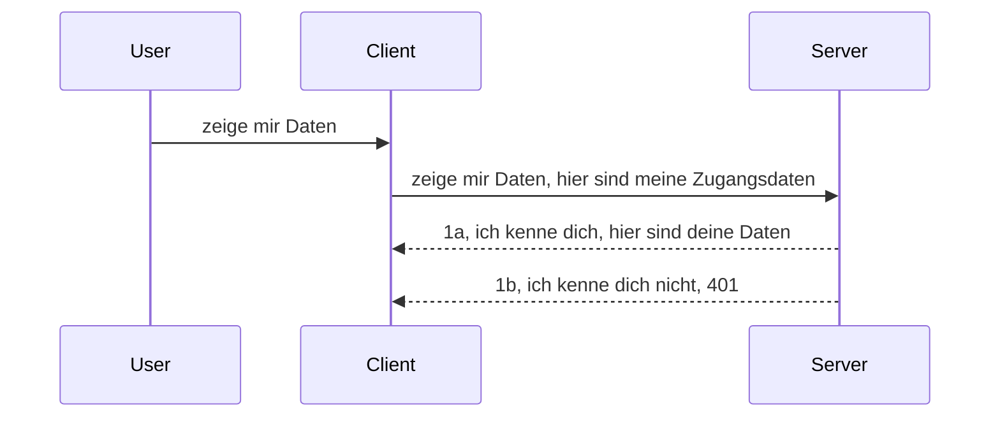

# Einfache Authentifizierung

MCP SDKs unterstützen die Verwendung von OAuth 2.1, was, um ehrlich zu sein, ein ziemlich komplexer Prozess ist, der Konzepte wie Authentifizierungsserver, Ressourcenserver, das Senden von Anmeldeinformationen, das Abrufen eines Codes und den Austausch des Codes gegen ein Zugriffstoken umfasst, bis man schließlich die Ressourcendaten erhalten kann. Wenn Sie OAuth nicht gewohnt sind, was eine großartige Sache zur Implementierung ist, ist es eine gute Idee, mit einem grundlegenden Authentifizierungsniveau zu beginnen und sich zu immer besserer Sicherheit zu hocharbeiten. Deshalb existiert dieses Kapitel, um Sie zu fortgeschrittenerer Authentifizierung aufzubauen.

## Authentifizierung, was meinen wir?

Auth ist kurz für Authentifizierung und Autorisierung. Die Idee ist, dass wir zwei Dinge tun müssen:

- **Authentifizierung**, das ist der Prozess herauszufinden, ob wir einer Person erlauben, unser Haus zu betreten, dass sie das Recht hat, „hier“ zu sein, das heißt Zugriff auf unseren Ressourcenserver zu haben, auf dem die MCP Server-Funktionen laufen.
- **Autorisierung**, ist der Prozess herauszufinden, ob ein Benutzer auf diese spezifischen Ressourcen, die er anfragt, Zugriff haben sollte, zum Beispiel diese Bestellungen oder diese Produkte, oder ob er nur den Inhalt lesen darf, aber beispielsweise nicht löschen.

## Anmeldeinformationen: Wie wir dem System sagen, wer wir sind

Nun, die meisten Webentwickler denken zunächst daran, dem Server eine Anmeldeinformation zu übergeben, normalerweise ein Geheimnis, das sagt, ob sie hier sein dürfen ("Authentifizierung"). Diese Anmeldeinformation ist meist eine base64-kodierte Version von Benutzername und Passwort oder ein API-Schlüssel, der einen bestimmten Benutzer eindeutig identifiziert.

Dies wird über einen Header namens "Authorization" gesendet, so:

```json
{ "Authorization": "secret123" }
```

Dies wird üblicherweise als Basic Authentication bezeichnet. Wie der gesamte Ablauf dann funktioniert, ist folgendermaßen:


```mermaid
sequenceDiagram
   participant User
   participant Client
   participant Server

   User->>Client: zeige mir Daten
   Client->>Server: zeige mir Daten, hier sind meine Zugangsdaten
   Server-->>Client: 1a, ich kenne dich, hier sind deine Daten
   Server-->>Client: 1b, ich kenne dich nicht, 401 
```

Jetzt, wo wir verstehen, wie es vom Ablaufstandpunkt aus funktioniert, wie implementieren wir das? Nun, die meisten Webserver haben ein Konzept namens Middleware, ein Stück Code, das im Rahmen der Anfrage ausgeführt wird, Anmeldeinformationen prüfen kann und, falls diese gültig sind, die Anfrage passieren lässt. Wenn die Anfrage keine gültigen Anmeldeinformationen hat, erhält man einen Authentifizierungsfehler. Schauen wir uns an, wie das implementiert werden kann:

**Python**

```python
class AuthMiddleware(BaseHTTPMiddleware):
    async def dispatch(self, request, call_next):

        has_header = request.headers.get("Authorization")
        if not has_header:
            print("-> Missing Authorization header!")
            return Response(status_code=401, content="Unauthorized")

        if not valid_token(has_header):
            print("-> Invalid token!")
            return Response(status_code=403, content="Forbidden")

        print("Valid token, proceeding...")
       
        response = await call_next(request)
        # Fügen Sie beliebige Kunden-Header hinzu oder ändern Sie die Antwort auf irgendeine Weise
        return response


starlette_app.add_middleware(CustomHeaderMiddleware)
```

Hier haben wir:

- Eine Middleware namens `AuthMiddleware` erstellt, deren `dispatch`-Methode vom Webserver aufgerufen wird.
- Die Middleware zum Webserver hinzugefügt:

    ```python
    starlette_app.add_middleware(AuthMiddleware)
    ```

- Validierungslogik geschrieben, die prüft, ob der Authorization-Header vorhanden ist und ob das gesendete Geheimnis gültig ist:

    ```python
    has_header = request.headers.get("Authorization")
    if not has_header:
        print("-> Missing Authorization header!")
        return Response(status_code=401, content="Unauthorized")

    if not valid_token(has_header):
        print("-> Invalid token!")
        return Response(status_code=403, content="Forbidden")
    ```

    falls das Geheimnis vorhanden und gültig ist, lassen wir die Anfrage passieren, indem wir `call_next` aufrufen und die Antwort zurückgeben.

    ```python
    response = await call_next(request)
    # Fügen Sie beliebige Kunden-Header hinzu oder ändern Sie die Antwort auf irgendeine Weise
    return response
    ```

Wie es funktioniert ist, dass wenn eine Webanfrage an den Server gestellt wird, die Middleware aufgerufen wird und anhand ihrer Implementierung entweder die Anfrage passieren lässt oder am Ende einen Fehler zurückgibt, der anzeigt, dass der Client nicht fortfahren darf.

**TypeScript**

Hier erstellen wir eine Middleware mit dem beliebten Framework Express und fangen die Anfrage ab, bevor sie den MCP Server erreicht. Hier ist der Code dazu:

```typescript
function isValid(secret) {
    return secret === "secret123";
}

app.use((req, res, next) => {
    // 1. Autorisierungs-Header vorhanden?
    if(!req.headers["Authorization"]) {
        res.status(401).send('Unauthorized');
    }
    
    let token = req.headers["Authorization"];

    // 2. Gültigkeit überprüfen.
    if(!isValid(token)) {
        res.status(403).send('Forbidden');
    }

   
    console.log('Middleware executed');
    // 3. Übergibt die Anfrage an den nächsten Schritt in der Anforderungs-Pipeline.
    next();
});
```

In diesem Code:

1. Prüfen wir zunächst, ob der Authorization-Header überhaupt vorhanden ist, falls nicht, senden wir einen 401-Fehler.
2. Stellen sicher, dass die Anmeldeinformationen/Token gültig sind, falls nicht, senden wir einen 403-Fehler.
3. Schließlich leiten wir die Anfrage in der Anfrage-Pipeline weiter und geben die angeforderte Ressource zurück.

## Übung: Implementiere Authentifizierung

Lassen Sie uns unser Wissen nutzen und es implementieren. Hier ist der Plan:

Server

- Erstellen eines Webservers und einer MCP-Instanz.
- Implementiere eine Middleware für den Server.

Client

- Senden Sie eine Webanfrage mit Anmeldeinformationen, via Header.

### -1- Erstellen eines Webservers und einer MCP-Instanz

> **Vorausblick:** Das TypeScript-Beispiel unten verfolgt HTTP-Transporte in einer `transports`-Map, die nach `mcp-session-id` indiziert ist, gemäß **MCP Specification 2025-11-25**. Der `2026-07-28` Release Candidate entfernt vollständig den `initialize`-Handshake und die Sitzungs-ID, sodass diese pro Sitzung vorgenommene Transport-Map zugunsten stateless, selbstenthaltener Anfragen wegfällt. Siehe [Was ändert sich in MCP: Der Release Candidate 2026-07-28](../../01-CoreConcepts/mcp-2026-07-28-release-candidate.md).

Im ersten Schritt müssen wir die Webserver-Instanz und den MCP Server erstellen.

**Python**

Hier erstellen wir eine MCP Server-Instanz, eine starlette-Webanwendung und hosten sie mit uvicorn.

```python
# Erstellen des MCP-Servers

app = FastMCP(
    name="MCP Resource Server",
    instructions="Resource Server that validates tokens via Authorization Server introspection",
    host=settings["host"],
    port=settings["port"],
    debug=True
)

# Erstellen einer Starlette-Webanwendung
starlette_app = app.streamable_http_app()

# Bereitstellung der App über Uvicorn
async def run(starlette_app):
    import uvicorn
    config = uvicorn.Config(
            starlette_app,
            host=app.settings.host,
            port=app.settings.port,
            log_level=app.settings.log_level.lower(),
        )
    server = uvicorn.Server(config)
    await server.serve()

run(starlette_app)
```

In diesem Code:

- Erstellen wir den MCP Server.
- Konstruieren die starlette-Web-App vom MCP Server, `app.streamable_http_app()`.
- Hosten und bedienen die Web-App mit uvicorn `server.serve()`.

**TypeScript**

Hier erstellen wir eine MCP Server-Instanz.

```typescript
const server = new McpServer({
      name: "example-server",
      version: "1.0.0"
    });

    // ... richte Serverressourcen, Werkzeuge und Eingabeaufforderungen ein ...
```

Diese MCP Server-Erstellung muss innerhalb unserer POST /mcp Routen-Definition passieren, also nehmen wir den obigen Code und verschieben ihn so:

```typescript
import express from "express";
import { randomUUID } from "node:crypto";
import { McpServer } from "@modelcontextprotocol/sdk/server/mcp.js";
import { StreamableHTTPServerTransport } from "@modelcontextprotocol/sdk/server/streamableHttp.js";
import { isInitializeRequest } from "@modelcontextprotocol/sdk/types.js"

const app = express();
app.use(express.json());

// Karte zur Speicherung von Transporten nach Sitzungs-ID
const transports: { [sessionId: string]: StreamableHTTPServerTransport } = {};

// Bearbeite POST-Anfragen für die Kommunikation vom Client zum Server
app.post('/mcp', async (req, res) => {
  // Überprüfe vorhandene Sitzungs-ID
  const sessionId = req.headers['mcp-session-id'] as string | undefined;
  let transport: StreamableHTTPServerTransport;

  if (sessionId && transports[sessionId]) {
    // Verwende bestehenden Transport erneut
    transport = transports[sessionId];
  } else if (!sessionId && isInitializeRequest(req.body)) {
    // Neue Initialisierungsanfrage
    transport = new StreamableHTTPServerTransport({
      sessionIdGenerator: () => randomUUID(),
      onsessioninitialized: (sessionId) => {
        // Speichere den Transport nach Sitzungs-ID
        transports[sessionId] = transport;
      },
      // DNS-Rebinding-Schutz ist standardmäßig aus Gründen der Rückwärtskompatibilität deaktiviert. Wenn Sie diesen Server
      // lokal ausführen, stellen Sie sicher, dass Sie Folgendes einstellen:
      // enableDnsRebindingProtection: true,
      // allowedHosts: ['127.0.0.1'],
    });

    // Bereinige Transport bei Schließung
    transport.onclose = () => {
      if (transport.sessionId) {
        delete transports[transport.sessionId];
      }
    };
    const server = new McpServer({
      name: "example-server",
      version: "1.0.0"
    });

    // ... richte Server-Ressourcen, Werkzeuge und Eingabeaufforderungen ein ...

    // Verbinde mit dem MCP-Server
    await server.connect(transport);
  } else {
    // Ungültige Anfrage
    res.status(400).json({
      jsonrpc: '2.0',
      error: {
        code: -32000,
        message: 'Bad Request: No valid session ID provided',
      },
      id: null,
    });
    return;
  }

  // Bearbeite die Anfrage
  await transport.handleRequest(req, res, req.body);
});

// Wiederverwendbarer Handler für GET- und DELETE-Anfragen
const handleSessionRequest = async (req: express.Request, res: express.Response) => {
  const sessionId = req.headers['mcp-session-id'] as string | undefined;
  if (!sessionId || !transports[sessionId]) {
    res.status(400).send('Invalid or missing session ID');
    return;
  }
  
  const transport = transports[sessionId];
  await transport.handleRequest(req, res);
};

// Bearbeite GET-Anfragen für Server-zu-Client-Benachrichtigungen über SSE
app.get('/mcp', handleSessionRequest);

// Bearbeite DELETE-Anfragen zum Beenden einer Sitzung
app.delete('/mcp', handleSessionRequest);

app.listen(3000);
```

Jetzt sehen Sie, wie die MCP Server-Erstellung in `app.post("/mcp")` verschoben wurde.

Kommen wir zum nächsten Schritt, die Middleware zu erstellen, damit wir die eingehenden Anmeldeinformationen validieren können.

### -2- Implementiere eine Middleware für den Server

Kommen wir zum Middleware-Teil. Wir erstellen eine Middleware, die nach einer Anmeldeinformation im `Authorization`-Header sucht und diese validiert. Wenn sie akzeptabel ist, wird die Anfrage weitergeleitet, um zu tun, was sie tun muss (z.B. Werkzeuge auflisten, eine Ressource lesen oder welche MCP-Funktion auch immer der Client angefordert hat).

**Python**

Um die Middleware zu erstellen, müssen wir eine Klasse machen, die von `BaseHTTPMiddleware` erbt. Es gibt zwei interessante Teile:

- Die Anfrage `request`, aus der wir die Header-Informationen lesen.
- `call_next`, der Callback, der aufgerufen wird, wenn der Client eine Anmeldeinformation mitbringt, die wir akzeptieren.

Zuerst müssen wir den Fall behandeln, wenn der `Authorization`-Header fehlt:

```python
has_header = request.headers.get("Authorization")

# kein Header vorhanden, mit 401 abbrechen, sonst fortfahren.
if not has_header:
    print("-> Missing Authorization header!")
    return Response(status_code=401, content="Unauthorized")
```

Hier senden wir eine 401 Unauthorized Nachricht, weil der Client die Authentifizierung nicht besteht.

Als Nächstes, wenn eine Anmeldeinformation übermittelt wurde, müssen wir deren Gültigkeit so prüfen:

```python
 if not valid_token(has_header):
    print("-> Invalid token!")
    return Response(status_code=403, content="Forbidden")
```

Beachten Sie, wie wir oben eine 403 Forbidden Nachricht senden. Sehen wir uns die vollständige Middleware unten an, die alles implementiert, was wir erwähnt haben:

```python
class AuthMiddleware(BaseHTTPMiddleware):
    async def dispatch(self, request, call_next):

        has_header = request.headers.get("Authorization")
        if not has_header:
            print("-> Missing Authorization header!")
            return Response(status_code=401, content="Unauthorized")

        if not valid_token(has_header):
            print("-> Invalid token!")
            return Response(status_code=403, content="Forbidden")

        print("Valid token, proceeding...")
        print(f"-> Received {request.method} {request.url}")
        response = await call_next(request)
        response.headers['Custom'] = 'Example'
        return response

```

Gut, aber was ist mit der Funktion `valid_token`? Hier ist sie:

```python
# NICHT für die Produktion verwenden - verbessere es !!
def valid_token(token: str) -> bool:
    # entferne das Präfix "Bearer "
    if token.startswith("Bearer "):
        token = token[7:]
        return token == "secret-token"
    return False
```

Das sollte natürlich verbessert werden.

WICHTIG: Sie sollten NIEMALS Geheimnisse wie dieses im Code speichern. Sie sollten idealerweise den Wert, mit dem verglichen wird, aus einer Datenquelle oder von einem IDP (Identity Provider) beziehen oder besser noch, den IDP die Validierung durchführen lassen.

**TypeScript**

Um dies mit Express umzusetzen, müssen wir die Methode `use` aufrufen, die Middleware-Funktionen entgegennimmt.

Wir müssen:

- Mit der Anfragevariable interagieren, um die übergebene Anmeldeinformation in der `Authorization`-Eigenschaft zu prüfen.
- Die Anmeldeinformation verifizieren, und wenn gültig, die Anfrage fortsetzen und die MCP-Anfrage des Clients tun lassen, was sie soll (z.B. Werkzeuge auflisten, Ressource lesen oder ähnliches).

Hier prüfen wir, ob der `Authorization`-Header vorhanden ist. Falls nicht, verhindern wir, dass die Anfrage weitergeht:

```typescript
if(!req.headers["authorization"]) {
    res.status(401).send('Unauthorized');
    return;
}
```

Wenn der Header überhaupt nicht gesendet wird, erhalten Sie eine 401.

Als Nächstes prüfen wir, ob die Anmeldeinformation gültig ist, falls nicht, stoppen wir die Anfrage erneut, aber mit einer etwas anderen Meldung:

```typescript
if(!isValid(token)) {
    res.status(403).send('Forbidden');
    return;
} 
```

Beachten Sie, dass Sie jetzt einen 403-Fehler erhalten.

Hier der vollständige Code:

```typescript
app.use((req, res, next) => {
    console.log('Request received:', req.method, req.url, req.headers);
    console.log('Headers:', req.headers["authorization"]);
    if(!req.headers["authorization"]) {
        res.status(401).send('Unauthorized');
        return;
    }
    
    let token = req.headers["authorization"];

    if(!isValid(token)) {
        res.status(403).send('Forbidden');
        return;
    }  

    console.log('Middleware executed');
    next();
});
```

Wir haben den Webserver so eingerichtet, dass er eine Middleware akzeptiert, die die Anmeldeinformation prüft, die uns der Client hoffentlich sendet. Was ist mit dem Client selbst?

### -3- Sende Webanfrage mit Anmeldeinformationen via Header

Wir müssen sicherstellen, dass der Client die Anmeldeinformation durch den Header überträgt. Da wir einen MCP Client verwenden werden, müssen wir herausfinden, wie das gemacht wird.

**Python**

Für den Client müssen wir einen Header mit unseren Anmeldeinformationen wie folgt übergeben:

```python
# SCHREIBEN Sie den Wert NICHT fest, haben Sie ihn mindestens in einer Umgebungsvariablen oder einem sichereren Speicher
token = "secret-token"

async with streamablehttp_client(
        url = f"http://localhost:{port}/mcp",
        headers = {"Authorization": f"Bearer {token}"}
    ) as (
        read_stream,
        write_stream,
        session_callback,
    ):
        async with ClientSession(
            read_stream,
            write_stream
        ) as session:
            await session.initialize()
      
            # TODO, was im Client getan werden soll, z.B. Werkzeuge auflisten, Werkzeuge aufrufen usw.
```

Beachten Sie, wie wir die `headers`-Eigenschaft befüllen, also `headers = {"Authorization": f"Bearer {token}"}`.

**TypeScript**

Wir können das in zwei Schritten lösen:

1. Ein Konfigurationsobjekt mit unseren Anmeldeinformationen befüllen.
2. Das Konfigurationsobjekt an den Transport übergeben.

```typescript

// VERMEIDEN Sie das Hardcodieren des Werts wie hier gezeigt. Verwenden Sie mindestens eine Umgebungsvariable und etwas wie dotenv (im Entwicklungsmodus).
let token = "secret123"

// definiere ein Client-Transportoptionen-Objekt
let options: StreamableHTTPClientTransportOptions = {
  sessionId: sessionId,
  requestInit: {
    headers: {
      "Authorization": "secret123"
    }
  }
};

// übergebe das Optionsobjekt an den Transport
async function main() {
   const transport = new StreamableHTTPClientTransport(
      new URL(serverUrl),
      options
   );
```

Hier sehen Sie oben, wie wir ein `options`-Objekt erstellen mussten und unsere Header unter der Eigenschaft `requestInit` ablegen.

WICHTIG: Wie verbessern wir das aber? Nun, die aktuelle Implementierung hat einige Probleme. Erstens ist es ziemlich riskant, eine Anmeldeinformation so zu übergeben, außer Sie haben mindestens HTTPS. Selbst dann kann die Anmeldeinformation gestohlen werden, also brauchen Sie ein System, bei dem Sie das Token leicht widerrufen können und zusätzliche Prüfungen vornehmen, wie z.B. von wo auf der Welt es kommt, ob die Anfragen zu häufig sind (bot-ähnliches Verhalten). Kurz gesagt, es gibt viele Aspekte.

Man muss aber sagen, für sehr einfache APIs, bei denen niemand Ihre API ohne Authentifizierung aufrufen soll, ist das hier ein guter Anfang.

Vor diesem Hintergrund versuchen wir, die Sicherheit ein wenig zu erhöhen, indem wir ein standardisiertes Format wie JSON Web Token, bekannt als JWT oder „JOT“-Token, verwenden.

## JSON Web Tokens, JWT

Wir versuchen also, die Dinge zu verbessern, weg von sehr einfachen Anmeldeinformationen. Was sind die unmittelbaren Verbesserungen, wenn wir JWT einsetzen?

- **Sicherheitsverbesserungen**. Bei Basic Auth senden Sie den Benutzernamen und das Passwort als base64-kodierten Token (oder senden einen API-Key) immer und immer wieder, was das Risiko erhöht. Mit JWT senden Sie Ihren Benutzernamen und Ihr Passwort und bekommen ein Token zurück, das zeitlich begrenzt gültig ist und abläuft. JWT ermöglicht feingranulare Zugriffskontrolle mittels Rollen, Berechtigungen und Bereichen.
- **Zustandslosigkeit und Skalierbarkeit**. JWT sind selbstenthalten, sie tragen alle Benutzerinformationen und eliminieren die Notwendigkeit, serverseitig Sitzungen zu speichern. Tokens können lokal validiert werden.
- **Interoperabilität und Föderation**. JWT sind zentraler Bestandteil von OpenID Connect und werden bei bekannten Identitätsanbietern wie Entra ID, Google Identity und Auth0 verwendet. Sie ermöglichen Single Sign-On und vieles mehr, was Enterprise-Grade Qualität bringt.
- **Modularität und Flexibilität**. JWT können auch mit API-Gateways wie Azure API Management, NGINX und anderen genutzt werden. Sie unterstützen Nutzungsszenarien der Authentifizierung und Kommunikation Server-zu-Service, einschließlich Nachahmung und Delegation.
- **Performance und Caching**. JWT können nach der Dekodierung zwischengespeichert werden, was die Notwendigkeit des erneuten Parsens reduziert. Das hilft besonders bei stark frequentierten Apps, steigert den Durchsatz und entlastet die Infrastruktur.
- **Erweiterte Features**. JWT unterstützt auch Introspektion (Überprüfung der Gültigkeit auf dem Server) und Widerruf (Token ungültig machen).

Mit all diesen Vorteilen schauen wir uns an, wie wir unsere Implementierung auf die nächste Stufe bringen.

## Von Basic Auth zu JWT

Die Änderungen, die wir auf hoher Ebene vornehmen müssen, sind:

- **Lernen, ein JWT-Token zu erstellen**, damit es vom Client zum Server gesendet werden kann.
- **Validieren eines JWT-Tokens**, und wenn gültig, dem Client den Zugriff auf unsere Ressourcen erlauben.
- **Sichere Token-Speicherung**. Wie wir das Token speichern.
- **Routen schützen**. Wir müssen Routen schützen, in unserem Fall müssen wir Routen und spezifische MCP-Funktionen schützen.
- **Refresh Tokens hinzufügen**. Stellen Sie sicher, dass wir kurzlebige Tokens erzeugen, aber auch langlebige Refresh Tokens, die genutzt werden können, um neue Tokens zu erwerben, wenn sie ablaufen. Außerdem einen Refresh-Endpunkt und eine Rotationsstrategie implementieren.

### -1- Erstellen eines JWT-Tokens

Ein JWT-Token besteht zunächst aus folgenden Teilen:

- **Header**, Algorithmus und Token-Typ.
- **Payload**, Claims, wie sub (der Benutzer oder die Entität, die das Token repräsentiert. In einem Auth-Szenario ist das typischerweise die Benutzer-ID), exp (Ablaufzeit), role (Rolle)
- **Signatur**, unterzeichnet mit einem Geheimnis oder privatem Schlüssel.

Dafür müssen wir Header, Payload und das kodierte Token erstellen.

**Python**

```python

import jwt
import jwt
from jwt.exceptions import ExpiredSignatureError, InvalidTokenError
import datetime

# Geheimer Schlüssel zum Signieren des JWT
secret_key = 'your-secret-key'

header = {
    "alg": "HS256",
    "typ": "JWT"
}

# die Benutzerinformationen und deren Ansprüche sowie Ablaufzeit
payload = {
    "sub": "1234567890",               # Betreff (Benutzer-ID)
    "name": "User Userson",                # Benutzerdefinierter Anspruch
    "admin": True,                     # Benutzerdefinierter Anspruch
    "iat": datetime.datetime.utcnow(),# Ausgestellt um
    "exp": datetime.datetime.utcnow() + datetime.timedelta(hours=1)  # Ablauf
}

# kodieren
encoded_jwt = jwt.encode(payload, secret_key, algorithm="HS256", headers=header)
```

Im obigen Code haben wir:

- Einen Header definiert mit `HS256` als Algorithmus und Typ `JWT`.
- Ein Payload erstellt, das eine Subjekt- oder Benutzer-ID enthält, einen Benutzernamen, eine Rolle, wann das Token ausgestellt wurde und wann es abläuft, wodurch die zuvor erwähnte zeitliche Begrenzung implementiert wird.

**TypeScript**

Hier benötigen wir einige Abhängigkeiten, die uns beim Erstellen des JWT-Tokens helfen.

Abhängigkeiten

```sh

npm install jsonwebtoken
npm install --save-dev @types/jsonwebtoken
```

Jetzt, wo wir das haben, erstellen wir Header, Payload und daraus das kodierte Token.

```typescript
import jwt from 'jsonwebtoken';

const secretKey = 'your-secret-key'; // Verwenden Sie Umgebungsvariablen in der Produktion

// Definieren Sie die Nutzlast
const payload = {
  sub: '1234567890',
  name: 'User usersson',
  admin: true,
  iat: Math.floor(Date.now() / 1000), // Ausgestellt am
  exp: Math.floor(Date.now() / 1000) + 60 * 60 // Läuft in 1 Stunde ab
};

// Definieren Sie den Header (optional, jsonwebtoken setzt Standardwerte)
const header = {
  alg: 'HS256',
  typ: 'JWT'
};

// Erstellen Sie das Token
const token = jwt.sign(payload, secretKey, {
  algorithm: 'HS256',
  header: header
});

console.log('JWT:', token);
```

Dieses Token ist:

Signiert mit HS256
Gültig für 1 Stunde
Enthält Claims wie sub, name, admin, iat und exp.

### -2- Validieren eines Tokens

Wir müssen auch ein Token validieren, das ist etwas, das wir auf dem Server tun sollten, um sicherzustellen, dass das, was uns der Client sendet, tatsächlich gültig ist. Es gibt viele Prüfungen, die wir vornehmen sollten, von der Validierung der Struktur bis zur Gültigkeitsprüfung. Sie sollten auch weitere Prüfungen hinzufügen, z.B. ob der Benutzer in Ihrem System ist und mehr.

Um ein Token zu validieren, müssen wir es dekodieren, damit wir es lesen und dann mit der Prüfung der Gültigkeit beginnen können:

**Python**

```python

# JWT dekodieren und verifizieren
try:
    decoded = jwt.decode(token, secret_key, algorithms=["HS256"])
    print("✅ Token is valid.")
    print("Decoded claims:")
    for key, value in decoded.items():
        print(f"  {key}: {value}")
except ExpiredSignatureError:
    print("❌ Token has expired.")
except InvalidTokenError as e:
    print(f"❌ Invalid token: {e}")

```

In diesem Code rufen wir `jwt.decode` mit dem Token, dem geheimen Schlüssel und dem ausgewählten Algorithmus als Eingabe auf. Beachten Sie, wie wir eine Try-Catch-Struktur verwenden, da eine fehlgeschlagene Validierung zu einem Fehler führt.

**TypeScript**

Hier müssen wir `jwt.verify` aufrufen, um eine dekodierte Version des Tokens zu erhalten, die wir weiter analysieren können. Wenn dieser Aufruf fehlschlägt, bedeutet das, dass die Struktur des Tokens falsch ist oder es nicht mehr gültig ist.

```typescript

try {
  const decoded = jwt.verify(token, secretKey);
  console.log('Decoded Payload:', decoded);
} catch (err) {
  console.error('Token verification failed:', err);
}
```

HINWEIS: Wie bereits erwähnt, sollten wir zusätzliche Prüfungen durchführen, um sicherzustellen, dass dieses Token auf einen Benutzer in unserem System verweist und sicherstellen, dass der Benutzer die Rechte hat, die es beansprucht.

Als Nächstes schauen wir uns die rollenbasierte Zugriffskontrolle an, auch bekannt als RBAC.

## Hinzufügen einer rollenbasierten Zugriffskontrolle

Die Idee ist, dass wir ausdrücken wollen, dass verschiedene Rollen unterschiedliche Berechtigungen haben. Zum Beispiel nehmen wir an, ein Admin kann alles tun, ein normaler Benutzer kann lesen/schreiben und ein Gast kann nur lesen. Daher sind hier einige mögliche Berechtigungsstufen:

- Admin.Write  
- User.Read  
- Guest.Read

Schauen wir uns an, wie wir eine solche Kontrolle mit Middleware implementieren können. Middleware kann pro Route sowie für alle Routen hinzugefügt werden.

**Python**

```python
from starlette.middleware.base import BaseHTTPMiddleware
from starlette.responses import JSONResponse
import jwt

# HABEN Sie das Geheimnis nicht im Code, dies ist nur zu Demonstrationszwecken. Lesen Sie es aus einem sicheren Ort.
SECRET_KEY = "your-secret-key" # setzen Sie dies in die Umgebungsvariable
REQUIRED_PERMISSION = "User.Read"

class JWTPermissionMiddleware(BaseHTTPMiddleware):
    async def dispatch(self, request, call_next):
        auth_header = request.headers.get("Authorization")
        if not auth_header or not auth_header.startswith("Bearer "):
            return JSONResponse({"error": "Missing or invalid Authorization header"}, status_code=401)

        token = auth_header.split(" ")[1]
        try:
            decoded = jwt.decode(token, SECRET_KEY, algorithms=["HS256"])
        except jwt.ExpiredSignatureError:
            return JSONResponse({"error": "Token expired"}, status_code=401)
        except jwt.InvalidTokenError:
            return JSONResponse({"error": "Invalid token"}, status_code=401)

        permissions = decoded.get("permissions", [])
        if REQUIRED_PERMISSION not in permissions:
            return JSONResponse({"error": "Permission denied"}, status_code=403)

        request.state.user = decoded
        return await call_next(request)


```

Es gibt einige verschiedene Möglichkeiten, die Middleware wie unten hinzuzufügen:

```python

# Alternative 1: Fügen Sie Middleware während der Konstruktion der Starlette-Anwendung hinzu
middleware = [
    Middleware(JWTPermissionMiddleware)
]

app = Starlette(routes=routes, middleware=middleware)

# Alternative 2: Fügen Sie Middleware hinzu, nachdem die Starlette-Anwendung bereits konstruiert wurde
starlette_app.add_middleware(JWTPermissionMiddleware)

# Alternative 3: Fügen Sie Middleware pro Route hinzu
routes = [
    Route(
        "/mcp",
        endpoint=..., # Handler
        middleware=[Middleware(JWTPermissionMiddleware)]
    )
]
```

**TypeScript**

Wir können `app.use` verwenden und eine Middleware, die bei allen Anfragen ausgeführt wird.

```typescript
app.use((req, res, next) => {
    console.log('Request received:', req.method, req.url, req.headers);
    console.log('Headers:', req.headers["authorization"]);

    // 1. Überprüfen, ob der Autorisierungsheader gesendet wurde

    if(!req.headers["authorization"]) {
        res.status(401).send('Unauthorized');
        return;
    }
    
    let token = req.headers["authorization"];

    // 2. Überprüfen, ob das Token gültig ist
    if(!isValid(token)) {
        res.status(403).send('Forbidden');
        return;
    }  

    // 3. Überprüfen, ob der Token-Benutzer in unserem System existiert
    if(!isExistingUser(token)) {
        res.status(403).send('Forbidden');
        console.log("User does not exist");
        return;
    }
    console.log("User exists");

    // 4. Überprüfen, ob das Token die richtigen Berechtigungen hat
    if(!hasScopes(token, ["User.Read"])){
        res.status(403).send('Forbidden - insufficient scopes');
    }

    console.log("User has required scopes");

    console.log('Middleware executed');
    next();
});

```

Es gibt einige Dinge, die wir unsere Middleware machen lassen können und die sie SOLLTE tun, nämlich:

1. Prüfen, ob der Autorisierungsheader vorhanden ist  
2. Prüfen, ob das Token gültig ist, wir rufen `isValid` auf, eine von uns geschriebene Methode, die die Integrität und Gültigkeit des JWT-Tokens überprüft.  
3. Überprüfen, ob der Benutzer in unserem System existiert, dies sollten wir prüfen.

   ```typescript
    // Benutzer in der Datenbank
   const users = [
     "user1",
     "User usersson",
   ]

   function isExistingUser(token) {
     let decodedToken = verifyToken(token);

     // TODO, prüfen, ob Benutzer in der Datenbank existiert
     return users.includes(decodedToken?.name || "");
   }
   ```
  
   Oben haben wir eine sehr einfache `users`-Liste erstellt, die natürlich in einer Datenbank liegen sollte.

4. Zusätzlich sollten wir auch prüfen, ob das Token die richtigen Berechtigungen hat.

   ```typescript
   if(!hasScopes(token, ["User.Read"])){
        res.status(403).send('Forbidden - insufficient scopes');
   }
   ```
  
   In diesem obigen Code aus der Middleware prüfen wir, ob das Token die Berechtigung User.Read enthält, falls nicht senden wir einen 403-Fehler. Unten ist die `hasScopes` Hilfsmethode.

   ```typescript
   function hasScopes(scope: string, requiredScopes: string[]) {
     let decodedToken = verifyToken(scope);
    return requiredScopes.every(scope => decodedToken?.scopes.includes(scope));
  }
   ```

Have a think which additional checks you should be doing, but these are the absolute minimum of checks you should be doing.

Using Express as a web framework is a common choice. There are helpers library when you use JWT so you can write less code.

- `express-jwt`, helper library that provides a middleware that helps decode your token.
- `express-jwt-permissions`, this provides a middleware `guard` that helps check if a certain permission is on the token.

Here's what these libraries can look like when used:

```typescript
const express = require('express');
const jwt = require('express-jwt');
const guard = require('express-jwt-permissions')();

const app = express();
const secretKey = 'your-secret-key'; // put this in env variable

// Decode JWT and attach to req.user
app.use(jwt({ secret: secretKey, algorithms: ['HS256'] }));

// Check for User.Read permission
app.use(guard.check('User.Read'));

// multiple permissions
// app.use(guard.check(['User.Read', 'Admin.Access']));

app.get('/protected', (req, res) => {
  res.json({ message: `Welcome ${req.user.name}` });
});

// Error handler
app.use((err, req, res, next) => {
  if (err.code === 'permission_denied') {
    return res.status(403).send('Forbidden');
  }
  next(err);
});

```

Nun haben Sie gesehen, wie Middleware sowohl für Authentifizierung als auch Autorisierung verwendet werden kann. Aber wie sieht es mit MCP aus, ändert sich dadurch die Art, wie wir Auth machen? Finden wir es im nächsten Abschnitt heraus.

### -3- RBAC zu MCP hinzufügen

Sie haben bisher gesehen, wie man RBAC über Middleware hinzufügen kann, für MCP gibt es jedoch keine einfache Möglichkeit, RBAC pro MCP-Feature hinzuzufügen. Was machen wir also? Nun, wir müssen einfach Code hinzufügen, der in diesem Fall prüft, ob der Client die Rechte hat, ein bestimmtes Werkzeug aufzurufen:

Sie haben einige verschiedene Möglichkeiten, wie Sie RBAC pro Feature erreichen können, hier sind einige:

- Fügen Sie für jedes Tool, jede Ressource, jede Eingabeaufforderung eine Prüfung hinzu, bei der die Berechtigungsstufe geprüft werden muss.

   **python**

   ```python
   @tool()
   def delete_product(id: int):
      try:
          check_permissions(role="Admin.Write", request)
      catch:
        pass # Der Client hat die Autorisierung nicht bestanden, wirft einen Autorisierungsfehler
   ```
  
   **typescript**

   ```typescript
   server.registerTool(
    "delete-product",
    {
      title: Delete a product",
      description: "Deletes a product",
      inputSchema: { id: z.number() }
    },
    async ({ id }) => {
      
      try {
        checkPermissions("Admin.Write", request);
        // todo, sende ID an productService und Remote-Eintrag
      } catch(Exception e) {
        console.log("Authorization error, you're not allowed");  
      }

      return {
        content: [{ type: "text", text: `Deletected product with id ${id}` }]
      };
    }
   );
   ```


- Verwenden Sie einen fortgeschrittenen Serveransatz und die Request-Handler, so dass Sie minimieren, an wie vielen Stellen Sie die Prüfung vornehmen müssen.

   **Python**

   ```python
   
   tool_permission = {
      "create_product": ["User.Write", "Admin.Write"],
      "delete_product": ["Admin.Write"]
   }

   def has_permission(user_permissions, required_permissions) -> bool:
      # user_permissions: Liste der Berechtigungen, die der Benutzer hat
      # required_permissions: Liste der für das Tool erforderlichen Berechtigungen
      return any(perm in user_permissions for perm in required_permissions)

   @server.call_tool()
   async def handle_call_tool(
     name: str, arguments: dict[str, str] | None
   ) -> list[types.TextContent]:
    # Gehe davon aus, dass request.user.permissions eine Liste von Berechtigungen für den Benutzer ist
     user_permissions = request.user.permissions
     required_permissions = tool_permission.get(name, [])
     if not has_permission(user_permissions, required_permissions):
        # Fehler auslösen "Sie haben keine Berechtigung, das Tool {name} aufzurufen"
        raise Exception(f"You don't have permission to call tool {name}")
     # fortfahren und das Tool aufrufen
     # ...
   ```   
   

   **TypeScript**

   ```typescript
   function hasPermission(userPermissions: string[], requiredPermissions: string[]): boolean {
       if (!Array.isArray(userPermissions) || !Array.isArray(requiredPermissions)) return false;
       // Gibt true zurück, wenn der Benutzer mindestens eine erforderliche Berechtigung hat
       
       return requiredPermissions.some(perm => userPermissions.includes(perm));
   }
  
   server.setRequestHandler(CallToolRequestSchema, async (request) => {
      const { params: { name } } = request;
  
      let permissions = request.user.permissions;
  
      if (!hasPermission(permissions, toolPermissions[name])) {
         return new Error(`You don't have permission to call ${name}`);
      }
  
      // Mach weiter..
   });
   ```
  
   Beachten Sie, Sie müssen sicherstellen, dass Ihre Middleware ein dekodiertes Token der Benutzer-Eigenschaft der Anfrage zuweist, damit der obige Code vereinfacht ist.

### Zusammenfassung

Nachdem wir besprochen haben, wie man Unterstützung für RBAC im Allgemeinen und für MCP im Besonderen hinzufügen kann, ist es Zeit, die Sicherheit selbst zu implementieren, um sicherzustellen, dass Sie die vorgestellten Konzepte verstanden haben.

## Aufgabe 1: Erstellen Sie einen MCP-Server und MCP-Client mit grundlegender Authentifizierung

Hier wenden Sie das an, was Sie gelernt haben, wie Sie Anmeldeinformationen über Header senden.

## Lösung 1

[Solution 1](./code/basic/README.md)

## Aufgabe 2: Verbessern Sie die Lösung aus Aufgabe 1, um JWT zu verwenden

Nehmen Sie die erste Lösung, aber verbessern Sie diese diesmal.

Anstelle von Basic Auth verwenden wir JWT.

## Lösung 2

[Solution 2](./solution/jwt-solution/README.md)

## Herausforderung

Fügen Sie das RBAC pro Tool hinzu, das wir im Abschnitt „Add RBAC to MCP“ beschrieben haben.

## Zusammenfassung

Sie haben hoffentlich in diesem Kapitel viel gelernt, von keiner Sicherheit, zu grundlegender Sicherheit, zu JWT und wie es zu MCP hinzugefügt werden kann.

Wir haben eine solide Grundlage mit benutzerdefinierten JWTs gelegt, aber mit zunehmender Skalierung bewegen wir uns zu einem standardbasierten Identitätsmodell. Die Übernahme eines IdP wie Entra oder Keycloak ermöglicht es uns, die Token-Ausgabe, Validierung und Lifecycle-Verwaltung an eine vertrauenswürdige Plattform auszulagern — so können wir uns auf App-Logik und Benutzererlebnis konzentrieren.

Dafür haben wir ein [fortgeschrittenes Kapitel zu Entra](../../05-AdvancedTopics/mcp-security-entra/README.md)

## Was kommt als Nächstes

- Nächster Schritt: [MCP Hosts einrichten](../12-mcp-hosts/README.md)

---

<!-- CO-OP TRANSLATOR DISCLAIMER START -->
**Haftungsausschluss**:
Dieses Dokument wurde mit dem KI-Übersetzungsdienst [Co-op Translator](https://github.com/Azure/co-op-translator) übersetzt. Obwohl wir uns um Genauigkeit bemühen, beachten Sie bitte, dass automatisierte Übersetzungen Fehler oder Ungenauigkeiten enthalten können. Das Originaldokument in seiner Ursprungssprache gilt als maßgebliche Quelle. Bei kritischen Informationen wird eine professionelle menschliche Übersetzung empfohlen. Wir übernehmen keine Haftung für Missverständnisse oder Fehlinterpretationen, die aus der Verwendung dieser Übersetzung entstehen.
<!-- CO-OP TRANSLATOR DISCLAIMER END -->