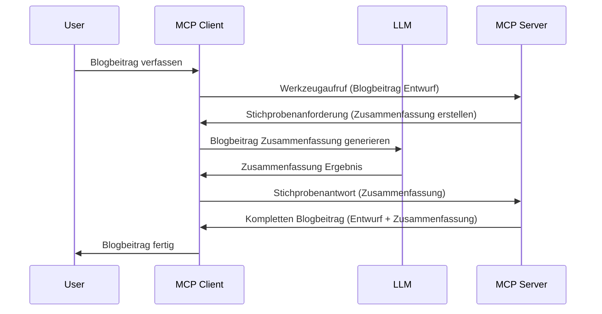

# Sampling – Funktionen an den Client delegieren

> **Veralteter Hinweis:** Die MCP-Spezifikations-Release-Kandidaten vom `2026-07-28` kennzeichnen Sampling als veraltet zugunsten der direkten Integration mit APIs von LLM-Anbietern. Sampling funktioniert weiterhin in `2025-11-25` und mindestens ein Jahr nach einer offiziellen Veralterung, daher bleibt alles in dieser Lektion gültig — neue Server-Designs sollten jedoch das Ersatzmuster evaluieren. Siehe [Was ändert sich in MCP: Der Release-Kandidat 2026-07-28](../../01-CoreConcepts/mcp-2026-07-28-release-candidate.md).

Manchmal müssen der MCP Client und der MCP Server zusammenarbeiten, um ein gemeinsames Ziel zu erreichen. Möglicherweise gibt es einen Fall, bei dem der Server die Hilfe eines LLM benötigt, das auf dem Client läuft. Für diese Situation sollten Sie Sampling verwenden.

Lassen Sie uns einige Anwendungsfälle und den Aufbau einer Lösung mit Sampling betrachten.

## Überblick

In dieser Lektion konzentrieren wir uns darauf zu erklären, wann und wo Sampling eingesetzt wird und wie es konfiguriert wird.

## Lernziele

In diesem Kapitel werden wir:

- Erklären, was Sampling ist und wann es eingesetzt wird.
- Zeigen, wie Sampling in MCP konfiguriert wird.
- Beispiele für den Einsatz von Sampling liefern.

## Was ist Sampling und warum es verwenden?

Sampling ist ein fortgeschrittenes Feature, das folgendermaßen funktioniert:



### Sampling-Anfrage

Ok, jetzt haben wir einen Überblick über ein glaubwürdiges Szenario, lassen Sie uns über die Sampling-Anfrage sprechen, die der Server an den Client zurücksendet. So kann eine solche Anfrage im JSON-RPC-Format aussehen:

```json
{
  "jsonrpc": "2.0",
  "id": 1,
  "method": "sampling/createMessage",
  "params": {
    "messages": [
      {
        "role": "user",
        "content": {
          "type": "text",
          "text": "Create a blog post summary of the following blog post: <BLOG POST>"
        }
      }
    ],
    "modelPreferences": {
      "hints": [
        {
          "name": "claude-3-sonnet"
        }
      ],
      "intelligencePriority": 0.8,
      "speedPriority": 0.5
    },
    "systemPrompt": "You are a helpful assistant.",
    "maxTokens": 100
  }
}
```

Hier gibt es ein paar Punkte, die erwähnenswert sind:

- Prompt, unter content -> text, ist unsere Aufforderung, die eine Anweisung für das LLM ist, den Inhalt eines Blogbeitrags zusammenzufassen.

- **modelPreferences**. Dieser Abschnitt ist genau das, eine Präferenz, eine Empfehlung, welche Konfiguration mit dem LLM zu verwenden ist. Der Benutzer kann entscheiden, diesen Empfehlungen zu folgen oder sie zu ändern. In diesem Fall gibt es Empfehlungen zum zu verwendenden Modell sowie zur Priorisierung von Geschwindigkeit und Intelligenz.
- **systemPrompt**, dies ist Ihr normaler System-Prompt, der Ihrem LLM eine Persönlichkeit verleiht und Anleitung gibt.
- **maxTokens**, dies ist eine weitere Eigenschaft, die angibt, wie viele Tokens für diese Aufgabe empfohlen werden.

### Sampling-Antwort

Diese Antwort sendet der MCP Client letztlich an den MCP Server zurück und ist das Ergebnis davon, dass der Client das LLM aufruft, auf die Antwort wartet und dann diese Nachricht konstruiert. So kann sie im JSON-RPC aussehen:

```json
{
  "jsonrpc": "2.0",
  "id": 1,
  "result": {
    "role": "assistant",
    "content": {
      "type": "text",
      "text": "Here's your abstract <ABSTRACT>"
    },
    "model": "gpt-5",
    "stopReason": "endTurn"
  }
}
```

Beachten Sie, dass die Antwort eine Zusammenfassung des Blogbeitrags ist, genau wie wir es angefragt haben. Beachten Sie auch, dass das verwendete `model` nicht das ist, das wir angefragt haben, sondern „gpt-5“ statt „claude-3-sonnet“. Dies soll illustrieren, dass der Benutzer seine Meinung ändern kann, welches Modell er verwenden möchte, und dass Ihre Sampling-Anfrage eine Empfehlung ist.

Ok, jetzt wo wir den Hauptablauf verstanden haben und eine nützliche Aufgabe, für die es eingesetzt wird („Blog-Beitragserstellung + Zusammenfassung“), schauen wir uns an, was wir tun müssen, damit es funktioniert.

### Nachrichtentypen

Sampling-Nachrichten sind nicht nur auf Text beschränkt, sondern Sie können auch Bilder und Audio senden. So sieht der Unterschied im JSON-RPC aus:

**Text**

```json
{
  "type": "text",
  "text": "The message content"
}
```

**Bildinhalt**

```json
{
  "type": "image",
  "data": "base64-encoded-image-data",
  "mimeType": "image/jpeg"
}
```

**Audioinhalt**

```json
{
  "type": "audio",
  "data": "base64-encoded-audio-data",
  "mimeType": "audio/wav"
}
```

> HINWEIS: Für detailliertere Informationen zu Sampling lesen Sie die [offiziellen Dokumentationen](https://modelcontextprotocol.io/specification/2025-11-25/client/sampling).

## Wie richte ich Sampling im Client ein

> Hinweis: Wenn Sie nur einen Server bauen, müssen Sie hier nicht viel tun.

In einem Client müssen Sie das folgende Feature so angeben:

```json
{
  "capabilities": {
    "sampling": {}
  }
}
```

Dies wird dann beim Initialisieren des gewählten Clients mit dem Server aufgenommen.

## Beispiel für Sampling in Aktion – Erstellen eines Blogbeitrags

Lassen Sie uns zusammen einen Sampling-Server programmieren. Wir müssen Folgendes tun:

1. Ein Tool auf dem Server erstellen.
1. Dieses Tool soll eine Sampling-Anfrage erstellen.
1. Das Tool soll auf die Antwort der Sampling-Anfrage des Clients warten.
1. Dann soll das Ergebnis des Tools zurückgegeben werden.

Schauen wir uns den Code Schritt für Schritt an:

### -1- Tool erstellen

**python**

```python
@mcp.tool()
async def create_blog(title: str, content: str, ctx: Context[ServerSession, None]) -> str:
    """Create a blog post and generate a summary"""

```

### -2- Sampling-Anfrage erstellen

Erweitern Sie Ihr Tool mit folgendem Code:

**python**

```python
post = BlogPost(
        id=len(posts) + 1,
        title=title,
        content=content,
        abstract=""
    )

prompt = f"Create an abstract of the following blog post: title: {title} and draft: {content} "

result = await ctx.session.create_message(
        messages=[
            SamplingMessage(
                role="user",
                content=TextContent(type="text", text=prompt),
            )
        ],
        max_tokens=100,
)

```

### -3- Auf Antwort warten und Ergebnis zurückgeben

**python**

```python
post.abstract = result.content.text

posts.append(post)

# gib das vollständige Produkt zurück
return json.dumps({
    "id": post.title,
    "abstract": post.abstract
})
```

### -4- Vollständiger Code

**python**

```python
from starlette.applications import Starlette
from starlette.routing import Mount, Host

from mcp.server.fastmcp import Context, FastMCP

from mcp.server.session import ServerSession
from mcp.types import SamplingMessage, TextContent

import json


from uuid import uuid4
from typing import List
from pydantic import BaseModel


mcp = FastMCP("Blog post generator")

# app = FastAPI()

posts = []

class BlogPost(BaseModel):
    id: int
    title: str
    content: str
    abstract: str

posts: List[BlogPost] = []

@mcp.tool()
async def create_blog(title: str, content: str, ctx: Context[ServerSession, None]) -> str:
    """Create a blog post and generate a summary"""

    post = BlogPost(
        id=len(posts) + 1,
        title=title,
        content=content,
        abstract=""
    )

    prompt = f"Create an abstract of the following blog post: title: {title} and draft: {content} "

    result = await ctx.session.create_message(
        messages=[
            SamplingMessage(
                role="user",
                content=TextContent(type="text", text=prompt),
            )
        ],
        max_tokens=100,
    )

    post.abstract = result.content.text

    posts.append(post)

    # gib den vollständigen Blogbeitrag zurück
    return json.dumps({
        "id": post.title,
        "abstract": post.abstract
    })

if __name__ == "__main__":
    print("Starting server...")
    # mcp.run()
    mcp.run(transport="streamable-http")

# app starten mit: python server.py
```

### -5- Test in Visual Studio Code

Um dies in Visual Studio Code zu testen, gehen Sie wie folgt vor:

1. Starten Sie den Server im Terminal.
1. Fügen Sie ihn zu *mcp.json* hinzu (und stellen Sie sicher, dass er gestartet ist), zum Beispiel so:

   ```json
   "servers": {
      "blog-server": {
        "type": "http",
        "url": "http://localhost:8000/mcp"
      }
   }
   ```

1. Geben Sie einen Prompt ein:

   ```text
   create a blog post named "Where Python comes from", the content is "Python is actually named after Monty Python Flying Circus"
   ```

1. Erlauben Sie das Sampling. Beim ersten Test werden Sie einen zusätzlichen Dialog sehen, den Sie akzeptieren müssen, danach sehen Sie den normalen Dialog, in dem Sie gefragt werden, ob das Tool ausgeführt werden soll.

1. Ergebnisse prüfen. Sie sehen die Ergebnisse sowohl schön gerendert in GitHub Copilot Chat, können aber auch die rohe JSON-Antwort inspizieren.

**Bonus**. Visual Studio Code bietet großartige Unterstützung für Sampling. Sie können den Sampling-Zugriff auf Ihrem installierten Server konfigurieren, indem Sie Folgendes tun:

1. Navigieren Sie zum Erweiterungsbereich.
1. Wählen Sie das Zahnrad-Symbol für Ihren installierten Server in der Sektion „MCP SERVERS - INSTALLED“.
1. Wählen Sie „Configure Model Access“, hier können Sie auswählen, welche Modelle GitHub Copilot beim Sampling verwenden darf. Außerdem können Sie alle Sampling-Anfragen der letzten Zeit einsehen, indem Sie „Show Sampling requests“ auswählen.

## Aufgabe

In dieser Aufgabe bauen Sie ein etwas anderes Sampling, nämlich eine Sampling-Integration, die die Generierung einer Produktbeschreibung unterstützt. Hier ist Ihr Szenario:

**Szenario**: Der Mitarbeiter im Backoffice eines E-Commerce benötigt Hilfe, da das Erstellen von Produktbeschreibungen zu viel Zeit in Anspruch nimmt. Daher bauen Sie eine Lösung, bei der Sie ein Tool „create_product“ mit den Argumenten „title“ und „keywords“ aufrufen können, und es soll ein komplettes Produkt inklusive eines „description“-Felds erzeugt werden, das mit Hilfe eines LLMs auf dem Client gefüllt wird.

TIPP: Verwenden Sie, was Sie zuvor gelernt haben, um diesen Server und sein Tool mit einer Sampling-Anfrage zu konstruieren.

## Lösung

[Lösung](./solution/README.md)

## Wichtigste Erkenntnisse

Sampling ist eine leistungsstarke Funktion, mit der der Server Aufgaben an den Client delegieren kann, wenn er die Hilfe eines LLM benötigt.

## Was kommt als Nächstes

- [Kapitel 4 – Praktische Umsetzung](../../04-PracticalImplementation/README.md)

---

<!-- CO-OP TRANSLATOR DISCLAIMER START -->
**Haftungsausschluss**:
Dieses Dokument wurde mit dem KI-Übersetzungsdienst [Co-op Translator](https://github.com/Azure/co-op-translator) übersetzt. Obwohl wir uns um Genauigkeit bemühen, beachten Sie bitte, dass automatisierte Übersetzungen Fehler oder Ungenauigkeiten enthalten können. Das Originaldokument in seiner Ursprungssprache gilt als maßgebliche Quelle. Bei kritischen Informationen wird eine professionelle menschliche Übersetzung empfohlen. Wir übernehmen keine Haftung für Missverständnisse oder Fehlinterpretationen, die aus der Verwendung dieser Übersetzung entstehen.
<!-- CO-OP TRANSLATOR DISCLAIMER END -->