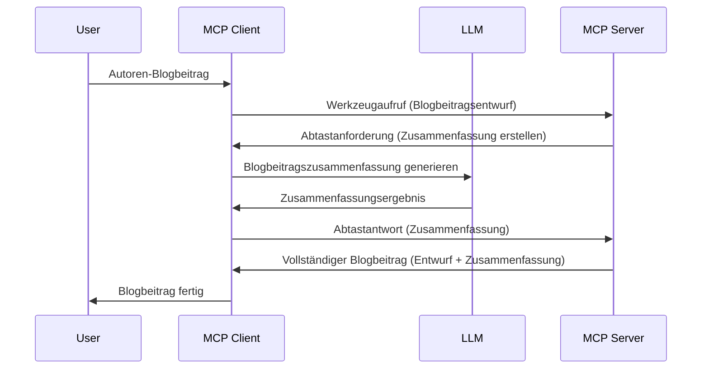

> [!WARNING]
> Sampling ist im MCP `2026-07-28` veraltet. Diese Lektion wird für
> ältere Implementierungen beibehalten. Neue Server sollten direkt mit einer LLM-
> Anbieter-API integriert werden.

# Sampling – Delegieren von Funktionen an den Client

> Sampling bleibt aus Kompatibilitätsgründen in der Spezifikation `2026-07-28` erhalten und ist
> für die erste Überarbeitung vorgesehen, die am oder nach dem 28. Juli
> 2027 veröffentlicht wird. Beispiele in dieser Lektion können SDK-APIs verwenden, die `2025-11-25` implementieren.
> Siehe [Was hat sich im MCP geändert: Die Spezifikation 2026-07-28](../../01-CoreConcepts/mcp-2026-07-28.md).

In Legacy-Implementierungen ermöglicht Sampling einem MCP-Server, Hilfe von einem
vom Client verwalteten LLM anzufordern. Für neue Implementierungen rufen Sie stattdessen
direkt den gewählten LLM-Anbieter auf.

Lassen Sie uns einige Anwendungsfälle und den Aufbau einer Lösung mit Sampling erkunden.

## Überblick

In dieser Lektion konzentrieren wir uns darauf, zu erläutern, wann und wo Sampling verwendet werden soll und wie es konfiguriert wird.

## Lernziele

In diesem Kapitel werden wir:

- Erklären, was Sampling ist und wann man es verwenden sollte.
- Zeigen, wie Sampling im MCP konfiguriert wird.
- Beispiele für Sampling in Aktion liefern.

## Was ist Sampling und warum es verwenden?

Sampling ist eine erweiterte Funktion, die wie folgt funktioniert:



### Sampling-Anfrage

Ok, jetzt haben wir einen Überblick über ein glaubwürdiges Szenario, sprechen wir über die Sampling-Anfrage, die der Server an den Client sendet. So könnte eine solche Anfrage im JSON-RPC-Format aussehen:

```json
{
  "jsonrpc": "2.0",
  "id": 1,
  "method": "sampling/createMessage",
  "params": {
    "messages": [
      {
        "role": "user",
        "content": {
          "type": "text",
          "text": "Create a blog post summary of the following blog post: <BLOG POST>"
        }
      }
    ],
    "modelPreferences": {
      "hints": [
        {
          "name": "claude-3-sonnet"
        }
      ],
      "intelligencePriority": 0.8,
      "speedPriority": 0.5
    },
    "systemPrompt": "You are a helpful assistant.",
    "maxTokens": 100
  }
}
```

Es gibt hier einige Punkte, die erwähnenswert sind:

- Prompt, unter content -> text, ist unser Prompt, eine Anweisung für den LLM, den Blogpost-Inhalt zusammenzufassen.

- **modelPreferences**. Dieser Abschnitt ist genau das, eine Präferenz, eine Empfehlung, welche Konfiguration mit dem LLM verwendet werden soll. Der Benutzer kann entscheiden, ob er diese Empfehlungen übernimmt oder ändert. In diesem Fall gibt es Empfehlungen zum Modell, zur Geschwindigkeit und zur Priorität der Intelligenz.
- **systemPrompt**, dies ist Ihr normaler System-Prompt, der dem LLM eine Persönlichkeit verleiht und Anweisungen enthält.
- **maxTokens**, dies ist eine weitere Eigenschaft, die angibt, wie viele Tokens für diese Aufgabe empfohlen werden.

### Sampling-Antwort

Diese Antwort ist das, was der MCP-Client schließlich zurück an den MCP-Server sendet, und ist das Ergebnis, dass der Client den LLM aufruft, auf die Antwort wartet und dann diese Nachricht konstruiert. So könnte sie im JSON-RPC aussehen:

```json
{
  "jsonrpc": "2.0",
  "id": 1,
  "result": {
    "role": "assistant",
    "content": {
      "type": "text",
      "text": "Here's your abstract <ABSTRACT>"
    },
    "model": "gpt-5",
    "stopReason": "endTurn"
  }
}
```

Beachten Sie, dass die Antwort eine Zusammenfassung des Blogposts ist, genau wie wir es verlangt haben. Beachten Sie auch, dass das verwendete `model` nicht das angefragte, sondern „gpt-5“ anstelle von „claude-3-sonnet“ ist. Dies soll zeigen, dass der Benutzer seine Meinung ändern kann und dass Ihre Sampling-Anfrage eine Empfehlung ist.

Ok, jetzt, wo wir den Hauptablauf verstehen und eine nützliche Aufgabe wie „Blogpost-Erstellung + Zusammenfassung“ kennen, sehen wir, was wir tun müssen, damit es funktioniert.

### Nachrichtentypen

Sampling-Nachrichten sind nicht nur auf Text beschränkt, sondern Sie können auch Bilder und Audio senden. So sieht der JSON-RPC unterschiedlich aus:

**Text**

```json
{
  "type": "text",
  "text": "The message content"
}
```

**Bildinhalt**

```json
{
  "type": "image",
  "data": "base64-encoded-image-data",
  "mimeType": "image/jpeg"
}
```

**Audioinhalt**

```json
{
  "type": "audio",
  "data": "base64-encoded-audio-data",
  "mimeType": "audio/wav"
}
```

> HINWEIS: Für den aktuellen Status und Migrationshinweise siehe die
> [veraltete Sampling-Dokumentation](https://modelcontextprotocol.io/specification/2026-07-28/client/sampling).

## Wie man Sampling im Client konfiguriert

> Hinweis: Wenn Sie nur einen Server bauen, müssen Sie hier nicht viel tun.

In einem Client müssen Sie die folgende Funktion so angeben:

```json
{
  "capabilities": {
    "sampling": {}
  }
}
```

Dies wird dann beim Initialisieren Ihres gewählten Clients mit dem Server übernommen.

## Beispiel für Sampling in Aktion – Erstellen eines Blogposts

Lassen Sie uns gemeinsam einen Sampling-Server programmieren, wir müssen Folgendes tun:

1. Ein Tool auf dem Server erstellen.
1. Dieses Tool sollte eine Sampling-Anfrage erstellen.
1. Das Tool sollte auf die Antwort der Sampling-Anfrage des Clients warten.
1. Dann soll das Tool-Ergebnis erzeugt werden.

Sehen wir uns den Code Schritt für Schritt an:

### -1- Das Tool erstellen

**python**

```python
@mcp.tool()
async def create_blog(title: str, content: str, ctx: Context[ServerSession, None]) -> str:
    """Create a blog post and generate a summary"""

```

### -2- Eine Sampling-Anfrage erzeugen

Erweitern Sie Ihr Tool mit folgendem Code:

**python**

```python
post = BlogPost(
        id=len(posts) + 1,
        title=title,
        content=content,
        abstract=""
    )

prompt = f"Create an abstract of the following blog post: title: {title} and draft: {content} "

result = await ctx.session.create_message(
        messages=[
            SamplingMessage(
                role="user",
                content=TextContent(type="text", text=prompt),
            )
        ],
        max_tokens=100,
)

```

### -3- Auf die Antwort warten und zurückgeben

**python**

```python
post.abstract = result.content.text

posts.append(post)

# gib das vollständige Produkt zurück
return json.dumps({
    "id": post.title,
    "abstract": post.abstract
})
```

### -4- Vollständiger Code

**python**

```python
from starlette.applications import Starlette
from starlette.routing import Mount, Host

from mcp.server.fastmcp import Context, FastMCP

from mcp.server.session import ServerSession
from mcp.types import SamplingMessage, TextContent

import json


from uuid import uuid4
from typing import List
from pydantic import BaseModel


mcp = FastMCP("Blog post generator")

# app = FastAPI()

posts = []

class BlogPost(BaseModel):
    id: int
    title: str
    content: str
    abstract: str

posts: List[BlogPost] = []

@mcp.tool()
async def create_blog(title: str, content: str, ctx: Context[ServerSession, None]) -> str:
    """Create a blog post and generate a summary"""

    post = BlogPost(
        id=len(posts) + 1,
        title=title,
        content=content,
        abstract=""
    )

    prompt = f"Create an abstract of the following blog post: title: {title} and draft: {content} "

    result = await ctx.session.create_message(
        messages=[
            SamplingMessage(
                role="user",
                content=TextContent(type="text", text=prompt),
            )
        ],
        max_tokens=100,
    )

    post.abstract = result.content.text

    posts.append(post)

    # gib den vollständigen Blogbeitrag zurück
    return json.dumps({
        "id": post.title,
        "abstract": post.abstract
    })

if __name__ == "__main__":
    print("Starting server...")
    # mcp.run()
    mcp.run(transport="streamable-http")

# starte die App mit: python server.py
```

### -5- Testen in Visual Studio Code

Um das in Visual Studio Code zu testen, wie folgt vorgehen:

1. Server im Terminal starten
1. Es zu *mcp.json* hinzufügen (und sicherstellen, dass er gestartet wird), z.B. so:

   ```json
   "servers": {
      "blog-server": {
        "type": "http",
        "url": "http://localhost:8000/mcp"
      }
   }
   ```

1. Einen Prompt eingeben:

   ```text
   create a blog post named "Where Python comes from", the content is "Python is actually named after Monty Python Flying Circus"
   ```

1. Sampling zulassen. Beim ersten Test erhalten Sie einen zusätzlichen Dialog, den Sie akzeptieren müssen, danach sehen Sie den normalen Dialog, um ein Tool auszuführen.

1. Ergebnisse prüfen. Sie sehen die Ergebnisse sowohl schön gerendert in GitHub Copilot Chat als auch die rohe JSON-Antwort.

**Bonus**. Das Visual Studio Code Tooling unterstützt Sampling hervorragend. Sie können den Sampling-Zugriff auf Ihrem installierten Server konfigurieren, indem Sie so vorgehen:

1. Zum Erweiterungsbereich navigieren.
1. Das Zahnrad-Symbol für Ihren installierten Server im Abschnitt "MCP SERVERS - INSTALLED" auswählen.
1. "Configure Model Access" auswählen, hier können Sie auswählen, welche Modelle GitHub Copilot beim Sampling verwenden darf. Sie können auch alle kürzlich stattgefundenen Sampling-Anfragen ansehen, indem Sie "Show Sampling requests" auswählen.

## Aufgabe

In dieser Aufgabe bauen Sie ein leicht anderes Sampling, nämlich eine Sampling-Integration, die das Erzeugen einer Produktbeschreibung unterstützt. Hier ist Ihr Szenario:

**Szenario**: Der Büro-Mitarbeiter eines E-Commerce benötigt Hilfe, da das Erstellen von Produktbeschreibungen zu viel Zeit in Anspruch nimmt. Daher sollen Sie eine Lösung bauen, bei der ein Tool "create_product" mit "title" und "keywords" als Argumente aufgerufen wird und ein komplettes Produkt einschließlich eines Feldes "description" zurückgibt, das vom LLM des Clients befüllt wird.

TIPP: Nutzen Sie das Gelernte aus vorher, um diesen Server und sein Tool mit einer Sampling-Anfrage zu erstellen.

## Lösung

[Lösung](./solution/README.md)

## Wichtige Erkenntnisse


Sampling ist eine leistungsstarke Funktion, die es dem Server ermöglicht, Aufgaben an den Client zu delegieren, wenn er die Hilfe eines LLM benötigt.

## Was kommt als Nächstes

- [Kapitel 4 - Praktische Umsetzung](../../04-PracticalImplementation/README.md)

---

<!-- CO-OP TRANSLATOR DISCLAIMER START -->
**Haftungsausschluss**:
Dieses Dokument wurde mit dem KI-Übersetzungsdienst [Co-op Translator](https://github.com/Azure/co-op-translator) übersetzt. Obwohl wir uns um Genauigkeit bemühen, beachten Sie bitte, dass automatisierte Übersetzungen Fehler oder Ungenauigkeiten enthalten können. Das Originaldokument in seiner Ursprungssprache gilt als maßgebliche Quelle. Bei kritischen Informationen wird eine professionelle menschliche Übersetzung empfohlen. Wir übernehmen keine Haftung für Missverständnisse oder Fehlinterpretationen, die aus der Verwendung dieser Übersetzung entstehen.
<!-- CO-OP TRANSLATOR DISCLAIMER END -->