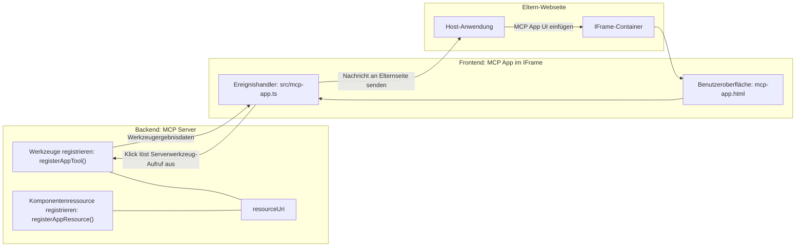
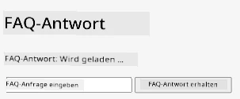
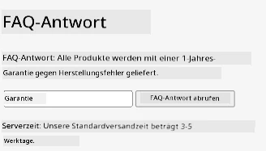
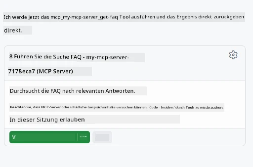

# MCP Apps

MCP Apps ist ein neues Paradigma bei MCP. Die Idee ist, dass Sie nicht nur Daten als Antwort auf einen Tool-Aufruf zurückgeben, sondern auch Informationen dazu bereitstellen, wie mit diesen Informationen interagiert werden soll. Das bedeutet, dass Tool-Ergebnisse jetzt UI-Informationen enthalten können. Warum wollen wir das? Betrachten Sie, wie Sie heute vorgehen. Wahrscheinlich konsumieren Sie die Ergebnisse eines MCP Servers, indem Sie eine Art Frontend davor schalten, das ist Code, den Sie schreiben und pflegen müssen. Manchmal ist das genau das, was Sie möchten, aber manchmal wäre es großartig, wenn Sie einfach ein in sich geschlossenes Informationssnippet bringen könnten, das alles von den Daten bis zur Benutzeroberfläche enthält.

## Überblick

Diese Lektion bietet praktische Anleitungen zu MCP Apps, wie man damit beginnt und wie man sie in vorhandene Web Apps integriert. MCP Apps sind eine sehr neue Ergänzung des MCP Standards.

## Lernziele

Am Ende dieser Lektion werden Sie in der Lage sein:

- Zu erklären, was MCP Apps sind.
- Zu wissen, wann MCP Apps eingesetzt werden sollten.
- Eigene MCP Apps zu entwickeln und zu integrieren.

## MCP Apps – wie funktioniert das

Die Idee bei MCP Apps ist, eine Antwort bereitzustellen, die im Wesentlichen eine zu rendernde Komponente ist. Eine solche Komponente kann sowohl Visuals als auch Interaktivität besitzen, z. B. Button-Klicks, Benutzereingaben und mehr. Beginnen wir mit der Serverseite und unserem MCP Server. Um eine MCP App-Komponente zu erstellen, müssen Sie ein Tool und auch die Anwendungsressource anlegen. Diese beiden Teile werden durch eine resourceUri verbunden.

Hier ein Beispiel. Versuchen wir zu visualisieren, was involviert ist und welche Teile was machen:

```text
server.ts -- responsible for registering tools and the component as a UI component
src/
  mcp-app.ts -- wiring up event handlers
mcp-app.html -- the user interface
```
  
Diese Visualisierung beschreibt die Architektur zur Erstellung einer Komponente und deren Logik.


Versuchen wir als Nächstes, die Verantwortlichkeiten für Backend bzw. Frontend zu beschreiben.

### Das Backend

Hier müssen wir zwei Dinge erledigen:

- Registrierung der Tools, mit denen wir interagieren wollen.
- Definition der Komponente.

**Tool registrieren**

```typescript
registerAppTool(
    server,
    "get-time",
    {
      title: "Get Time",
      description: "Returns the current server time.",
      inputSchema: {},
      _meta: { ui: { resourceUri } }, // Verknüpft dieses Werkzeug mit seiner UI-Ressource
    },
    async () => {
      const time = new Date().toISOString();
      return { content: [{ type: "text", text: time }] };
    },
  );

```
  
Der obige Code beschreibt das Verhalten, wobei ein Tool namens `get-time` bereitgestellt wird. Es nimmt keine Eingaben, liefert aber die aktuelle Zeit zurück. Wir haben die Möglichkeit, für Tools ein `inputSchema` zu definieren, wenn Benutzereingaben erforderlich sind.

**Komponente registrieren**

In derselben Datei müssen wir auch die Komponente registrieren:

```typescript
const resourceUri = "ui://get-time/mcp-app.html";

// Registrieren Sie die Ressource, die das gebündelte HTML/JavaScript für die Benutzeroberfläche zurückgibt.
registerAppResource(
  server,
  resourceUri,
  resourceUri,
  { mimeType: RESOURCE_MIME_TYPE },
  async () => {
    const html = await fs.readFile(path.join(DIST_DIR, "mcp-app.html"), "utf-8");

    return {
    contents: [
        { uri: resourceUri, mimeType: RESOURCE_MIME_TYPE, text: html },
    ],
    };
  },
);
```
  
Beachten Sie, wie wir `resourceUri` erwähnen, um die Komponente mit ihren Tools zu verbinden. Interessant ist auch der Callback, bei dem wir die UI-Datei laden und die Komponente zurückgeben.

### Das Frontend der Komponente

Wie beim Backend gibt es hier zwei Teile:

- Ein Frontend, geschrieben in reinem HTML.
- Code, der Ereignisse behandelt und Aktionen wie das Aufrufen von Tools oder das Senden von Nachrichten an das übergeordnete Fenster vornimmt.

**Benutzeroberfläche**

Werfen wir einen Blick auf die Benutzeroberfläche.

```html
<!-- mcp-app.html -->
<!DOCTYPE html>
<html lang="en">
  <head>
    <meta charset="UTF-8" />
    <title>Get Time App</title>
  </head>
  <body>
    <p>
      <strong>Server Time:</strong> <code id="server-time">Loading...</code>
    </p>
    <button id="get-time-btn">Get Server Time</button>
    <script type="module" src="/src/mcp-app.ts"></script>
  </body>
</html>
```
  
**Ereignisbindung**

Das letzte Teilstück ist die Ereignisbindung. Das bedeutet, wir identifizieren, welcher Teil unserer UI Ereignishandler benötigt und was zu tun ist, wenn Ereignisse ausgelöst werden:

```typescript
// mcp-app.ts

import { App } from "@modelcontextprotocol/ext-apps";

// Elementreferenzen abrufen
const serverTimeEl = document.getElementById("server-time")!;
const getTimeBtn = document.getElementById("get-time-btn")!;

// App-Instanz erstellen
const app = new App({ name: "Get Time App", version: "1.0.0" });

// Behandlung der Werkzeugergebnisse vom Server. Vor `app.connect()` setzen, um zu vermeiden
// das Initiale Werkzeugergebnis zu verpassen.
app.ontoolresult = (result) => {
  const time = result.content?.find((c) => c.type === "text")?.text;
  serverTimeEl.textContent = time ?? "[ERROR]";
};

// Button-Klick verbinden
getTimeBtn.addEventListener("click", async () => {
  // `app.callServerTool()` ermöglicht der UI, frische Daten vom Server anzufordern
  const result = await app.callServerTool({ name: "get-time", arguments: {} });
  const time = result.content?.find((c) => c.type === "text")?.text;
  serverTimeEl.textContent = time ?? "[ERROR]";
});

// Mit Host verbinden
app.connect();
```
  
Wie oben erkennbar, handelt es sich hierbei um normalen Code, um DOM-Elemente mit Ereignissen zu verknüpfen. Erwähnenswert ist der Aufruf von `callServerTool`, der letztlich ein Tool auf dem Backend aufruft.

## Umgang mit Benutzereingaben

Bisher haben wir eine Komponente gesehen, die einen Button hat, der bei Klick ein Tool aufruft. Schauen wir, ob wir weitere UI-Elemente wie ein Eingabefeld hinzufügen und Argumente an ein Tool übergeben können. Wir implementieren eine FAQ-Funktionalität. So soll sie funktionieren:

- Es soll einen Button und ein Eingabeelement geben, wo der Benutzer ein Schlüsselwort z. B. „Versand“ eingibt. Dies soll ein Tool auf dem Backend aufrufen, das eine Suche in den FAQ-Daten durchführt.
- Ein Tool, das die erwähnte FAQ-Suche unterstützt.

Fügen wir zuerst die benötigte Unterstützung im Backend hinzu:

```typescript
const faq: { [key: string]: string } = {
    "shipping": "Our standard shipping time is 3-5 business days.",
    "return policy": "You can return any item within 30 days of purchase.",
    "warranty": "All products come with a 1-year warranty covering manufacturing defects.",
  }

registerAppTool(
    server,
    "get-faq",
    {
      title: "Search FAQ",
      description: "Searches the FAQ for relevant answers.",
      inputSchema: zod.object({
        query: zod.string().default("shipping"),
      }),
      _meta: { ui: { resourceUri: faqResourceUri } }, // Verknüpft dieses Werkzeug mit seiner UI-Ressource
    },
    async ({ query }) => {
      const answer: string = faq[query.toLowerCase()] || "Sorry, I don't have an answer for that.";
      return { content: [{ type: "text", text: answer }] };
    },
  );
```
  
Hier sehen wir, wie wir `inputSchema` befüllen und ihm ein `zod`-Schema geben:

```typescript
inputSchema: zod.object({
  query: zod.string().default("shipping"),
})
```
  
Im obenstehenden Schema deklarieren wir einen Eingabeparameter namens `query`, der optional ist und einen Standardwert von „shipping“ hat.

Gut, gehen wir als Nächstes zu *mcp-app.html* und sehen uns an, welche UI wir erstellen müssen:

```html
<div class="faq">
    <h1>FAQ response</h1>
    <p>FAQ Response: <code id="faq-response">Loading...</code></p>
    <input type="text" id="faq-query" placeholder="Enter FAQ query" />
    <button id="get-faq-btn">Get FAQ Response</button>
  </div>
```
  
Super, jetzt haben wir ein Eingabeelement und einen Button. Gehen wir als Nächstes zu *mcp-app.ts*, um diese Events zu verknüpfen:

```typescript
const getFaqBtn = document.getElementById("get-faq-btn")!;
const faqQueryInput = document.getElementById("faq-query") as HTMLInputElement;

getFaqBtn.addEventListener("click", async () => {
  const query = faqQueryInput.value;
  const result = await app.callServerTool({ name: "get-faq", arguments: { query } });
  const faq = result.content?.find((c) => c.type === "text")?.text;
  faqResponseEl.textContent = faq ?? "[ERROR]";
});
```
  
Im obigen Code:

- Erstellen wir Referenzen zu den interessanten UI-Elementen.
- Handhaben einen Button-Klick, lesen den Wert des Eingabeelements aus und rufen zudem `app.callServerTool()` mit `name` und `arguments` auf, wobei letzteres `query` als Wert übergibt.

Was tatsächlich passiert, wenn Sie `callServerTool` aufrufen, ist, dass eine Nachricht an das übergeordnete Fenster gesendet wird und dieses dann den MCP Server aufruft.

### Probieren Sie es aus

Probieren Sie dies aus, sollten Sie Folgendes sehen:



Und hier, wenn wir beispielsweise „warranty“ eingeben:



Um diesen Code auszuführen, gehen Sie zum [Code Abschnitt](./code/README.md)

## Testen in Visual Studio Code

Visual Studio Code bietet großartige Unterstützung für MVP Apps und ist wahrscheinlich eine der einfachsten Möglichkeiten, Ihre MCP Apps zu testen. Um Visual Studio Code zu verwenden, fügen Sie eine Server-Eintragung zu *mcp.json* hinzu, wie folgt:

```json
"my-mcp-server-7178eca7": {
    "url": "http://localhost:3001/mcp",
    "type": "http"
  }
```
  
Starten Sie dann den Server. Sie sollten über das Chat-Fenster mit Ihrer MVP App kommunizieren können, vorausgesetzt, Sie haben GitHub Copilot installiert.

Dies kann man per Prompt triggern, z. B. "#get-faq":



Und genauso wie beim Ausführen im Webbrowser, wird es genauso gerendert:


## Aufgabe

Erstellen Sie ein Schere-Stein-Papier-Spiel. Es soll Folgendes enthalten:

UI:

- eine Dropdown-Liste mit Optionen
- einen Button zur Auswahlbestätigung
- ein Label, das zeigt, wer was gewählt hat und wer gewonnen hat

Server:

- sollte ein Schere-Stein-Papier-Tool haben, das "choice" als Eingabe akzeptiert. Es soll auch eine Computer-Wahl anzeigen und den Gewinner bestimmen.

## Lösung

[Lösung](./assignment/README.md)

## Zusammenfassung

Wir haben dieses neue Paradigma MCP Apps kennengelernt. Es ist ein neues Paradigma, das es MCP Servern erlaubt, nicht nur Daten, sondern auch eine Vorstellung davon zu haben, wie diese Daten präsentiert werden sollen.

Außerdem haben wir gelernt, dass diese MCP Apps in einem IFrame gehostet werden und zur Kommunikation mit MCP Servern Nachrichten an die übergeordnete Web App senden müssen. Es gibt verschiedene Bibliotheken, sowohl für reines JavaScript als auch für React und weitere, die diese Kommunikation erleichtern.

## Wichtigste Erkenntnisse

Das haben Sie gelernt:

- MCP Apps sind ein neuer Standard, der nützlich ist, wenn Sie sowohl Daten als auch UI-Funktionen bereitstellen möchten.
- Diese Arten von Apps laufen aus Sicherheitsgründen in einem IFrame.

## Was kommt als Nächstes

- [Kapitel 4](../../04-PracticalImplementation/README.md)

---

<!-- CO-OP TRANSLATOR DISCLAIMER START -->
**Haftungsausschluss**:  
Dieses Dokument wurde mit dem KI-Übersetzungsdienst [Co-op Translator](https://github.com/Azure/co-op-translator) übersetzt. Obwohl wir uns um Genauigkeit bemühen, beachten Sie bitte, dass automatisierte Übersetzungen Fehler oder Ungenauigkeiten enthalten können. Das Originaldokument in seiner ursprünglichen Sprache gilt als maßgebliche Quelle. Für wichtige Informationen wird eine professionelle menschliche Übersetzung empfohlen. Wir haften nicht für Missverständnisse oder Fehlinterpretationen, die aus der Verwendung dieser Übersetzung entstehen.
<!-- CO-OP TRANSLATOR DISCLAIMER END -->