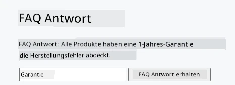
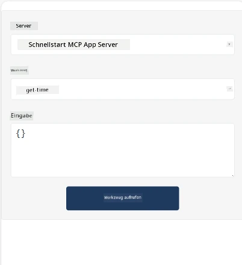
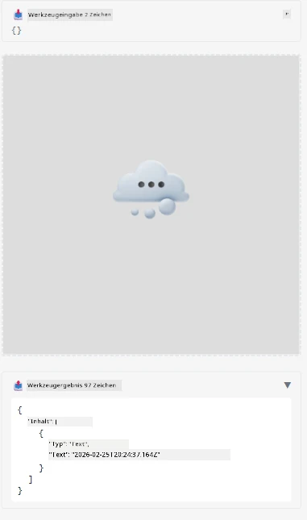

Hier ist ein Beispiel, das die MCP App demonstriert

## Installation

1. Navigiere zum Ordner *mcp-app*
1. Führe `npm install` aus, dies sollte Frontend- und Backend-Abhängigkeiten installieren

Überprüfe, ob das Backend kompiliert, indem du Folgendes ausführst:

```sh
npx tsc --noEmit
```

Es sollte keine Ausgabe erscheinen, wenn alles in Ordnung ist.

## Backend starten

> Dies erfordert etwas mehr Aufwand, wenn du eine Windows-Maschine nutzt, da die MCP Apps-Lösung die Bibliothek `concurrently` verwendet, für die du einen Ersatz finden musst. Hier ist die betreffende Zeile in der *package.json* der MCP App:

    ```json
    "start": "concurrently \"cross-env NODE_ENV=development INPUT=mcp-app.html vite build --watch\" \"tsx watch main.ts\""
    ```

Diese App besteht aus zwei Teilen, einem Backend-Teil und einem Host-Teil.

Starte das Backend mit folgendem Befehl:

```sh
npm start
```

Dies sollte das Backend unter `http://localhost:3001/mcp` starten.

> Hinweis: Wenn du dich in einem Codespace befindest, musst du möglicherweise die Port-Sichtbarkeit auf öffentlich setzen. Prüfe, ob du den Endpunkt im Browser über https://<Name des Codespace>.app.github.dev/mcp erreichen kannst.

## Variante -1- Teste die App in Visual Studio Code

Um die Lösung in Visual Studio Code zu testen, gehe wie folgt vor:

- Füge einen Server-Eintrag in `mcp.json` hinzu, wie hier gezeigt:

    ```json
    {
        "servers": {
            "my-mcp-server-7178eca7": {
                "url": "http://localhost:3001/mcp",
                "type": "http"
            }
        },
        "inputs": []
    }
    ```

1. Klicke die Schaltfläche „start“ in *mcp.json*
1. Stelle sicher, dass ein Chatfenster geöffnet ist, und tippe `get-faq`, du solltest ein Ergebnis wie folgt sehen:

    

## Variante -2- Teste die App mit einem Host

Das Repo <https://github.com/modelcontextprotocol/ext-apps> enthält mehrere verschiedene Hosts, die du verwenden kannst, um deine MVP Apps zu testen.

Wir stellen dir hier zwei verschiedene Optionen vor:

### Lokale Maschine

- Navigiere zum Ordner *ext-apps*, nachdem du das Repo geklont hast.

- Installiere die Abhängigkeiten

   ```sh
   npm install
   ```

- Öffne in einem separaten Terminalfenster den Ordner *ext-apps/examples/basic-host*

    > Wenn du einen Codespace hast, musst du zu serve.ts in Zeile 27 navigieren und http://localhost:3001/mcp durch deine Codespace-URL für das Backend ersetzen, z. B. https://psychic-xylophone-657rpjgvxpc5g64-3001.app.github.dev/mcp

- Starte den Host:

    ```sh
    npm start
    ```

    Dies sollte den Host mit dem Backend verbinden und die App so ausführen, wie hier gezeigt:

    

### Codespace

Es erfordert etwas mehr Aufwand, eine Codespace-Umgebung zum Laufen zu bringen. Um über Codespace einen Host zu nutzen:

- Sieh dir das Verzeichnis *ext-apps* an und wechsle zu *examples/basic-host*.
- Führe `npm install` aus, um die Abhängigkeiten zu installieren
- Führe `npm start` aus, um den Host zu starten.

## Teste die App

Probiere die App auf folgende Weise aus:

- Wähle die Schaltfläche "Call Tool" und du solltest folgende Ergebnisse sehen:

    

Super, alles funktioniert.

---

<!-- CO-OP TRANSLATOR DISCLAIMER START -->
**Haftungsausschluss**:  
Dieses Dokument wurde mit dem KI-Übersetzungsdienst [Co-op Translator](https://github.com/Azure/co-op-translator) übersetzt. Obwohl wir uns um Genauigkeit bemühen, beachten Sie bitte, dass automatisierte Übersetzungen Fehler oder Ungenauigkeiten enthalten können. Das Originaldokument in seiner ursprünglichen Sprache gilt als maßgebliche Quelle. Für kritische Informationen wird eine professionelle menschliche Übersetzung empfohlen. Wir übernehmen keine Haftung für Missverständnisse oder Fehlinterpretationen, die durch die Nutzung dieser Übersetzung entstehen.
<!-- CO-OP TRANSLATOR DISCLAIMER END -->