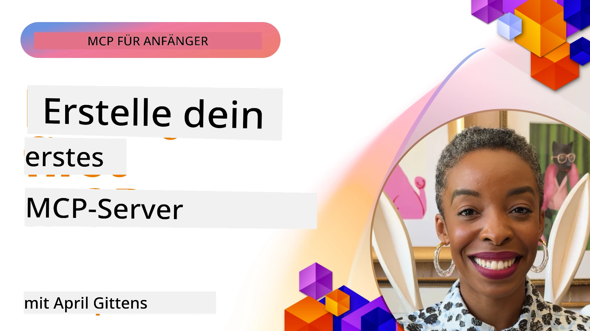

## Erste Schritte  

_(Klicke auf das Bild oben, um das Video zu dieser Lektion anzusehen)_

Dieser Abschnitt besteht aus mehreren Lektionen:

- **1 Dein erster Server**, in dieser ersten Lektion lernst du, wie du deinen ersten Server erstellst und ihn mit dem Inspector-Tool inspizierst, eine wertvolle Methode, um deinen Server zu testen und zu debuggen, [zur Lektion](01-first-server/README.md)

- **2 Client**, in dieser Lektion lernst du, wie du einen Client schreibst, der eine Verbindung zu deinem Server herstellen kann, [zur Lektion](02-client/README.md)

- **3 Client mit LLM**, eine noch bessere Möglichkeit, einen Client zu schreiben, ist, diesem ein LLM hinzuzufügen, damit es mit deinem Server „verhandeln“ kann, was zu tun ist, [zur Lektion](03-llm-client/README.md)

- **4 Nutzung eines Server GitHub Copilot Agent Modus in Visual Studio Code**. Hier betrachten wir, wie unser MCP-Server aus Visual Studio Code heraus ausgeführt wird, [zur Lektion](04-vscode/README.md)

- **5 stdio Transport Server** stdio Transport ist der empfohlene Standard für die lokale MCP Server-zu-Client-Kommunikation und bietet sichere Subprozess-Kommunikation mit eingebauter Prozessisolation, [zur Lektion](05-stdio-server/README.md)

- **6 HTTP Streaming mit MCP (Streamable HTTP)**. Lerne modernen HTTP-Streaming-Transport kennen (der empfohlene Ansatz für entfernte MCP-Server gemäß [MCP Specification 2025-11-25](https://spec.modelcontextprotocol.io/specification/2025-11-25/basic/transports/#streamable-http)), Fortschrittsbenachrichtigungen und wie skalierbare, Echtzeit-MCP-Server und Clients mit Streamable HTTP implementiert werden. [zur Lektion](06-http-streaming/README.md)

- **7 Nutzung des AI Toolkits für VSCode** zur Verwendung und zum Testen deiner MCP Clients und Server [zur Lektion](07-aitk/README.md)

- **8 Testen**. Hier konzentrieren wir uns besonders darauf, wie wir unseren Server und Client auf verschiedene Arten testen können, [zur Lektion](08-testing/README.md)

- **9 Deployment**. Dieses Kapitel betrachtet verschiedene Möglichkeiten, deine MCP-Lösungen bereitzustellen, [zur Lektion](09-deployment/README.md)

- **10 Erweiterte Servernutzung**. Dieses Kapitel behandelt die erweiterte Servernutzung, [zur Lektion](./10-advanced/README.md)

- **11 Auth**. Dieses Kapitel behandelt, wie man einfache Authentifizierung hinzufügt, von Basic Auth bis zur Verwendung von JWT und RBAC. Es wird empfohlen hier zu starten und danach die erweiterten Themen in Kapitel 5 anzuschauen sowie zusätzliche Sicherheitshärtungen durch Empfehlungen in Kapitel 2 durchzuführen, [zur Lektion](./11-simple-auth/README.md)

- **12 MCP Hosts**. Konfiguriere und nutze populäre MCP Host Clients einschließlich Claude Desktop, Cursor, Cline und Windsurf. Lerne Transporttypen und Fehlerbehebung, [zur Lektion](./12-mcp-hosts/README.md)

- **13 MCP Inspector**. Debugge und teste deine MCP Server interaktiv mit dem MCP Inspector Tool. Lerne Fehlersuche bei Tools, Ressourcen und Protokollnachrichten, [zur Lektion](./13-mcp-inspector/README.md)

- **14 Sampling**. Erstelle MCP Server, die mit MCP Clients bei LLM-bezogenen Aufgaben zusammenarbeiten. [zur Lektion](./14-sampling/README.md)

- **15 MCP Apps**. Baue MCP Server, die auch mit UI-Anweisungen antworten, [zur Lektion](./15-mcp-apps/README.md)

Das Model Context Protocol (MCP) ist ein offenes Protokoll, das standardisiert, wie Anwendungen Kontext an LLMs bereitstellen. Man kann MCP wie einen USB-C Anschluss für KI-Anwendungen betrachten – es bietet eine standardisierte Möglichkeit, KI-Modelle mit verschiedenen Datenquellen und Werkzeugen zu verbinden.

## Lernziele

Am Ende dieser Lektion wirst du in der Lage sein:

- Entwicklungsumgebungen für MCP in C#, Java, Python, TypeScript und JavaScript einzurichten
- Einfache MCP Server mit benutzerdefinierten Funktionen (Ressourcen, Eingabeaufforderungen und Werkzeuge) zu erstellen und bereitzustellen
- Host-Anwendungen zu erstellen, die sich mit MCP Servern verbinden
- MCP Implementierungen zu testen und zu debuggen
- Häufige Einrichtungsprobleme und deren Lösungen zu verstehen
- Deine MCP Implementierungen mit beliebten LLM-Diensten zu verbinden

## Einrichtung deiner MCP Umgebung

Bevor du mit MCP arbeitest, ist es wichtig, deine Entwicklungsumgebung vorzubereiten und den grundlegenden Arbeitsablauf zu verstehen. Dieser Abschnitt führt dich durch die ersten Einrichtungsschritte, damit du einen reibungslosen Start mit MCP hast.

### Voraussetzungen

Bevor du mit der MCP-Entwicklung beginnst, stelle Folgendes sicher:

- **Entwicklungsumgebung**: Für deine gewählte Sprache (C#, Java, Python, TypeScript oder JavaScript)
- **IDE/Editor**: Visual Studio, Visual Studio Code, IntelliJ, Eclipse, PyCharm oder ein moderner Code-Editor
- **Paketmanager**: NuGet, Maven/Gradle, pip oder npm/yarn
- **API-Schlüssel**: Für alle KI-Dienste, die du in deinen Host-Anwendungen verwenden möchtest

### Offizielle SDKs

In den kommenden Kapiteln siehst du Lösungen, die mit Python, TypeScript, Java und .NET gebaut sind. Hier sind alle offiziell unterstützten SDKs.

MCP bietet offizielle SDKs für mehrere Sprachen (ausgerichtet an der [MCP Specification 2025-11-25](https://spec.modelcontextprotocol.io/specification/2025-11-25/)):
- [C# SDK](https://github.com/modelcontextprotocol/csharp-sdk) - Wird in Zusammenarbeit mit Microsoft gepflegt
- [Java SDK](https://github.com/modelcontextprotocol/java-sdk) - Wird in Zusammenarbeit mit Spring AI gepflegt
- [TypeScript SDK](https://github.com/modelcontextprotocol/typescript-sdk) - Die offizielle TypeScript-Implementierung
- [Python SDK](https://github.com/modelcontextprotocol/python-sdk) - Die offizielle Python-Implementierung (FastMCP)
- [Kotlin SDK](https://github.com/modelcontextprotocol/kotlin-sdk) - Die offizielle Kotlin-Implementierung
- [Swift SDK](https://github.com/modelcontextprotocol/swift-sdk) - Wird in Zusammenarbeit mit Loopwork AI gepflegt
- [Rust SDK](https://github.com/modelcontextprotocol/rust-sdk) - Die offizielle Rust-Implementierung
- [Go SDK](https://github.com/modelcontextprotocol/go-sdk) - Die offizielle Go-Implementierung

## Wichtige Erkenntnisse

- Die Einrichtung einer MCP Entwicklungsumgebung ist mit sprachspezifischen SDKs unkompliziert
- Der Bau von MCP Servern umfasst das Erstellen und Registrieren von Werkzeugen mit klaren Schemata
- MCP Clients verbinden sich mit Servern und Modellen, um erweiterte Funktionen zu nutzen
- Testen und Debuggen sind essenziell für zuverlässige MCP Implementierungen
- Bereitstellungsoptionen reichen von lokaler Entwicklung bis hin zu Cloud-basierten Lösungen

## Praktische Übungen

Wir haben eine Reihe von Beispielen, die die Übungen ergänzen, die du in allen Kapiteln dieses Abschnitts sehen wirst. Zusätzlich hat jedes Kapitel eigene Übungen und Aufgaben.

- [Java Rechner](./samples/java/calculator/README.md)
- [.Net Rechner](../../../03-GettingStarted/samples/csharp)
- [JavaScript Rechner](./samples/javascript/README.md)
- [TypeScript Rechner](./samples/typescript/README.md)
- [Python Rechner](../../../03-GettingStarted/samples/python)

## Zusätzliche Ressourcen

- [Erstelle Agents mit Model Context Protocol auf Azure](https://learn.microsoft.com/azure/developer/ai/intro-agents-mcp)
- [Remote MCP mit Azure Container Apps (Node.js/TypeScript/JavaScript)](https://learn.microsoft.com/samples/azure-samples/mcp-container-ts/mcp-container-ts/)
- [.NET OpenAI MCP Agent](https://learn.microsoft.com/samples/azure-samples/openai-mcp-agent-dotnet/openai-mcp-agent-dotnet/)

## Was kommt als Nächstes

Starte mit der ersten Lektion: [Erstellen deines ersten MCP Servers](01-first-server/README.md)

Nachdem du dieses Modul abgeschlossen hast, fahre fort mit: [Modul 4: Praktische Umsetzung](../04-PracticalImplementation/README.md)

---

<!-- CO-OP TRANSLATOR DISCLAIMER START -->
**Haftungsausschluss**:  
Dieses Dokument wurde mit dem KI-Übersetzungsdienst [Co-op Translator](https://github.com/Azure/co-op-translator) übersetzt. Obwohl wir uns um Genauigkeit bemühen, beachten Sie bitte, dass automatisierte Übersetzungen Fehler oder Ungenauigkeiten enthalten können. Das Originaldokument in seiner Ursprungssprache gilt als maßgebliche Quelle. Für kritische Informationen wird eine professionelle menschliche Übersetzung empfohlen. Wir übernehmen keine Haftung für Missverständnisse oder Fehlinterpretationen, die durch die Nutzung dieser Übersetzung entstehen.
<!-- CO-OP TRANSLATOR DISCLAIMER END -->