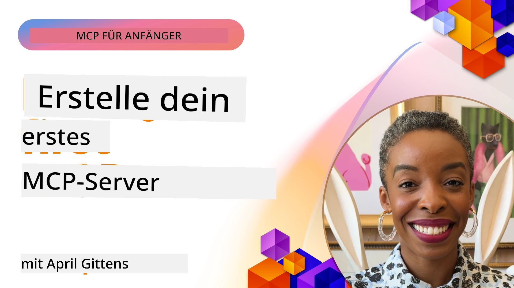

## Erster Einstieg  

_(Klicke auf das obige Bild, um das Video zu dieser Lektion anzusehen)_

Dieser Abschnitt besteht aus mehreren Lektionen:

- **1 Dein erster Server**, in dieser ersten Lektion lernst du, wie du deinen ersten Server erstellst und ihn mit dem Inspector Tool inspizierst – eine wertvolle Möglichkeit, deinen Server zu testen und zu debuggen, [zur Lektion](01-first-server/README.md)

- **2 Client**, in dieser Lektion lernst du, wie du einen Client schreibst, der sich mit deinem Server verbinden kann, [zur Lektion](02-client/README.md)

- **3 Client mit LLM**, eine noch bessere Möglichkeit, einen Client zu schreiben, besteht darin, ihm ein LLM hinzuzufügen, damit es mit deinem Server „verhandeln“ kann, was zu tun ist, [zur Lektion](03-llm-client/README.md)

- **4 Nutzung des serverseitigen GitHub Copilot Agent Modus in Visual Studio Code**. Hier betrachten wir, wie man unseren MCP Server aus Visual Studio Code heraus ausführt, [zur Lektion](04-vscode/README.md)

- **5 stdio Transport Server** stdio-Transport ist der empfohlene Standard für lokale MCP Server-zu-Client Kommunikation, die eine sichere, subprocess-basierte Kommunikation mit integrierter Prozessisolierung bietet [zur Lektion](05-stdio-server/README.md)

- **6 HTTP Streaming mit MCP (Streamable HTTP)**. Erfahre mehr über den Standard-
	fernentransport in [MCP Spezifikation 2026-07-28](https://modelcontextprotocol.io/specification/2026-07-28/basic/transports/streamable-http),
	sowie die Legacy-Sitzungsbasierte Implementierung in der Lektion.
	[Zur Lektion](06-http-streaming/README.md)

- **7 Einsatz des AI Toolkit für VSCode** zur Nutzung und zum Testen deiner MCP Clients und Server [zur Lektion](07-aitk/README.md)

- **8 Testing**. Hier fokussieren wir uns besonders darauf, wie wir unseren Server und Client auf unterschiedliche Weise testen können, [zur Lektion](08-testing/README.md)

- **9 Deployment**. Dieses Kapitel betrachtet verschiedene Möglichkeiten, deine MCP Lösungen bereitzustellen, [zur Lektion](09-deployment/README.md)

- **10 Fortgeschrittene Server-Nutzung**. Dieses Kapitel behandelt fortgeschrittene Serveranwendungen, [zur Lektion](./10-advanced/README.md)

- **11 Auth**. Dieses Kapitel behandelt, wie man einfache Authentifizierung hinzufügt, von Basic Auth bis zur Nutzung von JWT und RBAC. Es wird empfohlen hier zu beginnen und dann die fortgeschrittenen Themen in Kapitel 5 sowie zusätzliche Sicherheitsmaßnahmen gemäß den Empfehlungen in Kapitel 2 zu betrachten, [zur Lektion](./11-simple-auth/README.md)

- **12 MCP Hosts**. Konfiguriere und nutze beliebte MCP Host Clients inklusive Claude Desktop, Cursor, Cline und Windsurf. Lerne Transporttypen und Fehlerbehebung, [zur Lektion](./12-mcp-hosts/README.md)

- **13 MCP Inspector**. Debugge und teste deine MCP Server interaktiv mit dem MCP Inspector Tool. Lerne Tools, Ressourcen und Protokollnachrichten zu diagnostizieren, [zur Lektion](./13-mcp-inspector/README.md)

- **14 Sampling**. Lerne die veraltete Sampling-Primitiv für `2025-11-25` und
	wie man zu neuerem Design mit direkter LLM Anbieter-Integration migriert. Sampling ist
	in MCP `2026-07-28` veraltet. [zur Lektion](./14-sampling/README.md)

- **15 MCP Apps**. Baue MCP Server, die auch mit UI-Anweisungen antworten, [zur Lektion](./15-mcp-apps/README.md)

Das Model Context Protocol (MCP) ist ein offenes Protokoll, das standardisiert, wie Anwendungen Kontext für LLMs bereitstellen. Denk an MCP wie einen USB-C Anschluss für KI-Anwendungen – es bietet eine standardisierte Möglichkeit, KI-Modelle mit verschiedenen Datenquellen und Tools zu verbinden.

## Lernziele

Am Ende dieser Lektion wirst du in der Lage sein:

- Entwicklungsumgebungen für MCP in C#, Java, Python, TypeScript und JavaScript einzurichten
- Einfache MCP Server mit individuellen Funktionen (Ressourcen, Prompts und Tools) zu erstellen und bereitzustellen
- Host-Anwendungen zu erstellen, die sich mit MCP Servern verbinden
- MCP Implementierungen zu testen und zu debuggen
- Häufige Setup-Herausforderungen und ihre Lösungen zu verstehen
- Deine MCP Implementierungen mit populären LLM Services zu verbinden

## Einrichtung deiner MCP Umgebung

Bevor du mit MCP arbeitest, ist es wichtig deine Entwicklungsumgebung vorzubereiten und den grundlegenden Workflow zu verstehen. Dieser Abschnitt führt dich durch die ersten Einrichtungsschritte, um einen reibungslosen Start mit MCP zu gewährleisten.

### Voraussetzungen

Bevor du mit der MCP-Entwicklung beginnst, stelle sicher, dass du:

- **Entwicklungsumgebung**: Für deine gewählte Sprache (C#, Java, Python, TypeScript oder JavaScript)
- **IDE/Editor**: Visual Studio, Visual Studio Code, IntelliJ, Eclipse, PyCharm oder einen modernen Code-Editor
- **Paketmanager**: NuGet, Maven/Gradle, pip oder npm/yarn
- **API-Schlüssel**: Für alle KI-Dienste, die du in deinen Host-Anwendungen verwenden möchtest

### Offizielle SDKs

In den folgenden Kapiteln wirst du Lösungen sehen, die in Python, TypeScript,
Java und .NET gebaut wurden. Hier sind die offiziellen SDKs.

Die SDK-Unterstützung für MCP `2026-07-28` wird unabhängig pro Sprache ausgerollt.
Prüfe vor Ausführen eines Beispiels die Paketversion und die Release Notes des SDKs
auf unterstützte Protokollrevisionen. Siehe die
[offizielle SDK-Liste](https://modelcontextprotocol.io/docs/sdk):
- [C# SDK](https://github.com/modelcontextprotocol/csharp-sdk) - Wird in Zusammenarbeit mit Microsoft gepflegt
- [Java SDK](https://github.com/modelcontextprotocol/java-sdk) - Wird in Zusammenarbeit mit Spring AI gepflegt
- [TypeScript SDK](https://github.com/modelcontextprotocol/typescript-sdk) - Die offizielle TypeScript-Implementierung
- [Python SDK](https://github.com/modelcontextprotocol/python-sdk) - Die offizielle Python-Implementierung (FastMCP)
- [Kotlin SDK](https://github.com/modelcontextprotocol/kotlin-sdk) - Die offizielle Kotlin-Implementierung
- [Swift SDK](https://github.com/modelcontextprotocol/swift-sdk) - Wird in Zusammenarbeit mit Loopwork AI gepflegt
- [Rust SDK](https://github.com/modelcontextprotocol/rust-sdk) - Die offizielle Rust-Implementierung
- [Go SDK](https://github.com/modelcontextprotocol/go-sdk) - Die offizielle Go-Implementierung

## Wichtige Erkenntnisse

- Die Einrichtung einer MCP-Entwicklungsumgebung ist mit sprachspezifischen SDKs unkompliziert
- Der Aufbau von MCP-Servern umfasst das Erstellen und Registrieren von Tools mit klaren Schemata
- MCP Clients verbinden sich mit Servern und Modellen, um erweiterte Funktionen zu nutzen
- Testen und Debuggen sind essenziell für zuverlässige MCP Implementierungen
- Deployment-Optionen reichen von lokaler Entwicklung bis hin zu Cloud-basierten Lösungen

## Übungsaufgaben

Wir haben eine Reihe von Beispielen, die die Übungen ergänzen, die du in allen Kapiteln dieses Abschnitts findest. Außerdem hat jedes Kapitel eigene Übungen und Aufgaben.

- [Java Taschenrechner](./samples/java/calculator/README.md)
- [.NET Taschenrechner](../../../03-GettingStarted/samples/csharp)
- [JavaScript Taschenrechner](./samples/javascript/README.md)
- [TypeScript Taschenrechner](./samples/typescript/README.md)
- [Python Taschenrechner](../../../03-GettingStarted/samples/python)

## Zusätzliche Ressourcen

- [Agenten mit Model Context Protocol auf Azure erstellen](https://learn.microsoft.com/azure/developer/ai/intro-agents-mcp)
- [Remote MCP mit Azure Container Apps (Node.js/TypeScript/JavaScript)](https://learn.microsoft.com/samples/azure-samples/mcp-container-ts/mcp-container-ts/)
- [.NET OpenAI MCP Agent](https://learn.microsoft.com/samples/azure-samples/openai-mcp-agent-dotnet/openai-mcp-agent-dotnet/)

## Was kommt als Nächstes

Beginne mit der ersten Lektion: [Erstellen deines ersten MCP Servers](01-first-server/README.md)

Nachdem du dieses Modul abgeschlossen hast, fahre mit fort: [Modul 4: Praktische Umsetzung](../04-PracticalImplementation/README.md)

---

<!-- CO-OP TRANSLATOR DISCLAIMER START -->
**Haftungsausschluss**:
Dieses Dokument wurde mit dem KI-Übersetzungsdienst [Co-op Translator](https://github.com/Azure/co-op-translator) übersetzt. Obwohl wir uns um Genauigkeit bemühen, beachten Sie bitte, dass automatisierte Übersetzungen Fehler oder Ungenauigkeiten enthalten können. Das Originaldokument in seiner Ursprungssprache gilt als maßgebliche Quelle. Bei kritischen Informationen wird eine professionelle menschliche Übersetzung empfohlen. Wir übernehmen keine Haftung für Missverständnisse oder Fehlinterpretationen, die aus der Verwendung dieser Übersetzung entstehen.
<!-- CO-OP TRANSLATOR DISCLAIMER END -->