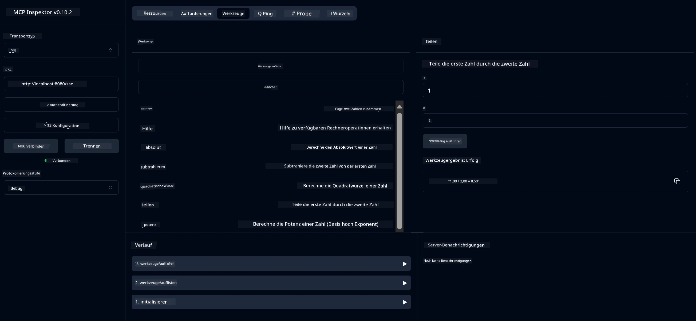

# Basisrechner MCP Dienst

> [!NOTE]
> Dieses Beispiel verwendet den veralteten HTTP+SSE Transport und zielt auf ein SDK ab, das kompatibel ist
> mit MCP `2025-11-25`. Neue Remote-Server sollten die `2026-07-28` Streamable
> HTTP-Unterstützung verwenden.

Dieser Dienst bietet grundlegende Taschenrechneroperationen über das Model Context Protocol (MCP) unter Verwendung von Spring Boot mit WebFlux-Transport. Er ist als einfaches Beispiel für Anfänger konzipiert, die MCP-Implementierungen erlernen.

Für weitere Informationen siehe die [MCP Server Boot Starter](https://docs.spring.io/spring-ai/reference/api/mcp/mcp-server-boot-starter-docs.html) Referenzdokumentation.

## Überblick

Der Dienst zeigt:
- Unterstützung für SSE (Server-Sent Events)
- Automatische Werkzeugregistrierung mit der Spring AI `@Tool` Annotation
- Grundlegende Taschenrechnerfunktionen:
  - Addition, Subtraktion, Multiplikation, Division
  - Potenzberechnung und Quadratwurzel
  - Modulus (Rest) und Absolutwert
  - Hilfefunktion für Operationsbeschreibungen

## Features

Dieser Rechnerdienst bietet folgende Möglichkeiten:

1. **Grundlegende arithmetische Operationen**:
   - Addition von zwei Zahlen
   - Subtraktion einer Zahl von einer anderen
   - Multiplikation von zwei Zahlen
   - Division einer Zahl durch eine andere (mit Prüfung auf Division durch Null)

2. **Erweiterte Operationen**:
   - Potenzberechnung (Basis hoch Exponent)
   - Quadratwurzelberechnung (mit Prüfung auf negative Zahlen)
   - Modulus (Rest) Berechnung
   - Absolutwertberechnung

3. **Hilfesystem**:
   - Eingebaute Hilfefunktion, die alle verfügbaren Operationen erklärt

## Nutzung des Dienstes

Der Dienst stellt folgende API-Endpunkte über das MCP-Protokoll bereit:

- `add(a, b)`: Addiert zwei Zahlen
- `subtract(a, b)`: Subtrahiert die zweite Zahl von der ersten
- `multiply(a, b)`: Multipliziert zwei Zahlen
- `divide(a, b)`: Teilt die erste Zahl durch die zweite (mit Nullprüfung)
- `power(base, exponent)`: Berechnet die Potenz einer Zahl
- `squareRoot(number)`: Berechnet die Quadratwurzel (mit Prüfung auf negative Zahl)
- `modulus(a, b)`: Berechnet den Rest bei der Division
- `absolute(number)`: Berechnet den Absolutwert
- `help()`: Gibt Informationen über verfügbare Operationen aus

## Test-Client

Ein einfacher Test-Client ist im Paket `com.microsoft.mcp.sample.client` enthalten. Die Klasse `SampleCalculatorClient` demonstriert die verfügbaren Operationen des Rechnerdienstes.

## Verwendung des LangChain4j Clients

Das Projekt enthält einen LangChain4j Beispiel-Client in `com.microsoft.mcp.sample.client.LangChain4jClient`, der zeigt, wie der Rechnerdienst mit LangChain4j und GitHub-Modellen integriert wird:

### Voraussetzungen

1. **GitHub Token Einrichtung**:
   
   Um die KI-Modelle von GitHub (wie phi-4) zu nutzen, benötigen Sie ein persönliches Zugriffstoken von GitHub:

   a. Gehen Sie zu Ihren GitHub-Kontoeinstellungen: https://github.com/settings/tokens
   
   b. Klicken Sie auf „Generate new token“ → „Generate new token (classic)“
   
   c. Geben Sie Ihrem Token einen aussagekräftigen Namen
   
   d. Wählen Sie folgende Berechtigungen aus:
      - `repo` (Volle Kontrolle über private Repositories)
      - `read:org` (Lesezugriff auf Organisation und Team-Mitgliedschaft, Lesezugriff auf Organisationsprojekte)
      - `gist` (Erstellen von Gists)
      - `user:email` (Zugriff auf Nutzer-E-Mail-Adressen (nur lesend))
   
   e. Klicken Sie auf „Generate token“ und kopieren Sie Ihr neues Token
   
   f. Setzen Sie es als Umgebungsvariable:
      
      Unter Windows:
      ```
      set GITHUB_TOKEN=your-github-token
      ```
      
      Unter macOS/Linux:
      ```bash
      export GITHUB_TOKEN=your-github-token
      ```

   g. Für dauerhafte Einrichtung fügen Sie es über Systemeinstellungen zu Ihren Umgebungsvariablen hinzu

2. Fügen Sie die LangChain4j GitHub-Abhängigkeit zu Ihrem Projekt hinzu (bereits in pom.xml enthalten):
   ```xml
   <dependency>
       <groupId>dev.langchain4j</groupId>
       <artifactId>langchain4j-github</artifactId>
       <version>${langchain4j.version}</version>
   </dependency>
   ```

3. Stellen Sie sicher, dass der Rechner-Server auf `localhost:8080` läuft

### Ausführen des LangChain4j Clients

Dieses Beispiel demonstriert:
- Verbindung zum Rechner MCP-Server über SSE Transport
- Nutzung von LangChain4j zur Erstellung eines Chatbots, der Rechnungsoperationen nutzt
- Integration mit GitHub KI-Modellen (jetzt das phi-4 Modell verwendet)

Der Client sendet folgende Beispielanfragen zur Demonstration der Funktionalität:
1. Berechnung der Summe zweier Zahlen
2. Berechnung der Quadratwurzel einer Zahl
3. Abruf von Hilfsinformationen über verfügbare Taschenrechneroperationen

Führen Sie das Beispiel aus und prüfen Sie die Konsolenausgabe, um zu sehen, wie das KI-Modell die Rechnerwerkzeuge nutzt, um auf Anfragen zu antworten.

### GitHub Modellkonfiguration

Der LangChain4j Client ist so konfiguriert, dass er das phi-4 Modell von GitHub mit folgenden Einstellungen nutzt:

```java
ChatLanguageModel model = GitHubChatModel.builder()
    .apiKey(System.getenv("GITHUB_TOKEN"))
    .timeout(Duration.ofSeconds(60))
    .modelName("phi-4")
    .logRequests(true)
    .logResponses(true)
    .build();
```

Um andere GitHub-Modelle zu verwenden, ändern Sie einfach den Parameter `modelName` zu einem anderen unterstützten Modell (z. B. "claude-3-haiku-20240307", "llama-3-70b-8192" usw.).

## Abhängigkeiten

Das Projekt benötigt folgende wichtige Abhängigkeiten:

```xml
<!-- For MCP Server -->
<dependency>
    <groupId>org.springframework.ai</groupId>
    <artifactId>spring-ai-starter-mcp-server-webflux</artifactId>
</dependency>

<!-- For LangChain4j integration -->
<dependency>
    <groupId>dev.langchain4j</groupId>
    <artifactId>langchain4j-mcp</artifactId>
    <version>${langchain4j.version}</version>
</dependency>

<!-- For GitHub models support -->
<dependency>
    <groupId>dev.langchain4j</groupId>
    <artifactId>langchain4j-github</artifactId>
    <version>${langchain4j.version}</version>
</dependency>
```

## Projekt bauen

Bauen Sie das Projekt mit Maven:
```bash
./mvnw clean install -DskipTests
```

## Server starten

### Java verwenden

```bash
java -jar target/calculator-server-0.0.1-SNAPSHOT.jar
```

### Verwendung von MCP Inspector

Der MCP Inspector ist ein hilfreiches Tool, um mit MCP-Diensten zu interagieren. Um ihn mit diesem Rechnerdienst zu verwenden:

1. **Installieren und starten Sie MCP Inspector** in einem neuen Terminalfenster:
   ```bash
   npx @modelcontextprotocol/inspector
   ```

2. **Zugriff auf die Web-UI** durch Klicken auf die vom Programm angezeigte URL (normalerweise http://localhost:6274)

3. **Verbindung konfigurieren**:
   - Setzen Sie den Transporttyp auf „SSE“
   - Setzen Sie die URL auf den SSE-Endpunkt Ihres laufenden Servers: `http://localhost:8080/sse`
   - Klicken Sie auf „Connect“

4. **Werkzeuge verwenden**:
   - Klicken Sie auf „List Tools“, um verfügbare Taschenrechneroperationen anzuzeigen
   - Wählen Sie ein Werkzeug aus und klicken Sie auf „Run Tool“, um eine Operation auszuführen



### Verwendung von Docker

Das Projekt enthält eine Dockerfile für containerisierte Bereitstellung:

1. **Docker-Image bauen**:
   ```bash
   docker build -t calculator-mcp-service .
   ```

2. **Docker-Container starten**:
   ```bash
   docker run -p 8080:8080 calculator-mcp-service
   ```

Dies bewirkt:
- Bau eines Multi-Stage Docker-Images mit Maven 3.9.9 und Eclipse Temurin 24 JDK
- Erstellung eines optimierten Container-Images
- Exponierung des Dienstes auf Port 8080
- Start des MCP Rechnerdienstes im Container

Sie können den Dienst unter `http://localhost:8080` erreichen, sobald der Container läuft.

## Fehlerbehebung

### Häufige Probleme mit dem GitHub Token

1. **Token-Berechtigungsprobleme**: Wenn Sie eine 403 Forbidden Fehlermeldung erhalten, überprüfen Sie, ob Ihr Token die korrekten Berechtigungen besitzt, wie in den Voraussetzungen beschrieben.

2. **Token nicht gefunden**: Wenn Sie die Fehlermeldung „No API key found“ erhalten, stellen Sie sicher, dass die Umgebungsvariable GITHUB_TOKEN korrekt gesetzt ist.

3. **Rate Limiting**: Die GitHub API unterliegt Rate Limits. Wenn Sie eine Rate-Limit-Fehlermeldung (Statuscode 429) erhalten, warten Sie einige Minuten, bevor Sie es erneut versuchen.

4. **Token-Ablauf**: GitHub Tokens können ablaufen. Wenn Sie nach einiger Zeit Authentifizierungsfehler erhalten, erzeugen Sie ein neues Token und aktualisieren Sie Ihre Umgebungsvariable.

Wenn Sie weitere Hilfe benötigen, lesen Sie die [LangChain4j Dokumentation](https://github.com/langchain4j/langchain4j) oder die [GitHub API Dokumentation](https://docs.github.com/en/rest).

---

<!-- CO-OP TRANSLATOR DISCLAIMER START -->
**Haftungsausschluss**:
Dieses Dokument wurde mit dem KI-Übersetzungsdienst [Co-op Translator](https://github.com/Azure/co-op-translator) übersetzt. Obwohl wir uns um Genauigkeit bemühen, beachten Sie bitte, dass automatisierte Übersetzungen Fehler oder Ungenauigkeiten enthalten können. Das Originaldokument in seiner Ursprungssprache gilt als maßgebliche Quelle. Bei kritischen Informationen wird eine professionelle menschliche Übersetzung empfohlen. Wir übernehmen keine Haftung für Missverständnisse oder Fehlinterpretationen, die aus der Verwendung dieser Übersetzung entstehen.
<!-- CO-OP TRANSLATOR DISCLAIMER END -->