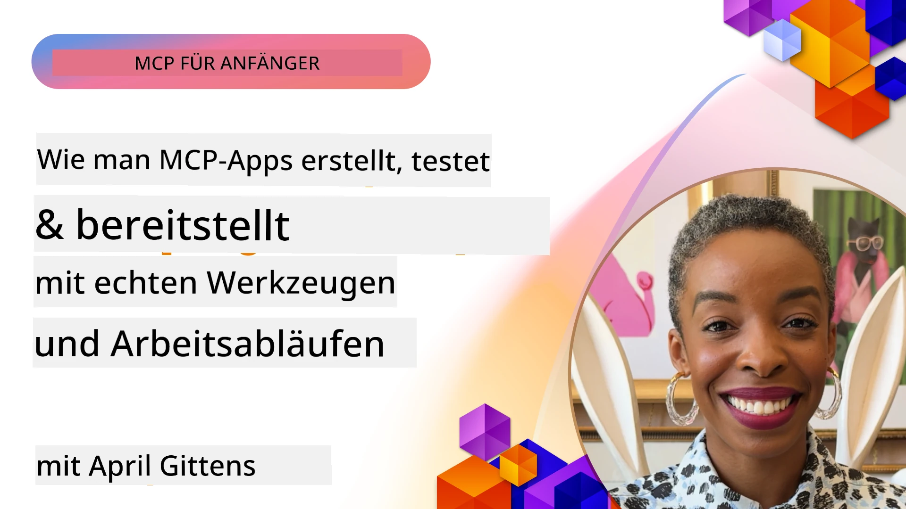

# Praktische Umsetzung

[](https://youtu.be/vCN9-mKBDfQ)

_(Klicken Sie auf das obige Bild, um das Video zu dieser Lektion anzusehen)_

Die praktische Umsetzung ist der Punkt, an dem die Kraft des Model Context Protocol (MCP) greifbar wird. Während das Verständnis der Theorie und Architektur hinter MCP wichtig ist, zeigt sich der wahre Wert erst, wenn Sie diese Konzepte anwenden, um Lösungen zu bauen, zu testen und bereitzustellen, die reale Probleme lösen. Dieses Kapitel schlägt die Brücke zwischen konzeptuellem Wissen und praktischer Entwicklung und führt Sie durch den Prozess, MCP-basierte Anwendungen zum Leben zu erwecken.

Egal, ob Sie intelligente Assistenten entwickeln, KI in Geschäftsabläufe integrieren oder maßgeschneiderte Werkzeuge für die Datenverarbeitung bauen, MCP bietet eine flexible Grundlage. Sein sprachunabhängiges Design und offizielle SDKs für beliebte Programmiersprachen machen es einer breiten Entwicklerbasis zugänglich. Durch die Nutzung dieser SDKs können Sie schnell Prototypen erstellen, iterieren und Ihre Lösungen über verschiedene Plattformen und Umgebungen skalieren.

In den folgenden Abschnitten finden Sie praktische Beispiele, Beispielcode und Bereitstellungsstrategien, die demonstrieren, wie MCP in C#, Java mit Spring, TypeScript, JavaScript und Python implementiert wird. Außerdem erfahren Sie, wie Sie Ihre MCP-Server debuggen und testen, APIs verwalten und Lösungen mithilfe von Azure in der Cloud bereitstellen. Diese praktischen Ressourcen sollen Ihr Lernen beschleunigen und Ihnen helfen, robuste, produktionsreife MCP-Anwendungen sicher zu entwickeln.

## Übersicht

Diese Lektion konzentriert sich auf praktische Aspekte der MCP-Implementierung in mehreren Programmiersprachen. Wir untersuchen, wie Sie MCP SDKs in C#, Java mit Spring, TypeScript, JavaScript und Python verwenden, um robuste Anwendungen zu bauen, MCP-Server zu debuggen und zu testen sowie wiederverwendbare Ressourcen, Prompts und Werkzeuge zu erstellen.

## Lernziele

Am Ende dieser Lektion werden Sie in der Lage sein:

- MCP-Lösungen mit offiziellen SDKs in verschiedenen Programmiersprachen zu implementieren
- MCP-Server systematisch zu debuggen und zu testen
- Serverfunktionen (Ressourcen, Prompts und Werkzeuge) zu erstellen und zu verwenden
- Effektive MCP-Workflows für komplexe Aufgaben zu entwerfen
- MCP-Implementierungen für Leistung und Zuverlässigkeit zu optimieren

## Offizielle SDK-Ressourcen

Das Model Context Protocol bietet offizielle SDKs für mehrere Sprachen (ausgerichtet an der [MCP-Spezifikation 2025-11-25](https://spec.modelcontextprotocol.io/specification/2025-11-25/)):

- [C# SDK](https://github.com/modelcontextprotocol/csharp-sdk)
- [Java mit Spring SDK](https://github.com/modelcontextprotocol/java-sdk) **Hinweis:** erfordert Abhängigkeit von [Project Reactor](https://projectreactor.io). (Siehe [Diskussion Issue 246](https://github.com/orgs/modelcontextprotocol/discussions/246).)
- [TypeScript SDK](https://github.com/modelcontextprotocol/typescript-sdk)
- [Python SDK](https://github.com/modelcontextprotocol/python-sdk)
- [Kotlin SDK](https://github.com/modelcontextprotocol/kotlin-sdk)
- [Go SDK](https://github.com/modelcontextprotocol/go-sdk)

## Arbeiten mit MCP SDKs

Dieser Abschnitt bietet praktische Beispiele zur Implementierung von MCP in mehreren Programmiersprachen. Beispielcode finden Sie im Verzeichnis `samples`, geordnet nach Sprache.

### Verfügbare Beispiele

Das Repository enthält [Beispielimplementierungen](../../../04-PracticalImplementation/samples) in folgenden Sprachen:

- [C#](./samples/csharp/README.md)
- [Java mit Spring](./samples/java/containerapp/README.md)
- [TypeScript](./samples/typescript/README.md)
- [JavaScript](./samples/javascript/README.md)
- [Python](./samples/python/README.md)

Jedes Beispiel demonstriert zentrale MCP-Konzepte und Implementierungsmuster für die jeweilige Sprache und Umgebung.

### Praktische Leitfäden

Zusätzliche Leitfäden zur praktischen MCP-Implementierung:

- [Pagination und große Ergebnismengen](./pagination/README.md) – Umgang mit Cursor-basierter Paginierung für Werkzeuge, Ressourcen und große Datensätze

## Kernserver-Funktionen

MCP-Server können eine beliebige Kombination dieser Funktionen implementieren:

### Ressourcen

Ressourcen bieten Kontext und Daten für den Benutzer oder das KI-Modell zur Nutzung:

- Dokumenten-Repositorys
- Wissensdatenbanken
- Strukturierte Datenquellen
- Dateisysteme

### Prompts

Prompts sind vorgefertigte Nachrichten und Workflows für Benutzer:

- Vordefinierte Gesprächsvorlagen
- Geführte Interaktionsmuster
- Spezialisierte Dialogstrukturen

### Werkzeuge

Werkzeuge sind Funktionen, die das KI-Modell ausführen kann:

- Hilfsprogramme zur Datenverarbeitung
- Integrationen externer APIs
- Rechenfähigkeiten
- Suchfunktionen

## Beispielimplementierungen: C# Implementierung

Das offizielle C# SDK-Repository enthält mehrere Beispielimplementierungen, die verschiedene Aspekte von MCP demonstrieren:

- **Basis-MCP-Client**: Einfaches Beispiel zur Erstellung eines MCP-Clients und Aufruf von Werkzeugen
- **Basis-MCP-Server**: Minimale Serverimplementierung mit Basis-Werkzeugregistrierung
- **Fortgeschrittener MCP-Server**: Voll ausgestatteter Server mit Werkzeugregistrierung, Authentifizierung und Fehlerbehandlung
- **ASP.NET Integration**: Beispiele zur Integration mit ASP.NET Core
- **Werkzeugimplementierungsmuster**: Verschiedene Muster zur Implementierung von Werkzeugen mit unterschiedlicher Komplexität

Das MCP C# SDK befindet sich in der Vorschau, und die APIs können sich ändern. Wir werden diesen Blog kontinuierlich aktualisieren, während das SDK weiterentwickelt wird.

### Hauptmerkmale

- [C# MCP Nuget ModelContextProtocol](https://www.nuget.org/packages/ModelContextProtocol)
- Erstellen Sie Ihren [ersten MCP-Server](https://devblogs.microsoft.com/dotnet/build-a-model-context-protocol-mcp-server-in-csharp/).

Vollständige C#-Implementierungsbeispiele finden Sie im [offiziellen C# SDK-Beispiel-Repository](https://github.com/modelcontextprotocol/csharp-sdk).

## Beispielimplementierung: Java mit Spring Implementierung

Das Java mit Spring SDK bietet robuste MCP-Implementierungsoptionen mit Enterprise-Features.

### Hauptmerkmale

- Integration des Spring Frameworks
- Starke Typsicherheit
- Unterstützung für reaktive Programmierung
- Umfassende Fehlerbehandlung

Für ein vollständiges Java mit Spring Implementierungsbeispiel siehe [Java mit Spring Beispiel](samples/java/containerapp/README.md) im Verzeichnis samples.

## Beispielimplementierung: JavaScript Implementierung

Das JavaScript SDK bietet einen leichten und flexiblen Ansatz für die MCP-Implementierung.

### Hauptmerkmale

- Unterstützung für Node.js und Browser
- Promise-basierte API
- Einfache Integration mit Express und anderen Frameworks
- WebSocket-Unterstützung für Streaming

Für ein vollständiges JavaScript-Implementierungsbeispiel siehe [JavaScript Beispiel](samples/javascript/README.md) im Verzeichnis samples.

## Beispielimplementierung: Python Implementierung

Das Python SDK bietet einen pythonischen Ansatz zur MCP-Implementierung mit exzellenten Integrationen in ML-Frameworks.

### Hauptmerkmale

- Async/await-Unterstützung mit asyncio
- FastAPI-Integration``
- Einfache Werkzeugregistrierung
- Native Integration mit beliebten ML-Bibliotheken

Für ein vollständiges Python-Implementierungsbeispiel siehe [Python Beispiel](samples/python/README.md) im Verzeichnis samples.

## API-Management

Azure API Management ist eine hervorragende Antwort darauf, wie wir MCP-Server sichern können. Die Idee ist, eine Azure API Management-Instanz vor Ihren MCP-Server zu stellen und sie Funktionen übernehmen zu lassen, die Sie wahrscheinlich benötigen, wie:

- Ratenbegrenzung
- Token-Management
- Überwachung
- Lastenverteilung
- Sicherheit

### Azure-Beispiel

Hier ist ein Azure-Beispiel, das genau das macht, also [einen MCP-Server erstellt und ihn mit Azure API Management sichert](https://github.com/Azure-Samples/remote-mcp-apim-functions-python).

Sehen Sie, wie der Autorisierungsablauf im folgenden Bild abläuft:


Im obigen Bild passiert Folgendes:

- Authentifizierung/Autorisierung erfolgt mittels Microsoft Entra.
- Azure API Management fungiert als Gateway und verwendet Richtlinien, um den Verkehr zu steuern und zu verwalten.
- Azure Monitor protokolliert alle Anfragen zur weiteren Analyse.

#### Autorisierungsablauf

Werfen wir einen genaueren Blick auf den Autorisierungsablauf:


#### MCP-Autorisierungsspezifikation

Erfahren Sie mehr über die [MCP-Autorisierungsspezifikation](https://spec.modelcontextprotocol.io/specification/2025-11-25/basic/authorization/)

## Bereitstellung des Remote-MCP-Servers auf Azure

Schauen wir mal, ob wir das zuvor erwähnte Beispiel bereitstellen können:

1. Klonen Sie das Repository

    ```bash
    git clone https://github.com/Azure-Samples/remote-mcp-apim-functions-python.git
    cd remote-mcp-apim-functions-python
    ```

1. Registrieren Sie den Ressourcenanbieter `Microsoft.App`.

   - Wenn Sie die Azure CLI verwenden, führen Sie `az provider register --namespace Microsoft.App --wait` aus.
   - Wenn Sie Azure PowerShell verwenden, führen Sie `Register-AzResourceProvider -ProviderNamespace Microsoft.App` aus. Prüfen Sie dann nach einiger Zeit mit `(Get-AzResourceProvider -ProviderNamespace Microsoft.App).RegistrationState`, ob die Registrierung abgeschlossen ist.

1. Führen Sie diesen [azd](https://aka.ms/azd) Befehl aus, um den API-Management-Dienst, die Function App (mit Code) und alle anderen erforderlichen Azure-Ressourcen bereitzustellen.

    ```shell
    azd up
    ```

    Dieser Befehl sollte alle Cloud-Ressourcen auf Azure bereitstellen.

### Testen Ihres Servers mit MCP Inspector

1. Öffnen Sie in einem **neuen Terminalfenster** die Installation und führen Sie MCP Inspector aus

    ```shell
    npx @modelcontextprotocol/inspector
    ```

    Sie sollten eine Oberfläche ähnlich der folgenden sehen:

    

1. Klicken Sie mit gedrückter STRG-Taste, um die MCP Inspector Web-App von der vom Programm angezeigten URL zu laden (z.B. [http://127.0.0.1:6274/#resources](http://127.0.0.1:6274/#resources))
1. Stellen Sie den Transporttyp auf `SSE` ein
1. Setzen Sie die URL zu Ihrem laufenden API Management SSE-Endpunkt, der nach `azd up` angezeigt wurde, und klicken Sie auf **Verbinden**:

    ```shell
    https://<apim-servicename-from-azd-output>.azure-api.net/mcp/sse
    ```

1. **Werkzeuge auflisten**. Klicken Sie auf ein Werkzeug und **Werkzeug ausführen**.

Wenn alle Schritte funktioniert haben, sind Sie nun mit dem MCP-Server verbunden, und Sie konnten ein Werkzeug aufrufen.

## MCP-Server für Azure

[Remote-mcp-functions](https://github.com/Azure-Samples/remote-mcp-functions-dotnet): Dieses Set von Repositories ist eine Schnellstartvorlage zum Erstellen und Bereitstellen benutzerdefinierter Remote-MCP (Model Context Protocol) Server unter Verwendung von Azure Functions mit Python, C# .NET oder Node/TypeScript.

Die Beispiele bieten eine vollständige Lösung, mit der Entwickler:

- Lokal entwickeln und ausführen können: Einen MCP-Server auf einem lokalen Rechner entwickeln und debuggen
- In Azure bereitstellen: Einfach mit einem einfachen `azd up`-Befehl in die Cloud deployen
- Von Clients verbinden: Verbindung zum MCP-Server von verschiedenen Clients, einschließlich des Copilot-Agent-Modus von VS Code und des MCP Inspector Tools, herstellen

### Hauptmerkmale

- Sicherheit per Design: Der MCP-Server ist mit Schlüsseln und HTTPS gesichert
- Authentifizierungsoptionen: Unterstützt OAuth mit integrierter Authentifizierung und/oder API Management
- Netzwerktrennung: Ermöglicht Netzwerktrennung unter Verwendung von Azure Virtual Networks (VNET)
- Serverlose Architektur: Nutzt Azure Functions für skalierbare, ereignisgesteuerte Ausführung
- Lokale Entwicklung: Umfassende Unterstützung für lokale Entwicklung und Debugging
- Einfache Bereitstellung: Vereinfachter Bereitstellungsprozess für Azure

Das Repository enthält alle notwendigen Konfigurationsdateien, Quellcode und Infrastrukturdefinitionen, um schnell mit einer produktionsreifen MCP-Server-Implementierung zu starten.

- [Azure Remote MCP Functions Python](https://github.com/Azure-Samples/remote-mcp-functions-python) - Beispielimplementierung von MCP mit Azure Functions und Python

- [Azure Remote MCP Functions .NET](https://github.com/Azure-Samples/remote-mcp-functions-dotnet) - Beispielimplementierung von MCP mit Azure Functions und C# .NET

- [Azure Remote MCP Functions Node/Typescript](https://github.com/Azure-Samples/remote-mcp-functions-typescript) - Beispielimplementierung von MCP mit Azure Functions und Node/TypeScript.

## Wichtige Erkenntnisse

- MCP SDKs bieten sprachspezifische Werkzeuge zur Implementierung robuster MCP-Lösungen
- Der Debugging- und Testprozess ist entscheidend für zuverlässige MCP-Anwendungen
- Wiederverwendbare Prompt-Vorlagen ermöglichen konsistente KI-Interaktionen
- Gut gestaltete Workflows können komplexe Aufgaben mit mehreren Werkzeugen orchestrieren
- Die Implementierung von MCP-Lösungen erfordert Berücksichtigung von Sicherheit, Leistung und Fehlerbehandlung

## Übung

Entwerfen Sie einen praktischen MCP-Workflow, der ein reales Problem in Ihrem Bereich adressiert:

1. Identifizieren Sie 3-4 Werkzeuge, die zur Lösung dieses Problems nützlich wären
2. Erstellen Sie ein Workflow-Diagramm, das zeigt, wie diese Werkzeuge interagieren
3. Implementieren Sie eine Basisversion eines der Werkzeuge in Ihrer bevorzugten Sprache
4. Erstellen Sie eine Prompt-Vorlage, die dem Modell hilft, Ihr Werkzeug effektiv zu nutzen

## Zusätzliche Ressourcen

---

## Was kommt als Nächstes

Weiter: [Fortgeschrittene Themen](../05-AdvancedTopics/README.md)

---

<!-- CO-OP TRANSLATOR DISCLAIMER START -->
**Haftungsausschluss**:
Dieses Dokument wurde mithilfe des KI-Übersetzungsdienstes [Co-op Translator](https://github.com/Azure/co-op-translator) übersetzt. Obwohl wir auf Genauigkeit achten, sollten Sie beachten, dass automatisierte Übersetzungen Fehler oder Ungenauigkeiten enthalten können. Das Originaldokument in seiner ursprünglichen Sprache gilt als maßgebliche Quelle. Für wichtige Informationen wird eine professionelle menschliche Übersetzung empfohlen. Wir übernehmen keine Haftung für Missverständnisse oder Fehlinterpretationen, die aus der Verwendung dieser Übersetzung entstehen.
<!-- CO-OP TRANSLATOR DISCLAIMER END -->