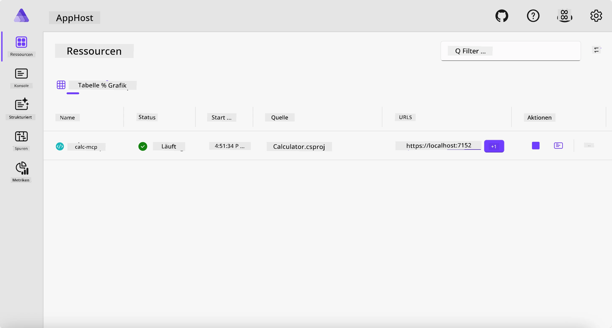
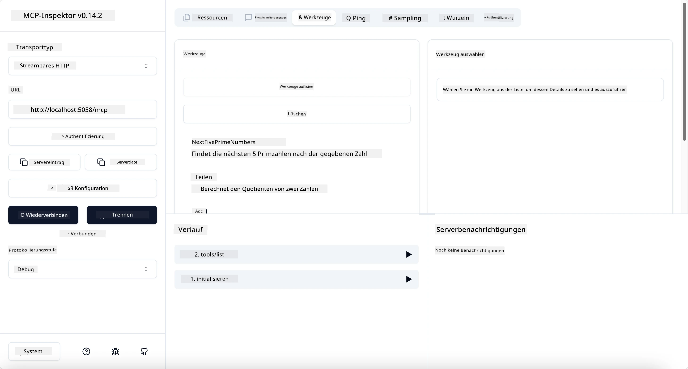
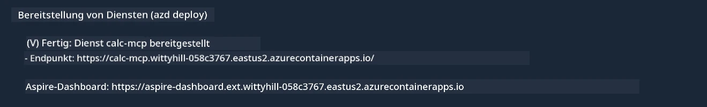

# Beispiel

Das vorherige Beispiel zeigt, wie man ein lokales .NET-Projekt mit dem Typ `stdio` verwendet. Und wie man den Server lokal in einem Container ausführt. Dies ist in vielen Situationen eine gute Lösung. Es kann jedoch nützlich sein, den Server remote laufen zu lassen, zum Beispiel in einer Cloud-Umgebung. Dafür gibt es den Typ `http`.

Wenn man die Lösung im Ordner `04-PracticalImplementation` betrachtet, wirkt sie vielleicht deutlich komplexer als das vorherige Beispiel. In Wirklichkeit ist sie das aber nicht. Schaut man sich das Projekt `src/Calculator` genauer an, sieht man, dass es größtenteils derselbe Code wie im vorherigen Beispiel ist. Der einzige Unterschied ist, dass eine andere Bibliothek `ModelContextProtocol.AspNetCore` verwendet wird, um die HTTP-Anfragen zu verarbeiten. Und wir ändern die Methode `IsPrime`, indem wir sie privat machen, nur um zu zeigen, dass man private Methoden im Code haben kann. Der Rest des Codes ist derselbe wie zuvor.

Die anderen Projekte stammen von [Aspire](https://aspire.dev/get-started/what-is-aspire/). Aspire in der Lösung zu haben verbessert die Erfahrung des Entwicklers beim Entwickeln und Testen und unterstützt bei der Beobachtbarkeit. Es ist nicht erforderlich, um den Server auszuführen, aber es ist eine gute Praxis, es in der Lösung zu haben.

## Starte den Server lokal

1. Navigiere in VS Code (mit der C# DevKit-Erweiterung) zum Verzeichnis `04-PracticalImplementation/samples/csharp`.
1. Führe den folgenden Befehl aus, um den Server zu starten:

   ```bash
    dotnet watch run --project ./src/AppHost
   ```

1. Wenn ein Webbrowser das Aspire-Dashboard öffnet, achte auf die `http`-URL. Sie sollte etwas sein wie `http://localhost:5058/`.

   

## Teste Streamable HTTP mit dem MCP Inspector

Wenn du Node.js 22.7.5 oder höher hast, kannst du den MCP Inspector verwenden, um deinen Server zu testen.

Starte den Server und führe den folgenden Befehl in einem Terminal aus:

```bash
npx @modelcontextprotocol/inspector http://localhost:5058
```



- Wähle `Streamable HTTP` als Transporttyp.
- Gib im URL-Feld die zuvor notierte Server-URL ein und hänge `/mcp` an. Es sollte `http` sein (nicht `https`), etwas wie `http://localhost:5058/mcp`.
- Klicke auf die Schaltfläche Verbinden.

Das Schöne am Inspector ist, dass er eine gute Übersicht darüber gibt, was gerade passiert.

- Versuche, die verfügbaren Tools aufzulisten.
- Probiere einige davon aus, es sollte genauso funktionieren wie zuvor.

## Teste MCP Server mit GitHub Copilot Chat in VS Code

Um den Streamable HTTP Transport mit GitHub Copilot Chat zu verwenden, ändere die Konfiguration des zuvor erstellten `calc-mcp` Servers wie folgt:

```jsonc
// .vscode/mcp.json
{
  "servers": {
    "calc-mcp": {
      "type": "http",
      "url": "http://localhost:5058/mcp"
    }
  }
}
```

Mache einige Tests:

- Bitte um „3 Primzahlen nach 6780“. Beobachte, wie Copilot die neuen Tools `NextFivePrimeNumbers` nutzt und nur die ersten 3 Primzahlen zurückgibt.
- Bitte um „7 Primzahlen nach 111“, um zu sehen, was passiert.
- Bitte um „John hat 24 Lollies und möchte sie alle an seine 3 Kinder verteilen. Wie viele Lollies bekommt jedes Kind?“, um zu sehen, was passiert.

## Den Server auf Azure bereitstellen

Lass uns den Server auf Azure bereitstellen, damit mehr Leute ihn nutzen können.

Navigiere in einem Terminal zum Ordner `04-PracticalImplementation/samples/csharp` und führe folgenden Befehl aus:

```bash
azd up
```

Sobald die Bereitstellung abgeschlossen ist, solltest du eine Meldung wie diese sehen:



Nimm die URL und verwende sie im MCP Inspector und im GitHub Copilot Chat.

```jsonc
// .vscode/mcp.json
{
  "servers": {
    "calc-mcp": {
      "type": "http",
      "url": "https://calc-mcp.gentleriver-3977fbcf.australiaeast.azurecontainerapps.io/mcp"
    }
  }
}
```

## Was kommt als Nächstes?

Wir haben verschiedene Transporttypen und Testwerkzeuge ausprobiert. Außerdem haben wir deinen MCP Server auf Azure bereitgestellt. Aber was ist, wenn unser Server Zugriff auf private Ressourcen benötigt? Zum Beispiel eine Datenbank oder eine private API? Im nächsten Kapitel werden wir sehen, wie wir die Sicherheit unseres Servers verbessern können.

---

<!-- CO-OP TRANSLATOR DISCLAIMER START -->
**Haftungsausschluss**:
Dieses Dokument wurde mit dem KI-Übersetzungsdienst [Co-op Translator](https://github.com/Azure/co-op-translator) übersetzt. Obwohl wir uns um Genauigkeit bemühen, beachten Sie bitte, dass automatisierte Übersetzungen Fehler oder Ungenauigkeiten enthalten können. Das Originaldokument in seiner Ursprungssprache gilt als maßgebliche Quelle. Bei kritischen Informationen wird eine professionelle menschliche Übersetzung empfohlen. Wir übernehmen keine Haftung für Missverständnisse oder Fehlinterpretationen, die aus der Verwendung dieser Übersetzung entstehen.
<!-- CO-OP TRANSLATOR DISCLAIMER END -->