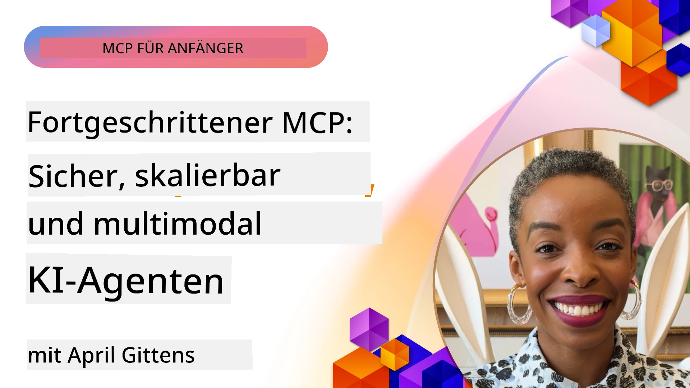

# Fortgeschrittene Themen in MCP

_(Klicken Sie auf das obige Bild, um das Video dieser Lektion anzusehen)_

Dieses Kapitel behandelt eine Reihe fortgeschrittener Themen in der Implementierung des Model Context Protocol (MCP), einschließlich multimodaler Integration, Skalierbarkeit, bewährter Sicherheitspraktiken und Unternehmensintegration. Diese Themen sind entscheidend für den Aufbau robuster und produktionsreifer MCP-Anwendungen, die den Anforderungen moderner KI-Systeme gerecht werden können.

## Übersicht

Diese Lektion untersucht fortgeschrittene Konzepte in der Implementierung des Model Context Protocols, mit Fokus auf multimodale Integration, Skalierbarkeit, bewährte Sicherheitspraktiken und Unternehmensintegration. Diese Themen sind essenziell für den Aufbau produktionsreifer MCP-Anwendungen, die komplexe Anforderungen in Unternehmensumgebungen bewältigen können.

> **Blick nach vorn:** mehrere unten aufgeführte Themen sind durch den MCP-Spezifikations-Release-Kandidaten `2026-07-28` betroffen — Root Contexts (5.4) und Sampling (5.6) basieren auf Primitiven, die der Release-Kandidat als veraltet kennzeichnet, und die experimentelle Tasks-Funktion, die in Protocol Features (5.16) erwähnt wird, wird in eine eigene Tasks-Erweiterung verschoben. Details finden Sie unter [Was ändert sich in MCP: Der Release-Kandidat 2026-07-28](../01-CoreConcepts/mcp-2026-07-28-release-candidate.md).

## Lernziele

Am Ende dieser Lektion werden Sie in der Lage sein:

- Multimodale Fähigkeiten innerhalb von MCP-Frameworks zu implementieren
- Skalierbare MCP-Architekturen für Szenarien mit hoher Nachfrage zu entwerfen
- Sicherheitsbest Practices anzuwenden, die mit den Sicherheitsprinzipien von MCP übereinstimmen
- MCP in Unternehmens-KI-Systeme und Frameworks zu integrieren
- Leistung und Zuverlässigkeit in Produktionsumgebungen zu optimieren

## Lektionen und Beispielprojekte

| Link | Titel | Beschreibung |
|------|-------|-------------|
| [5.1 Integration mit Azure](./mcp-integration/README.md) | Integration mit Azure | Erfahren Sie, wie Sie Ihren MCP-Server auf Azure integrieren |
| [5.2 Multimodales Beispiel](./mcp-multi-modality/README.md) | MCP Multimodale Beispiele | Beispiele für Audio-, Bild- und multimodale Antworten |
| [5.3 MCP OAuth2 Beispiel](../../../05-AdvancedTopics/mcp-oauth2-demo) | MCP OAuth2 Demo | Minimale Spring Boot-Anwendung, die OAuth2 mit MCP demonstriert, sowohl als Autorisierungs- als auch als Ressourcenserver. Zeigt sichere Token-Ausgabe, geschützte Endpunkte, Bereitstellung in Azure Container Apps und API-Management-Integration. |
| [5.4 Root Contexts](./mcp-root-contexts/README.md) | Root-Kontexte | Erfahren Sie mehr über Root-Kontexte und deren Implementierung |
| [5.5 Routing](./mcp-routing/README.md) | Routing | Lernen Sie verschiedene Routing-Typen kennen |
| [5.6 Sampling](./mcp-sampling/README.md) | Sampling | Lernen Sie, wie Sampling funktioniert |
| [5.7 Skalierung](./mcp-scaling/README.md) | Skalierung | Lernen Sie die Skalierung kennen |
| [5.8 Sicherheit](./mcp-security/README.md) | Sicherheit | Sichern Sie Ihren MCP-Server |
| [5.9 Web-Suche Beispiel](./web-search-mcp/README.md) | Web-Suche MCP | Python MCP-Server und -Client, die SerpAPI zur Echtzeit-Web-, Nachrichten-, Produktsuche und Q&A integrieren. Zeigt Multi-Tool-Orchestrierung, externe API-Integration und robuste Fehlerbehandlung. |
| [5.10 Echtzeit-Streaming](./mcp-realtimestreaming/README.md) | Streaming | Echtzeit-Datenstreaming ist in der heutigen datengetriebenen Welt unerlässlich, wo Unternehmen und Anwendungen sofortigen Informationszugriff benötigen, um zeitnahe Entscheidungen zu treffen. |
| [5.11 Echtzeit-Web-Suche](./mcp-realtimesearch/README.md) | Web-Suche | Echtzeit-Websuche: wie MCP die Echtzeit-Websuche durch Bereitstellung eines standardisierten Ansatzes zur Kontextverwaltung über KI-Modelle, Suchmaschinen und Anwendungen hinweg transformiert. |
| [5.12 Entra ID Authentifizierung für Model Context Protocol Server](./mcp-security-entra/README.md) | Entra ID Authentifizierung | Microsoft Entra ID bietet eine robuste cloudbasierte Identitäts- und Zugriffsverwaltungslösung, die sicherstellt, dass nur autorisierte Benutzer und Anwendungen mit Ihrem MCP-Server interagieren können. |
| [5.13 Microsoft Foundry Agent Integration](./mcp-foundry-agent-integration/README.md) | Microsoft Foundry Integration | Erfahren Sie, wie Sie MCP-Server mit Microsoft Foundry Agents integrieren, um leistungsfähige Tool-Orchestrierung und Unternehmens-KI-Fähigkeiten mit standardisierten Verbindungen zu externen Datenquellen zu ermöglichen. |
| [5.14 Kontext-Engineering](./mcp-contextengineering/README.md) | Kontext-Engineering | Die zukünftigen Möglichkeiten von Kontext-Engineering-Techniken für MCP-Server, einschließlich Kontextoptimierung, dynamischem Kontextmanagement und Strategien für effektives Prompt-Engineering innerhalb von MCP-Frameworks. |
| [5.15 MCP benutzerdefinierter Transport](./mcp-transport/README.md) | Benutzerdefinierter Transport | Lernen Sie, wie Sie benutzerdefinierte Transportmechanismen für spezialisierte MCP-Kommunikationsszenarien implementieren. |
| [5.16 Protokollfunktionen im Detail](./mcp-protocol-features/README.md) | Protokollfunktionen | Beherrschen Sie erweiterte Protokollfunktionen, einschließlich Fortschrittsbenachrichtigungen, Anforderungstornierung, Ressourcenvorlagen und Fehlerbehandlungs-Muster. |
| [5.17 Adversariales Multi-Agenten-Reasoning](./mcp-adversarial-agents/README.md) | Adversariale Agenten | Verwenden Sie zwei Agenten mit gegensätzlichen Positionen, die einen einzigen MCP-Werkzeugsatz teilen, um Halluzinationen zu erkennen, Randfälle aufzudecken und durch strukturierte Debatten besser kalibrierte Ausgaben zu erzeugen. |

> **Neu in der MCP-Spezifikation 2025-11-25**: Die Spezifikation umfasst jetzt experimentelle Unterstützung für **Tasks** (lang laufende Operationen mit Fortschrittsverfolgung), **Tool-Anmerkungen** (Metadaten zum Werkzeugverhalten für Sicherheit), **URL-Mode Elicitation** (Anforderung spezifischer URL-Inhalte von Clients) und erweiterte **Roots** (zur Verwaltung von Arbeitsbereichskontexten). Siehe den [MCP-Spezifikations-Änderungsverlauf](https://spec.modelcontextprotocol.io/) für vollständige Details.

## Zusätzliche Referenzen

Für die aktuellsten Informationen zu fortgeschrittenen MCP-Themen verweisen Sie auf:
- [MCP-Dokumentation](https://modelcontextprotocol.io/)
- [MCP-Spezifikation (2025-11-25)](https://spec.modelcontextprotocol.io/specification/2025-11-25/)
- [GitHub-Repository](https://github.com/modelcontextprotocol)
- [OWASP MCP Top 10](https://microsoft.github.io/mcp-azure-security-guide/mcp/) - Sicherheitsrisiken und Gegenmaßnahmen
- [MCP Security Summit Workshop (Sherpa)](https://azure-samples.github.io/sherpa/) - Praktisches Sicherheitstraining

## Wichtige Erkenntnisse

- Multimodale MCP-Implementierungen erweitern KI-Fähigkeiten über die reine Textverarbeitung hinaus
- Skalierbarkeit ist für Unternehmenseinsätze entscheidend und kann durch horizontale und vertikale Skalierung erreicht werden
- Umfassende Sicherheitsmaßnahmen schützen Daten und gewährleisten ordnungsgemäße Zugriffskontrolle
- Unternehmensintegration mit Plattformen wie Azure OpenAI und Microsoft AI Foundry erweitert MCP-Fähigkeiten
- Fortgeschrittene MCP-Implementierungen profitieren von optimierten Architekturen und sorgfältigem Ressourcenmanagement

## Übung

Entwerfen Sie eine produktionsreife MCP-Implementierung für einen spezifischen Anwendungsfall:

1. Identifizieren Sie multimodale Anforderungen für Ihren Anwendungsfall
2. Skizzieren Sie die notwendigen Sicherheitskontrollen zum Schutz sensibler Daten
3. Entwerfen Sie eine skalierbare Architektur, die variable Last bewältigen kann
4. Planen Sie Integrationspunkte mit Unternehmens-KI-Systemen
5. Dokumentieren Sie potenzielle Leistungsengpässe und Strategien zur Minderung

## Zusätzliche Ressourcen

- [Azure OpenAI Dokumentation](https://learn.microsoft.com/en-us/azure/ai-services/openai/)
- [Microsoft AI Foundry Dokumentation](https://learn.microsoft.com/en-us/ai-services/)

---

## Was kommt als Nächstes

Erkunden Sie die Lektionen dieses Moduls beginnend mit: [5.1 MCP Integration](./mcp-integration/README.md)

Nachdem Sie dieses Modul abgeschlossen haben, fahren Sie fort mit: [Modul 6: Community Contributions](../06-CommunityContributions/README.md)

---

<!-- CO-OP TRANSLATOR DISCLAIMER START -->
**Haftungsausschluss**:
Dieses Dokument wurde mit dem KI-Übersetzungsdienst [Co-op Translator](https://github.com/Azure/co-op-translator) übersetzt. Obwohl wir uns um Genauigkeit bemühen, beachten Sie bitte, dass automatisierte Übersetzungen Fehler oder Ungenauigkeiten enthalten können. Das Originaldokument in seiner Ursprungssprache gilt als maßgebliche Quelle. Bei kritischen Informationen wird eine professionelle menschliche Übersetzung empfohlen. Wir übernehmen keine Haftung für Missverständnisse oder Fehlinterpretationen, die aus der Verwendung dieser Übersetzung entstehen.
<!-- CO-OP TRANSLATOR DISCLAIMER END -->