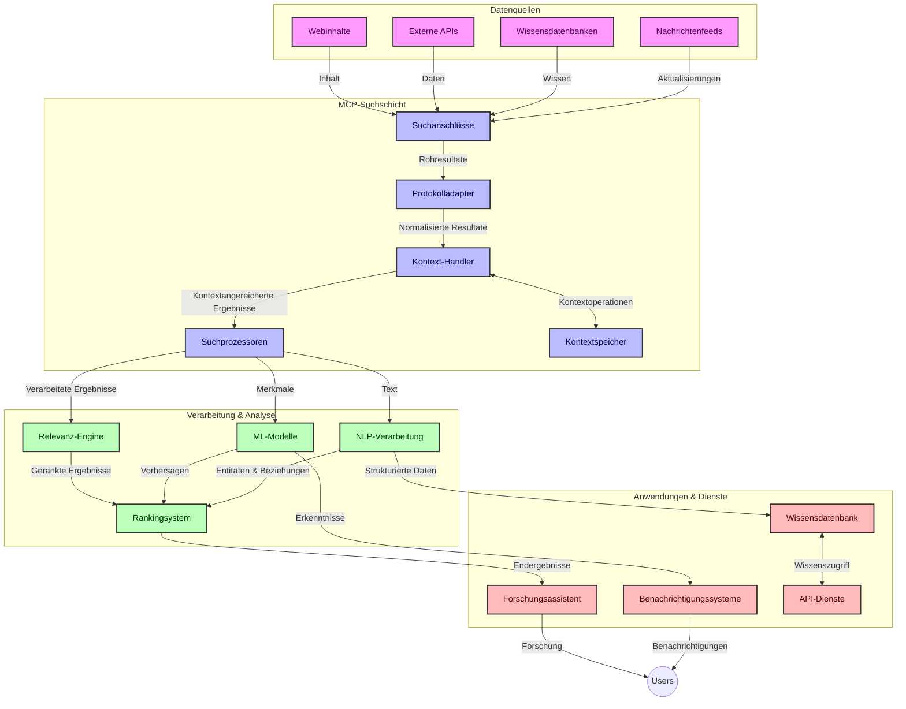
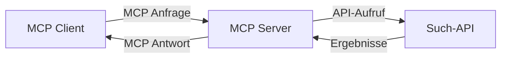
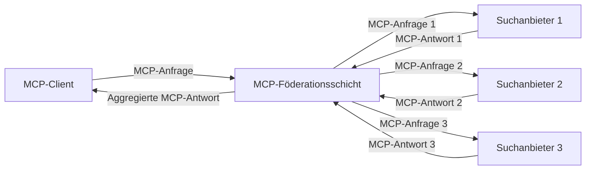
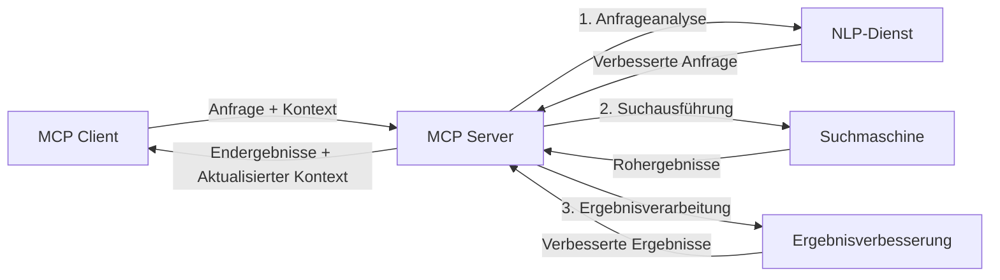

# Model Context Protocol für die Echtzeit-Websuche

## Überblick

Echtzeit-Websuche ist in der heutigen informationsgetriebenen Umgebung unverzichtbar geworden, in der Anwendungen sofortigen Zugriff auf aktuelle Informationen im Internet benötigen, um relevante und zeitnahe Antworten zu liefern. Das Model Context Protocol (MCP) stellt einen bedeutenden Fortschritt bei der Optimierung dieser Echtzeitsuchprozesse dar, verbessert die Sucheffizienz, bewahrt die Kontextintegrität und steigert die Gesamtleistung des Systems.

Dieses Modul untersucht, wie MCP die Echtzeit-Websuche transformiert, indem es einen standardisierten Ansatz für das Kontextmanagement über KI-Modelle, Suchmaschinen und Anwendungen hinweg bietet.

### Was Sie lernen werden

In diesem umfassenden Leitfaden entdecken Sie:

- Wie MCP eine nahtlose Brücke zwischen KI-Modellen und Echtzeit-Websuchfähigkeiten schafft
- Architekturmuster zur Implementierung effizienter und skalierbarer Suchlösungen mit MCP
- Techniken zur Bewahrung des Suchkontexts über mehrere Abfragen und Interaktionen hinweg
- Praktische Code-Implementierungen in Python und JavaScript für verschiedene Suchszenarien
- Methoden zur Balance von Relevanz, Aktualität und Leistung in MCP-gestützten Suchsystemen

## Einführung in die Echtzeit-Websuche

Echtzeit-Websuche ist ein technologischer Ansatz, der kontinuierliche Abfragen, Verarbeitung und Analyse webbasierter Informationen ermöglicht, sobald diese veröffentlicht oder aktualisiert werden, sodass Systeme frische und relevante Informationen mit minimaler Verzögerung bereitstellen können. Im Gegensatz zu traditionellen Suchsystemen, die mit indizierten Daten arbeiten, die Stunden oder Tage alt sein können, verarbeitet die Echtzeitsuche Live-Daten aus dem Web und liefert Einsichten und Informationen, die den aktuellen Zustand von Online-Inhalten widerspiegeln.

### Kernkonzepte der Echtzeit-Websuche:

- **Kontinuierliche Abfrageverarbeitung**: Suchanfragen werden gegen ständig aktualisierte Datenquellen verarbeitet
- **Priorisierung der Aktualität**: Systeme sind darauf ausgelegt, frische Informationen zu priorisieren
- **Balance der Relevanz**: Aufrechterhaltung eines Gleichgewichts zwischen Relevanz und Aktualität
- **Skalierbare Architektur**: Systeme müssen variable Abfragelasten und Datenvolumen bewältigen können
- **Kontextuelles Verständnis**: Aufrechterhaltung des Nutzerkontexts über Suchiterationen hinweg ist entscheidend für sinnvolle Ergebnisse
- **Dynamische Abfrageumformulierung**: Adaptive Modifikation von Abfragen basierend auf Kontext und vorherigen Ergebnissen
- **Integration mehrerer Quellen**: Kombination von Ergebnissen aus mehreren Suchanbietern und Webquellen
- **Semantisches Verständnis**: Verarbeitung von Abfragen und Inhalten basierend auf Bedeutung und nicht nur auf Schlüsselwörtern
- **Echtzeit-Ranking**: Kontinuierliche Anpassung der Ergebnisrangfolge, sobald neue Informationen verfügbar werden

### Das Model Context Protocol und Echtzeit-Websuche

Das Model Context Protocol (MCP) adressiert mehrere kritische Herausforderungen in Echtzeit-Websuchumgebungen:

1. **Bewahrung des Suchkontexts**: MCP standardisiert, wie Kontext über verteilte Suchkomponenten hinweg aufrechterhalten wird, wodurch KI-Modelle und Verarbeitungsstationen Zugriff auf relevante Abfragehistorie und Benutzerpräferenzen erhalten.

2. **Effizientes Abfragemanagement**: Durch strukturierte Mechanismen zur Kontextübertragung reduziert MCP den Aufwand, den Kontext bei jeder Suchiteration erneut bereitzustellen.

3. **Interoperabilität**: MCP schafft eine gemeinsame Sprache für den Kontextaustausch zwischen unterschiedlichen Suchtechnologien und KI-Modellen, was flexiblere und erweiterbare Architekturen ermöglicht.

4. **Such-optimierter Kontext**: MCP-Implementierungen können priorisieren, welche Kontext-Elemente für eine effektive Suche am relevantesten sind, und somit sowohl Leistung als auch Genauigkeit optimieren.

5. **Adaptive Suchverarbeitung**: Durch ein richtiges Kontextmanagement mittels MCP können Suchsysteme ihre Verarbeitung dynamisch an sich entwickelnde Benutzerbedürfnisse und Informationslandschaften anpassen.

In modernen Anwendungen – von Nachrichtenaggregation bis Forschungshilfen – ermöglicht die Integration von MCP mit Websuchtechnologien intelligentere, kontextbewusste Suche, die zunehmend relevante Ergebnisse liefern kann, während die Nutzerinteraktionen fortschreiten.

## Lernziele

Nach Abschluss dieser Lektion werden Sie in der Lage sein:

- Die Grundlagen der Echtzeit-Websuche und ihre Herausforderungen in modernen Anwendungen zu verstehen
- Erklären, wie das Model Context Protocol (MCP) die Echtzeit-Websuchfähigkeiten verbessert
- MCP-basierte Suchlösungen mit populären Frameworks und APIs zu implementieren
- Skalierbare, leistungsstarke Sucharchitekturen mit MCP zu entwerfen und bereitzustellen
- MCP-Konzepte auf verschiedene Anwendungsfälle einschließlich semantischer Suche, Forschungsassistenz und KI-unterstütztem Browsing anzuwenden
- Aufkommende Trends und zukünftige Innovationen in MCP-basierten Suchtechnologien zu bewerten
- Kontextbewusste Suchsysteme zu entwickeln, die aus Benutzerinteraktionen lernen
- Websuchfunktionen in KI-Assistenten mittels standardisierter MCP-Protokolle einzubinden
- Mehrstufige Suchpipelines zu erstellen, die Ergebnisse basierend auf Kontext schrittweise verfeinern
- Die Suchleistung zu optimieren und dabei umfassendes Kontextbewusstsein aufrechtzuerhalten

### Definition und Bedeutung

Echtzeit-Websuche umfasst das kontinuierliche Abfragen, Abrufen und Bereitstellen webbasierten Wissens mit minimaler Latenz. Im Gegensatz zu traditionellen Suchmaschinen, die das Web periodisch crawlen und indexieren, zielt die Echtzeitsuche darauf ab, Informationen unmittelbar bei Verfügbarkeit darzustellen und so den direkten Zugriff auf die aktuellsten Inhalte zu ermöglichen.

Schlüsselmerkmale der Echtzeit-Websuche sind:

- **Aktualität**: Priorisierung kürzlich erstellter Inhalte und Updates
- **Kontinuierliche Verarbeitung**: Permanente Überwachung neuer Informationen
- **Abfrageanpassung**: Verfeinerung von Suchanfragen basierend auf Kontext und Feedback
- **Sofortige Bereitstellung**: Suchergebnisse mit minimaler Verzögerung ausliefern
- **Kontextbeibehaltung**: Aufbau auf vorherigen Abfragen für verbesserte Relevanz

### Herausforderungen bei herkömmlicher Websuche

Traditionelle Ansätze der Websuche stoßen in Echtzeitszenarien auf verschiedene Einschränkungen:

1. **Kontextfragmentierung**: Schwierigkeit, Suchkontext über mehrere Abfragen hinweg zu bewahren
2. **Informationsaktualität**: Herausforderungen beim Zugriff und der Priorisierung der neuesten Informationen
3. **Integrationskomplexität**: Probleme bei der Interoperabilität zwischen Suchsystemen und Anwendungen
4. **Latenzprobleme**: Balance zwischen umfassender Suche und Antwortzeit-Anforderungen
5. **Relevanzanpassung**: Sicherstellung von Genauigkeit und Relevanz unter Berücksichtigung der Aktualität

## Verständnis des Model Context Protocol (MCP) für die Suche

### Was ist MCP im Suchkontext?

Das Model Context Protocol (MCP) ist ein standardisiertes Kommunikationsprotokoll, das auf effiziente Interaktion zwischen KI-Modellen und Anwendungen ausgelegt ist. Im Kontext der Echtzeit-Websuche bietet MCP einen Rahmen für:

- Bewahrung des Suchkontexts über Abfolgen von Abfragen hinweg
- Standardisierung von Suchanfrage- und Ergebnisformaten
- Optimierung der Übertragung von Suchparametern und Ergebnissen
- Verbesserung der Kommunikation zwischen Modell und Suchmaschine

### Kernkomponenten und Architektur

Die MCP-Architektur für die Echtzeit-Websuche besteht aus mehreren Schlüsselkomponenten:

1. **Abfrage-Kontext-Handler**: Verwalten und erhalten Suchkontext über mehrere Abfragen
2. **Suchprozessoren**: Verarbeiten eingehende Suchanfragen mit kontextbewussten Techniken
3. **Protokolladapter**: Wandeln zwischen verschiedenen Such-APIs um und bewahren dabei Kontext
4. **Kontextspeicher**: Effizientes Speichern und Abrufen der Suchhistorie und Präferenzen
5. **Suchanschlüsse**: Verbinden zu verschiedenen Suchmaschinen und Web-APIs



### Wie MCP die Echtzeit-Websuche verbessert

MCP adressiert traditionelle Herausforderungen der Websuche durch:

- **Kontextuelle Kontinuität**: Aufrechterhaltung der Beziehungen zwischen Abfragen über die gesamte Suchsitzung hinweg
- **Optimierte Übertragung**: Reduzierung von Redundanzen bei Suchparametern durch intelligentes Kontextmanagement
- **Standardisierte Schnittstellen**: Bereitstellung konsistenter APIs für Suchkomponenten
- **Reduzierte Latenz**: Minimierung des Verarbeitungsaufwands durch effiziente Kontextverwaltung
- **Verbesserte Relevanz**: Erhöhung der Suchrelevanz durch Bewahrung der Benutzerintention über mehrere Abfragen hinweg

## Integration und Implementierung

Echtzeit-Websuchsysteme erfordern sorgfältiges architektonisches Design und Implementierung, um sowohl Leistung als auch Kontextintegrität zu gewährleisten. Das Model Context Protocol bietet einen standardisierten Ansatz zur Integration von KI-Modellen und Suchtechnologien und erlaubt komplexere, kontextbewusste Suchpipelines.

### Überblick über MCP-Integration in Sucharchitekturen

Die Implementierung von MCP in Echtzeit-Websuchumgebungen beruht auf mehreren wichtigen Überlegungen:

1. **Serialisierung des Suchkontexts**: MCP bietet effiziente Mechanismen zur Kodierung kontextueller Informationen innerhalb von Suchanfragen, sodass wesentlicher Kontext der Abfrage entlang der Verarbeitungspipeline folgt. Dazu gehören standardisierte Serialisierungsformate, die für suchbezogene Metadaten optimiert sind.

2. **Zustandsbehaftete Suchverarbeitung**: MCP ermöglicht intelligentere zustandsbehaftete Verarbeitung, indem es eine konsistente Kontextdarstellung über Suchiterationen aufrechterhält. Dies ist insbesondere in mehrstufigen Suchpipelines wertvoll, wo Kontextverfeinerung die Ergebnisse verbessert.

3. **Abfrageerweiterung und -verfeinerung**: MCP-Implementierungen in Suchsystemen können eine ausgefeilte Abfrageerweiterung und -verfeinerung basierend auf angesammeltem Kontext erleichtern, was im Verlauf der Suchsitzung zu zunehmend relevanteren Ergebnissen führt.

4. **Ergebnis-Caching und Priorisierung**: Durch die Standardisierung des Kontexthandlings unterstützt MCP das Management von Ergebnis-Caching und Priorisierung, sodass Komponenten sich anhand des sich entwickelnden Suchkontexts anpassen können.

5. **Suchföderation und Aggregation**: MCP ermöglicht eine ausgefeiltere Föderation von Suchen über mehrere Backends hinweg, indem strukturierte Repräsentationen des Suchkontexts bereitgestellt werden, was die bedeutungsvollere Aggregation von Ergebnissen aus diversen Quellen erlaubt.

Die Implementierung von MCP über verschiedene Suchtechnologien hinweg schafft einen einheitlichen Ansatz zum Kontextmanagement, verringert den Bedarf an spezifischem Integrationscode und verbessert die Fähigkeit des Systems, während der Entwicklung von Suchanfragen bedeutungsvollen Kontext aufrechtzuerhalten.

### MCP in verschiedenen Websuchimplementierungen

Diese Beispiele folgen der aktuellen MCP-Spezifikation, die sich auf ein JSON-RPC-basiertes Protokoll mit unterschiedlichen Transportmechanismen fokussiert. Der Code zeigt, wie benutzerdefinierte Suchintegrationen implementiert werden können, während vollständige Kompatibilität mit dem MCP-Protokoll gewahrt bleibt.


<details>
<summary>Python-Implementierung mit generischer Such-API</summary>

```python
import asyncio
import json
import aiohttp
from typing import Dict, Any, Optional, List
from contextlib import asynccontextmanager
from collections.abc import AsyncIterator

# Importieren Sie Standard-MCP-Bibliotheken
from mcp.client.session import ClientSession
from mcp.client.streamable_http import streamablehttp_client
from mcp.types import TextContent, CreateMessageRequestParams, CreateMessageResult
from mcp.server.fastmcp import FastMCP

# Erstellen Sie einen FastMCP-Server für die Websuche
search_server = FastMCP("WebSearch")

# Klasse zur Handhabung von Websuchoperationen
class WebSearchHandler:
    def __init__(self, api_endpoint: str, api_key: str):
        self.api_endpoint = api_endpoint
        self.api_key = api_key
        self.session = None
        
    async def initialize(self):
        """Initialize the HTTP session"""
        self.session = aiohttp.ClientSession(
            headers={"Authorization": f"Bearer {self.api_key}"}
        )
    
    async def close(self):
        """Close the HTTP session"""
        if self.session:
            await self.session.close()
            
    async def perform_search(self, query: str, max_results: int = 5, 
                           include_domains: List[str] = None, 
                           exclude_domains: List[str] = None,
                           time_period: str = "any") -> Dict[str, Any]:
        """Perform web search using the search API"""
        # Suchparameter konstruieren
        search_params = {
            "q": query,
            "limit": max_results,
            "time": time_period
        }
        
        if include_domains:
            search_params["site"] = ",".join(include_domains)
            
        if exclude_domains:
            search_params["exclude_site"] = ",".join(exclude_domains)
        
        # Führen Sie die Suchanfrage aus
        try:
            async with self.session.get(
                self.api_endpoint,
                params=search_params
            ) as response:
                if response.status != 200:
                    error_text = await response.text()
                    raise Exception(f"Search API error: {response.status} - {error_text}")
                
                search_data = await response.json()
                
                # API-spezifische Antwort in ein Standardformat umwandeln
                results = []
                for item in search_data.get("results", []):
                    results.append({
                        "title": item.get("title", ""),
                        "url": item.get("url", ""),
                        "snippet": item.get("snippet", ""),
                        "date": item.get("published_date", ""),
                        "source": item.get("source", "")
                    })
                
                return {
                    "query": query,
                    "totalResults": len(results),
                    "results": results
                }
        except Exception as e:
            print(f"Search API request error: {e}")
            raise

# Initialisieren Sie den Suchhandler
search_handler = WebSearchHandler(
    api_endpoint="https://api.search-service.example/search",
    api_key="your-api-key-here"
)

# Lebensdauer einrichten, um den Suchhandler zu verwalten
@asyncio.asynccontextmanager
async def app_lifespan(server: FastMCP):
    """Manage application lifecycle"""
    await search_handler.initialize()
    try:
        yield {"search_handler": search_handler}
    finally:
        await search_handler.close()

# Setzen Sie die Lebensdauer für den Server
search_server = FastMCP("WebSearch", lifespan=app_lifespan)

# Registrieren Sie ein Websuch-Tool
@search_server.tool()
async def web_search(query: str, max_results: int = 5, 
                   include_domains: List[str] = None,
                   exclude_domains: List[str] = None,
                   time_period: str = "any") -> Dict[str, Any]:
    """
    Search the web for information
    
    Args:
        query: The search query
        max_results: Maximum number of results to return (default: 5)
        include_domains: List of domains to include in search results
        exclude_domains: List of domains to exclude from search results
        time_period: Time period for results ("day", "week", "month", "any")
        
    Returns:
        Dictionary containing search results
    """
    ctx = search_server.get_context()
    search_handler = ctx.request_context.lifespan_context["search_handler"]
    
    results = await search_handler.perform_search(
        query=query,
        max_results=max_results,
        include_domains=include_domains,
        exclude_domains=exclude_domains,
        time_period=time_period
    )
    
    return results

# Beispielhafte Client-Nutzung
async def client_example():
    # Verbinden Sie sich mit dem Suchserver über Streamable HTTP Transport
    async with streamablehttp_client("http://localhost:8000/mcp") as (read, write, _):
        async with ClientSession(read, write) as session:
            # Initialisieren Sie die Verbindung
            await session.initialize()
            
            # Rufen Sie das Websuch-Tool auf
            search_results = await session.call_tool(
                "web_search", 
                {
                    "query": "latest developments in AI and Model Context Protocol",
                    "max_results": 5,
                    "time_period": "day",
                    "include_domains": ["github.com", "microsoft.com"]
                }
            )
            
            print(f"Search results: {search_results}")

# Serverausführungsbeispiel
if __name__ == "__main__":
    # Führen Sie den Server mit Streamable HTTP Transport aus
    search_server.run(transport="streamable-http")
```
</details> 

<details>
<summary>JavaScript-Implementierung mit Browser-basierter Suche</summary>


```javascript
// MCP-Server-Implementierung für die Websuche
import { McpServer, ResourceTemplate } from '@modelcontextprotocol/sdk/server/mcp.js';
import { StreamableHTTPServerTransport } from '@modelcontextprotocol/sdk/server/streamableHttp.js';
import { z } from 'zod';

// Erstellen eines MCP-Servers für die Websuche
const searchServer = new McpServer({
    name: "BrowserSearch",
    description: "A server that provides web search capabilities"
});

// Suchdienstklasse
class SearchService {
    constructor(searchApiUrl, apiKey) {
        this.searchApiUrl = searchApiUrl;
        this.apiKey = apiKey;
    }

    async performSearch(parameters) {
        const {
            query = '',
            maxResults = 5,
            includeDomains = [],
            excludeDomains = [],
            timePeriod = 'any'
        } = parameters;
        
        // Such-URL mit Parametern erstellen
        const url = new URL(this.searchApiUrl);
        url.searchParams.append('q', query);
        url.searchParams.append('limit', maxResults);
        url.searchParams.append('time', timePeriod);
        
        if (includeDomains.length > 0) {
            url.searchParams.append('site', includeDomains.join(','));
        }
        
        if (excludeDomains.length > 0) {
            url.searchParams.append('exclude_site', excludeDomains.join(','));
        }
        
        try {
            const response = await fetch(url.toString(), {
                method: 'GET',
                headers: {
                    'Authorization': `Bearer ${this.apiKey}`,
                    'Content-Type': 'application/json'
                }
            });
            
            if (!response.ok) {
                const errorText = await response.text();
                throw new Error(`Search API error: ${response.status} - ${errorText}`);
            }
            
            const searchData = await response.json();
            
            // API-spezifische Antwort in ein Standardformat umwandeln
            const results = searchData.results?.map(item => ({
                title: item.title || '',
                url: item.url || '',
                snippet: item.snippet || '',
                date: item.published_date || '',
                source: item.source || ''
            })) || [];
            
            return {
                query,
                totalResults: results.length,
                results
            };
        } catch (error) {
            console.error('Search API request error:', error);
            throw error;
        }
    }
}

// Initialisiere den Suchdienst
const searchService = new SearchService(
    'https://api.search-service.example/search',
    'your-api-key-here'
);

// Richte den Kontextanbieter für den Server ein
searchServer.setContextProvider(() => {
    return {
        searchService
    };
});

// Registriere das Websuch-Tool
searchServer.tool({
    name: 'web_search',
    description: 'Search the web for information',
    parameters: {
        type: 'object',
        properties: {
            query: {
                type: 'string',
                description: 'The search query'
            },
            maxResults: {
                type: 'integer',
                description: 'Maximum number of results to return',
                default: 5
            },
            includeDomains: {
                type: 'array',
                items: { type: 'string' },
                description: 'List of domains to include in search results'
            },
            excludeDomains: {
                type: 'array',
                items: { type: 'string' },
                description: 'List of domains to exclude from search results'
            },
            timePeriod: {
                type: 'string',
                description: 'Time period for results',
                enum: ['day', 'week', 'month', 'any'],
                default: 'any'
            }
        },
        required: ['query']
    },
    handler: async (params, context) => {
        const { searchService } = context;
        return await searchService.performSearch(params);
    }
});

// Beispiel-Clientcode zur Verbindung mit dem Suchserver
import { Client } from '@modelcontextprotocol/sdk/client/index.js';
import { StreamableHTTPClientTransport } from '@modelcontextprotocol/sdk/client/streamableHttp.js';

async function connectToSearchServer() {
    // Mit dem Suchserver verbinden
    const transport = new StreamableHTTPClientTransport(
        new URL('http://localhost:8000/mcp')
    );
    
    const client = new Client({
        name: 'search-client',
        version: '1.0.0'
    });
    
    await client.connect(transport);
    
    // Das Such-Tool ausführen
    const searchResults = await client.callTool({
        name: 'web_search',
        arguments: {
            query: 'Model Context Protocol implementation examples',
            maxResults: 10,
            timePeriod: 'week',
            includeDomains: ['github.com', 'docs.microsoft.com']
        }
    });
    
    console.log('Search results:', searchResults);
    
    // Aufräumen
    await client.disconnect();
}

// Server starten
const transport = new StreamableHTTPServerTransport();
await searchServer.connect(transport);
console.log('Search server running at http://localhost:8000/mcp');

// In einem separaten Prozess oder nachdem der Server gestartet wurde
// connectToSearchServer().catch(console.error);
```
</details> 


## Haftungsausschluss für Codebeispiele

> **Wichtiger Hinweis**: Die folgenden Codebeispiele demonstrieren die Integration des Model Context Protocol (MCP) mit Websuchfunktionalität. Obwohl sie den Mustern und Strukturen der offiziellen MCP-SDKs folgen, wurden sie zu Lehrzwecken vereinfacht.
> 
> Diese Beispiele zeigen:
> 
> 1. **Python-Implementierung**: Eine FastMCP-Serverimplementierung, die ein Websuchtool bereitstellt und sich mit einer externen Such-API verbindet. Dieses Beispiel demonstriert korrektes Lebenszyklusmanagement, Kontextbehandlung und Toolimplementierung nach den Mustern des [offiziellen MCP Python SDK](https://github.com/modelcontextprotocol/python-sdk). Der Server nutzt den empfohlenen Streamable HTTP Transport, der den älteren SSE Transport für Produktionseinsätze abgelöst hat.
> 
> 2. **JavaScript-Implementierung**: Eine TypeScript/JavaScript-Implementierung basierend auf dem FastMCP-Pattern des [offiziellen MCP TypeScript SDK](https://github.com/modelcontextprotocol/typescript-sdk), um einen Suchserver mit korrekten Tool-Definitionen und Client-Verbindungen zu erstellen. Sie folgt den neuesten empfohlenen Mustern für Sitzungsmanagement und Kontextbewahrung.
> 
> Für den Produktionseinsatz würden diese Beispiele zusätzliche Fehlerbehandlung, Authentifizierung und spezifischen API-Integrationscode erfordern. Die gezeigten Such-API-Endpunkte (`https://api.search-service.example/search`) sind Platzhalter und müssten durch tatsächliche Suchdienst-Endpunkte ersetzt werden.
> 
> Für vollständige Implementierungsdetails und die aktuellsten Ansätze verweisen wir auf die [offizielle MCP-Spezifikation](https://spec.modelcontextprotocol.io/) und die SDK-Dokumentation.

## Kernkonzepte

### Das Model Context Protocol (MCP) Framework

Grundlegend stellt das Model Context Protocol einen standardisierten Weg bereit, wie KI-Modelle, Anwendungen und Dienste Kontext austauschen können. In der Echtzeit-Websuche ist dieses Framework essenziell, um kohärente, mehrstufige Sucherfahrungen zu schaffen. Die Schlüsselkomponenten umfassen:

1. **Client-Server-Architektur**: MCP etabliert eine klare Trennung zwischen Suchclients (Anfragenden) und Suchservern (Anbietenden), was flexible Bereitstellungsmodelle ermöglicht.

2. **JSON-RPC-Kommunikation**: Das Protokoll verwendet JSON-RPC für den Nachrichtenaustausch, was es kompatibel mit Webtechnologien macht und die Implementierung auf unterschiedlichen Plattformen erleichtert.

3. **Kontextmanagement**: MCP definiert strukturierte Methoden zur Pflege, Aktualisierung und Nutzung von Suchkontext über mehrere Interaktionen hinweg.

4. **Tool-Definitionen**: Suchfähigkeiten werden als standardisierte Tools mit klar definierten Parametern und Rückgabewerten bereitgestellt.

5. **Streaming-Unterstützung**: Das Protokoll unterstützt das Streaming von Ergebnissen, was für Echtzeitsuche wichtig ist, da Ergebnisse schrittweise ankommen können.

### Integrationsmuster für Websuche

Bei der Integration von MCP mit Websuche ergeben sich mehrere Muster:

#### 1. Direkte Integration von Suchanbietern



In diesem Muster stellt der MCP-Server eine direkte Schnittstelle zu einer oder mehreren Such-APIs her, übersetzt MCP-Anfragen in API-spezifische Aufrufe und formatiert die Ergebnisse als MCP-Antworten.

#### 2. Föderierte Suche mit Kontextbewahrung



Dieses Muster verteilt Suchanfragen auf mehrere MCP-kompatible Suchanbieter, die möglicherweise in verschiedenen Inhaltstypen oder Suchfähigkeiten spezialisiert sind, während ein einheitlicher Kontext bewahrt wird.

#### 3. Kontext-verbesserte Suchkette



In diesem Muster ist der Suchprozess in mehrere Stufen aufgeteilt, wobei der Kontext bei jedem Schritt angereichert wird, was zu zunehmend relevanteren Ergebnissen führt.

### Suchkontext-Komponenten

Im MCP-basierten Websuchkontext umfasst der Kontext typischerweise:

- **Abfragehistorie**: Vorherige Suchanfragen in der Sitzung
- **Benutzereinstellungen**: Sprache, Region, Safe-Search-Einstellungen
- **Interaktionshistorie**: Welche Ergebnisse angeklickt wurden, Verweildauer bei Ergebnissen
- **Suchparameter**: Filter, Sortierreihenfolgen und andere Suchmodifikatoren
- **Domainspezifisches Wissen**: Fachspezifischer Kontext relevant zur Suche
- **Temporaler Kontext**: Zeitabhängige Relevanzfaktoren
- **Quellenpräferenzen**: Vertrauenswürdige oder bevorzugte Informationsquellen

## Anwendungsfälle und Einsatzgebiete

### Forschung und Informationsbeschaffung

MCP verbessert Forschungsabläufe durch:

- Erhaltung des Forschungskontexts über Suchsitzungen hinweg
- Ermöglichung ausgefeilter und kontextuell relevanterer Abfragen
- Unterstützung der Multi-Source-Suchföderation
- Erleichterung der Wissensextraktion aus Suchergebnissen

### Echtzeit-Nachrichten- und Trendüberwachung

MCP-gestützte Suche bietet Vorteile bei der Nachrichtenüberwachung:

- Nahezu Echtzeit-Entdeckung neuer Nachrichtenereignisse
- Kontextbasierte Filterung relevanter Informationen
- Themen- und Entitätenverfolgung über mehrere Quellen hinweg
- Personalisierte Nachrichtenbenachrichtigungen basierend auf Nutzerkontext

### KI-unterstütztes Browsen und Forschen

MCP schafft neue Möglichkeiten für KI-unterstütztes Browsen:

- Kontextuelle Suchvorschläge basierend auf aktueller Browseraktivität
- Nahtlose Integration der Websuche mit LLM-gestützten Assistenten
- Mehrstufige Suchverfeinerung mit aufrechterhaltenem Kontext
- Verbesserte Faktenprüfung und Informationsverifikation

## Zukünftige Trends und Innovationen

### Entwicklung von MCP in der Websuche

Mit Blick auf die Zukunft erwarten wir, dass MCP sich weiterentwickelt, um zu adressieren:


- **Multimodale Suche**: Integration von Text-, Bild-, Audio- und Videosuche mit erhaltenem Kontext
- **Dezentrale Suche**: Unterstützung verteilter und föderierter Suchökosysteme
- **Suchprivatsphäre**: Kontextbewusste, datenschutzwahrende Suchmechanismen
- **Abfrageverständnis**: Tiefgehende semantische Analyse natürlicher Sprachsuchanfragen

### Potenzielle technologische Fortschritte

Neue Technologien, die die Zukunft der MCP-Suche prägen werden:

1. **Neuronale Sucharchitekturen**: Einbettungsbasierte Suchsysteme, optimiert für MCP
2. **Personalisierter Suchkontext**: Langfristiges Lernen individueller Suchmuster der Nutzer
3. **Integration von Wissensgraphen**: Kontextuelle Suche erweitert durch domänenspezifische Wissensgraphen
4. **Cross-Modaler Kontext**: Kontextbeibehaltung über verschiedene Suchmodalitäten hinweg

## Praktische Übungen

### Übung 1: Einrichtung einer grundlegenden MCP-Suchpipeline

In dieser Übung lernen Sie:
- Eine grundlegende MCP-Suchumgebung zu konfigurieren
- Kontext-Handler für die Websuche zu implementieren
- Die Kontextbeibehaltung über Suchiterationen zu testen und zu validieren

### Übung 2: Erstellung eines Forschungsassistenten mit MCP-Suche

Entwickeln Sie eine vollständige Anwendung, die:
- Natürliche Sprachforschungsfragen verarbeitet
- Kontextbewusste Websuchen durchführt
- Informationen aus mehreren Quellen synthetisiert
- Organisierte Forschungsergebnisse präsentiert

### Übung 3: Implementierung einer multi-quellenbasierten Suchföderation mit MCP

Fortgeschrittene Übung mit folgenden Inhalten:
- Kontextbewusste Aufgabenverteilung von Suchanfragen an mehrere Suchmaschinen
- Ergebnis-Ranking und Aggregation
- Kontextuelle Duplikatsbeseitigung von Suchergebnissen
- Umgang mit quellen-spezifischen Metadaten

## Zusätzliche Ressourcen

- [Model Context Protocol Specification](https://spec.modelcontextprotocol.io/) - Offizielle MCP-Spezifikation und ausführliche Protokolldokumentation
- [Model Context Protocol Documentation](https://modelcontextprotocol.io/) - Detaillierte Tutorials und Implementierungsanleitungen
- [MCP Python SDK](https://github.com/modelcontextprotocol/python-sdk) - Offizielle Python-Implementierung des MCP-Protokolls
- [MCP TypeScript SDK](https://github.com/modelcontextprotocol/typescript-sdk) - Offizielle TypeScript-Implementierung des MCP-Protokolls
- [MCP Reference Servers](https://github.com/modelcontextprotocol/servers) - Referenzimplementierungen von MCP-Servern
- [Bing Web Search API Documentation](https://learn.microsoft.com/en-us/bing/search-apis/bing-web-search/overview) - Websuch-API von Microsoft
- [Google Custom Search JSON API](https://developers.google.com/custom-search/v1/overview) - Programmgesteuerte Suchmaschine von Google
- [SerpAPI Documentation](https://serpapi.com/search-api) - API für Suchmaschinenergebnisseiten
- [Meilisearch Documentation](https://www.meilisearch.com/docs) - Open-Source-Suchmaschine
- [Elasticsearch Documentation](https://www.elastic.co/guide/index.html) - Verteilte Such- und Analyse-Engine
- [LangChain Documentation](https://python.langchain.com/docs/get_started/introduction) - Aufbau von Anwendungen mit LLMs

## Lernziele

Nach Abschluss dieses Moduls werden Sie in der Lage sein:

- Die Grundlagen der Echtzeit-Websuche und deren Herausforderungen zu verstehen
- Erklären zu können, wie das Model Context Protocol (MCP) die Fähigkeiten der Echtzeit-Websuche verbessert
- MCP-basierte Suchlösungen mit populären Frameworks und APIs zu implementieren
- Skalierbare, leistungsstarke Sucharchitekturen mit MCP zu entwerfen und zu betreiben
- MCP-Konzepte auf verschiedene Anwendungsfälle wie semantische Suche, Forschungsassistenz und KI-unterstütztes Browsing anzuwenden
- Neue Trends und Innovationen in MCP-basierten Suchtechnologien zu bewerten


### Vertrauen und Sicherheitsüberlegungen

Bei der Implementierung von MCP-basierten Websuchlösungen sollten Sie diese wichtigen Grundsätze aus der MCP-Spezifikation beachten:

1. **Benutzereinwilligung und Kontrolle**: Nutzer müssen ausdrücklich zustimmen und alle Datenzugriffe und Operationen verstehen. Dies ist besonders wichtig bei Websuchimplementierungen, die auf externe Datenquellen zugreifen können.

2. **Datenschutz**: Sorgen Sie für eine angemessene Behandlung von Suchanfragen und -ergebnissen, insbesondere wenn diese sensible Informationen enthalten könnten. Implementieren Sie geeignete Zugriffskontrollen zum Schutz der Benutzerdaten.

3. **Werkzeugsicherheit**: Implementieren Sie ordnungsgemäße Autorisierung und Validierung für Suchwerkzeuge, da sie potenzielle Sicherheitsrisiken durch beliebige Codeausführung darstellen. Beschreibungen des Werkzeugverhaltens sind als nicht vertrauenswürdig zu betrachten, sofern sie nicht von einem vertrauenswürdigen Server stammen.

4. **Klare Dokumentation**: Stellen Sie eine klare Dokumentation über Fähigkeiten, Einschränkungen und Sicherheitsaspekte Ihrer MCP-basierten Suche bereit, gemäß den Implementierungsrichtlinien der MCP-Spezifikation.

5. **Robuste Zustimmungsprozesse**: Entwickeln Sie robuste Einwilligungs- und Autorisierungsabläufe, die klar erklären, was jedes Werkzeug tut, bevor dessen Nutzung genehmigt wird, insbesondere für Werkzeuge, die mit externen Webressourcen interagieren.

Für vollständige Details zu Sicherheits- und Vertrauensüberlegungen bei MCP konsultieren Sie bitte die [offizielle Dokumentation](https://modelcontextprotocol.io/specification/2025-11-25/basic/security_best_practices).

## Was kommt als Nächstes

- [5.12 Entra ID Authentication for Model Context Protocol Servers](../mcp-security-entra/README.md)

---

<!-- CO-OP TRANSLATOR DISCLAIMER START -->
**Haftungsausschluss**:
Dieses Dokument wurde mit dem KI-Übersetzungsdienst [Co-op Translator](https://github.com/Azure/co-op-translator) übersetzt. Obwohl wir uns um Genauigkeit bemühen, beachten Sie bitte, dass automatisierte Übersetzungen Fehler oder Ungenauigkeiten enthalten können. Das Originaldokument in seiner Ursprungssprache gilt als maßgebliche Quelle. Bei kritischen Informationen wird eine professionelle menschliche Übersetzung empfohlen. Wir übernehmen keine Haftung für Missverständnisse oder Fehlinterpretationen, die aus der Verwendung dieser Übersetzung entstehen.
<!-- CO-OP TRANSLATOR DISCLAIMER END -->