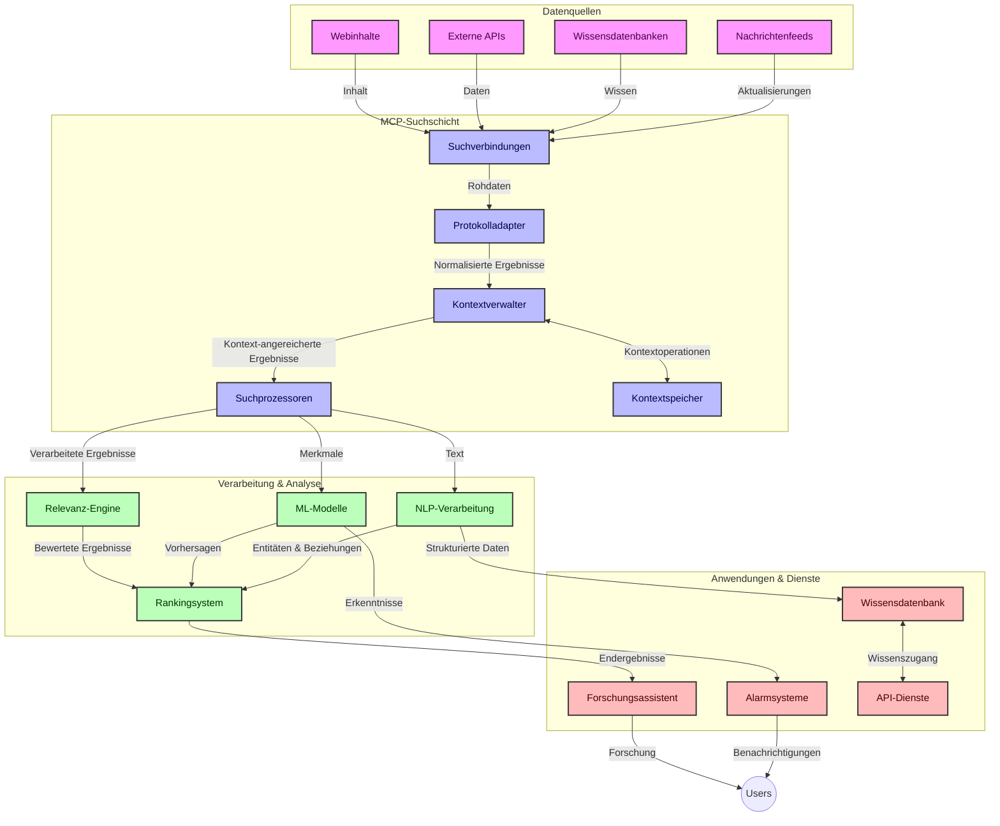
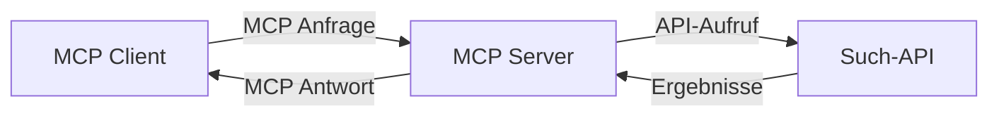
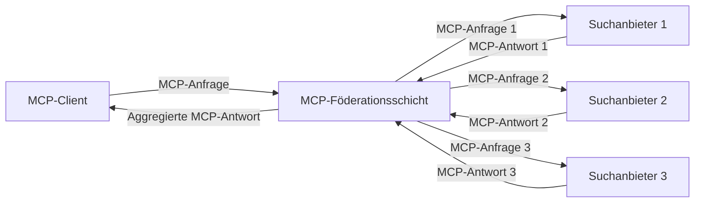
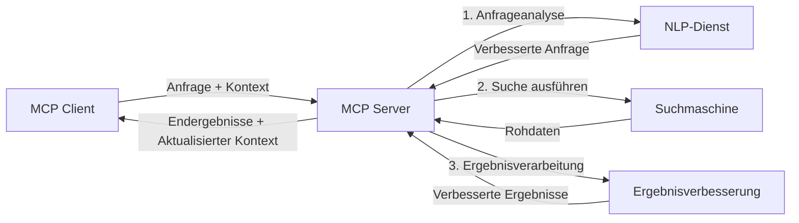

# Modell-Kontext-Protokoll für Echtzeit-Websuche

## Überblick

Echtzeit-Websuche ist in der heutigen informationsgetriebenen Umgebung unverzichtbar geworden, in der Anwendungen sofortigen Zugriff auf aktuelle Informationen im Internet benötigen, um relevante und zeitnahe Antworten zu liefern. Das Modell-Kontext-Protokoll (MCP) stellt einen bedeutenden Fortschritt bei der Optimierung dieser Echtzeit-Suchprozesse dar, verbessert die Sucheffizienz, bewahrt die kontextuelle Integrität und steigert die Gesamtleistung des Systems.

Dieses Modul untersucht, wie MCP die Echtzeit-Websuche transformiert, indem es einen standardisierten Ansatz für das Kontextmanagement zwischen KI-Modellen, Suchmaschinen und Anwendungen bietet.

### Was Sie lernen werden

In diesem umfassenden Leitfaden erfahren Sie:

- Wie MCP eine nahtlose Brücke zwischen KI-Modellen und Echtzeit-Websuchfunktionen schafft
- Architekturmustern zur Implementierung effizienter und skalierbarer Suchlösungen mit MCP
- Techniken zur Bewahrung des Suchkontexts über mehrere Abfragen und Interaktionen hinweg
- Praktische Code-Implementierungen in Python und JavaScript für verschiedene Suchszenarien
- Methoden zur Balance von Relevanz, Aktualität und Leistung in von MCP unterstützten Suchsystemen

## Einführung in die Echtzeit-Websuche

Echtzeit-Websuche ist ein technologischer Ansatz, der es ermöglicht, webbasierte Informationen kontinuierlich abzufragen, zu verarbeiten und zu analysieren, sobald sie veröffentlicht oder aktualisiert werden. So können Systeme frische und relevante Informationen mit minimaler Verzögerung bereitstellen. Im Gegensatz zu traditionellen Suchsystemen, die mit indexierten Daten arbeiten, die Stunden oder Tage alt sein können, verarbeitet die Echtzeit-Suche Live-Daten aus dem Web und liefert Einsichten und Informationen, die den aktuellen Zustand von Online-Inhalten widerspiegeln.

### Kernkonzepte der Echtzeit-Websuche:

- **Kontinuierliche Abfrageverarbeitung**: Suchanfragen werden gegen ständig aktualisierte Datenquellen verarbeitet
- **Priorisierung der Aktualität**: Systeme sind darauf ausgelegt, frische Informationen zu priorisieren
- **Ausgewogene Relevanz**: Aufrechterhaltung eines Gleichgewichts zwischen Relevanz und Aktualität
- **Skalierbare Architektur**: Systeme müssen variable Abfragelasten und Datenvolumen bewältigen können
- **Kontextuelles Verständnis**: Die Aufrechterhaltung des Nutzerkontexts über Suchdurchläufe hinweg ist essenziell für aussagekräftige Ergebnisse
- **Dynamische Abfrageumformulierung**: Adaptive Anpassung von Suchanfragen basierend auf Kontext und vorherigen Ergebnissen
- **Integration mehrerer Quellen**: Kombination von Ergebnissen aus mehreren Suchanbietern und Webquellen
- **Semantisches Verständnis**: Verarbeitung von Anfragen und Inhalten basierend auf Bedeutung statt nur Schlüsselwörtern
- **Echtzeit-Ranking**: Kontinuierliche Anpassung der Ergebnisrangfolge, sobald neue Informationen verfügbar sind

### Das Modell-Kontext-Protokoll und die Echtzeit-Websuche

Das Modell-Kontext-Protokoll (MCP) adressiert mehrere zentrale Herausforderungen in Echtzeit-Websuchumgebungen:

1. **Erhalt des Suchkontexts**: MCP standardisiert die Art und Weise, wie Kontext über verteilte Suchkomponenten hinweg erhalten bleibt, sodass KI-Modelle und Verarbeitungsknoten Zugriff auf relevante Abfragehistorien und Nutzerpräferenzen haben.

2. **Effizientes Abfragemanagement**: Durch die Bereitstellung strukturierter Mechanismen für die Kontextübertragung reduziert MCP den Aufwand wiederholter Kontextangaben in jeder Suchiteration.

3. **Interoperabilität**: MCP schafft eine gemeinsame Sprache für den Kontextaustausch zwischen verschiedenen Suchtechnologien und KI-Modellen, was flexiblere und erweiterbare Architekturen ermöglicht.

4. **Suchoptimierter Kontext**: MCP-Implementierungen können priorisieren, welche Kontextelemente für eine effektive Suche am relevantesten sind, und optimieren so sowohl Leistung als auch Genauigkeit.

5. **Adaptives Suchverhalten**: Mit ordnungsgemäßem Kontextmanagement durch MCP können Suchsysteme ihre Verarbeitung dynamisch an sich verändernde Nutzerbedürfnisse und Informationslandschaften anpassen.

In modernen Anwendungen, angefangen bei Nachrichtenaggregation bis hin zu Forschungsassistenten, ermöglicht die Integration von MCP mit Websuchtechnologien intelligentere, kontextbewusste Suchfunktionen, die im Verlauf der Nutzungsinteraktionen zunehmend relevantere Ergebnisse liefern können.

## Lernziele

Am Ende dieser Lektion werden Sie in der Lage sein:

- Die Grundlagen der Echtzeit-Websuche und ihre Herausforderungen in modernen Anwendungen zu verstehen
- Zu erklären, wie das Modell-Kontext-Protokoll (MCP) die Fähigkeiten der Echtzeit-Websuche verbessert
- MCP-basierte Suchlösungen mit gängigen Frameworks und APIs zu implementieren
- Skalierbare, leistungsstarke Sucharchitekturen mit MCP zu entwerfen und bereitzustellen
- MCP-Konzepte in verschiedenen Anwendungsfällen anzuwenden, einschließlich semantischer Suche, Forschungsassistenz und KI-gestütztem Browsing
- Neue Trends und zukünftige Innovationen in MCP-basierten Suchtechnologien zu bewerten
- Kontextbewusste Suchsysteme zu entwickeln, die aus Nutzerinteraktionen lernen
- Websuchfunktionen mithilfe standardisierter MCP-Protokolle in KI-Assistenten zu integrieren
- Mehrstufige Suchpipelines zu erstellen, die Ergebnisse basierend auf Kontext schrittweise verfeinern
- Die Suchleistung zu optimieren, während ein umfassendes Kontextbewusstsein erhalten bleibt

### Definition und Bedeutung

Echtzeit-Websuche umfasst die kontinuierliche Abfrage, Abruf und Bereitstellung webbasierter Informationen mit minimaler Latenz. Im Gegensatz zu traditionellen Suchmaschinen, die das Web periodisch crawlen und indexieren, zielt die Echtzeit-Suche darauf ab, Informationen unmittelbar nach deren Verfügbarkeit bereitzustellen und damit den sofortigen Zugriff auf die aktuellsten Inhalte zu ermöglichen.

Wichtige Merkmale der Echtzeit-Websuche sind:

- **Aktualität**: Priorisierung neuer Inhalte und Updates
- **Kontinuierliche Verarbeitung**: Ständige Überwachung neuer Informationen
- **Abfrageanpassung**: Verfeinerung von Suchanfragen basierend auf Kontext und Rückmeldungen
- **Sofortige Bereitstellung**: Suchergebnisse werden mit minimaler Verzögerung bereitgestellt
- **Kontextbeibehaltung**: Aufbau auf vorherigen Abfragen zur Verbesserung der Relevanz

### Herausforderungen traditioneller Websuche

Traditionelle Websuchansätze stoßen bei der Anwendung in Echtzeitszenarien auf mehrere Einschränkungen:

1. **Kontextfragmentierung**: Schwierigkeit, den Suchkontext über mehrere Abfragen hinweg aufrechtzuerhalten
2. **Informationsaktualität**: Herausforderungen beim Zugriff auf und Priorisieren der neuesten Informationen
3. **Integrationskomplexität**: Probleme mit der Interoperabilität zwischen Suchsystemen und Anwendungen
4. **Latenzprobleme**: Ausbalancieren umfassender Suche mit Anforderungen an die Antwortzeit
5. **Feinabstimmung der Relevanz**: Sicherstellung von Genauigkeit und Relevanz bei gleichzeitiger Priorisierung der Aktualität

## Verständnis des Modell-Kontext-Protokolls (MCP) für die Suche

### Was ist MCP im Suchkontext?

Das Modell-Kontext-Protokoll (MCP) ist ein standardisiertes Kommunikationsprotokoll, das eine effiziente Interaktion zwischen KI-Modellen und Anwendungen erleichtert. Im Kontext der Echtzeit-Websuche bietet MCP einen Rahmen für:

- Das Bewahren des Suchkontexts über Abfolgen von Suchanfragen hinweg
- Die Standardisierung von Suchanfrage- und Ergebnisformaten
- Die Optimierung der Übertragung von Suchparametern und Ergebnissen
- Die Verbesserung der Kommunikation zwischen Modell und Suchmaschine

### Kernkomponenten und Architektur

Die MCP-Architektur für die Echtzeit-Websuche besteht aus mehreren Schlüsselkomponenten:

1. **Abfrage-Kontext-Handler**: Verwalten und pflegen den Suchkontext über mehrere Abfragen hinweg
2. **Suchprozessoren**: Verarbeiten eingehende Suchanfragen mithilfe kontextbewusster Techniken
3. **Protokoll-Adapter**: Konvertieren zwischen verschiedenen Such-APIs unter Bewahrung des Kontexts
4. **Kontextspeicher**: Effiziente Speicherung und Abruf von Suchhistorie und Präferenzen
5. **Such-Connectoren**: Anbindung an verschiedene Suchmaschinen und Web-APIs



### Wie MCP die Echtzeit-Websuche verbessert

MCP begegnet den Herausforderungen traditioneller Websuche durch:

- **Kontextuelle Kontinuität**: Aufrechterhaltung von Beziehungen zwischen Suchanfragen während der gesamten Suchsitzung
- **Optimierte Übertragung**: Reduzierung von Redundanzen bei Suchparametern durch intelligentes Kontextmanagement
- **Standardisierte Schnittstellen**: Bereitstellung konsistenter APIs für Suchkomponenten
- **Verringerte Latenz**: Minimierung des Verarbeitungsaufwands durch effiziente Kontextbehandlung
- **Verbesserte Relevanz**: Steigerung der Suchrelevanz durch Bewahrung der Nutzerintention über mehrere Anfragen hinweg


## Integration und Implementierung

Echtzeit-Websuchsysteme erfordern ein sorgfältiges architektonisches Design und eine sorgfältige Implementierung, um sowohl Leistung als auch kontextuelle Integrität zu gewährleisten. Das Model Context Protocol bietet einen standardisierten Ansatz zur Integration von KI-Modellen und Suchtechnologien, der komplexere, kontextbewusste Suchpipelines ermöglicht.

### Überblick über die MCP-Integration in Sucharchitekturen

Die Implementierung von MCP in Echtzeit-Websuchumgebungen umfasst mehrere zentrale Überlegungen:

1. **Suchkontext-Serialisierung**: MCP bietet effiziente Mechanismen zur Codierung kontextueller Informationen innerhalb von Suchanfragen, wodurch sichergestellt wird, dass der wesentliche Kontext während der gesamten Verarbeitungskette der Abfrage folgt. Dies beinhaltet standardisierte Serialisierungsformate, die für suchrelevante Metadaten optimiert sind.

2. **Zustandsbehaftete Suchverarbeitung**: MCP ermöglicht intelligentere zustandsbehaftete Verarbeitung, indem eine konsistente Kontextdarstellung über Suchiterationen hinweg gepflegt wird. Dies ist besonders wertvoll in mehrstufigen Suchpipelines, in denen die Kontextverfeinerung die Ergebnisse verbessert.

3. **Abfrageerweiterung und -verfeinerung**: MCP-Implementierungen in Suchsystemen können ausgefeilte Erweiterungen und Verfeinerungen von Suchanfragen basierend auf angesammeltem Kontext erleichtern, wodurch mit fortschreitender Suchsitzung immer relevantere Ergebnisse erzielt werden.

4. **Ergebnis-Caching und Priorisierung**: Durch die Standardisierung der Kontextbehandlung trägt MCP dazu bei, das Ergebnis-Caching und die Priorisierung zu steuern, sodass Komponenten sich an den sich entwickelnden Suchkontext anpassen können.

5. **Suchföderation und Aggregation**: MCP ermöglicht eine ausgefeiltere Föderation von Suchanfragen über mehrere Backends, indem strukturierte Darstellungen des Suchkontexts bereitgestellt werden, die eine sinnvollere Aggregation von Ergebnissen aus unterschiedlichen Quellen ermöglichen.

Die Implementierung von MCP über verschiedene Suchtechnologien hinweg schafft einen einheitlichen Ansatz für das Kontextmanagement, reduziert den Bedarf an benutzerdefiniertem Integrationscode und verbessert die Fähigkeit des Systems, bedeutsamen Kontext bei der Entwicklung von Suchanfragen aufrechtzuerhalten.

### MCP bei verschiedenen Websuchimplementierungen

Diese Beispiele folgen der aktuellen MCP-Spezifikation, die sich auf ein JSON-RPC-basiertes Protokoll mit unterschiedlichen Transportmechanismen konzentriert. Der Code zeigt, wie benutzerdefinierte Suchintegrationen implementiert werden können, während die volle Kompatibilität mit dem MCP-Protokoll erhalten bleibt.


<details>
<summary>Python-Implementierung mit generischer Such-API</summary>

```python
import asyncio
import json
import aiohttp
from typing import Dict, Any, Optional, List
from contextlib import asynccontextmanager
from collections.abc import AsyncIterator

# Importieren der Standard-MCP-Bibliotheken
from mcp.client.session import ClientSession
from mcp.client.streamable_http import streamablehttp_client
from mcp.types import TextContent, CreateMessageRequestParams, CreateMessageResult
from mcp.server.fastmcp import FastMCP

# Erstellen eines FastMCP-Servers für die Websuche
search_server = FastMCP("WebSearch")

# Klasse zur Handhabung von Websuchvorgängen
class WebSearchHandler:
    def __init__(self, api_endpoint: str, api_key: str):
        self.api_endpoint = api_endpoint
        self.api_key = api_key
        self.session = None
        
    async def initialize(self):
        """Initialize the HTTP session"""
        self.session = aiohttp.ClientSession(
            headers={"Authorization": f"Bearer {self.api_key}"}
        )
    
    async def close(self):
        """Close the HTTP session"""
        if self.session:
            await self.session.close()
            
    async def perform_search(self, query: str, max_results: int = 5, 
                           include_domains: List[str] = None, 
                           exclude_domains: List[str] = None,
                           time_period: str = "any") -> Dict[str, Any]:
        """Perform web search using the search API"""
        # Suchparameter konstruieren
        search_params = {
            "q": query,
            "limit": max_results,
            "time": time_period
        }
        
        if include_domains:
            search_params["site"] = ",".join(include_domains)
            
        if exclude_domains:
            search_params["exclude_site"] = ",".join(exclude_domains)
        
        # Die Suchanfrage ausführen
        try:
            async with self.session.get(
                self.api_endpoint,
                params=search_params
            ) as response:
                if response.status != 200:
                    error_text = await response.text()
                    raise Exception(f"Search API error: {response.status} - {error_text}")
                
                search_data = await response.json()
                
                # API-spezifische Antwort in ein Standardformat umwandeln
                results = []
                for item in search_data.get("results", []):
                    results.append({
                        "title": item.get("title", ""),
                        "url": item.get("url", ""),
                        "snippet": item.get("snippet", ""),
                        "date": item.get("published_date", ""),
                        "source": item.get("source", "")
                    })
                
                return {
                    "query": query,
                    "totalResults": len(results),
                    "results": results
                }
        except Exception as e:
            print(f"Search API request error: {e}")
            raise

# Den Such-Handler initialisieren
search_handler = WebSearchHandler(
    api_endpoint="https://api.search-service.example/search",
    api_key="your-api-key-here"
)

# Lebensdauer einrichten, um den Such-Handler zu verwalten
@asyncio.asynccontextmanager
async def app_lifespan(server: FastMCP):
    """Manage application lifecycle"""
    await search_handler.initialize()
    try:
        yield {"search_handler": search_handler}
    finally:
        await search_handler.close()

# Lebensdauer für den Server festlegen
search_server = FastMCP("WebSearch", lifespan=app_lifespan)

# Ein Websuch-Werkzeug registrieren
@search_server.tool()
async def web_search(query: str, max_results: int = 5, 
                   include_domains: List[str] = None,
                   exclude_domains: List[str] = None,
                   time_period: str = "any") -> Dict[str, Any]:
    """
    Search the web for information
    
    Args:
        query: The search query
        max_results: Maximum number of results to return (default: 5)
        include_domains: List of domains to include in search results
        exclude_domains: List of domains to exclude from search results
        time_period: Time period for results ("day", "week", "month", "any")
        
    Returns:
        Dictionary containing search results
    """
    ctx = search_server.get_context()
    search_handler = ctx.request_context.lifespan_context["search_handler"]
    
    results = await search_handler.perform_search(
        query=query,
        max_results=max_results,
        include_domains=include_domains,
        exclude_domains=exclude_domains,
        time_period=time_period
    )
    
    return results

# Beispielhafte Client-Nutzung
async def client_example():
    # Mit dem Suchserver über Streamable HTTP Transport verbinden
    async with streamablehttp_client("http://localhost:8000/mcp") as (read, write, _):
        async with ClientSession(read, write) as session:
            # Die Verbindung initialisieren
            await session.initialize()
            
            # Das web_search-Werkzeug aufrufen
            search_results = await session.call_tool(
                "web_search", 
                {
                    "query": "latest developments in AI and Model Context Protocol",
                    "max_results": 5,
                    "time_period": "day",
                    "include_domains": ["github.com", "microsoft.com"]
                }
            )
            
            print(f"Search results: {search_results}")

# Serverausführungsbeispiel
if __name__ == "__main__":
    # Den Server mit Streamable HTTP Transport ausführen
    search_server.run(transport="streamable-http")
```
</details> 

<details>
<summary>JavaScript-Implementierung mit browserbasierter Suche</summary>


```javascript
// MCP-Serverimplementierung für die Websuche
import { McpServer, ResourceTemplate } from '@modelcontextprotocol/sdk/server/mcp.js';
import { StreamableHTTPServerTransport } from '@modelcontextprotocol/sdk/server/streamableHttp.js';
import { z } from 'zod';

// Erstelle einen MCP-Server für die Websuche
const searchServer = new McpServer({
    name: "BrowserSearch",
    description: "A server that provides web search capabilities"
});

// Suchdienstklasse
class SearchService {
    constructor(searchApiUrl, apiKey) {
        this.searchApiUrl = searchApiUrl;
        this.apiKey = apiKey;
    }

    async performSearch(parameters) {
        const {
            query = '',
            maxResults = 5,
            includeDomains = [],
            excludeDomains = [],
            timePeriod = 'any'
        } = parameters;
        
        // Baue die Such-URL mit Parametern
        const url = new URL(this.searchApiUrl);
        url.searchParams.append('q', query);
        url.searchParams.append('limit', maxResults);
        url.searchParams.append('time', timePeriod);
        
        if (includeDomains.length > 0) {
            url.searchParams.append('site', includeDomains.join(','));
        }
        
        if (excludeDomains.length > 0) {
            url.searchParams.append('exclude_site', excludeDomains.join(','));
        }
        
        try {
            const response = await fetch(url.toString(), {
                method: 'GET',
                headers: {
                    'Authorization': `Bearer ${this.apiKey}`,
                    'Content-Type': 'application/json'
                }
            });
            
            if (!response.ok) {
                const errorText = await response.text();
                throw new Error(`Search API error: ${response.status} - ${errorText}`);
            }
            
            const searchData = await response.json();
            
            // Transformiere API-spezifische Antwort in ein Standardformat
            const results = searchData.results?.map(item => ({
                title: item.title || '',
                url: item.url || '',
                snippet: item.snippet || '',
                date: item.published_date || '',
                source: item.source || ''
            })) || [];
            
            return {
                query,
                totalResults: results.length,
                results
            };
        } catch (error) {
            console.error('Search API request error:', error);
            throw error;
        }
    }
}

// Initialisiere den Suchdienst
const searchService = new SearchService(
    'https://api.search-service.example/search',
    'your-api-key-here'
);

// Richte den Kontextanbieter für den Server ein
searchServer.setContextProvider(() => {
    return {
        searchService
    };
});

// Registriere das Websuchwerkzeug
searchServer.tool({
    name: 'web_search',
    description: 'Search the web for information',
    parameters: {
        type: 'object',
        properties: {
            query: {
                type: 'string',
                description: 'The search query'
            },
            maxResults: {
                type: 'integer',
                description: 'Maximum number of results to return',
                default: 5
            },
            includeDomains: {
                type: 'array',
                items: { type: 'string' },
                description: 'List of domains to include in search results'
            },
            excludeDomains: {
                type: 'array',
                items: { type: 'string' },
                description: 'List of domains to exclude from search results'
            },
            timePeriod: {
                type: 'string',
                description: 'Time period for results',
                enum: ['day', 'week', 'month', 'any'],
                default: 'any'
            }
        },
        required: ['query']
    },
    handler: async (params, context) => {
        const { searchService } = context;
        return await searchService.performSearch(params);
    }
});

// Beispielclient-Code zur Verbindung mit dem Suchserver
import { Client } from '@modelcontextprotocol/sdk/client/index.js';
import { StreamableHTTPClientTransport } from '@modelcontextprotocol/sdk/client/streamableHttp.js';

async function connectToSearchServer() {
    // Verbinde mit dem Suchserver
    const transport = new StreamableHTTPClientTransport(
        new URL('http://localhost:8000/mcp')
    );
    
    const client = new Client({
        name: 'search-client',
        version: '1.0.0'
    });
    
    await client.connect(transport);
    
    // Führe das Suchwerkzeug aus
    const searchResults = await client.callTool({
        name: 'web_search',
        arguments: {
            query: 'Model Context Protocol implementation examples',
            maxResults: 10,
            timePeriod: 'week',
            includeDomains: ['github.com', 'docs.microsoft.com']
        }
    });
    
    console.log('Search results:', searchResults);
    
    // Bereinigung
    await client.disconnect();
}

// Starte den Server
const transport = new StreamableHTTPServerTransport();
await searchServer.connect(transport);
console.log('Search server running at http://localhost:8000/mcp');

// In einem separaten Prozess oder nachdem der Server gestartet wurde
// connectToSearchServer().catch(console.error);
```
</details> 


## Haftungsausschluss zu Codebeispielen

> **Wichtiger Hinweis**: Die folgenden Codebeispiele demonstrieren die Integration des Model Context Protocol (MCP) mit Websuchfunktionen. Obwohl sie den Mustern und Strukturen der offiziellen MCP-SDKs folgen, wurden sie zu Bildungszwecken vereinfacht.
> 
> Diese Beispiele zeigen:
> 
> 1. **Python-Implementierung**: Eine FastMCP-Serverimplementierung, die ein Websuch-Tool bereitstellt und sich mit einer externen Such-API verbindet. Dieses Beispiel demonstriert die ordnungsgemäße Lebenszyklusverwaltung, Kontextbehandlung und Toolimplementierung nach den Mustern des [offiziellen MCP Python SDK](https://github.com/modelcontextprotocol/python-sdk). Der Server nutzt den empfohlenen Streamable HTTP-Transport, der den älteren SSE-Transport für produktive Einsätze abgelöst hat.
> 
> 2. **JavaScript-Implementierung**: Eine TypeScript/JavaScript-Implementierung unter Verwendung des FastMCP-Musters aus dem [offiziellen MCP TypeScript SDK](https://github.com/modelcontextprotocol/typescript-sdk) zur Erstellung eines Suchservers mit korrekter Tooldefinition und Clientverbindungen. Sie folgt den neuesten empfohlenen Mustern für Sitzungsmanagement und Kontextwahrung.
> 
> Für den Produktionseinsatz würden diese Beispiele zusätzliche Fehlerbehandlung, Authentifizierung und spezifischen API-Integrationscode erfordern. Die gezeigten Such-API-Endpunkte (`https://api.search-service.example/search`) sind Platzhalter und müssten durch tatsächliche Suchdienst-Endpunkte ersetzt werden.
> 
> Für vollständige Implementierungsdetails und die aktuellsten Vorgehensweisen,
> siehe die [offizielle MCP-Spezifikation](https://modelcontextprotocol.io/specification/2026-07-28/)
> und die SDK-Dokumentation.

## Kernkonzepte

### Das Model Context Protocol (MCP) Framework

Grundlegend bietet das Model Context Protocol eine standardisierte Möglichkeit, wie KI-Modelle, Anwendungen und Dienste Kontext austauschen. Beim Echtzeit-Websuchvorgang ist dieses Framework entscheidend, um kohärente Sucherlebnisse mit mehreren Durchläufen zu schaffen. Wichtige Komponenten sind:

1. **Client-Server-Architektur**: MCP schafft eine klare Trennung zwischen Suchclients (Anfragesteller) und Suchservern (Anbieter), die flexible Bereitstellungsmodelle ermöglicht.

2. **JSON-RPC-Kommunikation**: Das Protokoll verwendet JSON-RPC zum Nachrichtenaustausch, was es kompatibel mit Webtechnologien macht und die Implementierung auf verschiedenen Plattformen erleichtert.

3. **Kontextverwaltung**: MCP definiert strukturierte Methoden zur Pflege, Aktualisierung und Nutzung des Suchkontexts über mehrere Interaktionen hinweg.

4. **Tool-Definitionen**: Suchfunktionen werden als standardisierte Tools mit klar definierten Parametern und Rückgabewerten bereitgestellt.

5. **Streaming-Unterstützung**: Das Protokoll unterstützt Streaming-Ergebnisse, was für die Echtzeitsuche unerlässlich ist, bei der Ergebnisse schrittweise eintreffen können.

### Integrationsmuster für Websuche

Bei der Integration von MCP in die Websuche treten verschiedene Muster auf:

#### 1. Direkte Integration des Suchanbieters



In diesem Muster stellt der MCP-Server die direkte Schnittstelle zu einer oder mehreren Such-APIs dar, übersetzt MCP-Anfragen in API-spezifische Aufrufe und formatiert die Ergebnisse als MCP-Antworten.

#### 2. Föderierte Suche mit Kontextwahrung



Dieses Muster verteilt Suchanfragen über mehrere MCP-kompatible Suchanbieter, die sich jeweils auf unterschiedliche Inhaltsarten oder Suchfunktionen spezialisieren können und dennoch einen einheitlichen Kontext beibehalten.

#### 3. Kontext-verbesserte Suchkette



Bei diesem Muster wird der Suchprozess in mehrere Stufen unterteilt, wobei der Kontext bei jedem Schritt angereichert wird und so zunehmend relevantere Ergebnisse erzielt werden.

### Komponenten des Suchkontexts

Im MCP-basierten Websuchkontext umfasst der Kontext typischerweise:

- **Abfrageverlauf**: Frühere Suchanfragen in der Sitzung
- **Benutzereinstellungen**: Sprache, Region, Safe-Search-Einstellungen
- **Interaktionsverlauf**: Welche Ergebnisse angeklickt wurden, wie viel Zeit bei Ergebnissen verbracht wurde
- **Suchparameter**: Filter, Sortierreihenfolgen und andere Suchmodifikatoren
- **Fachliches Wissen**: Fachspezifischer Kontext, der für die Suche relevant ist
- **Zeitlicher Kontext**: Zeitbasierte Relevanzfaktoren
- **Quellenpräferenzen**: Vertrauenswürdige oder bevorzugte Informationsquellen

## Anwendungsfälle und Einsatzbereiche

### Forschung und Informationsbeschaffung

MCP verbessert Forschungsabläufe durch:

- Bewahrung des Forschungs-Kontexts über Suchsitzungen hinweg
- Ermöglichung ausgefeilterer und kontextuell relevanterer Abfragen
- Unterstützung föderierter Suchen über mehrere Quellen
- Erleichterung der Wissensextraktion aus Suchergebnissen

### Echtzeit-Nachrichten- und Trendüberwachung

Von MCP unterstützte Suche bietet Vorteile für die Nachrichtenüberwachung:

- Entdeckung von aktuellen Nachrichtenereignissen in quasi Echtzeit
- Kontextuelle Filterung relevanter Informationen
- Themen- und Entitätenverfolgung über mehrere Quellen hinweg
- Personalisierte Nachrichtenbenachrichtigungen basierend auf Benutzerkontext

### KI-unterstütztes Browsen und Forschen

MCP eröffnet neue Möglichkeiten für KI-unterstütztes Browsen:

- Kontextbasierte Suchvorschläge basierend auf aktueller Browseraktivität
- Nahtlose Integration der Websuche mit LLM-gestützten Assistenten
- Mehrstufige Suchverfeinerung bei wahrung des Kontexts
- Verbesserte Faktenprüfung und Informationsverifikation

## Zukünftige Trends und Innovationen

### Entwicklung von MCP in der Websuche

Mit Blick auf die Zukunft erwarten wir, dass MCP sich weiterentwickelt, um folgende Aspekte zu adressieren:


- **Multimodale Suche**: Integration von Text-, Bild-, Audio- und Videosuche mit erhaltener Kontextinformation
- **Dezentrale Suche**: Unterstützung verteilter und föderierter Suchökosysteme
- **Suchprivatsphäre**: Kontextbewusste, datenschutzwahrende Suchmechanismen
- **Abfrageverständnis**: Tiefgehende semantische Analyse natürlicher Sprachsuchanfragen

### Potentielle technologische Fortschritte

Neue Technologien, die die Zukunft der MCP-Suche prägen werden:

1. **Neuronale Sucharchitekturen**: Einbettungsbasierte Suchsysteme, optimiert für MCP
2. **Personalisierter Suchkontext**: Erlernen individueller Suchmuster von Nutzern über die Zeit
3. **Integration von Wissensgraphen**: Kontextbasierte Suche verbessert durch domänenspezifische Wissensgraphen
4. **Modalitätenübergreifender Kontext**: Kontextbeibehaltung über verschiedene Suchmodalitäten hinweg

## Praktische Übungen

### Übung 1: Einrichtung einer einfachen MCP-Suchpipeline

In dieser Übung lernen Sie:
- Konfiguration einer einfachen MCP-Suchumgebung
- Implementierung von Kontext-Handlern für die Websuche
- Test und Validierung der Kontextbeibehaltung über Suchdurchläufe hinweg

### Übung 2: Aufbau eines Research-Assistenten mit MCP-Suche

Erstellen Sie eine vollständige Anwendung, die:
- Natürliche Sprachforschungsfragen verarbeitet
- Kontextbewusste Websuchen ausführt
- Informationen aus mehreren Quellen zusammenfasst
- Organisierte Forschungsergebnisse präsentiert

### Übung 3: Implementierung einer Multi-Source-Suchföderation mit MCP

Erweiterte Übung zu:
- Kontextbewusstem Absetzen von Abfragen an mehrere Suchmaschinen
- Ergebnis-Rangfolge und Aggregation
- Kontextuelle Duplikatserkennung der Suchergebnisse
- Umgang mit quellenspezifischen Metadaten

## Zusätzliche Ressourcen

- [Model Context Protocol Specification](https://modelcontextprotocol.io/specification/2026-07-28/) - Offizielle MCP-Spezifikation und ausführliche Protokolldokumentation
- [Model Context Protocol Documentation](https://modelcontextprotocol.io/) - Detaillierte Tutorials und Implementierungsanleitungen
- [MCP Python SDK](https://github.com/modelcontextprotocol/python-sdk) - Offizielle Python-Implementierung des MCP-Protokolls
- [MCP TypeScript SDK](https://github.com/modelcontextprotocol/typescript-sdk) - Offizielle TypeScript-Implementierung des MCP-Protokolls
- [MCP Reference Servers](https://github.com/modelcontextprotocol/servers) - Referenzimplementierungen von MCP-Servern
- [Bing Web Search API Documentation](https://learn.microsoft.com/en-us/bing/search-apis/bing-web-search/overview) - Microsofts Web-Such-API
- [Google Custom Search JSON API](https://developers.google.com/custom-search/v1/overview) - Googles programmierbare Suchmaschine
- [SerpAPI Documentation](https://serpapi.com/search-api) - API für Suchmaschinenergebnisseiten
- [Meilisearch Documentation](https://www.meilisearch.com/docs) - Open-Source-Suchmaschine
- [Elasticsearch Documentation](https://www.elastic.co/guide/index.html) - Verteilte Such- und Analyse-Engine
- [LangChain Documentation](https://python.langchain.com/docs/get_started/introduction) - Anwendungen mit LLMs entwickeln

## Lernziele

Nach Abschluss dieses Moduls sind Sie in der Lage:

- Die Grundlagen der Echtzeit-Websuche und deren Herausforderungen zu verstehen
- Erläutern, wie das Model Context Protocol (MCP) die Fähigkeiten der Echtzeit-Websuche verbessert
- MCP-basierte Suchlösungen mit populären Frameworks und APIs zu implementieren
- Skalierbare, leistungsstarke Sucharchitekturen mit MCP zu entwerfen und bereitzustellen
- MCP-Konzepte auf verschiedene Anwendungsfälle anzuwenden, darunter semantische Suche, Forschungsassistenz und KI-unterstütztes Browsen
- Neue Trends und zukünftige Innovationen im Bereich der MCP-basierten Suchtechnologien zu bewerten


### Vertrauens- und Sicherheitsüberlegungen

Denken Sie bei der Implementierung von MCP-basierten Websuchlösungen an diese wichtigen Prinzipien aus der MCP-Spezifikation:

1. **Benutzereinwilligung und Kontrolle**: Benutzer müssen alle Datenzugriffe und Operationen ausdrücklich zustimmen und verstehen. Dies ist besonders wichtig bei Websuchimplementierungen, die externe Datenquellen anzapfen können.

2. **Datenschutz**: Stellen Sie eine angemessene Handhabung von Suchanfragen und Ergebnissen sicher, insbesondere wenn diese sensible Informationen enthalten könnten. Implementieren Sie angemessene Zugriffskontrollen zum Schutz der Benutzerdaten.

3. **Werkzeugsicherheit**: Implementieren Sie ordnungsgemäße Autorisierung und Validierung für Suchwerkzeuge, da diese potenzielle Sicherheitsrisiken durch beliebige Codeausführung darstellen. Beschreibungen des Werkzeugverhaltens sollten als nicht vertrauenswürdig betrachtet werden, sofern sie nicht von einem vertrauenswürdigen Server stammen.

4. **Klare Dokumentation**: Bieten Sie eine klare Dokumentation über die Fähigkeiten, Einschränkungen und Sicherheitsaspekte Ihrer MCP-basierten Suche, entsprechend den Implementierungsrichtlinien der MCP-Spezifikation.

5. **Robuste Zustimmungsprozesse**: Entwickeln Sie robuste Zustimmungs- und Autorisierungsprozesse, die klar erklären, was jedes Werkzeug tut, bevor dessen Verwendung genehmigt wird, insbesondere bei Werkzeugen, die mit externen Webressourcen interagieren.

Für vollständige Details zu MCP-Sicherheits- und Vertrauensaspekten verweisen Sie auf die
[offizielle Dokumentation](https://modelcontextprotocol.io/specification/2026-07-28/basic/security_best_practices).

## Was kommt als Nächstes

- [5.12 Entra ID Authentication für Model Context Protocol Server](../mcp-security-entra/README.md)

---

<!-- CO-OP TRANSLATOR DISCLAIMER START -->
**Haftungsausschluss**:
Dieses Dokument wurde mit dem KI-Übersetzungsdienst [Co-op Translator](https://github.com/Azure/co-op-translator) übersetzt. Obwohl wir uns um Genauigkeit bemühen, beachten Sie bitte, dass automatisierte Übersetzungen Fehler oder Ungenauigkeiten enthalten können. Das Originaldokument in seiner Ursprungssprache gilt als maßgebliche Quelle. Bei kritischen Informationen wird eine professionelle menschliche Übersetzung empfohlen. Wir übernehmen keine Haftung für Missverständnisse oder Fehlinterpretationen, die aus der Verwendung dieser Übersetzung entstehen.
<!-- CO-OP TRANSLATOR DISCLAIMER END -->