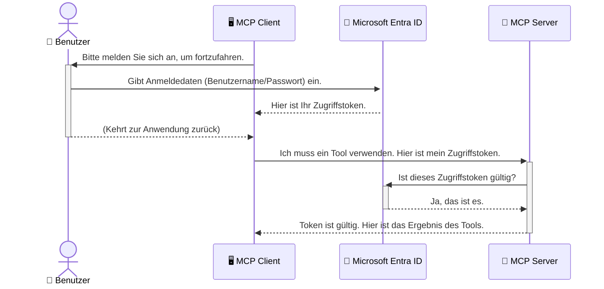

# Sicherung von KI-Workflows: Entra ID-Authentifizierung für Model Context Protocol-Server

> [!NOTE]
> Der Remote-Server-Code in dieser Lektion schützt die Legacy-Endpoints `/sse` und `/message`
> und zielt auf MCP `2025-11-25`. Behalten Sie dessen Identitäts- und Token-Validierungs-
> Praktiken bei, verwenden Sie aber für neue Implementierungen einen Streamable HTTP-Transport,
> der mit `2026-07-28` kompatibel ist.

## Einführung
Die Sicherung Ihres Model Context Protocol (MCP)-Servers ist ebenso wichtig wie das Abschließen der Haustür. Wenn Sie Ihren MCP-Server offen lassen, setzen Sie Ihre Werkzeuge und Daten unbefugtem Zugriff aus, was zu Sicherheitsverletzungen führen kann. Microsoft Entra ID bietet eine robuste cloudbasierte Identitäts- und Zugriffsverwaltungslösung, die sicherstellt, dass nur autorisierte Benutzer und Anwendungen mit Ihrem MCP-Server interagieren können. In diesem Abschnitt lernen Sie, wie Sie Ihre KI-Workflows mit Entra ID-Authentifizierung schützen.

## Lernziele
Am Ende dieses Abschnitts werden Sie in der Lage sein:

- Die Bedeutung der Sicherung von MCP-Servern zu verstehen.
- Die Grundlagen von Microsoft Entra ID und OAuth 2.0-Authentifizierung zu erklären.
- Den Unterschied zwischen öffentlichen und vertraulichen Clients zu erkennen.
- Die Entra ID-Authentifizierung sowohl in lokalen (öffentlichen Client) als auch in entfernten (vertraulichen Client) MCP-Server-Szenarien zu implementieren.
- Sicherheitsbest Practices bei der Entwicklung von KI-Workflows anzuwenden.

## Sicherheit und MCP

So wie Sie die Haustür nicht offen lassen würden, sollten Sie Ihren MCP-Server nicht für jedermann zugänglich lassen. Die Sicherung Ihrer KI-Workflows ist wesentlich, um robuste, vertrauenswürdige und sichere Anwendungen zu erstellen. Dieses Kapitel führt Sie in die Verwendung von Microsoft Entra ID ein, um Ihre MCP-Server zu sichern und sicherzustellen, dass nur autorisierte Benutzer und Anwendungen auf Ihre Werkzeuge und Daten zugreifen können.

## Warum Sicherheit für MCP-Server wichtig ist

Stellen Sie sich vor, Ihr MCP-Server verfügt über ein Werkzeug, das E-Mails versenden oder auf eine Kundendatenbank zugreifen kann. Ein ungesicherter Server bedeutet, dass jeder dieses Werkzeug potenziell nutzen könnte, was zu unbefugtem Datenzugriff, Spam oder anderen bösartigen Aktivitäten führen kann.

Durch die Implementierung von Authentifizierung stellen Sie sicher, dass jede Anfrage an Ihren Server überprüft wird und die Identität des Benutzers oder der Anwendung, die die Anfrage stellt, bestätigt wird. Dies ist der erste und wichtigste Schritt zur Sicherung Ihrer KI-Workflows.

## Einführung in Microsoft Entra ID

[**Microsoft Entra ID**](https://adoption.microsoft.com/microsoft-security/entra/) ist ein cloudbasierter Identitäts- und Zugriffsverwaltungsdienst. Betrachten Sie ihn als eine universelle Sicherheitsinstanz für Ihre Anwendungen. Er übernimmt den komplexen Prozess der Benutzeridentitätsprüfung (Authentifizierung) und der Bestimmung der erlaubten Aktionen (Autorisierung).

Durch die Nutzung von Entra ID können Sie:

- Sichere Anmeldung für Benutzer ermöglichen.
- APIs und Dienste schützen.
- Zugriffspolitiken zentral verwalten.

Für MCP-Server bietet Entra ID eine robuste und weithin vertrauenswürdige Lösung zur Verwaltung, wer auf die Fähigkeiten Ihres Servers zugreifen kann.

---

## Das Geheimnis verstehen: Wie Entra ID-Authentifizierung funktioniert

Entra ID verwendet offene Standards wie **OAuth 2.0** zur Abwicklung der Authentifizierung. Obwohl die Details komplex sein können, ist das Kernkonzept einfach und lässt sich mit einer Analogie verstehen.

### Eine sanfte Einführung in OAuth 2.0: Der Valet-Schlüssel

Stellen Sie sich OAuth 2.0 vor wie einen Parkservice für Ihr Auto. Wenn Sie in ein Restaurant kommen, geben Sie dem Parkservice nicht Ihren Hauptschlüssel. Stattdessen geben Sie einen **Valet-Schlüssel** mit eingeschränkten Berechtigungen – er kann das Auto starten und die Türen verriegeln, aber er kann den Kofferraum oder das Handschuhfach nicht öffnen.

In dieser Analogie:

- **Sie** sind der **Benutzer**.
- **Ihr Auto** ist der **MCP-Server** mit seinen wertvollen Werkzeugen und Daten.
- Der **Valet** ist **Microsoft Entra ID**.
- Der **Parkservice** ist der **MCP-Client** (die Anwendung, die versucht, auf den Server zuzugreifen).
- Der **Valet-Schlüssel** ist das **Access Token**.

Das Access Token ist eine sichere Textzeichenfolge, die der MCP-Client von Entra ID erhält, nachdem Sie sich angemeldet haben. Der Client legt dieses Token bei jeder Anfrage dem MCP-Server vor. Der Server kann das Token verifizieren, um sicherzustellen, dass die Anfrage legitim ist und der Client die nötigen Berechtigungen besitzt, und das alles, ohne jemals Ihre tatsächlichen Anmeldedaten (wie Ihr Passwort) verwalten zu müssen.

### Der Authentifizierungsablauf

So funktioniert der Prozess in der Praxis:



### Vorstellung der Microsoft Authentication Library (MSAL)

Bevor wir in den Code eintauchen, ist es wichtig, eine wichtige Komponente vorzustellen, die in den Beispielen verwendet wird: die **Microsoft Authentication Library (MSAL)**.

MSAL ist eine von Microsoft entwickelte Bibliothek, die es Entwicklern erheblich erleichtert, die Authentifizierung zu handhaben. Anstatt all den komplexen Code für Sicherheitstoken, Anmeldungen und Sitzungsaktualisierungen selbst schreiben zu müssen, übernimmt MSAL die schwere Arbeit.

Die Verwendung einer Bibliothek wie MSAL wird dringend empfohlen, da:

- **Sie sicher ist:** Sie implementiert branchenübliche Protokolle und Sicherheitsbest Practices, wodurch das Risiko von Schwachstellen im Code verringert wird.
- **Die Entwicklung vereinfacht:** Sie abstrahiert die Komplexität der OAuth 2.0- und OpenID Connect-Protokolle, sodass Sie robuste Authentifizierung mit wenigen Zeilen Code zu Ihrer Anwendung hinzufügen können.
- **Sie gepflegt wird:** Microsoft pflegt und aktualisiert MSAL aktiv, um auf neue Sicherheitssbedrohungen und Plattformänderungen zu reagieren.

MSAL unterstützt zahlreiche Sprachen und Anwendungsframeworks, einschließlich .NET, JavaScript/TypeScript, Python, Java, Go sowie mobile Plattformen wie iOS und Android. Das bedeutet, dass Sie über Ihren gesamten Technologie-Stack einheitliche Authentifizierungsmuster verwenden können.

Um mehr über MSAL zu erfahren, können Sie die offizielle [MSAL Übersichts-Dokumentation](https://learn.microsoft.com/entra/identity-platform/msal-overview) ansehen.

---

## Absichern Ihres MCP-Servers mit Entra ID: Eine Schritt-für-Schritt-Anleitung

Nun führen wir Sie durch die Sicherung eines lokalen MCP-Servers (der über `stdio` kommuniziert) mit Entra ID. Dieses Beispiel verwendet einen **öffentlichen Client**, der für Anwendungen geeignet ist, die auf einem Benutzergerät laufen, wie eine Desktop-App oder ein lokaler Entwicklungsserver.

### Szenario 1: Absicherung eines lokalen MCP-Servers (mit öffentlichem Client)

In diesem Szenario betrachten wir einen lokal laufenden MCP-Server, der über `stdio` kommuniziert und Entra ID verwendet, um den Benutzer zu authentifizieren, bevor er den Zugriff auf seine Werkzeuge erlaubt. Der Server verfügt über ein einzelnes Werkzeug, das die Profilinformationen des Benutzers von der Microsoft Graph API abruft.

#### 1. Einrichtung der Anwendung in Entra ID

Bevor Sie Code schreiben, müssen Sie Ihre Anwendung in Microsoft Entra ID registrieren. Das teilt Entra ID Ihre Anwendung mit und erteilt ihr die Erlaubnis, den Authentifizierungsdienst zu nutzen.

1. Navigieren Sie zum **[Microsoft Entra-Portal](https://entra.microsoft.com/)**.
2. Gehen Sie zu **App-Registrierungen** und klicken Sie auf **Neue Registrierung**.
3. Geben Sie Ihrer Anwendung einen Namen (z. B. "Mein lokaler MCP-Server").
4. Wählen Sie für **Unterstützte Kontotypen** **Konten in diesem Organisationsverzeichnis** aus.
5. Sie können die **Umleitungs-URI** für dieses Beispiel leer lassen.
6. Klicken Sie auf **Registrieren**.

Nach der Registrierung beachten Sie die **Anwendungs-(Client-)ID** und die **Verzeichnis-(Mandanten-)ID**. Diese benötigen Sie im Code.

#### 2. Der Code: Eine Übersicht

Schauen wir uns die wichtigsten Teile des Codes an, die die Authentifizierung regeln. Der vollständige Code dieses Beispiels steht im Ordner [Entra ID - Local - WAM](https://github.com/Azure-Samples/mcp-auth-servers/tree/main/src/entra-id-local-wam) im [mcp-auth-servers GitHub-Repository](https://github.com/Azure-Samples/mcp-auth-servers) zur Verfügung.

**`AuthenticationService.cs`**

Diese Klasse ist verantwortlich für die Interaktion mit Entra ID.

- **`CreateAsync`**: Diese Methode initialisiert die `PublicClientApplication` aus der MSAL (Microsoft Authentication Library). Sie ist mit Ihrer `clientId` und `tenantId` konfiguriert.
- **`WithBroker`**: Dies aktiviert die Nutzung eines Brokers (wie den Windows Web Account Manager), was ein sichereres und nahtloseres Single Sign-On-Erlebnis ermöglicht.
- **`AcquireTokenAsync`**: Dies ist die Kernmethode. Sie versucht zuerst, ein Token stillschweigend zu erwerben (der Benutzer muss sich nicht erneut anmelden, wenn bereits eine gültige Sitzung besteht). Wenn kein stillschweigendes Token erworben werden kann, fordert sie den Benutzer zur interaktiven Anmeldung auf.

```csharp
// Simplified for clarity
public static async Task<AuthenticationService> CreateAsync(ILogger<AuthenticationService> logger)
{
    var msalClient = PublicClientApplicationBuilder
        .Create(_clientId) // Your Application (client) ID
        .WithAuthority(AadAuthorityAudience.AzureAdMyOrg)
        .WithTenantId(_tenantId) // Your Directory (tenant) ID
        .WithBroker(new BrokerOptions(BrokerOptions.OperatingSystems.Windows))
        .Build();

    // ... cache registration ...

    return new AuthenticationService(logger, msalClient);
}

public async Task<string> AcquireTokenAsync()
{
    try
    {
        // Try silent authentication first
        var accounts = await _msalClient.GetAccountsAsync();
        var account = accounts.FirstOrDefault();

        AuthenticationResult? result = null;

        if (account != null)
        {
            result = await _msalClient.AcquireTokenSilent(_scopes, account).ExecuteAsync();
        }
        else
        {
            // If no account, or silent fails, go interactive
            result = await _msalClient.AcquireTokenInteractive(_scopes).ExecuteAsync();
        }

        return result.AccessToken;
    }
    catch (Exception ex)
    {
        _logger.LogError(ex, "An error occurred while acquiring the token.");
        throw; // Optionally rethrow the exception for higher-level handling
    }
}
```

**`Program.cs`**

Hier wird der MCP-Server eingerichtet und der Authentifizierungsdienst integriert.

- **`AddSingleton<AuthenticationService>`**: Registriert den `AuthenticationService` im Dependency Injection Container, damit er von anderen Teilen der Anwendung (wie unserem Werkzeug) verwendet werden kann.
- **`GetUserDetailsFromGraph` Tool**: Dieses Werkzeug benötigt eine Instanz von `AuthenticationService`. Bevor es etwas macht, ruft es `authService.AcquireTokenAsync()` auf, um ein gültiges Zugriffstoken zu bekommen. Wenn die Authentifizierung erfolgreich ist, verwendet es das Token, um die Microsoft Graph API aufzurufen und die Benutzerdetails abzurufen.

```csharp
// Simplified for clarity
[McpServerTool(Name = "GetUserDetailsFromGraph")]
public static async Task<string> GetUserDetailsFromGraph(
    AuthenticationService authService)
{
    try
    {
        // This will trigger the authentication flow
        var accessToken = await authService.AcquireTokenAsync();

        // Use the token to create a GraphServiceClient
        var graphClient = new GraphServiceClient(
            new BaseBearerTokenAuthenticationProvider(new TokenProvider(authService)));

        var user = await graphClient.Me.GetAsync();

        return System.Text.Json.JsonSerializer.Serialize(user);
    }
    catch (Exception ex)
    {
        return $"Error: {ex.Message}";
    }
}
```

#### 3. Wie alles zusammenarbeitet

1. Wenn der MCP-Client versucht, das Werkzeug `GetUserDetailsFromGraph` zu verwenden, ruft das Werkzeug zuerst `AcquireTokenAsync` auf.
2. `AcquireTokenAsync` veranlasst die MSAL-Bibliothek, nach einem gültigen Token zu suchen.
3. Wird kein Token gefunden, fordert MSAL über den Broker den Benutzer zur Anmeldung mit seinem Entra ID-Konto auf.
4. Nach der Anmeldung stellt Entra ID ein Zugriffstoken aus.
5. Das Werkzeug erhält das Token und verwendet es, um eine sichere Anfrage an die Microsoft Graph API zu senden.
6. Die Benutzerdaten werden dem MCP-Client zurückgegeben.

Dieser Prozess stellt sicher, dass nur authentifizierte Benutzer das Werkzeug verwenden können und schützt so Ihren lokalen MCP-Server effektiv.

### Szenario 2: Absicherung eines entfernten MCP-Servers (mit einem vertraulichen Client)

Wenn Ihr MCP-Server auf einem entfernten Rechner (z. B. einem Cloud-Server) läuft und über ein Protokoll wie HTTP Streaming kommuniziert, sind die Sicherheitsanforderungen anders. Hier sollten Sie einen **vertraulichen Client** und den **Authorization Code Flow** verwenden. Dies ist sicherer, da die Geheimnisse der Anwendung niemals dem Browser offengelegt werden.

Dieses Beispiel zeigt einen MCP-Server basierend auf TypeScript, der Express.js für HTTP-Anfragen verwendet.

#### 1. Einrichtung der Anwendung in Entra ID

Die Einrichtung in Entra ID ähnelt der des öffentlichen Clients, jedoch mit einem wichtigen Unterschied: Sie müssen ein **Client-Geheimnis** erstellen.

1. Navigieren Sie zum **[Microsoft Entra-Portal](https://entra.microsoft.com/)**.
2. Wechseln Sie in Ihrer App-Registrierung zum Reiter **Zertifikate & Geheimnisse**.
3. Klicken Sie auf **Neues Client-Geheimnis**, geben Sie eine Beschreibung ein und klicken Sie auf **Hinzufügen**.
4. **Wichtig:** Kopieren Sie den geheimen Wert sofort. Sie werden ihn später nicht mehr sehen können.
5. Außerdem müssen Sie eine **Umleitungs-URI** konfigurieren. Gehen Sie zum Reiter **Authentifizierung**, klicken Sie auf **Plattform hinzufügen**, wählen Sie **Web** aus und geben Sie die Umleitungs-URI für Ihre Anwendung ein (z. B. `http://localhost:3001/auth/callback`).

> **⚠️ Wichtiger Sicherheitshinweis:** Für Produktionsanwendungen empfiehlt Microsoft dringend, **authentifizierungsfreie** Methoden wie **Managed Identity** oder **Workload Identity Federation** anstelle von Client-Geheimnissen zu verwenden. Client-Geheimnisse bergen Sicherheitsrisiken, da sie offengelegt oder kompromittiert werden können. Managed Identities bieten einen sichereren Ansatz, da sie die Notwendigkeit eliminieren, Anmeldeinformationen im Code oder in der Konfiguration zu speichern.
>
> Weitere Informationen zu Managed Identities und deren Implementierung finden Sie in der [Übersicht zu Managed Identities für Azure-Ressourcen](https://learn.microsoft.com/entra/identity/managed-identities-azure-resources/overview).

#### 2. Der Code: Eine Übersicht

Dieses Beispiel verwendet einen sitzungsbasierten Ansatz. Wenn sich der Benutzer authentifiziert, speichert der Server das Zugriffstoken und das Aktualisierungstoken in einer Sitzung und gibt dem Benutzer ein Sitzungstoken. Dieses Sitzungstoken wird dann für nachfolgende Anfragen verwendet. Der vollständige Code steht im Ordner [Entra ID - Confidential client](https://github.com/Azure-Samples/mcp-auth-servers/tree/main/src/entra-id-cca-session) im [mcp-auth-servers GitHub-Repository](https://github.com/Azure-Samples/mcp-auth-servers).

**`Server.ts`**

Diese Datei richtet den Express-Server und die MCP-Transportschicht ein.

- **`requireBearerAuth`**: Middleware, die die Endpunkte `/sse` und `/message` schützt. Sie überprüft, ob im `Authorization`-Header der Anfrage ein gültiges Bearer-Token enthalten ist.
- **`EntraIdServerAuthProvider`**: Diese benutzerdefinierte Klasse implementiert das Interface `McpServerAuthorizationProvider`. Sie ist zuständig für die Handhabung des OAuth 2.0-Flows.
- **`/auth/callback`**: Dieser Endpunkt verarbeitet die Weiterleitung von Entra ID, nachdem sich der Benutzer authentifiziert hat. Er tauscht den Autorisierungscode gegen ein Zugriffstoken und ein Aktualisierungstoken aus.

```typescript
// Vereinfacht zur Klarheit
const app = express();
const { server } = createServer();
const provider = new EntraIdServerAuthProvider();

// Schütze den SSE-Endpunkt
app.get("/sse", requireBearerAuth({
  provider,
  requiredScopes: ["User.Read"]
}), async (req, res) => {
  // ... verbinde zum Transport ...
});

// Schütze den Nachrichten-Endpunkt
app.post("/message", requireBearerAuth({
  provider,
  requiredScopes: ["User.Read"]
}), async (req, res) => {
  // ... bearbeite die Nachricht ...
});

// Behandle den OAuth 2.0 Rückruf
app.get("/auth/callback", (req, res) => {
  provider.handleCallback(req.query.code, req.query.state)
    .then(result => {
      // ... bearbeite Erfolg oder Fehler ...
    });
});
```

**`Tools.ts`**

Diese Datei definiert die Werkzeuge, die der MCP-Server bereitstellt. Das Werkzeug `getUserDetails` ist dem im vorherigen Beispiel ähnlich, holt das Zugriffstoken jedoch aus der Sitzung.

```typescript
// Zur Klarheit vereinfacht
server.setRequestHandler(CallToolRequestSchema, async (request) => {
  const { name } = request.params;
  const context = request.params?.context as { token?: string } | undefined;
  const sessionToken = context?.token;

  if (name === ToolName.GET_USER_DETAILS) {
    if (!sessionToken) {
      throw new AuthenticationError("Authentication token is missing or invalid. Ensure the token is provided in the request context.");
    }

    // Holen Sie das Entra-ID-Token aus dem Sitzungsspeicher
    const tokenData = tokenStore.getToken(sessionToken);
    const entraIdToken = tokenData.accessToken;

    const graphClient = Client.init({
      authProvider: (done) => {
        done(null, entraIdToken);
      }
    });

    const user = await graphClient.api('/me').get();

    // ... Benutzerinformationen zurückgeben ...
  }
});
```

**`auth/EntraIdServerAuthProvider.ts`**

Diese Klasse behandelt die Logik für:

- Die Weiterleitung des Benutzers zur Entra ID-Anmeldeseite.
- Den Austausch des Autorisierungscodes gegen ein Zugriffstoken.
- Das Speichern der Tokens im `tokenStore`.
- Das Erneuern des Zugriffstokens bei Ablauf.


#### 3. Wie das Ganze Zusammenarbeitet

1. Wenn ein Benutzer zum ersten Mal versucht, sich mit dem MCP-Server zu verbinden, erkennt die Middleware `requireBearerAuth`, dass keine gültige Sitzung vorliegt, und leitet ihn zur Anmeldeseite von Entra ID weiter.
2. Der Benutzer meldet sich mit seinem Entra ID-Konto an.
3. Entra ID leitet den Benutzer mit einem Autorisierungscode zurück an den Endpunkt `/auth/callback`.
4. Der Server tauscht den Code gegen ein Zugriffstoken und ein Aktualisierungstoken ein, speichert sie und erstellt ein Sitzungstoken, das an den Client gesendet wird.
5. Der Client kann dieses Sitzungstoken nun im `Authorization`-Header für alle zukünftigen Anfragen an den MCP-Server verwenden.
6. Wenn das Tool `getUserDetails` aufgerufen wird, verwendet es das Sitzungstoken, um das Entra ID-Zugriffstoken zu ermitteln, und ruft dann die Microsoft Graph API auf.

Dieser Ablauf ist komplexer als der Flow für öffentliche Clients, aber für internetzugängliche Endpunkte erforderlich. Da entfernte MCP-Server über das öffentliche Internet zugänglich sind, benötigen sie stärkere Sicherheitsmaßnahmen, um unbefugten Zugriff und potenzielle Angriffe zu verhindern.


## Sicherheits-Best Practices

- **Verwenden Sie immer HTTPS**: Verschlüsseln Sie die Kommunikation zwischen Client und Server, um Tokens vor Abfangen zu schützen.
- **Implementieren Sie rollenbasierte Zugriffskontrolle (RBAC)**: Prüfen Sie nicht nur, *ob* ein Benutzer authentifiziert ist, sondern *was* er tun darf. Sie können Rollen in Entra ID definieren und diese in Ihrem MCP-Server prüfen.
- **Überwachen und auditieren**: Protokollieren Sie alle Authentifizierungsereignisse, um verdächtige Aktivitäten zu erkennen und zu reagieren.
- **Behandeln Sie Rate Limiting und Throttling**: Microsoft Graph und andere APIs implementieren Rate Limiting, um Missbrauch zu verhindern. Implementieren Sie exponentielles Backoff und Wiederholungslogik in Ihrem MCP-Server, um HTTP 429 (Too Many Requests) Antworten elegant zu handhaben. Ziehen Sie in Betracht, häufig abgefragte Daten zu cachen, um API-Aufrufe zu reduzieren.
- **Sichere Token-Speicherung**: Speichern Sie Zugriffstoken und Aktualisierungstoken sicher. Für lokale Anwendungen verwenden Sie die sicheren Speichermethoden des Systems. Für Serveranwendungen erwägen Sie verschlüsselten Speicher oder sichere Schlüsselverwaltungsdienste wie Azure Key Vault.
- **Umgang mit Token-Ablauf**: Zugriffstoken haben eine begrenzte Lebensdauer. Implementieren Sie automatische Token-Aktualisierung mit Aktualisierungstoken, um eine nahtlose Benutzererfahrung zu gewährleisten, ohne erneute Authentifizierung zu verlangen.
- **Berücksichtigen Sie die Nutzung von Azure API Management**: Während die Implementierung von Sicherheit direkt im MCP-Server feinkörnige Kontrolle bietet, können API-Gateways wie Azure API Management viele dieser Sicherheitsaspekte automatisch übernehmen, einschließlich Authentifizierung, Autorisierung, Rate Limiting und Überwachung. Sie bieten eine zentrale Sicherheitsschicht zwischen Ihren Clients und MCP-Servern. Weitere Details zur Verwendung von API-Gateways mit MCP finden Sie in unserem [Azure API Management Your Auth Gateway For MCP Servers](https://techcommunity.microsoft.com/blog/integrationsonazureblog/azure-api-management-your-auth-gateway-for-mcp-servers/4402690).


##  Wichtige Erkenntnisse

- Die Sicherung Ihres MCP-Servers ist entscheidend zum Schutz Ihrer Daten und Tools.
- Microsoft Entra ID bietet eine robuste und skalierbare Lösung für Authentifizierung und Autorisierung.
- Verwenden Sie einen **öffentlichen Client** für lokale Anwendungen und einen **vertraulichen Client** für entfernte Server.
- Der **Authorization Code Flow** ist die sicherste Option für Webanwendungen.


## Übung

1. Denken Sie an einen MCP-Server, den Sie bauen könnten. Würde es ein lokaler Server oder ein entfernter Server sein?
2. Basierend auf Ihrer Antwort, würden Sie einen öffentlichen oder einen vertraulichen Client verwenden?
3. Welche Berechtigung würde Ihr MCP-Server anfordern, um Aktionen gegen Microsoft Graph auszuführen?


## Praxisübungen

### Übung 1: Registrierung einer Anwendung in Entra ID
Navigieren Sie zum Microsoft Entra-Portal.
Registrieren Sie eine neue Anwendung für Ihren MCP-Server.
Notieren Sie die Application (Client) ID und die Directory (Tenant) ID.

### Übung 2: Sicherung eines lokalen MCP-Servers (öffentlicher Client)
- Folgen Sie dem Codebeispiel, um MSAL (Microsoft Authentication Library) für die Benutzerauthentifizierung zu integrieren.
- Testen Sie den Authentifizierungsablauf, indem Sie das MCP-Tool aufrufen, das Benutzerinformationen von Microsoft Graph abruft.

### Übung 3: Sicherung eines entfernten MCP-Servers (vertraulicher Client)
- Registrieren Sie einen vertraulichen Client in Entra ID und erstellen Sie ein Client-Secret.
- Konfigurieren Sie Ihren Express.js MCP-Server so, dass er den Authorization Code Flow verwendet.
- Testen Sie die geschützten Endpunkte und bestätigen Sie den tokenbasierten Zugriff.

### Übung 4: Anwenden von Sicherheits-Best Practices
- Aktivieren Sie HTTPS für Ihren lokalen oder entfernten Server.
- Implementieren Sie rollenbasierte Zugriffskontrolle (RBAC) in Ihrer Serverlogik.
- Fügen Sie Token-Ablauflogik und sichere Token-Speicherung hinzu.

## Ressourcen

1. **MSAL Übersichtsdokumentation**  
   Erfahren Sie, wie die Microsoft Authentication Library (MSAL) sichere Token-Akquisition plattformübergreifend ermöglicht:  
   [MSAL Overview on Microsoft Learn](https://learn.microsoft.com/en-gb/entra/msal/overview)

2. **Azure-Samples/mcp-auth-servers GitHub-Repository**  
   Referenzimplementierungen von MCP-Servern, die Authentifizierungsabläufe demonstrieren:  
   [Azure-Samples/mcp-auth-servers on GitHub](https://github.com/Azure-Samples/mcp-auth-servers)

3. **Überblick zu Managed Identities für Azure-Ressourcen**  
   Verstehen Sie, wie Geheimnisse durch Verwendung von system- oder benutzerzugewiesenen Managed Identities eliminiert werden:  
   [Managed Identities Overview on Microsoft Learn](https://learn.microsoft.com/en-us/entra/identity/managed-identities-azure-resources/)

4. **Azure API Management: Ihr Auth-Gateway für MCP-Server**  
   Ein umfassender Einblick in die Verwendung von APIM als sicheres OAuth2-Gateway für MCP-Server:  
   [Azure API Management Your Auth Gateway For MCP Servers](https://techcommunity.microsoft.com/blog/integrationsonazureblog/azure-api-management-your-auth-gateway-for-mcp-servers/4402690)

5. **Microsoft Graph Berechtigungsübersicht**  
   Umfassende Liste delegierter und Anwendungsberechtigungen für Microsoft Graph:  
   [Microsoft Graph Permissions Reference](https://learn.microsoft.com/zh-tw/graph/permissions-reference)


## Lernergebnisse
Nach Abschluss dieses Abschnitts können Sie:

- Erläutern, warum Authentifizierung für MCP-Server und AI-Workflows kritisch ist.
- Entra ID-Authentifizierung für lokale und entfernte MCP-Server-Szenarien einrichten und konfigurieren.
- Den passenden Client-Typ (öffentlich oder vertraulich) je nach Server-Bereitstellung auswählen.
- Sichere Programmierpraktiken umsetzen, einschließlich Token-Speicherung und rollenbasierter Autorisierung.
- Ihren MCP-Server und dessen Tools sicher vor unbefugtem Zugriff schützen.

## Was kommt als Nächstes

- [5.13 Model Context Protocol (MCP) Integration mit Microsoft Foundry](../mcp-foundry-agent-integration/README.md)

---

<!-- CO-OP TRANSLATOR DISCLAIMER START -->
**Haftungsausschluss**:
Dieses Dokument wurde mit dem KI-Übersetzungsdienst [Co-op Translator](https://github.com/Azure/co-op-translator) übersetzt. Obwohl wir uns um Genauigkeit bemühen, beachten Sie bitte, dass automatisierte Übersetzungen Fehler oder Ungenauigkeiten enthalten können. Das Originaldokument in seiner Ursprungssprache gilt als maßgebliche Quelle. Bei kritischen Informationen wird eine professionelle menschliche Übersetzung empfohlen. Wir übernehmen keine Haftung für Missverständnisse oder Fehlinterpretationen, die aus der Verwendung dieser Übersetzung entstehen.
<!-- CO-OP TRANSLATOR DISCLAIMER END -->