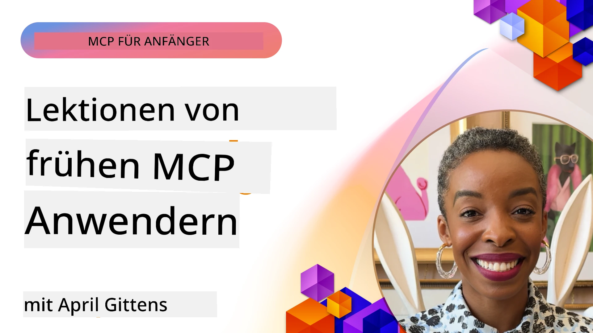

# 🌟 Erkenntnisse von Early Adopters

[](https://youtu.be/jds7dSmNptE)

_(Klicken Sie auf das Bild oben, um das Video zu dieser Lektion anzusehen)_

## 🎯 Was dieses Modul abdeckt

In diesem Modul wird untersucht, wie reale Organisationen und Entwickler das Model Context Protocol (MCP) nutzen, um tatsächliche Herausforderungen zu bewältigen und Innovationen voranzutreiben. Durch detaillierte Fallstudien, praktische Projekte und anschauliche Beispiele entdecken Sie, wie MCP eine sichere, skalierbare KI-Integration ermöglicht, die Sprachmodelle, Werkzeuge und Unternehmensdaten verbindet.

### 📚 Sehen Sie MCP in Aktion

Möchten Sie sehen, wie diese Prinzipien auf produktionsreife Werkzeuge angewendet werden? Schauen Sie sich unsere [**10 Microsoft MCP-Server an, die die Produktivität von Entwicklern verändern**](microsoft-mcp-servers.md) an, die reale Microsoft MCP-Server vorstellen, die Sie heute nutzen können.

## Überblick

Diese Lektion zeigt, wie Early Adopters das Model Context Protocol (MCP) genutzt haben, um reale Herausforderungen zu lösen und Innovationen in verschiedenen Branchen voranzutreiben. Durch detaillierte Fallstudien und praktische Projekte sehen Sie, wie MCP eine standardisierte, sichere und skalierbare KI-Integration ermöglicht – die große Sprachmodelle, Werkzeuge und Unternehmensdaten in einem einheitlichen Rahmen verbindet. Sie gewinnen praktische Erfahrungen im Entwurf und Bau von MCP-basierten Lösungen, lernen bewährte Implementierungsmuster kennen und entdecken Best Practices für den Einsatz von MCP in produktiven Umgebungen. Die Lektion hebt zudem aufkommende Trends, zukünftige Richtungen sowie Open-Source-Ressourcen hervor, um Ihnen zu helfen, an der Spitze der MCP-Technologie und deren sich entwickelndem Ökosystem zu bleiben.

## Lernziele

- Analysieren von realen MCP-Implementierungen in verschiedenen Branchen
- Entwerfen und Bauen vollständiger MCP-basierter Anwendungen
- Erkunden aufkommender Trends und zukünftiger Richtungen in der MCP-Technologie
- Anwenden von Best Practices in tatsächlichen Entwicklungsszenarien

## Reale MCP-Implementierungen

### Fallstudie 1: Automatisierung des Kundensupports in Unternehmen

Ein multinationales Unternehmen implementierte eine MCP-basierte Lösung, um die KI-Interaktionen in ihren Kundensupportsystemen zu standardisieren. Dadurch konnten sie:

- Eine einheitliche Schnittstelle für mehrere LLM-Anbieter schaffen
- Einheitliches Prompt-Management über Abteilungen hinweg gewährleisten
- Robuste Sicherheits- und Compliance-Kontrollen implementieren
- Einfach zwischen verschiedenen KI-Modellen je nach Bedarf wechseln

**Technische Umsetzung:**

```python
# Python MCP-Server-Implementierung für den Kundensupport
import logging
import asyncio
from modelcontextprotocol import create_server, ServerConfig
from modelcontextprotocol.server import MCPServer
from modelcontextprotocol.transports import create_http_transport
from modelcontextprotocol.resources import ResourceDefinition
from modelcontextprotocol.prompts import PromptDefinition
from modelcontextprotocol.tool import ToolDefinition

# Protokollierung konfigurieren
logging.basicConfig(level=logging.INFO)

async def main():
    # Serverkonfiguration erstellen
    config = ServerConfig(
        name="Enterprise Customer Support Server",
        version="1.0.0",
        description="MCP server for handling customer support inquiries"
    )
    
    # MCP-Server initialisieren
    server = create_server(config)
    
    # Wissensdatenbank-Ressourcen registrieren
    server.resources.register(
        ResourceDefinition(
            name="customer_kb",
            description="Customer knowledge base documentation"
        ),
        lambda params: get_customer_documentation(params)
    )
    
    # Prompt-Vorlagen registrieren
    server.prompts.register(
        PromptDefinition(
            name="support_template",
            description="Templates for customer support responses"
        ),
        lambda params: get_support_templates(params)
    )
    
    # Support-Tools registrieren
    server.tools.register(
        ToolDefinition(
            name="ticketing",
            description="Create and update support tickets"
        ),
        handle_ticketing_operations
    )
    
    # Server mit HTTP-Transport starten
    transport = create_http_transport(port=8080)
    await server.run(transport)

if __name__ == "__main__":
    asyncio.run(main())
```

**Ergebnisse:** 30 % Kostenreduktion bei Modellen, 45 % Verbesserung der Antwortkonsistenz und verbesserte Compliance in globalen Operationen.

### Fallstudie 2: Diagnostischer Assistent im Gesundheitswesen

Ein Gesundheitsdienstleister entwickelte eine MCP-Infrastruktur, um mehrere spezialisierte medizinische KI-Modelle zu integrieren und dabei den Schutz sensibler Patientendaten sicherzustellen:

- Nahtloses Umschalten zwischen allgemeinen und spezialisierten medizinischen Modellen
- Strenge Datenschutzkontrollen und Audit-Trails
- Integration mit bestehenden elektronischen Gesundheitsakten (EHR)
- Einheitliches Prompt-Engineering für medizinische Terminologie

**Technische Umsetzung:**

```csharp
// C# MCP host application implementation in healthcare application
using Microsoft.Extensions.DependencyInjection;
using ModelContextProtocol.SDK.Client;
using ModelContextProtocol.SDK.Security;
using ModelContextProtocol.SDK.Resources;

public class DiagnosticAssistant
{
    private readonly MCPHostClient _mcpClient;
    private readonly PatientContext _patientContext;
    
    public DiagnosticAssistant(PatientContext patientContext)
    {
        _patientContext = patientContext;
        
        // Configure MCP client with healthcare-specific settings
        var clientOptions = new ClientOptions
        {
            Name = "Healthcare Diagnostic Assistant",
            Version = "1.0.0",
            Security = new SecurityOptions
            {
                Encryption = EncryptionLevel.Medical,
                AuditEnabled = true
            }
        };
        
        _mcpClient = new MCPHostClientBuilder()
            .WithOptions(clientOptions)
            .WithTransport(new HttpTransport("https://healthcare-mcp.example.org"))
            .WithAuthentication(new HIPAACompliantAuthProvider())
            .Build();
    }
    
    public async Task<DiagnosticSuggestion> GetDiagnosticAssistance(
        string symptoms, string patientHistory)
    {
        // Create request with appropriate resources and tool access
        var resourceRequest = new ResourceRequest
        {
            Name = "patient_records",
            Parameters = new Dictionary<string, object>
            {
                ["patientId"] = _patientContext.PatientId,
                ["requestingProvider"] = _patientContext.ProviderId
            }
        };
        
        // Request diagnostic assistance using appropriate prompt
        var response = await _mcpClient.SendPromptRequestAsync(
            promptName: "diagnostic_assistance",
            parameters: new Dictionary<string, object>
            {
                ["symptoms"] = symptoms,
                patientHistory = patientHistory,
                relevantGuidelines = _patientContext.GetRelevantGuidelines()
            });
            
        return DiagnosticSuggestion.FromMCPResponse(response);
    }
}
```

**Ergebnisse:** Verbesserte diagnostische Vorschläge für Ärzte bei vollständiger HIPAA-Konformität und deutliche Reduzierung des Kontextwechsels zwischen Systemen.

### Fallstudie 3: Risikobewertung im Finanzdienstleistungssektor

Eine Finanzinstitution implementierte MCP, um ihre Risikobewertungsprozesse über verschiedene Abteilungen zu standardisieren:

- Einheitliche Schnittstelle für Kreditrisiko-, Betrugserkennungs- und Anlagerisikomodelle geschaffen
- Strenge Zugriffskontrollen und Modellversionierung implementiert
- Auditierbarkeit aller KI-Empfehlungen sichergestellt
- Einheitliches Datenformat über diverse Systeme hinweg beibehalten

**Technische Umsetzung:**

```java
// Java MCP-Server für Finanzrisikobewertung
import org.mcp.server.*;
import org.mcp.security.*;

public class FinancialRiskMCPServer {
    public static void main(String[] args) {
        // MCP-Server mit Funktionen zur finanziellen Compliance erstellen
        MCPServer server = new MCPServerBuilder()
            .withModelProviders(
                new ModelProvider("risk-assessment-primary", new AzureOpenAIProvider()),
                new ModelProvider("risk-assessment-audit", new LocalLlamaProvider())
            )
            .withPromptTemplateDirectory("./compliance/templates")
            .withAccessControls(new SOCCompliantAccessControl())
            .withDataEncryption(EncryptionStandard.FINANCIAL_GRADE)
            .withVersionControl(true)
            .withAuditLogging(new DatabaseAuditLogger())
            .build();
            
        server.addRequestValidator(new FinancialDataValidator());
        server.addResponseFilter(new PII_RedactionFilter());
        
        server.start(9000);
        
        System.out.println("Financial Risk MCP Server running on port 9000");
    }
}
```

**Ergebnisse:** Verbesserte regulatorische Compliance, 40 % schnellere Bereitstellungszyklen für Modelle und verbesserte Konsistenz der Risikobewertung in allen Abteilungen.

### Fallstudie 4: Microsoft Playwright MCP Server für Browser-Automatisierung

Microsoft entwickelte den [Playwright MCP-Server](https://github.com/microsoft/playwright-mcp), um eine sichere, standardisierte Browser-Automatisierung über das Model Context Protocol zu ermöglichen. Dieser produktionsreife Server erlaubt es KI-Agenten und LLMs, kontrolliert, prüfbar und erweiterbar mit Webbrowsern zu interagieren – für Anwendungsfälle wie automatisiertes Web-Testing, Datenextraktion und End-to-End-Workflows.

> **🎯 Produktionsreifes Tool**
> 
> Diese Fallstudie zeigt einen echten MCP-Server, den Sie heute nutzen können! Erfahren Sie mehr über den Playwright MCP Server und neun weitere produktionsreife Microsoft MCP-Server in unserem [**Microsoft MCP Servers Guide**](microsoft-mcp-servers.md#8--playwright-mcp-server).

**Hauptmerkmale:**
- Stellt Browser-Automatisierungsfunktionen (Navigation, Formularausfüllung, Screenshot-Erfassung usw.) als MCP-Werkzeuge bereit
- Implementiert strenge Zugriffskontrollen und Sandboxing, um unautorisierte Aktionen zu verhindern
- Bietet detaillierte Audit-Logs für alle Browser-Interaktionen
- Unterstützt Integration mit Azure OpenAI und anderen LLM-Anbietern für agentengetriebene Automatisierung
- Treibt die Web-Browsing-Fähigkeiten des GitHub Copilot Coding Agent an

**Technische Umsetzung:**

```typescript
// TypeScript: Registrierung der Playwright-Browser-Automatisierungstools in einem MCP-Server
import { createServer, ToolDefinition } from 'modelcontextprotocol';
import { launch } from 'playwright';

const server = createServer({
  name: 'Playwright MCP Server',
  version: '1.0.0',
  description: 'MCP server for browser automation using Playwright'
});

// Registriere ein Tool zum Navigieren zu einer URL und zum Erstellen eines Screenshots
server.tools.register(
  new ToolDefinition({
    name: 'navigate_and_screenshot',
    description: 'Navigate to a URL and capture a screenshot',
    parameters: {
      url: { type: 'string', description: 'The URL to visit' }
    }
  }),
  async ({ url }) => {
    const browser = await launch();
    const page = await browser.newPage();
    await page.goto(url);
    const screenshot = await page.screenshot();
    await browser.close();
    return { screenshot };
  }
);

// Starte den MCP-Server
server.listen(8080);
```

**Ergebnisse:**

- Ermöglichte sichere, programmatische Browser-Automatisierung für KI-Agenten und LLMs
- Reduzierte manuelle Testaufwände und verbesserte Testabdeckung für Webanwendungen
- Bietet ein wiederverwendbares, erweiterbares Framework für browserbasierte Werkzeugintegration in Unternehmensumgebungen
- Treibt die Web-Browsing-Fähigkeiten von GitHub Copilot an

**Quellen:**

- [Playwright MCP Server GitHub Repository](https://github.com/microsoft/playwright-mcp)
- [Microsoft KI- und Automationslösungen](https://azure.microsoft.com/en-us/products/ai-services/)

### Fallstudie 5: Azure MCP – Enterprise-taugliches Model Context Protocol als Service

Der Azure MCP Server ([https://aka.ms/azmcp](https://aka.ms/azmcp)) ist Microsofts verwaltete, enterprise-taugliche Implementierung des Model Context Protocol, die skalierbare, sichere und konforme MCP-Server-Fähigkeiten als Cloud-Service bereitstellt. Azure MCP ermöglicht Organisationen, MCP-Server schnell bereitzustellen, zu verwalten und mit Azure KI-, Daten- und Sicherheitsdiensten zu integrieren, wodurch der Betriebsaufwand reduziert und die KI-Einführung beschleunigt wird.

> **🎯 Produktionsreifes Tool**
> 
> Dies ist ein echter MCP-Server, den Sie heute nutzen können! Erfahren Sie mehr über den Microsoft Foundry MCP Server in unserem [**Microsoft MCP Servers Guide**](microsoft-mcp-servers.md).


- Vollständig verwaltetes MCP-Server-Hosting mit eingebauten Skalierungs-, Überwachungs- und Sicherheitsfunktionen
- Native Integration mit Azure OpenAI, Azure AI Search und weiteren Azure-Diensten
- Enterprise-Authentifizierung und -Autorisierung über Microsoft Entra ID
- Unterstützung für benutzerdefinierte Werkzeuge, Prompt-Vorlagen und Ressourcen-Connectoren
- Einhaltung von Unternehmenssicherheits- und regulatorischen Anforderungen

**Technische Umsetzung:**

```yaml
# Example: Azure MCP server deployment configuration (YAML)
apiVersion: mcp.microsoft.com/v1
kind: McpServer
metadata:
  name: enterprise-mcp-server
spec:
  modelProviders:
    - name: azure-openai
      type: AzureOpenAI
      endpoint: https://<your-openai-resource>.openai.azure.com/
      apiKeySecret: <your-azure-keyvault-secret>
  tools:
    - name: document_search
      type: AzureAISearch
      endpoint: https://<your-search-resource>.search.windows.net/
      apiKeySecret: <your-azure-keyvault-secret>
  authentication:
    type: EntraID
    tenantId: <your-tenant-id>
  monitoring:
    enabled: true
    logAnalyticsWorkspace: <your-log-analytics-id>
```

**Ergebnisse:**  
- Reduzierte Time-to-Value für Unternehmens-KI-Projekte durch Bereitstellung einer einsatzbereiten, konformen MCP-Serverplattform
- Vereinfachte Integration von LLMs, Werkzeugen und Unternehmensdatenquellen
- Erhöhte Sicherheit, Beobachtbarkeit und Betriebseffizienz für MCP-Workloads
- Verbesserte Codequalität mit Azure SDK Best Practices und aktuellen Authentifizierungsmustern

**Quellen:**  
- [Azure MCP Dokumentation](https://aka.ms/azmcp)
- [Azure MCP Server GitHub Repository](https://github.com/Azure/azure-mcp)
- [Azure KI-Dienste](https://azure.microsoft.com/en-us/products/ai-services/)
- [Microsoft MCP Center](https://mcp.azure.com)

## Fallstudie 6: NLWeb 
MCP (Model Context Protocol) ist ein aufkommendes Protokoll, mit dem Chatbots und KI-Assistenten mit Werkzeugen interagieren können. Jede NLWeb-Instanz ist auch ein MCP-Server, der eine Kernmethode unterstützt, ask, mit der in natürlicher Sprache Fragen an eine Website gestellt werden können. Die zurückgegebene Antwort nutzt schema.org, ein weit verbreitetes Vokabular zur Beschreibung von Webdaten. Grob gesagt ist MCP zu NLWeb, was HTTP zu HTML ist. NLWeb kombiniert Protokolle, schema.org-Formate und Beispielcode, um Websites schnell die Erstellung dieser Endpunkte zu ermöglichen, die sowohl Menschen durch konversationelle Schnittstellen als auch Maschinen durch natürliche Agent-zu-Agent-Interaktion zugutekommen.

NLWeb besteht aus zwei klar getrennten Komponenten.
- Ein Protokoll, sehr einfach zu starten, zur Schnittstelle mit einer Website in natürlicher Sprache und ein Format, das JSON und schema.org für die zurückgegebene Antwort nutzt. Siehe die Dokumentation zur REST-API für weitere Details.
- Eine unkomplizierte Umsetzung von (1), die bestehende Markups nutzt, für Websites, die als Listen von Elementen (Produkte, Rezepte, Attraktionen, Bewertungen usw.) abstrahiert werden können. Zusammen mit einer Reihe von Benutzeroberflächen-Widgets können Websites so einfach konversationelle Schnittstellen zu ihren Inhalten bereitstellen. Siehe die Dokumentation zum Lebenszyklus einer Chat-Anfrage für weitere Details zur Funktionsweise.
 
**Quellen:**  
- [Azure MCP Dokumentation](https://aka.ms/azmcp)
- [NLWeb](https://github.com/microsoft/NlWeb)

### Fallstudie 7: Microsoft Foundry MCP Server – Integration von Enterprise KI-Agenten

Microsoft Foundry MCP-Server zeigen, wie MCP genutzt werden kann, um KI-Agenten und Workflows in Unternehmensumgebungen zu orchestrieren und zu verwalten. Durch die Integration von MCP mit Microsoft Foundry können Organisationen Agenteninteraktionen standardisieren, Foundrys Workflow-Management nutzen und sichere, skalierbare Bereitstellungen gewährleisten.

> **🎯 Produktionsreifes Tool**
> 
> Dies ist ein echter MCP-Server, den Sie heute nutzen können! Erfahren Sie mehr über den Microsoft Foundry MCP Server in unserem [**Microsoft MCP Servers Guide**](microsoft-mcp-servers.md#9--microsoft-foundry-mcp-server).

**Hauptmerkmale:**
- Umfassender Zugriff auf das Azure AI-Ökosystem, einschließlich Modellkatalogen und Bereitstellungsmanagement
- Wissensindexierung mit Azure AI Search für RAG-Anwendungen
- Evaluierungswerkzeuge für KI-Modell-Leistung und Qualitätssicherung
- Integration mit Microsoft Foundry Catalog und Labs für bahnbrechende Forschungsmodelle
- Agentenmanagement- und Evaluierungsfunktionen für Produktionseinsätze

**Ergebnisse:**
- Schnelles Prototyping und robuste Überwachung von KI-Agenten-Workflows
- Nahtlose Integration mit Azure AI-Diensten für fortgeschrittene Szenarien
- Einheitliche Schnittstelle zum Erstellen, Bereitstellen und Überwachen von Agenten-Pipelines
- Verbesserte Sicherheit, Compliance und Betriebseffizienz für Unternehmen
- Beschleunigte KI-Einführung bei gleichzeitiger Kontrolle über komplexe agentengetriebene Prozesse

**Quellen:**
- [Microsoft Foundry MCP Server GitHub Repository](https://github.com/azure-ai-foundry/mcp-foundry)
- [Integration von Azure AI Agents mit MCP (Microsoft Foundry Blog)](https://devblogs.microsoft.com/foundry/integrating-azure-ai-agents-mcp/)

### Fallstudie 8: Foundry MCP Playground – Experimentieren und Prototyping

Der Foundry MCP Playground bietet eine einsatzbereite Umgebung zum Experimentieren mit MCP-Servern und Microsoft Foundry-Integrationen. Entwickler können schnell Prototypen erstellen, Modelle und Agenten-Workflows testen und bewerten, indem sie Ressourcen aus dem Microsoft Foundry Catalog und Labs nutzen. Der Playground vereinfacht die Einrichtung, stellt Beispielprojekte bereit und unterstützt kollaborative Entwicklung, wodurch Best Practices und neue Szenarien mit minimalem Aufwand erkundet werden können. Er ist besonders nützlich für Teams, die Ideen validieren, Experimente teilen und Lernen beschleunigen möchten, ohne komplexe Infrastruktur zu benötigen. Durch die Senkung der Einstiegshürden fördert der Playground Innovation und Gemeinschaftsbeiträge im MCP- und Microsoft Foundry-Ökosystem.

**Quellen:**

- [Foundry MCP Playground GitHub Repository](https://github.com/azure-ai-foundry/foundry-mcp-playground)

### Fallstudie 9: Microsoft Learn Docs MCP Server – KI-gestützter Dokumentationszugang

Der Microsoft Learn Docs MCP Server ist ein cloudbasierter Dienst, der KI-Assistenten Echtzeitzugriff auf offizielle Microsoft-Dokumentationen über das Model Context Protocol ermöglicht. Dieser produktionsreife Server verbindet sich mit dem umfassenden Microsoft Learn-Ökosystem und ermöglicht semantische Suchfunktionen über alle offiziellen Microsoft-Quellen.

> **🎯 Produktionsreifes Tool**
> 
> Dies ist ein echter MCP-Server, den Sie heute nutzen können! Erfahren Sie mehr über den Microsoft Learn Docs MCP Server in unserem [**Microsoft MCP Servers Guide**](microsoft-mcp-servers.md#1--microsoft-learn-docs-mcp-server).

**Hauptmerkmale:**
- Echtzeitzugriff auf offizielle Microsoft-Dokumentationen, Azure-Dokumentationen und Microsoft 365-Dokumentationen
- Erweiterte semantische Suchfunktionen, die Kontext und Intention verstehen
- Immer aktuelle Informationen, da Microsoft Learn-Inhalte veröffentlicht werden
- Umfassende Abdeckung von Microsoft Learn-, Azure- und Microsoft 365-Quellen
- Liefert bis zu 10 hochwertige Inhaltsabschnitte mit Artikeltiteln und URLs

**Warum es wichtig ist:**
- Löst das Problem des „veralteten KI-Wissens“ für Microsoft-Technologien
- Stellt sicher, dass KI-Assistenten Zugriff auf die neuesten .NET-, C#-, Azure- und Microsoft 365-Funktionen haben
- Bietet autoritative, primäre Informationen für präzise Codegenerierung
- Unverzichtbar für Entwickler, die mit schnell entwickelnden Microsoft-Technologien arbeiten

**Ergebnisse:**
- Deutlich verbesserte Genauigkeit von KI-generiertem Code für Microsoft-Technologien
- Reduzierte Suchzeiten für aktuelle Dokumentationen und Best Practices
- Verbesserte Entwicklerproduktivität durch kontextbewusste Dokumentationsabfragen
- Nahtlose Integration in Entwicklungs-Workflows ohne Verlassen der IDE

**Quellen:**
- [Microsoft Learn Docs MCP Server GitHub Repository](https://github.com/MicrosoftDocs/mcp)
- [Microsoft Learn Dokumentation](https://learn.microsoft.com/)

## Praktische Projekte

### Projekt 1: Aufbau eines Multi-Provider-MCP-Servers

**Ziel:** Erstellen Sie einen MCP-Server, der Anfragen basierend auf bestimmten Kriterien an mehrere KI-Modellanbieter weiterleiten kann.

**Anforderungen:**

- Unterstützung von mindestens drei verschiedenen Modellanbietern (z. B. OpenAI, Anthropic, lokale Modelle)
- Implementierung eines Routing-Mechanismus basierend auf Metadaten der Anfrage
- Erstellung eines Konfigurationssystems zur Verwaltung von Anbieteranmeldeinformationen
- Hinzufügen von Caching zur Optimierung von Leistung und Kosten
- Aufbau eines einfachen Dashboards zur Überwachung der Nutzung

**Implementierungsschritte:**

1. Einrichtung der grundlegenden MCP-Server-Infrastruktur
2. Implementierung von Anbieter-Adaptern für jeden KI-Modell-Service
3. Erstellung der Routing-Logik basierend auf Anfrageattributen
4. Hinzufügen von Caching-Mechanismen für häufige Anfragen
5. Entwicklung des Überwachungsdashboards
6. Testen mit verschiedenen Anfrage-Mustern

**Technologien:** Wählen Sie je nach Präferenz zwischen Python (.NET/Java/Python), Redis für Caching und einem einfachen Web-Framework für das Dashboard.

### Projekt 2: Unternehmensweites Prompt-Management-System

**Ziel:** Entwickeln Sie ein MCP-basiertes System zur Verwaltung, Versionierung und Bereitstellung von Prompt-Vorlagen innerhalb einer Organisation.

**Anforderungen:**


- Erstellen Sie ein zentrales Repository für Prompt-Vorlagen
- Implementieren Sie Versionierung und Genehmigungs-Workflows
- Bauen Sie Testmöglichkeiten für Vorlagen mit Beispiel-Eingaben auf
- Entwickeln Sie rollenbasierte Zugriffskontrollen
- Erstellen Sie eine API zum Abrufen und Bereitstellen von Vorlagen

**Implementierungsschritte:**

1. Entwerfen Sie das Datenbankschema für die Vorlagenspeicherung
2. Erstellen Sie die Kern-API für CRUD-Operationen bei Vorlagen
3. Implementieren Sie das Versionierungssystem
4. Bauen Sie den Genehmigungs-Workflow auf
5. Entwickeln Sie das Testframework
6. Erstellen Sie eine einfache Weboberfläche für das Management
7. Integrieren Sie einen MCP-Server

**Technologien:** Ihre Wahl an Backend-Framework, SQL- oder NoSQL-Datenbank und ein Frontend-Framework für die Verwaltungsoberfläche.

### Projekt 3: MCP-basierte Content-Generierungsplattform

**Ziel:** Aufbau einer Content-Generierungsplattform, die MCP nutzt, um konsistente Ergebnisse über verschiedene Content-Typen hinweg zu liefern.

**Anforderungen:**

- Unterstützung mehrerer Content-Formate (Blog-Posts, Social Media, Marketingtexte)
- Implementierung der vorlagenbasierten Generierung mit Anpassungsoptionen
- Aufbau eines Content-Review- und Feedbacksystems
- Verfolgung von Performance-Metriken des Contents
- Unterstützung von Content-Versionierung und Iteration

**Implementierungsschritte:**

1. Einrichtung der MCP-Client-Infrastruktur
2. Erstellung von Vorlagen für verschiedene Content-Typen
3. Aufbau der Content-Generierungspipeline
4. Implementierung des Review-Systems
5. Entwicklung des Metrik-Tracking-Systems
6. Erstellung einer Benutzeroberfläche für Vorlagenverwaltung und Content-Generierung

**Technologien:** Ihre bevorzugte Programmiersprache, Web-Framework und Datenbanksystem.

## Zukünftige Richtungen für MCP-Technologie

### Neue Trends

1. **Multi-modales MCP**
   - Erweiterung von MCP zur Standardisierung von Interaktionen mit Bild-, Audio- und Videomodellen
   - Entwicklung von cross-modalem Denkvermögen
   - Standardisierte Prompt-Formate für verschiedene Modalitäten

2. **Föderierte MCP-Infrastruktur**
   - Verteilte MCP-Netzwerke, die Ressourcen organisationsübergreifend teilen können
   - Standardisierte Protokolle für sichere Modellfreigabe
   - Datenschutzwahrende Berechnungstechniken

3. **MCP-Marktplätze**
   - Ökosysteme zum Teilen und Monetarisieren von MCP-Vorlagen und Plugins
   - Qualitätssicherungs- und Zertifizierungsprozesse
   - Integration mit Modell-Marktplätzen

4. **MCP für Edge Computing**
   - Anpassung der MCP-Standards für ressourcenbeschränkte Edge-Geräte
   - Optimierte Protokolle für Umgebungen mit geringer Bandbreite
   - Spezialisierte MCP-Implementierungen für IoT-Ökosysteme

5. **Regulatorische Rahmenwerke**
   - Entwicklung von MCP-Erweiterungen zur Einhaltung von Vorschriften
   - Standardisierte Audit-Trails und Schnittstellen zur Erklärbarkeit
   - Integration mit aufkommenden KI-Governance-Rahmenwerken

### MCP-Lösungen von Microsoft

Microsoft und Azure haben mehrere Open-Source-Repositories entwickelt, die Entwickler dabei unterstützen, MCP in verschiedenen Szenarien umzusetzen:

#### Microsoft-Organisation

1. [playwright-mcp](https://github.com/microsoft/playwright-mcp) - Ein Playwright MCP-Server für Browserautomatisierung und Tests
2. [files-mcp-server](https://github.com/microsoft/files-mcp-server) - Eine OneDrive MCP-Server-Implementierung für lokale Tests und Community-Mitwirkung
3. [NLWeb](https://github.com/microsoft/NlWeb) - NLWeb ist eine Sammlung offener Protokolle und zugehöriger Open-Source-Tools. Der Fokus liegt auf der Etablierung einer Basisschicht für das KI-Web

#### Azure-Samples-Organisation

1. [mcp](https://github.com/Azure-Samples/mcp) - Links zu Beispielen, Werkzeugen und Ressourcen für den Aufbau und die Integration von MCP-Servern auf Azure mit verschiedenen Sprachen
2. [mcp-auth-servers](https://github.com/Azure-Samples/mcp-auth-servers) - Referenz-MCP-Server, die die Authentifizierung mit der aktuellen Model Context Protocol-Spezifikation demonstrieren
3. [remote-mcp-functions](https://github.com/Azure-Samples/remote-mcp-functions) - Landingpage für Remote MCP-Server-Implementierungen in Azure Functions mit Links zu sprachspezifischen Repositories
4. [remote-mcp-functions-python](https://github.com/Azure-Samples/remote-mcp-functions-python) - Schnellstartvorlage für den Aufbau und die Bereitstellung benutzerdefinierter Remote MCP-Server mit Azure Functions in Python
5. [remote-mcp-functions-dotnet](https://github.com/Azure-Samples/remote-mcp-functions-dotnet) - Schnellstartvorlage für den Aufbau und die Bereitstellung benutzerdefinierter Remote MCP-Server mit Azure Functions in .NET/C#
6. [remote-mcp-functions-typescript](https://github.com/Azure-Samples/remote-mcp-functions-typescript) - Schnellstartvorlage für den Aufbau und die Bereitstellung benutzerdefinierter Remote MCP-Server mit Azure Functions in TypeScript
7. [remote-mcp-apim-functions-python](https://github.com/Azure-Samples/remote-mcp-apim-functions-python) - Azure API Management als AI-Gateway zu Remote MCP-Servern mit Python
8. [AI-Gateway](https://github.com/Azure-Samples/AI-Gateway) - APIM ❤️ AI-Experimente einschließlich MCP-Funktionalitäten, Integration mit Azure OpenAI und AI Foundry

Diese Repositories bieten verschiedene Implementierungen, Vorlagen und Ressourcen zur Arbeit mit dem Model Context Protocol in unterschiedlichen Programmiersprachen und Azure-Diensten. Sie decken eine Vielzahl von Anwendungsfällen ab, von grundlegenden Serverimplementierungen über Authentifizierung, Cloud-Bereitstellung bis hin zu Unternehmensintegrationen.

#### MCP-Resources-Verzeichnis

Das [MCP-Resources-Verzeichnis](https://github.com/microsoft/mcp/tree/main/Resources) im offiziellen Microsoft MCP-Repository bietet eine kuratierte Sammlung von Beispielressourcen, Prompt-Vorlagen und Werkzeugdefinitionen für den Einsatz mit Model Context Protocol-Servern. Dieses Verzeichnis soll Entwicklern helfen, schnell mit MCP zu starten, indem es wiederverwendbare Bausteine und Best-Practice-Beispiele bereitstellt für:

- **Prompt-Vorlagen:** Sofort einsatzbereite Prompt-Vorlagen für gängige KI-Aufgaben und Szenarien, die an eigene MCP-Serverimplementierungen angepasst werden können.
- **Werkzeugdefinitionen:** Beispiel-Werkzeugschemata und Metadaten zur Standardisierung der Werkzeugintegration und -aufruf über verschiedene MCP-Server hinweg.
- **Ressourcen-Beispiele:** Beispielhafte Ressourcen-Definitionen für die Anbindung an Datenquellen, APIs und externe Dienste innerhalb des MCP-Frameworks.
- **Referenzimplementierungen:** Praktische Beispiele, die zeigen, wie Ressourcen, Prompts und Werkzeuge in realen MCP-Projekten strukturiert und organisiert werden.

Diese Ressourcen beschleunigen die Entwicklung, fördern die Standardisierung und unterstützen die Einhaltung von Best Practices beim Aufbau und Einsatz von MCP-basierten Lösungen.

#### MCP-Resources-Verzeichnis

- [MCP Resources (Beispiel-Prompts, Werkzeuge und Ressourcen-Definitionen)](https://github.com/microsoft/mcp/tree/main/Resources)

### Forschungsansätze

- Effiziente Prompt-Optimierungstechniken innerhalb von MCP-Frameworks
- Sicherheitsmodelle für Mehrmandanten-MCP-Bereitstellungen
- Performance-Benchmarking verschiedener MCP-Implementierungen
- Formale Verifikationsmethoden für MCP-Server

## Fazit

Das Model Context Protocol (MCP) gestaltet schnell die Zukunft standardisierter, sicherer und interoperabler KI-Integrationen über Branchen hinweg. Durch die Fallstudien und praxisnahen Projekte in dieser Lektion haben Sie gesehen, wie frühe Anwender – darunter Microsoft und Azure – MCP nutzen, um reale Herausforderungen zu bewältigen, die KI-Einführung zu beschleunigen und Compliance, Sicherheit sowie Skalierbarkeit zu gewährleisten. Der modulare Ansatz von MCP ermöglicht Organisationen, große Sprachmodelle, Werkzeuge und Unternehmensdaten in einem einheitlichen, prüfbaren Rahmen zu verbinden. Während MCP sich weiterentwickelt, wird die aktive Beteiligung an der Community, die Nutzung von Open-Source-Ressourcen und die Anwendung bewährter Verfahren entscheidend sein, um robuste, zukunftssichere KI-Lösungen zu schaffen.

## Zusätzliche Ressourcen

- [MCP Foundry GitHub-Repository](https://github.com/azure-ai-foundry/mcp-foundry)
- [Foundry MCP Playground](https://github.com/azure-ai-foundry/foundry-mcp-playground)
- [Integration von Azure AI Agents mit MCP (Microsoft Foundry Blog)](https://devblogs.microsoft.com/foundry/integrating-azure-ai-agents-mcp/)
- [MCP GitHub-Repository (Microsoft)](https://github.com/microsoft/mcp)
- [MCP Resources-Verzeichnis (Beispiel-Prompts, Werkzeuge und Ressourcen-Definitionen)](https://github.com/microsoft/mcp/tree/main/Resources)
- [MCP Community & Dokumentation](https://modelcontextprotocol.io/introduction)
- [MCP-Spezifikation (2026-07-28)](https://modelcontextprotocol.io/specification/2026-07-28/)
- [Azure MCP-Dokumentation](https://aka.ms/azmcp)
- [OWASP MCP Top 10](https://microsoft.github.io/mcp-azure-security-guide/mcp/) - Sicherheits-Best-Practices
- [Playwright MCP Server GitHub-Repository](https://github.com/microsoft/playwright-mcp)
- [Files MCP Server (OneDrive)](https://github.com/microsoft/files-mcp-server)
- [Azure-Samples MCP](https://github.com/Azure-Samples/mcp)
- [MCP Auth Servers (Azure-Samples)](https://github.com/Azure-Samples/mcp-auth-servers)
- [Remote MCP Functions (Azure-Samples)](https://github.com/Azure-Samples/remote-mcp-functions)
- [Remote MCP Functions Python (Azure-Samples)](https://github.com/Azure-Samples/remote-mcp-functions-python)
- [Remote MCP Functions .NET (Azure-Samples)](https://github.com/Azure-Samples/remote-mcp-functions-dotnet)
- [Remote MCP Functions TypeScript (Azure-Samples)](https://github.com/Azure-Samples/remote-mcp-functions-typescript)
- [Remote MCP APIM Functions Python (Azure-Samples)](https://github.com/Azure-Samples/remote-mcp-apim-functions-python)
- [AI-Gateway (Azure-Samples)](https://github.com/Azure-Samples/AI-Gateway)
- [Microsoft AI- und Automatisierungslösungen](https://azure.microsoft.com/en-us/products/ai-services/)

## Übungen

1. Analysieren Sie eine der Fallstudien und schlagen Sie einen alternativen Implementierungsansatz vor.
2. Wählen Sie eine der Projektideen aus und erstellen Sie eine detaillierte technische Spezifikation.
3. Recherchieren Sie eine Branche, die in den Fallstudien nicht behandelt wird, und skizzieren Sie, wie MCP deren spezifische Herausforderungen adressieren könnte.
4. Erkunden Sie eine der Zukunftsrichtungen und entwerfen Sie ein Konzept für eine neue MCP-Erweiterung zur Unterstützung dieser Richtung.

## Was kommt als Nächstes

Erkunden Sie mehr: [Microsoft MCP-Server](./microsoft-mcp-servers.md)

Weiter zu: [Modul 8: Best Practices](../08-BestPractices/README.md)

---

<!-- CO-OP TRANSLATOR DISCLAIMER START -->
**Haftungsausschluss**:
Dieses Dokument wurde mit dem KI-Übersetzungsdienst [Co-op Translator](https://github.com/Azure/co-op-translator) übersetzt. Obwohl wir uns um Genauigkeit bemühen, beachten Sie bitte, dass automatisierte Übersetzungen Fehler oder Ungenauigkeiten enthalten können. Das Originaldokument in seiner Ursprungssprache gilt als maßgebliche Quelle. Bei kritischen Informationen wird eine professionelle menschliche Übersetzung empfohlen. Wir übernehmen keine Haftung für Missverständnisse oder Fehlinterpretationen, die aus der Verwendung dieser Übersetzung entstehen.
<!-- CO-OP TRANSLATOR DISCLAIMER END -->