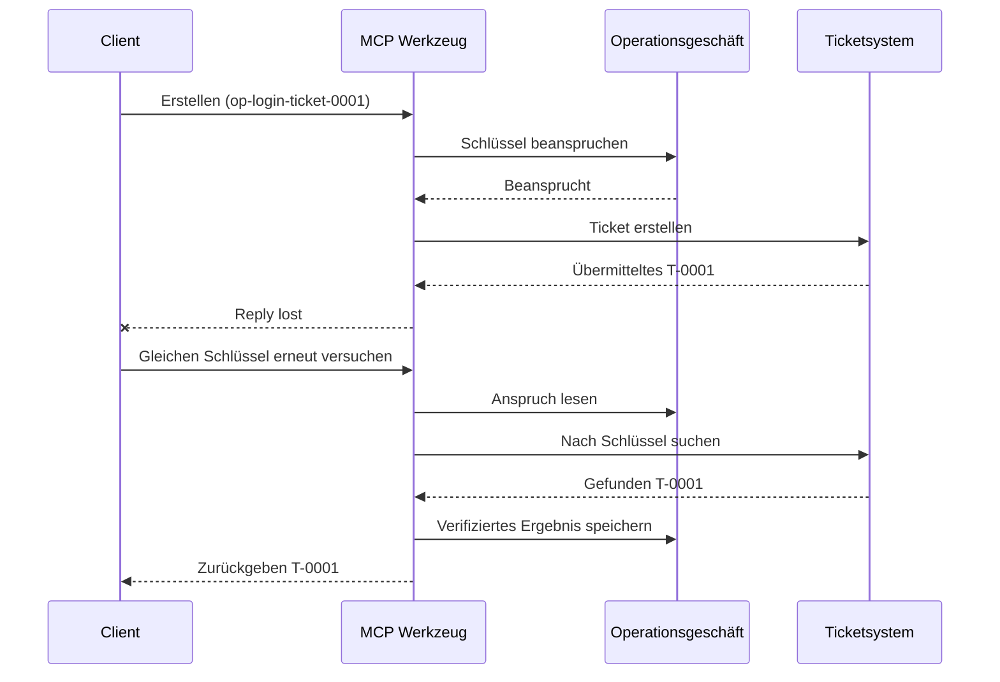
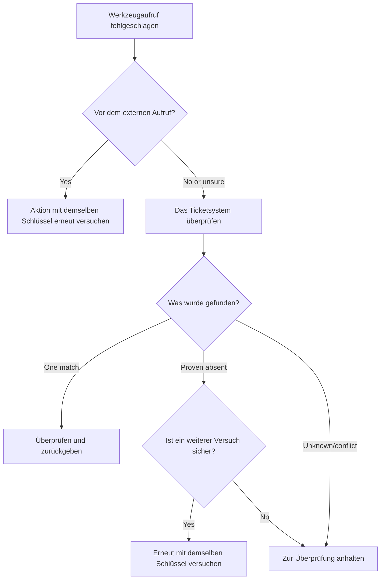

# Sichere Wiederholungen für MCP-Tools: Ein Zuverlässigkeits-Sidecar-Muster

Eine fehlende Antwort bedeutet nicht, dass die Aktion fehlt. Ein Support-Ticket-Tool
kann Ticket `T-0001` erstellen und dann die Verbindung verlieren, bevor der Client
das Ergebnis sieht. Wenn der Client blind erneut versucht, kann es `T-0002` erstellen.

Diese Lektion zeigt, wie man dieses unsichere Ergebnis erkennt, eine stabile
Identität für die beabsichtigte Aktion beibehält und das Ticket-System überprüft,
bevor ein weiterer Versuch gestartet wird. Die begleitende Python-Übung läuft lokal
mit der Standardbibliothek und SQLite.

## Warum ein Timeout "Ergebnis unbekannt" bedeutet

Angenommen, der Client ruft `create_support_ticket` mit dem Operationsschlüssel
`op-login-ticket-0001` auf:



Die Verbindung bricht ab, nachdem das Ticket bestätigt wurde, aber bevor das Ergebnis
eintrifft. Der Client weiß nur, dass die Antwort fehlt. Er weiß nicht, ob das
Ticket fehlt. Die Wiederverwendung des Operationsschlüssels ermöglicht es dem Tool,
`T-0001` zu finden und zurückzugeben, anstatt `T-0002` zu erstellen.

## Was ein Zuverlässigkeits-Sidecar tut

Ein Zuverlässigkeits-Sidecar ist Anwendungscode, der einen Recovery-Zustand um ein
Tool herum speichert. Es kann eine Bibliothek, Middleware, ein datenbankgestützter
Dienst oder einfach ein Teil der Tool-Implementierung sein. Es muss kein separater
Prozess sein und ist kein MCP-Protokollmerkmal.

Das Sidecar hat vier Aufgaben:

1. Die beabsichtigte Aktion speichern, bevor das externe System aufgerufen wird;
2. Nur einen Worker diese Aktion beanspruchen lassen;
3. Genug Zustand merken, um nach einem Absturz wiederherstellen zu können; und
4. Das externe System überprüfen, wenn das Ergebnis unsicher ist.

Diese Lektion zielt auf die finale MCP-Spezifikation `2026-07-28`. MCP hat keine
Protokoll-sitzungsebene, weshalb der Operationsschlüssel ein gewöhnliches Tool-Argument
ist, das durch dauerhaften Anwendungszustand gestützt wird. Dasselbe Muster funktioniert
auch mit früheren MCP-Versionen.

## Vier IDs, die verschiedene Probleme lösen

Diese Bezeichner hängen zusammen, sind aber nicht austauschbar:

| Bezeichner | Was er identifiziert | Übersteht einen Wiederholversuch? |
| --- | --- | --- |
| JSON-RPC ID | Eine Anfrage und Antwort | Nein; benutze eine neue Anfragen-ID |
| MCP-Task-ID | Eine langfristige Aufgabe | Ja; behalte sie für das Polling |
| Operationsschlüssel | Eine beabsichtigte Aktion | Ja; wiederverwenden für diese Aktion |
| Ticket-ID | Das gespeicherte Ergebnis | Ja; nach Überprüfung zurückgeben |

Fortschrittsbenachrichtigungen und Trace-Kontext helfen dabei, eine Anfrage zu beobachten.
Stornierung fordert auf, Arbeit zu stoppen. Keines davon verhindert ein doppeltes Ticket.

## Baue den Schutzmechanismus

Erstelle den Operationsschlüssel vor dem ersten Tool-Aufruf und speichere ihn mit dem
Workflow. Jeder Versuch, dasselbe beabsichtigte Ticket zu erstellen, verwendet denselben Schlüssel:

```json
{
  "operation_key": "op-login-ticket-0001",
  "title": "Cannot sign in"
}
```

Ein anders beabsichtigtes Ticket erhält einen neuen Schlüssel. In der Produktion sollte
ein undurchsichtiger, nicht erratbarer Wert generiert werden, anstatt Kundendaten in den Schlüssel zu setzen.

Hier ist das vollständige MCP-Tool-Schema, das in dieser Lektion verwendet wird:

```json
{
  "name": "create_support_ticket",
  "title": "Create support ticket",
  "description": "Creates or recovers one support ticket for an operation key.",
  "inputSchema": {
    "$schema": "https://json-schema.org/draft/2020-12/schema",
    "type": "object",
    "properties": {
      "operation_key": {
        "type": "string",
        "minLength": 16,
        "maxLength": 128,
        "description": "Stable key reused for the same intended action."
      },
      "title": {
        "type": "string",
        "minLength": 1,
        "maxLength": 200
      }
    },
    "required": ["operation_key", "title"],
    "additionalProperties": false
  },
  "outputSchema": {
    "$schema": "https://json-schema.org/draft/2020-12/schema",
    "type": "object",
    "properties": {
      "ticket_id": {
        "type": "string"
      },
      "operation_key": {
        "type": "string"
      },
      "status": {
        "type": "string",
        "const": "verified"
      }
    },
    "required": ["ticket_id", "operation_key", "status"],
    "additionalProperties": false
  }
}
```

Die authentifizierte Anruferidentität stammt aus dem Serverkontext, nicht aus den
modellgelieferten Tool-Eingaben. Scope jede gespeicherte Operation auf:

- diesen Anrufer, Mandanten oder Service-Konto;
- den Tool-Namen und die Version; und
- einen Hash der normalisierten Eingaben, die die externe Aktion definieren.

Der Eingabe-Hash beantwortet eine einfache Frage: „Fragt dieser Wiederholversuch nach demselben
Ticket?“ Wenn der Schlüssel bereits zu einem anderen Titel gehört, lehne den Aufruf ab.

Das Zurückgeben eines früheren Ergebnisses für eine geänderte Eingabe würde einen Vertragsfehler verbergen.

Speichern Sie den Anspruch mit einer einzigen atomaren Datenbankoperation. "Atomar" bedeutet, dass zwei Worker
nicht beide einen leeren Datensatz beobachten und beide Eigentümer werden können. Ein prozesslokaler
Lock reicht nicht aus, wenn eine andere Serverinstanz den erneuten Versuch empfangen kann.

Der Workflow erstellt den Schlüssel, während die Aktion `geplant` ist. Das Beispiel
speichert dann diese Zustände:

- `beansprucht`: ein Worker hat die Operation reserviert;
- `abgeschlossen`: das Ticketsystem hat ein Ergebnis zurückgegeben; und
- `verifiziert`: eine Abfrage des Ticketsystems bestätigt das Ergebnis.

Ein Absturz kann den gespeicherten Zustand auf `beansprucht` belassen, selbst nachdem das Ticket
erstellt wurde. Behandle jeden nicht abschließenden Anspruch als unsicher, bis externe Beweise dies klären.
Gehe nicht davon aus, dass `beansprucht` "nichts ist passiert" bedeutet.

## Wiederherstellen, bevor Sie es erneut versuchen

Wenn ein Tool-Aufruf fehlschlägt, entscheiden Sie, was bekannt ist, bevor Sie eine weitere externe
Schreiboperation senden:



Eine Validierung, die fehlschlägt, bevor die Ticket-API aufgerufen wird, ist ein bekannter Fehler.
Versuchen Sie eine unveränderte Aktion mit dem gleichen Operationsschlüssel erneut. Wenn die Korrektur der Eingabe
das beabsichtigte Ticket ändert, erstellen Sie einen neuen Schlüssel für diese neue Aktion.

Falls die Anfrage das Ticketsystem erreicht haben könnte, gleichen Sie es zuerst ab.
Abgleich bedeutet, den gespeicherten Anspruch mit dem autoritativen Ticketdatensatz zu vergleichen.
Geben Sie das bestehende Ticket zurück, wenn genau ein übereinstimmender Datensatz gefunden wird.
Versuchen Sie es nur erneut, wenn das Ticket eindeutig nicht vorhanden ist und der nachgelagerte Vertrag
einen weiteren Versuch zulässt.

"Nicht gefunden" ist nicht immer eindeutig. Ein Anbieter mit letztlich konsistenter
Suche benötigt möglicherweise ein begrenztes Warten und eine weitere Überprüfung. Wenn das System nicht
durchsuchbar ist, widersprüchliche Ergebnisse liefert oder einen weiteren Versuch nicht sicher deduplizieren kann,
stoppen Sie und melden Sie `Ergebnis unbekannt`. Das Anhalten hier wird manchmal "fail closed" genannt:
der Workflow weigert sich zu raten.

## Beweise, Aufgaben und Abbruch

Eine Tool-Antwort gibt an, was das Tool gemeldet hat. Ein gespeicherter Checkpoint gibt an, was der
Workflow aufgezeichnet hat. Der stärkste Beweis stammt von dem System, das
das Ergebnis besitzt: in diesem Beispiel eine Abfrage des Ticketsystems, das genau ein
passendes Ticket findet.

Ordnen Sie den Beweis dem Risiko zu. Eine Anbieter-Nachrichten-ID kann für eine
risikoarme Benachrichtigung ausreichen. Zahlungen, Bereitstellungen und zerstörerische Aktionen
benötigen möglicherweise Anbieterstatus, Ledger oder manuelle Überprüfungsbeweise.

Die MCP Tasks-Erweiterung ergänzt dieses Muster für lang laufende Arbeiten. Eine Task
ID ermöglicht es dem Client, das Polling nach einer Trennung fortzusetzen, aber sie identifiziert
oder dedupliziert das Ticket selbst nicht. Wenn Tasks verwendet wird, verbinden sich die Identitäten
folgendermaßen:

```text
operation key -> Task ID -> ticket ID -> verification evidence
```

Abbruch ist kooperativ, kein Rollback. Das Ticket kann auch nach der Bestätigung des Abbruchs
noch erstellt werden, sodass ein unsicheres Ergebnis weiterhin abgeglichen werden muss.


## Führen Sie die Failure-Injection-Übung durch

Das Beispiel verwendet zwei SQLite-Dateien: eine repräsentiert den Operation-Store und die
andere das externe Ticketsystem. Es gibt keine Transaktion, die beide Dateien umfasst.
Der Fehler wird eingefügt, nachdem das Ticket bestätigt ist, aber bevor der
Sidecar den Abschluss protokolliert.

Die direkte Python-Methode akzeptiert `caller_id` als Ersatz für den authentifizierten
Serverkontext. Fügen Sie `caller_id` nicht zum modellkontrollierten MCP-Eingabeschema hinzu.


Prognostizieren Sie das Ergebnis, bevor Sie die Tests ausführen:

| Pfad | Ergebnis nach erneutem Versuch | Anzahl der Tickets |
| --- | --- | --- |
| Blinder erneuter Versuch | Erstellt `T-0002` nach Verlust der Antwort für `T-0001` | 2 |

| Geschützter Retry | Findet und liefert `T-0001` | 1 |

Ausführen:

```bash
cd 08-BestPractices/reliability-sidecars/python
python -m unittest discover -p "test_*.py" -v
```

Die sechs Tests zeigen:

1. ein blinder Retry erzeugt ein Duplikat;
2. Antwortverlust plus Neustart holt ein Ticket aus einem dauerhaften Anspruch zurück;
3. ein verifizierter Retry nutzt das gespeicherte Ergebnis erneut;
4. geänderte Eingaben oder widersprüchliche externe Beweise werden abgelehnt;
5. ein bestehender Anspruch ohne externe Beweise stoppt sicher; und
6. gleichzeitige Ansprüche lassen einen Besitzer zu, ohne ein verifiziertes Ergebnis zu verschlechtern.

Öffne das Beispiel:

- [Python-Implementierung](../../../../08-BestPractices/reliability-sidecars/python/reliability_sidecar.py)
- [Deterministische Tests](../../../../08-BestPractices/reliability-sidecars/python/test_reliability_sidecar.py)

Das Beispiel lässt absichtlich veraltete Anspruchs-Leases weg. Eine produktive Übernahmepolitik
benötigt ein begrenztes Lease, atomaren Eigentumsübergang und eine weitere externe
Prüfung vor der Ausführung.

## Optionale Community-Implementierung

Agent Enhancer Utilities ist eine Community-Implementierung dieses
Anwendungsmusters auf Anwendungsebene. Deren Planer wählt einen Wiederherstellungsansatz aus, während das
Checkpoint den Zustand von Ansprüchen und unsicheren Ergebnissen festhält. Das Domain-Tool oder der MCP-
Server führt die echte Aktion weiterhin aus und verifiziert sie. Dieser Dienst ist nicht Teil der
MCP-Spezifikation und für diese Lektion nicht erforderlich.

| Konzept der Lektion | Agent Enhancer-Komponente | Wichtiges Limit |
| --- | --- | --- |
| Wiederherstellungsplan | `workflow-guard-planner` | Ruft das Domain-Tool nicht auf |
| Anspruch und Wiederherstellung | `workflow-checkpoint` | `external_proof` bleibt `false` |
| Exaktes Sidecar-Replay | `lab.invoke_tool` | Verwendet einen separaten Idempotenzschlüssel |
| Verifizierung der echten Aktion | Zielsuche/-rückgabe | Domain MCP besitzt sie |

Für einen exakten Retry eines Sidecar-Aufrufs akzeptiert `lab.invoke_tool` einen äußeren
`idempotency_key`. Dieser Schlüssel identifiziert den Sidecar-Aufruf; es ist nicht der
geschäftliche `operation_key`, der für das Ticket verwendet wird.

Der markierte öffentliche Vertrag und ein optionales Netzwerk-Beispiel sind verfügbar
hier:

- [Reliability Sidecar Contract v1](https://github.com/artiehinz/Agent-Enhancer-Utilities/blob/v1.6.0/docs/RELIABILITY_SIDECAR_CONTRACT_V1.md)
- [Planer- und Mock-Domain-Beispiel](https://github.com/artiehinz/Agent-Enhancer-Utilities/tree/v1.6.0/examples/reliability-sidecar)

Diese Links veranschaulichen das Anwendungsmuster. Sie behaupten nicht, dass der
gehostete Dienst der MCP `2026-07-28` entspricht, und der Checkpoint-Zustand gilt niemals
als externer Beweis für das Ticket.

## Produktions-Checkliste

- [ ] Erstellen und speichern Sie den Operationsschlüssel vor dem ersten externen Versuch.
- [ ] Binden Sie den Schlüssel an Aufrufer, Tool-Version und normalisierten Eingabe-Hash.
- [ ] Ablehnung geänderter Eingaben unter einem bestehenden Schlüssel.
- [ ] Zulassen eines Besitzers mittels atomarer Shared-Store-Operation.
- [ ] Weitergabe des Schlüssels an den nachgelagerten Anbieter, wenn dieser Idempotenz unterstützt.
- [ ] Abgleich unsicherer Ergebnisse vor einem weiteren Schreibvorgang.
- [ ] Bewahrung verifizierter Ergebnisse und Beweise über den gesamten Retry-Zeitraum.
- [ ] Stoppen zur Überprüfung, wenn das externe Ergebnis nicht sicher festgestellt werden kann.

## Referenzen

- [MCP-Spezifikation `2026-07-28`](https://modelcontextprotocol.io/specification/2026-07-28)
- [MCP `2026-07-28` Tool-Anleitung](https://modelcontextprotocol.io/specification/2026-07-28/server/tools)
- [MCP Tasks Erweiterung](https://modelcontextprotocol.io/extensions/tasks/overview)
- [JSON-RPC 2.0 Spezifikation](https://www.jsonrpc.org/specification)

---

<!-- CO-OP TRANSLATOR DISCLAIMER START -->
**Haftungsausschluss**:
Dieses Dokument wurde mit dem KI-Übersetzungsdienst [Co-op Translator](https://github.com/Azure/co-op-translator) übersetzt. Obwohl wir uns um Genauigkeit bemühen, beachten Sie bitte, dass automatisierte Übersetzungen Fehler oder Ungenauigkeiten enthalten können. Das Originaldokument in seiner Ursprungssprache gilt als maßgebliche Quelle. Bei kritischen Informationen wird eine professionelle menschliche Übersetzung empfohlen. Wir übernehmen keine Haftung für Missverständnisse oder Fehlinterpretationen, die aus der Verwendung dieser Übersetzung entstehen.
<!-- CO-OP TRANSLATOR DISCLAIMER END -->