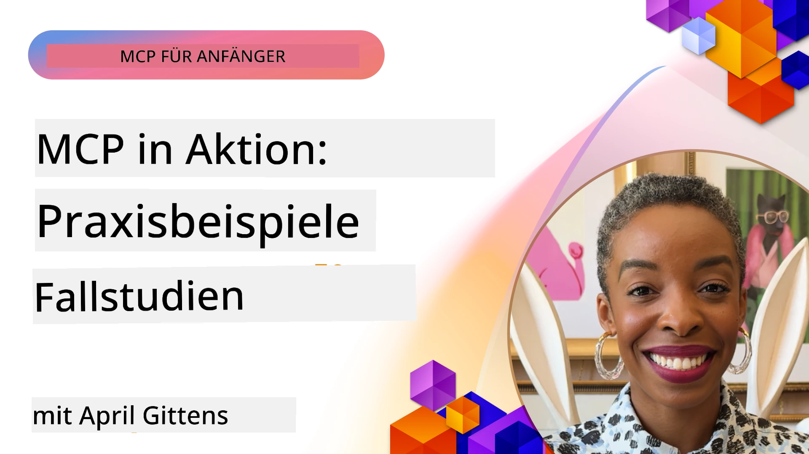

# MCP in Aktion: Praxisbeispiele

_(Klicken Sie auf das Bild oben, um das Video zu dieser Lektion anzusehen)_

Das Model Context Protocol (MCP) verändert die Art und Weise, wie KI-Anwendungen mit Daten, Werkzeugen und Diensten interagieren. Dieser Abschnitt präsentiert Praxisbeispiele, die den praktischen Einsatz von MCP in verschiedenen Unternehmensszenarien demonstrieren.

## Übersicht

Dieser Abschnitt zeigt konkrete Beispiele für MCP-Implementierungen und hebt hervor, wie Organisationen dieses Protokoll nutzen, um komplexe geschäftliche Herausforderungen zu bewältigen. Durch die Analyse dieser Fallstudien erhalten Sie Einblicke in die Vielseitigkeit, Skalierbarkeit und praktischen Vorteile von MCP in realen Situationen.

## Wichtige Lernziele

Durch die Erkundung dieser Fallstudien werden Sie:

- Verstehen, wie MCP angewandt werden kann, um spezifische Geschäftsprobleme zu lösen
- Verschiedene Integrationsmuster und Architekturansätze kennenlernen
- Best Practices für die Implementierung von MCP in Unternehmensumgebungen erkennen
- Einblicke in Herausforderungen und Lösungen bei realen Implementierungen gewinnen
- Möglichkeiten identifizieren, ähnliche Muster in eigenen Projekten anzuwenden

## Vorgestellte Fallstudien

### 1. [Azure AI Travel Agents – Referenzimplementierung](./travelagentsample.md)

Diese Fallstudie untersucht Microsofts umfassende Referenzlösung, die zeigt, wie man eine multi-agentenbasierte, KI-gestützte Reiseplanungsanwendung mit MCP, Azure OpenAI und Azure AI Search erstellt. Das Projekt zeigt:

- Mehragenten-Orchestrierung durch MCP
- Unternehmensdatenintegration mit Azure AI Search
- Sichere, skalierbare Architektur mit Azure-Diensten
- Erweiterbare Werkzeuge mit wiederverwendbaren MCP-Komponenten
- Konversationserlebnis mit Azure OpenAI

Die Architektur- und Implementierungsdetails bieten wertvolle Einblicke in den Aufbau komplexer Multi-Agenten-Systeme mit MCP als Koordinationsschicht.

### 2. [Aktualisieren von Azure DevOps-Elementen mit YouTube-Daten](./UpdateADOItemsFromYT.md)

Diese Fallstudie zeigt eine praktische Anwendung von MCP zur Automatisierung von Workflow-Prozessen. Sie demonstriert, wie MCP-Tools verwendet werden können, um:

- Daten von Online-Plattformen (YouTube) zu extrahieren
- Arbeitselemente in Azure DevOps-Systemen zu aktualisieren
- Wiederholbare Automatisierungs-Workflows zu erstellen
- Daten über verschiedene Systeme hinweg zu integrieren

Dieses Beispiel verdeutlicht, wie selbst relativ einfache MCP-Implementierungen erhebliche Effizienzsteigerungen durch die Automatisierung routinemäßiger Aufgaben und die Verbesserung der Datenkonsistenz über Systeme hinweg bieten können.

### 3. [Echtzeit-Dokumentenabruf mit MCP](./docs-mcp/README.md)

Diese Fallstudie führt Sie durch das Verbinden eines Python-Konsolen-Clients mit einem Model Context Protocol (MCP) Server, um Microsoft-Dokumentationen in Echtzeit, kontextbasiert abzurufen und zu protokollieren. Sie lernen, wie man:

- Mit einem Python-Client und dem offiziellen MCP SDK eine Verbindung zu einem MCP-Server herstellt
- Streaming-HTTP-Clients für effizienten, Echtzeit-Datenabruf verwendet
- Dokumentationstools auf dem Server aufruft und Antworten direkt in der Konsole protokolliert
- Aktuelle Microsoft-Dokumentationen in den Workflow integriert, ohne das Terminal zu verlassen

Das Kapitel enthält eine praktische Aufgabe, ein minimal funktionierendes Code-Beispiel und Links zu weiteren Ressourcen für ein tieferes Verständnis. Sehen Sie sich die vollständige Anleitung und den Code im verlinkten Kapitel an, um zu verstehen, wie MCP den Dokumentenzugriff und die Entwicklerproduktivität in konsolenbasierten Umgebungen revolutionieren kann.

### 4. [Interaktiver Studienplan-Generator Web-App mit MCP](./docs-mcp/README.md)

Diese Fallstudie zeigt, wie eine interaktive Webanwendung mit Chainlit und dem Model Context Protocol (MCP) erstellt werden kann, um personalisierte Studienpläne für jedes Thema zu generieren. Benutzer können ein Fach (z. B. "AI-900-Zertifizierung") und eine Studiendauer (z. B. 8 Wochen) angeben, und die App liefert eine wöchentliche Aufschlüsselung der empfohlenen Inhalte. Chainlit ermöglicht eine konversationelle Chat-Oberfläche, die das Erlebnis ansprechend und adaptiv macht.

- Konversationelle Web-App, betrieben von Chainlit
- Benutzerdefinierte Eingaben für Thema und Dauer
- Wöchentliche Inhalts-Empfehlungen mit MCP
- Echtzeit, adaptive Antworten in einer Chat-Oberfläche

Das Projekt veranschaulicht, wie konversationelle KI und MCP kombiniert werden können, um dynamische, nutzerorientierte Bildungstools in einer modernen Webumgebung zu schaffen.

### 5. [Dokumentation im Editor mit MCP Server in VS Code](./docs-mcp/README.md)

Diese Fallstudie zeigt, wie Microsoft Learn Docs direkt in die VS Code-Umgebung gebracht werden können, indem der MCP-Server verwendet wird – kein Wechsel mehr zwischen Browser-Tabs! Sie erfahren, wie man:

- Dokumentationen sofort im VS Code mit dem MCP-Panel oder der Kommandozeile durchsucht und liest
- Referenzdokumentationen anzeigt und Links direkt in README- oder Kurs-Markdown-Dateien einfügt
- GitHub Copilot und MCP zusammen für nahtlose, KI-gestützte Dokumentations- und Code-Workflows einsetzt
- Dokumentation mit Echtzeit-Feedback und von Microsoft stammender Genauigkeit validiert und verbessert
- MCP mit GitHub-Workflows für kontinuierliche Dokumentationsvalidierung integriert

Die Implementierung beinhaltet:

- Beispielkonfiguration `.vscode/mcp.json` für einfache Einrichtung
- Screenshot-gestützte Anleitungen zum Editor-Erlebnis
- Tipps zur Kombination von Copilot und MCP für maximale Produktivität

Dieses Szenario eignet sich ideal für Kursautoren, Dokumentationsschreiber und Entwickler, die sich beim Arbeiten mit Dokumentationen, Copilot und Validierungstools im Editor konzentrieren möchten – alles unterstützt durch MCP.

### 6. [Erstellung eines APIM MCP-Servers](./apimsample.md)

Diese Fallstudie bietet eine Schritt-für-Schritt-Anleitung zur Erstellung eines MCP-Servers mit Azure API Management (APIM). Sie behandelt:

- Einrichtung eines MCP-Servers in Azure API Management
- Veröffentlichung von API-Operationen als MCP-Tools
- Konfiguration von Richtlinien für Rate Limiting und Sicherheit
- Testen des MCP-Servers mit Visual Studio Code und GitHub Copilot

Dieses Beispiel zeigt, wie Azure-Fähigkeiten genutzt werden können, um einen robusten MCP-Server zu erstellen, der in verschiedenen Anwendungen verwendet wird und die Integration von KI-Systemen mit Unternehmens-APIs verbessert.

### 7. [GitHub MCP Registry — Beschleunigung agentischer Integration](https://github.com/mcp)

Diese Fallstudie untersucht, wie GitHubs MCP Registry, die im September 2025 gestartet wurde, eine kritische Herausforderung im KI-Ökosystem angeht: die fragmentierte Entdeckung und Bereitstellung von Model Context Protocol (MCP) Servern.

#### Übersicht
Die **MCP Registry** löst das wachsende Problem verstreuter MCP-Server über Repositories und Registries hinweg, das bisher Integration langsam und fehleranfällig machte. Diese Server ermöglichen KI-Agenten die Interaktion mit externen Systemen wie APIs, Datenbanken und Dokumentationsquellen.

#### Problemstellung
Entwickler, die agentische Workflows erstellen, sahen sich mehreren Herausforderungen gegenüber:
- **Schlechte Auffindbarkeit** von MCP-Servern über verschiedene Plattformen hinweg
- **Redundante Einrichtungssfragen**, die in Foren und Dokumentation verstreut sind
- **Sicherheitsrisiken** durch nicht verifizierte und nicht vertrauenswürdige Quellen
- **Mangel an Standardisierung** bei Serverqualität und Kompatibilität

#### Lösungsarchitektur
GitHubs MCP Registry zentralisiert vertrauenswürdige MCP-Server mit Schlüsselfunktionen:
- **Installieren mit einem Klick** Integration via VS Code für einfache Einrichtung
- **Signal-über-Rauschen Sortierung** nach Sternen, Aktivität und Community-Validierung
- **Direkte Integration** mit GitHub Copilot und anderen MCP-kompatiblen Tools
- **Offenes Beitragsmodell**, das sowohl Community- als auch Unternehmenspartner einbezieht

#### Geschäftliche Auswirkungen
Die Registry hat messbare Verbesserungen bewirkt:
- **Schnelleres Onboarding** für Entwickler mit Tools wie dem Microsoft Learn MCP Server, der offizielle Dokumentation direkt in Agenten streamt
- **Verbesserte Produktivität** durch spezialisierte Server wie `github-mcp-server`, die natürliche Sprachautomatisierung für GitHub (PR-Erstellung, CI-Neustarts, Code Scan) ermöglichen
- **Stärkeres Ökosystemvertrauen** durch kuratierte Listen und transparente Konfigurationsstandards

#### Strategischer Wert
Für Fachleute, die sich auf Agentenlebenszyklusmanagement und reproduzierbare Workflows spezialisieren, bietet die MCP Registry:
- **Modulare Agenteinsetzung** mit standardisierten Komponenten
- **Registry-gestützte Evaluierungspipelines** für konsistente Tests und Validierungen
- **Werkzeugübergreifende Interoperabilität** für nahtlose Integration verschiedener KI-Plattformen

Diese Fallstudie zeigt, dass die MCP Registry mehr als nur ein Verzeichnis ist – sie ist eine fundamentale Plattform für skalierbare, reale Modellintegration und agentische Systembereitstellung.

### 8. [Veröffentlichung in sozialen Netzwerken durch einen Agenten](./publora-social-publishing.md)

Diese Fallstudie führt durch einen **schreibfähigen Remote-MCP-Server** – einen, dessen Tools irreversible Aktionen im Namen eines Nutzers ausführen –, wobei die soziale Veröffentlichung als Praxisbeispiel dient. Ein Agent entwirft einen Beitrag, ein Mensch genehmigt ihn, und der Server plant die Veröffentlichung auf verschiedenen Netzwerken.

Interessant sind die Designbeschränkungen, die das Veröffentlichen mit sich bringt und die für jeden schreibenden Server gelten:

- **Offene Entdeckung, authentifizierte Ausführung** — `tools/list` wird ohne Anmeldedaten beantwortet, damit Registries und Clients introspektieren können, während jeder `tools/call` ein Token benötigt und sonst `401` mit einem `WWW-Authenticate`-Header zurückgibt
- **OAuth-Registrierung ohne Out-of-Band-Schritt** — dynamische Client-Registrierung heute, mit Client ID Metadata Documents als Richtung, auf die die Spezifikation vom `2026-07-28` zeigt
- **Tool-Anmerkungen** (`readOnlyHint`, `destructiveHint`, `idempotentHint`), die Clients nutzen, um zu entscheiden, was bestätigt werden muss — Hinweise statt Durchsetzung, und etwas, das Connector-Verzeichnisse inzwischen bei Reviews erwarten
- **Un-erfindbare Bezeichner**, sodass ein halluzinierter Wert laut scheitert, anstatt auf einen plausibel aussehenden zu reagieren
- **Idempotenz-Schlüssel bei den beitrags-erstellenden Tools**, damit ein erneuter Versuch während der Agentenlaufzeit keine doppelte Veröffentlichung wird
- **Ein im Werkzeugschema beschriebenes Noop-Ziel**, das den gesamten Schreibpfad durchläuft und nichts veröffentlicht, für Reviewer und CI

Das Kapitel schließt mit einer kurzen Checkliste, die Sie auf einen Server anwenden können, den Sie gerade entwickeln.

## Fazit

Diese acht umfassenden Fallstudien demonstrieren die bemerkenswerte Vielseitigkeit und praktischen Anwendungen des Model Context Protocols über verschiedene reale Szenarien hinweg. Von komplexen Multi-Agenten-Reiseplanungssystemen und Unternehmens-API-Management bis hin zu optimierten Dokumentations-Workflows und dem revolutionären GitHub MCP Registry zeigen diese Beispiele, wie MCP eine standardisierte, skalierbare Möglichkeit bietet, KI-Systeme mit den Werkzeugen, Daten und Diensten zu verbinden, die sie benötigen, um außergewöhnlichen Wert zu liefern.

Die Fallstudien erstrecken sich über mehrere Dimensionen der MCP-Implementierung:
- **Enterprise-Integration**: Azure API Management und Azure DevOps Automatisierung
- **Multi-Agenten-Orchestrierung**: Reiseplanung mit koordinierten KI-Agenten
- **Entwickler-Produktivität**: VS Code-Integration und Echtzeit-Dokumentationszugriff
- **Ökosystem-Entwicklung**: GitHubs MCP Registry als fundamentale Plattform
- **Bildungsanwendungen**: Interaktive Studienplan-Generatoren und konversationelle Interfaces

Beim Studium dieser Implementierungen erhalten Sie wichtige Einblicke in:
- **Architekturmuster** für verschiedene Größenordnungen und Anwendungsfälle
- **Implementierungsstrategien**, die Funktionalität mit Wartbarkeit ausbalancieren
- **Sicherheits- und Skalierbarkeitsaspekte** für Produktionsumgebungen
- **Best Practices** für MCP-Serverentwicklung und Client-Integration
- **Ökosystem-Denken** für den Aufbau vernetzter KI-gestützter Lösungen

Diese Beispiele zeigen zusammen, dass MCP nicht nur ein theoretisches Framework ist, sondern ein ausgereiftes, produktionsreifes Protokoll, das praktische Lösungen für komplexe Geschäftsherausforderungen ermöglicht. Egal, ob Sie einfache Automatisierungstools oder komplexe Multi-Agenten-Systeme entwickeln, die hier aufgezeigten Muster und Ansätze bieten eine solide Grundlage für Ihre eigenen MCP-Projekte.

## Weitere Ressourcen

- [Azure AI Travel Agents GitHub Repository](https://github.com/Azure-Samples/azure-ai-travel-agents)
- [Azure DevOps MCP Tool](https://github.com/microsoft/azure-devops-mcp)
- [Playwright MCP Tool](https://github.com/microsoft/playwright-mcp)
- [Microsoft Docs MCP Server](https://github.com/MicrosoftDocs/mcp)
- [GitHub MCP Registry — Beschleunigung agentischer Integration](https://github.com/mcp)
- [MCP Community Examples](https://github.com/microsoft/mcp)

## Was kommt als Nächstes

- Vorheriges: [Modul 8: Best Practices](../08-BestPractices/README.md)
- Nächstes: [Modul 10: Optimierung von AI-Workflows: Aufbau eines MCP-Servers mit AI Toolkit](../10-StreamliningAIWorkflowsBuildingAnMCPServerWithAIToolkit/README.md)

---

<!-- CO-OP TRANSLATOR DISCLAIMER START -->
**Haftungsausschluss**:
Dieses Dokument wurde mit dem KI-Übersetzungsdienst [Co-op Translator](https://github.com/Azure/co-op-translator) übersetzt. Obwohl wir uns um Genauigkeit bemühen, beachten Sie bitte, dass automatisierte Übersetzungen Fehler oder Ungenauigkeiten enthalten können. Das Originaldokument in seiner Ursprungssprache gilt als maßgebliche Quelle. Bei kritischen Informationen wird eine professionelle menschliche Übersetzung empfohlen. Wir übernehmen keine Haftung für Missverständnisse oder Fehlinterpretationen, die aus der Verwendung dieser Übersetzung entstehen.
<!-- CO-OP TRANSLATOR DISCLAIMER END -->