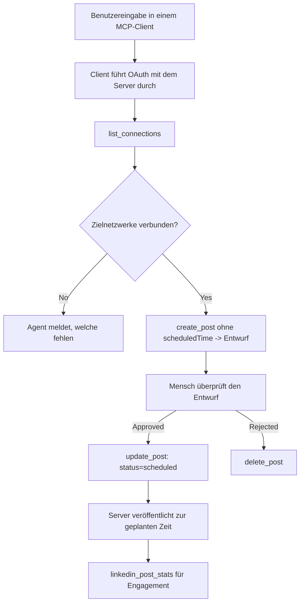

# Fallstudie: Veröffentlichung in sozialen Netzwerken aus einem Agenten mit einem Remote-MCP-Server

> **Haftungsausschluss:** Mehrere Dienste und Open-Source-Projekte können auf soziale Netzwerke veröffentlichen, und ein Team könnte auch die API jedes Netzwerks direkt integrieren. Das untenstehende Szenario wird als ein bearbeitetes Beispiel bereitgestellt, wie ein **schreibfähiger Remote-MCP-Server** gestaltet und genutzt werden kann. Publora ist ein kommerzieller Dienst mit einem kostenlosen Tarif; die hier beschriebenen Muster gelten für jeden MCP-Server, der irreversible Aktionen im Namen eines Nutzers ausführt.

## Überblick

Agenten sind gut im Entwerfen von Inhalten, aber schlecht darin, diese zu liefern. Ein Modell kann eine Release-Ankündigung in Sekunden schreiben, und dann endet die Arbeit: Veröffentlichen bedeutet eine API pro Netzwerk, eine OAuth-App pro Netzwerk und eine andere Menge an Medienregeln für jedes einzelne. Die meisten Teams lösen das, indem sie den Text per Hand in einen Browser kopieren.

Diese Fallstudie betrachtet, wie dieser letzte Schritt mit einem einzigen Remote-MCP-Server abgeschlossen wird und — nützlicher für alle, die einen bauen — welche Designentscheidungen ein **schreibfähiger** Server richtig treffen muss. Daten lesen ist verzeihlich. Veröffentlichen nicht: Ein falscher Werkzeugaufruf ist für ein Publikum sichtbar und kann nicht rückgängig gemacht werden.

## Szenario

Ein kleines Developer-Relations-Team entwirft Beiträge innerhalb eines Agenten (Claude, VS Code, Cursor — der Client ist egal). Sie wollen, dass der Agent:

- sieht, welche sozialen Konten das Team verbunden hat,
- einen Beitrag entwirft und als Entwurf speichert, um ihn von einem Menschen genehmigen zu lassen,
- ein Bild anhängt,
- ihn zu ausgewählten Netzwerken zu einem gewählten Zeitpunkt plant,
- und später berichtet, wie er sich entwickelt hat.

Wichtig ist, dass der Agent *nicht* versehentlich veröffentlichen kann, während sie noch experimentieren.

## Eingesetzte Werkzeuge

- [Publora MCP Server](https://github.com/publora/mcp-server) — ein Remote-MCP-Server (`streamable-http`), der Veröffentlichung, Planung, Medien- und LinkedIn-Analysewerkzeuge bereitstellt. Registriert im offiziellen MCP-Register als `com.publora/mcp-server`.

## Schritt-für-Schritt-Arbeitsablauf

1. **Verbinde den Server.** Clients, die OAuth sprechen, vollziehen den Autorisierungs-Code-Flow mit PKCE gegen den eigenen Zustimmungsbildschirm des Servers; Clients, die das nicht tun, z. B. headless CLIs, verwenden einen Publora-API-Schlüssel im Header. Beide Wege werden unterstützt, welcher genutzt wird, hängt vom Client ab, nicht vom Server.
2. **Verbindungen auflisten.** Der Agent ruft `list_connections` auf und erhält die verbundenen Konten mit deren Identifikatoren.
3. **Entwurf.** Der Agent ruft `create_post` *ohne* geplante Zeit auf. Der Beitrag wird als Entwurf gespeichert — nichts wird veröffentlicht.
4. **Medien anhängen.** Öffentliche Bild-URLs werden im gleichen Aufruf übergeben; der Server lädt sie herunter und überprüft sie.
5. **Planen.** Nach menschlicher Genehmigung setzt `update_post` den Status auf geplant mit einer ISO-8601-Zeit.
6. **Messen.** Für LinkedIn gibt `linkedin_post_stats` das Engagement zurück, sobald der Beitrag live ist.

## Beispielprompt

```text
Which social accounts do I have connected?
Draft a post announcing our new changelog page, attach the screenshot at
https://example.com/changelog.png, and keep it as a draft — do not publish it.
Once I approve, schedule it to LinkedIn and Bluesky for tomorrow at 09:00 UTC.
```

## Mermaid-Flussdiagramm



## Technische Implementierung

Die folgenden Erkenntnisse sind der übertragbare Teil dieser Fallstudie.

### Offene Entdeckung, authentifizierte Ausführung

`tools/list` wird ohne Anmeldeinformationen bereitgestellt; jeder `tools/call` benötigt ein Token und gibt sonst `401` mit einem `WWW-Authenticate`-Header zurück, der auf die Metadaten der geschützten Ressource verweist. (Der Server beantwortet auch ein nicht authentifiziertes `initialize`, das nur für Clients vor der Protokollversion `2026-07-28` relevant ist; diese Überarbeitung hat das Handshake vollständig entfernt.)

Diese Aufteilung ist in der Praxis wichtig. Register, Kataloge und Clients können die Werkzeugoberfläche — Namen, Schemata, Anmerkungen — introspektieren, ohne ein Geheimnis zu besitzen, während nichts anonym *ausgeführt* werden kann. Ein Server, der für `initialize` ein Token verlangt, ist für Werkzeuge effektiv unsichtbar; ein Server, der anonyme `tools/call` zulässt, ist eine Gefahr.

### Registrierung: dynamische Client-Registrierung und was sie ersetzt

Der Server gibt `/.well-known/oauth-protected-resource` und `/.well-known/oauth-authorization-server` bekannt und unterstützt den Autorisierungs-Code-Flow mit PKCE (`S256`), Refresh Tokens und **dynamische Client-Registrierung**.

Die dynamische Registrierung beseitigt den manuellen Schritt: Ohne sie braucht jeder Client eine vorab ausgestellte `client_id`, was für jeden neuen Client eine außervertragliche Anfrage an den Anbieter bedeutet.

Betrachte dies als Kompatibilitätsverhalten, nicht als Designvorlage. Die Überarbeitung vom `2026-07-28` der Spezifikation setzt die dynamische Client-Registrierung zugunsten von Client ID Metadata Documents außer Kraft, bei denen der Client ein Metadokument unter einer stabilen HTTPS-URL hostet und diese URL der `client_id` *ist*. DCR funktioniert vorerst weiterhin, aber ein heute gebauter Server sollte CIMD planen und DCR nur für ältere Clients behalten.

### Werkzeug-Anmerkungen sind keine Dekoration

Jedes Werkzeug trägt einen `title` und die anwendbaren Hinweise: `readOnlyHint`, `destructiveHint`, `idempotentHint`, `openWorldHint`.

Zwei Gründe, in sie zu investieren. Erstens verwenden Clients die Hinweise, um zu entscheiden, was sie mit dem Nutzer bestätigen — ein Client kann eine schreibgeschützte Abfrage automatisch ausführen und vor einer Löschung um Zustimmung bitten. Die Spezifikation macht ausdrücklich klar, dass Anmerkungen unzuverlässige Hinweise sind, keine Autorisierungsmechanismen: Sie bestimmen, was ein Client anzubieten versucht, stoppen aber nichts auf dem Server, der Server muss weiterhin seine eigenen Regeln durchsetzen. Zweitens verlangen die wichtigsten Connector-Verzeichnisse sie jetzt *für eine Überprüfung*; ein Server, dessen Werkzeuge keine Titel und Hinweise haben, wird zurückgewiesen, egal wie gut er funktioniert.

### Mache Kennungen nicht erratbar

Plattformkennungen sind undurchsichtige Strings, die von `list_connections` zurückgegeben werden, und die Schema-Beschreibung sagt explizit, dass sie wortwörtlich kopiert und nie erraten werden dürfen. Der Server lehnt alles andere ab.

Modelle sind fließende Rater. Jeder schreibfähige Server sollte annehmen, dass irgendwann eine Kennung halluziniert wird, und diesen Pfad früh und laut scheitern lassen, anstatt auf einen plausibel aussehenden Wert zu reagieren.

### Fehler vor dem Veröffentlichen mit einer umsetzbaren Meldung

Einige Netzwerke verweigern textbasierte Beiträge und verlangen ein Bild oder Video. Das wird überprüft, wenn der Beitrag geplant wird, und der Fehler nennt die Plattform und die fehlende Anforderung.

Ein Agent kann von „Instagram verlangt Medien – füge ein Bild oder Video an“ ohne eine weitere Rückfrage wieder herstellen. Von einem generischen `400` kann er das nicht.

### Mache Wiederholungsversuche sicher

Die beiden Werkzeuge, die Inhalte erzeugen, `create_post` und `update_post`, akzeptieren einen Idempotenzschlüssel: Wird dieser mit einer identischen Anfrage wiederverwendet, wird die ursprüngliche Antwort wiedergegeben, anstatt einen zweiten Beitrag zu erzeugen. Agenten-Laufzeiten versuchen es nach Zeitüberschreitungen erneut; ohne Idempotenz wird eine langsame Antwort zur doppelten Veröffentlichung. Die anderen Schreibwerkzeuge — Löschungen, Medien-Schritte, LinkedIn-Reaktionen und Kommentare — akzeptieren keinen solchen Schlüssel, daher sind Wiederholungen dort nicht automatisch sicher. Es ist nützlich zu wissen, welche der eigenen Mutation geschützt sind und welche nicht.

### Biete eine Möglichkeit, zu testen, die nichts veröffentlicht

Der Server akzeptiert ein reserviertes Ziel, `publora-playground`, das validiert und bestätigt wird wie ein echtes Ziel und dann verworfen wird — nichts erreicht ein Live-Konto. Es wird im Werkzeugschema selbst beschrieben, das jeder Client ohne Anmeldeinformationen lesen kann: Das Feld `platforms` von `create_post` dokumentiert es als „ein Verbindungstest-Ziel, das keine echte Verbindung benötigt — der Beitrag wird bestätigt und verworfen, nichts wird veröffentlicht“. Man ruft es auf, indem man es als einzigen Eintrag übergibt: `platforms: ["publora-playground"]`.

Dies stellte sich als eines der nützlichsten Details der gesamten Oberfläche heraus. Prüfer von Connector-Verzeichnissen, Mitwirkende und CI können den gesamten Schreibpfad Ende-zu-Ende ohne Risiko für ein echtes Publikum ausführen. Jeder MCP-Server mit irreversiblen Aktionen profitiert von einem dokumentierten No-Op-Ziel.

## Ergebnisse und Auswirkungen

- Der Veröffentlichungsschritt verlagerte sich vom Browser in dieselbe Konversation, in der der Inhalt geschrieben wird, und eine „Erst-Entwurf“-Gewohnheit hält einen Menschen in der Schleife. Sei präzise, was das bedeutet: Ein Entwurf ist eine Konvention, keine Grenze. Dasselbe Anmeldecredential kann planen oder veröffentlichen, sodass jeder, der ein echtes Genehmigungstor benötigt, dieses außerhalb der Werkzeugoberfläche einführen muss — separate Anmeldeinformationen oder eine Richtlinienebene vor dem Server.
- Netzwerkspezifische Unterschiede — Medienanforderungen, Threading, Antwortsteuerung — werden einmal im Server behandelt, anstatt in jedem Agenten, der mit ihm spricht.
- Derselbe Server unterstützt mehrere MCP-Clients ohne Arbeit pro Client, weil die Entdeckung offen und die Registrierung dynamisch ist.
- Die oben genannten Designbeschränkungen wurden ebenso sehr durch Connector-Verzeichnisprüfungen wie durch Nutzer geprägt: Anmerkungen, OAuth und ein sicheres Testziel wurden jeweils von mindestens einem davon gefordert.

## Referenzen

- [Publora MCP Server (Quelle)](https://github.com/publora/mcp-server)
- [Publora API und MCP-Dokumentation](https://docs.publora.com)
- [MCP Registry Eintrag: `com.publora/mcp-server`](https://registry.modelcontextprotocol.io/v0/servers?search=com.publora/mcp-server)
- [MCP Spezifikation — Autorisierung](https://modelcontextprotocol.io/specification/draft/basic/authorization)
- [MCP Spezifikation — Werkzeuganmerkungen](https://modelcontextprotocol.io/docs/concepts/tools)

## Was kommt als Nächstes

- Nimm einen MCP-Server, den du baust, und prüfe die drei günstigsten Verbesserungen hier: Anmerkungen bei jedem Werkzeug, einen Idempotenzschlüssel bei jedem Schreibvorgang und ein dokumentiertes No-Op-Ziel.
- Probiere die Aufteilung von offener Entdeckung: Rufe `tools/list` gegen einen öffentlichen Remote-Server ohne Anmeldeinformationen auf, dann rufe ein Werkzeug auf und inspiziere die `401`-Challenge.
- Überlege, was „Rückgängig machen“ für deine Domäne bedeutet. Veröffentlichung kennt Entwürfe und Löschung; wenn deine Aktionen kein Äquivalent haben, gehört die Bestätigung ins Werkzeugdesign, nicht in den Prompt.

---

<!-- CO-OP TRANSLATOR DISCLAIMER START -->
**Haftungsausschluss**:
Dieses Dokument wurde mit dem KI-Übersetzungsdienst [Co-op Translator](https://github.com/Azure/co-op-translator) übersetzt. Obwohl wir uns um Genauigkeit bemühen, beachten Sie bitte, dass automatisierte Übersetzungen Fehler oder Ungenauigkeiten enthalten können. Das Originaldokument in seiner Ursprungssprache gilt als maßgebliche Quelle. Bei kritischen Informationen wird eine professionelle menschliche Übersetzung empfohlen. Wir übernehmen keine Haftung für Missverständnisse oder Fehlinterpretationen, die aus der Verwendung dieser Übersetzung entstehen.
<!-- CO-OP TRANSLATOR DISCLAIMER END -->