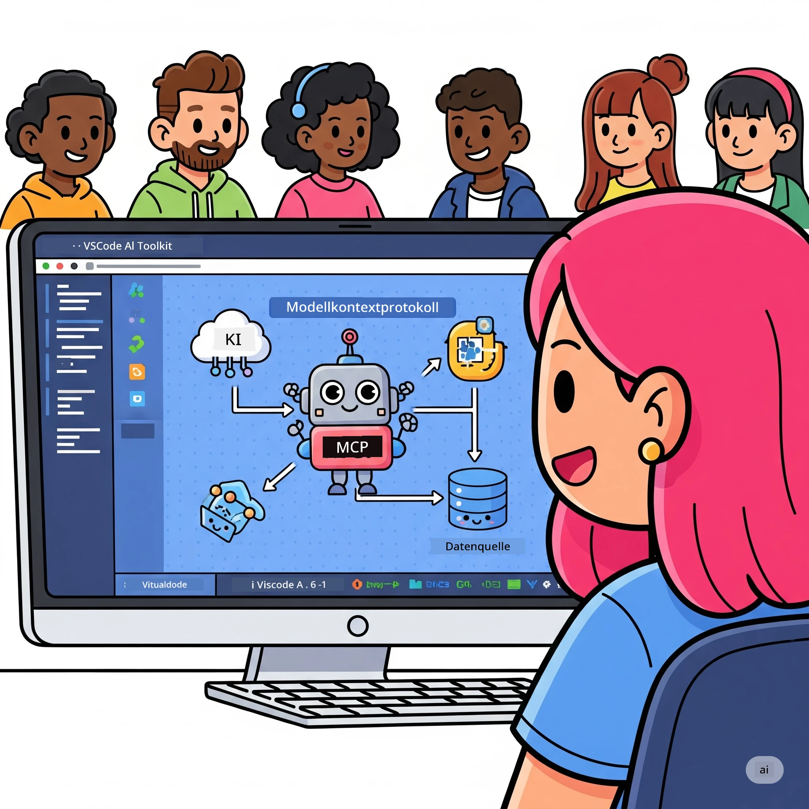
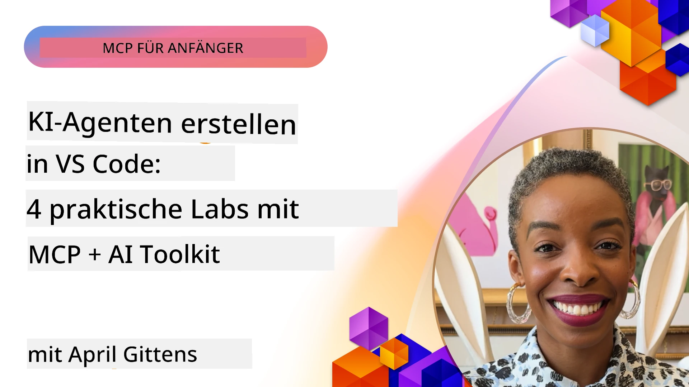

# Straffung von KI-Workflows: Aufbau eines MCP-Servers mit Microsoft Foundry Toolkit

## 🎯 Überblick

_(Klicken Sie auf das obige Bild, um das Video zu dieser Lektion anzusehen)_

Willkommen zum **Model Context Protocol (MCP) Workshop**! Dieser umfassende praktische Workshop kombiniert zwei bahnbrechende Technologien, um die KI-Anwendungsentwicklung zu revolutionieren:

> **Kompatibilitätshinweis:** Der Code des Workshops wurde mit MCP
> `2025-11-25` erstellt und getestet, wie durch das obige Abzeichen gezeigt. Verwenden Sie die
> [aktuelle `2026-07-28` Spezifikation](https://modelcontextprotocol.io/specification/2026-07-28/)
> für neue Protokollimplementierungen und überprüfen Sie die SDK-Versionhinweise vor der
> Migration der Labs.

- **🔗 Model Context Protocol (MCP)**: Ein offener Standard für nahtlose KI-Tool-Integration
- **🛠️ Microsoft Foundry Toolkit-Erweiterung für VS Code**: Microsofts leistungsstarke KI-Entwicklungserweiterung

### 🎓 Was Sie lernen werden

Am Ende dieses Workshops beherrschen Sie die Kunst, intelligente Anwendungen zu erstellen, die KI-Modelle mit realen Tools und Diensten verbinden. Von automatisierten Tests bis hin zu benutzerdefinierten API-Integrationen erhalten Sie praktische Fähigkeiten zur Lösung komplexer geschäftlicher Herausforderungen.

## 🏗️ Technologiestack

### 🔌 Model Context Protocol (MCP)

MCP ist das **„USB-C für KI“** – ein universeller Standard, der KI-Modelle mit externen Tools und Datenquellen verbindet.

**✨ Hauptmerkmale:**

- 🔄 **Standardisierte Integration**: Universelle Schnittstelle für KI-Tool-Verbindungen
- 🏛️ **Flexible Architektur**: Lokale & entfernte Server über stdio/SSE-Transport
- 🧰 **Reiches Ökosystem**: Tools, Prompts und Ressourcen in einem Protokoll
- 🔒 **Unternehmensbereit**: Eingebaute Sicherheit und Zuverlässigkeit

**🎯 Warum MCP wichtig ist:**
So wie USB-C das Kabelchaos beseitigt hat, beseitigt MCP die Komplexität von KI-Integrationen. Ein Protokoll, unendliche Möglichkeiten.

### 🤖 Microsoft Foundry Toolkit-Erweiterung für VS Code

Microsofts Flaggschiff-KI-Entwicklungserweiterung, die VS Code in eine KI-Powerhouse verwandelt.

**🚀 Kernfunktionen:**

- 📦 **Modellkatalog**: Zugriff auf Modelle von Azure AI, GitHub, Hugging Face, Ollama
- ⚡ **Lokale Inferenz**: ONNX-optimierte CPU/GPU/NPU-Ausführung
- 🏗️ **Agent Builder**: Visuelle KI-Agent-Entwicklung mit MCP-Integration
- 🎭 **Multimodal**: Unterstützung für Text, Vision und strukturierte Ausgaben

**💡 Entwicklungs-vorteile:**

- Zero-Config-Modellbereitstellung
- Visuelle Prompt-Entwicklung
- Echtzeit-Testspielplatz
- Nahtlose MCP-Server-Integration

## 📚 Lernreise

### [🚀 Modul 1: Grundlagen des Microsoft Foundry Toolkit](./lab1/README.md)

**Dauer**: 15 Minuten

- 🛠️ Installation und Konfiguration des Microsoft Foundry Toolkit für VS Code
- 🗂️ Erkundung des Modellkatalogs (100+ Modelle von GitHub, ONNX, OpenAI, Anthropic, Google)
- 🎮 Beherrschung des interaktiven Spielplatzes für Echtzeit-Modelltests
- 🤖 Erstellen Ihres ersten KI-Agenten mit Agent Builder
- 📊 Bewertung der Modellleistung mit eingebauten Metriken (F1, Relevanz, Ähnlichkeit, Kohärenz)
- ⚡ Lernen von Batch-Verarbeitung und multimodaler Unterstützung

**🎯 Lernergebnis**: Erstellen eines funktionalen KI-Agenten mit umfassendem Verständnis der Microsoft Foundry Toolkit-Fähigkeiten

### [🌐 Modul 2: MCP mit den Grundlagen des Microsoft Foundry Toolkit](./lab2/README.md)

**Dauer**: 20 Minuten

- 🧠 Beherrschung der Architektur und Konzepte des Model Context Protocol (MCP)
- 🌐 Erkundung des Microsoft MCP-Server-Ökosystems
- 🤖 Aufbau eines Browser-Automatisierungsagenten mit Playwright MCP-Server
- 🔧 Integration von MCP-Servern mit Microsoft Foundry Toolkit Agent Builder
- 📊 Konfiguration und Test von MCP-Tools innerhalb Ihrer Agenten
- 🚀 Export und Bereitstellung von MCP-gestützten Agenten für den Produktionseinsatz

**🎯 Lernergebnis**: Einsatz eines KI-Agenten, der mit externen Tools über MCP beschleunigt wird

### [🔧 Modul 3: Fortgeschrittene MCP-Entwicklung mit Microsoft Foundry Toolkit](./lab3/README.md)

**Dauer**: 20 Minuten

- 💻 Erstellen Sie benutzerdefinierte MCP-Server mit Microsoft Foundry Toolkit
- 🐍 Konfigurieren und Verwenden des neuesten MCP Python SDK (v1.9.3)
- 🔍 Einrichtung und Nutzung von MCP Inspector zum Debuggen
- 🛠️ Aufbau eines Wetter-MCP-Servers mit professionellem Debugging-Workflow
- 🧪 Debuggen von MCP-Servern sowohl in Agent Builder- als auch Inspector-Umgebungen

**🎯 Lernergebnis**: Entwicklung und Debugging von benutzerdefinierten MCP-Servern mit modernen Tools

### [🐙 Modul 4: Praktische MCP-Entwicklung – Benutzerdefinierter GitHub-Clone-Server](./lab4/README.md)

**Dauer**: 30 Minuten

- 🏗️ Aufbau eines realen GitHub Clone MCP-Servers für Entwicklungs-Workflows
- 🔄 Implementierung intelligenter Repository-Klonung mit Validierung und Fehlerbehandlung
- 📁 Erstellung intelligenter Verzeichnisverwaltung und VS Code-Integration
- 🤖 Nutzung des GitHub Copilot Agent-Modus mit benutzerdefinierten MCP-Tools
- 🛡️ Anwendung von produktionsbereiter Zuverlässigkeit und plattformübergreifender Kompatibilität

**🎯 Lernergebnis**: Bereitstellung eines produktionsbereiten MCP-Servers, der reale Entwicklungs-Workflows optimiert

## 💡 Anwendungen in der Praxis & Auswirkungen

### 🏢 Einsatzfälle in Unternehmen

#### 🔄 DevOps-Automatisierung

Transformieren Sie Ihren Entwicklungs-Workflow mit intelligenter Automatisierung:

- **Intelligente Repository-Verwaltung**: KI-gesteuerte Codeüberprüfung und Merge-Entscheidungen
- **Intelligente CI/CD**: Automatisierte Pipeline-Optimierung basierend auf Codeänderungen
- **Issue-Triage**: Automatische Fehlerklassifikation und -zuweisung

#### 🧪 Revolution in der Qualitätssicherung

Verfeinern Sie das Testen mit KI-gestützter Automatisierung:

- **Intelligente Testgenerierung**: Automatische Erstellung umfassender Testsuiten
- **Visuelles Regressionstesten**: KI-gestützte Erkennung von UI-Änderungen
- **Leistungsüberwachung**: Proaktive Fehlererkennung und -behebung

#### 📊 Intelligenz von Datenpipelines

Bauen Sie intelligentere Datenverarbeitungs-Workflows auf:

- **Adaptive ETL-Prozesse**: Selbstoptimierende Datenumwandlungen
- **Anomalieerkennung**: Echtzeitüberwachung der Datenqualität
- **Intelligentes Routing**: Smarte Steuerung des Datenflusses

#### 🎧 Verbesserung der Kundenerfahrung

Schaffen Sie außergewöhnliche Kundeninteraktionen:

- **Kontextbewusste Unterstützung**: KI-Agenten mit Zugriff auf Kundendaten
- **Proaktive Problemlösung**: Vorausschauender Kundenservice
- **Multi-Channel-Integration**: Einheitliches KI-Erlebnis über verschiedene Plattformen

## 🛠️ Voraussetzungen & Einrichtung

### 💻 Systemanforderungen

| Komponente | Anforderung | Hinweise |
|-----------|-------------|----------|
| **Betriebssystem** | Windows 10+, macOS 10.15+, Linux | Beliebiges modernes OS |
| **Visual Studio Code** | Neueste stabile Version | Erforderlich für Microsoft Foundry Toolkit |
| **Node.js** | v18.0+ und npm | Für die MCP-Server-Entwicklung |
| **Python** | 3.10+ | Optional für Python MCP-Server |
| **Arbeitsspeicher** | Mindestens 8 GB RAM | 16 GB empfohlen für lokale Modelle |

### 🔧 Entwicklungsumgebung

#### Empfohlene VS Code-Erweiterungen

- **Microsoft Foundry Toolkit** (ms-windows-ai-studio.windows-ai-studio)
- **Python** (ms-python.python)
- **Python Debugger** (ms-python.debugpy)
- **GitHub Copilot** (GitHub.copilot) – Optional, aber hilfreich

#### Optionale Tools

- **uv**: Moderner Python-Paketmanager
- **MCP Inspector**: Visuelles Debugging-Tool für MCP-Server
- **Playwright**: Für Web-Automatisierungsbeispiele

## 🎖️ Lernergebnisse & Zertifizierungspfad

### 🏆 Checkliste für Kompetenzbeherrschung

Durch den Abschluss dieses Workshops erreichen Sie Expertise in:

#### 🎯 Kernkompetenzen

- [ ] **MCP-Protokoll-Beherrschung**: Tiefes Verständnis der Architektur und Implementierungsmuster
- [ ] **Microsoft Foundry Toolkit-Kompetenz**: Expertenniveau in der Verwendung des Microsoft Foundry Toolkit für schnelle Entwicklung
- [ ] **Benutzerdefinierte Serverentwicklung**: Erstellen, Bereitstellen und Warten von produktionsreifen MCP-Servern
- [ ] **Exzellente Tool-Integration**: Nahtlose Verbindung von KI mit bestehenden Entwicklungsworkflows
- [ ] **Anwendung von Problemlösungen**: Anwendung der erlernten Fähigkeiten auf reale geschäftliche Herausforderungen

#### 🔧 Technische Fähigkeiten

- [ ] Einrichtung und Konfiguration von Microsoft Foundry Toolkit in VS Code
- [ ] Entwurf und Umsetzung benutzerdefinierter MCP-Server
- [ ] Integration von GitHub-Modellen in die MCP-Architektur
- [ ] Aufbau automatisierter Testworkflows mit Playwright
- [ ] Bereitstellung von KI-Agenten für den Produktionseinsatz
- [ ] Debugging und Optimierung der MCP-Server-Leistung

#### 🚀 Erweiterte Fähigkeiten

- [ ] Architektur von unternehmensweiten KI-Integrationen
- [ ] Implementierung von Sicherheitsbest Practices für KI-Anwendungen
- [ ] Entwurf skalierbarer MCP-Server-Architekturen
- [ ] Erstellung benutzerdefinierter Werkzeugketten für spezifische Bereiche
- [ ] Mentoring anderer in KI-nativer Entwicklung

## 📖 Zusätzliche Ressourcen

- [MCP-Spezifikation (2026-07-28)](https://modelcontextprotocol.io/specification/2026-07-28/)
- [Microsoft Foundry Toolkit GitHub Repository](https://github.com/microsoft/vscode-ai-toolkit)
- [MCP Servers Sammlung](https://github.com/modelcontextprotocol/servers)
- [Best Practices Leitfaden](https://modelcontextprotocol.io/docs/best-practices)
- [OWASP MCP Top 10](https://microsoft.github.io/mcp-azure-security-guide/mcp/) – Sicherheitsempfehlungen

---

**🚀 Bereit, Ihren KI-Entwicklungsworkflow zu revolutionieren?**

Lassen Sie uns gemeinsam die Zukunft intelligenter Anwendungen mit MCP und Microsoft Foundry Toolkit gestalten!

## Was kommt als Nächstes

Weiter zu: [Modul 11: MCP Server Hands-On Labs](../11-MCPServerHandsOnLabs/README.md)

---

<!-- CO-OP TRANSLATOR DISCLAIMER START -->
**Haftungsausschluss**:
Dieses Dokument wurde mit dem KI-Übersetzungsdienst [Co-op Translator](https://github.com/Azure/co-op-translator) übersetzt. Obwohl wir uns um Genauigkeit bemühen, beachten Sie bitte, dass automatisierte Übersetzungen Fehler oder Ungenauigkeiten enthalten können. Das Originaldokument in seiner Ursprungssprache gilt als maßgebliche Quelle. Bei kritischen Informationen wird eine professionelle menschliche Übersetzung empfohlen. Wir übernehmen keine Haftung für Missverständnisse oder Fehlinterpretationen, die aus der Verwendung dieser Übersetzung entstehen.
<!-- CO-OP TRANSLATOR DISCLAIMER END -->