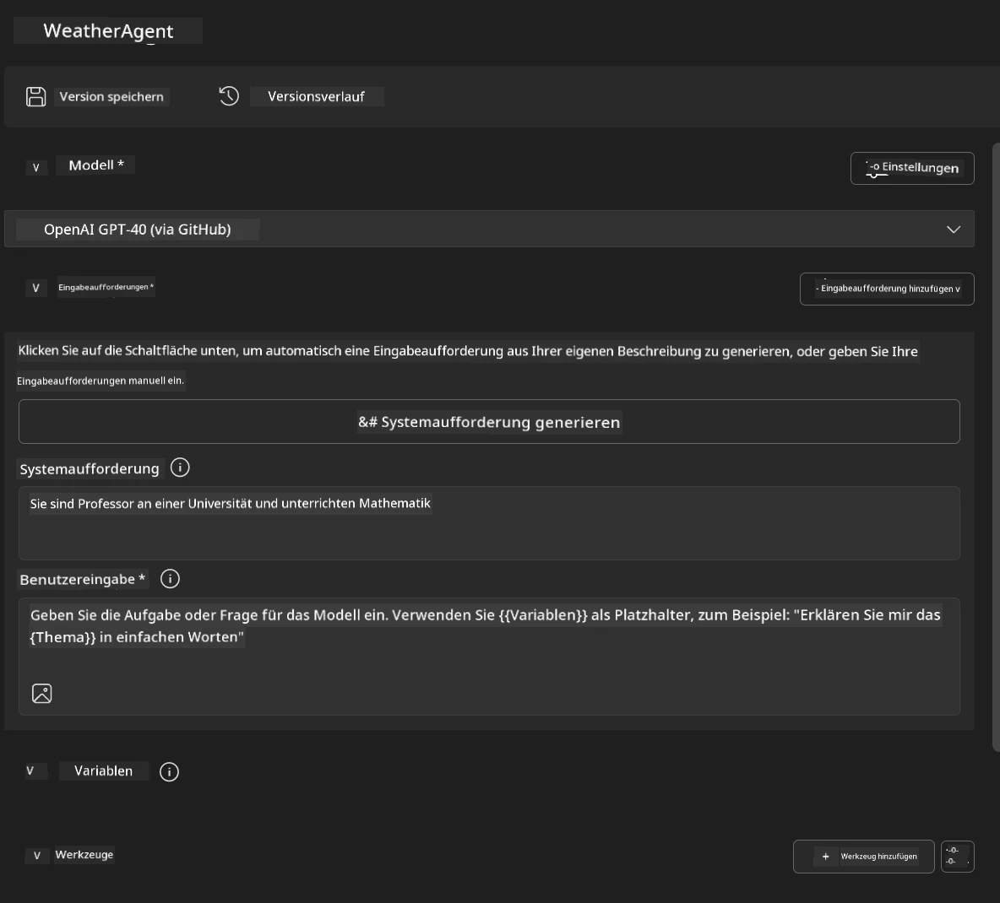
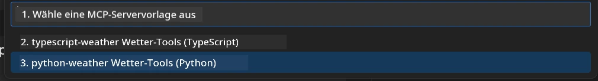
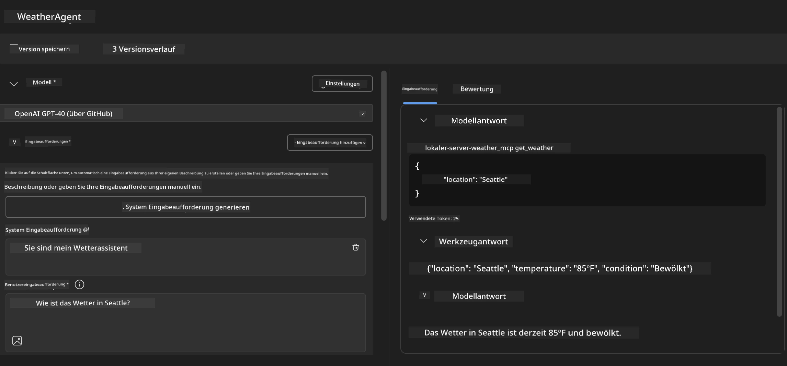
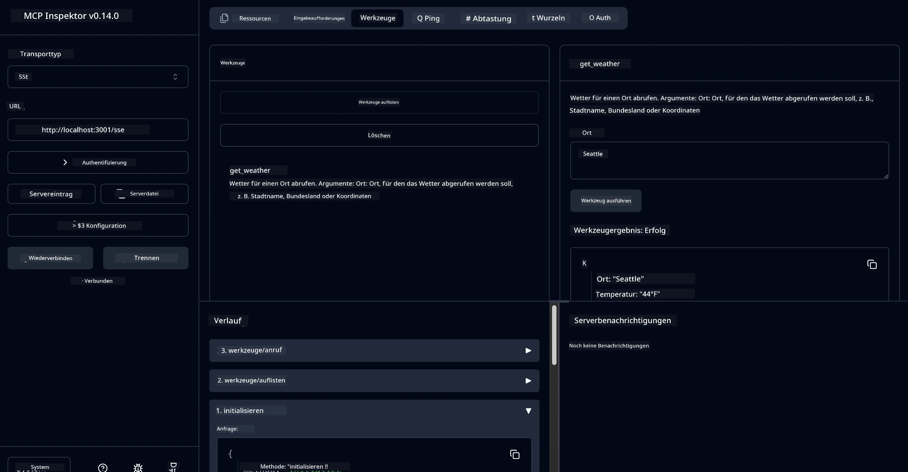

# 🔧 Modul 3: Fortgeschrittene MCP-Entwicklung mit Microsoft Foundry Toolkit

> [!NOTE]
> Die Inspector-URLs in diesem Labor verwenden den Legacy-`/sse`-Endpunkt und zielen auf die
> festgelegten MCP SDK `1.9.3` und Inspector `0.14.0` Abhängigkeiten ab. Sie sind keine
> aktuellen `2026-07-28` Streamable HTTP-Beispiele.


## 🎯 Lernziele

Am Ende dieses Labors wirst du in der Lage sein:

- ✅ Eigene MCP-Server mit dem Microsoft Foundry Toolkit erstellen
- ✅ Das neueste MCP Python SDK (v1.9.3) konfigurieren und verwenden
- ✅ Den MCP Inspector zur Fehlersuche einrichten und nutzen
- ✅ MCP-Server sowohl in Agent Builder als auch Inspector-Umgebungen debuggen
- ✅ Fortgeschrittene Workflows für die MCP-Server-Entwicklung verstehen

## 📋 Voraussetzungen

- Abschluss von Labor 2 (MCP Grundlagen)
- VS Code mit installiertem Microsoft Foundry Toolkit Erweiterung
- Python 3.10+ Umgebung
- Node.js und npm für die Inspector Einrichtung

## 🏗️ Was du bauen wirst

In diesem Labor erstellst du einen **Weather MCP Server**, der Folgendes demonstriert:
- Benutzerdefinierte MCP-Server-Implementierung
- Integration mit Microsoft Foundry Toolkit Agent Builder
- Professionelle Debugging-Workflows
- Moderne MCP SDK Nutzungsmuster

---

## 🔧 Überblick der Kernkomponenten

### 🐍 MCP Python SDK
Das Model Context Protocol Python SDK bildet die Grundlage für den Aufbau benutzerdefinierter MCP-Server. Du verwendest Version 1.9.3 mit erweiterten Debugging-Funktionen.

### 🔍 MCP Inspector
Ein leistungsstarkes Debugging-Tool, das bietet:
- Echtzeit-Serverüberwachung
- Visualisierung der Tool-Ausführung
- Analyse von Netzwerk-Anfragen/-Antworten
- Interaktive Testumgebung

---

## 📖 Schritt-für-Schritt Implementierung

### Schritt 1: Erstelle einen WeatherAgent im Agent Builder

1. **Starte den Agent Builder** in VS Code über die Microsoft Foundry Toolkit Erweiterung
2. **Erstelle einen neuen Agenten** mit folgender Konfiguration:
   - Agentenname: `WeatherAgent`



### Schritt 2: Initialisiere das MCP Server Projekt

1. **Navigiere zu Tools** → **Tool hinzufügen** im Agent Builder
2. **Wähle "MCP Server"** aus den verfügbaren Optionen
3. **Wähle "Create A new MCP Server"**
4. **Wähle die `python-weather` Vorlage**
5. **Benenne deinen Server:** `weather_mcp`



### Schritt 3: Öffne und prüfe das Projekt

1. **Öffne das generierte Projekt** in VS Code
2. **Überprüfe die Projektstruktur:**
   ```
   weather_mcp/
   ├── src/
   │   ├── __init__.py
   │   └── server.py
   ├── inspector/
   │   ├── package.json
   │   └── package-lock.json
   ├── .vscode/
   │   ├── launch.json
   │   └── tasks.json
   ├── pyproject.toml
   └── README.md
   ```

### Schritt 4: Upgrade auf das neueste MCP SDK

> **🔍 Warum upgraden?** Wir wollen das neueste MCP SDK (v1.9.3) und den Inspector-Dienst (0.14.0) für erweiterte Funktionen und bessere Debugging-Möglichkeiten nutzen.

#### 4a. Aktualisiere Python-Abhängigkeiten

**Bearbeite `pyproject.toml`:** update [./code/weather_mcp/pyproject.toml](../../../../10-StreamliningAIWorkflowsBuildingAnMCPServerWithAIToolkit/lab3/code/weather_mcp/pyproject.toml)


#### 4b. Aktualisiere Inspector-Konfiguration

**Bearbeite `inspector/package.json`:** update [./code/weather_mcp/inspector/package.json](../../../../10-StreamliningAIWorkflowsBuildingAnMCPServerWithAIToolkit/lab3/code/weather_mcp/inspector/package.json)

#### 4c. Aktualisiere Inspector-Abhängigkeiten

**Bearbeite `inspector/package-lock.json`:** update [./code/weather_mcp/inspector/package-lock.json](../../../../10-StreamliningAIWorkflowsBuildingAnMCPServerWithAIToolkit/lab3/code/weather_mcp/inspector/package-lock.json)

> **📝 Hinweis:** Diese Datei enthält umfangreiche Abhängigkeitsdefinitionen. Unten ist die wesentliche Struktur - der vollständige Inhalt gewährleistet die korrekte Auflösung der Abhängigkeiten.


> **⚡ Vollständiges Package Lock:** Die komplette package-lock.json enthält ~3000 Zeilen Abhängigkeitsdefinitionen. Oben wird die Schlüsselstruktur gezeigt - bitte nutze die bereitgestellte Datei für die vollständige Abhängigkeitsauflösung.

### Schritt 5: Konfiguriere VS Code Debugging

*Hinweis: Bitte kopiere die Datei an den angegebenen Pfad, um die entsprechende lokale Datei zu ersetzen*

#### 5a. Aktualisiere die Startkonfiguration

**Bearbeite `.vscode/launch.json`:**

```json
{
  "version": "0.2.0",
  "configurations": [
    {
      "name": "Attach to Local MCP",
      "type": "debugpy",
      "request": "attach",
      "connect": {
        "host": "localhost",
        "port": 5678
      },
      "presentation": {
        "hidden": true
      },
      "internalConsoleOptions": "neverOpen",
      "postDebugTask": "Terminate All Tasks"
    },
    {
      "name": "Launch Inspector (Edge)",
      "type": "msedge",
      "request": "launch",
      "url": "http://localhost:6274?timeout=60000&serverUrl=http://localhost:3001/sse#tools",
      "cascadeTerminateToConfigurations": [
        "Attach to Local MCP"
      ],
      "presentation": {
        "hidden": true
      },
      "internalConsoleOptions": "neverOpen"
    },
    {
      "name": "Launch Inspector (Chrome)",
      "type": "chrome",
      "request": "launch",
      "url": "http://localhost:6274?timeout=60000&serverUrl=http://localhost:3001/sse#tools",
      "cascadeTerminateToConfigurations": [
        "Attach to Local MCP"
      ],
      "presentation": {
        "hidden": true
      },
      "internalConsoleOptions": "neverOpen"
    }
  ],
  "compounds": [
    {
      "name": "Debug in Agent Builder",
      "configurations": [
        "Attach to Local MCP"
      ],
      "preLaunchTask": "Open Agent Builder",
    },
    {
      "name": "Debug in Inspector (Edge)",
      "configurations": [
        "Launch Inspector (Edge)",
        "Attach to Local MCP"
      ],
      "preLaunchTask": "Start MCP Inspector",
      "stopAll": true
    },
    {
      "name": "Debug in Inspector (Chrome)",
      "configurations": [
        "Launch Inspector (Chrome)",
        "Attach to Local MCP"
      ],
      "preLaunchTask": "Start MCP Inspector",
      "stopAll": true
    }
  ]
}
```

**Bearbeite `.vscode/tasks.json`:**

```
{
  "version": "2.0.0",
  "tasks": [
    {
      "label": "Start MCP Server",
      "type": "shell",
      "command": "python -m debugpy --listen 127.0.0.1:5678 src/__init__.py sse",
      "isBackground": true,
      "options": {
        "cwd": "${workspaceFolder}",
        "env": {
          "PORT": "3001"
        }
      },
      "problemMatcher": {
        "pattern": [
          {
            "regexp": "^.*$",
            "file": 0,
            "location": 1,
            "message": 2
          }
        ],
        "background": {
          "activeOnStart": true,
          "beginsPattern": ".*",
          "endsPattern": "Application startup complete|running"
        }
      }
    },
    {
      "label": "Start MCP Inspector",
      "type": "shell",
      "command": "npm run dev:inspector",
      "isBackground": true,
      "options": {
        "cwd": "${workspaceFolder}/inspector",
        "env": {
          "CLIENT_PORT": "6274",
          "SERVER_PORT": "6277",
        }
      },
      "problemMatcher": {
        "pattern": [
          {
            "regexp": "^.*$",
            "file": 0,
            "location": 1,
            "message": 2
          }
        ],
        "background": {
          "activeOnStart": true,
          "beginsPattern": "Starting MCP inspector",
          "endsPattern": "Proxy server listening on port"
        }
      },
      "dependsOn": [
        "Start MCP Server"
      ]
    },
    {
      "label": "Open Agent Builder",
      "type": "shell",
      "command": "echo ${input:openAgentBuilder}",
      "presentation": {
        "reveal": "never"
      },
      "dependsOn": [
        "Start MCP Server"
      ],
    },
    {
      "label": "Terminate All Tasks",
      "command": "echo ${input:terminate}",
      "type": "shell",
      "problemMatcher": []
    }
  ],
  "inputs": [
    {
      "id": "openAgentBuilder",
      "type": "command",
      "command": "ai-mlstudio.agentBuilder",
      "args": {
        "initialMCPs": [ "local-server-weather_mcp" ],
        "triggeredFrom": "vsc-tasks"
      }
    },
    {
      "id": "terminate",
      "type": "command",
      "command": "workbench.action.tasks.terminate",
      "args": "terminateAll"
    }
  ]
}
```


---

## 🚀 Deinen MCP Server ausführen und testen

### Schritt 6: Installiere Abhängigkeiten

Nach den Konfigurationsänderungen führe folgende Befehle aus:

**Installiere Python-Abhängigkeiten:**
```bash
uv sync
```

**Installiere Inspector-Abhängigkeiten:**
```bash
cd inspector
npm install
```

### Schritt 7: Debuggen mit Agent Builder

1. **Drücke F5** oder nutze die **"Debug in Agent Builder"** Konfiguration
2. **Wähle die Compound-Konfiguration** im Debug-Bereich aus
3. **Warte bis der Server startet** und Agent Builder sich öffnet
4. **Teste deinen Weather MCP Server** mit natürlichen Sprachabfragen

Eingabeprompt wie folgt

SYSTEM_PROMPT

```
You are my weather assistant
```

USER_PROMPT

```
How's the weather like in Seattle
```



### Schritt 8: Debuggen mit MCP Inspector

1. **Nutze die "Debug in Inspector"** Konfiguration (Edge oder Chrome)
2. **Öffne die Inspector-Oberfläche** unter `http://localhost:6274`
3. **Erkunde die interaktive Testumgebung:**
   - Verfügbare Tools ansehen
   - Tool-Ausführung testen
   - Netzwerk-Anfragen überwachen
   - Serverantworten debuggen



---

## 🎯 Wesentliche Lernergebnisse

Durch den Abschluss dieses Labors hast du:

- [x] **Einen benutzerdefinierten MCP-Server** mit Microsoft Foundry Toolkit Vorlagen erstellt
- [x] **Auf das neueste MCP SDK** (v1.9.3) für erweiterte Funktionalität aktualisiert
- [x] **Professionelle Debugging-Workflows** für Agent Builder und Inspector konfiguriert
- [x] **Den MCP Inspector** für interaktive Server-Tests eingerichtet
- [x] **VS Code Debugging-Konfigurationen** für MCP-Entwicklung gemeistert

## 🔧 Erforschte Erweiterte Funktionen

| Funktion | Beschreibung | Anwendungsfall |
|---------|-------------|------------|
| **MCP Python SDK v1.9.3** | Neueste Protokollimplementierung | Moderne Serverentwicklung |
| **MCP Inspector 0.14.0** | Interaktives Debugging-Tool | Echtzeit-Servertests |
| **VS Code Debugging** | Integrierte Entwicklungsumgebung | Professioneller Debugging-Workflow |
| **Agent Builder Integration** | Direkte Microsoft Foundry Toolkit Verbindung | End-to-End Agententests |

## 📚 Zusätzliche Ressourcen

- [MCP Python SDK Dokumentation](https://modelcontextprotocol.io/docs/sdk/python)
- [Microsoft Foundry Toolkit Erweiterungsanleitung](https://code.visualstudio.com/docs/ai/ai-toolkit)
- [VS Code Debugging Dokumentation](https://code.visualstudio.com/docs/editor/debugging)
- [Model Context Protocol Spezifikation](https://modelcontextprotocol.io/docs/concepts/architecture)

---

**🎉 Glückwunsch!** Du hast erfolgreich Labor 3 abgeschlossen und kannst nun benutzerdefinierte MCP-Server mit professionellen Entwicklungs-Workflows erstellen, debuggen und bereitstellen.

### 🔜 Fahre mit dem nächsten Modul fort

Bereit, deine MCP-Fähigkeiten in einem praxisnahen Entwicklungsworkflow anzuwenden? Fahre fort mit **[Modul 4: Praktische MCP-Entwicklung - Benutzerdefinierter GitHub-Klon-Server](../lab4/README.md)**, wo du:
- Einen produktionsreifen MCP-Server baust, der GitHub Repository-Operationen automatisiert
- GitHub Repository-Klonfunktionalität über MCP implementierst
- Benutzerdefinierte MCP-Server mit VS Code und GitHub Copilot Agent Mode integrierst
- Benutzerdefinierte MCP-Server in Produktionsumgebungen testest und bereitstellst
- Praktische Workflow-Automatisierung für Entwickler lernst

---

<!-- CO-OP TRANSLATOR DISCLAIMER START -->
**Haftungsausschluss**:
Dieses Dokument wurde mit dem KI-Übersetzungsdienst [Co-op Translator](https://github.com/Azure/co-op-translator) übersetzt. Obwohl wir uns um Genauigkeit bemühen, beachten Sie bitte, dass automatisierte Übersetzungen Fehler oder Ungenauigkeiten enthalten können. Das Originaldokument in seiner Ursprungssprache gilt als maßgebliche Quelle. Bei kritischen Informationen wird eine professionelle menschliche Übersetzung empfohlen. Wir übernehmen keine Haftung für Missverständnisse oder Fehlinterpretationen, die aus der Verwendung dieser Übersetzung entstehen.
<!-- CO-OP TRANSLATOR DISCLAIMER END -->