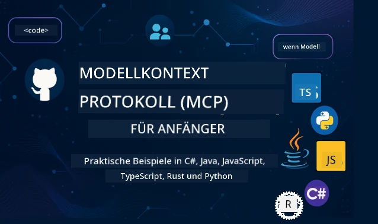

 

[](https://GitHub.com/microsoft/mcp-for-beginners/graphs/contributors)
[](https://GitHub.com/microsoft/mcp-for-beginners/issues)
[](https://GitHub.com/microsoft/mcp-for-beginners/pulls)
[](http://makeapullrequest.com)

[](https://GitHub.com/microsoft/mcp-for-beginners/watchers)
[](https://GitHub.com/microsoft/mcp-for-beginners/fork)
[](https://GitHub.com/microsoft/mcp-for-beginners/stargazers)


[](https://discord.gg/nTYy5BXMWG)

Folgen Sie diesen Schritten, um mit der Nutzung dieser Ressourcen zu beginnen:
1. **Forken Sie das Repository**: Klicken Sie auf [](https://GitHub.com/microsoft/mcp-for-beginners/fork)
2. **Klonen Sie das Repository**:   `git clone https://github.com/microsoft/mcp-for-beginners.git`
3. **Treten Sie dem** [](https://discord.gg/nTYy5BXMWG) bei


### 🌐 Mehrsprachige Unterstützung

#### Unterstützt über GitHub Action (automatisiert & stets aktuell)

<!-- CO-OP TRANSLATOR LANGUAGES TABLE START -->
[Arabisch](../ar/README.md) | [Bengalisch](../bn/README.md) | [Bulgarisch](../bg/README.md) | [Burmese (Myanmar)](../my/README.md) | [Chinesisch (vereinfacht)](../zh-CN/README.md) | [Chinesisch (traditionell, Hongkong)](../zh-HK/README.md) | [Chinesisch (traditionell, Macau)](../zh-MO/README.md) | [Chinesisch (traditionell, Taiwan)](../zh-TW/README.md) | [Kroatisch](../hr/README.md) | [Tschechisch](../cs/README.md) | [Dänisch](../da/README.md) | [Niederländisch](../nl/README.md) | [Estnisch](../et/README.md) | [Finnisch](../fi/README.md) | [Französisch](../fr/README.md) | [Deutsch](./README.md) | [Griechisch](../el/README.md) | [Hebräisch](../he/README.md) | [Hindi](../hi/README.md) | [Ungarisch](../hu/README.md) | [Indonesisch](../id/README.md) | [Italienisch](../it/README.md) | [Japanisch](../ja/README.md) | [Kannada](../kn/README.md) | [Koreanisch](../ko/README.md) | [Litauisch](../lt/README.md) | [Malaiisch](../ms/README.md) | [Malayalam](../ml/README.md) | [Marathi](../mr/README.md) | [Nepalesisch](../ne/README.md) | [Nigerianisches Pidgin](../pcm/README.md) | [Norwegisch](../no/README.md) | [Persisch (Farsi)](../fa/README.md) | [Polnisch](../pl/README.md) | [Portugiesisch (Brasilien)](../pt-BR/README.md) | [Portugiesisch (Portugal)](../pt-PT/README.md) | [Punjabi (Gurmukhi)](../pa/README.md) | [Rumänisch](../ro/README.md) | [Russisch](../ru/README.md) | [Serbisch (kyrillisch)](../sr/README.md) | [Slowakisch](../sk/README.md) | [Slowenisch](../sl/README.md) | [Spanisch](../es/README.md) | [Swahili](../sw/README.md) | [Schwedisch](../sv/README.md) | [Tagalog (Filipino)](../tl/README.md) | [Tamilisch](../ta/README.md) | [Telugu](../te/README.md) | [Thailändisch](../th/README.md) | [Türkisch](../tr/README.md) | [Ukrainisch](../uk/README.md) | [Urdu](../ur/README.md) | [Vietnamesisch](../vi/README.md)

> **Bevorzugen Sie das lokale Klonen?**
>
> Dieses Repository enthält über 50 Sprachübersetzungen, was die Downloadgröße erheblich erhöht. Um ohne Übersetzungen zu klonen, verwenden Sie Sparse Checkout:
>
> **Bash / macOS / Linux:**
> ```bash
> git clone --filter=blob:none --sparse https://github.com/microsoft/mcp-for-beginners.git
> cd mcp-for-beginners
> git sparse-checkout set --no-cone '/*' '!translations' '!translated_images'
> ```
>
> **CMD (Windows):**
> ```cmd
> git clone --filter=blob:none --sparse https://github.com/microsoft/mcp-for-beginners.git
> cd mcp-for-beginners
> git sparse-checkout set --no-cone "/*" "!translations" "!translated_images"
> ```
>
> So erhalten Sie alles, was Sie für den Kurs benötigen, mit einem viel schnelleren Download.
<!-- CO-OP TRANSLATOR LANGUAGES TABLE END -->

# 🚀 Model Context Protocol (MCP) Lehrplan für Anfänger

## **Lernen Sie MCP mit praxisnahen Code-Beispielen in C#, Java, JavaScript, Rust, Python und TypeScript**

## 🧠 Überblick über den Model Context Protocol Lehrplan
Willkommen auf Ihrer Reise in das Model Context Protocol! Wenn Sie sich jemals gefragt haben, wie KI-Anwendungen mit verschiedenen Werkzeugen und Diensten kommunizieren, werden Sie gleich die elegante Lösung entdecken, die die Art und Weise, wie Entwickler intelligente Systeme bauen, revolutioniert.

Denken Sie an MCP als einen universellen Übersetzer für KI-Anwendungen – genau wie USB-Anschlüsse es Ihnen ermöglichen, jedes Gerät an Ihren Computer anzuschließen, erlaubt MCP KI-Modellen, sich auf standardisierte Weise mit jedem Werkzeug oder Dienst zu verbinden. Egal, ob Sie Ihren ersten Chatbot bauen oder an komplexen KI-Workflows arbeiten – das Verständnis von MCP gibt Ihnen die Macht, leistungsfähigere und flexiblere Anwendungen zu erstellen.

Dieser Lehrplan ist mit Geduld und Sorgfalt für Ihre Lernreise gestaltet. Wir beginnen mit einfachen Konzepten, die Sie bereits verstehen, und bauen Ihr Wissen durch praktische Übungen in Ihrer Lieblingsprogrammiersprache Schritt für Schritt aus. Jeder Schritt enthält klare Erklärungen, praktische Beispiele und reichlich Motivation.

Am Ende dieser Reise werden Sie das Selbstvertrauen haben, eigene MCP-Server zu bauen, sie mit beliebten KI-Plattformen zu integrieren und zu verstehen, wie diese Technologie die Zukunft der KI-Entwicklung neu gestaltet. Lassen Sie uns gemeinsam dieses spannende Abenteuer beginnen!

### Offizielle Dokumentation und Spezifikationen

Dieser Lehrplan ist abgestimmt auf **MCP Spezifikation 2025-11-25** (die neueste stabile Version). Die MCP-Spezifikation verwendet datumsbasierte Versionierung (Format JJJJ-MM-TT), um eine klare Nachverfolgung der Protokollversionen sicherzustellen.

Diese Ressourcen werden mit steigendem Verständnis wertvoller, aber fühlen Sie sich nicht unter Druck, alles sofort zu lesen. Beginnen Sie mit den Bereichen, die Sie am meisten interessieren!
- 📘 [MCP Dokumentation](https://modelcontextprotocol.io/) – Dies ist Ihre zentrale Ressource für Schritt-für-Schritt-Tutorials und Benutzerhandbücher. Die Dokumentation ist anfängerfreundlich geschrieben und bietet klare Beispiele, denen Sie in Ihrem eigenen Tempo folgen können.
- 📜 [MCP Spezifikation](https://modelcontextprotocol.io/specification/2025-11-25) – Denken Sie daran als Ihr umfassendes Nachschlagewerk. Während Sie den Lehrplan durcharbeiten, werden Sie immer wieder hierher zurückkehren, um spezifische Details nachzuschlagen und erweiterte Funktionen zu erforschen.
- 📜 [MCP Spezifikations-Versionierung](https://modelcontextprotocol.io/specification/versioning) – Enthält Informationen zur Protokoll-Versionshistorie und wie MCP datumsbasierte Versionierung (JJJJ-MM-TT) verwendet.
- 🧑‍💻 [MCP GitHub Repository](https://github.com/modelcontextprotocol) – Hier finden Sie SDKs, Tools und Codebeispiele in mehreren Programmiersprachen. Es ist wie ein Schatz mit praktischen Beispielen und sofort nutzbaren Komponenten.
- 🌐 [MCP Community](https://github.com/orgs/modelcontextprotocol/discussions) – Treten Sie mit anderen Lernenden und erfahrenen Entwicklern in Kontakt und diskutieren Sie über MCP. Es ist eine unterstützende Community, in der Fragen willkommen sind und Wissen frei geteilt wird.
  
## Lernziele

Am Ende dieses Lehrplans werden Sie sich sicher und begeistert über Ihre neuen Fähigkeiten fühlen. Folgendes werden Sie erreichen:

• **Grundlagen von MCP verstehen**: Sie werden begreifen, was das Model Context Protocol ist und warum es die Zusammenarbeit von KI-Anwendungen revolutioniert, mit Analogien und Beispielen, die Sinn ergeben.

• **Ihren ersten MCP-Server bauen**: Sie erstellen einen funktionierenden MCP-Server in Ihrer bevorzugten Programmiersprache, beginnend mit einfachen Beispielen und erweitern Ihre Fähigkeiten Schritt für Schritt.

• **KI-Modelle mit echten Werkzeugen verbinden**: Sie lernen, wie Sie die Lücke zwischen KI-Modellen und tatsächlichen Diensten überbrücken, was Ihren Anwendungen leistungsstarke neue Fähigkeiten verleiht.

• **Sicherheitsbest-Practices umsetzen**: Sie verstehen, wie Sie Ihre MCP-Implementierungen sicher halten, zum Schutz sowohl Ihrer Anwendungen als auch der Nutzer.

• **Mit Vertrauen deployen**: Sie wissen, wie Sie Ihre MCP-Projekte von der Entwicklung zur Produktion bringen, mit praktischen Deployment-Strategien, die in der realen Welt funktionieren.

• **Teil der MCP-Community werden**: Sie werden Teil einer wachsenden Gemeinschaft von Entwicklern, die die Zukunft der Entwicklung von KI-Anwendungen gestalten.

## Wesentliche Grundlagen

Bevor wir in MCP-Details eintauchen, stellen wir sicher, dass Sie sich mit einigen grundlegenden Konzepten wohlfühlen. Machen Sie sich keine Sorgen, wenn Sie in diesen Bereichen kein Experte sind – wir erklären Ihnen alles, was Sie wissen müssen, Schritt für Schritt!

### Verständnis von Protokollen (Die Grundlage)

Denken Sie an ein Protokoll wie an die Regeln für ein Gespräch. Wenn Sie einen Freund anrufen, wissen Sie beide, dass Sie beim Abheben „Hallo“ sagen, abwechselnd sprechen und zum Abschied „Auf Wiedersehen“ sagen. Computerprogramme benötigen ähnliche Regeln, um effektiv zu kommunizieren.

MCP ist ein Protokoll – eine Reihe vereinbarter Regeln, die dabei helfen, dass KI-Modelle und Anwendungen produktive „Gespräche“ mit Werkzeugen und Diensten führen können. So wie Gesprächsregeln die menschliche Kommunikation flüssiger machen, macht MCP die Kommunikation von KI-Anwendungen viel zuverlässiger und leistungsfähiger.

### Client-Server-Beziehungen (Wie Programme zusammenarbeiten)

Sie nutzen Client-Server-Beziehungen tagtäglich! Wenn Sie einen Webbrowser (den Client) verwenden, um eine Webseite zu besuchen, verbinden Sie sich mit einem Webserver, der Ihnen die Seiteninhalte sendet. Der Browser weiß, wie er Informationen anfragt, und der Server weiß, wie er antwortet.

Im MCP haben wir eine ähnliche Beziehung: KI-Modelle fungieren als Clients, die Informationen oder Aktionen anfordern, während MCP-Server diese Möglichkeiten bereitstellen. Es ist wie ein hilfreicher Assistent (der Server), den die KI auffordern kann, bestimmte Aufgaben zu erledigen.

### Warum Standardisierung wichtig ist (Damit Dinge zusammenarbeiten)

Stellen Sie sich vor, jeder Autohersteller würde unterschiedlich geformte Zapfpistolen verwenden – Sie bräuchten für jedes Auto einen anderen Adapter! Standardisierung bedeutet, sich auf gemeinsame Vorgehensweisen zu einigen, damit alles nahtlos zusammenarbeitet.

MCP bietet diese Standardisierung für KI-Anwendungen. Anstatt dass jedes KI-Modell individuellen Code benötigt, um mit jedem Werkzeug zu arbeiten, schafft MCP eine universelle Art der Kommunikation. So können Entwickler Werkzeuge einmal bauen und sie mit vielen verschiedenen KI-Systemen kompatibel machen.

## 🧭 Überblick über Ihren Lernpfad

Ihre MCP-Reise ist sorgfältig strukturiert, um Ihr Selbstvertrauen und Ihre Fähigkeiten schrittweise aufzubauen. Jede Phase führt neue Konzepte ein und festigt gleichzeitig das Gelernte.

### 🌱 Grundlagenphase: Die Basics verstehen (Module 0-2)

Hier beginnt Ihr Abenteuer! Wir führen Sie in MCP-Konzepte mit vertrauten Analogien und einfachen Beispielen ein. Sie erfahren, was MCP ist, warum es existiert und wie es in die größere Welt der KI-Entwicklung passt.

• **Modul 0 - Einführung in MCP**: Wir starten mit einer Erkundung dessen, was MCP ist und warum es für moderne KI-Anwendungen so wichtig ist. Sie sehen reale Beispiele von MCP im Einsatz und verstehen, wie es häufige Probleme von Entwicklern löst.

• **Modul 1 - Kernkonzepte erklärt**: Hier lernen Sie die wesentlichen Bausteine von MCP. Wir nutzen zahlreiche Analogien und visuelle Beispiele, damit Ihnen die Konzepte natürlich und verständlich erscheinen.

• **Modul 2 - Sicherheit in MCP**: Sicherheit klingt vielleicht einschüchternd, aber wir zeigen Ihnen, wie MCP integrierte Sicherheitsfunktionen einschließt, und lehren bewährte Methoden, die Ihre Anwendungen von Anfang an schützen.

### 🔨 Aufbauphase: Erste Implementierungen erstellen (Modul 3)

Jetzt beginnt der richtige Spaß! Sie sammeln praktische Erfahrungen beim Erstellen tatsächlicher MCP-Server und Clients. Keine Sorge – wir starten einfach und führen Sie durch jeden Schritt.
Dieses Modul enthält mehrere praktische Anleitungen, mit denen Sie in Ihrer bevorzugten Programmiersprache üben können. Sie erstellen Ihren ersten Server, bauen einen Client, der sich mit ihm verbindet, und integrieren sogar beliebte Entwicklungstools wie VS Code.

Jede Anleitung enthält vollständige Codebeispiele, Tipps zur Fehlerbehebung und Erklärungen, warum wir bestimmte Designentscheidungen treffen. Am Ende dieser Phase werden Sie funktionsfähige MCP-Implementierungen haben, auf die Sie stolz sein können!

### 🚀 Wachstumsphase: Fortgeschrittene Konzepte und Anwendung in der Praxis (Module 4-5)

Mit den Grundlagen gemeistert sind Sie bereit, sich mit anspruchsvolleren MCP-Funktionen zu beschäftigen. Wir behandeln praktische Implementierungsstrategien, Debugging-Techniken und fortgeschrittene Themen wie die multimodale KI-Integration.

Sie lernen auch, wie Sie Ihre MCP-Implementierungen für den Produktionseinsatz skalieren und in Cloud-Plattformen wie Azure integrieren. Diese Module bereiten Sie darauf vor, MCP-Lösungen zu entwickeln, die den Anforderungen der realen Welt gewachsen sind.

### 🌟 Meisterphase: Community und Spezialisierung (Module 6-11)

Die letzte Phase konzentriert sich auf den Beitritt zur MCP-Community und die Spezialisierung auf Bereiche, die Sie am meisten interessieren. Sie lernen, wie Sie zu Open-Source-MCP-Projekten beitragen, fortgeschrittene Authentifizierungsmuster implementieren und umfassende, datenbankintegrierte Lösungen bauen.

Modul 11 verdient besondere Erwähnung – es ist eine komplette 13-Lab Hands-on-Lernstrecke, die Sie lehrt, produktionsbereite MCP-Server mit PostgreSQL-Integration zu bauen. Es ist wie ein Abschlussprojekt, das alles zusammenführt, was Sie gelernt haben!

### 📚 Vollständige Curriculum-Struktur

| Modul | Thema | Beschreibung | Link |
|--------|-------|-------------|------|
| **Module 0-3: Grundlagen** | | | |
| 00 | Einführung in MCP | Überblick über das Model Context Protocol und seine Bedeutung in AI-Pipelines | [Weiterlesen](./00-Introduction/README.md) |
| 01 | Kernkonzepte erklärt | Tiefgehende Erkundung der Kernkonzepte von MCP | [Weiterlesen](./01-CoreConcepts/README.md) |
| 02 | Sicherheit in MCP | Sicherheitsbedrohungen und bewährte Verfahren | [Weiterlesen](./02-Security/README.md) |
| 03 | Erste Schritte mit MCP | Umgebungseinrichtung, grundlegende Server/Clients, Integration | [Weiterlesen](./03-GettingStarted/README.md) |
| **Modul 3: Ihren ersten Server & Client bauen** | | | |
| 3.1 | Erster Server | Erstellen Sie Ihren ersten MCP-Server | [Anleitung](./03-GettingStarted/01-first-server/README.md) |
| 3.2 | Erster Client | Entwickeln Sie einen einfachen MCP-Client | [Anleitung](./03-GettingStarted/02-client/README.md) |
| 3.3 | Client mit LLM | Integration großer Sprachmodelle | [Anleitung](./03-GettingStarted/03-llm-client/README.md) |
| 3.4 | VS Code Integration | Verwendung von MCP-Servern in VS Code | [Anleitung](./03-GettingStarted/04-vscode/README.md) |
| 3.5 | stdio Server | Erstellen von Servern mit stdio-Transport | [Anleitung](./03-GettingStarted/05-stdio-server/README.md) |
| 3.6 | HTTP Streaming | Implementierung von HTTP-Streaming in MCP | [Anleitung](./03-GettingStarted/06-http-streaming/README.md) |
| 3.7 | AI Toolkit | Verwendung des AI Toolkits mit MCP | [Anleitung](./03-GettingStarted/07-aitk/README.md) |
| 3.8 | Testing | Testen Ihrer MCP-Server-Implementierung | [Anleitung](./03-GettingStarted/08-testing/README.md) |
| 3.9 | Deployment | MCP-Server in Produktion bereitstellen | [Anleitung](./03-GettingStarted/09-deployment/README.md) |
| 3.10 | Fortgeschrittene Servernutzung | Verwenden Sie fortgeschrittene Server für erweiterte Funktionen und verbesserte Architektur | [Anleitung](./03-GettingStarted/10-advanced/README.md) |
| 3.11 | Einfache Authentifizierung | Ein Kapitel, das Authentifizierung von Anfang an und RBAC zeigt | [Anleitung](./03-GettingStarted/11-simple-auth/README.md) |
| 3.12 | MCP Hosts | Konfigurieren von Claude Desktop, Cursor, Cline und anderen MCP-Hosts | [Anleitung](./03-GettingStarted/12-mcp-hosts/README.md) |
| 3.13 | MCP Inspector | Debuggen und Testen von MCP-Servern mit dem Inspector-Tool | [Anleitung](./03-GettingStarted/13-mcp-inspector/README.md) |
| 3.14 | Sampling | Sampling zur Zusammenarbeit mit dem Client verwenden | [Anleitung](./03-GettingStarted/14-sampling/README.md) |
| 3.15 | MCP Apps | MCP-Apps erstellen | [Anleitung](./03-GettingStarted/15-mcp-apps/README.md) |

| **Module 4-5: Praktisch & Fortgeschritten** | | | |
| 04 | Praktische Implementierung | SDKs, Debugging, Testing, wiederverwendbare Prompt-Vorlagen | [Weiterlesen](./04-PracticalImplementation/README.md) |
| 4.1 | Pagination | Umgang mit großen Ergebnislisten mit cursorbasierter Paginierung | [Anleitung](./04-PracticalImplementation/pagination/README.md) |
| 05 | Fortgeschrittene Themen in MCP | Multimodale KI, Skalierung, Unternehmenseinsatz | [Weiterlesen](./05-AdvancedTopics/README.md) |
| 5.1 | Azure Integration | MCP-Integration mit Azure | [Anleitung](./05-AdvancedTopics/mcp-integration/README.md) |
| 5.2 | Multimodalität | Arbeiten mit mehreren Modalitäten | [Anleitung](./05-AdvancedTopics/mcp-multi-modality/README.md) |
| 5.3 | OAuth2 Demo | Implementierung der OAuth2-Authentifizierung | [Anleitung](./05-AdvancedTopics/mcp-oauth2-demo/README.md) |
| 5.4 | Root-Kontexte | Verstehen und Implementieren von Root-Kontexten | [Anleitung](./05-AdvancedTopics/mcp-root-contexts/README.md) |
| 5.5 | Routing | MCP-Routing-Strategien | [Anleitung](./05-AdvancedTopics/mcp-routing/README.md) |
| 5.6 | Sampling | Sampling-Techniken in MCP | [Anleitung](./05-AdvancedTopics/mcp-sampling/README.md) |
| 5.7 | Skalierung | Skalieren von MCP-Implementierungen | [Anleitung](./05-AdvancedTopics/mcp-scaling/README.md) |
| 5.8 | Sicherheit | Fortgeschrittene Sicherheitsüberlegungen | [Anleitung](./05-AdvancedTopics/mcp-security/README.md) |
| 5.9 | Websuche | Implementierung von Websuchfunktionen | [Anleitung](./05-AdvancedTopics/web-search-mcp/README.md) |
| 5.10 | Echtzeit-Streaming | Aufbau von Echtzeit-Streaming-Funktionalitäten | [Anleitung](./05-AdvancedTopics/mcp-realtimestreaming/README.md) |
| 5.11 | Echtzeit-Suche | Implementierung einer Echtzeit-Suche | [Anleitung](./05-AdvancedTopics/mcp-realtimesearch/README.md) |
| 5.12 | Entra ID Auth | Authentifizierung mit Microsoft Entra ID | [Anleitung](./05-AdvancedTopics/mcp-security-entra/README.md) |
| 5.13 | Foundry Integration | Integration mit Azure AI Foundry | [Anleitung](./05-AdvancedTopics/mcp-foundry-agent-integration/README.md) |
| 5.14 | Kontext-Engineering | Techniken für effektives Kontext-Engineering | [Anleitung](./05-AdvancedTopics/mcp-contextengineering/README.md) |
| 5.15 | MCP Custom Transport | Benutzerdefinierte Transportimplementierungen | [Anleitung](./05-AdvancedTopics/mcp-transport/README.md) |
| 5.16 | Protokollfunktionen | Fortschrittsbenachrichtigungen, Abbruch, Ressourcenvorlagen | [Anleitung](./05-AdvancedTopics/mcp-protocol-features/README.md) |
| **Module 6-10: Community & Best Practices** | | | |
| 06 | Beiträge aus der Community | Wie man zum MCP-Ökosystem beiträgt | [Anleitung](./06-CommunityContributions/README.md) |
| 07 | Erkenntnisse aus der frühen Nutzung | Praxisberichte zur Implementierung | [Anleitung](./07-LessonsfromEarlyAdoption/README.md) |
| 08 | Best Practices für MCP | Leistung, Fehlertoleranz, Resilienz | [Anleitung](./08-BestPractices/README.md) |
| 09 | MCP-Fallstudien | Praktische Implementierungsbeispiele | [Anleitung](./09-CaseStudy/README.md) |
| 10 | Hands-on Workshop | Bau eines MCP-Servers mit AI Toolkit | [Lab](./10-StreamliningAIWorkflowsBuildingAnMCPServerWithAIToolkit/README.md) |
| **Modul 11: MCP Server Hands On Lab** | | | |
| 11 | MCP Server Datenbankintegration | Umfassende 13-Lab Hands-on-Lernstrecke zur PostgreSQL-Integration | [Labs](./11-MCPServerHandsOnLabs/README.md) |
| 11.1 | Einführung | Überblick über MCP mit Datenbankintegration und Einzelhandelsanalysen als Use Case | [Lab 00](./11-MCPServerHandsOnLabs/00-Introduction/README.md) |
| 11.2 | Kernarchitektur | Verständnis der MCP-Server-Architektur, Datenbankebenen und Sicherheitsmuster | [Lab 01](./11-MCPServerHandsOnLabs/01-Architecture/README.md) |
| 11.3 | Sicherheit & Multi-Mandantenfähigkeit | Row Level Security, Authentifizierung und Multi-Tenant-Datenzugriff | [Lab 02](./11-MCPServerHandsOnLabs/02-Security/README.md) |
| 11.4 | Umgebungseinrichtung | Einrichten der Entwicklungsumgebung, Docker, Azure-Ressourcen | [Lab 03](./11-MCPServerHandsOnLabs/03-Setup/README.md) |
| 11.5 | Datenbank-Design | PostgreSQL-Setup, Einzelhandelsschema-Design und Beispieldaten | [Lab 04](./11-MCPServerHandsOnLabs/04-Database/README.md) |
| 11.6 | MCP Server Implementierung | Aufbau des FastMCP-Servers mit Datenbankintegration | [Lab 05](./11-MCPServerHandsOnLabs/05-MCP-Server/README.md) |
| 11.7 | Werkzeugentwicklung | Erstellung von Datenbankabfrage-Tools und Schema-Inspektion | [Lab 06](./11-MCPServerHandsOnLabs/06-Tools/README.md) |
| 11.8 | Semantische Suche | Umsetzung von Vektor-Embeddings mit Azure OpenAI und pgvector | [Lab 07](./11-MCPServerHandsOnLabs/07-Semantic-Search/README.md) |
| 11.9 | Testing & Debugging | Teststrategien, Debugging-Tools und Validierungsansätze | [Lab 08](./11-MCPServerHandsOnLabs/08-Testing/README.md) |
| 11.10 | VS Code Integration | Konfiguration der VS Code MCP-Integration und Nutzung des AI Chats | [Lab 09](./11-MCPServerHandsOnLabs/09-VS-Code/README.md) |
| 11.11 | Deployment-Strategien | Docker-Bereitstellung, Azure Container Apps und Skalierungsüberlegungen | [Lab 10](./11-MCPServerHandsOnLabs/10-Deployment/README.md) |
| 11.12 | Monitoring | Application Insights, Logging, Leistungsüberwachung | [Lab 11](./11-MCPServerHandsOnLabs/11-Monitoring/README.md) |
| 11.13 | Best Practices | Performance-Optimierung, Security-Hardening und Produktionstipps | [Lab 12](./11-MCPServerHandsOnLabs/12-Best-Practices/README.md) |

### 💻 Beispiel-Code-Projekte

Einer der spannendsten Teile beim Lernen von MCP ist die progressive Entwicklung Ihrer Programmierfähigkeiten. Wir haben unsere Codebeispiele so gestaltet, dass sie einfach beginnen und mit wachsendem Verständnis komplexer werden. So führen wir Konzepte ein – mit Code, der leicht verständlich ist, aber reale MCP-Prinzipien demonstriert. Sie verstehen nicht nur, was dieser Code tut, sondern auch, warum er so strukturiert ist und wie er in größere MCP-Anwendungen passt.

#### Basis MCP-Rechner Beispiele

| Sprache | Beschreibung | Link |
|----------|-------------|------|
| C# | MCP Server Beispiel | [Code ansehen](./03-GettingStarted/samples/csharp/README.md) |
| Java | MCP Rechner | [Code ansehen](./03-GettingStarted/samples/java/calculator/README.md) |
| JavaScript | MCP Demo | [Code ansehen](./03-GettingStarted/samples/javascript/README.md) |
| Python | MCP Server | [Code ansehen](../../03-GettingStarted/samples/python/mcp_calculator_server.py) |
| TypeScript | MCP Beispiel | [Code ansehen](./03-GettingStarted/samples/typescript/README.md) |
| Rust | MCP Beispiel | [Code ansehen](./03-GettingStarted/samples/rust/README.md) |

#### Fortgeschrittene MCP-Implementierungen

| Sprache | Beschreibung | Link |
|----------|-------------|------|
| C# | Fortgeschrittenes Beispiel | [Code ansehen](./04-PracticalImplementation/samples/csharp/README.md) |
| Java mit Spring | Container-App Beispiel | [Code ansehen](./04-PracticalImplementation/samples/java/containerapp/README.md) |
| JavaScript | Fortgeschrittenes Beispiel | [Code ansehen](./04-PracticalImplementation/samples/javascript/README.md) |
| Python | Komplexe Implementierung | [Code ansehen](./04-PracticalImplementation/samples/python/README.md) |
| TypeScript | Container-Beispiel | [Code ansehen](./04-PracticalImplementation/samples/typescript/README.md) |


## 🎯 Voraussetzungen für das Lernen von MCP

Um das Curriculum optimal zu nutzen, sollten Sie:
- Grundkenntnisse in mindestens einer der folgenden Programmiersprachen: C#, Java, JavaScript, Python oder TypeScript  
- Verständnis des Client-Server-Modells und von APIs  
- Vertrautheit mit REST- und HTTP-Konzepten  
- (Optional) Hintergrundwissen in AI/ML-Konzepten  

- Teilnahme an unseren Community-Diskussionen zur Unterstützung  

## 📚 Studienführer & Ressourcen

Dieses Repository enthält mehrere Ressourcen, die Ihnen helfen, sich effektiv zurechtzufinden und zu lernen:

### Studienführer

Ein umfassender [Studienführer](./study_guide.md) steht Ihnen zur Verfügung, um Ihnen beim effektiven Navigieren dieses Repositories zu unterstützen. Diese visuelle Curriculum-Übersicht zeigt, wie alle Themen verbunden sind, und bietet Hinweise zur effektiven Nutzung der Beispielprojekte. Besonders hilfreich ist das für visuelle Lerner, die das große Ganze sehen möchten.

Der Leitfaden beinhaltet:  
- Eine visuelle Curriculum-Übersicht aller behandelten Themen  
- Detaillierte Aufschlüsselung der einzelnen Repository-Abschnitte  
- Hinweise zur Nutzung der Beispielprojekte  
- Empfohlene Lernpfade für verschiedene Fähigkeitsstufen  
- Zusätzliche Ressourcen zur Ergänzung Ihrer Lernreise  

### Änderungsprotokoll

Wir führen ein detailliertes [Änderungsprotokoll](./changelog.md), das alle wesentlichen Aktualisierungen der Lehrmaterialien dokumentiert, damit Sie immer auf dem Laufenden über die neuesten Verbesserungen und Erweiterungen bleiben.  
- Neue Inhalte  
- Strukturelle Änderungen  
- Verbesserungen der Features  
- Dokumentationsupdates  

## 🛠️ Wie Sie dieses Curriculum effektiv nutzen

Jede Lektion in diesem Leitfaden beinhaltet:

1. Klare Erklärungen der MCP-Konzepte  
2. Live-Code-Beispiele in mehreren Sprachen  
3. Übungen zum Aufbau echter MCP-Anwendungen  
4. Zusätzliche Ressourcen für Fortgeschrittene  

### Lernen wir MCP mit C# – Tutorial-Serie  
Lernen Sie das Model Context Protocol (MCP) kennen, ein modernes Framework zur Standardisierung der Interaktionen zwischen KI-Modellen und Client-Anwendungen. In dieser einsteigerfreundlichen Session führen wir Sie in MCP ein und begleiten Sie bei der Erstellung Ihres ersten MCP-Servers.  
#### C#: [https://aka.ms/letslearnmcp-csharp](https://aka.ms/letslearnmcp-csharp)  
#### Java: [https://aka.ms/letslearnmcp-java](https://aka.ms/letslearnmcp-java)  
#### JavaScript: [https://aka.ms/letslearnmcp-javascript](https://aka.ms/letslearnmcp-javascript)  
#### Python: [https://aka.ms/letslearnmcp-python](https://aka.ms/letslearnmcp-python)  

## 🎓 Deine MCP-Reise beginnt

Herzlichen Glückwunsch! Sie haben gerade den ersten Schritt auf einer spannenden Reise gemacht, die Ihre Programmierfähigkeiten erweitert und Sie an der Spitze der AI-Entwicklung vernetzt.

### Was Sie bereits erreicht haben

Indem Sie diese Einführung gelesen haben, haben Sie bereits begonnen, Ihre MCP-Wissensbasis aufzubauen. Sie wissen, was MCP ist, warum es wichtig ist und wie dieses Curriculum Ihre Lernreise unterstützt. Das ist ein bedeutender Erfolg und der Beginn Ihrer Expertise in dieser wichtigen Technologie.

### Das Abenteuer vor Ihnen

Während Sie die Module durcharbeiten, denken Sie daran: Jeder Experte war einst ein Anfänger. Die Konzepte, die jetzt vielleicht noch komplex erscheinen, werden zur zweiten Natur, wenn Sie sie üben und anwenden. Jeder kleine Schritt baut auf mächtige Fähigkeiten auf, die Sie während Ihrer gesamten Entwicklerkarriere begleiten werden.

### Ihr Unterstützungsnetzwerk

Sie schließen sich einer Community von Lernenden und Experten an, die leidenschaftlich an MCP interessiert sind und anderen zum Erfolg verhelfen möchten. Ob Sie bei einer Programmieraufgabe stecken bleiben oder einen Durchbruch teilen möchten – die Community unterstützt Sie auf Ihrem Weg.

Wenn Sie feststecken oder Fragen zum Erstellen von KI-Apps haben, schließen Sie sich Mitschülern und erfahrenen Entwicklern in Diskussionen über MCP an. Es ist eine unterstützende Gemeinschaft, in der Fragen willkommen sind und Wissen frei geteilt wird.

[](https://discord.gg/nTYy5BXMWG)

Wenn Sie Produktfeedback oder Fehler beim Entwickeln melden möchten, besuchen Sie:

[](https://aka.ms/foundry/forum)

### Bereit zu starten?

Dein MCP-Abenteuer beginnt jetzt! Starte mit Modul 0, um deine ersten praktischen MCP-Erfahrungen zu sammeln, oder erkunde die Beispielprojekte, um zu sehen, was du bauen wirst. Denk daran – jeder Experte hat genau dort angefangen, wo du jetzt bist, und mit Geduld und Übung wirst du erstaunt sein, was du erreichen kannst.

Willkommen in der Welt der Model Context Protocol-Entwicklung. Lass uns gemeinsam etwas Großartiges erschaffen!

## 🤝 Beitrag zur Lerncommunity

Dieses Curriculum wird durch Beiträge von Lernenden wie dir stärker! Ob du einen Tippfehler korrigierst, eine klarere Erklärung vorschlägst oder ein neues Beispiel hinzufügst – deine Beiträge helfen anderen Anfängern, erfolgreich zu sein.

Danke an Microsoft Valued Professional [Shivam Goyal](https://www.linkedin.com/in/shivam2003/) für die Bereitstellung von Codebeispielen.

Der Beitragsprozess ist einladend und unterstützend gestaltet. Die meisten Beiträge benötigen eine Contributor License Agreement (CLA), aber die automatisierten Tools führen dich reibungslos durch den Prozess.

## 📜 Open Source Lernen

Das gesamte Curriculum steht unter der MIT [LICENSE](../../LICENSE), was bedeutet, dass du es frei nutzen, modifizieren und weitergeben kannst. Das unterstützt unsere Mission, MCP-Wissen für Entwickler weltweit zugänglich zu machen.  
## 🤝 Beitragsrichtlinien

Dieses Projekt begrüßt Beiträge und Vorschläge. Die meisten Beiträge erfordern, dass du einer Contributor License Agreement (CLA) zustimmst, die erklärt, dass du die Rechte besitzt und tatsächlich gewährst, dass wir deine Beiträge nutzen dürfen. Details findest du unter <https://cla.opensource.microsoft.com>.

Wenn du einen Pull Request einreichst, wird ein CLA-Bot automatisch feststellen, ob du eine CLA vorlegen musst und den PR entsprechend markieren (z. B. Statusüberprüfung, Kommentar). Folge einfach den Anweisungen des Bots. Du musst dies nur einmal für alle Repositories mit unserer CLA tun.

Dieses Projekt hat den [Microsoft Open Source Code of Conduct](https://opensource.microsoft.com/codeofconduct/) angenommen.  
Weitere Informationen findest du in den [Code of Conduct FAQ](https://opensource.microsoft.com/codeofconduct/faq/) oder kontaktiere [opencode@microsoft.com](mailto:opencode@microsoft.com) bei zusätzlichen Fragen oder Anmerkungen.

---

*Bereit, deine MCP-Reise zu starten? Beginne mit [Modul 00 – Einführung in MCP](./00-Introduction/README.md) und mache deine ersten Schritte in der Welt der Model Context Protocol-Entwicklung!*  

## 🎒 Weitere Kurse  
Unser Team bietet weitere Kurse an! Schau dir an:  

<!-- CO-OP TRANSLATOR OTHER COURSES START -->  
### LangChain  
[](https://aka.ms/langchain4j-for-beginners)  
[](https://aka.ms/langchainjs-for-beginners?WT.mc_id=m365-94501-dwahlin)  
[](https://github.com/microsoft/langchain-for-beginners?WT.mc_id=m365-94501-dwahlin)  
---  

### Azure / Edge / MCP / Agents  
[](https://github.com/microsoft/AZD-for-beginners?WT.mc_id=academic-105485-koreyst)  
[](https://github.com/microsoft/edgeai-for-beginners?WT.mc_id=academic-105485-koreyst)  
[](https://github.com/microsoft/mcp-for-beginners?WT.mc_id=academic-105485-koreyst)  
[](https://github.com/microsoft/ai-agents-for-beginners?WT.mc_id=academic-105485-koreyst)  

---  
   
### Generative AI Series  
[](https://github.com/microsoft/generative-ai-for-beginners?WT.mc_id=academic-105485-koreyst)  
[-9333EA?style=for-the-badge&labelColor=E5E7EB&color=9333EA)](https://github.com/microsoft/Generative-AI-for-beginners-dotnet?WT.mc_id=academic-105485-koreyst)  
[-C084FC?style=for-the-badge&labelColor=E5E7EB&color=C084FC)](https://github.com/microsoft/generative-ai-for-beginners-java?WT.mc_id=academic-105485-koreyst)  
[-E879F9?style=for-the-badge&labelColor=E5E7EB&color=E879F9)](https://github.com/microsoft/generative-ai-with-javascript?WT.mc_id=academic-105485-koreyst)  

---  
   
### Kernlernstoff  
[](https://aka.ms/ml-beginners?WT.mc_id=academic-105485-koreyst)  
[](https://aka.ms/datascience-beginners?WT.mc_id=academic-105485-koreyst)  
[](https://aka.ms/ai-beginners?WT.mc_id=academic-105485-koreyst)  
[](https://github.com/microsoft/Security-101?WT.mc_id=academic-96948-sayoung)  
[](https://aka.ms/webdev-beginners?WT.mc_id=academic-105485-koreyst)  
[](https://aka.ms/iot-beginners?WT.mc_id=academic-105485-koreyst)  
[](https://github.com/microsoft/xr-development-for-beginners?WT.mc_id=academic-105485-koreyst)  

---  
   
### Copilot-Serie  
[](https://aka.ms/GitHubCopilotAI?WT.mc_id=academic-105485-koreyst)
[](https://github.com/microsoft/mastering-github-copilot-for-dotnet-csharp-developers?WT.mc_id=academic-105485-koreyst)
[](https://github.com/microsoft/CopilotAdventures?WT.mc_id=academic-105485-koreyst)
<!-- CO-OP TRANSLATOR OTHER COURSES END -->

---

<!-- CO-OP TRANSLATOR DISCLAIMER START -->
**Haftungsausschluss**:  
Dieses Dokument wurde mit dem KI-Übersetzungsdienst [Co-op Translator](https://github.com/Azure/co-op-translator) übersetzt. Obwohl wir um Genauigkeit bemüht sind, können automatisierte Übersetzungen Fehler oder Ungenauigkeiten enthalten. Das Originaldokument in seiner Originalsprache gilt als maßgebliche Quelle. Für wichtige Informationen wird eine professionelle menschliche Übersetzung empfohlen. Wir übernehmen keine Haftung für Missverständnisse oder Fehlinterpretationen, die durch die Verwendung dieser Übersetzung entstehen.
<!-- CO-OP TRANSLATOR DISCLAIMER END -->