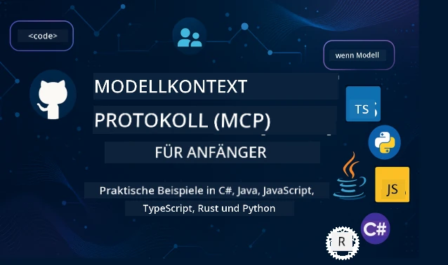

 

[](https://GitHub.com/microsoft/mcp-for-beginners/graphs/contributors)
[](https://GitHub.com/microsoft/mcp-for-beginners/issues)
[](https://GitHub.com/microsoft/mcp-for-beginners/pulls)
[](http://makeapullrequest.com)
[](https://mcptoplist.com/server/mcp.so%2Fmcp-for-beginners%2Fmicrosoft)

[](https://GitHub.com/microsoft/mcp-for-beginners/watchers)
[](https://GitHub.com/microsoft/mcp-for-beginners/fork)
[](https://GitHub.com/microsoft/mcp-for-beginners/stargazers)


[](https://discord.gg/nTYy5BXMWG)

Folge diesen Schritten, um mit diesen Ressourcen zu starten:
1. **Forke das Repository**: Klicke auf [](https://GitHub.com/microsoft/mcp-for-beginners/fork)
2. **Klon das Repository**: `git clone https://github.com/microsoft/mcp-for-beginners.git`
3. **Tritt dem** [](https://discord.gg/nTYy5BXMWG) bei


### 🌐 Mehrsprachige Unterstützung

#### Unterstützt durch GitHub Actions (Automatisiert & Immer Aktuell)

<!-- CO-OP TRANSLATOR LANGUAGES TABLE START -->
[Arabisch](../ar/README.md) | [Bengalisch](../bn/README.md) | [Bulgarisch](../bg/README.md) | [Burmesisch (Myanmar)](../my/README.md) | [Chinesisch (Vereinfacht)](../zh-CN/README.md) | [Chinesisch (Traditionell, Hongkong)](../zh-HK/README.md) | [Chinesisch (Traditionell, Macau)](../zh-MO/README.md) | [Chinesisch (Traditionell, Taiwan)](../zh-TW/README.md) | [Kroatisch](../hr/README.md) | [Tschechisch](../cs/README.md) | [Dänisch](../da/README.md) | [Niederländisch](../nl/README.md) | [Estnisch](../et/README.md) | [Finnisch](../fi/README.md) | [Französisch](../fr/README.md) | [Deutsch](./README.md) | [Griechisch](../el/README.md) | [Hebräisch](../he/README.md) | [Hindi](../hi/README.md) | [Ungarisch](../hu/README.md) | [Indonesisch](../id/README.md) | [Italienisch](../it/README.md) | [Japanisch](../ja/README.md) | [Kannada](../kn/README.md) | [Khmer](../km/README.md) | [Koreanisch](../ko/README.md) | [Litauisch](../lt/README.md) | [Malaiisch](../ms/README.md) | [Malayalam](../ml/README.md) | [Marathi](../mr/README.md) | [Nepalesisch](../ne/README.md) | [Nigerianisches Pidgin](../pcm/README.md) | [Norwegisch](../no/README.md) | [Persisch (Farsi)](../fa/README.md) | [Polnisch](../pl/README.md) | [Portugiesisch (Brasilien)](../pt-BR/README.md) | [Portugiesisch (Portugal)](../pt-PT/README.md) | [Punjabi (Gurmukhi)](../pa/README.md) | [Rumänisch](../ro/README.md) | [Russisch](../ru/README.md) | [Serbisch (Kyrillisch)](../sr/README.md) | [Slowakisch](../sk/README.md) | [Slowenisch](../sl/README.md) | [Spanisch](../es/README.md) | [Suaheli](../sw/README.md) | [Schwedisch](../sv/README.md) | [Tagalog (Filipino)](../tl/README.md) | [Tamil](../ta/README.md) | [Telugu](../te/README.md) | [Thailändisch](../th/README.md) | [Türkisch](../tr/README.md) | [Ukrainisch](../uk/README.md) | [Urdu](../ur/README.md) | [Vietnamesisch](../vi/README.md)

> **Möchtest du lieber lokal klonen?**
>
> Dieses Repository enthält über 50 Sprachübersetzungen, was die Downloadgröße erheblich vergrößert. Um ohne Übersetzungen zu klonen, verwende Sparse Checkout:
>
> **Bash / macOS / Linux:**
> ```bash
> git clone --filter=blob:none --sparse https://github.com/microsoft/mcp-for-beginners.git
> cd mcp-for-beginners
> git sparse-checkout set --no-cone '/*' '!translations' '!translated_images'
> ```
>
> **CMD (Windows):**
> ```cmd
> git clone --filter=blob:none --sparse https://github.com/microsoft/mcp-for-beginners.git
> cd mcp-for-beginners
> git sparse-checkout set --no-cone "/*" "!translations" "!translated_images"
> ```
>
> Das gibt dir alles, was du brauchst, um den Kurs zu absolvieren, mit einem viel schnelleren Download.
<!-- CO-OP TRANSLATOR LANGUAGES TABLE END -->

# 🚀 Model Context Protocol (MCP) Curriculum für Anfänger

## **Lerne MCP mit praktischen Codebeispielen in C#, Java, JavaScript, Rust, Python und TypeScript**

## 🧠 Überblick über das Model Context Protocol Curriculum
Willkommen zu deiner Reise ins Model Context Protocol! Wenn du dich jemals gefragt hast, wie KI-Anwendungen mit verschiedenen Tools und Diensten kommunizieren, wirst du gleich die elegante Lösung entdecken, die die Art und Weise verändert, wie Entwickler intelligente Systeme bauen.

Stell dir MCP wie einen universellen Übersetzer für KI-Anwendungen vor – so wie USB-Anschlüsse es dir erlauben, jedes Gerät mit deinem Computer zu verbinden, ermöglicht MCP KI-Modellen, sich auf standardisierte Weise mit jedem Tool oder Dienst zu verbinden. Ob du deinen ersten Chatbot entwickelst oder an komplexen KI-Workflows arbeitest, das Verständnis von MCP gibt dir die Macht, leistungsfähigere und flexiblere Anwendungen zu erstellen.

Dieses Curriculum ist mit Geduld und Sorgfalt für deine Lernreise gestaltet. Wir beginnen mit einfachen Konzepten, die du bereits verstehst, und bauen dein Wissen schrittweise durch praktische Übungen in deiner bevorzugten Programmiersprache auf. Jeder Schritt enthält klare Erklärungen, praktische Beispiele und viel Ermutigung.

Am Ende dieser Reise wirst du das Selbstvertrauen haben, deine eigenen MCP-Server zu bauen, sie mit gängigen KI-Plattformen zu integrieren und zu verstehen, wie diese Technologie die Zukunft der KI-Entwicklung gestaltet. Lass uns gemeinsam dieses spannende Abenteuer beginnen!

### Offizielle Dokumentation und Spezifikationen

Dieses Curriculum ist auf die **MCP-Spezifikation 2025-11-25** (die neueste stabile Version) abgestimmt. Die MCP-Spezifikation verwendet datumsbasierte Versionsnummern (JJJJ-MM-TT-Format), um eine klare Protokollversionsverfolgung zu gewährleisten.

> **Ein Blick in die Zukunft:** Ein Release Candidate für die nächste Spezifikationsversion, **2026-07-28**, ist für den 28. Juli 2026 vorgesehen. Er macht das Protokoll auf der Transportschicht zustandslos, formalisert ein Erweiterungsframework (MCP Apps, Tasks), verstärkt die Autorisierung und veraltet Roots, Sampling und Logging. Siehe [Was sich bei MCP ändert: Der Release Candidate vom 28.07.2026](./01-CoreConcepts/mcp-2026-07-28-release-candidate.md) für eine vollständige Aufschlüsselung.

Diese Ressourcen werden wertvoller, je mehr du verstehst, aber fühl dich nicht unter Druck gesetzt, sofort alles zu lesen. Fang mit den Bereichen an, die dich am meisten interessieren!
- 📘 [MCP-Dokumentation](https://modelcontextprotocol.io/) – Dies ist deine Anlaufstelle für Schritt-für-Schritt-Tutorials und Benutzerhandbücher. Die Dokumentation ist für Einsteiger geschrieben und enthält klare Beispiele, denen du in deinem eigenen Tempo folgen kannst.
- 📜 [MCP-Spezifikation](https://modelcontextprotocol.io/specification/2025-11-25) – Betrachte dies als dein umfassendes Nachschlagewerk. Während du das Curriculum durcharbeitest, wirst du hier immer wieder spezifische Details nachschlagen und fortgeschrittene Funktionen erkunden.
- 📜 [MCP-Spezifikationsversionierung](https://modelcontextprotocol.io/specification/versioning) – Diese enthält Informationen zur Protokollversionsgeschichte und wie MCP datumsbasierte Versionierung (JJJJ-MM-TT-Format) verwendet.
- 🧑‍💻 [MCP GitHub Repository](https://github.com/modelcontextprotocol) – Hier findest du SDKs, Tools und Codebeispiele in mehreren Programmiersprachen. Es ist eine Schatzkammer praktischer Beispiele und gebrauchsfertiger Komponenten.
- 🌐 [MCP Community](https://github.com/orgs/modelcontextprotocol/discussions) – Tritt zusammen mit anderen Lernenden und erfahrenen Entwicklern in Diskussionen über MCP ein. Es ist eine unterstützende Community, in der Fragen willkommen sind und Wissen frei geteilt wird.
  
## Lernziele

Am Ende dieses Curriculums wirst du dich sicher und begeistert über deine neuen Fähigkeiten fühlen. Folgendes wirst du erreichen:

• **MCP-Grundlagen verstehen**: Du wirst erfassen, was das Model Context Protocol ist und warum es die Zusammenarbeit von KI-Anwendungen revolutioniert, mit Analogien und Beispielen, die Sinn machen.

• **Deinen ersten MCP-Server bauen**: Du wirst einen funktionierenden MCP-Server in deiner bevorzugten Programmiersprache erstellen, beginnend mit einfachen Beispielen und deine Fähigkeiten Schritt für Schritt erweitern.

• **KI-Modelle mit echten Tools verbinden**: Du lernst, wie man die Lücke zwischen KI-Modellen und tatsächlichen Diensten überbrückt und deinen Anwendungen damit neue mächtige Fähigkeiten verleiht.

• **Sicherheitsbest Practices umsetzen**: Du verstehst, wie du deine MCP-Implementierungen sicher hältst und sowohl deine Anwendungen als auch Benutzer schützt.

• **Mit Vertrauen deployen**: Du wirst wissen, wie du deine MCP-Projekte von der Entwicklung bis zur Produktion bringst, mit praktischen Deployment-Strategien, die in der realen Welt funktionieren.

• **Teil der MCP-Community werden**: Du wirst Teil einer wachsenden Entwicklergemeinschaft, die die Zukunft der KI-Anwendungsentwicklung gestaltet. 

## Wesentliche Grundlagen

Bevor wir in die MCP-Details eintauchen, stellen wir sicher, dass du dich mit einigen grundlegenden Konzepten wohlfühlst. Keine Sorge, wenn du in diesen Bereichen kein Experte bist – wir erklären alles, was du wissen musst, während wir voranschreiten!

### Verständnis von Protokollen (Die Grundlage)

Stell dir ein Protokoll wie die Regeln für ein Gespräch vor. Wenn du einen Freund anrufst, wisst ihr beide, beim Abheben „Hallo“ zu sagen, abwechselnd zu sprechen und „Auf Wiedersehen“ zu sagen, wenn ihr fertig seid. Computerprogramme brauchen ähnliche Regeln, um effektiv kommunizieren zu können.

MCP ist ein Protokoll – eine Reihe vereinbarter Regeln, die KI-Modelle und Anwendungen dabei helfen, produktive „Gespräche“ mit Tools und Diensten zu führen. So wie Gesprächsregeln die menschliche Kommunikation reibungsloser machen, macht MCP die Kommunikation von KI-Anwendungen viel zuverlässiger und leistungsfähiger.

### Client-Server-Beziehungen (Wie Programme zusammenarbeiten)

Du nutzt Client-Server-Beziehungen jeden Tag! Wenn du einen Webbrowser (den Client) benutzt, um eine Website zu besuchen, verbindest du dich mit einem Webserver, der dir die Seiteninhalte sendet. Der Browser weiß, wie er Informationen anfordert, und der Server weiß, wie er antwortet.

In MCP haben wir eine ähnliche Beziehung: KI-Modelle fungieren als Clients, die Informationen oder Aktionen anfordern, während MCP-Server diese Fähigkeiten bereitstellen. Es ist, als hättest du einen hilfreichen Assistenten (den Server), den die KI bittet, bestimmte Aufgaben auszuführen.

### Warum Standardisierung wichtig ist (Dinge funktionieren zusammen)

Stell dir vor, jeder Autohersteller würde unterschiedlich geformte Tankanschlüsse verwenden – du bräuchtest für jedes Auto einen anderen Adapter! Standardisierung bedeutet, sich auf gemeinsame Ansätze zu einigen, damit Dinge nahtlos zusammenarbeiten.

MCP bietet diese Standardisierung für KI-Anwendungen. Anstatt dass jedes KI-Modell eigenen Code braucht, um mit jedem Tool zu funktionieren, schafft MCP eine universelle Kommunikationsmöglichkeit. Das ermöglicht es Entwicklern, Tools einmal zu bauen, die mit vielen verschiedenen KI-Systemen funktionieren.

## 🧭 Dein Lernweg Überblick

Deine MCP-Reise ist sorgfältig strukturiert, um dein Selbstvertrauen und deine Fähigkeiten schrittweise aufzubauen. Jede Phase führt neue Konzepte ein und festigt gleichzeitig das, was du bereits gelernt hast.

### 🌱 Fundamentphase: Grundlagen verstehen (Module 0-2)

Hier beginnt dein Abenteuer! Wir werden dir MCP-Konzepte mit vertrauten Analogien und einfachen Beispielen vorstellen. Du wirst verstehen, was MCP ist, warum es existiert und wie es in die größere Welt der KI-Entwicklung passt.


• **Modul 0 - Einführung in MCP**: Wir beginnen damit, zu erkunden, was MCP ist und warum es für moderne KI-Anwendungen so wichtig ist. Sie werden reale Beispiele für MCP in Aktion sehen und verstehen, wie es häufige Probleme löst, denen Entwickler gegenüberstehen.

• **Modul 1 - Kernkonzepte erklärt**: Hier lernen Sie die wesentlichen Bausteine von MCP kennen. Wir verwenden viele Analogien und visuelle Beispiele, um sicherzustellen, dass diese Konzepte natürlich und verständlich wirken.

• **Modul 2 - Sicherheit in MCP**: Sicherheit mag einschüchternd klingen, aber wir zeigen Ihnen, wie MCP eingebaute Sicherheitsfunktionen enthält und lehren Sie Best Practices, die Ihre Anwendungen von Anfang an schützen.

### 🔨 Bauphase: Erstellen Ihrer ersten Implementierungen (Modul 3)

Jetzt beginnt der eigentliche Spaß! Sie erhalten praktische Erfahrungen beim Erstellen echter MCP-Server und -Clients. Keine Sorge – wir fangen einfach an und begleiten Sie bei jedem Schritt.

Dieses Modul enthält mehrere praktische Anleitungen, die es Ihnen ermöglichen, in Ihrer bevorzugten Programmiersprache zu üben. Sie erstellen Ihren ersten Server, bauen einen Client, der sich damit verbindet, und integrieren sogar beliebte Entwicklungstools wie VS Code.

Jede Anleitung enthält vollständige Codebeispiele, Tipps zur Fehlersuche und Erklärungen, warum wir bestimmte Designentscheidungen treffen. Am Ende dieser Phase haben Sie funktionierende MCP-Implementierungen, auf die Sie stolz sein können!

### 🚀 Wachstumsphase: Fortgeschrittene Konzepte und Anwendung in der Praxis (Module 4-5)

Nach Beherrschung der Grundlagen sind Sie bereit, sich mit anspruchsvolleren MCP-Funktionen zu beschäftigen. Wir behandeln praktische Implementierungsstrategien, Debugging-Techniken und fortgeschrittene Themen wie die Integration multimodaler KI.

Sie lernen auch, wie Sie Ihre MCP-Implementierungen für den Produktionseinsatz skalieren und mit Cloud-Plattformen wie Azure integrieren. Diese Module bereiten Sie darauf vor, MCP-Lösungen zu entwickeln, die den Anforderungen der Praxis gewachsen sind.

### 🌟 Meisterphase: Community und Spezialisierung (Module 6-11)

Die letzte Phase konzentriert sich darauf, der MCP-Community beizutreten und sich in Bereichen zu spezialisieren, die Sie besonders interessieren. Sie lernen, wie Sie zu Open-Source-MCP-Projekten beitragen, fortgeschrittene Authentifizierungsmuster implementieren und umfassende datenbankintegrierte Lösungen entwickeln.

Modul 11 verdient besondere Erwähnung – es ist ein kompletter 13-Labor-Praktikums-Lernpfad, der Ihnen beibringt, produktionsreife MCP-Server mit PostgreSQL-Integration zu erstellen. Es ist wie ein Abschlussprojekt, das alles zusammenführt, was Sie gelernt haben!

### 📚 Vollständige Kursstruktur

| Modul | Thema | Beschreibung | Link |
|--------|-------|-------------|------|
| **Module 0-3: Grundlagen** | | | |
| 00 | Einführung in MCP | Überblick über das Model Context Protocol und seine Bedeutung in KI-Pipelines | [Weiterlesen](./00-Introduction/README.md) |
| 01 | Kernkonzepte erklärt | Tiefgehende Erkundung der Kernkonzepte von MCP | [Weiterlesen](./01-CoreConcepts/README.md) |
| 1.1 | Was ändert sich in MCP (2026-07-28 RC) | Zustandsloses Protokoll, Erweiterungsframework und Funktionsabkündigungen in der nächsten Spezifikationsversion | [Anleitung](./01-CoreConcepts/mcp-2026-07-28-release-candidate.md) |
| 02 | Sicherheit in MCP | Sicherheitsbedrohungen und Best Practices | [Weiterlesen](./02-Security/README.md) |
| 03 | Einstieg in MCP | Einrichtung der Umgebung, grundlegende Server/Clients, Integration | [Weiterlesen](./03-GettingStarted/README.md) |
| **Modul 3: Erstellen Ihres ersten Servers & Clients** | | | |
| 3.1 | Erster Server | Erstellen Sie Ihren ersten MCP-Server | [Anleitung](./03-GettingStarted/01-first-server/README.md) |
| 3.2 | Erster Client | Entwickeln Sie einen grundlegenden MCP-Client | [Anleitung](./03-GettingStarted/02-client/README.md) |
| 3.3 | Client mit LLM | Integration großer Sprachmodelle | [Anleitung](./03-GettingStarted/03-llm-client/README.md) |
| 3.4 | VS Code-Integration | Verwendung von MCP-Servern in VS Code | [Anleitung](./03-GettingStarted/04-vscode/README.md) |
| 3.5 | stdio Server | Erstellen von Servern mit stdio-Transport | [Anleitung](./03-GettingStarted/05-stdio-server/README.md) |
| 3.6 | HTTP-Streaming | Implementierung von HTTP-Streaming in MCP | [Anleitung](./03-GettingStarted/06-http-streaming/README.md) |
| 3.7 | Microsoft Foundry Toolkit | Verwendung des Microsoft Foundry Toolkits mit MCP | [Anleitung](./03-GettingStarted/07-aitk/README.md) |
| 3.8 | Testen | Testen Ihrer MCP-Server-Implementierung | [Anleitung](./03-GettingStarted/08-testing/README.md) |
| 3.9 | Deployment | MCP-Server in der Produktion bereitstellen | [Anleitung](./03-GettingStarted/09-deployment/README.md) |
| 3.10 | Erweiterte Servernutzung | Verwendung fortgeschrittener Server für erweiterte Funktionen und verbesserte Architektur | [Anleitung](./03-GettingStarted/10-advanced/README.md) |
| 3.11 | Einfache Authentifizierung | Ein Kapitel, das Ihnen Authentifizierung von Anfang an und RBAC zeigt | [Anleitung](./03-GettingStarted/11-simple-auth/README.md) |
| 3.12 | MCP Hosts | Konfiguration von Claude Desktop, Cursor, Cline und anderen MCP-Hosts | [Anleitung](./03-GettingStarted/12-mcp-hosts/README.md) |
| 3.13 | MCP Inspector | Debugging und Testen von MCP-Servern mit dem Inspector-Tool | [Anleitung](./03-GettingStarted/13-mcp-inspector/README.md) |
| 3.14 | Sampling | Verwendung von Sampling zur Zusammenarbeit mit dem Client | [Anleitung](./03-GettingStarted/14-sampling/README.md) |
| 3.15 | MCP Apps | Erstellen von MCP-Apps | [Anleitung](./03-GettingStarted/15-mcp-apps/README.md) |
| **Module 4-5: Praktisch & Fortgeschritten** | | | |
| 04 | Praktische Implementierung | SDKs, Debugging, Testing, wiederverwendbare Prompt-Vorlagen | [Weiterlesen](./04-PracticalImplementation/README.md) |
| 4.1 | Paginierung | Umgang mit großen Ergebnissets mittels cursorbasierter Paginierung | [Anleitung](./04-PracticalImplementation/pagination/README.md) |
| 05 | Fortgeschrittene Themen in MCP | Multi-modale KI, Skalierung, Unternehmensanwendung | [Weiterlesen](./05-AdvancedTopics/README.md) |
| 5.1 | Azure-Integration | MCP-Integration mit Azure | [Anleitung](./05-AdvancedTopics/mcp-integration/README.md) |
| 5.2 | Multi-Modus | Arbeiten mit mehreren Modalitäten | [Anleitung](./05-AdvancedTopics/mcp-multi-modality/README.md) |
| 5.3 | OAuth2 Demo | Implementierung der OAuth2-Authentifizierung | [Anleitung](./05-AdvancedTopics/mcp-oauth2-demo/README.md) |
| 5.4 | Root-Kontexte | Verstehen und Implementieren von Root-Kontexten | [Anleitung](./05-AdvancedTopics/mcp-root-contexts/README.md) |
| 5.5 | Routing | MCP-Routing-Strategien | [Anleitung](./05-AdvancedTopics/mcp-routing/README.md) |
| 5.6 | Sampling | Sampling-Techniken in MCP | [Anleitung](./05-AdvancedTopics/mcp-sampling/README.md) |
| 5.7 | Skalierung | MCP-Implementierungen skalieren | [Anleitung](./05-AdvancedTopics/mcp-scaling/README.md) |
| 5.8 | Sicherheit | Erweiterte Sicherheitsüberlegungen | [Anleitung](./05-AdvancedTopics/mcp-security/README.md) |
| 5.9 | Websuche | Implementierung von Websuchfunktionen | [Anleitung](./05-AdvancedTopics/web-search-mcp/README.md) |
| 5.10 | Echtzeit-Streaming | Echtzeit-Streaming-Funktionalität erstellen | [Anleitung](./05-AdvancedTopics/mcp-realtimestreaming/README.md) |
| 5.11 | Echtzeit-Suche | Implementierung der Echtzeit-Suche | [Anleitung](./05-AdvancedTopics/mcp-realtimesearch/README.md) |
| 5.12 | Entra ID Auth | Authentifizierung mit Microsoft Entra ID | [Anleitung](./05-AdvancedTopics/mcp-security-entra/README.md) |
| 5.13 | Foundry-Integration | Integration mit Microsoft Foundry | [Anleitung](./05-AdvancedTopics/mcp-foundry-agent-integration/README.md) |
| 5.14 | Context Engineering | Techniken für effektives Kontext-Engineering | [Anleitung](./05-AdvancedTopics/mcp-contextengineering/README.md) |
| 5.15 | MCP Custom Transport | Eigene Transport-Implementierungen | [Anleitung](./05-AdvancedTopics/mcp-transport/README.md) |
| 5.16 | Protokollfunktionen | Fortschrittsbenachrichtigungen, Abbruch, Ressourcenvorlagen | [Anleitung](./05-AdvancedTopics/mcp-protocol-features/README.md) |
| 5.17 | Adversariales Multi-Agent Reasoning | Zwei Agenten argumentieren gegensätzliche Seiten mit gemeinsamen MCP-Tools, bewertet von einem Richter-Agenten | [Anleitung](./05-AdvancedTopics/mcp-adversarial-agents/README.md) |
| **Module 6-10: Community & Best Practices** | | | |
| 06 | Community-Beiträge | Wie man zum MCP-Ökosystem beiträgt | [Anleitung](./06-CommunityContributions/README.md) |
| 07 | Erkenntnisse aus frühem Einsatz | Geschichten von realen Implementierungen | [Anleitung](./07-LessonsfromEarlyAdoption/README.md) |
| 08 | Best Practices für MCP | Leistung, Fehlertoleranz, Resilienz | [Anleitung](./08-BestPractices/README.md) |
| 09 | MCP Fallstudien | Praktische Implementierungsbeispiele | [Anleitung](./09-CaseStudy/README.md) |
| 10 | Praxis-Workshop | Aufbau eines MCP-Servers mit Microsoft Foundry Toolkit | [Labor](./10-StreamliningAIWorkflowsBuildingAnMCPServerWithAIToolkit/README.md) |
| **Modul 11: MCP Server Hands-On Labor** | | | |
| 11 | MCP Server Datenbankintegration | Umfassender 13-Labor Hands-On Lernpfad für PostgreSQL-Integration | [Labore](./11-MCPServerHandsOnLabs/README.md) |
| 11.1 | Einführung | Überblick über MCP mit Datenbankintegration und Einzelhandels-Analytics-Anwendungsfall | [Labor 00](./11-MCPServerHandsOnLabs/00-Introduction/README.md) |
| 11.2 | Kernarchitektur | Verständnis der MCP-Serverarchitektur, Datenbankschichten und Sicherheitsmuster | [Labor 01](./11-MCPServerHandsOnLabs/01-Architecture/README.md) |
| 11.3 | Sicherheit & Multi-Tenancy | Row Level Security, Authentifizierung und mehrmandantenfähiger Datenzugriff | [Labor 02](./11-MCPServerHandsOnLabs/02-Security/README.md) |
| 11.4 | Umgebungseinrichtung | Einrichtung der Entwicklungsumgebung, Docker, Azure-Ressourcen | [Labor 03](./11-MCPServerHandsOnLabs/03-Setup/README.md) |
| 11.5 | Datenbankdesign | PostgreSQL Einrichtung, Einzelhandelsschema-Design und Beispieldaten | [Labor 04](./11-MCPServerHandsOnLabs/04-Database/README.md) |
| 11.6 | MCP Server Implementierung | Aufbau des FastMCP-Servers mit Datenbankintegration | [Labor 05](./11-MCPServerHandsOnLabs/05-MCP-Server/README.md) |
| 11.7 | Tool-Entwicklung | Erstellung von Datenbankabfragetools und Schema-Inspektion | [Labor 06](./11-MCPServerHandsOnLabs/06-Tools/README.md) |
| 11.8 | Semantische Suche | Implementierung von Vektor-Einbettungen mit Azure OpenAI und pgvector | [Labor 07](./11-MCPServerHandsOnLabs/07-Semantic-Search/README.md) |
| 11.9 | Testen & Debugging | Teststrategien, Debugging-Tools und Validierungsansätze | [Labor 08](./11-MCPServerHandsOnLabs/08-Testing/README.md) |
| 11.10 | VS Code Integration | Konfiguration der VS Code MCP-Integration und Nutzung des AI Chats | [Labor 09](./11-MCPServerHandsOnLabs/09-VS-Code/README.md) |
| 11.11 | Deployment-Strategien | Docker-Deployment, Azure Container Apps und Skalierungsüberlegungen | [Labor 10](./11-MCPServerHandsOnLabs/10-Deployment/README.md) |
| 11.12 | Monitoring | Application Insights, Logging, Leistungsüberwachung | [Labor 11](./11-MCPServerHandsOnLabs/11-Monitoring/README.md) |
| 11.13 | Best Practices | Leistungsoptimierung, Sicherhiets-Härtung und Produktionstipps | [Labor 12](./11-MCPServerHandsOnLabs/12-Best-Practices/README.md) |
| **Modul 12: MCP Tooling** | | | |
| 12.1 | Tooling | MCP-Nutzung in der Copilot App | [ Anleitung ](./12-tooling/README.md) |

### 💻 Beispiel-Code-Projekte

Ein besonders spannender Teil beim Lernen von MCP ist es, Ihre Programmierfähigkeiten Schritt für Schritt wachsen zu sehen. Wir haben unsere Codebeispiele so gestaltet, dass sie einfach anfangen und mit Ihrem Verständnis immer anspruchsvoller werden. So führen wir Konzepte ein – mit Code, der leicht zu verstehen ist, aber echte MCP-Prinzipien demonstriert; Sie verstehen nicht nur, was dieser Code tut, sondern auch warum er so strukturiert ist und wie er in größere MCP-Anwendungen passt.

#### Grundlegende MCP-Rechner-Beispiele

| Sprache | Beschreibung | Link |
|----------|-------------|------|

| C# | MCP Server Beispiel | [Code ansehen](./03-GettingStarted/samples/csharp/README.md) |
| Java | MCP Rechner | [Code ansehen](./03-GettingStarted/samples/java/calculator/README.md) |
| JavaScript | MCP Demo | [Code ansehen](./03-GettingStarted/samples/javascript/README.md) |
| Python | MCP Server | [Code ansehen](../../03-GettingStarted/samples/python/mcp_calculator_server.py) |
| TypeScript | MCP Beispiel | [Code ansehen](./03-GettingStarted/samples/typescript/README.md) |
| Rust | MCP Beispiel | [Code ansehen](./03-GettingStarted/samples/rust/README.md) |

#### Erweiterte MCP Implementierungen

| Sprache | Beschreibung | Link |
|----------|-------------|------|
| C# | Fortgeschrittenes Beispiel | [Code ansehen](./04-PracticalImplementation/samples/csharp/README.md) |
| Java mit Spring | Beispiel Container App | [Code ansehen](./04-PracticalImplementation/samples/java/containerapp/README.md) |
| JavaScript | Fortgeschrittenes Beispiel | [Code ansehen](./04-PracticalImplementation/samples/javascript/README.md) |
| Python | Komplexe Implementierung | [Code ansehen](./04-PracticalImplementation/samples/python/README.md) |
| TypeScript | Container Beispiel | [Code ansehen](./04-PracticalImplementation/samples/typescript/README.md) |


## 🎯 Voraussetzungen für das Lernen von MCP

Um das Beste aus diesem Lehrplan herauszuholen, solltest du:

- Grundkenntnisse in mindestens einer der folgenden Programmiersprachen: C#, Java, JavaScript, Python oder TypeScript
- Verständnis des Client-Server-Modells und von APIs
- Vertrautheit mit REST- und HTTP-Konzepten
- (Optional) Kenntnisse in KI/ML-Konzepten

- Teilnahme an unseren Community-Diskussionen zur Unterstützung

## 📚 Studienanleitung & Ressourcen

Dieses Repository enthält verschiedene Ressourcen, die dir helfen, dich effektiv zurechtzufinden und zu lernen:

### Studienanleitung

Eine umfassende [Studienanleitung](./study_guide.md) steht zur Verfügung, um dir zu helfen, dieses Repository effektiv zu navigieren. Diese visuelle Lehrplanübersicht zeigt, wie alle Themen verbunden sind, und gibt Hinweise, wie man die Beispielprojekte effektiv nutzt. Besonders hilfreich, wenn du ein visueller Lerntyp bist, der das große Ganze sehen möchte.

Die Anleitung enthält:
- Eine visuelle Lehrplanübersicht mit allen behandelten Themen
- Detaillierte Aufschlüsselung jedes Repository-Abschnitts
- Hinweise zur Nutzung der Beispielprojekte
- Empfohlene Lernpfade für verschiedene Fähigkeitsstufen
- Zusätzliche Ressourcen zur Ergänzung deiner Lernreise

### Änderungsprotokoll

Wir pflegen ein detailliertes [Änderungsprotokoll](./changelog.md), das alle wesentlichen Aktualisierungen der Lehrplanmaterialien festhält, damit du immer über die neuesten Verbesserungen und Ergänzungen informiert bist.
- Neue Inhaltszusätze
- Strukturelle Änderungen
- Funktionsverbesserungen
- Dokumentationsaktualisierungen

## 🛠️ Wie du diesen Lehrplan effektiv nutzt

Jede Lektion in diesem Leitfaden beinhaltet:

1. Klare Erklärungen der MCP-Konzepte  
2. Live-Code-Beispiele in mehreren Sprachen  
3. Übungen zum Erstellen realer MCP-Anwendungen  
4. Zusätzliche Ressourcen für fortgeschrittene Lernende

### Lass uns MCP mit C# lernen - Tutorial-Serie
Lass uns das Model Context Protocol (MCP) kennenlernen, ein modernes Framework, das darauf ausgelegt ist, die Interaktionen zwischen KI-Modellen und Client-Anwendungen zu standardisieren. In dieser anfängerfreundlichen Session führen wir dich in MCP ein und begleiten dich beim Erstellen deines ersten MCP-Servers.
#### C#: [https://aka.ms/letslearnmcp-csharp](https://aka.ms/letslearnmcp-csharp)
#### Java: [https://aka.ms/letslearnmcp-java](https://aka.ms/letslearnmcp-java)
#### JavaScript: [https://aka.ms/letslearnmcp-javascript](https://aka.ms/letslearnmcp-javascript)
#### Python: [https://aka.ms/letslearnmcp-python](https://aka.ms/letslearnmcp-python)

## 🎓 Deine MCP-Reise beginnt

Glückwunsch! Du hast gerade den ersten Schritt auf einer spannenden Reise gemacht, die deine Programmierfähigkeiten erweitert und dich mit der Spitze der KI-Entwicklung verbindet.

### Was du bereits erreicht hast

Indem du diese Einführung gelesen hast, hast du bereits begonnen, deine MCP-Wissensbasis aufzubauen. Du verstehst, was MCP ist, warum es wichtig ist, und wie dieser Lehrplan deine Lernreise unterstützt. Das ist eine bedeutende Leistung und der Beginn deiner Expertise in dieser wichtigen Technologie.

### Das Abenteuer vor dir

Während du die Module durchläufst, denk daran, dass jeder Experte einmal ein Anfänger war. Die Konzepte, die jetzt komplex erscheinen, werden mit Übung und Anwendung zur zweiten Natur. Jeder kleine Schritt baut auf mächtige Fähigkeiten auf, die dir während deiner gesamten Entwicklerkarriere dienen werden.

### Dein Unterstützungsnetzwerk

Du trittst einer Gemeinschaft von Lernenden und Experten bei, die begeistert von MCP sind und anderen beim Erfolg helfen wollen. Ob du bei einer Programmieraufgabe feststeckst oder einen Durchbruch teilen möchtest, die Community unterstützt dich auf deiner Reise.

Wenn du hängen bleibst oder Fragen zum Erstellen von KI-Apps hast, nimm an Diskussionen mit anderen Lernenden und erfahrenen Entwicklern zu MCP teil. Es ist eine unterstützende Gemeinschaft, in der Fragen willkommen sind und Wissen frei geteilt wird.

[](https://discord.gg/nTYy5BXMWG)

Wenn du Produktfeedback oder Fehler beim Erstellen hast, besuche:

[](https://aka.ms/foundry/forum)

### Bereit zu starten?

Dein MCP-Abenteuer beginnt jetzt! Starte mit Modul 0, um deine ersten praktischen MCP-Erfahrungen zu sammeln, oder erkunde die Beispielprojekte, um zu sehen, was du bauen wirst. Denk daran - jeder Experte hat genau dort angefangen, wo du jetzt bist, und mit Geduld und Übung wirst du erstaunt sein, was du erreichen kannst.

Willkommen in der Welt der Model Context Protocol-Entwicklung. Lass uns gemeinsam etwas Großartiges bauen!

## 🤝 Beitrag zur Lern-Community

Dieser Lehrplan wird durch Beiträge von Lernenden wie dir stärker! Ob du einen Tippfehler korrigierst, eine klarere Erklärung vorschlägst oder ein neues Beispiel hinzufügst, deine Beiträge helfen anderen Anfängern erfolgreich zu sein.

Danke an den Microsoft Valued Professional [Shivam Goyal](https://www.linkedin.com/in/shivam2003/) für die Bereitstellung von Codebeispielen.

Der Beitragsprozess ist darauf ausgelegt, einladend und unterstützend zu sein. Die meisten Beiträge erfordern eine Contributor License Agreement (CLA), aber die automatisierten Tools führen dich reibungslos durch den Prozess.

## 📜 Open Source Lernen

Dieser gesamte Lehrplan ist unter der MIT [LICENSE](../../LICENSE) verfügbar, das bedeutet, du kannst ihn frei verwenden, modifizieren und teilen. Das unterstützt unsere Mission, MCP-Wissen für Entwickler überall zugänglich zu machen.
## 🤝 Beitragsrichtlinien

Dieses Projekt begrüßt Beiträge und Vorschläge. Die meisten Beiträge erfordern, dass du einem
Contributor License Agreement (CLA) zustimmst, das erklärt, dass du das Recht dazu hast und tatsächlich erteilst,
uns die Rechte zur Nutzung deines Beitrags zu gewähren. Für Details besuche <https://cla.opensource.microsoft.com>.

Wenn du eine Pull-Anfrage einreichst, bestimmt ein CLA-Bot automatisch, ob du eine CLA vorlegen musst,
und versieht den PR entsprechend (z. B. Statusprüfung, Kommentar). Folge einfach den Anweisungen,
die der Bot gibt. Du musst dies nur einmal über alle Repositories mit unserer CLA tun.

Dieses Projekt hat den [Microsoft Open Source Code of Conduct](https://opensource.microsoft.com/codeofconduct/) übernommen.
Weitere Informationen findest du im [Code of Conduct FAQ](https://opensource.microsoft.com/codeofconduct/faq/) oder
kontaktiere [opencode@microsoft.com](mailto:opencode@microsoft.com) bei weiteren Fragen oder Anmerkungen.

---

*Bereit, deine MCP-Reise zu starten? Beginne mit [Modul 00 - Einführung in MCP](./00-Introduction/README.md) und mach deine ersten Schritte in der Welt der Model Context Protocol-Entwicklung!*


## 🎒 Andere Kurse
Unser Team produziert weitere Kurse! Schau dir an:

<!-- CO-OP TRANSLATOR OTHER COURSES START -->
### LangChain
[](https://aka.ms/langchain4j-for-beginners)
[](https://aka.ms/langchainjs-for-beginners?WT.mc_id=m365-94501-dwahlin)
[](https://github.com/microsoft/langchain-for-beginners?WT.mc_id=m365-94501-dwahlin)
---

### Azure / Edge / MCP / Agents
[](https://github.com/microsoft/AZD-for-beginners?WT.mc_id=academic-105485-koreyst)
[](https://github.com/microsoft/edgeai-for-beginners?WT.mc_id=academic-105485-koreyst)
[](https://github.com/microsoft/mcp-for-beginners?WT.mc_id=academic-105485-koreyst)
[](https://github.com/microsoft/ai-agents-for-beginners?WT.mc_id=academic-105485-koreyst)

---
 
### Generative KI Serie
[](https://github.com/microsoft/generative-ai-for-beginners?WT.mc_id=academic-105485-koreyst)
[-9333EA?style=for-the-badge&labelColor=E5E7EB&color=9333EA)](https://github.com/microsoft/Generative-AI-for-beginners-dotnet?WT.mc_id=academic-105485-koreyst)
[-C084FC?style=for-the-badge&labelColor=E5E7EB&color=C084FC)](https://github.com/microsoft/generative-ai-for-beginners-java?WT.mc_id=academic-105485-koreyst)
[-E879F9?style=for-the-badge&labelColor=E5E7EB&color=E879F9)](https://github.com/microsoft/generative-ai-with-javascript?WT.mc_id=academic-105485-koreyst)

---
 
### Kernlernen
[](https://aka.ms/ml-beginners?WT.mc_id=academic-105485-koreyst)
[](https://aka.ms/datascience-beginners?WT.mc_id=academic-105485-koreyst)
[](https://aka.ms/ai-beginners?WT.mc_id=academic-105485-koreyst)

[](https://github.com/microsoft/Security-101?WT.mc_id=academic-96948-sayoung)
[](https://aka.ms/webdev-beginners?WT.mc_id=academic-105485-koreyst)
[](https://aka.ms/iot-beginners?WT.mc_id=academic-105485-koreyst)
[](https://github.com/microsoft/xr-development-for-beginners?WT.mc_id=academic-105485-koreyst)

---
 
### Copilot-Serie
[](https://aka.ms/GitHubCopilotAI?WT.mc_id=academic-105485-koreyst)
[](https://github.com/microsoft/mastering-github-copilot-for-dotnet-csharp-developers?WT.mc_id=academic-105485-koreyst)
[](https://github.com/microsoft/CopilotAdventures?WT.mc_id=academic-105485-koreyst)
<!-- CO-OP TRANSLATOR OTHER COURSES END -->

---

<!-- CO-OP TRANSLATOR DISCLAIMER START -->
**Haftungsausschluss**:
Dieses Dokument wurde mit dem KI-Übersetzungsdienst [Co-op Translator](https://github.com/Azure/co-op-translator) übersetzt. Obwohl wir uns um Genauigkeit bemühen, beachten Sie bitte, dass automatisierte Übersetzungen Fehler oder Ungenauigkeiten enthalten können. Das Originaldokument in seiner Ursprungssprache gilt als maßgebliche Quelle. Bei kritischen Informationen wird eine professionelle menschliche Übersetzung empfohlen. Wir übernehmen keine Haftung für Missverständnisse oder Fehlinterpretationen, die aus der Verwendung dieser Übersetzung entstehen.
<!-- CO-OP TRANSLATOR DISCLAIMER END -->