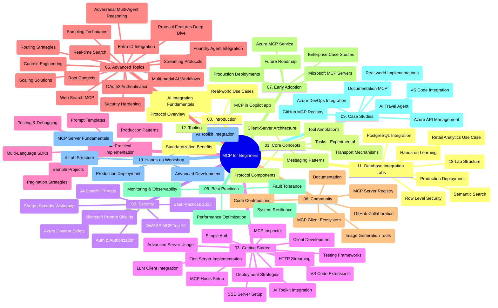

# Model Context Protocol (MCP) für Anfänger - Lernleitfaden

Dieser Lernleitfaden bietet einen Überblick über die Repository-Struktur und den Inhalt des Lehrplans "Model Context Protocol (MCP) für Anfänger". Verwenden Sie diesen Leitfaden, um sich effizient im Repository zurechtzufinden und die verfügbaren Ressourcen optimal zu nutzen.

## Repository-Übersicht

Das Model Context Protocol (MCP) ist ein standardisiertes Framework für Interaktionen zwischen KI-Modellen und Client-Anwendungen. Ursprünglich von Anthropic erstellt, wird MCP nun von der breiteren MCP-Community über die offizielle GitHub-Organisation gepflegt. Dieses Repository bietet einen umfassenden Lehrplan mit praxisnahen Code-Beispielen in C#, Java, JavaScript, Python und TypeScript, der sich an KI-Entwickler, Systemarchitekten und Softwareingenieure richtet.

## Visuelle Kurskarte

## Repository-Struktur

Das Repository ist in zwölf Hauptabschnitte gegliedert, die sich jeweils auf unterschiedliche Aspekte von MCP konzentrieren:

1. **Einführung (00-Introduction/)**
   - Übersicht zum Model Context Protocol
   - Warum Standardisierung im KI-Pipeline wichtig ist
   - Praktische Anwendungsfälle und Vorteile

2. **Kernkonzepte (01-CoreConcepts/)**
   - Client-Server-Architektur
   - Schlüsselkomponenten des Protokolls
   - Nachrichtenmuster im MCP
   - Aktuelle Spezifikation: [Was hat sich im MCP geändert: Die Spezifikation vom 2026-07-28](./01-CoreConcepts/mcp-2026-07-28.md) — der zustandslose Protokollkern, Erweiterungs-Framework und die Veraltung von Roots/Sampling/Logging

3. **Sicherheit (02-Security/)**
   - Sicherheitsbedrohungen in MCP-basierten Systemen
   - Best Practices zur Sicherung von Implementierungen
   - Authentifizierungs- und Autorisierungsstrategien
   - Praxisbeispiel [CIMD- und DCR-Autorisierungsbeispiel](./02-Security/samples/cimd-dcr-auth/README.md)
   - **Umfassende Sicherheitsdokumentation**:
     - MCP-Sicherheits-Best Practices
     - Azure Content Safety Implementierungsleitfaden
     - MCP-Sicherheitskontrollen und Techniken
     - MCP-Best-Practices Kurzreferenz
   - **Schlüsselthemen zur Sicherheit**:
     - Prompt Injection und Tool-Poisoning-Angriffe
     - Session Hijacking und Confused Deputy Probleme
     - Token-Passthrough-Schwachstellen
     - Übermäßige Berechtigungen und Zugriffskontrolle
     - Lieferkettensicherheit für KI-Komponenten
     - Integration von Microsoft Prompt Shields

4. **Erste Schritte (03-GettingStarted/)**
   - Einrichtung und Konfiguration der Umgebung
   - Erstellung grundlegender MCP Server und Clients
   - Integration in bestehende Anwendungen
   - Enthält Abschnitte zu:
     - Erste Serverimplementierung
     - Client-Entwicklung
     - LLM-Client-Integration
     - VS-Code-Integration
     - Server-Sent Events (SSE) Server
     - Fortgeschrittene Servernutzung
     - HTTP-Streaming
     - AI Toolkit Integration
     - Teststrategien
     - Bereitstellungsrichtlinien

5. **Praktische Implementierung (04-PracticalImplementation/)**
   - Verwendung von SDKs in verschiedenen Programmiersprachen
   - Debugging-, Test- und Validierungstechniken
   - Erstellung wiederverwendbarer Prompt-Vorlagen und Workflows
   - Musterprojekte mit Implementierungsbeispielen

6. **Fortgeschrittene Themen (05-AdvancedTopics/)**
   - Techniken des Context Engineerings
   - Integrationen des Foundry-Agenten
   - Multimodale KI-Workflows
   - OAuth2-Authentifizierungs-Demos
   - Echtzeit-Suchfunktionen
   - Echtzeit-Streaming
   - Implementierung von Root-Kontexten
   - Routing-Strategien
   - Sampling-Techniken
   - Skalierungsansätze
   - Sicherheitsaspekte
   - Integration der Entra ID Sicherheit
   - Web-Suchintegration
   - Adversarisches Multi-Agenten-Denken (Debattenmuster)

7. **Community-Beiträge (06-CommunityContributions/)**
   - Wie man Code und Dokumentation beisteuert
   - Zusammenarbeit über GitHub
   - Community-getriebene Verbesserungen und Feedback
   - Verwendung verschiedener MCP Clients (Claude Desktop, Cline, VSCode)
   - Arbeit mit populären MCP-Servern inklusive Bilderzeugung

8. **Erfahrungen aus der frühen Anwendung (07-LessonsfromEarlyAdoption/)**
   - Praxisbezogene Implementierungen und Erfolgsgeschichten
   - Aufbau und Einsatz MCP-basierter Lösungen
   - Trends und zukünftige Roadmap
   - **Microsoft MCP Server Leitfaden**: Umfassender Leitfaden zu 10 produktionsreifen Microsoft MCP-Servern, darunter:
     - Microsoft Learn Docs MCP Server
     - Azure MCP Server (15+ spezialisierte Konnektoren)
     - GitHub MCP Server
     - Azure DevOps MCP Server
     - MarkItDown MCP Server
     - SQL Server MCP Server
     - Playwright MCP Server
     - Dev Box MCP Server
     - Microsoft Foundry MCP Server
     - Microsoft 365 Agents Toolkit MCP Server

9. **Best Practices (08-BestPractices/)**
   - Performance-Tuning und Optimierung
   - Entwurf ausfallsicherer MCP-Systeme
   - Test- und Resilienzstrategien

10. **Fallstudien (09-CaseStudy/)**
    - **Sieben umfassende Fallstudien**, die die Vielseitigkeit von MCP in unterschiedlichen Szenarien demonstrieren:
    - **Azure KI-Reiseagenten**: Multi-Agenten-Orchestrierung mit Azure OpenAI und AI Search
    - **Azure DevOps Integration**: Automatisierung von Workflow-Prozessen mit YouTube-Datenaktualisierungen
    - **Echtzeit-Dokumentenabruf**: Python-Konsolenclient mit HTTP-Streaming
    - **Interaktiver Studienplan-Generator**: Chainlit-Web-App mit konversationeller KI
    - **In-Editor-Dokumentation**: VS-Code-Integration mit GitHub Copilot-Workflows
    - **Azure API Management**: Unternehmensweite API-Integration mit MCP-Server-Erstellung
    - **GitHub MCP Registry**: Ökosystementwicklung und agentenbasierte Integrationsplattform
    - Implementierungsbeispiele von Unternehmenseinbindung, Entwicklerproduktivität und Ökosystementwicklung

11. **Praxis-Workshop (10-StreamliningAIWorkflowsBuildingAnMCPServerWithAIToolkit/)**
    - Umfassender Praxis-Workshop, der MCP mit AI Toolkit kombiniert
    - Aufbau intelligenter Anwendungen, die KI-Modelle mit realen Werkzeugen verbinden
    - Praktische Module mit Grundlagen, individueller Serverentwicklung und Produktionsbereitstellungsstrategien
    - **Labor-Struktur**:
      - Labor 1: Grundlagen des MCP Servers
      - Labor 2: Fortgeschrittene MCP Server-Entwicklung
      - Labor 3: AI Toolkit Integration
      - Labor 4: Produktionseinführung und Skalierung
    - Lernansatz basierend auf Laboren mit Schritt-für-Schritt-Anleitungen

12. **MCP Server Datenbank-Integrationslabore (11-MCPServerHandsOnLabs/)**
    - **Umfassender 13-Lab Lernpfad** zum Aufbau produktionsreifer MCP-Server mit PostgreSQL-Integration
    - **Praxisnahe Einzelhandelsanalyse-Implementierung** anhand des Zava Retail Use Cases
    - **Unternehmensgerechte Muster** einschließlich Row Level Security (RLS), semantische Suche und Mehrmandanten-Datenzugriff
    - **Vollständige Labor-Struktur**:
      - **Labore 00-03: Grundlagen** – Einführung, Architektur, Sicherheit, Umgebungseinrichtung
      - **Labore 04-06: Aufbau des MCP Servers** – Datenbankdesign, MCP Server-Implementierung, Werkzeugentwicklung
      - **Labore 07-09: Fortgeschrittene Funktionen** – Semantische Suche, Testen & Debuggen, VS-Code-Integration
      - **Labore 10-12: Produktion & Best Practices** – Bereitstellung, Überwachung, Optimierung
    - **Abgedeckte Technologien**: FastMCP Framework, PostgreSQL, Azure OpenAI, Azure Container Apps, Application Insights
    - **Lernziele**: Produktionsreife MCP-Server, Datenbankintegrationsmuster, KI-gestützte Analysen, Unternehmenssicherheit

13. **Werkzeuge (12-tooling/)**
    - Lernen, wie MCP in der Copilot-App und anderen Werkzeugen verwendet wird

## Zusätzliche Ressourcen

Das Repository enthält unterstützende Ressourcen:

- **Bilderordner**: Enthält Diagramme und Illustrationen, die im Lehrplan verwendet werden
- **Übersetzungen**: Mehrsprachige Unterstützung mit automatisierten Übersetzungen der Dokumentation
- **Offizielle MCP-Ressourcen**:
  - [MCP-Dokumentation](https://modelcontextprotocol.io/)
  - [MCP-Spezifikation](https://modelcontextprotocol.io/specification/2026-07-28/)
  - [MCP GitHub Repository](https://github.com/modelcontextprotocol)

## So verwenden Sie dieses Repository

1. **Sequenzielles Lernen**: Folgen Sie den Kapiteln in der Reihenfolge (00 bis 11) für ein strukturiertes Lernerlebnis.
2. **Sprachspezifischer Schwerpunkt**: Wenn Sie an einer bestimmten Programmiersprache interessiert sind, erkunden Sie die Beispieldirektoren für Implementierungen in Ihrer bevorzugten Sprache.
3. **Praktische Umsetzung**: Beginnen Sie mit dem Abschnitt "Erste Schritte", um Ihre Umgebung einzurichten und Ihren ersten MCP-Server und Client zu erstellen.
4. **Vertiefte Erkundung**: Sobald Sie sich mit den Grundlagen vertraut gemacht haben, vertiefen Sie Ihr Wissen in den fortgeschrittenen Themen.
5. **Community-Beteiligung**: Treten Sie der MCP-Community über GitHub-Diskussionen und Discord-Kanäle bei, um sich mit Experten und anderen Entwicklern zu vernetzen.

## MCP Clients und Werkzeuge

Der Lehrplan umfasst verschiedene MCP-Clients und Werkzeuge:

1. **Offizielle Clients**:
   - Visual Studio Code
   - MCP in Visual Studio Code
   - Claude Desktop
   - Claude in VSCode
   - Claude API

2. **Community-Clients**:
   - Cline (terminalbasiert)
   - Cursor (Code-Editor)
   - ChatMCP
   - Windsurf

3. **MCP-Verwaltungstools**:
   - MCP CLI
   - MCP Manager
   - MCP Linker
   - MCP Router

## Beliebte MCP-Server

Das Repository stellt verschiedene MCP-Server vor, darunter:

1. **Offizielle Microsoft MCP-Server**:
   - Microsoft Learn Docs MCP Server
   - Azure MCP Server (15+ spezialisierte Konnektoren)
   - GitHub MCP Server
   - Azure DevOps MCP Server
   - MarkItDown MCP Server
   - SQL Server MCP Server
   - Playwright MCP Server
   - Dev Box MCP Server
   - Microsoft Foundry MCP Server
   - Microsoft 365 Agents Toolkit MCP Server

2. **Offizielle Referenzserver**:
   - Dateisystem
   - Fetch
   - Speicher
   - Sequentielles Denken

3. **Bildgenerierung**:
   - Azure OpenAI DALL-E 3
   - Stable Diffusion WebUI
   - Replicate

4. **Entwicklungswerkzeuge**:
   - Git MCP
   - Terminal Control
   - Code Assistant

5. **Spezialisierte Server**:
   - Salesforce
   - Microsoft Teams
   - Jira & Confluence

## Mitwirken

Dieses Repository begrüßt Beiträge aus der Community. Siehe den Abschnitt Community-Beiträge für Anleitungen, wie Sie effektiv zum MCP-Ökosystem beitragen können.

----

*Dieser Lernleitfaden wurde zuletzt am 9. September 2026 aktualisiert. Er spiegelt die MCP
Spezifikation `2026-07-28` wider, die aktuelle Protokollrevision. Einige Praxisbeispiele
sind weiterhin explizit auf `2025-11-25` versioniert, während ihre SDKs und Werkzeuge
die zustandslosen Protokoll-APIs übernehmen.*

---

<!-- CO-OP TRANSLATOR DISCLAIMER START -->
**Haftungsausschluss**:
Dieses Dokument wurde mit dem KI-Übersetzungsdienst [Co-op Translator](https://github.com/Azure/co-op-translator) übersetzt. Obwohl wir uns um Genauigkeit bemühen, beachten Sie bitte, dass automatisierte Übersetzungen Fehler oder Ungenauigkeiten enthalten können. Das Originaldokument in seiner Ursprungssprache gilt als maßgebliche Quelle. Bei kritischen Informationen wird eine professionelle menschliche Übersetzung empfohlen. Wir übernehmen keine Haftung für Missverständnisse oder Fehlinterpretationen, die aus der Verwendung dieser Übersetzung entstehen.
<!-- CO-OP TRANSLATOR DISCLAIMER END -->