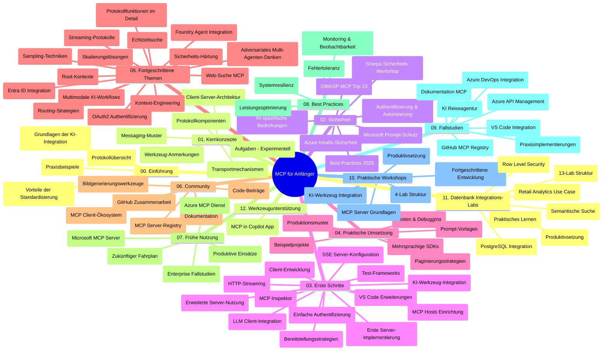

# Model Context Protocol (MCP) für Einsteiger – Lernleitfaden

Dieser Lernleitfaden bietet einen Überblick über die Repository-Struktur und den Inhalt des Curriculums „Model Context Protocol (MCP) für Einsteiger“. Verwenden Sie diesen Leitfaden, um sich effizient im Repository zurechtzufinden und die verfügbaren Ressourcen optimal zu nutzen.

## Überblick über das Repository

Das Model Context Protocol (MCP) ist ein standardisiertes Framework für die Interaktion zwischen KI-Modellen und Client-Anwendungen. Ursprünglich von Anthropic erstellt, wird MCP nun von der breiteren MCP-Community über die offizielle GitHub-Organisation gepflegt. Dieses Repository bietet ein umfassendes Curriculum mit praktischen Codebeispielen in C#, Java, JavaScript, Python und TypeScript, das für KI-Entwickler, Systemarchitekten und Softwareingenieure konzipiert ist.

## Visuelle Curriculum-Karte

## Repository-Struktur

Das Repository ist in zwölf Hauptabschnitte gegliedert, die jeweils unterschiedliche Aspekte von MCP abdecken:

1. **Einführung (00-Introduction/)**
   - Überblick über das Model Context Protocol
   - Warum Standardisierung in KI-Pipelines wichtig ist
   - Praktische Anwendungsfälle und Vorteile

2. **Kernkonzepte (01-CoreConcepts/)**
   - Client-Server-Architektur
   - Wichtige Protokollkomponenten
   - Messaging-Muster im MCP
   - Ausblick: [Was sich im MCP ändert: Der Release Candidate vom 28.07.2026](./01-CoreConcepts/mcp-2026-07-28-release-candidate.md) — der zustandslose Protokollkern, Erweiterungs-Framework und erwartete Deprecations von Roots/Sampling/Logging in der nächsten Spezifikationsversion

3. **Sicherheit (02-Security/)**
   - Sicherheitsbedrohungen in MCP-basierten Systemen
   - Best Practices zur Sicherung von Implementierungen
   - Authentifizierungs- und Autorisierungsstrategien
   - **Umfassende Sicherheitsdokumentation**:
     - MCP Sicherheits-Best Practices 2025
     - Azure Content Safety Implementierungsleitfaden
     - MCP Sicherheitskontrollen und Techniken
     - MCP Best Practices Schnellreferenz
   - **Wichtige Sicherheitsthemen**:
     - Prompt Injection und Tool-Poisoning-Angriffe
     - Session Hijacking und Confused Deputy Probleme
     - Token-Passthrough-Schwachstellen
     - Übermäßige Berechtigungen und Zugriffskontrolle
     - Supply Chain Sicherheit für KI-Komponenten
     - Microsoft Prompt Shields Integration

4. **Erste Schritte (03-GettingStarted/)**
   - Einrichtung der Umgebung und Konfiguration
   - Erstellung von einfachen MCP-Servern und Clients
   - Integration in bestehende Anwendungen
   - Beinhaltet Sektionen für:
     - Erste Serverimplementierung
     - Cliententwicklung
     - LLM Client-Integration
     - VS Code Integration
     - Server-Sent Events (SSE) Server
     - Fortgeschrittene Servernutzung
     - HTTP-Streaming
     - AI Toolkit Integration
     - Teststrategien
     - Deployment-Richtlinien

5. **Praktische Implementierung (04-PracticalImplementation/)**
   - Nutzung von SDKs in verschiedenen Programmiersprachen
   - Debugging-, Test- und Validierungstechniken
   - Erstellen wiederverwendbarer Prompt-Vorlagen und Workflows
   - Beispielprojekte mit Implementierungsbeispielen

6. **Fortgeschrittene Themen (05-AdvancedTopics/)**
   - Techniken des Kontext-Engineerings
   - Foundry Agent-Integration
   - Multi-modale KI-Workflows
   - OAuth2 Authentifizierungs-Demos
   - Echtzeit-Suchfunktionalitäten
   - Echtzeit-Streaming
   - Root-Context-Implementierung
   - Routing-Strategien
   - Sampling-Techniken
   - Skalierungsansätze
   - Sicherheitsaspekte
   - Entra ID Sicherheitsintegration
   - Web-Suchintegration
   - Adversariale Multi-Agent Reasoning (Debattenmuster)

7. **Community-Beiträge (06-CommunityContributions/)**
   - Wie man Code und Dokumentation beiträgt
   - Zusammenarbeit über GitHub
   - Community-getriebene Verbesserungen und Feedback
   - Nutzung verschiedener MCP-Clients (Claude Desktop, Cline, VSCode)
   - Arbeiten mit beliebten MCP-Servern inklusive Bilderzeugung

8. **Erfahrungen aus früher Einführung (07-LessonsfromEarlyAdoption/)**
   - Praxisnahe Implementierungen und Erfolgsgeschichten
   - Aufbau und Deployment MCP-basierter Lösungen
   - Trends und zukünftige Roadmap
   - **Microsoft MCP Servers Guide**: Umfassender Leitfaden zu 10 produktionsreifen Microsoft MCP-Servern einschließlich:
     - Microsoft Learn Docs MCP Server
     - Azure MCP Server (15+ spezialisierte Connectoren)
     - GitHub MCP Server
     - Azure DevOps MCP Server
     - MarkItDown MCP Server
     - SQL Server MCP Server
     - Playwright MCP Server
     - Dev Box MCP Server
     - Microsoft Foundry MCP Server
     - Microsoft 365 Agents Toolkit MCP Server

9. **Best Practices (08-BestPractices/)**
   - Performance-Tuning und Optimierung
   - Entwurf fehlertoleranter MCP-Systeme
   - Test- und Resilienzstrategien

10. **Fallstudien (09-CaseStudy/)**
    - **Sieben umfassende Fallstudien** zeigen die Vielseitigkeit von MCP in verschiedenen Szenarien:
    - **Azure AI Travel Agents**: Multi-Agent-Orchestrierung mit Azure OpenAI und AI Search
    - **Azure DevOps Integration**: Automatisierung von Workflow-Prozessen mit YouTube-Datenupdates
    - **Echtzeit-Dokumentenabruf**: Python-Konsolenclient mit HTTP-Streaming
    - **Interaktiver Lernplan-Generator**: Chainlit Web-App mit konversationeller KI
    - **In-Editor-Dokumentation**: VS Code Integration mit GitHub Copilot Workflows
    - **Azure API Management**: Enterprise API-Integration mit MCP Server-Erstellung
    - **GitHub MCP Registry**: Ökosystementwicklung und agentische Integrationsplattform
    - Implementierungsbeispiele von Enterprise-Integration, Entwicklerproduktivität bis Ökosystementwicklung

11. **Praxis-Workshop (10-StreamliningAIWorkflowsBuildingAnMCPServerWithAIToolkit/)**
    - Umfassender praktischer Workshop zur Kombination von MCP mit AI Toolkit
    - Entwicklung intelligenter Anwendungen, die KI-Modelle mit realen Tools verbinden
    - Praktische Module zu Grundlagen, eigener Serverentwicklung und Produktions-Deployment-Strategien
    - **Lab-Struktur**:
      - Lab 1: Grundlagen des MCP Servers
      - Lab 2: Fortgeschrittene MCP Server-Entwicklung
      - Lab 3: AI Toolkit Integration
      - Lab 4: Produktion, Deployment und Skalierung
    - Lab-basiertes Lernen mit Schritt-für-Schritt-Anweisungen

12. **MCP Server Datenbank-Integrations-Labs (11-MCPServerHandsOnLabs/)**
    - **Umfassender 13-Lab Lernpfad** zum Bau produktionsreifer MCP-Server mit PostgreSQL-Integration
    - **Praxisnahe Retail-Analyse** mit dem Zava Retail Use Case
    - **Enterprise-Level-Muster** wie Row Level Security (RLS), semantische Suche und Multi-Tenant Datenzugriff
    - **Komplette Lab-Struktur**:
      - **Labs 00-03: Grundlagen** – Einführung, Architektur, Sicherheit, Einrichtung der Umgebung
      - **Labs 04-06: Bau des MCP Servers** – Datenbankdesign, MCP Server Implementierung, Tool-Entwicklung
      - **Labs 07-09: Fortgeschrittene Funktionen** – Semantische Suche, Testen & Debuggen, VS Code Integration
      - **Labs 10-12: Produktion & Best Practices** – Deployment, Monitoring, Optimierung
    - **Behandelte Technologien**: FastMCP-Framework, PostgreSQL, Azure OpenAI, Azure Container Apps, Application Insights
    - **Lernergebnisse**: Produktionsreife MCP-Server, Datenbank-Integrationsmuster, KI-gestützte Analyse, Enterprise-Sicherheit

13. **Werkzeuge (12-tooling/)**
    - Lernen, wie MCP in Copilot-App und anderen Werkzeugen verwendet wird

## Zusätzliche Ressourcen

Das Repository enthält unterstützende Ressourcen:

- **Images-Ordner**: Enthält Diagramme und Illustrationen, die im Curriculum verwendet werden
- **Übersetzungen**: Mehrsprachige Unterstützung mit automatisierten Übersetzungen der Dokumentation
- **Offizielle MCP-Ressourcen**:
  - [MCP Dokumentation](https://modelcontextprotocol.io/)
  - [MCP Spezifikation](https://spec.modelcontextprotocol.io/)
  - [MCP GitHub Repository](https://github.com/modelcontextprotocol)

## Wie Sie dieses Repository nutzen

1. **Sequenzielles Lernen**: Folgen Sie den Kapiteln in der Reihenfolge (00 bis 11) für ein strukturiertes Lernerlebnis.
2. **Sprachspezifischer Fokus**: Wenn Sie an einer bestimmten Programmiersprache interessiert sind, durchsuchen Sie die Sample-Verzeichnisse für Implementierungen in Ihrer bevorzugten Sprache.
3. **Praktische Implementierung**: Beginnen Sie mit dem Abschnitt „Erste Schritte“, um Ihre Umgebung einzurichten und Ihren ersten MCP-Server und Client zu erstellen.
4. **Fortgeschrittene Erkundung**: Sobald Sie mit den Grundlagen vertraut sind, tauchen Sie in die fortgeschrittenen Themen ein, um Ihr Wissen zu erweitern.
5. **Community-Engagement**: Treten Sie der MCP-Community über GitHub-Diskussionen und Discord-Kanäle bei, um sich mit Experten und anderen Entwicklern zu vernetzen.

## MCP-Clients und Tools

Das Curriculum behandelt verschiedene MCP-Clients und Tools:

1. **Offizielle Clients**:
   - Visual Studio Code
   - MCP in Visual Studio Code
   - Claude Desktop
   - Claude in VSCode
   - Claude API

2. **Community-Clients**:
   - Cline (terminalbasiert)
   - Cursor (Code-Editor)
   - ChatMCP
   - Windsurf

3. **MCP Management Tools**:
   - MCP CLI
   - MCP Manager
   - MCP Linker
   - MCP Router

## Beliebte MCP-Server

Das Repository stellt verschiedene MCP-Server vor, darunter:

1. **Offizielle Microsoft MCP-Server**:
   - Microsoft Learn Docs MCP Server
   - Azure MCP Server (15+ spezialisierte Connectoren)
   - GitHub MCP Server
   - Azure DevOps MCP Server
   - MarkItDown MCP Server
   - SQL Server MCP Server
   - Playwright MCP Server
   - Dev Box MCP Server
   - Microsoft Foundry MCP Server
   - Microsoft 365 Agents Toolkit MCP Server

2. **Offizielle Referenzserver**:
   - Filesystem
   - Fetch
   - Memory
   - Sequential Thinking

3. **Bilderzeugung**:
   - Azure OpenAI DALL-E 3
   - Stable Diffusion WebUI
   - Replicate

4. **Entwicklungswerkzeuge**:
   - Git MCP
   - Terminal Control
   - Code Assistant

5. **Spezialisierte Server**:
   - Salesforce
   - Microsoft Teams
   - Jira & Confluence

## Mitwirken

Dieses Repository freut sich über Beiträge aus der Community. Siehe den Abschnitt Community-Beiträge für Hinweise, wie Sie effektiv zum MCP-Ökosystem beitragen können.

----

*Dieser Lernleitfaden wurde zuletzt am 5. Februar 2026 aktualisiert und spiegelt die neueste MCP Spezifikation 2025-11-25 wider sowie den Stand des Repositories zu diesem Datum. Der Inhalt des Repositories kann nach diesem Datum aktualisiert worden sein.*

*Addendum (2. Juli 2026): Eine Lektion zum `2026-07-28` MCP Spezifikations-Release Candidate wurde unter [01-CoreConcepts](./01-CoreConcepts/mcp-2026-07-28-release-candidate.md) hinzugefügt; die Curriculum-Basis bleibt bis zur Auslieferung der neuen Spezifikation 2025-11-25.*

---

<!-- CO-OP TRANSLATOR DISCLAIMER START -->
**Haftungsausschluss**:
Dieses Dokument wurde mit dem KI-Übersetzungsdienst [Co-op Translator](https://github.com/Azure/co-op-translator) übersetzt. Obwohl wir uns um Genauigkeit bemühen, beachten Sie bitte, dass automatisierte Übersetzungen Fehler oder Ungenauigkeiten enthalten können. Das Originaldokument in seiner Ursprungssprache gilt als maßgebliche Quelle. Bei kritischen Informationen wird eine professionelle menschliche Übersetzung empfohlen. Wir übernehmen keine Haftung für Missverständnisse oder Fehlinterpretationen, die aus der Verwendung dieser Übersetzung entstehen.
<!-- CO-OP TRANSLATOR DISCLAIMER END -->