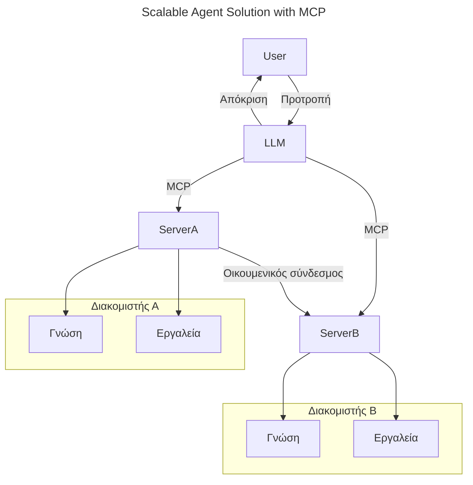
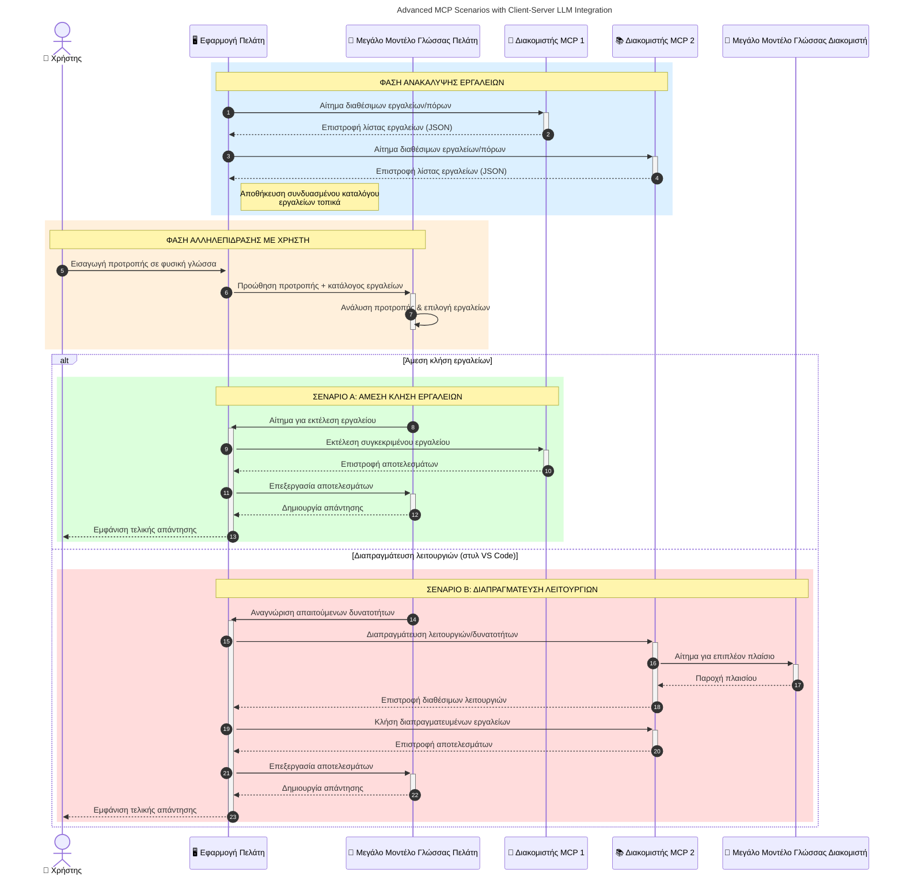

# Εισαγωγή στο Πρωτόκολλο Πλαισίου Μοντέλου (MCP): Γιατί Είναι Σημαντικό για Κλιμακώσιμες Εφαρμογές Τεχνητής Νοημοσύνης

[](https://youtu.be/agBbdiOPLQA)

_(Κάντε κλικ στην εικόνα παραπάνω για να δείτε το βίντεο αυτού του μαθήματος)_

Οι εφαρμογές Γενετικής Τεχνητής Νοημοσύνης αποτελούν ένα μεγάλο βήμα προόδου καθώς συχνά επιτρέπουν στον χρήστη να αλληλεπιδρά με την εφαρμογή χρησιμοποιώντας φυσικές γλωσσικές εντολές. Ωστόσο, καθώς επενδύεται περισσότερο χρόνος και πόροι σε τέτοιες εφαρμογές, θέλετε να βεβαιωθείτε ότι μπορείτε εύκολα να ενσωματώσετε λειτουργικότητες και πόρους με τέτοιο τρόπο ώστε να είναι εύκολο να επεκταθούν, ότι η εφαρμογή σας μπορεί να υποστηρίξει τη χρήση περισσότερων από ένα μοντέλων και να διαχειριστεί διάφορες ιδιαιτερότητες μοντέλου. Με λίγα λόγια, η δημιουργία εφαρμογών Γενετικής ΤΝ είναι εύκολη στην αρχή, αλλά καθώς μεγαλώνουν και γίνονται πιο πολύπλοκες, χρειάζεται να αρχίσετε να ορίζετε μια αρχιτεκτονική και πιθανότατα να βασιστείτε σε ένα πρότυπο για να διασφαλίσετε ότι οι εφαρμογές σας κατασκευάζονται με συνεπή τρόπο. Εδώ έρχεται το MCP για να οργανώσει τα πράγματα και να παρέχει ένα πρότυπο.

---

## **🔍 Τι Είναι το Πρωτόκολλο Πλαισίου Μοντέλου (MCP);**

Το **Πρωτόκολλο Πλαισίου Μοντέλου (MCP)** είναι μια **ανοιχτή, τυποποιημένη διεπαφή** που επιτρέπει στα Μεγάλα Γλωσσικά Μοντέλα (LLMs) να αλληλεπιδρούν απρόσκοπτα με εξωτερικά εργαλεία, API και πηγές δεδομένων. Παρέχει μια συνεπή αρχιτεκτονική για την ενίσχυση της λειτουργικότητας των μοντέλων τεχνητής νοημοσύνης πέρα από τα δεδομένα εκπαίδευσης, επιτρέποντας πιο έξυπνα, κλιμακώσιμα και πιο ανταποκρινόμενα συστήματα ΤΝ.

---

## **🎯 Γιατί η Τυποποίηση στην ΤΝ Είναι Σημαντική**

Καθώς οι εφαρμογές γενετικής ΤΝ γίνονται πιο πολύπλοκες, είναι ουσιώδης η υιοθέτηση προτύπων που διασφαλίζουν **κλιμακωσιμότητα, επεκτασιμότητα, συντηρησιμότητα** και την **αποφυγή εγκλωβισμού από προμηθευτές**. Το MCP αντιμετωπίζει αυτές τις ανάγκες μέσω:

- Ενοποίησης των ενσωματώσεων μοντέλων-εργαλείων  
- Μείωσης εύθραυστων, μεμονωμένων προσαρμοσμένων λύσεων  
- Επιτρέποντας σε πολλαπλά μοντέλα από διαφορετικούς προμηθευτές να συνυπάρχουν σε ένα οικοσύστημα  

**Σημείωση:** Παρόλο που το MCP παρουσιάζεται ως ανοιχτό πρότυπο, δεν υπάρχουν σχέδια για τυποποίηση του MCP μέσω οποιουδήποτε υπάρχοντος οργανισμού τυποποίησης όπως τα IEEE, IETF, W3C, ISO ή άλλου.

---

## **📚 Μαθησιακοί Στόχοι**

Μέχρι το τέλος αυτού του άρθρου, θα μπορείτε να:

- Ορίσετε το **Πρωτόκολλο Πλαισίου Μοντέλου (MCP)** και τις χρήσεις του  
- Κατανοήσετε πώς το MCP τυποποιεί την επικοινωνία μοντέλου-εργαλείου  
- Προσδιορίσετε τα βασικά συστατικά της αρχιτεκτονικής MCP  
- Εξερευνήσετε πραγματικές εφαρμογές του MCP σε επιχειρησιακά και αναπτυξιακά περιβάλλοντα  

---

## **💡 Γιατί το Πρωτόκολλο Πλαισίου Μοντέλου (MCP) Είναι Αλλαγή Παιχνιδιού**

### **🔗 Το MCP Λύνει τη Διασπορά στις Αλληλεπιδράσεις ΤΝ**

Πριν το MCP, η ενσωμάτωση μοντέλων με εργαλεία απαιτούσε:

- Προσαρμοσμένο κώδικα για κάθε ζεύγος εργαλείων-μοντέλου  
- Μη τυποποιημένα API για κάθε προμηθευτή  
- Συχνές διακοπές λόγω ενημερώσεων  
- Κακή κλιμακωσιμότητα με περισσότερα εργαλεία  

### **✅ Οφέλη της Τυποποίησης MCP**

| **Όφελος**               | **Περιγραφή**                                                                   |
|--------------------------|--------------------------------------------------------------------------------|
| Διαλειτουργικότητα       | Τα LLMs συνεργάζονται απρόσκοπτα με εργαλεία από διαφορετικούς προμηθευτές      |
| Συνέπεια                 | Ομοιόμορφη συμπεριφορά σε πλατφόρμες και εργαλεία                               |
| Επαναχρησιμοποίηση       | Τα εργαλεία που δημιουργούνται μία φορά μπορούν να χρησιμοποιηθούν σε έργα και συστήματα |
| Επιταχυνόμενη Ανάπτυξη  | Μείωση χρόνου ανάπτυξης με χρήση τυποποιημένων, plug-and-play διεπαφών          |

---

## **🧱 Επισκόπηση της Υψηλού Επιπέδου Αρχιτεκτονικής MCP**

Το MCP ακολουθεί ένα **μοντέλο πελάτη-διακομιστή**, όπου:

- Οι **Φιλοξενούντες MCP** τρέχουν τα μοντέλα ΤΝ  
- Οι **Πελάτες MCP** ξεκινούν αιτήματα  
- Οι **Διακομιστές MCP** παρέχουν πλαίσιο, εργαλεία και δυνατότητες  

### **Βασικά Συστατικά:**

- **Πόροι** – Στατικά ή δυναμικά δεδομένα για μοντέλα  
- **Προτροπές** – Προκαθορισμένες ροές εργασίας για καθοδηγούμενη δημιουργία  
- **Εργαλεία** – Εκτελέσιμες λειτουργίες όπως αναζήτηση, υπολογισμοί  
- **Δειγματοληψία** – Συμπεριφορά πράκτορα μέσω αναδρομικών αλληλεπιδράσεων (καταργείται στο
    MCP `2026-07-28`; οι νέες υλοποιήσεις πρέπει να ενσωματωθούν απευθείας με έναν
    πάροχο LLM)
- **Εξαγωγή Πληροφοριών** – Αιτήματα που ξεκινούν οι διακομιστές για είσοδο από τον χρήστη  
- **Ρίζες** – Πληροφοριακές τοποθεσίες συστήματος αρχείων σχετικές με τον διακομιστή  
    (καταργούνται στο MCP `2026-07-28`; προτιμώνται παράμετροι εργαλείων, URIs πόρων ή
    ρυθμίσεις διακομιστή)

### **Αρχιτεκτονική Πρωτοκόλλου:**

Το MCP χρησιμοποιεί μια αρχιτεκτονική δύο στρωμάτων:
- **Επίπεδο Δεδομένων**: μηνύματα JSON-RPC 2.0, μεταδεδομένα ανά αίτημα, ανακάλυψη, και
    πρωτόκολλα  
- **Επίπεδο Μεταφοράς**: stdio για τοπικές διεργασίες και Streamable HTTP για
    απομακρυσμένους διακομιστές. Το Streamable HTTP μπορεί να χρησιμοποιεί πλαίσιο SSE για ροές
    απαντήσεων, αλλά το παλαιότερο HTTP+SSE μεταφορικό μέσο καταργείται.

---

## Πώς Λειτουργούν οι Διακομιστές MCP

Οι διακομιστές MCP λειτουργούν ως εξής:

- **Ροή Αιτήματος**:
    1. Ένα αίτημα ξεκινά από τελικό χρήστη ή λογισμικό που ενεργεί εκ μέρους του.  
    2. Ο **Πελάτης MCP** στέλνει το αίτημα σε έναν **Φιλοξενούντα MCP**, που διαχειρίζεται το runtime του μοντέλου ΤΝ.  
    3. Το **Μοντέλο ΤΝ** λαμβάνει την προτροπή του χρήστη και μπορεί να ζητήσει πρόσβαση σε εξωτερικά εργαλεία ή δεδομένα μέσω ενός ή περισσοτέρων κλήσεων εργαλείων.  
    4. Ο **Φιλοξενούντας MCP**, όχι το μοντέλο άμεσα, επικοινωνεί με τον κατάλληλο **Διακομιστή/Διακομιστές MCP** χρησιμοποιώντας το τυποποιημένο πρωτόκολλο.  
- **Λειτουργικότητα Φιλοξενούντα MCP**:
    - **Κατάλογος Εργαλείων**: Διατηρεί κατάλογο διαθέσιμων εργαλείων και των δυνατοτήτων τους.  
    - **Πιστοποίηση**: Επαληθεύει δικαιώματα για πρόσβαση σε εργαλεία.  
    - **Διαχειριστής Αιτήσεων**: Επεξεργάζεται εισερχόμενα αιτήματα εργαλείων από το μοντέλο.  
    - **Μορφοποιητής Απαντήσεων**: Διαμορφώνει τις εξόδους εργαλείων σε μορφή που κατανοεί το μοντέλο.  
- **Εκτέλεση Διακομιστή MCP**:
    - Ο **Φιλοξενούντας MCP** δρομολογεί τις κλήσεις εργαλείων σε έναν ή περισσότερους **Διακομιστές MCP**, ο καθένας παρουσιάζοντας εξειδικευμένες λειτουργίες (π.χ., αναζήτηση, υπολογισμοί, ερωτήματα βάσεων δεδομένων).  
    - Οι **Διακομιστές MCP** εκτελούν τις αντίστοιχες λειτουργίες τους και επιστρέφουν τα αποτελέσματα στον **Φιλοξενούντα MCP** σε συνεπή μορφή.  
    - Ο **Φιλοξενούντας MCP** μορφοποιεί και προωθεί αυτά τα αποτελέσματα στο **Μοντέλο ΤΝ**.  
- **Ολοκλήρωση Απάντησης**:
    - Το **Μοντέλο ΤΝ** ενσωματώνει τις εξόδους εργαλείων σε μια τελική απάντηση.  
    - Ο **Φιλοξενούντας MCP** στέλνει αυτή την απάντηση πίσω στον **Πελάτη MCP**, που την παραδίδει στον τελικό χρήστη ή το καλούν λογισμικό.  
    

```mermaid
---
title: MCP Architecture and Component Interactions
description: A diagram showing the flows of the components in MCP.
---
graph TD
    Client[Πελάτης/Εφαρμογή MCP] -->|Αποστέλλει Αίτημα| H[Φιλοξενία MCP]
    H -->|Επικαλείται| A[Μοντέλο ΤΝ]
    A -->|Αίτημα Κλήσης Εργαλείου| H
    H -->|MCP Protocol| T1[MCP Server Tool 01: Αναζήτηση Ιστού]
    H -->|MCP Protocol| T2[MCP Server Tool 02: Εργαλείο Αριθμομηχανής]
    H -->|MCP Protocol| T3[MCP Server Tool 03: Εργαλείο Πρόσβασης Βάσης Δεδομένων]
    H -->|MCP Protocol| T4[MCP Server Tool 04: Εργαλείο Συστήματος Αρχείων]
    H -->|Αποστέλλει Απόκριση| Client

    subgraph "Συστατικά Φιλοξενίας MCP"
        H
        G[Μητρώο Εργαλείων]
        I[Πιστοποίηση]
        J[Διαχειριστής Αιτημάτων]
        K[Μορφοποιητής Αποκρίσεων]
    end

    H <--> G
    H <--> I
    H <--> J
    H <--> K

    style A fill:#f9d5e5,stroke:#333,stroke-width:2px
    style H fill:#eeeeee,stroke:#333,stroke-width:2px
    style Client fill:#d5e8f9,stroke:#333,stroke-width:2px
    style G fill:#fffbe6,stroke:#333,stroke-width:1px
    style I fill:#fffbe6,stroke:#333,stroke-width:1px
    style J fill:#fffbe6,stroke:#333,stroke-width:1px
    style K fill:#fffbe6,stroke:#333,stroke-width:1px
    style T1 fill:#c2f0c2,stroke:#333,stroke-width:1px
    style T2 fill:#c2f0c2,stroke:#333,stroke-width:1px
    style T3 fill:#c2f0c2,stroke:#333,stroke-width:1px
    style T4 fill:#c2f0c2,stroke:#333,stroke-width:1px
```

## 👨‍💻 Πώς να Δημιουργήσετε έναν Διακομιστή MCP (με Παραδείγματα)

Οι διακομιστές MCP σας επιτρέπουν να επεκτείνετε τις δυνατότητες των LLM παρέχοντας δεδομένα και λειτουργικότητα. 

Έτοιμοι να το δοκιμάσετε; Εδώ είναι SDKs που είναι ειδικά για γλώσσες και/ή στοίβες με παραδείγματα δημιουργίας απλών διακομιστών MCP σε διαφορετικές γλώσσες/στοίβες:  

- **Python SDK**: https://github.com/modelcontextprotocol/python-sdk  

- **TypeScript SDK**: https://github.com/modelcontextprotocol/typescript-sdk  

- **Java SDK**: https://github.com/modelcontextprotocol/java-sdk  

- **C#/.NET SDK**: https://github.com/modelcontextprotocol/csharp-sdk  


## 🌍 Πραγματικές Χρήσεις του MCP

Το MCP επιτρέπει μια ευρεία γκάμα εφαρμογών επεκτείνοντας τις δυνατότητες ΤΝ:

| **Εφαρμογή**               | **Περιγραφή**                                                                   |
|------------------------------|--------------------------------------------------------------------------------|
| Επιχειρησιακή Ενοποίηση Δεδομένων  | Σύνδεση LLMs με βάσεις δεδομένων, CRM ή εσωτερικά εργαλεία                     |
| Συστημάτων Πράκτορα ΤΝ       | Ενεργοποίηση αυτόνομων πρακτόρων με πρόσβαση σε εργαλεία και ροές λήψης αποφάσεων  |
| Πολυμορφικές Εφαρμογές       | Συνδυασμός κειμένου, εικόνας και ήχου μέσα σε μια ενοποιημένη εφαρμογή ΤΝ       |
| Ενοποίηση Δεδομένων σε Πραγματικό Χρόνο | Εισαγωγή ζωντανών δεδομένων στις αλληλεπιδράσεις ΤΝ για πιο ακριβείς και τρέχουσες εξόδους |


### 🧠 MCP = Παγκόσμιο Πρότυπο για Αλληλεπιδράσεις ΤΝ

Το Πρωτόκολλο Πλαισίου Μοντέλου (MCP) λειτουργεί ως ένα παγκόσμιο πρότυπο για τις αλληλεπιδράσεις ΤΝ, όπως το USB-C τυποποίησε τις φυσικές συνδέσεις για συσκευές. Στον κόσμο της ΤΝ, το MCP παρέχει μια συνεπή διεπαφή, επιτρέποντας στα μοντέλα (πελάτες) να ενσωματωθούν απρόσκοπτα με εξωτερικά εργαλεία και παρόχους δεδομένων (διακομιστές). Αυτό καταργεί την ανάγκη για πλήθος διαφορετικών, προσαρμοσμένων πρωτοκόλλων για κάθε API ή πηγή δεδομένων.

Σύμφωνα με το MCP, ένα εργαλείο συμβατό με MCP (αναφερόμενο ως διακομιστής MCP) ακολουθεί ένα ενοποιημένο πρότυπο. Αυτοί οι διακομιστές μπορούν να απαριθμούν τα εργαλεία ή τις δράσεις που προσφέρουν και να εκτελούν αυτές τις δράσεις όταν ζητηθούν από έναν πράκτορα ΤΝ. Οι πλατφόρμες πρακτόρων ΤΝ που υποστηρίζουν MCP μπορούν να ανακαλύπτουν διαθέσιμα εργαλεία από τους διακομιστές και να τα καλούν μέσω αυτού του τυποποιημένου πρωτοκόλλου.

### 💡 Διευκολύνει την πρόσβαση στη γνώση

Πέρα από την προσφορά εργαλείων, το MCP διευκολύνει επίσης την πρόσβαση στη γνώση. Επιτρέπει στις εφαρμογές να παρέχουν πλαίσιο στα μεγάλα γλωσσικά μοντέλα (LLMs) συνδέοντάς τα με διάφορες πηγές δεδομένων. Για παράδειγμα, ένας διακομιστής MCP μπορεί να αντιπροσωπεύει μια αποθήκη εγγράφων εταιρείας, επιτρέποντας στους πράκτορες να ανακτούν σχετικές πληροφορίες κατόπιν ζήτησης. Ένας άλλος διακομιστής μπορεί να διαχειρίζεται συγκεκριμένες ενέργειες όπως αποστολή ηλεκτρονικών μηνυμάτων ή ενημέρωση αρχείων. Από την οπτική γωνία του πράκτορα, αυτά είναι απλώς εργαλεία που μπορεί να χρησιμοποιήσει—κάποια επιστρέφουν δεδομένα (πλαίσιο γνώσης), ενώ άλλα εκτελούν ενέργειες. Το MCP διαχειρίζεται και τα δύο αποτελεσματικά.

Ένας πράκτορας που συνδέεται σε διακομιστή MCP μαθαίνει αυτόματα τις διαθέσιμες δυνατότητες και τα προσβάσιμα δεδομένα του διακομιστή μέσω μιας τυπικής μορφής. Αυτή η τυποποίηση επιτρέπει τη δυναμική διαθεσιμότητα εργαλείων. Για παράδειγμα, προσθέτοντας έναν νέο διακομιστή MCP στο σύστημα ενός πράκτορα, καθιστά τις λειτουργίες του άμεσα χρηστικές χωρίς να απαιτείται περαιτέρω προσαρμογή των οδηγιών του πράκτορα.

Αυτή η απλοποιημένη ενσωμάτωση ευθυγραμμίζεται με τη ροή που απεικονίζεται στο ακόλουθο διάγραμμα, όπου οι διακομιστές παρέχουν τόσο εργαλεία όσο και γνώση, διασφαλίζοντας απρόσκοπτη συνεργασία μεταξύ συστημάτων. 

### 👉 Παράδειγμα: Κλιμακώσιμη Λύση Πράκτορα


 Ο Παγκόσμιος Διασύνδεσμος επιτρέπει στους διακομιστές MCP να επικοινωνούν και να μοιράζονται δυνατότητες μεταξύ τους, επιτρέποντας στον ServerA να αναθέτει εργασίες στον ServerB ή να έχει πρόσβαση στα εργαλεία και τη γνώση του. Αυτό ομοσπονδεί εργαλεία και δεδομένα ανάμεσα στους διακομιστές, υποστηρίζοντας κλιμακώσιμες και αρθρωτές αρχιτεκτονικές πρακτόρων. Επειδή το MCP τυποποιεί την έκθεση εργαλείων, οι πράκτορες μπορούν δυναμικά να ανακαλύπτουν και να δρομολογούν αιτήματα μεταξύ διακομιστών χωρίς hardcoded ενσωματώσεις.


Συνομοσπονδία εργαλείων και γνώσης: Μπορείτε να έχετε πρόσβαση σε εργαλεία και δεδομένα ανάμεσα σε διακομιστές, επιτρέποντας πιο κλιμακώσιμες και αρθρωτές αρχιτεκτονικές πρακτόρων.

### 🔄 Προχωρημένα Σενάρια MCP με Ενσωμάτωση LLM από την Πλευρά του Πελάτη

Πέρα από τη βασική αρχιτεκτονική MCP, υπάρχουν προχωρημένα σενάρια όπου τόσο ο πελάτης όσο και ο διακομιστής περιέχουν LLMs, επιτρέποντας πιο εξελιγμένες αλληλεπιδράσεις. Στο ακόλουθο διάγραμμα, η **Εφαρμογή Πελάτη** θα μπορούσε να είναι ένα IDE με έναν αριθμό εργαλείων MCP διαθέσιμα προς χρήση από το LLM:



## 🔐 Πρακτικά Οφέλη του MCP

Εδώ είναι τα πρακτικά οφέλη από τη χρήση του MCP:

- **Φρεσκάδα**: Τα μοντέλα μπορούν να έχουν πρόσβαση σε ενημερωμένες πληροφορίες πέρα από τα δεδομένα εκπαίδευσής τους  
- **Επέκταση Δυνατοτήτων**: Τα μοντέλα μπορούν να αξιοποιούν εξειδικευμένα εργαλεία για εργασίες για τις οποίες δεν εκπαιδεύτηκαν  
- **Μείωση Παραισθήσεων**: Εξωτερικές πηγές δεδομένων παρέχουν εγρήγορση βάσει γεγονότων  
- **Απόρρητο**: Ευαίσθητα δεδομένα μπορούν να παραμένουν σε ασφαλές περιβάλλον αντί να ενσωματώνονται σε προτροπές  

## 📌 Βασικά Συμπεράσματα

Τα ακόλουθα είναι βασικά συμπεράσματα για τη χρήση του MCP:

- Το **MCP** τυποποιεί τον τρόπο με τον οποίο τα μοντέλα ΤΝ αλληλεπιδρούν με εργαλεία και δεδομένα  
- Προάγει την **επεκτασιμότητα, τη συνέπεια και τη διαλειτουργικότητα**  
- Το MCP βοηθά **να μειωθεί ο χρόνος ανάπτυξης, να βελτιωθεί η αξιοπιστία και να επεκταθούν οι δυνατότητες μοντέλων**  
- Η αρχιτεκτονική πελάτη-διακομιστή **επιτρέπει ευέλικτες, επεκτάσιμες εφαρμογές ΤΝ**  

## 🧠 Άσκηση

Σκεφτείτε μια εφαρμογή ΤΝ στην οποία ενδιαφέρεστε να δημιουργήσετε.

- Ποια **εξωτερικά εργαλεία ή δεδομένα** θα μπορούσαν να ενισχύσουν τις δυνατότητές της;  
- Πώς μπορεί το MCP να κάνει την ενσωμάτωση **πιο απλή και πιο αξιόπιστη;**  

## Πρόσθετοι Πόροι

- [Αποθετήριο GitHub MCP](https://github.com/modelcontextprotocol)


## Τι ακολουθεί

Επόμενο: [Κεφάλαιο 1: Βασικές Έννοιες](../01-CoreConcepts/README.md)

---

<!-- CO-OP TRANSLATOR DISCLAIMER START -->
**Αποποίηση ευθυνών**:
Αυτό το έγγραφο έχει μεταφραστεί χρησιμοποιώντας την υπηρεσία μετάφρασης με τεχνητή νοημοσύνη [Co-op Translator](https://github.com/Azure/co-op-translator). Ενώ επιδιώκουμε την ακρίβεια, παρακαλούμε να έχετε υπόψη ότι οι αυτοματοποιημένες μεταφράσεις ενδέχεται να περιέχουν λάθη ή ανακρίβειες. Το πρωτότυπο έγγραφο στη μητρική του γλώσσα πρέπει να θεωρείται η αυθεντική πηγή. Για κρίσιμες πληροφορίες, συνιστάται επαγγελματική ανθρώπινη μετάφραση. Δεν φέρουμε ευθύνη για τυχόν παρεξηγήσεις ή λανθασμένες ερμηνείες που προκύπτουν από τη χρήση αυτής της μετάφρασης.
<!-- CO-OP TRANSLATOR DISCLAIMER END -->