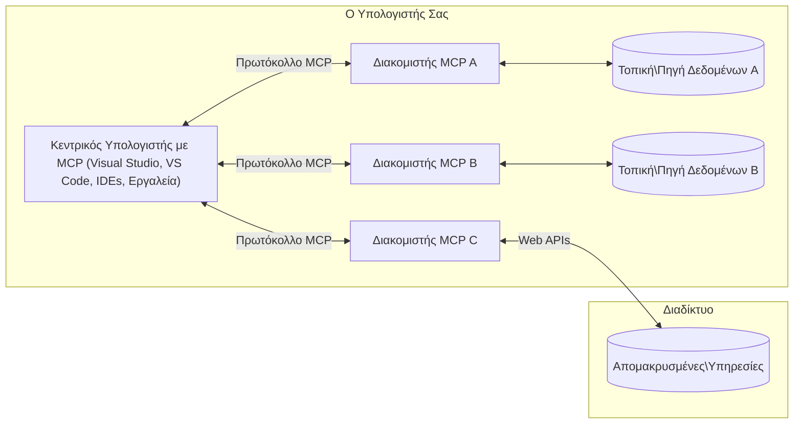

# Βασικές Έννοιες MCP: Κατακτώντας το Πρωτόκολλο Πλαισίου Μοντέλου για Ενσωμάτωση AI

[](https://youtu.be/earDzWGtE84)

_(Κάντε κλικ στην εικόνα παραπάνω για να δείτε το βίντεο αυτού του μαθήματος)_

Το [Πρωτόκολλο Πλαισίου Μοντέλου (MCP)](https://github.com/modelcontextprotocol) είναι ένα ισχυρό, τυποποιημένο πλαίσιο που βελτιστοποιεί την επικοινωνία μεταξύ Μεγάλων Γλωσσικών Μοντέλων (LLMs) και εξωτερικών εργαλείων, εφαρμογών και πηγών δεδομένων.  
Αυτός ο οδηγός θα σας καθοδηγήσει μέσα από τις βασικές έννοιες του MCP. Θα μάθετε για την αρχιτεκτονική πελάτη-διακομιστή, τα βασικά συστατικά, τους μηχανισμούς επικοινωνίας και τις βέλτιστες πρακτικές υλοποίησης.

- **Ρητή Συγκατάθεση Χρήστη**: Όλη η πρόσβαση σε δεδομένα και οι λειτουργίες απαιτούν ρητή έγκριση από τον χρήστη πριν την εκτέλεση. Οι χρήστες πρέπει να κατανοούν σαφώς ποια δεδομένα θα προσπελαστούν και ποιες ενέργειες θα εκτελεστούν, με λεπτομερή έλεγχο δικαιωμάτων και εξουσιοδοτήσεων.

- **Προστασία Ιδιωτικότητας Δεδομένων**: Τα δεδομένα των χρηστών εκτίθενται μόνο με ρητή συγκατάθεση και πρέπει να προστατεύονται με ισχυρούς ελέγχους πρόσβασης καθ’ όλη τη διάρκεια της αλληλεπίδρασης. Οι υλοποιήσεις πρέπει να αποτρέπουν μη εξουσιοδοτημένη μετάδοση δεδομένων και να διατηρούν αυστηρά όρια ιδιωτικότητας.

- **Ασφάλεια Εκτέλεσης Εργαλείων**: Κάθε κλήση εργαλείου απαιτεί ρητή συγκατάθεση χρήστη με σαφή κατανόηση της λειτουργικότητας, των παραμέτρων και της πιθανής επίπτωσης του εργαλείου. Ισχυρά όρια ασφαλείας πρέπει να αποτρέπουν την ακούσια, μη ασφαλή ή κακόβουλη εκτέλεση εργαλείων.

- **Ασφάλεια Επιπέδου Μεταφοράς**: Όλα τα κανάλια επικοινωνίας πρέπει να χρησιμοποιούν κατάλληλους μηχανισμούς κρυπτογράφησης και αυθεντικοποίησης. Οι απομακρυσμένες συνδέσεις πρέπει να υλοποιούν ασφαλή πρωτόκολλα μεταφοράς και σωστή διαχείριση διαπιστευτηρίων.

#### Οδηγίες Υλοποίησης:

- **Διαχείριση Δικαιωμάτων**: Υλοποιήστε συστήματα λεπτομερούς διαχείρισης δικαιωμάτων που επιτρέπουν στους χρήστες να ελέγχουν ποιοι διακομιστές, εργαλεία και πόροι είναι προσβάσιμοι  
- **Αυθεντικοποίηση & Εξουσιοδότηση**: Χρησιμοποιήστε ασφαλείς μεθόδους αυθεντικοποίησης (OAuth, κλειδιά API) με σωστή διαχείριση και λήξη διακριτικών  
- **Επικύρωση Εισόδου**: Επικυρώστε όλες τις παραμέτρους και τις εισόδους δεδομένων σύμφωνα με ορισμένα σχήματα για να αποτρέψετε επιθέσεις έγχυσης  
- **Καταγραφή Ελέγχου**: Διατηρήστε ολοκληρωμένα αρχεία όλων των λειτουργιών για παρακολούθηση ασφάλειας και συμμόρφωση

## Επισκόπηση

Αυτό το μάθημα εξερευνά την θεμελιώδη αρχιτεκτονική και τα συστατικά που αποτελούν το οικοσύστημα του Πρωτοκόλλου Πλαισίου Μοντέλου (MCP). Θα μάθετε για την αρχιτεκτονική πελάτη-διακομιστή, τα βασικά συστατικά και τους μηχανισμούς επικοινωνίας που τροφοδοτούν τις αλληλεπιδράσεις MCP.

## Κύριοι Στόχοι Μάθησης

Στο τέλος αυτού του μαθήματος, θα:

- Κατανοείτε την αρχιτεκτονική πελάτη-διακομιστή του MCP.  
- Αναγνωρίζετε ρόλους και ευθύνες των Hosts, Clients και Servers.  
- Αναλύετε τα βασικά χαρακτηριστικά που καθιστούν το MCP ευέλικτο επίπεδο ενσωμάτωσης.  
- Μαθαίνετε πώς ρέει η πληροφορία μέσα στο οικοσύστημα MCP.  
- Αποκτάτε πρακτικές γνώσεις μέσω παραδειγμάτων κώδικα σε .NET, Java, Python και JavaScript.

## Αρχιτεκτονική MCP: Μια Βαθύτερη Ματιά

Το οικοσύστημα MCP βασίζεται σε μοντέλο πελάτη-διακομιστή. Αυτή η αρθρωτή δομή επιτρέπει στις εφαρμογές AI να αλληλεπιδρούν αποτελεσματικά με εργαλεία, βάσεις δεδομένων, APIs και πηγές πλαισίου. Ας αναλύσουμε αυτή την αρχιτεκτονική στα βασικά της συστατικά.

Στον πυρήνα του, το MCP ακολουθεί αρχιτεκτονική πελάτη-διακομιστή όπου μια εφαρμογή host μπορεί να συνδεθεί με πολλαπλούς διακομιστές:


- **MCP Hosts**: Προγράμματα όπως το VSCode, Claude Desktop, IDEs ή εργαλεία AI που θέλουν να έχουν πρόσβαση σε δεδομένα μέσω MCP  
- **MCP Clients**: Πελάτες πρωτοκόλλου που διατηρούν συνδέσεις 1:1 με διακομιστές  
- **MCP Servers**: Ελαφριά προγράμματα που εκθέτουν συγκεκριμένες δυνατότητες μέσω του τυποποιημένου Πρωτοκόλλου Πλαισίου Μοντέλου  
- **Τοπικές Πηγές Δεδομένων**: Αρχεία, βάσεις δεδομένων και υπηρεσίες του υπολογιστή σας που οι MCP servers μπορούν να προσπελάσουν με ασφάλεια  
- **Απομακρυσμένες Υπηρεσίες**: Εξωτερικά συστήματα διαθέσιμα μέσω διαδικτύου που οι MCP servers μπορούν να συνδεθούν μέσω APIs.

Το Πρωτόκολλο MCP είναι ένα εξελισσόμενο πρότυπο που χρησιμοποιεί εκδόσεις βάσει ημερομηνίας (μορφή YYYY-MM-DD). Η τρέχουσα έκδοση πρωτοκόλλου είναι **2025-11-25**. Μπορείτε να δείτε τις τελευταίες ενημερώσεις στην [προδιαγραφή πρωτοκόλλου](https://modelcontextprotocol.io/specification/2025-11-25/)

### 1. Hosts

Στο Πρωτόκολλο Πλαισίου Μοντέλου (MCP), οι **Hosts** είναι εφαρμογές AI που λειτουργούν ως η κύρια διεπαφή μέσω της οποίας οι χρήστες αλληλεπιδρούν με το πρωτόκολλο. Οι Hosts συντονίζουν και διαχειρίζονται τις συνδέσεις με πολλαπλούς MCP servers δημιουργώντας αφιερωμένους MCP clients για κάθε σύνδεση διακομιστή. Παραδείγματα Hosts περιλαμβάνουν:

- **Εφαρμογές AI**: Claude Desktop, Visual Studio Code, Claude Code  
- **Περιβάλλοντα Ανάπτυξης**: IDEs και επεξεργαστές κώδικα με ενσωμάτωση MCP  
- **Προσαρμοσμένες Εφαρμογές**: Ειδικά κατασκευασμένοι πράκτορες και εργαλεία AI

Οι **Hosts** είναι εφαρμογές που συντονίζουν τις αλληλεπιδράσεις με τα μοντέλα AI. Αυτοί:

- **Οργανώνουν τα Μοντέλα AI**: Εκτελούν ή αλληλεπιδρούν με LLMs για να παράγουν απαντήσεις και να συντονίζουν ροές εργασίας AI  
- **Διαχειρίζονται Συνδέσεις Πελατών**: Δημιουργούν και διατηρούν έναν MCP client ανά σύνδεση MCP server  
- **Ελέγχουν τη Διεπαφή Χρήστη**: Διαχειρίζονται τη ροή συνομιλίας, τις αλληλεπιδράσεις χρήστη και την παρουσίαση απαντήσεων  
- **Επιβάλλουν Ασφάλεια**: Ελέγχουν δικαιώματα, περιορισμούς ασφαλείας και αυθεντικοποίηση  
- **Διαχειρίζονται τη Συγκατάθεση Χρήστη**: Διαχειρίζονται την έγκριση χρήστη για κοινή χρήση δεδομένων και εκτέλεση εργαλείων

### 2. Clients

Οι **Clients** είναι βασικά συστατικά που διατηρούν αφιερωμένες συνδέσεις ένα προς ένα μεταξύ Hosts και MCP servers. Κάθε MCP client δημιουργείται από τον Host για να συνδεθεί με συγκεκριμένο MCP server, εξασφαλίζοντας οργανωμένα και ασφαλή κανάλια επικοινωνίας. Πολλαπλοί clients επιτρέπουν στους Hosts να συνδεθούν ταυτόχρονα με πολλούς διακομιστές.

Οι **Clients** είναι συνδετικά στοιχεία μέσα στην εφαρμογή host. Αυτοί:

- **Επικοινωνία Πρωτοκόλλου**: Στέλνουν αιτήματα JSON-RPC 2.0 προς διακομιστές με προτροπές και οδηγίες  
- **Διαπραγμάτευση Δυνατοτήτων**: Διαπραγματεύονται υποστηριζόμενα χαρακτηριστικά και εκδόσεις πρωτοκόλλου με τους διακομιστές κατά την αρχικοποίηση  
- **Εκτέλεση Εργαλείων**: Διαχειρίζονται αιτήματα εκτέλεσης εργαλείων από μοντέλα και επεξεργάζονται απαντήσεις  
- **Ενημερώσεις σε Πραγματικό Χρόνο**: Διαχειρίζονται ειδοποιήσεις και ενημερώσεις σε πραγματικό χρόνο από διακομιστές  
- **Επεξεργασία Απαντήσεων**: Επεξεργάζονται και μορφοποιούν τις απαντήσεις των διακομιστών για εμφάνιση στους χρήστες

### 3. Servers

Οι **Servers** είναι προγράμματα που παρέχουν πλαίσιο, εργαλεία και δυνατότητες στους MCP clients. Μπορούν να εκτελούνται τοπικά (στο ίδιο μηχάνημα με τον Host) ή απομακρυσμένα (σε εξωτερικές πλατφόρμες) και είναι υπεύθυνοι για τη διαχείριση αιτημάτων πελατών και την παροχή δομημένων απαντήσεων. Οι Servers εκθέτουν συγκεκριμένη λειτουργικότητα μέσω του τυποποιημένου Πρωτοκόλλου Πλαισίου Μοντέλου.

Οι **Servers** είναι υπηρεσίες που παρέχουν πλαίσιο και δυνατότητες. Αυτοί:

- **Καταχώριση Χαρακτηριστικών**: Καταχωρούν και εκθέτουν διαθέσιμες πρωτόγονες λειτουργίες (πόρους, προτροπές, εργαλεία) στους clients  
- **Επεξεργασία Αιτημάτων**: Λαμβάνουν και εκτελούν κλήσεις εργαλείων, αιτήματα πόρων και προτροπών από clients  
- **Παροχή Πλαισίου**: Παρέχουν πληροφορίες πλαισίου και δεδομένα για να βελτιώσουν τις απαντήσεις μοντέλου  
- **Διαχείριση Κατάστασης**: Διατηρούν κατάσταση συνεδρίας και διαχειρίζονται αλληλεπιδράσεις με κατάσταση όταν απαιτείται  
- **Ειδοποιήσεις σε Πραγματικό Χρόνο**: Στέλνουν ειδοποιήσεις για αλλαγές δυνατοτήτων και ενημερώσεις στους συνδεδεμένους clients

Οι Servers μπορούν να αναπτυχθούν από οποιονδήποτε για να επεκτείνουν τις δυνατότητες μοντέλου με εξειδικευμένη λειτουργικότητα και υποστηρίζουν τόσο τοπικά όσο και απομακρυσμένα σενάρια ανάπτυξης.

### 4. Πρωτόγονα Server

Οι Servers στο Πρωτόκολλο Πλαισίου Μοντέλου (MCP) παρέχουν τρία βασικά **πρωτόγονα** που ορίζουν τα θεμελιώδη δομικά στοιχεία για πλούσιες αλληλεπιδράσεις μεταξύ clients, hosts και γλωσσικών μοντέλων. Αυτά τα πρωτόγονα καθορίζουν τους τύπους πληροφοριών πλαισίου και ενεργειών που είναι διαθέσιμες μέσω του πρωτοκόλλου.

Οι MCP servers μπορούν να εκθέτουν οποιονδήποτε συνδυασμό από τα παρακάτω τρία βασικά πρωτόγονα:

#### Πόροι

Οι **Πόροι** είναι πηγές δεδομένων που παρέχουν πληροφορίες πλαισίου σε εφαρμογές AI. Αντιπροσωπεύουν στατικό ή δυναμικό περιεχόμενο που μπορεί να βελτιώσει την κατανόηση και τη λήψη αποφάσεων του μοντέλου:

- **Πληροφορίες Πλαισίου**: Δομημένες πληροφορίες και πλαίσιο για κατανάλωση από το μοντέλο AI  
- **Βάσεις Γνώσης**: Αποθετήρια εγγράφων, άρθρα, εγχειρίδια και ερευνητικές εργασίες  
- **Τοπικές Πηγές Δεδομένων**: Αρχεία, βάσεις δεδομένων και τοπικές πληροφορίες συστήματος  
- **Εξωτερικά Δεδομένα**: Απαντήσεις API, διαδικτυακές υπηρεσίες και δεδομένα απομακρυσμένων συστημάτων  
- **Δυναμικό Περιεχόμενο**: Δεδομένα σε πραγματικό χρόνο που ενημερώνονται βάσει εξωτερικών συνθηκών

Οι πόροι ταυτοποιούνται με URIs και υποστηρίζουν ανακάλυψη μέσω των μεθόδων `resources/list` και ανάκτηση μέσω `resources/read`:

```text
file://documents/project-spec.md
database://production/users/schema
api://weather/current
```

#### Προτροπές

Οι **Προτροπές** είναι επαναχρησιμοποιήσιμα πρότυπα που βοηθούν στη δομή των αλληλεπιδράσεων με γλωσσικά μοντέλα. Παρέχουν τυποποιημένα πρότυπα αλληλεπίδρασης και προτυποποιημένες ροές εργασίας:

- **Αλληλεπιδράσεις με Βάση Πρότυπα**: Προ-δομημένα μηνύματα και εκκινητές συνομιλίας  
- **Πρότυπα Ροής Εργασίας**: Τυποποιημένες ακολουθίες για κοινές εργασίες και αλληλεπιδράσεις  
- **Παραδείγματα Few-shot**: Πρότυπα βασισμένα σε παραδείγματα για οδηγίες μοντέλου  
- **Σύστημα Προτροπών**: Θεμελιώδεις προτροπές που ορίζουν τη συμπεριφορά και το πλαίσιο του μοντέλου  
- **Δυναμικά Πρότυπα**: Παραμετροποιημένες προτροπές που προσαρμόζονται σε συγκεκριμένα πλαίσια

Οι προτροπές υποστηρίζουν αντικατάσταση μεταβλητών και μπορούν να ανακαλυφθούν μέσω `prompts/list` και να ανακτηθούν με `prompts/get`:

```markdown
Generate a {{task_type}} for {{product}} targeting {{audience}} with the following requirements: {{requirements}}
```

#### Εργαλεία

Τα **Εργαλεία** είναι εκτελέσιμες λειτουργίες που τα μοντέλα AI μπορούν να καλούν για να εκτελέσουν συγκεκριμένες ενέργειες. Αντιπροσωπεύουν τα "ρήματα" του οικοσυστήματος MCP, επιτρέποντας στα μοντέλα να αλληλεπιδρούν με εξωτερικά συστήματα:

- **Εκτελέσιμες Λειτουργίες**: Διακριτές λειτουργίες που τα μοντέλα μπορούν να καλούν με συγκεκριμένες παραμέτρους  
- **Ενσωμάτωση Εξωτερικών Συστημάτων**: Κλήσεις API, ερωτήματα βάσεων δεδομένων, λειτουργίες αρχείων, υπολογισμοί  
- **Μοναδική Ταυτότητα**: Κάθε εργαλείο έχει ξεχωριστό όνομα, περιγραφή και σχήμα παραμέτρων  
- **Δομημένη Είσοδος/Έξοδος**: Τα εργαλεία δέχονται επικυρωμένες παραμέτρους και επιστρέφουν δομημένες, τυποποιημένες απαντήσεις  
- **Δυνατότητες Ενεργειών**: Επιτρέπουν στα μοντέλα να εκτελούν πραγματικές ενέργειες και να ανακτούν ζωντανά δεδομένα

Τα εργαλεία ορίζονται με JSON Schema για επικύρωση παραμέτρων και ανακαλύπτονται μέσω `tools/list` και εκτελούνται μέσω `tools/call`:

```typescript
server.tool(
  "search_products", 
  {
    query: z.string().describe("Search query for products"),
    category: z.string().optional().describe("Product category filter"),
    max_results: z.number().default(10).describe("Maximum results to return")
  }, 
  async (params) => {
    // Εκτέλεση αναζήτησης και επιστροφή δομημένων αποτελεσμάτων
    return await productService.search(params);
  }
);
```

## Πρωτόγονα Πελατών

Στο Πρωτόκολλο Πλαισίου Μοντέλου (MCP), οι **πελάτες** μπορούν να εκθέτουν πρωτόγονα που επιτρέπουν στους διακομιστές να ζητούν επιπλέον δυνατότητες από την εφαρμογή host. Αυτά τα πρωτόγονα πελάτη επιτρέπουν πλουσιότερες, πιο διαδραστικές υλοποιήσεις διακομιστών που μπορούν να έχουν πρόσβαση σε δυνατότητες μοντέλου AI και αλληλεπιδράσεις χρήστη.

### Δειγματοληψία

Η **δειγματοληψία** επιτρέπει στους διακομιστές να ζητούν συμπληρώσεις γλωσσικού μοντέλου από την εφαρμογή AI του πελάτη. Αυτό το πρωτόγονο επιτρέπει στους διακομιστές να έχουν πρόσβαση σε δυνατότητες LLM χωρίς να ενσωματώνουν τις δικές τους εξαρτήσεις μοντέλου:

- **Ανεξάρτητη Πρόσβαση Μοντέλου**: Οι διακομιστές μπορούν να ζητούν συμπληρώσεις χωρίς να περιλαμβάνουν SDKs LLM ή να διαχειρίζονται πρόσβαση μοντέλου  
- **AI με Πρωτοβουλία Διακομιστή**: Επιτρέπει στους διακομιστές να δημιουργούν αυτόνομα περιεχόμενο χρησιμοποιώντας το μοντέλο AI του πελάτη  
- **Αναδρομικές Αλληλεπιδράσεις LLM**: Υποστηρίζει σύνθετα σενάρια όπου οι διακομιστές χρειάζονται βοήθεια AI για επεξεργασία  
- **Δημιουργία Δυναμικού Περιεχομένου**: Επιτρέπει στους διακομιστές να δημιουργούν απαντήσεις πλαισίου χρησιμοποιώντας το μοντέλο του host

Η δειγματοληψία ξεκινά μέσω της μεθόδου `sampling/complete`, όπου οι διακομιστές στέλνουν αιτήματα συμπλήρωσης στους πελάτες.

### Εξαγωγή Πληροφοριών

Η **εξαγωγή πληροφοριών** επιτρέπει στους διακομιστές να ζητούν επιπλέον πληροφορίες ή επιβεβαίωση από τους χρήστες μέσω της διεπαφής του πελάτη:

- **Αιτήματα Εισόδου Χρήστη**: Οι διακομιστές μπορούν να ζητούν επιπλέον πληροφορίες όταν χρειάζεται για την εκτέλεση εργαλείων  
- **Διάλογοι Επιβεβαίωσης**: Ζητούν έγκριση χρήστη για ευαίσθητες ή σημαντικές λειτουργίες  
- **Διαδραστικές Ροές Εργασίας**: Επιτρέπουν στους διακομιστές να δημιουργούν βήμα-βήμα αλληλεπιδράσεις με τον χρήστη  
- **Δυναμική Συλλογή Παραμέτρων**: Συλλέγουν ελλείπουσες ή προαιρετικές παραμέτρους κατά την εκτέλεση εργαλείων

Τα αιτήματα εξαγωγής γίνονται με τη μέθοδο `elicitation/request` για συλλογή εισόδου χρήστη μέσω της διεπαφής του πελάτη.

### Καταγραφή

Η **καταγραφή** επιτρέπει στους διακομιστές να στέλνουν δομημένα μηνύματα καταγραφής στους πελάτες για αποσφαλμάτωση, παρακολούθηση και ορατότητα λειτουργίας:

- **Υποστήριξη Αποσφαλμάτωσης**: Επιτρέπει στους διακομιστές να παρέχουν λεπτομερή αρχεία εκτέλεσης για αντιμετώπιση προβλημάτων  
- **Λειτουργική Παρακολούθηση**: Στέλνει ενημερώσεις κατάστασης και μετρήσεις απόδοσης στους πελάτες  
- **Αναφορά Σφαλμάτων**: Παρέχει λεπτομερή πλαίσιο σφαλμάτων και διαγνωστικές πληροφορίες  
- **Αρχεία Ελέγχου**: Δημιουργεί ολοκληρωμένα αρχεία λειτουργιών και αποφάσεων διακομιστή

Τα μηνύματα καταγραφής αποστέλλονται στους πελάτες για να παρέχουν διαφάνεια στις λειτουργίες διακομιστή και να διευκολύνουν την αποσφαλμάτωση.

## Ροή Πληροφοριών στο MCP

Το Πρωτόκολλο Πλαισίου Μοντέλου (MCP) ορίζει μια δομημένη ροή πληροφοριών μεταξύ hosts, clients, servers και μοντέλων. Η κατανόηση αυτής της ροής βοηθά να διευκρινιστεί πώς επεξεργάζονται τα αιτήματα χρηστών και πώς ενσωματώνονται εξωτερικά εργαλεία και δεδομένα στις απαντήσεις μοντέλου.

- **Ο Host Ξεκινά τη Σύνδεση**  
  Η εφαρμογή host (όπως ένα IDE ή διεπαφή συνομιλίας) δημιουργεί σύνδεση με MCP server, συνήθως μέσω STDIO, WebSocket ή άλλου υποστηριζόμενου μέσου μεταφοράς.

- **Διαπραγμάτευση Δυνατοτήτων**  
  Ο client (ενσωματωμένος στον host) και ο server ανταλλάσσουν πληροφορίες για τα υποστηριζόμενα χαρακτηριστικά, εργαλεία, πόρους και εκδόσεις πρωτοκόλλου. Αυτό διασφαλίζει ότι και οι δύο πλευρές κατανοούν ποιες δυνατότητες είναι διαθέσιμες για τη συνεδρία.

- **Αίτημα Χρήστη**  
  Ο χρήστης αλληλεπιδρά με τον host (π.χ. εισάγει προτροπή ή εντολή). Ο host συλλέγει αυτή την είσοδο και την προωθεί στον client για επεξεργασία.

- **Χρήση Πόρου ή Εργαλείου**  
  - Ο client μπορεί να ζητήσει επιπλέον πλαίσιο ή πόρους από τον server (όπως αρχεία, εγγραφές βάσης δεδομένων ή άρθρα βάσης γνώσης) για να εμπλουτίσει την κατανόηση του μοντέλου.  
  - Αν το μοντέλο κρίνει ότι χρειάζεται εργαλείο (π.χ. για ανάκτηση δεδομένων, εκτέλεση υπολογισμού ή κλήση API), ο client στέλνει αίτημα κλήσης εργαλείου στον server, προσδιορίζοντας το όνομα εργαλείου και τις παραμέτρους.

- **Εκτέλεση από τον Server**  
  Ο server λαμβάνει το αίτημα πόρου ή εργαλείου, εκτελεί τις απαραίτητες λειτουργίες (όπως εκτέλεση συνάρτησης, ερώτημα βάσης δεδομένων ή ανάκτηση αρχείου) και επιστρέφει τα αποτελέσματα στον client σε δομημένη μορφή.

- **Δημιουργία Απάντησης**  
  Ο client ενσωματώνει τις απαντήσεις του server (δεδομένα πόρων, αποτελέσματα εργαλείων κ.λπ.) στην τρέχουσα αλληλεπίδραση με το μοντέλο. Το μοντέλο χρησιμοποιεί αυτές τις πληροφορίες για να παράγει μια ολοκληρωμένη και σχετική απάντηση πλαισίου.

- **Παρουσίαση Αποτελέσματος**  
  Ο host λαμβάνει το τελικό αποτέλεσμα από τον client και το παρουσιάζει στον χρήστη, συχνά περιλαμβάνοντας τόσο το κείμενο που παράχθηκε από το μοντέλο όσο και τυχόν αποτελέσματα από εκτέλεση εργαλείων ή αναζητήσεις πόρων.

Αυτή η ροή επιτρέπει στο MCP να υποστηρίζει προηγμένες, διαδραστικές και ευαίσθητες στο πλαίσιο εφαρμογές AI συνδέοντας απρόσκοπτα τα μοντέλα με εξωτερικά εργαλεία και πηγές δεδομένων.

## Αρχιτεκτονική & Επίπεδα Πρωτοκόλλου

Το MCP αποτελείται από δύο διακριτά αρχιτεκτονικά επίπεδα που συνεργάζονται για να παρέχουν ένα πλήρες πλαίσιο επικοινωνίας:

### Επίπεδο Δεδομένων

Το **Επίπεδο Δεδομένων** υλοποιεί το βασικό πρωτόκολλο MCP χρησιμοποιώντας ως βάση το **JSON-RPC 2.0**. Αυτό το επίπεδο ορίζει τη δομή μηνυμάτων, τη σημασιολογία και τα πρότυπα αλληλεπίδρασης:

#### Βασικά Συστατικά:

- **Πρωτόκολλο JSON-RPC 2.0**: Όλη η επικοινωνία χρησιμοποιεί τυποποιημένη μορφή μηνυμάτων JSON-RPC 2.0 για κλήσεις μεθόδων, απαντήσεις και ειδοποιήσεις
- **Διαχείριση Κύκλου Ζωής**: Διαχειρίζεται την αρχικοποίηση σύνδεσης, τη διαπραγμάτευση δυνατοτήτων και τον τερματισμό συνεδρίας μεταξύ πελατών και διακομιστών  
- **Πρωτόγονα Διακομιστή**: Επιτρέπει στους διακομιστές να παρέχουν βασική λειτουργικότητα μέσω εργαλείων, πόρων και προτροπών  
- **Πρωτόγονα Πελάτη**: Επιτρέπει στους διακομιστές να ζητούν δειγματοληψία από LLMs, να ζητούν είσοδο χρήστη και να στέλνουν μηνύματα καταγραφής  
- **Ειδοποιήσεις σε Πραγματικό Χρόνο**: Υποστηρίζει ασύγχρονες ειδοποιήσεις για δυναμικές ενημερώσεις χωρίς polling  

#### Κύρια Χαρακτηριστικά:

- **Διαπραγμάτευση Έκδοσης Πρωτοκόλλου**: Χρησιμοποιεί έκδοση βάσει ημερομηνίας (YYYY-MM-DD) για να διασφαλίσει συμβατότητα  
- **Ανακάλυψη Δυνατοτήτων**: Οι πελάτες και οι διακομιστές ανταλλάσσουν πληροφορίες για υποστηριζόμενα χαρακτηριστικά κατά την αρχικοποίηση  
- **Κατάσταση Συνεδριών**: Διατηρεί την κατάσταση σύνδεσης σε πολλαπλές αλληλεπιδράσεις για συνέχεια συμφραζομένων  

### Επίπεδο Μεταφοράς

Το **Επίπεδο Μεταφοράς** διαχειρίζεται τα κανάλια επικοινωνίας, τη διαμόρφωση μηνυμάτων και την αυθεντικοποίηση μεταξύ των συμμετεχόντων MCP:

#### Υποστηριζόμενοι Μηχανισμοί Μεταφοράς:

1. **Μεταφορά STDIO**:  
   - Χρησιμοποιεί ροές εισόδου/εξόδου για άμεση επικοινωνία διεργασιών  
   - Βέλτιστο για τοπικές διεργασίες στην ίδια μηχανή χωρίς φόρτο δικτύου  
   - Συχνά χρησιμοποιείται για τοπικές υλοποιήσεις MCP διακομιστών  

2. **Μεταφορά HTTP με Ροή**:  
   - Χρησιμοποιεί HTTP POST για μηνύματα πελάτη προς διακομιστή  
   - Προαιρετικά Server-Sent Events (SSE) για ροή από διακομιστή προς πελάτη  
   - Επιτρέπει απομακρυσμένη επικοινωνία διακομιστή μέσω δικτύων  
   - Υποστηρίζει τυπική αυθεντικοποίηση HTTP (bearer tokens, API keys, προσαρμοσμένες κεφαλίδες)  
   - Το MCP προτείνει OAuth για ασφαλή αυθεντικοποίηση με βάση tokens  

#### Αφαίρεση Μεταφοράς:

Το επίπεδο μεταφοράς αφαιρεί τις λεπτομέρειες επικοινωνίας από το επίπεδο δεδομένων, επιτρέποντας το ίδιο φορμά μηνυμάτων JSON-RPC 2.0 σε όλους τους μηχανισμούς μεταφοράς. Αυτή η αφαίρεση επιτρέπει στις εφαρμογές να εναλλάσσονται ομαλά μεταξύ τοπικών και απομακρυσμένων διακομιστών.

### Θέματα Ασφαλείας

Οι υλοποιήσεις MCP πρέπει να τηρούν αρκετές κρίσιμες αρχές ασφαλείας για να διασφαλίσουν ασφαλείς, αξιόπιστες και προστατευμένες αλληλεπιδράσεις σε όλες τις λειτουργίες του πρωτοκόλλου:

- **Συναίνεση και Έλεγχος Χρήστη**: Οι χρήστες πρέπει να παρέχουν ρητή συναίνεση πριν από οποιαδήποτε πρόσβαση σε δεδομένα ή εκτέλεση λειτουργιών. Πρέπει να έχουν σαφή έλεγχο για το ποια δεδομένα μοιράζονται και ποιες ενέργειες εξουσιοδοτούνται, υποστηριζόμενοι από διαισθητικές διεπαφές για ανασκόπηση και έγκριση δραστηριοτήτων.

- **Απόρρητο Δεδομένων**: Τα δεδομένα των χρηστών πρέπει να εκτίθενται μόνο με ρητή συναίνεση και να προστατεύονται με κατάλληλους ελέγχους πρόσβασης. Οι υλοποιήσεις MCP πρέπει να προστατεύουν από μη εξουσιοδοτημένη μετάδοση δεδομένων και να διασφαλίζουν ότι το απόρρητο διατηρείται σε όλες τις αλληλεπιδράσεις.

- **Ασφάλεια Εργαλείων**: Πριν από την κλήση οποιουδήποτε εργαλείου απαιτείται ρητή συναίνεση χρήστη. Οι χρήστες πρέπει να κατανοούν σαφώς τη λειτουργικότητα κάθε εργαλείου και πρέπει να επιβάλλονται ισχυρά όρια ασφαλείας για να αποτραπεί η ακούσια ή μη ασφαλής εκτέλεση εργαλείων.

Ακολουθώντας αυτές τις αρχές ασφαλείας, το MCP διασφαλίζει την εμπιστοσύνη, το απόρρητο και την ασφάλεια των χρηστών σε όλες τις αλληλεπιδράσεις του πρωτοκόλλου, ενώ επιτρέπει ισχυρές ενσωματώσεις AI.

## Παραδείγματα Κώδικα: Κύρια Συστατικά

Παρακάτω παρουσιάζονται παραδείγματα κώδικα σε διάφορες δημοφιλείς γλώσσες προγραμματισμού που δείχνουν πώς να υλοποιήσετε βασικά συστατικά και εργαλεία διακομιστή MCP.

### Παράδειγμα .NET: Δημιουργία Απλού MCP Διακομιστή με Εργαλεία

Εδώ είναι ένα πρακτικό παράδειγμα κώδικα .NET που δείχνει πώς να υλοποιήσετε έναν απλό MCP διακομιστή με προσαρμοσμένα εργαλεία. Το παράδειγμα παρουσιάζει πώς να ορίσετε και να καταχωρήσετε εργαλεία, να χειριστείτε αιτήματα και να συνδέσετε τον διακομιστή χρησιμοποιώντας το Πρωτόκολλο Συμφραζομένων Μοντέλου.

```csharp
using System;
using System.Threading.Tasks;
using ModelContextProtocol.Server;
using ModelContextProtocol.Server.Transport;
using ModelContextProtocol.Server.Tools;

public class WeatherServer
{
    public static async Task Main(string[] args)
    {
        // Create an MCP server
        var server = new McpServer(
            name: "Weather MCP Server",
            version: "1.0.0"
        );
        
        // Register our custom weather tool
        server.AddTool<string, WeatherData>("weatherTool", 
            description: "Gets current weather for a location",
            execute: async (location) => {
                // Call weather API (simplified)
                var weatherData = await GetWeatherDataAsync(location);
                return weatherData;
            });
        
        // Connect the server using stdio transport
        var transport = new StdioServerTransport();
        await server.ConnectAsync(transport);
        
        Console.WriteLine("Weather MCP Server started");
        
        // Keep the server running until process is terminated
        await Task.Delay(-1);
    }
    
    private static async Task<WeatherData> GetWeatherDataAsync(string location)
    {
        // This would normally call a weather API
        // Simplified for demonstration
        await Task.Delay(100); // Simulate API call
        return new WeatherData { 
            Temperature = 72.5,
            Conditions = "Sunny",
            Location = location
        };
    }
}

public class WeatherData
{
    public double Temperature { get; set; }
    public string Conditions { get; set; }
    public string Location { get; set; }
}
```

### Παράδειγμα Java: Συστατικά MCP Διακομιστή

Αυτό το παράδειγμα παρουσιάζει τον ίδιο MCP διακομιστή και την καταχώρηση εργαλείων όπως το παράδειγμα .NET παραπάνω, αλλά υλοποιημένο σε Java.

```java
import io.modelcontextprotocol.server.McpServer;
import io.modelcontextprotocol.server.McpToolDefinition;
import io.modelcontextprotocol.server.transport.StdioServerTransport;
import io.modelcontextprotocol.server.tool.ToolExecutionContext;
import io.modelcontextprotocol.server.tool.ToolResponse;

public class WeatherMcpServer {
    public static void main(String[] args) throws Exception {
        // Δημιουργήστε έναν διακομιστή MCP
        McpServer server = McpServer.builder()
            .name("Weather MCP Server")
            .version("1.0.0")
            .build();
            
        // Καταχωρήστε ένα εργαλείο καιρού
        server.registerTool(McpToolDefinition.builder("weatherTool")
            .description("Gets current weather for a location")
            .parameter("location", String.class)
            .execute((ToolExecutionContext ctx) -> {
                String location = ctx.getParameter("location", String.class);
                
                // Λάβετε δεδομένα καιρού (απλοποιημένα)
                WeatherData data = getWeatherData(location);
                
                // Επιστρέψτε μορφοποιημένη απάντηση
                return ToolResponse.content(
                    String.format("Temperature: %.1f°F, Conditions: %s, Location: %s", 
                    data.getTemperature(), 
                    data.getConditions(), 
                    data.getLocation())
                );
            })
            .build());
        
        // Συνδέστε τον διακομιστή χρησιμοποιώντας μεταφορά stdio
        try (StdioServerTransport transport = new StdioServerTransport()) {
            server.connect(transport);
            System.out.println("Weather MCP Server started");
            // Κρατήστε τον διακομιστή σε λειτουργία μέχρι να τερματιστεί η διαδικασία
            Thread.currentThread().join();
        }
    }
    
    private static WeatherData getWeatherData(String location) {
        // Η υλοποίηση θα καλούσε ένα API καιρού
        // Απλοποιημένο για σκοπούς παραδείγματος
        return new WeatherData(72.5, "Sunny", location);
    }
}

class WeatherData {
    private double temperature;
    private String conditions;
    private String location;
    
    public WeatherData(double temperature, String conditions, String location) {
        this.temperature = temperature;
        this.conditions = conditions;
        this.location = location;
    }
    
    public double getTemperature() {
        return temperature;
    }
    
    public String getConditions() {
        return conditions;
    }
    
    public String getLocation() {
        return location;
    }
}
```

### Παράδειγμα Python: Δημιουργία MCP Διακομιστή

Αυτό το παράδειγμα χρησιμοποιεί το fastmcp, οπότε βεβαιωθείτε ότι το έχετε εγκαταστήσει πρώτα:

```python
pip install fastmcp
```
Παράδειγμα Κώδικα:

```python
#!/usr/bin/env python3
import asyncio
from fastmcp import FastMCP
from fastmcp.transports.stdio import serve_stdio

# Δημιουργία ενός διακομιστή FastMCP
mcp = FastMCP(
    name="Weather MCP Server",
    version="1.0.0"
)

@mcp.tool()
def get_weather(location: str) -> dict:
    """Gets current weather for a location."""
    return {
        "temperature": 72.5,
        "conditions": "Sunny",
        "location": location
    }

# Εναλλακτική προσέγγιση χρησιμοποιώντας μια κλάση
class WeatherTools:
    @mcp.tool()
    def forecast(self, location: str, days: int = 1) -> dict:
        """Gets weather forecast for a location for the specified number of days."""
        return {
            "location": location,
            "forecast": [
                {"day": i+1, "temperature": 70 + i, "conditions": "Partly Cloudy"}
                for i in range(days)
            ]
        }

# Καταχώριση εργαλείων κλάσης
weather_tools = WeatherTools()

# Εκκίνηση του διακομιστή
if __name__ == "__main__":
    asyncio.run(serve_stdio(mcp))
```

### Παράδειγμα JavaScript: Δημιουργία MCP Διακομιστή

Αυτό το παράδειγμα δείχνει τη δημιουργία MCP διακομιστή σε JavaScript και πώς να καταχωρήσετε δύο εργαλεία σχετικά με τον καιρό.

```javascript
// Χρησιμοποιώντας το επίσημο SDK του Πρωτοκόλλου Πλαισίου Μοντέλου
import { McpServer } from "@modelcontextprotocol/sdk/server/mcp.js";
import { StdioServerTransport } from "@modelcontextprotocol/sdk/server/stdio.js";
import { z } from "zod"; // Για την επικύρωση παραμέτρων

// Δημιουργήστε έναν διακομιστή MCP
const server = new McpServer({
  name: "Weather MCP Server",
  version: "1.0.0"
});

// Ορίστε ένα εργαλείο καιρού
server.tool(
  "weatherTool",
  {
    location: z.string().describe("The location to get weather for")
  },
  async ({ location }) => {
    // Κανονικά θα καλούσε ένα API καιρού
    // Απλοποιημένο για επίδειξη
    const weatherData = await getWeatherData(location);
    
    return {
      content: [
        { 
          type: "text", 
          text: `Temperature: ${weatherData.temperature}°F, Conditions: ${weatherData.conditions}, Location: ${weatherData.location}` 
        }
      ]
    };
  }
);

// Ορίστε ένα εργαλείο πρόγνωσης
server.tool(
  "forecastTool",
  {
    location: z.string(),
    days: z.number().default(3).describe("Number of days for forecast")
  },
  async ({ location, days }) => {
    // Κανονικά θα καλούσε ένα API καιρού
    // Απλοποιημένο για επίδειξη
    const forecast = await getForecastData(location, days);
    
    return {
      content: [
        { 
          type: "text", 
          text: `${days}-day forecast for ${location}: ${JSON.stringify(forecast)}` 
        }
      ]
    };
  }
);

// Βοηθητικές συναρτήσεις
async function getWeatherData(location) {
  // Προσομοίωση κλήσης API
  return {
    temperature: 72.5,
    conditions: "Sunny",
    location: location
  };
}

async function getForecastData(location, days) {
  // Προσομοίωση κλήσης API
  return Array.from({ length: days }, (_, i) => ({
    day: i + 1,
    temperature: 70 + Math.floor(Math.random() * 10),
    conditions: i % 2 === 0 ? "Sunny" : "Partly Cloudy"
  }));
}

// Συνδέστε τον διακομιστή χρησιμοποιώντας μεταφορά stdio
const transport = new StdioServerTransport();
server.connect(transport).catch(console.error);

console.log("Weather MCP Server started");
```

Αυτό το παράδειγμα JavaScript δείχνει πώς να δημιουργήσετε έναν MCP πελάτη που συνδέεται με διακομιστή, στέλνει μια προτροπή και επεξεργάζεται την απάντηση, συμπεριλαμβανομένων τυχόν κλήσεων εργαλείων που έγιναν.

## Ασφάλεια και Εξουσιοδότηση

Το MCP περιλαμβάνει αρκετές ενσωματωμένες έννοιες και μηχανισμούς για τη διαχείριση της ασφάλειας και της εξουσιοδότησης σε όλο το πρωτόκολλο:

1. **Έλεγχος Δικαιωμάτων Εργαλείων**:  
  Οι πελάτες μπορούν να καθορίσουν ποια εργαλεία επιτρέπεται να χρησιμοποιεί ένα μοντέλο κατά τη διάρκεια μιας συνεδρίας. Αυτό διασφαλίζει ότι μόνο ρητά εξουσιοδοτημένα εργαλεία είναι προσβάσιμα, μειώνοντας τον κίνδυνο ακούσιων ή μη ασφαλών λειτουργιών. Τα δικαιώματα μπορούν να ρυθμιστούν δυναμικά βάσει προτιμήσεων χρήστη, πολιτικών οργανισμού ή συμφραζομένων αλληλεπίδρασης.

2. **Αυθεντικοποίηση**:  
  Οι διακομιστές μπορούν να απαιτούν αυθεντικοποίηση πριν από την παροχή πρόσβασης σε εργαλεία, πόρους ή ευαίσθητες λειτουργίες. Αυτό μπορεί να περιλαμβάνει API keys, OAuth tokens ή άλλα σχήματα αυθεντικοποίησης. Η σωστή αυθεντικοποίηση διασφαλίζει ότι μόνο αξιόπιστοι πελάτες και χρήστες μπορούν να ενεργοποιήσουν δυνατότητες διακομιστή.

3. **Επικύρωση**:  
  Επιβάλλεται επικύρωση παραμέτρων για όλες τις κλήσεις εργαλείων. Κάθε εργαλείο ορίζει τους αναμενόμενους τύπους, μορφές και περιορισμούς για τις παραμέτρους του, και ο διακομιστής επικυρώνει τα εισερχόμενα αιτήματα αναλόγως. Αυτό αποτρέπει την αποστολή κακόβουλων ή κακώς διαμορφωμένων εισόδων στις υλοποιήσεις εργαλείων και βοηθά στη διατήρηση της ακεραιότητας των λειτουργιών.

4. **Περιορισμός Ροής (Rate Limiting)**:  
  Για την αποφυγή κατάχρησης και τη διασφάλιση δίκαιης χρήσης των πόρων του διακομιστή, οι MCP διακομιστές μπορούν να εφαρμόζουν περιορισμούς ροής για κλήσεις εργαλείων και πρόσβαση σε πόρους. Οι περιορισμοί μπορούν να εφαρμόζονται ανά χρήστη, ανά συνεδρία ή παγκοσμίως, και βοηθούν στην προστασία από επιθέσεις άρνησης υπηρεσίας ή υπερβολική κατανάλωση πόρων.

Συνδυάζοντας αυτούς τους μηχανισμούς, το MCP παρέχει μια ασφαλή βάση για την ενσωμάτωση γλωσσικών μοντέλων με εξωτερικά εργαλεία και πηγές δεδομένων, ενώ δίνει σε χρήστες και προγραμματιστές λεπτομερή έλεγχο πρόσβασης και χρήσης.

## Μηνύματα Πρωτοκόλλου & Ροή Επικοινωνίας

Η επικοινωνία MCP χρησιμοποιεί δομημένα μηνύματα **JSON-RPC 2.0** για να διευκολύνει σαφείς και αξιόπιστες αλληλεπιδράσεις μεταξύ κεντρικών, πελατών και διακομιστών. Το πρωτόκολλο ορίζει συγκεκριμένα μοτίβα μηνυμάτων για διαφορετικούς τύπους λειτουργιών:

### Βασικοί Τύποι Μηνυμάτων:

#### **Μηνύματα Αρχικοποίησης**
- **Αίτημα `initialize`**: Εγκαθιστά σύνδεση και διαπραγματεύεται έκδοση πρωτοκόλλου και δυνατότητες  
- **Απάντηση `initialize`**: Επιβεβαιώνει υποστηριζόμενα χαρακτηριστικά και πληροφορίες διακομιστή  
- **`notifications/initialized`**: Σηματοδοτεί ότι η αρχικοποίηση ολοκληρώθηκε και η συνεδρία είναι έτοιμη  

#### **Μηνύματα Ανακάλυψης**
- **Αίτημα `tools/list`**: Ανακαλύπτει διαθέσιμα εργαλεία από τον διακομιστή  
- **Αίτημα `resources/list`**: Λίστα διαθέσιμων πόρων (πηγές δεδομένων)  
- **Αίτημα `prompts/list`**: Ανακτά διαθέσιμα πρότυπα προτροπών  

#### **Μηνύματα Εκτέλεσης**  
- **Αίτημα `tools/call`**: Εκτελεί συγκεκριμένο εργαλείο με παρεχόμενες παραμέτρους  
- **Αίτημα `resources/read`**: Ανακτά περιεχόμενο από συγκεκριμένο πόρο  
- **Αίτημα `prompts/get`**: Φέρνει πρότυπο προτροπής με προαιρετικές παραμέτρους  

#### **Μηνύματα Πελάτη**
- **Αίτημα `sampling/complete`**: Ο διακομιστής ζητά ολοκλήρωση LLM από τον πελάτη  
- **`elicitation/request`**: Ο διακομιστής ζητά είσοδο χρήστη μέσω διεπαφής πελάτη  
- **Μηνύματα Καταγραφής**: Ο διακομιστής στέλνει δομημένα μηνύματα καταγραφής στον πελάτη  

#### **Μηνύματα Ειδοποίησης**
- **`notifications/tools/list_changed`**: Ο διακομιστής ειδοποιεί τον πελάτη για αλλαγές στα εργαλεία  
- **`notifications/resources/list_changed`**: Ο διακομιστής ειδοποιεί τον πελάτη για αλλαγές στους πόρους  
- **`notifications/prompts/list_changed`**: Ο διακομιστής ειδοποιεί τον πελάτη για αλλαγές στις προτροπές  

### Δομή Μηνύματος:

Όλα τα μηνύματα MCP ακολουθούν το φορμά JSON-RPC 2.0 με:  
- **Μηνύματα Αιτήματος**: Περιλαμβάνουν `id`, `method` και προαιρετικά `params`  
- **Μηνύματα Απάντησης**: Περιλαμβάνουν `id` και είτε `result` είτε `error`  
- **Μηνύματα Ειδοποίησης**: Περιλαμβάνουν `method` και προαιρετικά `params` (χωρίς `id` ή αναμενόμενη απάντηση)  

Αυτή η δομημένη επικοινωνία εξασφαλίζει αξιόπιστες, ιχνηλάσιμες και επεκτάσιμες αλληλεπιδράσεις που υποστηρίζουν προηγμένα σενάρια όπως ενημερώσεις σε πραγματικό χρόνο, αλυσιδωτές κλήσεις εργαλείων και ανθεκτικό χειρισμό σφαλμάτων.

## Κύρια Συμπεράσματα

- **Αρχιτεκτονική**: Το MCP χρησιμοποιεί αρχιτεκτονική πελάτη-διακομιστή όπου οι κεντρικοί διαχειρίζονται πολλαπλές συνδέσεις πελατών προς διακομιστές  
- **Συμμετέχοντες**: Το οικοσύστημα περιλαμβάνει κεντρικούς (εφαρμογές AI), πελάτες (συνδέσμους πρωτοκόλλου) και διακομιστές (παρόχους δυνατοτήτων)  
- **Μηχανισμοί Μεταφοράς**: Η επικοινωνία υποστηρίζει STDIO (τοπικό) και HTTP με ροή και προαιρετικό SSE (απομακρυσμένο)  
- **Βασικά Πρωτόγονα**: Οι διακομιστές εκθέτουν εργαλεία (εκτελέσιμες λειτουργίες), πόρους (πηγές δεδομένων) και προτροπές (πρότυπα)  
- **Πρωτόγονα Πελάτη**: Οι διακομιστές μπορούν να ζητούν δειγματοληψία (ολοκληρώσεις LLM), ερώτηση (είσοδο χρήστη) και καταγραφή από πελάτες  
- **Βάση Πρωτοκόλλου**: Βασίζεται σε JSON-RPC 2.0 με έκδοση βάσει ημερομηνίας (τρέχουσα: 2025-11-25)  
- **Δυνατότητες σε Πραγματικό Χρόνο**: Υποστηρίζει ειδοποιήσεις για δυναμικές ενημερώσεις και συγχρονισμό σε πραγματικό χρόνο  
- **Ασφάλεια Πρώτα**: Ρητή συναίνεση χρήστη, προστασία απορρήτου δεδομένων και ασφαλής μεταφορά είναι βασικές απαιτήσεις  

## Άσκηση

Σχεδιάστε ένα απλό εργαλείο MCP που θα ήταν χρήσιμο στον τομέα σας. Ορίστε:  
1. Πώς θα ονομαζόταν το εργαλείο  
2. Ποιες παραμέτρους θα δεχόταν  
3. Τι έξοδο θα επέστρεφε  
4. Πώς ένα μοντέλο θα μπορούσε να χρησιμοποιήσει αυτό το εργαλείο για να λύσει προβλήματα χρηστών  

---

## Τι ακολουθεί

Επόμενο: [Κεφάλαιο 2: Ασφάλεια](../02-Security/README.md)

---

<!-- CO-OP TRANSLATOR DISCLAIMER START -->
**Αποποίηση ευθυνών**:  
Αυτό το έγγραφο έχει μεταφραστεί χρησιμοποιώντας την υπηρεσία αυτόματης μετάφρασης AI [Co-op Translator](https://github.com/Azure/co-op-translator). Παρόλο που επιδιώκουμε την ακρίβεια, παρακαλούμε να λάβετε υπόψη ότι οι αυτόματες μεταφράσεις ενδέχεται να περιέχουν λάθη ή ανακρίβειες. Το πρωτότυπο έγγραφο στη γλώσσα του θεωρείται η αυθεντική πηγή. Για κρίσιμες πληροφορίες, συνιστάται επαγγελματική ανθρώπινη μετάφραση. Δεν φέρουμε ευθύνη για τυχόν παρεξηγήσεις ή λανθασμένες ερμηνείες που προκύπτουν από τη χρήση αυτής της μετάφρασης.
<!-- CO-OP TRANSLATOR DISCLAIMER END -->