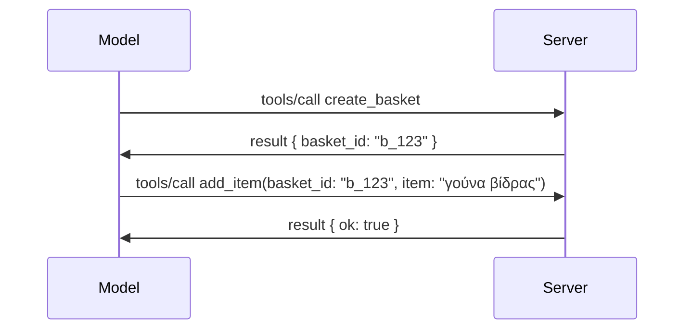

# Τι άλλαξε στο MCP: Η Προδιαγραφή 2026-07-28

> **Κατάσταση:** Τελική. Η Προδιαγραφή MCP `2026-07-28` κυκλοφόρησε στις 28 Ιουλίου 2026
> και είναι η τρέχουσα αναθεώρηση πρωτοκόλλου. Το μάθημα αυτό περιγράφει την τελική
> προδιαγραφή. Μερικά παραδείγματα του αναλυτικού προγράμματος παραμένουν ρητά εκδομένα στην
> `2025-11-25` επειδή τα SDK τους δεν έχουν ακόμα υιοθετήσει τη νέα διαισθητική API χωρίς κατάσταση;
> θεωρήστε αυτά τα παραδείγματα ως καθοδήγηση συμβατότητας παλαιάς έκδοσης.

## Επισκόπηση

Η έκδοση `2026-07-28` είναι η μεγαλύτερη αναθεώρηση του MCP από την έναρξή του. Έξι
Προτάσεις Βελτίωσης Προδιαγραφών (SEPs) αφαιρούν τις συνεδρίες σε επίπεδο πρωτοκόλλου και
καθιστούν το MCP χωρίς κατάσταση στο επίπεδο μεταφοράς, οι επεκτάσεις γίνονται μηχανισμός πρώτης τάξης,
εκδιδόμενες εκδόσεις, και αρκετά χαρακτηριστικά που καλύφθηκαν νωρίτερα στο πρόγραμμα σπουδών
(Roots, Sampling, Logging) αποσύρονται υπό μια νέα πολιτική κύκλου ζωής. Αυτό το
μάθημα συνοψίζει τι άλλαξε, γιατί έχει σημασία και τι σημαίνει για τον κώδικα
που γράφτηκε για την έκδοση `2025-11-25`.

Πηγή: [The 2026-07-28 MCP Specification Release Candidate](https://blog.modelcontextprotocol.io/posts/2026-07-28-release-candidate/) (Model Context Protocol Blog, David Soria Parra και Den Delimarsky).

## Στόχοι μάθησης

Μέχρι το τέλος αυτού του μαθήματος θα μπορείτε να:

- Εξηγείτε γιατί το MCP μετακινείται σε μια πρωτόκολλο χωρίς κατάσταση και ποιο πρόβλημα λύνει για αναβαθμισμένες οριζόντια αναπτυχθείσες εφαρμογές.
- Περιγράφετε πώς αντικαθίσταται η χειραψία `initialize`/`initialized` και η κεφαλίδα `Mcp-Session-Id`.
- Αναγνωρίζετε τις νέες κεφαλίδες `Mcp-Method` και `Mcp-Name` και τα μεταδεδομένα προσωρινής αποθήκευσης `ttlMs`/`cacheScope`.
- Αναγνωρίζετε το πλαίσιο επεκτάσεων και τις δύο επεκτάσεις που κυκλοφορούν με αυτή την έκδοση: MCP Apps και Tasks.
- Συνοψίζετε την ενίσχυση εξουσιοδότησης και την απόσυρση του Dynamic Client Registration.

- Αναγνωρίζετε ποια βασικά χαρακτηριστικά (Roots, Sampling, Logging) αποσύρονται πλέον και τι σημαίνει αυτό στην πράξη.
- Εξηγείτε την αλλαγή Full JSON Schema 2020-12 για τα εργαλεία `inputSchema`/`outputSchema`.

## Ένα Πρωτόκολλο Χωρίς Κατάσταση

Η κύρια αλλαγή: Το MCP γίνεται χωρίς κατάσταση στο επίπεδο πρωτοκόλλου.

### Πριν (2025-11-25): οι συνεδρίες σερβίρονται σε μία μόνο κατάσταση διακομιστή

Η κλήση ενός εργαλείου μέσω Streamable HTTP ξεκινά με χειραψία `initialize`. Ο διακομιστής ανταποκρίνεται με κεφαλίδα `Mcp-Session-Id` που κάθε επόμενη αίτηση πρέπει να φέρει:

```http
POST /mcp HTTP/1.1
Mcp-Session-Id: 1868a90c-3a3f-4f5b
Content-Type: application/json

{"jsonrpc":"2.0","id":2,"method":"tools/call",
 "params":{"name":"search","arguments":{"q":"otters"}}}
```

Επειδή η συνεδρία είναι δεμένη με την εκάστοτε περίπτωση διακομιστή που την εξέδωσε, οι οριζόντια αναπτυχθείσες εφαρμογές χρειάζονται **sticky routing** στον εξισορροπητή φόρτου και κοινό **κατάστημα συνεδριών** μεταξύ των περιπτώσεων.

### Μετά (2026-07-28): κάθε αίτηση είναι αυτόνομη

```http
POST /mcp HTTP/1.1
MCP-Protocol-Version: 2026-07-28
Mcp-Method: tools/call
Mcp-Name: search
Content-Type: application/json

{"jsonrpc":"2.0","id":1,"method":"tools/call",
 "params":{"name":"search","arguments":{"q":"otters"},
           "_meta":{"io.modelcontextprotocol/protocolVersion":"2026-07-28",
                    "io.modelcontextprotocol/clientInfo":{"name":"my-app","version":"1.0"},
                    "io.modelcontextprotocol/clientCapabilities":{}}}}
```

Οποιαδήποτε περίπτωση διακομιστή μπορεί να χειριστεί αυτή την αίτηση. Βασικές αλλαγές:

- **Αφαιρείται η χειραψία `initialize`/`initialized`** ([SEP-2575](https://github.com/modelcontextprotocol/modelcontextprotocol/pull/2575)). Η έκδοση πρωτοκόλλου, οι πληροφορίες πελάτη και οι ικανότητες πελάτη μεταφέρονται στο `_meta` κάθε αίτησης. Μια νέα μέθοδος `server/discover` επιτρέπει στον πελάτη να αντλήσει ικανότητες του διακομιστή αμέσως μόλις τις χρειάζεται.
- **Αφαιρείται η κεφαλίδα `Mcp-Session-Id` και η συνεδρία σε επίπεδο πρωτοκόλλου** ([SEP-2567](https://github.com/modelcontextprotocol/modelcontextprotocol/pull/2567)). Δεν απαιτούνται πλέον sticky routing και κοινό κατάστημα συνεδριών σε επίπεδο πρωτοκόλλου.

### Πρωτόκολλο χωρίς κατάσταση, εφαρμογές με κατάσταση

Η αφαίρεση της συνεδρίας σε επίπεδο πρωτοκόλλου δεν σημαίνει ότι ο διακομιστής σας δεν μπορεί να είναι με κατάσταση. Το συνιστώμενο μοντέλο είναι το ίδιο που χρησιμοποιούν πάντα οι HTTP API: δημιουργήστε μια ρητή λαβή (ένα `basket_id`, ένα `browser_id`) από μία κλήση εργαλείου, και ο μοντέλο επιστρέφει αυτή τη λαβή ως συνηθισμένο όρισμα στις μετέπειτα κλήσεις.



Αυτό καθιστά την κατάσταση ορατή και λογική στο μοντέλο αντί να τη κρύβει στα μεταδεδομένα μεταφοράς, και επιτρέπει σε οποιαδήποτε περίπτωση διακομιστή να χειριστεί οποιαδήποτε κλήση.

### Αιτήσεις από διακομιστή προς πελάτη, αναδιαρθρωμένες

Ένα πρωτόκολλο χωρίς κατάσταση χρειάζεται ακόμη τρόπο ώστε ένας διακομιστής να ζητήσει κάτι από τον πελάτη κατά τη διάρκεια κλήσης (π.χ. μια ερώτηση απόκρισης):

- **Οι αιτήσεις που ξεκινά ο διακομιστής πρέπει να εκδίδονται μόνο ενώ ο διακομιστής επεξεργάζεται ενεργά μια αίτηση πελάτη** ([SEP-2260](https://github.com/modelcontextprotocol/modelcontextprotocol/pull/2260)) — προηγουμένως πρόταση, τώρα υποχρέωση. Ο χρήστης δεν προτρέπεται αιφνιδίως.
- **Οι πολυ-γύρου αιτήσεις** ([SEP-2322](https://github.com/modelcontextprotocol/modelcontextprotocol/pull/2322)) αντικαθιστούν το άνοιγμα ροής SSE. Αντιθέτως, ο διακομιστής επιστρέφει ένα `InputRequiredResult`:

  ```json
  {
    "resultType": "input_required",
    "inputRequests": {
      "confirm": {
        "type": "elicitation",
        "message": "Delete 3 files?",
        "schema": { "type": "boolean" }
      }
    },
    "requestState": "eyJzdGVwIjoxLCJmaWxlcyI6WyJhIiwiYiIsImMiXX0="
  }
  ```

  Ο πελάτης συλλέγει τις απαντήσεις και ξανα-εκδίδει την αρχική κλήση με `inputResponses` και το αντανακλώμενο `requestState`. Οποιαδήποτε περίπτωση διακομιστή μπορεί να αναλάβει την επανάληψη γιατί όλα τα απαραίτητα βρίσκονται στο ωφέλιμο φορτίο.

### Δρομολογήσιμο, προσωρινά αποθηκεύσιμο, ιχνηλάσιμο

Τρεις μικρότερες αλλαγές κάνουν την κίνηση χωρίς κατάσταση πιο εύκολη στη λειτουργία:

- **Οι κεφαλίδες `Mcp-Method` και `Mcp-Name` απαιτούνται στο Streamable HTTP** ([SEP-2243](https://github.com/modelcontextprotocol/modelcontextprotocol/pull/2243)), ώστε οι εξισορροπητές φόρτου, gateways και οι περιοριστές ρυθμού να δρομολογούν με βάση τη λειτουργία χωρίς να εξετάζουν το σώμα JSON. Οι διακομιστές απορρίπτουν αιτήσεις όπου οι κεφαλίδες και το σώμα διαφωνούν.
- **Τα αποτελέσματα `tools/list` και ανάγνωσης πόρων φέρουν τα `ttlMs` και `cacheScope`** ([SEP-2549](https://github.com/modelcontextprotocol/modelcontextprotocol/pull/2549)), μοντελοποιημένα όπως το `Cache-Control` του HTTP. Οι πελάτες γνωρίζουν για πόσο διάστημα ένα αποτέλεσμα λίστας είναι φρέσκο και αν είναι ασφαλές να το μοιραστούν μεταξύ χρηστών, χωρίς να χρειάζεται μια μακροχρόνια ροή SSE για ενημερώσεις αλλαγών.
- **Η προώθηση W3C Trace Context στο `_meta` τεκμηριώνεται** ([SEP-414](https://github.com/modelcontextprotocol/modelcontextprotocol/pull/414)), διορθώνοντας τα ονόματα κλειδιών `traceparent`, `tracestate`, και `baggage` ώστε ένα κατανεμημένο ίχνος να ακολουθεί μια κλήση μέσα από το SDK πελάτη, τον εξυπηρετητή MCP, και τα κατώτερα συστήματα σε ένα συμβατό backend [OpenTelemetry](https://opentelemetry.io/).

## Οι Επεκτάσεις γίνονται Μηχανισμός Πρώτης Τάξης

Οι επεκτάσεις υπήρχαν ανεπίσημα στην έκδοση `2025-11-25`. Ο [SEP-2133](https://github.com/modelcontextprotocol/modelcontextprotocol/pull/2133) τις οριοθετεί:

- Οι επεκτάσεις αναγνωρίζονται από αναστροφές αναγνωριστικών DNS.
- Διαπραγματεύονται μέσω ενός χάρτη `extensions` στις ικανότητες πελατών και διακομιστών.
- Υπάρχουν σε δικά τους αποθετήρια `ext-*` με αντιπροσώπους διαχειριστές και εκδίδονται ανεξάρτητα από τον πυρήνα προδιαγραφής.
- Μια νέα Διαδρομή Επεκτάσεων στη διαδικασία SEP τους δίνει έναν δρόμο από το πειραματικό στο επίσημο.

Αυτή η έκδοση περιλαμβάνει δύο επίσημες επεκτάσεις.

### MCP Apps: διεπαφές χρήστη που αποδίδονται από τον διακομιστή

[MCP Apps](https://blog.modelcontextprotocol.io/posts/2026-01-26-mcp-apps/) ([SEP-1865](https://github.com/modelcontextprotocol/modelcontextprotocol/pull/1865)) επιτρέπουν στους διακομιστές να παρέχουν διαδραστικές διεπαφές HTML που τα περιβάλλοντα υποδοχής αποδίδουν σε sandboxed iframe. Τα εργαλεία δηλώνουν τα πρότυπα UI εκ των προτέρων ώστε οι υποδοχές να τα προφορτώνουν, να τα αποθηκεύουν και να τα ελέγχουν για ασφάλεια πριν τρέξει οτιδήποτε. Καλύψατε ήδη τα βασικά σε [Μάθημα 15: MCP Apps](../03-GettingStarted/15-mcp-apps/README.md) — κάτω από το πλαίσιο Επεκτάσεων, τα MCP Apps πλέον είναι επίσημα επέκταση και όχι πειραματικό χαρακτηριστικό πυρήνα.

### Τα Tasks προωθούνται ως επέκταση

Τα Tasks κυκλοφόρησαν ως πειραματικό χαρακτηριστικό πυρήνα στην έκδοση `2025-11-25`. Η χρήση παραγωγής αποκάλυψε τέτοια αναδιαμόρφωση που ο σωστός χώρος τους είναι μια επέκταση: η [επέκταση Tasks](https://github.com/modelcontextprotocol/modelcontextprotocol/pull/2663) αναδιαμορφώνει τον κύκλο ζωής γύρω από το μοντέλο χωρίς κατάσταση — ένας διακομιστής μπορεί να απαντήσει σε `tools/call` με λαβή task, και ο πελάτης να την προωθήσει με `tasks/get`, `tasks/update`, και `tasks/cancel`. Η δημιουργία task είναι υπό καθοδήγηση διακομιστή: ο πελάτης δηλώνει την επέκταση και ο διακομιστής αποφασίζει πότε μια κλήση πρέπει να εκτελεστεί ως task. Το `tasks/list` αφαιρείται ολοκληρωτικά γιατί δεν μπορεί να έχει ασφαλή πεδίο εφαρμογής χωρίς συνεδρίες.

> **Σημείωση μετάβασης:** αν υλοποιήσατε το πειραματικό API Tasks της έκδοσης `2025-11-25`, θα χρειαστεί να μεταβείτε στον νέο κύκλο ζωής επέκτασης — δεν είναι συμβατό προς τα πίσω.

## Ενίσχυση Εξουσιοδότησης

Πολλές SEPs ενισχύουν την
[προδιαγραφή εξουσιοδότησης](https://modelcontextprotocol.io/specification/2026-07-28/basic/authorization)
ώστε να ευθυγραμμιστεί στενότερα με πραγματικές αναπτύξεις OAuth 2.0 / OpenID Connect:

| SEP | Αλλαγή |
|---|---|
| [SEP-2468](https://github.com/modelcontextprotocol/modelcontextprotocol/pull/2468) | Οι πελάτες πρέπει να επικυρώνουν την παράμετρο `iss` στις απαντήσεις εξουσιοδότησης σύμφωνα με το [RFC 9207](https://www.rfc-editor.org/rfc/rfc9207), μειώνοντας τις επιθέσεις "ανάμειξης" κοινές στο πρότυπο MCP με έναν πελάτη και πολλούς διακομιστές. Μια μελλοντική έκδοση θα απαιτεί την απόρριψη απαντήσεων χωρίς `iss`. |
| [SEP-837](https://github.com/modelcontextprotocol/modelcontextprotocol/pull/837) | Οι πελάτες Dynamic Client Registration αποκλειστικά για συμβατότητα δηλώνουν `application_type` OpenID Connect, αποφεύγοντας τις λανθασμένες προεπιλογές `"web"` για πελάτες desktop και CLI. |
| [SEP-2352](https://github.com/modelcontextprotocol/modelcontextprotocol/pull/2352) | Μόνο πιστοποιητικά για συμβατότητα δεμένα με τον `issuer` του εξυπηρετητή εξουσιοδότησης που τα εξέδωσε· οι πελάτες επανεγγράφονται αν ο πόρος μεταναστεύσει. |
| [SEP-2207](https://github.com/modelcontextprotocol/modelcontextprotocol/pull/2207) | Τεκμηριώνει πώς να ζητείται ανανέωση tokens από εξυπηρετητές εξουσιοδότησης τύπου OpenID Connect. |
| [SEP-2350](https://github.com/modelcontextprotocol/modelcontextprotocol/pull/2350) | Διευκρινίζει τη σωρευτική εφαρμογή πεδίου κατά τη βελτιωμένη εξουσιοδότηση. |
| [SEP-2351](https://github.com/modelcontextprotocol/modelcontextprotocol/pull/2351) | Διευκρινίζει το επίθημα ανακάλυψης `.well-known`. |

Αν δημιουργείτε έναν εξυπηρετητή εξουσιοδότησης για MCP, παρέχετε `iss` στις
απαντήσεις εξουσιοδότησης και ακολουθείστε την τελική προδιαγραφή εξουσιοδότησης. Δείτε
το [02-Security](../02-Security/README.md) για καθοδήγηση εφαρμογής.

Η δυναμική εγγραφή πελάτη (Dynamic Client Registration) παραμένει διαθέσιμη για συμβατότητα αλλά επίσης
αποσύρεται στο `2026-07-28`. Νέες υλοποιήσεις πρέπει να χρησιμοποιούν τα Client ID Metadata
Documents.

## Αποσυρμένα Χαρακτηριστικά

Υπό τη νέα
[πολιτική κύκλου ζωής χαρακτηριστικών](https://github.com/modelcontextprotocol/modelcontextprotocol/pull/2577),
τα Roots, Sampling, Logging, και Dynamic Client Registration είναι **Αποσυρμένα**:

| Χαρακτηριστικό | Συνιστώμενη αντικατάσταση |
|---|---|
| Roots | Παράμετροι εργαλείου, URIs πόρων ή διαμόρφωση διακομιστή |
| Sampling | Άμεση ολοκλήρωση με APIs παρόχων LLM |
| Logging | `stderr` για μεταφορές stdio· OpenTelemetry για δομημένη παρατηρησιμότητα |
| Dynamic Client Registration | Client ID Metadata Documents |

Αυτά τα χαρακτηριστικά παραμένουν στο `2026-07-28` για συμβατότητα. Είναι επιλέξιμα για
αφαίρεση στην πρώτη αναθεώρηση προδιαγραφής που κυκλοφορεί στις ή μετά τις 28 Ιουλίου 2027;
η πραγματική αφαίρεση μπορεί να συμβεί αργότερα. Νέες υλοποιήσεις πρέπει να χρησιμοποιούν τα αντίστοιχα
πρότυπα αντικατάστασης που αναφέρονται παραπάνω.

## Πλήρες JSON Schema 2020-12 για Εργαλεία

Τα `inputSchema` και `outputSchema` εργαλείων ανυψώνονται στο πλήρες [JSON Schema 2020-12](https://json-schema.org/draft/2020-12) ([SEP-2106](https://github.com/modelcontextprotocol/modelcontextprotocol/pull/2106)):

- Τα σχήματα εισόδου διατηρούν τον περιορισμό ρίζας `type: "object"` αλλά πλέον επιτρέπουν σύνθεση (`oneOf`, `anyOf`, `allOf`), συνθήκες και αναφορές (`$ref`, `$defs`).
- Τα σχήματα εξόδου είναι χωρίς περιορισμό, και το `structuredContent` μπορεί πλέον να είναι οποιαδήποτε τιμή JSON και όχι μόνο αντικείμενο.
- Οι υλοποιήσεις δεν πρέπει να ανοιγοκλείνουν αυτόματα εξωτερικά `$ref` URIs και πρέπει να περιορίζουν το βάθος του σχήματος και το χρόνο επικύρωσης (μία έννοια άρνησης υπηρεσίας που πρέπει να ληφθεί υπόψη αν επικυρώνετε σχήματα στον διακομιστή).

Επιπλέον, ο κωδικός σφάλματος για έλλειψη πόρου αλλάζει από το custom του MCP `-32002` στο τυπικό JSON-RPC `-32602` (Invalid Params) ([SEP-2164](https://github.com/modelcontextprotocol/modelcontextprotocol/pull/2164)). Αν ο πελάτης σας ταιριάζει πάνω στην κυριολεκτική τιμή `-32002`, θα χρειαστεί να το ενημερώσετε.

## Πώς εξελίσσεται το πρωτόκολλο από εδώ και πέρα

Αυτή η έκδοση περιέχει διακοπτικές αλλαγές, τις οποίες οι διαχειριστές MCP δεν προτίθενται να είναι ο κανόνας στο μέλλον. Τρεις governance SEPs στοχεύουν να αποτρέψουν επανάληψη:

- Η **πολιτική κύκλου ζωής χαρακτηριστικών** δίνει σε κάθε χαρακτηριστικό μια διαδρομή Ενεργό → Αποσυρμένο → Αφαιρεμένο με τουλάχιστον δώδεκα μήνες μεταξύ απόσυρσης και της πρώτης δυνατότητας αφαίρεσης.
- Το **Πλαίσιο Επεκτάσεων** επιτρέπει νέες δυνατότητες να κυκλοφορούν ως προαιρετικές επεκτάσεις και να σταθεροποιούνται εκεί προτού (αν ποτέ) μετακινηθούν στον πυρήνα προδιαγραφής.
- Ένα SEP στο Standards Track δεν μπορεί πλέον να φτάσει στην Τελική κατάσταση χωρίς ένα αντίστοιχο σενάριο στην [στοίβα συμμόρφωσης](https://github.com/modelcontextprotocol/conformance) ([SEP-2484](https://github.com/modelcontextprotocol/modelcontextprotocol/pull/2484)) — την ίδια στοίβα που αξιολογεί τα επίσημα SDK βάσει του [συστήματος επιπέδων SDK](https://github.com/modelcontextprotocol/modelcontextprotocol/pull/1777).

## Χρονοδιάγραμμα κυκλοφορίας και επικύρωσης

- Ο υποψήφιος για κυκλοφορία κλειδώθηκε στις 21 Μαΐου 2026.
- Η τελική προδιαγραφή κυκλοφόρησε στις 28 Ιουλίου 2026.

- Η υποστήριξη SDK μπορεί να υστερεί από την προδιαγραφή. Ελέγξτε την
  [τεκμηρίωση SDK](https://modelcontextprotocol.io/docs/sdk) και τις σημειώσεις έκδοσης του SDK πριν τη μετανάστευση ενός παραδείγματος.

- Παρακολουθήστε τις τελικές αλλαγές στην
  [προδιαγραφή 2026-07-28](https://modelcontextprotocol.io/specification/2026-07-28/)
  και το
  [ημερολόγιο αλλαγών](https://modelcontextprotocol.io/specification/2026-07-28/changelog).

## Τι Σημαίνει Αυτό για Αυτό το Αναλυτικό Πρόγραμμα

Το αναλυτικό πρόγραμμα μεταβαίνει από παραδείγματα `2025-11-25` στην τρέχουσα
προδιαγραφή `2026-07-28`. Συγκεκριμένα:

- **Οι Συνεδρίες και το χειραψία `initialize`** στα παραδείγματα που απευθύνονται ρητά στο
  `2025-11-25` είναι παρωχημένη συμπεριφορά. Το πρωτόκολλο `2026-07-28` τα αντικαθιστά
  με το παραπάνω μοντέλο αιτήματος χωρίς κατάσταση.
- **Η Δειγματοληψία και οι Ρίζες** παραμένουν διαθέσιμες για συμβατότητα αλλά είναι αποσυρμένες.
  Οι νέοι σχεδιασμοί θα πρέπει να χρησιμοποιούν τα αναγραφόμενα παραπάνω πρότυπα αντικατάστασης.
- **Η πειραματική λειτουργία Εργασιών (Tasks)**, αν τη χρησιμοποιήσατε, θα χρειαστεί μετανάστευση στη νέα διάρκεια ζωής της επέκτασης Εργασιών.
- **Οι Εφαρμογές MCP** ([Μάθημα 15](../03-GettingStarted/15-mcp-apps/README.md)) δεν επηρεάζονται πρακτικά· απλώς μεταφέρονται στο επίσημο πλαίσιο Επεκτάσεων.

## Πρόσθετοι Πόροι

- [Προδιαγραφή MCP 2026-07-28](https://modelcontextprotocol.io/specification/2026-07-28/)
- [Ημερολόγιο Αλλαγών 2026-07-28](https://modelcontextprotocol.io/specification/2026-07-28/changelog)
- [Η Προτεινόμενη Έκδοση της Προδιαγραφής MCP 2026-07-28 (ιστορική ανάρτηση blog)](https://blog.modelcontextprotocol.io/posts/2026-07-28-release-candidate/)
- [Το Μέλλον των Μεταφορών MCP](https://blog.modelcontextprotocol.io/posts/2025-12-19-mcp-transport-future/)
- [Κατευθυντήριες Γραμμές SEP](https://modelcontextprotocol.io/community/sep-guidelines)
- [Σύστημα Επιπέδων MCP SDK](https://modelcontextprotocol.io/docs/sdk)

## Επόμενα Βήματα

Επιστρέψτε στις [Βασικές Έννοιες](./README.md) ή συνεχίστε στο
[Ασφάλεια](../02-Security/README.md) για να εφαρμόσετε τις τρέχουσες οδηγίες `2026-07-28`.

---

<!-- CO-OP TRANSLATOR DISCLAIMER START -->
**Αποποίηση ευθυνών**:
Αυτό το έγγραφο έχει μεταφραστεί χρησιμοποιώντας την υπηρεσία μετάφρασης με τεχνητή νοημοσύνη [Co-op Translator](https://github.com/Azure/co-op-translator). Ενώ επιδιώκουμε την ακρίβεια, παρακαλούμε να έχετε υπόψη ότι οι αυτοματοποιημένες μεταφράσεις ενδέχεται να περιέχουν λάθη ή ανακρίβειες. Το πρωτότυπο έγγραφο στη μητρική του γλώσσα πρέπει να θεωρείται η αυθεντική πηγή. Για κρίσιμες πληροφορίες, συνιστάται επαγγελματική ανθρώπινη μετάφραση. Δεν φέρουμε ευθύνη για τυχόν παρεξηγήσεις ή λανθασμένες ερμηνείες που προκύπτουν από τη χρήση αυτής της μετάφρασης.
<!-- CO-OP TRANSLATOR DISCLAIMER END -->